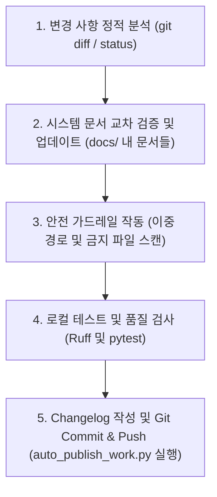

# Auto Publish Work Skill

> **작성일**: 2026-07-14
> **버전**: v1.0.0
> **설계 목적**: 에이전트가 구현 작업을 완료한 후, 변경 내역을 바탕으로 시스템 문서 정합성을 분석하여 일괄 업데이트하고, 린트/테스트 검증과 Changelog 작성을 마친 뒤 Git 커밋 및 푸시까지의 마감 파이프라인을 안전하고 비대화형(Non-interactive)으로 일괄 수행하기 위함.

---

## 1. 개요 및 배경

Minchodan 프로젝트는 엄격한 코드 품질(Ruff 린트, 타입, 보안 검사), 이중 경로 분리 정책(반사 경로 내 LLM/RAG/TTS 임포트 금지), 그리고 문서와 실제 코드 간의 정합성 유지를 생명으로 합니다.
작업 완료 후 문서의 누락이나 잘못된 모델 가중치/보안 키(.env)가 원격 저장소에 업로드되는 사고를 방지하고, 에이전트가 일관되게 git commit & push를 수행할 수 있도록 전용 마감 스케줄러와 스킬 규격을 정의합니다.

---

## 2. 작업 수명 주기 및 실행 파이프라인

에이전트는 사용자로부터 "문서 업데이트 및 git commit, push를 하라"는 요청을 받았을 때 아래 5단계 파이프라인을 순차적으로 수행합니다.



---

## 3. 단계별 세부 실행 가이드

### Step 1: 변경 사항 정적 분석
- **도구**: `run_command`
- **명령어**: `git status --porcelain` 및 `git diff --stat`
- **목적**: 이번 회차에 어떤 파일들이 수정되었는지 명확한 목록을 획득합니다.

### Step 2: 시스템 문서 교차 검증 및 업데이트
- **원칙**: 변경 파일의 성격에 따라 아래 규칙에 맞춰 관련 문서를 동기화합니다.

| 변경 대상 파일 | 업데이트 및 확인 대상 문서 | 검토 요건 |
| :--- | :--- | :--- |
| **`server/api/`** 또는 **`client/`** | [api_specification.md](file:///Users/kwanbum/Documents/korea_IT/lanhchain_ai_vision/Minchodan/docs/design/api_specification.md) | WebSocket 메시지 타입 및 필드 정합성 일치 여부 확인 |
| **`server/detection/`** | [pipeline_stage_design.md](file:///Users/kwanbum/Documents/korea_IT/lanhchain_ai_vision/Minchodan/docs/design/pipeline_stage_design.md) | YOLO NMS-free, 노면 클래스 및 3단계 파이프라인 지연 목표 충족 여부 확인 |
| **`server/orchestration/`** | [stage6_orchestration_design.md](file:///Users/kwanbum/Documents/korea_IT/lanhchain_ai_vision/Minchodan/docs/stage-guides/stage6_orchestration_design.md) | LangGraph L1/L2/L3 제어 흐름 및 예외 Fallback 구조 부합 여부 확인 |
| **`.env.example`** 또는 **`.env`** | [environment_variables.md](file:///Users/kwanbum/Documents/korea_IT/lanhchain_ai_vision/Minchodan/docs/ops/environment_variables.md) | 환경변수 단일 명세서 테이블 내 신규 변수 기술 및 설명 보충 |
| **`requirements.txt`** | [README.md](file:///Users/kwanbum/Documents/korea_IT/lanhchain_ai_vision/Minchodan/README.md) | 패키지 추가 시 로컬 실행 세팅 가이드 업데이트 여부 확인 |

- **조치**: 식별된 관련 문서를 `view_file`로 먼저 읽어 위계 및 스타일(이모지 금지, 한국어 경어체 등)을 파악한 뒤, `replace_file_content`로 코드 구현 사항을 정확히 동기화합니다.

### Step 3: 안전 가드레일 및 검증 자동화 실행
- **도구**: `run_command`
- **실행 스크립트**: `scripts/auto_publish_work.py`
- **수행 방법**: 아래 명령어 옵션을 지정하여 비대화형으로 실행합니다.

```bash
python scripts/auto_publish_work.py \
  --initial <본인_이니셜> \
  --stage <1-7단계_번호> \
  --summary <작업_요약_식별자> \
  --prefix <커밋_접두어> \
  --desc "<커밋_세부_설명>"
```

#### 스크립트가 내부적으로 수행하는 5대 안전장치
1. **Ruff 린터 정합**: 파일 포맷 및 코딩 스타일 검사.
2. **이중 경로 검증**: 반사 경로(`server/detection/gates/`) 내부 코드에 LLM/RAG/TTS 관련 패키지가 정적 임포트되었는지 체크하여 위반 시 진행 차단.
3. **보안 및 가중치 파일 필터링**: `.env` 파일 및 `server/models/` 내 불필요한 `.pt`/`.onnx` 가중치 파일(추적 비대상)이 스테이징되는 것을 감지하면 즉시 작업 중단.
4. **단계별 테스트**: 각 단계의 주요 테스트 스크립트(`test_ws_echo.py` 등)를 자동 실행하여 통과 확인.
5. **Changelog 자동 작성 및 Git Commit/Push**: `docs/changelogs/<본인_이니셜>.md` 파일에 변경 내역을 수집하여 엔트리를 추가하고, `git commit` 및 `git push origin <본인_이니셜>`을 원스톱으로 안전하게 실행.

---

## 4. 예외 및 실패 대응 수칙

### 가. 이중 경로 검사 위반 경고 시
- 즉시 작업을 중단하고, 반사 경로 게이트 코드에서 LLM/RAG/TTS 관련 코드를 격리 및 제거하십시오.
- 반사 경로의 출력은 반드시 사전에 합성된 고정 WAV 파일(`data/reflex_clips/`)이어야 합니다.

### 나. 금지 파일 스테이징 경고 시
- `.env` 혹은 `.pt` 대용량 가중치 파일이 `git status`에 포착되었을 경우, 아래 명령어를 실행하여 스테이징을 해제하고 `.gitignore`에 추가하십시오.
  ```bash
  git restore --staged <경고된_파일명>
  ```

### 다. Git Push 실패 시 (Conflict 발생 등)
- 로컬 브랜치에 원격 변경 사항이 누락되어 푸시가 거절된 경우, 원격 브랜치를 pull/rebase하여 충돌을 해제한 다음 스크립트를 재실행하십시오.
  ```bash
  git pull --rebase origin <본인_이니셜>
  ```
