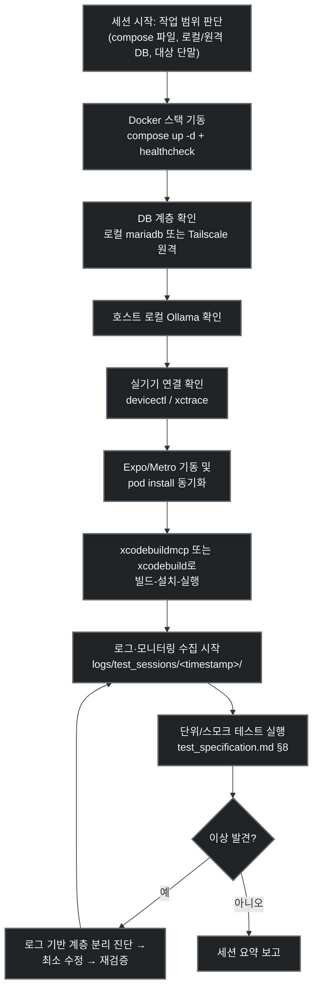

# 통합 테스트 환경 오케스트레이션 스킬 (iOS 실기기 - Docker - DB)

> **작성일**: 2026-07-18
> **버전**: v1.3.1 (2026-07-20: `metro_tailscale.sh`를 Python double-fork+`os.setsid()` detach로 보강 — Cursor 에이전트 셸 종료 후에도 Metro 유지. 이전 v1.3.0: 외부 LTE/핫스팟 Tailscale 사전 검증·Metro 이중 헬스체크·console compose 통합)
> **설계 기준**: `docs/ops/wireless_test_guide.md`, `docs/ops/test_specification.md`, `docs/ops/environment_variables.md`, `docs/db_tailscale_guide/README.md`, `docs/macOS_xcode_build/xcode_mcp_setup_guide.md`, `docs/macOS_xcode_build/ios_device_build_iteration_guide.md`
> **관련 스킬**: [`xcode-build-management`](../xcode-build-management/SKILL.md) (iOS 빌드 세부 절차 전담), 본 스킬은 그 위 계층(Docker+DB+로그/모니터링)까지 포함한 세션 오케스트레이션을 전담

---

## 개요

Minchodan은 `iOS 실기기(카메라·햅틱·오디오 하드웨어 의존) → FastAPI/Redis/MariaDB Docker 스택 → (로컬 또는 Tailscale 원격) MariaDB`의 3계층이 동시에 살아있어야 종단 검증이 가능합니다. 이 스킬은 새 세션이 시작될 때마다 사람이 터미널을 여러 개 열어 하나씩 켜는 대신, 에이전트가 아래를 일괄 판단·실행하도록 합니다.

1. Docker 스택(FastAPI + Redis + MariaDB, 또는 macOS CPU Fallback 구성) 기동
2. DB 계층 확인(로컬 컨테이너 DB 또는 Tailscale 경유 공동 원격 DB)
3. Expo/Metro 및 iOS 네이티브 의존성 동기화
4. `xcodebuildmcp` MCP 도구 또는 `xcodebuild`/`xcrun devicectl` CLI로 실기기 빌드-설치-실행
5. 전 구간 로그·모니터링을 세션별 디렉토리에 수집하며 실패 계층을 분리 진단(디버깅)

이 스킬은 사용자가 에이전트에게 위 실행 프로그램들에 대한 전면 실행 권한을 위임했다는 전제로 작성되었습니다. 단, "전면 권한"은 "안전 가드레일 생략"을 의미하지 않습니다 — 아래 [에이전트 권한 및 안전 가드레일](#에이전트-권한-및-안전-가드레일)을 항상 함께 지킵니다.

---

## 선행 의존성

| 구분 | 필수 요구사항 | 확인 명령 |
| :--- | :--- | :--- |
| **Docker** | Docker Desktop 또는 Colima, Compose v2 | `docker compose version` |
| **Xcode CLI** | Xcode + Command Line Tools | `xcode-select -p` |
| **CocoaPods** | iOS 네이티브 의존성 매니저 | `pod --version` |
| **Node.js** | v18/20 LTS, npm | `node -v && npm -v` |
| **xcodebuildmcp** | `.mcp.json`에 등록된 MCP 서버 | `.mcp.json`의 `mcpServers.xcodebuildmcp` 확인 |
| **실기기** | 케이블 연결, 잠금 해제, 신뢰 승인, 개발자 모드 | `xcrun devicectl list devices` |
| **호스트 로컬 Ollama** | gemma4:e4b, nomic-embed-text 적재 | `curl $OLLAMA_BASE_URL/api/tags` |
| **(선택) Tailscale** | 공동 원격 MariaDB/미디어 API 사용 시 | `tailscale status` |

---

## 디렉토리 구조 및 핵심 자산

| 경로 | 역할 |
| :--- | :--- |
| [`docker/docker-compose.yml`](../../../docker/docker-compose.yml) | GPU/원격 DB 기본 구성 (로컬 mariadb는 폴백용, 포트 미노출) |
| [`docker/docker-compose.macos.yml`](../../../docker/docker-compose.macos.yml) | macOS CPU Fallback + 로컬 mariadb 포트 노출 구성 |
| [`docker/Dockerfile`](../../../docker/Dockerfile) | FastAPI 서버 이미지 (TTS 자산 빌드 타임 프리페치 포함) |
| [`.mcp.json`](../../../.mcp.json) | `xcodebuildmcp` MCP 서버 등록 |
| `.xcodebuildmcp/config.yaml` / `Copy_config.yaml` | 공유 템플릿 / 개인 로컬값 (workspace, scheme, deviceId, bundleId) |
| [`client/ios/Minchodan.xcworkspace`](../../../client/ios/Minchodan.xcworkspace) | Xcode 빌드 대상 |
| 루트 `.env` / `client/.env` | 서버·DB 비밀 변수 / Expo 공개(`EXPO_PUBLIC_*`) 변수 |
| [`docs/ops/environment_variables.md`](../../../docs/ops/environment_variables.md) | 환경 변수 단일 기준 명세 |
| [`docs/ops/test_specification.md`](../../../docs/ops/test_specification.md) | 단계별 테스트 매트릭스·스모크 테스트·권장 실행 순서 |
| [`docs/ops/wireless_test_guide.md`](../../../docs/ops/wireless_test_guide.md) | 실기기 무선 연동 + Docker 인프라 명세 |
| [`docs/db_tailscale_guide/README.md`](../../../docs/db_tailscale_guide/README.md) | 공동 원격 DB 연결·에이전트 금지사항 |
| [`server/api/heartbeat.py`](../../../server/api/heartbeat.py) | 서버 헬스체크 엔드포인트 |
| [`server/mcp/gpu_monitor.py`](../../../server/mcp/gpu_monitor.py) | GPU 모니터링(Mock 폴백 포함) |

---

## 핵심 워크플로우



---

## 단계별 실행

### 0. 작업 범위 판단

세션 시작 직후, 다음을 먼저 결정합니다(사용자 지시가 없으면 합리적 기본값으로 진행하되 세션 요약에 명시).

| 결정 항목 | 기본값 | 참고 |
| :--- | :--- | :--- |
| Compose 파일 | macOS/GPU 미탑재 → `docker-compose.macos.yml`, NVIDIA GPU 탑재 → `docker-compose.yml` | `docs/ops/wireless_test_guide.md` §2 |
| DB 대상 | 팀 공동 원격 MariaDB(Tailscale) 우선, 오프라인 개발은 로컬 컨테이너 DB | `docker-compose.macos.yml` 26~40행 주석 |
| 대상 단말 | 연결된 실기기 우선, 없으면 iOS 시뮬레이터 | `xcrun devicectl list devices` |
| 네트워크 모드 | 실기기가 개발 PC와 같은 네트워크가 아니면 `client/.env`에 `EXPO_PUBLIC_NETWORK_MODE=tailscale` | `docs/ops/environment_variables.md` §2.11, §2.14 |

> **외부 LTE/핫스팟 테스트 시나리오 (2026-07-19 보완)**: 단말이 개발 PC와 같은 LAN이 아닌
> LTE/핫스팟/외부 WiFi에 연결된 경우, **반드시 `EXPO_PUBLIC_NETWORK_MODE=tailscale`** 로 설정합니다.
> 이 모드에서는 단말이 호스트의 Tailscale IP(`EXPO_PUBLIC_TAILSCALE_HOST`)로 FastAPI(`:8000`)와
> Metro(`:8081`)에 모두 접속합니다. **§3-B "Tailscale 네트워크 사전 검증"을 반드시 먼저 수행**해야
> 단말이 번들을 받지 못해 흰 화면이 뜨는 실패를 사전에 차단합니다(2026-07-19 실측: Metro가
> `localhost:8081`만 리스닝하고 Tailscale IP로 응답하지 않아 단말이 번들을 받지 못한 사례 반영).

### 1. Docker 스택 기동

> **필수: `--env-file .env`를 항상 명시합니다.** `-f docker/<compose file>`만 지정하면 Docker
> Compose는 프로젝트 디렉토리를 컴포즈 파일이 있는 `docker/`로 잡고, 그 안에 없는 `.env`를
> 찾습니다(`docker/.env`는 존재하지 않음). 그 결과 루트 `.env`의 `DB_HOST`(팀 공동 Tailscale
> 원격 DB 주소)가 전혀 반영되지 않고 `${DB_HOST:-mariadb}`가 조용히 `mariadb`(로컬, 대개 빈
> DB)로 폴백됩니다(2026-07-19 실측 발견 - `docker compose config`로 재현 확인, 로그인 실패의
> 실제 원인이었음). 항상 저장소 루트에서 `--env-file .env`를 붙여 실행합니다.

```bash
# macOS CPU Fallback (호스트 Ollama 연동). --env-file 없이 실행하지 않는다.
docker compose --env-file .env -f docker/docker-compose.macos.yml up -d --build

# GPU/원격 DB 환경 (기본 원격 DB_HOST 유지, 로컬 mariadb는 폴백 전용)
docker compose --env-file .env -f docker/docker-compose.yml up -d --build
```

헬스체크 대기(최대 20회, 5초 간격):

```bash
COMPOSE_FILE=docker/docker-compose.macos.yml
for i in $(seq 1 20); do
  status="$(docker inspect --format='{{.State.Health.Status}}' minchodan-mariadb 2>/dev/null || echo "starting")"
  [ "$status" = "healthy" ] && echo "mariadb healthy" && break
  sleep 5
done
docker compose --env-file .env -f "$COMPOSE_FILE" ps
curl -sf http://localhost:${WS_PORT:-8000}/ || echo "fastapi 헬스체크 실패 - server/api/heartbeat.py 라우트 확인"
```

FastAPI가 실제로 어떤 DB를 보고 있는지는 아래처럼 **비밀값을 제외한** 변수만 확인합니다
(`docker compose config`를 필터 없이 그대로 출력하면 `DB_PASSWORD` 평문이 그대로 찍힙니다 -
2026-07-19 실측: 필터 없이 `docker compose config | grep DB_HOST` 대신 넓은 범위를 출력해
비밀값이 노출된 사고가 있었음. 반드시 특정 키만 골라 출력합니다).

```bash
docker compose -f docker/docker-compose.macos.yml exec fastapi \
  sh -c 'echo "DB_HOST=$DB_HOST DB_PORT=$DB_PORT DB_NAME=$DB_NAME DB_USER=$DB_USER"'
```

### 2. DB 계층 확인

**로컬 컨테이너 DB 사용 시**: 위 헬스체크로 충분하며, 필요 시 아래로 스키마 확인.

```bash
docker compose -f docker/docker-compose.macos.yml exec mariadb \
  mariadb -u"${COMPOSE_DB_USER:-minchodan_team}" -p"${COMPOSE_DB_PASSWORD:-minchodan_password}" \
  -e "SELECT 1;"
```

**팀 공동 Tailscale 원격 DB 사용 시(기본값)**: `docs/db_tailscale_guide/README.md` §7·§10 순서를
그대로 읽기 전용으로 따릅니다(Tailscale 연결 → TCP 포트 → `SELECT 1` → 미디어 API 인증). 이
경로에서는 절대 `docker compose down -v`를 실행하지 않고, DDL/DROP/TRUNCATE도 실행하지
않습니다. **위 `--env-file .env` 없이 컴포즈를 띄우면 이 경로가 아니라 로컬 DB로 조용히
전환되어 관리자 계정이 하나도 없는 빈 DB를 보게 됩니다** - 콘솔 로그인이 항상 401로 실패하면
가장 먼저 이 항목을 의심합니다.

### 3. 호스트 로컬 Ollama 확인

```bash
curl -sf "${OLLAMA_BASE_URL:-http://localhost:11434}/api/tags" | head -c 300
docker compose exec fastapi sh -lc 'echo "OLLAMA_BASE_URL=$OLLAMA_BASE_URL"'
```

**시연(demo)에서 Mac mini가 LLM 전용 호스트일 때**: Windows FastAPI는 LAN으로 Mac Ollama에 붙는다. 시연 직전 Mac mini에서 `bash scripts/ollama_demo_keepalive.sh`를 실행해 모델 상주(`keep_alive=-1`)를 확보한다. 상세는 [`rpi-network-profile-switcher`](../rpi-network-profile-switcher/SKILL.md) 전제조건을 참조한다.

### 3-B. Tailscale 네트워크 사전 검증 (외부 LTE/핫스팟 테스트 시 필수)

> **2026-07-19 신설**: `EXPO_PUBLIC_NETWORK_MODE=tailscale` 일 때 단말이 호스트의 Tailscale IP로
> FastAPI(`:8000`)와 Metro(`:8081`)에 모두 도달할 수 있는지 사전 검증합니다. 이 단계를 건너뛰면
> 단말이 번들을 받지 못해 흰 화면이 뜨는 실패가 발생합니다(2026-07-19 실측 사례 반영).

```bash
# 1) 호스트 Tailscale IP 확인
HOST_TS_IP="$(tailscale ip -4 | head -1)"
echo "호스트 Tailscale IP: $HOST_TS_IP"

# 2) client/.env의 EXPO_PUBLIC_TAILSCALE_HOST 가 호스트 Tailscale IP와 일치하는지
TS_HOST_IN_ENV="$(grep '^EXPO_PUBLIC_TAILSCALE_HOST=' client/.env | cut -d= -f2)"
[ "$TS_HOST_IN_ENV" = "$HOST_TS_IP" ] \
  && echo "ENV 일치: $TS_HOST_IN_ENV" \
  || echo "ENV 불일치: env=$TS_HOST_IN_ENV vs host=$HOST_TS_IP - client/.env 수정 필요"

# 3) 단말이 Tailscale에 연결되어 있는지 (호스트 → 단말 ping)
#    xcrun devicectl list devices 의 Identifier(CoreDevice) 와 tailscale status 의 단말 IP 를 대조
tailscale status | grep -i iphone
tailscale ping <단말_TAILSCALE_IP>   # pong 이면 단말 Tailscale 정상

# 4) FastAPI 가 Tailscale IP 로 응답하는지 (0.0.0.0 바인딩 전제)
curl -sf -o /dev/null -w "FastAPI $HOST_TS_IP:8000 → HTTP %{http_code}\n" \
  --max-time 5 "http://$HOST_TS_IP:8000/"
#    HTTP 200 이면 정상. 000 이면:
#      - docker port minchodan-fastapi 가 0.0.0.0:8000 인지 확인 (127.0.0.1 이면 Tailscale 차단)
#      - macOS 방화벽이 :8000 인바운드를 차단하는지 확인

# 5) Metro 가 Tailscale IP 로 응답하는지 (§5 실행 후 재확인)
curl -sf -o /dev/null -w "Metro $HOST_TS_IP:8081 → HTTP %{http_code}\n" \
  --max-time 5 "http://$HOST_TS_IP:8081/"
#    HTTP 200 이면 정상. 000 이면 Metro 가 0.0.0.0 으로 바인딩되지 않은 것 -
#    `client/.env` 의 EXPO_PUBLIC_NETWORK_MODE=tailscale 일 때 Metro 가 자동으로
#    0.0.0.0 을 바인딩해야 하지만, 안 될 경우 `npm run start -- --host 0.0.0.0` 명시.
```

| 검증 항목 | 정상 기준 | 실패 시 대응 |
| :--- | :--- | :--- |
| 호스트 Tailscale IP | `tailscale ip -4` 로 100.x.x.x 반환 | Tailscale 미실행 → `tailscale up` |
| `EXPO_PUBLIC_TAILSCALE_HOST` 일치 | env 값 == 호스트 IP | `client/.env` 수정 |
| 단말 Tailscale 연결 | `tailscale ping <단말 IP>` → pong | 단말 설정 → Tailscale 앱 켜기 |
| FastAPI Tailscale 도달 | `http://<TS IP>:8000/` → 200 | `docker port` 확인(0.0.0.0), macOS 방화벽 |
| Metro Tailscale 도달 | `http://<TS IP>:8081/` → 200 | `--host 0.0.0.0` 명시 또는 `EXPO_PUBLIC_NETWORK_MODE` 재확인 |

### 4. iOS 실기기 연결 확인

```bash
xcrun devicectl list devices
xcrun xctrace list devices
xcodebuild -showdestinations -workspace client/ios/Minchodan.xcworkspace -scheme Minchodan
```

가능하면 `xcodebuildmcp` MCP 도구(`list_devices`, `list_simulators` 계열)를 CLI보다 우선 사용합니다. 상세 매핑은 [`docs/macOS_xcode_build/xcode_mcp_setup_guide.md`](../../../docs/macOS_xcode_build/xcode_mcp_setup_guide.md) §6을 참조합니다.

### 5. Expo/Metro 및 네이티브 의존성 동기화

```bash
cd client && npm install
npx expo prebuild                 # 최초 1회 또는 네이티브 설정 변경 시
cd ios && pod install && cd ../..
```

Metro는 빌드/실행 전에 별도 백그라운드 프로세스로 계속 떠 있어야 합니다.

> **2026-07-20 고정 운영**: Metro는 `scripts/metro_tailscale.sh`로만 기동/종료/실기기 실행한다.
> - `start`: 이미 `:8081`이 살아 있으면 **kill 하지 않고 유지**
> - `launch`: Tailscale 딥링크로 Dev Client 실행 (Bonjour 검색 우회)
> - `stop`/`restart`: 명시적 재기동에서만 kill
>
> ```bash
> bash scripts/metro_tailscale.sh start
> bash scripts/metro_tailscale.sh status
> bash scripts/metro_tailscale.sh launch
> ```
>
> 에이전트는 세션마다 `lsof -ti:8081 | xargs kill`을 하지 않는다. status가 DOWN일 때만 start.
>
> **macOS**: bash `setsid` CLI는 없지만, 스크립트가 Python double-fork + `os.setsid()`로
> 에이전트/터미널 세션과 분리한다(`nohup`만으로는 Cursor 에이전트 셸 종료 시 회수되는 실측).
> `status`에 `detach: OK (ppid=1)`이 보이면 세션 독립 기동이다.
> **Expo host**: `--host 0.0.0.0`은 거부된다. `--host lan` + `REACT_NATIVE_PACKAGER_HOSTNAME=<Tailscale IPv4>`.
> 번들 캐시 클리어가 필요할 때만 `METRO_CLEAR=1 bash scripts/metro_tailscale.sh restart`.

```bash
# (레거시) 직접 기동이 필요할 때만 — 가능하면 metro_tailscale.sh 사용
cd client && REACT_NATIVE_PACKAGER_HOSTNAME="$(tailscale ip -4 | head -1)" \
  npx expo start --host lan --port 8081 --scheme minchodan
```

**Metro 헬스체크 (이중 경로 - localhost + Tailscale IP)**:

```bash
bash scripts/metro_tailscale.sh status
# 또는
curl -sf -o /dev/null -w "Metro localhost:8081 → HTTP %{http_code}\n" --max-time 5 http://localhost:8081/status
HOST_TS_IP="$(tailscale ip -4 | head -1)"
curl -sf -o /dev/null -w "Metro $HOST_TS_IP:8081 → HTTP %{http_code}\n" --max-time 5 "http://$HOST_TS_IP:8081/status"
```

> **주의**: `localhost:8081` 이 200 이고 `<Tailscale IP>:8081` 이 000 이면 Tailscale 경로가
> 막힌 것입니다. `REACT_NATIVE_PACKAGER_HOSTNAME`과 방화벽을 재확인합니다.
> Metro 번들 빌드는 단말이 실제로 번들을 요청할 때 진행되므로, 첫 빌드는 1~2분 소요될 수 있습니다.

### 5-B. 운영 콘솔(console) 프론트 기동

> **자주 누락되던 단계였으나 2026-07-19 compose 통합으로 자동화.** iOS 실기기·Docker·DB만
> 띄우고 `console/`(React 운영자 모니터링 콘솔, Vite dev server)을 기동하지 않으면, 탐지 로그·MCP
> 모니터·관리자 로그인 확인 등 콘솔에서만 볼 수 있는 검증을 전혀 할 수 없습니다. 2026-07-19부터
> `console` 서비스가 `docker/docker-compose.macos.yml`·`docker/docker-compose.yml`에 추가되어
> §1의 `docker compose up -d` 한 줄에 FastAPI·Redis·MariaDB·Console 4개 컨테이너가 함께 기동됩니다.
> 별도 `npm run dev` 단계가 더 이상 필요 없습니다.

```bash
# §1 compose 실행만으로 console 컨테이너가 자동 기동됨. 별도 실행 불필요.
# 기동 확인:
curl -sf -o /dev/null -w "%{http_code}" http://localhost:5174/   # 200이면 정상
docker compose -f docker/docker-compose.macos.yml logs -f console  # 로그 확인
```

기본 포트는 `${CONSOLE_PORT:-5174}:5174`(`docker-compose.*.yml`의 `console` 서비스). 콘솔 컨테이너는
`VITE_PROXY_TARGET=http://fastapi:8000` 환경 변수로 FastAPI 컨테이너를 Vite 프록시 타깃으로 지정합니다
(`console/vite.config.ts`가 `process.env.VITE_PROXY_TARGET`을 읽음, 기본값 `http://127.0.0.1:8000`).
FastAPI 컨테이너를 재생성/재시작한 직후에는 `docker compose logs console`에 `ws proxy error`/`ECONNREFUSED`가
잠깐 찍힐 수 있습니다(재연결되면 정상, 지속되면 FastAPI 헬스체크부터 재확인). 호스트에서 직접
`cd console && npm run dev`를 실행하는 레거시 경로도 `VITE_PROXY_TARGET` 미설정 시 기본값이
적용되므로 여전히 작동합니다.

### 6. 실기기 빌드-설치-실행

세부 절차는 [`xcode-build-management`](../xcode-build-management/SKILL.md)와 [`docs/macOS_xcode_build/ios_device_build_iteration_guide.md`](../../../docs/macOS_xcode_build/ios_device_build_iteration_guide.md)를 그대로 따르되, 본 스킬에서는 출력 로그를 세션 디렉토리로 반드시 tee합니다(다음 절 참조).

### 7. 로그·모니터링 관리 체계

세션 시작 시 로그 디렉토리를 만듭니다(`logs/`는 루트 `.gitignore` 63행에 이미 등록되어 있어 커밋 걱정 없이 로컬 보관 가능).

```bash
SESSION_TS="$(date +%Y%m%d_%H%M%S)"
LOG_DIR="logs/test_sessions/${SESSION_TS}"
mkdir -p "$LOG_DIR"
```

| 계층 | 수집 명령 | 저장 위치 |
| :--- | :--- | :--- |
| Docker 전체 | `docker compose -f <compose file> logs -f --no-color` (백그라운드) | `$LOG_DIR/docker_compose.log` |
| FastAPI 단일 | `docker compose -f <compose file> logs -f fastapi` | `$LOG_DIR/fastapi.log` |
| MariaDB 헬스 | `docker inspect --format='{{json .State.Health}}' minchodan-mariadb` | `$LOG_DIR/mariadb_health.json` |
| Redis | `docker compose exec redis redis-cli ping` | 즉시 확인, 필요 시 결과 기록 |
| 관제 SSE 스트림 (TC-MCP-001) | `curl -N http://localhost:8000/api/v1/monitor/stream` | `$LOG_DIR/monitor_stream.log` |
| Metro | 백그라운드 실행 출력 리다이렉트 | `$LOG_DIR/metro.log` |
| Xcode 빌드 | 6단계 `xcodebuild ... build 2>&1 \| tee` | `$LOG_DIR/xcodebuild.log` |
| 단말 콘솔 | `xcrun devicectl device process launch --console ...` | `$LOG_DIR/device_console.log` |
| GPU 모니터 | `server/mcp/gpu_monitor.py` 또는 `MOCK_GPU_USAGE_PCT` | `$LOG_DIR/gpu_monitor.log` |

디버깅 시에는 이 로그들을 계층별로 대조해 "단말/네트워크/서버/DB/GPU" 중 어디서 끊겼는지 먼저 분리하고, 상세 트러블슈팅 표는 `references/implementation_detail.md`를 참조합니다.

### 8. 통합 스모크 및 단위 테스트 실행

`docs/ops/test_specification.md` §8의 권장 순서를 그대로 실행합니다: 정적 분석 게이트 → GPU 검증 → 7개 단계 단위 테스트 → RAG hit-rate 평가 → §7의 `TC-SMOKE-001~006` 통합 smoke(특히 `TC-SMOKE-004` Docker 구성, `TC-SMOKE-006` RAG 통합 검증).

---

## 에이전트 권한 및 안전 가드레일

이 세션에서 사용자는 에이전트에게 아래 실행 권한을 전면 위임합니다(매 단계 재확인 없이 진행 가능).

- Docker compose 기동/재시작/로그 조회(`up`, `restart`, `logs`, `exec` 진단)
- `xcodebuildmcp` MCP 도구 및 `xcodebuild`/`xcrun devicectl`/`xctrace` CLI 전체
- Expo/Metro/npm 스크립트 실행, `pod install`, `expo prebuild`
- 로그 파일 생성·tee·tail 등 모니터링 프로세스 기동

단, "전면 권한"은 아래 금지 사항을 생략할 수 있다는 뜻이 아닙니다(`docs/db_tailscale_guide/README.md` §15.3, `.agents/skills/auto-publish-work/SKILL.md`의 안전장치를 계승):

| 금지 행동 | 이유 |
| :--- | :--- |
| `docker compose down -v` | 로컬 MariaDB/Redis 영속 볼륨 삭제, 원인 증거 소실 |
| 공동/원격 DB에 `DROP`/`TRUNCATE`/무조건 `CREATE`, 미승인 마이그레이션 실행 | 팀 공유 데이터 손실 |
| `.env` 전체 내용 `cat`/출력, 비밀값을 명령 인자·로그·채팅에 노출 | DB 비밀번호·API 토큰·미디어 API 토큰 유출 |
| `docker compose config`를 필터 없이 그대로 출력(전체 또는 `DB_HOST` 주변 넓은 범위) | `environment:` 블록에 `DB_PASSWORD` 등 비밀값이 평문 해석되어 함께 출력됨(2026-07-19 실측 사고) - 확인이 필요하면 `sh -c 'echo "DB_HOST=$DB_HOST ..."'`처럼 원하는 키만 골라 출력 |
| `server/detection/gates/`(반사 경로)에 LLM/RAG/TTS 임포트 추가 | 이중 경로 분리 정책 위반 |
| 개인 절대경로·단말 UDID·Apple 계정 정보를 공유 문서/커밋에 남기기 | `.xcodebuildmcp/Copy_config.yaml`에만 보관(`docs/ops/local_private_config_guide.md`) |
| 실제 사용자 STT 음성/이벤트 프레임을 진단 로그로 출력 | 개인정보 노출 |

동일 실패가 3회 이상 반복 재현되면 즉시 재시도를 반복하지 말고, 수집한 로그를 근거로 원인 파일과 최소 수정안을 먼저 보고한 뒤 진행합니다.

---

## 세션 종료 시 정리

```bash
docker compose -f <compose file> ps
# 볼륨은 보존하고 컨테이너만 정지할 때
docker compose -f <compose file> stop
```

`$LOG_DIR`의 로그는 다음 세션을 위해 보존합니다. 팀 공유가 필요한 이슈는 개인 식별자(UDID, 절대경로, 계정)를 제거한 뒤 관련 `docs/changelogs/<이니셜>.md`에 요약을 남깁니다.

---

## 주의 사항

- **compose 파일 선택**: GPU 유무와 DB 대상(로컬/원격)에 따라 `docker-compose.yml` vs `docker-compose.macos.yml`을 혼동하지 않습니다.
- **Metro와의 정합성**: 실기기 빌드/실행 전 Metro가 이미 떠 있어야 런타임 연결 오류가 나지 않습니다.
- **로그 우선 디버깅**: 재현 전에 로그부터 대조하여 계층을 분리하고, 자세한 오류 패턴 대응표는 [`references/implementation_detail.md`](references/implementation_detail.md)를 참조합니다.
