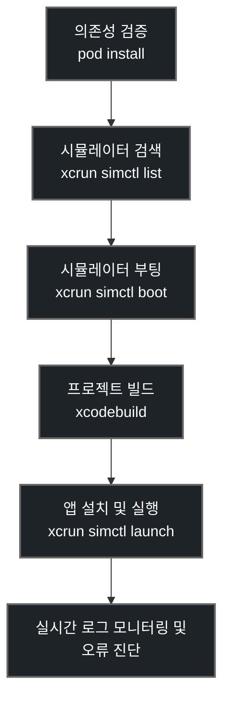

# Xcode Build & Debugging Skill (Xcode 빌드 및 디버깅 스킬)

> **작성일**: 2026-07-05
> **버전**: v1.0.0
> **설계 기준**: `docs/minchodan_design_note.md` 및 iOS thin client 아키텍처
> **코딩 패턴 준수**: [`docs/dev-guides/course_codebase_guide.md`](../../../docs/dev-guides/course_codebase_guide.md)

---

## 개요

Minchodan 프로젝트의 클라이언트는 **React Native thin client**로 구성되어 있습니다. 에이전트가 iOS 네이티브 브릿지(`CoreMLInferenceBridge.swift` 등)를 수정하거나 Xcode를 빌드하여 동작을 검증할 때, 외부 MCP 서버가 아닌 native Xcode CLI 도구(`xcodebuild`, `xcrun simctl`)를 활용하여 주도적으로 문제를 분석하고 빌드/수정을 수행하기 위한 전용 스킬 가이드입니다.

---

## 선행 의존성

iOS 빌드 및 시뮬레이션 제어를 위해 에이전트 환경(macOS)에서 다음이 준비되어 있어야 합니다.

- Xcode 및 Xcode Command Line Tools (`xcodebuild`)
- CocoaPods (`pod`)
- Node.js 및 React Native CLI 환경 (Metro 번들러)
- `jq` (시뮬레이터 JSON 목록 파싱용, 시스템에 설치되어 있지 않으면 `grep`/`awk` 등으로 대체 가능)

---

## 디렉토리 구조 및 핵심 자산

이 스킬이 적용되는 주요 경로는 다음과 같습니다.

| 경로 | 역할 |
|---|---|
| [`client/ios/`](file:///Users/kwanbum/Documents/korea_IT/lanhchain_ai_vision/Minchodan/client/ios) | iOS 네이티브 프로젝트 및 CocoaPods 설정 경로 |
| [`client/ios/Minchodan.xcworkspace`](file:///Users/kwanbum/Documents/korea_IT/lanhchain_ai_vision/Minchodan/client/ios/Minchodan.xcworkspace) | Xcode 작업 공간 파일 (빌드 대상) |
| [`client/ios/Podfile`](file:///Users/kwanbum/Documents/korea_IT/lanhchain_ai_vision/Minchodan/client/ios/Podfile) | CocoaPods 의존성 명세 |
| [`client/ios/Minchodan/CoreMLInferenceBridge.swift`](file:///Users/kwanbum/Documents/korea_IT/lanhchain_ai_vision/Minchodan/client/ios/Minchodan/CoreMLInferenceBridge.swift) | 온디바이스 CoreML 추론 브릿지 소스코드 |

---

## 핵심 워크플로우



### 1. CocoaPods 의존성 설치 및 갱신

네이티브 모듈이나 환경 변화가 감지되었을 때, `client/ios` 폴더에서 Pod 의존성을 동기화해야 합니다.

```bash
# Apple Silicon (M1/M2/M3 등) 아키텍처 지원이 필요할 수 있습니다.
cd client/ios && arch -x86_64 pod install
# 또는 일반적인 pod install
cd client/ios && pod install
```

### 2. 빌드 대상 시뮬레이터 탐색 및 기동

```bash
# 부팅된 시뮬레이터 확인
xcrun simctl list devices | grep "Booted"

# 사용 가능한 전체 iOS 시뮬레이터 확인 (JSON 포맷)
xcrun simctl list devices available --json
```

특정 기기(예: "iPhone 15")의 `UDID`를 확보한 후 기동합니다.
```bash
xcrun simctl boot <UDID>
```

### 3. xcodebuild를 이용한 빌드

React Native 프로젝트는 `.xcworkspace` 파일을 타겟으로 빌드하며, derivedDataPath를 명시하여 빌드 산출물을 지정된 경로에 확보하는 것이 에러 추적 및 관리상 유리합니다.

```bash
# Debug 설정으로 Simulator 대상 빌드 실행
xcodebuild \
  -workspace client/ios/Minchodan.xcworkspace \
  -scheme Minchodan \
  -destination "platform=iOS Simulator,id=<UDID>" \
  -configuration Debug \
  -derivedDataPath client/ios/build \
  build
```

### 4. 앱 설치 및 실행

```bash
# 빌드된 .app 경로 탐색
APP_PATH=$(find client/ios/build -name "Minchodan.app" -type d | head -1)

# 시뮬레이터에 설치
xcrun simctl install <UDID> "$APP_PATH"

# 앱 실행 (Bundle ID: com.minchodan.app.kwanbum)
xcrun simctl launch <UDID> com.minchodan.app.kwanbum
```

### 5. 런타임 디버깅 및 스크린샷 캡처

```bash
# 런타임 콘솔 로그 스트리밍 (시뮬레이터 전체)
xcrun simctl spawn <UDID> log stream --level debug --process Minchodan

# 화면 정상 렌더링 검증을 위한 스크린샷 캡처
xcrun simctl io <UDID> screenshot client/ios/build/screenshot_preview.png
```

---

## Swift 및 SwiftUI 코드 작성 및 리팩토링 규칙

에이전트가 `CoreMLInferenceBridge.swift` 등 iOS 스택의 Swift 파일을 편집하거나 리팩토링할 때는 다음 구조적 배치 기준을 준수해야 합니다.

1. **클래스 및 뷰 구성요소의 논리적 배치 순서**:
   - Environment 및 External Configuration 설정
   - Private / Public Constants 및 Variable 선언
   - Initializer (`init`)
   - Core Logic 함수
   - Async Helper 및 Delegation
2. **Swift Concurrency 사용 지침**:
   - `@MainActor`를 사용한 UI 스레드 바인딩 준수.
   - GCD (`DispatchQueue.main.async`) 대신 Swift 최신 동시성 구조 (`Task`, `await`) 지향.
3. **오류 처리 가드레일**:
   - 옵셔널 바인딩 (`if let`, `guard let`)을 통한 강제 언래핑(`!`) 제거.
   - CoreML 컴파일 및 메모리 할당 장애 발생 시 Safe fallback 메커니즘 제공.

---

## 주의 사항 및 린트 가이드

- **Metro 번들러와의 정합성**: 빌드 실행 전 `npm start` 또는 `npx expo start`를 백그라운드 태스크로 띄워두어야 앱 실행 시 Metro 번들러 연결 오류가 나지 않습니다.
- **아키텍처 미스매치**: 시뮬레이터 빌드 시 `Excluded Architectures` 관련 빌드 에러가 나면, Podfile 내 `post_install` 훅을 확인하거나 Build Settings의 `EXCLUDED_ARCHS`를 수정해야 합니다.
- **상세 에러 해결 방안**: 더 상세한 빌드 환경 분석 및 디버깅 팁은 [`references/implementation_detail.md`](references/implementation_detail.md) 파일을 참조하십시오.
