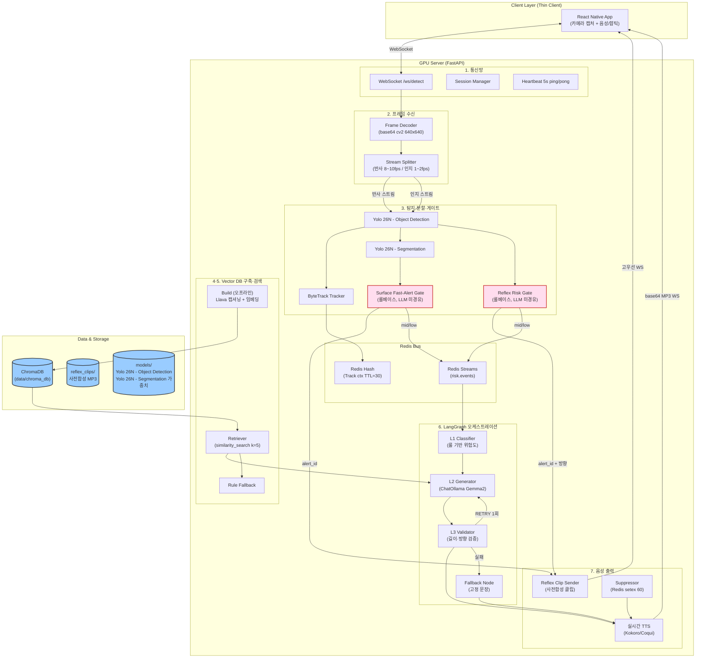
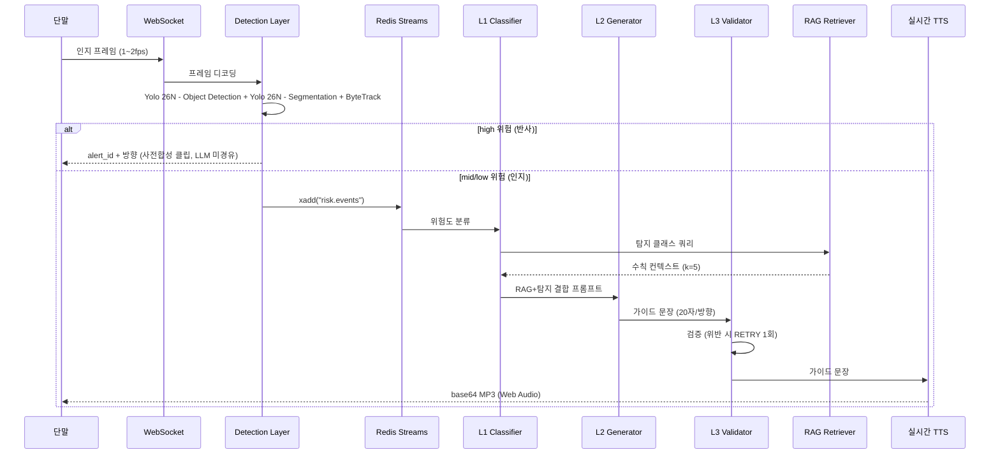

# Minchodan 시스템 아키텍처 설계서

> **작성일**: 2026-06-24
> **버전**: v0.2.0
> **설계 기준**: `docs/minchodan_design_note.md` (7단계 골격, 비전 설계서 v1.1)
> **코딩 패턴 기준**: [`docs/course_codebase_guide.md`](course_codebase_guide.md) (수업 전체 코드베이스 코딩 패턴·함수 시그니처 표준)

---

## 1. 프로젝트 개요

Minchodan은 시각장애인 보행 보조를 위한 스마트 가이드독 AI 플랫폼입니다. 스마트폰 카메라로 주변을 캡처해 GPU 서버로 전송하고, 서버에서 장애물·노면 상태를 실시간으로 탐지·분할한 뒤, 위험도에 따라 두 갈래 안전 대응 경로로 분기합니다. 가장 큰 특징은 **이중 경로 물리 분리 원칙**(비협상)입니다.

---

## 2. 기술 스택

### 서버 (GPU 추론)

- Python 3.13, FastAPI, uvicorn, asyncio
- Ultralytics Yolo 26N - Object Detection, Yolo 26N - Segmentation
- ByteTrack (객체 추적)
- Redis (Streams 이벤트 버스 + Track 컨텍스트 TTL=30)
- LangGraph + LangChain (L1/L2/L3 오케스트레이션)
- Ollama (Llava 캡셔닝, Gemma2:9b 가이드 생성, nomic-embed-text 임베딩)
- ChromaDB (로컬 파일 기반 벡터 저장소)
- Kokoro-82M / Coqui (로컬 TTS)
- OpenCV (프레임 디코딩)

### 클라이언트 (단말)

- React Native (iOS/Android)
- react-native-vision-camera (후면 카메라, 이중 캡처 타이머)
- Web Audio API (인지 음성 재생)
- Haptics + announceForAccessibility (접근성)

### 운영 콘솔

- React (운영자 모니터링용)
- SSE 또는 WebSocket 구독

### 인프라

- Docker (Redis + Ollama + FastAPI 컨테이너)
- CUDA 12.8 + cu128 PyTorch 휠 (Blackwell sm_120 전제)

---

## 3. 시스템 아키텍처 구성도

---

## 4. 디렉토리 구조 및 기능 매핑

| 디렉토리 / 파일                               | 기능적 역할                                                  | 단계 |
| :-------------------------------------------- | :----------------------------------------------------------- | :--- |
| `server/api/`                                 | WebSocket 엔드포인트, 세션 관리, 하트비트                    | 1    |
| `server/api/ws_router.py`                     | `APIRouter` + `WebSocket /ws/detect`                         | 1    |
| `server/api/session_manager.py`               | `device_token` 검증, `session_id` 발급                       | 1    |
| `server/api/heartbeat.py`                     | 5초 ping/pong asyncio 루프                                   | 1    |
| `server/capture/frame_decoder.py`             | base64 `np.frombuffer` `cv2.imdecode` resize(640,640)        | 2    |
| `server/capture/stream_splitter.py`           | 반사 스트림(8~10fps) / 인지 스트림(1~2fps) 분기              | 2    |
| `server/detection/yolo_detector.py`           | Yolo 26N - Object Detection `predict(conf=0.35)`, boxes 파싱 | 3    |
| `server/detection/yolo_segmentor.py`          | Yolo 26N - Segmentation 마스크 생성                          | 3    |
| `server/detection/bytetrack_tracker.py`       | ByteTrack `update()` track_id 부여                           | 3    |
| `server/detection/gates/reflex_gate.py`       | Reflex Risk Gate (고위험 + 근접 alert_id+방향)               | 3    |
| `server/detection/gates/surface_gate.py`      | Surface Fast-Alert Gate (P0 노면 하단 검출 alert_id)         | 3    |
| `server/detection/schemas.py`                 | `DetectionResult`, `SurfaceResult`, `RiskEvent` 타입         | 3    |
| `server/rag/build/frame_extractor.py`         | 영상 1fps 프레임 추출                                        | 4    |
| `server/rag/build/dedup_phash.py`             | pHash 중복 제거                                              | 4    |
| `server/rag/build/llava_captioner.py`         | Ollama(Llava) 한글 캡셔닝                                    | 4    |
| `server/rag/build/db_builder.py`              | `Chroma.from_documents(persist_directory)`                   | 4    |
| `server/rag/retriever.py`                     | `similarity_search_with_score(k=5)`                          | 5    |
| `server/rag/fallback.py`                      | 유사도 미달 시 룰 기반 fallback 문자열                       | 5    |
| `server/rag/vector_db_factory.py`             | Chroma Qdrant 핫스왑 추상화                                  | 4·5  |
| `server/orchestration/state.py`               | `OrchState` TypedDict (event, risk_level, rag_context)       | 6    |
| `server/orchestration/graph.py`               | `StateGraph` 조립, 노드 등록, 엣지 정의                      | 6    |
| `server/orchestration/nodes/l1_classifier.py` | L1 룰 기반 위험도 분류 (mid/low만 진입)                      | 6    |
| `server/orchestration/nodes/l2_generator.py`  | L2 ChatOllama(Gemma2) ainvoke (20자/방향)                    | 6    |
| `server/orchestration/nodes/l3_validator.py`  | L3 길이·방향 키워드 검증, RETRY(최대 1회)                    | 6    |
| `server/orchestration/nodes/fallback_node.py` | 최종 실패 고정 문장                                          | 6    |
| `server/orchestration/llm_client_factory.py`  | `BaseChatModel` Ollama gpt-4o-mini 핫스왑                    | 6    |
| `server/tts/realtime_tts.py`                  | 인지 경로 Kokoro/Coqui `generate()` base64 MP3               | 7    |
| `server/tts/reflex_clip_sender.py`            | 반사 경로 alert_id 사전합성 클립 WS 고우선 전송              | 7    |
| `server/tts/suppressor.py`                    | Redis `setex(suppress:…, 60)` 중복 억제                      | 7    |
| `server/tts/tts_service.py`                   | `TTSService` 추상화, MP3/WAV 규격 통일                       | 7    |
| `server/bus/redis_client.py`                  | aioredis 연결 풀                                             | 3·6  |
| `server/bus/producer.py`                      | `xadd("risk.events", …)` 인지 경로 발행                      | 3    |
| `server/bus/consumer.py`                      | `xread` 구독, orchestration 진입                             | 6    |
| `server/models/yolo26n/`                      | Yolo 26N - Object Detection 및 Yolo 26N - Segmentation 가중치 (git-ignore) | 3 |
| `data/raw/`                                   | AI Hub 보행자 데이터셋 원본                                  | 4    |
| `data/frames/`                                | 영상 1fps 추출 프레임                                        | 4    |
| `data/deduped/`                               | pHash 중복 제거 후 프레임                                    | 4    |
| `data/captions/`                              | Llava 캡셔닝 결과 JSON                                       | 4    |
| `data/chroma_db/`                             | ChromaDB persist 디렉토리                                    | 4    |
| `data/reflex_clips/`                          | 사전합성 반사 음성 클립 (alert_id별 MP3)                     | 7    |
| `training/`                                   | 모델 학습 (오프라인)                                         | 3    |
| `client/src/hooks/useWebSocket.ts`            | WS 연결·hello/welcome 핸드셰이크                             | 1    |
| `client/src/hooks/useCamera.ts`               | `useCameraDevice('back')` + 이중 타이머                      | 2    |
| `client/src/services/frameCapture.ts`         | `takePhoto({qualityPrioritization:'speed'})` base64          | 2    |
| `client/src/services/audioPlayer.ts`          | `decodeAudioData()` Web Audio 재생                           | 7    |
| `client/src/services/reflexClipPlayer.ts`     | 반사 클립 즉시 재생 (선점 로직)                              | 7    |
| `client/src/utils/haptics.ts`                 | Haptics + `announceForAccessibility`                         | 7    |
| `console/src/`                                | 운영자 모니터링 (DetectionFeed, RiskEventLog, SessionStatus) | -    |

---

## 5. 7단계 컴포넌트 상세

### 5.1 1단계 - 서버-앱 실시간 통신 (WebSocket)

- `FastAPI()` + `CORSMiddleware` `APIRouter().websocket("/ws/detect")`
- `ws.accept()` welcome 송신 hello 수신·디바이스 토큰 검증 5초 ping/pong 하트비트 루프
- `WebSocketDisconnect` 포착 소켓 close + 리소스 해제
- 완료 후 2단계에 WS 엔드포인트 공유

### 5.2 2단계 - 카메라 화면 전송 (이중 캡처)

- `react-native-vision-camera` 권한·후면 카메라 **이중 타이머**로 캡처
- 반사 캡처 8~10fps / 인지 캡처 1~2fps 분리 (v1.1 반영, 충돌 회피)
- `takePhoto({qualityPrioritization:'speed'})` JPEG base64 `ws.send()`
- 서버: `base64.b64decode` `np.frombuffer` `cv2.imdecode` `resize(640,640)` ack
- 카메라 권한 거부(`NotAllowedError`); 소켓 유실 시 `clearInterval`로 타이머 자원 즉시 해제

### 5.3 3단계 - AI 장애물 실시간 인식 (듀얼헤드 + 이중 게이트) v1.1 핵심

1. `cv2.imdecode`로 프레임 복원
2. **Yolo 26N - Object Detection** `predict(conf=0.35)` 클래스·bbox 파싱
3. **Yolo 26N - Segmentation** 노면 의미 분할 마스크
4. **ByteTrack** `update()` Track ID 부여, Redis `hset`+TTL=30 접근/이탈·속도 산출
5. **Reflex Risk Gate(룰베이스, LLM 미경유)**: 고위험 클래스 && 근접(면적·하단) 즉시 `alert_id`+방향
6. **Surface Fast-Alert Gate(룰베이스)**: P0 노면(횡단보도/맨홀/계단/그레이팅/점자블록파손) 하단 검출 즉시 `alert_id`
7. mid/low만 `redis_bus.xadd("risk.events", …)`로 인지 경로에 발행

노면 클래스 분리(C2): `braille normal/damaged`, `sidewalk normal/damaged`, `crosswalk`, `roadway`, `caution`(stairs/manhole/grating)을 **독립 클래스**로 분리합니다.

### 5.4 4단계 - 위험 대처 수칙 DB 구축 (RAG 시드, 오프라인 배치)

- 영상/사진 100+ 수집 1fps 프레임 추출 pHash 중복 제거
- 로컬 VLM(Llava) 한글 캡셔닝 로컬 임베딩(nomic-embed-text, 768d)
- `Document` + 메타etadata(`scene_type`, `risk_level`, `objects`, `guidance_template`) `Chroma.from_documents(persist_directory)`
- 메타데이터 `objects`·`scene_type`을 3단계 분리 클래스(예: `braille_damaged`)와 일치시켜 검색 정합 확보

### 5.5 5단계 - 실시간 대처 수칙 검색 (RAG)

- `Chroma(persist_directory, embedding_function)` 읽기 전용 로드
- 탐지 클래스로 쿼리 생성(`f"{label} 보행 중 회피 방법"`) `similarity_search_with_score(query, k=5)`
- `page_content` 결합 LangGraph `state["rag_context"]` 저장
- 미적중 시 룰 기반 fallback
- `VectorDBFactory`로 Chroma Qdrant 추상화

### 5.6 6단계 - 종합 회피 가이드 생성 (LangGraph 계층 LLM)

- `StateGraph(OrchState)` 조립
- **L1**: 룰 기반 위험도 분류 (high는 이미 즉시 경보 처리됨 / mid·low만 진입)
- **L2**: RAG+탐지 결합 프롬프트로 ChatOllama(Gemma2) `ainvoke` — "한국어 1문장, 20자 내, 방향(좌/우/직진/정지) 포함"
- **L3**: 길이·방향 키워드 검증, 위반 시 L2 RETRY(최대 1회)
- **Fallback/핫스왑**: L3 실패율 >10% 또는 `LLM_PROVIDER=openai` 시 gpt-4o-mini 자동 전환; 최종 실패 시 고정 문장("전방 주의, 천천히 멈추세요")
- `LLMClientFactory(BaseChatModel)`로 로컬상용 핫스왑

### 5.7 7단계 - 음성 안내 출력 (이중 채널)

- **(인지)** 로컬 TTS(Kokoro/Coqui) `generate(guidance_text, voice="ko")` base64 MP3 WS 스트리밍 단말 Web Audio 재생
- **(반사)** 단말에 사전 번들된 고정 클립을 `alert_id`로 즉시 재생 (실시간 TTS 합성 금지)
- **선점(preempt)**: 반사 음성은 인지 음성을 중단시키고 재생. WS에서 반사 이벤트는 별도 고우선 타입
- 중복 억제 `setex(suppress:…, 60)`
- 햅틱·접근성(`announceForAccessibility`) 연동
- `TTSService` 추상화, 출력은 MP3/WAV로 규격 통일

---

## 6. 핵심 데이터 인터페이스

### 6.1 이벤트 추적

- 모든 단계 이벤트는 `event_id`로 추적
- Redis Streams 채널: `risk.events`(인지), 반사는 WS 고우선 타입으로 우회
- 프레임 원본을 Redis에 직접 싣지 말 것(`frame.hex()` 비효율) — 참조 키/공유 메모리 사용 권장

### 6.2 1단계 인터페이스

| 방향 | 페이로드                                    |
| ---- | ------------------------------------------- |
| In   | `{type:"hello", device_id, token}`          |
| Out  | `{type:"welcome", session_id, server_time}` |

### 6.3 2단계 인터페이스

| 방향 | 페이로드                                                                              |
| ---- | ------------------------------------------------------------------------------------- |
| In   | 비디오 프레임                                                                         |
| Out  | `{type:"detection", payload:{event_id, device_id, ts, frame_id, thumbnail_jpeg_b64}}` |

### 6.4 3단계 인터페이스

| 방향 | 페이로드                                                                                                                             |
| ---- | ------------------------------------------------------------------------------------------------------------------------------------ |
| In   | 이미지 bytes                                                                                                                         |
| Out  | `{event_id, detections:[{class_name, confidence, bbox, track_id}], surface:[{class_name, mask\|centroid}], risk_hint, inference_ms}` |

### 6.5 6단계 인터페이스

| 방향 | 페이로드                                    |
| ---- | ------------------------------------------- |
| In   | `OrchState{event, risk_level, rag_context}` |
| Out  | 가이드 문장(String)                         |

### 6.6 7단계 인터페이스

| 방향 | 페이로드                               |
| ---- | -------------------------------------- |
| In   | 가이드 문장(String) / `alert_id`(반사) |
| Out  | 오디오 bytes(ArrayBuffer)              |

---

## 7. 이중 경로 동작 모드

| 경로     | 위험도  | 흐름                                                            | 음성                      | 목표 지연               |
| -------- | ------- | --------------------------------------------------------------- | ------------------------- | ----------------------- |
| **반사** | high    | Detection Reflex Gate / Seg Surface Gate 사전합성 클립          | 사전합성 고정 클립 (선점) | <300ms (Detection 기준) |
| **인지** | mid/low | Detection+Seg Redis Streams LangGraph L1/L2/L3 + RAG 실시간 TTS | 실시간 합성 상세 가이드   | 1~2Hz                   |

반사 경로는 **LLM/RAG/실시간 TTS를 절대 경유하지 않습니다** (비협상 원칙).

---

## 8. 챗봇-LangGraph 자동화 흐름

---

## 9. 추상화 지점 (핫스왑)

| 추상화     | 기본                               | 대안                 | 위치                                         |
| ---------- | ---------------------------------- | -------------------- | -------------------------------------------- |
| Vector DB  | ChromaDB                           | Qdrant               | `server/rag/vector_db_factory.py`            |
| LLM Client | ChatOllama(Gemma2)                 | gpt-4o-mini          | `server/orchestration/llm_client_factory.py` |
| Embeddings | OllamaEmbeddings(nomic-embed-text) | gemini-embedding-001 | `server/rag/build/` (Embeddings 추상 클래스) |
| TTS        | Kokoro/Coqui                       | OpenAI TTS           | `server/tts/tts_service.py`                  |

---

## 10. 환경 변수

| 변수                | 설명                                | 기본값                   |
| ------------------- | ----------------------------------- | ------------------------ |
| `LLM_PROVIDER`      | LLM 공급자 (`ollama` 또는 `openai`) | `ollama`                 |
| `OLLAMA_BASE_URL`   | Ollama 서버 주소                    | `http://localhost:11434` |
| `GEMMA_MODEL`       | L2 가이드 생성 모델                 | `gemma2:9b`              |
| `LLAVA_MODEL`       | 4단계 캡셔닝 모델                   | `llava`                  |
| `EMBEDDING_MODEL`   | 임베딩 모델                         | `nomic-embed-text`       |
| `REDIS_URL`         | Redis 연결 URL                      | `redis://localhost:6379` |
| `CHROMA_PATH`       | ChromaDB persist 디렉토리           | `data/chroma_db`         |
| `CHROMA_COLLECTION` | ChromaDB 컬렉션명                   | `bidding_kb`             |
| `WS_PORT`           | WebSocket 서버 포트                 | `8000`                   |
| `TTS_ENGINE`        | TTS 엔진 (`kokoro` 또는 `coqui`)    | `kokoro`                 |
| `YOLO_CONF`         | Yolo 26N - Object Detection 신뢰도 임계값 | `0.35`              |
| `FRAME_SIZE`        | 프레임 리사이즈 크기                | `640`                    |
| `REFLEX_FPS`        | 반사 캡처 목표 fps                  | `10`                     |
| `COGNITIVE_FPS`     | 인지 캡처 목표 fps                  | `2`                      |
| `LLM_PROVIDER`      | LLM 핫스왑 (`ollama`/`openai`)      | `ollama`                 |
| `OPENAI_API_KEY`    | OpenAI 전환 시 필요                 | (미설정)                 |

---

## 11. 학습 환경 전제 (v1.1 C3)

3·4단계 모델 학습은 **RTX 5090 / 5070 Ti(Blackwell sm_120)** **CUDA 12.8 + cu128 PyTorch 휠 필수**입니다. 11.8/12.1 휠은 silent CPU 폴백이 발생합니다. 학습 전 `scripts/verify_gpu.py`로 `device_capability ≥ (12,0)` 및 GPU 연산 1 step 검증합니다. TensorRT 엔진은 데모 머신에서 재빌드합니다(세대 간 전송 불가).

---

## 12. 검증 기준선 (계획)

코드 검증:

- `python tests/test_ws_echo.py` - 1단계: RTT < 100ms echo 검증
- `python tests/test_frame_decode.py` - 2단계: 캡처수신 < 50ms 검증
- `python tests/test_detection.py` - 3단계: conf≈0.87, track_id, < 80ms 검증
- `python tests/test_rag_retrieval.py` - 5단계: kickboard 쿼리 < 50ms 검증
- `python tests/test_langgraph.py` - 6단계: bollard 주입 20자/방향 포함 검증
- `python tests/test_tts_reflex.py` - 7단계: 반사 클립 선점 재생 검증
- `python scripts/eval_hitrate.py` - 4단계: Top-5 hit-rate ≥ 0.6 평가
- `python scripts/verify_gpu.py` - GPU: sm_120 + CUDA 12.8 검증

상세 검증 기준은 [`docs/test_specification.md`](test_specification.md)를 참조합니다.
