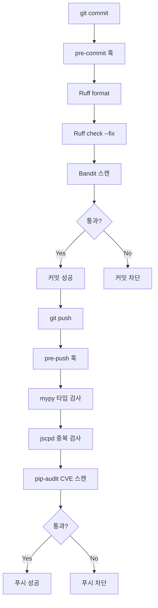

# Minchodan 코드 품질 검증 가이드

> **작성일**: 2026-06-27
> **버전**: v0.2.0 (2026-06-27 구현 완료, 설정 파일 작성 및 기존 코드 일괄 수정)
> **기준 문서**: [`docs/course_codebase_guide.md`](course_codebase_guide.md) 3.2(임포트 순서)·3.3(경로 처리)·17.2(방어적 코딩), [`docs/test_specification.md`](test_specification.md)
> **적용 범위**: Python 서버 코드 (`server/`, `scripts/`, `tests/`). JS/TS(`client/`, `console/`)는 package.json 생성 시 본도 추가 예정.

---

## 1. 목적

본 문서는 Minchodan 프로젝트의 **코드 품질 검증 파이프라인**을 단일 명세로 정의합니다. 처음 참여하는 팀원이 도구 설치부터 실행·해결까지 단계적으로 따라갈 수 있도록 구성되었으며, 아래 목표를 충족합니다.

- **코드 중복**: jscpd 토큰 기반 중복 블록 탐지
- **보안 이슈**: Bandit 심층 스캔 + Ruff S 룰 1차 필터
- **코딩 패턴 준수**: Ruff가 [`course_codebase_guide.md`](course_codebase_guide.md) 3.2/3.3/17.2 규칙을 자동 검증
- **타입 안전성**: mypy 점진적 적용 (신규 함수는 타입 필수)
- **의존성 취약점**: pip-audit가 `requirements.txt` 기반 CVE 스캔
- **자동화**: pre-commit(커밋 시) + pre-push(푸시 시) + GitHub Actions(PR 시) 3단계 게이트

> **핵심 원칙**: 이중 경로 물리 분리(Dual Path Discipline)를 정적 분석이 강제합니다. 반사 경로에 LLM/RAG/실시간 TTS 호출이 탐지되면 Ruff 커스텀 룰 또는 Bandit이 차단합니다.

---

## 2. 도구 개요 매트릭스

| 도구 | 역할 | 도입 근거 | 실행 시점 | 속도 |
| :--- | :--- | :--- | :--- | :--- |
| **Ruff** | Linter + Formatter | flake8/isort/pyupgrade 통합, Python 3.13 지원, [`course_codebase_guide.md`](course_codebase_guide.md) 임포트 순서(3.2)·경로 처리(3.3) 위반 자동 검출 | pre-commit | 빠름 |
| **Bandit** | 보안 취약점 심층 스캔 | 하드코딩 secret, `eval`, weak crypto 탐지. Ruff S 룰보다 깊이 | pre-commit | 보통 |
| **mypy** | 정적 타입 검사 | Pydantic v2 시너지, None 가드레일(17.2) 컴파일 타임 검출 | pre-push | 느림 |
| **jscpd** | 코드 중복 검출 (전용) | 토큰 기반 중복 블록 탐지, Python + 향후 JS/TS 지원 | pre-push | 보통 |
| **pip-audit** | 의존성 CVE 스캔 | `requirements.txt` 기반. Ollama/ChromaDB 등 무거운 의존성 다수 | pre-push (주 1회 수동 권장) | 빠름 |
| **pre-commit** | 로컬 자동화 훅 | 커밋/푸시 시 자동 실행 | git hook | - |
| **GitHub Actions** | CI 게이트 | PR 시 자동 실행, 실패 시 머지 차단 | PR 생성 시 | - |

> **Ruff + Bandit 병행 이유**: Ruff S 룰은 빠른 1차 필터, Bandit은 심층 2차 스캔. 역할 분리로 중복 노이즈 제거.

---

## 3. 사전 준비

### 3.1 Python 가상환경

Minchodan는 Python 3.13을 기준으로 합니다. 프로젝트 루트(`./Minchodan`)에서 아래 명령을 실행합니다.

**Windows (PowerShell)**:

```powershell
python -m venv .venv
.\.venv\Scripts\Activate.ps1
```

> PowerShell 실행 정책 오류 시: `Set-ExecutionPolicy -Scope CurrentUser RemoteSigned`

**macOS / Linux (bash 또는 zsh)**:

```bash
python3 -m venv .venv
source .venv/bin/activate
```

### 3.2 환경 변수

본 가이드의 도구는 `.env`를 직접 사용하지 않습니다. 단, 서버 실행 검증 시에는 [`.env.example`](../.env.example)을 참조하여 `.env`를 구성합니다. 상세는 [`docs/environment_variables.md`](environment_variables.md)를 참조하세요.

---

## 4. 개발 의존성 설치

### 4.1 requirements-dev.txt

개발 전용 의존성은 `requirements-dev.txt`로 분리합니다. (운영 배포 `requirements.txt`에 포함 금지)

```text
ruff>=0.6.0
mypy>=1.11.0
bandit>=1.7.0
pip-audit>=2.7.0
jscpd>=3.0.0
pre-commit>=3.8.0
```

### 4.2 설치 명령

가상환경 활성화 상태에서 실행합니다.

```powershell
python -m pip install -r requirements-dev.txt
```

### 4.3 pre-commit 훅 설치

```powershell
pre-commit install
pre-commit install --hook-type pre-push
```

설치 완료 후 `.git/hooks/pre-commit`과 `.git/hooks/pre-push`가 생성된 것을 확인합니다.

---

## 5. 도구별 상세 가이드

### 5.1 Ruff (Linter + Formatter)

Ruff는 flake8/isort/pyupgrade/bandit(S 룰)을 통합한 초고속 린터이자 포매터입니다.

**활성 규칙**:

| Ruff 규칙 | 의미 | 매핑되는 가이드 항목 |
| :--- | :--- | :--- |
| `I` | isort (임포트 정렬) | [`3.2 임포트 순서`](course_codebase_guide.md) (stdlib -> 외부 -> 로컬) |
| `E`, `W` | pycodestyle | 일반 스타일 |
| `F` | pyflakes | 미사용 import/변수 |
| `UP` | pyupgrade | Python 3.13 모던화 |
| `S` | bandit 호환 보안 룰 | 보안 1차 필터 |
| `B` | bugbear | [`17.2 방어적 코딩`](course_codebase_guide.md) 관련 버그 패턴 |
| `SIM` | simplify | 간결화 (AGENTS.md Conciseness 원칙) |
| `C4` | comprehensions | 컴프리헨션 권장 |
| `RUF` | Ruff 자체 룰 | 기타 |
| `PT` | pytest 스타일 | 기존 `tests/`와 일치 |

**주요 명령**:

```powershell
# 포맷팅 적용 (스타일 통일)
ruff format .

# 린트 검사만 (수정 없이 위반 표시)
ruff check .

# 린트 자동 수정
ruff check --fix .

# 특정 파일만
ruff check server/detection/yolo_detector.py
```

**설정 위치**: `pyproject.toml`의 `[tool.ruff]` 섹션 (구현 단계에서 작성).

### 5.2 Bandit (보안 심층 스캔)

Bandit은 Python 코드의 보안 취약점을 심층 스캔합니다. Ruff S 룰이 1차 필터라면, Bandit은 2차 심층 검사입니다.

**주요 명령**:

```powershell
# server/와 scripts/ 재귀 스캔
bandit -r server/ scripts/

# 설정 파일 사용 (pyproject.toml의 [tool.bandit])
bandit -c pyproject.toml -r server/ scripts/

# 리포트 파일 생성
bandit -r server/ -f html -o reports/bandit_report.html
```

**제외 규칙** (false positive 최소화):

| 규칙 | 설명 | 제외 사유 |
| :--- | :--- | :--- |
| `B101` | assert_used | `tests/`에서 pytest assert 사용 중 |
| `B404` | import_subprocess | `scripts/`에서 모델 다운로드 등 사용 중 |
| `B603` | subprocess_without_shell_equals_true | `scripts/`에서 제한적 사용 |

> 개별 화이트리스트는 `# nosec` 주석으로 처리하고 `skips`는 최소화합니다.

### 5.3 mypy (정적 타입 검사)

mypy는 점진적 적용을 원칙으로 합니다. 신규 함수는 타입 힌트 필수, 기존 36개 파일은 per-file ignore로 단계 적용합니다.

**점진적 설정**:

| 설정 | 값 | 의미 |
| :--- | :--- | :--- |
| `python_version` | `3.13` | 대상 Python 버전 |
| `disallow_untyped_defs` | `true` | 신규 함수는 타입 힌트 필수 |
| `warn_return_any` | `true` | `Any` 반환 경고 |
| `warn_unused_ignores` | `true` | 불필요한 `# type: ignore` 경고 |
| `ignore_missing_imports` | `true` | ultralytics/chromadb stub 부재 대응 |

**주요 명령**:

```powershell
# 서버 전체 검사
mypy server/

# 특정 모듈만
mypy server/detection/yolo_detector.py

# 상세 리포트
mypy --strict server/orchestration/  # 신규 모듈은 strict 적용 권장
```

> **기존 파일 마이그레이션**: 파일 수정 시마다 해당 파일의 `ignore_missing_imports`를 해제하고 타입을 보완합니다. 일괄 strict 적용은 금지.

### 5.4 jscpd (코드 중복 검출)

jscpd는 토큰 기반 중복 블록 탐지 전용 도구입니다. Pylint similarities 대신 선택한 이유는 Python + 향후 JS/TS 모두 지원하며 pre-commit 훅·CI 리포트가 내장되어 있기 때문입니다.

**설정 파일**: `.jscpd.json` (구현 단계에서 작성)

| 설정 | 값 | 의미 |
| :--- | :--- | :--- |
| `min-lines` | `5` | 최소 5줄 이상 중복만 탐지 |
| `min-tokens` | `50` | 최소 50 토큰 이상 중복만 탐지 |
| `format` | `["python"]` | Python 파일만 (향후 js/ts 추가) |
| `ignore` | `.venv`, `__pycache__`, `data/`, `models/` | 가상환경·캐시·데이터 제외 |

**주요 명령**:

```powershell
# 중복 검사 실행
jscpd

# HTML 리포트 생성 (./reports/jscpd/에 출력)
jscpd --reporters html

# 특정 디렉토리만
jscpd server/detection/
```

### 5.5 pip-audit (의존성 CVE 스캔)

pip-audit는 `requirements.txt`에 명시된 의존성의 알려진 취약점(CVE)을 스캔합니다.

**주요 명령**:

```powershell
# requirements.txt 기반 스캔
pip-audit -r requirements.txt

# 개발 의존성 포함
pip-audit -r requirements.txt -r requirements-dev.txt

# 수정 가능한 취약점만 표시
pip-audit -r requirements.txt --fix
```

> **실행 주기**: pre-push 시 자동 실행 + 주 1회 수동 실행 권장. Ollama/ChromaDB 등 무거운 의존성의 CVE는 즉시 대응합니다.

---

## 6. 코딩 패턴 매핑 표

[`docs/course_codebase_guide.md`](course_codebase_guide.md)의 핵심 규칙이 Ruff/Bandit의 어느 룰로 자동 검증되는지 매핑합니다.

| 가이드 항목 | 규칙 내용 | 검증 도구 | 룰 ID |
| :--- | :--- | :--- | :--- |
| **3.1 파일 헤더 인코딩** | UTF-8 선언 + `sys.stdout.reconfigure` | Ruff | `RUF100` (보조) |
| **3.2 임포트 순서** | stdlib -> 외부 -> 로컬 | Ruff | `I001` |
| **3.3 경로 처리** | `__file__` 기반 경로 계산, 하드코딩 금지 | Ruff | `RUF100` (커스텀 룰 필요) |
| **3.4 .env 로드** | `load_dotenv()` + `os.getenv(..., default)` | Ruff | `S105` (hardcoded password) |
| **17.2 None 가드레일** | `None` 체크 후 접근 | mypy + Ruff | `B006`, `B008` + mypy `None` 검사 |
| **17.2 API 키 검증** | 빈 문자열 검사 | Bandit | `B105` (hardcoded password) |
| **17.2 Mock 폴백** | 예외 시 Mock 반환 | Ruff | `B904` (raise from) |
| **17.2 예외 후 루프 유지** | `try/except/continue` | Ruff | `B902` + `SIM` |
| **17.2 방어적 dict 접근** | `.get(key, default)` | Ruff | `SIM401` |
| **이중 경로 분리** | 반사 경로에 LLM/RAG/TTS 호출 금지 | 커스텀 룰 (후속) | - |

> **이중 경로 분리 강제**: 반사 경로(`server/detection/gates/`)에서 LLM/RAG/TTS 모듈 임포트를 탐지하는 커스텀 Ruff 룰은 후속 작업에서 추가합니다. 현재는 코드 리뷰로 강제.

---

## 7. 로컬 실행 흐름

### 7.1 자동 실행 (pre-commit + pre-push)



### 7.2 수동 실행 (전체 검사)

커밋 전 전체 검사를 수동으로 실행하려면:

```powershell
# 전체 도구 한 번에 실행
ruff format . ; ruff check . ; bandit -r server/ scripts/ ; mypy server/ ; jscpd ; pip-audit -r requirements.txt
```

### 7.3 pre-commit 수동 실행

```powershell
# 모든 훅 수동 실행 (파일 변경 없이도)
pre-commit run --all-files

# pre-push 훅만 수동 실행
pre-commit run --hook-stage pre-push --all-files
```

---

## 8. CI (GitHub Actions)

PR 생성 시 GitHub Actions가 자동으로 동일한 검사를 실행합니다. 로컬과 CI의 단일 소스를 유지하기 위해 `pre-commit run --all-files` 액션을 사용합니다.

**워크플로우 파일**: `.github/workflows/lint.yml` (구현 단계에서 작성)

**실행 조건**:

| 이벤트 | 실행 훅 | 실패 시 동작 |
| :--- | :--- | :--- |
| PR 생성/업데이트 | Ruff + Bandit + mypy + jscpd + pip-audit | 머지 차단 |
| `master`/`main` push | 동일 | 알림만 |

> **로컬-CI 일치 원칙**: CI에서만 실행하는 검사는 없습니다. 로컬 pre-commit과 동일한 설정을 공유합니다.

---

## 9. 처음 사용하는 팀원 FAQ (상위 10개 패턴)

코드를 작성하다 보면 자주 마주치는 위반 패턴과 해결법입니다.

### 패턴 1: 임포트 순서 위반 (I001)

**위반**:

```python
from langchain_openai import ChatOpenAI
import sys
from dotenv import load_dotenv
```

**해결** (Ruff가 자동 수정):

```python
import sys

from dotenv import load_dotenv
from langchain_openai import ChatOpenAI
```

> 표준 라이브러리 -> 외부 라이브러리 -> 로컬 모듈 순서. 빈 줄로 그룹 구분.

### 패턴 2: 미사용 import (F401)

**위반**:

```python
import os       # 사용 안 함
import json
from typing import List  # 사용 안 함

data = json.loads("{}")
```

**해결**: `ruff check --fix`가 자동 제거.

### 패턴 3: 하드코딩된 비밀번호 (S105 / B105)

**위반**:

```python
API_KEY = "sk-1234567890abcdef"
```

**해결**:

```python
import os
API_KEY = os.getenv("OPENAI_API_KEY")
if not API_KEY:
    raise ValueError("OPENAI_API_KEY를 설정해주세요.")
```

> `.env`에 비밀값을 두고 `os.getenv`로 로드. [`course_codebase_guide.md`](course_codebase_guide.md) 3.4 참조.

### 패턴 4: 예외 처리 후 `raise from` 누락 (B904)

**위반**:

```python
try:
    result = call_api()
except Exception as e:
    raise RuntimeError("API 호출 실패")
```

**해결**:

```python
try:
    result = call_api()
except Exception as e:
    raise RuntimeError("API 호출 실패") from e
```

> 원인 예외를 보존하려면 `from e` 필수. [`17.2 방어적 코딩`](course_codebase_guide.md) 참조.

### 패턴 5: None 접근 (mypy + B006)

**위반**:

```python
def detect(frame):
    result = model(frame)
    boxes = result.boxes  # result가 None일 가능성
    for box in boxes:
        ...
```

**해결**:

```python
def detect(frame) -> list:
    result = model(frame)
    if result is None or result.boxes is None:
        return []
    boxes = result.boxes
    if len(boxes) == 0:
        return []
    for box in boxes:
        ...
```

> [`17.2 None 가드레일`](course_codebase_guide.md): 프레임 버퍼/디코딩 결과가 `None`인 경우 가드레일 필수.

### 패턴 6: mutable default argument (B006)

**위반**:

```python
def process(items: list = []):
    items.append(1)
    return items
```

**해결**:

```python
def process(items: list | None = None):
    if items is None:
        items = []
    items.append(1)
    return items
```

### 패턴 7: dict 접근 시 `.get()` 미사용 (SIM401)

**위반**:

```python
if "risk" in data:
    risk = data["risk"]
else:
    risk = "unknown"
```

**해결** (Ruff가 자동 수정):

```python
risk = data.get("risk", "unknown")
```

> [`17.2 방어적 dict 접근`](course_codebase_guide.md): `.get(key, default)` 사용.

### 패턴 8: f-string 없는 문자열 포맷 (UP032)

**위반**:

```python
message = "탐지: {}".format(class_name)
```

**해결** (Ruff가 자동 수정):

```python
message = f"탐지: {class_name}"
```

### 패턴 9: subprocess 사용 (B404 / B603)

`scripts/`에서 모델 다운로드 등으로 subprocess를 사용할 때 Bandit이 경고합니다.

**화이트리스트 처리**:

```python
import subprocess  # noqa: B404

def download_model(url: str) -> None:
    # nosec: 외부 입력이 아니라 고정 URL만 사용
    subprocess.run(["wget", url], check=True)  # noqa: B603
```

> `# nosec`은 최소한으로 사용하고, 가능하면 `subprocess.run`에 `shell=False`와 인자 리스트를 명시합니다.

### 패턴 10: 이중 경로 분리 위반

**위반** (반사 경로에서 LLM 호출):

```python
# server/detection/gates/reflex_gate.py
from server.orchestration.llm_client_factory import LLMClientFactory  # 금지
```

**해결**: 반사 게이트(`server/detection/gates/`)에서 오케스트레이션/RAG/TTS 모듈 임포트를 제거합니다. 반사 경로는 룰베이스만 사용합니다.

> 현재는 코드 리뷰로 강제. 후속 작업에서 커스텀 Ruff 룰로 자동 탐지 예정. [`AGENTS.md`](../AGENTS.md) Dual Path Discipline 참조.

---

## 10. 명령어 치트시트

### 10.1 검사만 (수정 없이)

| 도구 | 명령 | 비고 |
| :--- | :--- | :--- |
| Ruff 린트 | `ruff check .` | 위반만 표시 |
| Ruff 포맷 확인 | `ruff format --check .` | 변경사항만 표시 |
| Bandit | `bandit -r server/ scripts/` | 보안 스캔 |
| mypy | `mypy server/` | 타입 검사 |
| jscpd | `jscpd` | 중복 검출 |
| pip-audit | `pip-audit -r requirements.txt` | 의존성 CVE |

### 10.2 자동 수정

| 도구 | 명령 | 비고 |
| :--- | :--- | :--- |
| Ruff 포맷 적용 | `ruff format .` | 스타일 통일 |
| Ruff 린트 수정 | `ruff check --fix .` | 자동 수정 가능한 위반만 |

### 10.3 전체 파이프라인 한 번에

```powershell
# 전체 자동 수정 + 검사
ruff format . ; ruff check --fix . ; bandit -r server/ scripts/ ; mypy server/ ; jscpd ; pip-audit -r requirements.txt
```

### 10.4 특정 파일만

```powershell
# 단일 파일 검사
ruff check server\detection\yolo_detector.py
mypy server\detection\yolo_detector.py
```

### 10.5 리포트 생성

```powershell
# Bandit HTML 리포트
bandit -r server/ -f html -o reports\bandit_report.html

# jscpd HTML 리포트 (./reports/jscpd/에 자동 생성)
jscpd --reporters html
```

---

## 11. 트러블슈팅

### 11.1 Windows 한글 깨짐 (CP949)

Windows PowerShell에서 Ruff/Bandit 출력이 깨질 때:

```powershell
# 터미널 인코딩 UTF-8로 설정
[Console]::OutputEncoding = [System.Text.Encoding]::UTF8
chcp 65001
```

> [`course_codebase_guide.md`](course_codebase_guide.md) 3.1 파일 헤더 인코딩 패턴과 동일 원칙.

### 11.2 mypy stub 부재 (ultralytics/chromadb)

`Missing stubs` 에러 발생 시:

```toml
# pyproject.toml
[[tool.mypy.overrides]]
module = ["ultralytics.*", "chromadb.*", "ollama.*"]
ignore_missing_imports = true
```

> stub 패키지가 있는 경우 `pip install types-requests` 등으로 설치하는 것이 더 안전합니다.

### 11.3 Bandit false positive 처리

합리적인 사용인데 Bandit이 경고할 때:

```python
import subprocess  # noqa: B404
subprocess.run(["python", "script.py"], check=True)  # noqa: B603  # nosec
```

> `# nosec`은 해당 라인의 모든 Bandit 경고를 무시합니다. `# noqa: B404`는 Ruff만 무시. 두 주석을 함께 사용하면 Ruff + Bandit 모두 무시.

### 11.4 pre-commit 훅이 너무 느림

무거운 훅(mypy/jscpd)을 pre-push로 이동:

```yaml
# .pre-commit-config.yaml
- repo: local
  hooks:
    - id: mypy
      stages: [pre-push]  # pre-commit에서 pre-push로 이동
```

### 11.5 Ruff가 기존 코드를 너무 많이 수정

점진적 적용을 위해 `--diff`로 먼저 확인:

```powershell
ruff check --fix --diff .  # 변경사항만 미리보기 (실제 수정 X)
```

### 11.6 jscpd가 가상환경을 스캔함

`.jscpd.json`의 `ignore` 항목 확인:

```json
{
  "ignore": [".venv/**", "__pycache__/**", ".pytest_cache/**", "data/**", "models/**"]
}
```

---

## 12. 관련 파일 인덱스

| 파일 | 상태 | 설명 |
| :--- | :--- | :--- |
| `docs/code_quality_guide.md` | **본 문서** | 코드 품질 검증 단일 명세 |
| `pyproject.toml` | 완료 | Ruff/mypy/bandit 통합 설정 |
| `requirements-dev.txt` | 완료 | 개발 의존성 (ruff, mypy, bandit, jscpd, pip-audit, pre-commit) |
| `.jscpd.json` | 완료 | 중복 검출 전용 설정 (threshold 5%) |
| `.pre-commit-config.yaml` | 완료 | 로컬 자동화 훅 (pre-commit + pre-push 분리) |
| `.github/workflows/lint.yml` | 완료 | CI 게이트 워크플로우 |
| [`docs/course_codebase_guide.md`](course_codebase_guide.md) | 완료 | 코딩 패턴 기준 (Ruff 룰 매핑 원본) |
| [`docs/test_specification.md`](test_specification.md) | 완료 | 정적 분석 게이트 섹션 추가 |
| [`AGENTS.md`](../AGENTS.md) | 완료 | 린트·검증 명령 섹션 추가 |
| [`docs/README.md`](README.md) | 완료 | 문서 인덱스에 본 가이드 추가 |

---

> **문서 종료**: 본 문서는 2026-06-27 기준으로 작성되었습니다. 도구 설정 변경 시 본 문서도 함께 업데이트해야 합니다.
