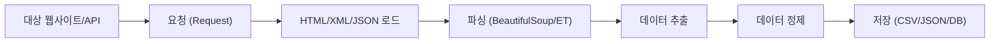
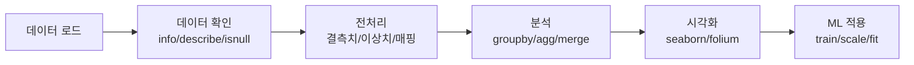
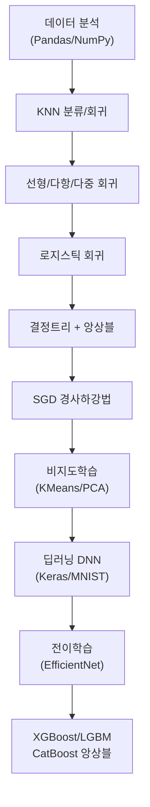
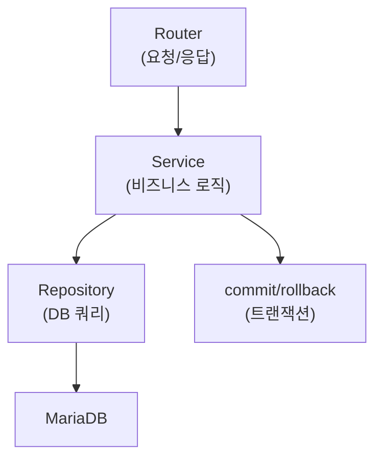
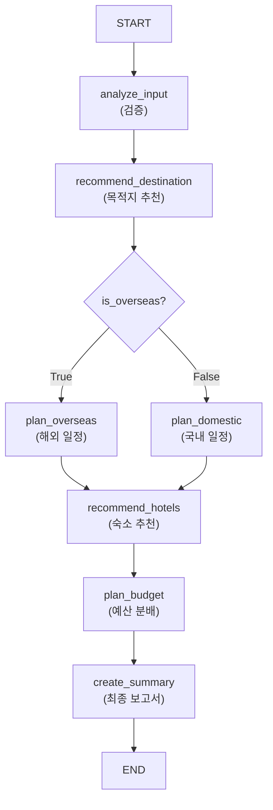
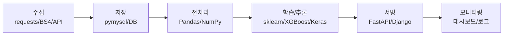

# 2025 랭체인활용 AI비전 과정 - 코드베이스 종합 지침서

> **작성일**: 2026-06-24
> **버전**: v1.0.0
> **분석 소스**: Notion "2025 랭체인활용 AI비전 과정" 페이지 하위 ~30개 + 로컬 `D:\korea_IT\2025_LangChain_` 하위 34개 폴더
> **목적**: 수업 전체 코드베이스에서 추출한 코딩 패턴, 함수 시그니처, 아키텍처 설계를 에이전트 코딩 지침으로 활용

---

## 1. 문서 개요

### 1.1 목적

본 문서는 **2025 랭체인활용 AI비전 과정**에서 학습한 전체 코드베이스를 분석하여, 에이전트 기반 코딩 시 참조할 수 있는 **범용 코딩 지침서**를 제공합니다. Notion 학습 노트와 로컬 프로젝트 폴더의 Python 코드를 교차 분석하여, 각 주제별 핵심 함수 시그니처, 코드 패턴, 아키텍처 설계 방식을 체계적으로 정리합니다.

### 1.2 분석 범위

| 분석 소스          | 수량            | 내용                                                   |
| ------------------ | --------------- | ------------------------------------------------------ |
| Notion 하위 페이지 | ~30개 (1~2단계) | 이론 노트, 소스 코드, 실습 평가, 치트시트              |
| 로컬 프로젝트 폴더 | 34개            | Python 스크립트, Jupyter Notebook, FastAPI/Django 웹앱 |

### 1.3 사용법

- 에이전트 코딩 시 **해당 주제 섹션**을 먼저 참조하여 코드 패턴과 함수 시그니처를 확인
- 각 섹션은 **Notion 이론 + 로컬 코드 예시**의 이중 구조로 구성
- 코드 블록은 **복사 가능한 템플릿**으로 작성됨
- 섹션 17(공통 패턴 요약)은 모든 주제에 공통으로 적용되는 코딩 규칙

---

## 2. 전체 프로젝트 구조 및 주제 분류

### 2.1 로컬 폴더 주제 분류

```mermaid
graph TD
    A["D:\korea_IT\2025_LangChain_"] --> B["Python 기초"]
    A --> C["데이터 수집/크롤링"]
    A --> D["데이터 처리/분석"]
    A --> E["ML/DL"]
    A --> F["데이터베이스"]
    A --> G["FastAPI"]
    A --> H["OpenCV/CV"]
    A --> I["YOLO"]
    A --> J["LLM/프롬프트"]
    A --> K["LangChain/LCEL"]
    A --> L["RAG/VectorDB"]
    A --> M["LangGraph"]
    A --> N["Django"]
    A --> O["통합 프로젝트"]

    B --> B1["2025_LangChain_PythonBasic-master"]
    C --> C1["dataCrawling"]
    C --> C2["Bid_API_Data_Fetching"]
    C --> C3["apiOpenWeather"]
    D --> D1["ML+DL"]
    D --> D2["data"]
    D --> D3["dataDiff"]
    E --> E1["data"]
    E --> E2["ml_web_project"]
    E --> E3["anti_Vibe"]
    E --> E4["bid_box"]
    F --> F1["MariaDB"]
    F --> F2["post_api"]
    G --> G1["fastAPI_basic"]
    G --> G2["fastAPI_CRUD"]
    G --> G3["post_api"]
    H --> H1["opencv"]
    H --> H2["ai-cctv-platform"]
    I --> I1["web_yolov8n"]
    I --> I2["auto_labeler"]
    I --> I3["ai-cctv-platform"]
    J --> J1["prompt_engineering_test"]
    J --> J2["LLM API_JSON_Test"]
    K --> K1["rag_skill"]
    K --> K2["conv_openCV_langchain"]
    K --> K3["saramin_project"]
    K --> K4["saramin_langChain_mnProject"]
    L --> L1["rag_skill"]
    L --> L2["RAG_Test"]
    L --> L3["bid_box"]
    M --> M1["langGraphEx_recomendAgent"]
    M --> M2["Mini_Project_Saramin"]
    M --> M3["2025_LangChain_AI_Vision_Platform"]
    N --> N1["Bid_API_Data_Fetching"]
    N --> N2["ml_web_project"]
    N --> N3["bid_box"]
    N --> N4["anti_Vibe"]
    O --> O1["2025_LangChain_AI_Vision_Platform"]
    O --> O2["bid_box"]
    O --> O3["anti_Vibe"]
```



### 2.2 폴더-주제 매핑 테이블

| 폴더                                | 주 분류           | 핵심 스택                                           | Python 파일 수     | 비고                              |
| ----------------------------------- | ----------------- | --------------------------------------------------- | ------------------ | --------------------------------- |
| `2025_LangChain_PythonBasic-master` | Python 기초       | turtle, csv, datetime                               | ~40                | 단일 예제 스크립트 모음           |
| `dataCrawling`                      | 데이터 수집       | BeautifulSoup, pymysql, requests                    | 9                  | Repository 패턴 CRUD              |
| `crawlingSTD`                       | 데이터 수집       | -                                                   | 0                  | venv만 존재 (빈 폴더)             |
| `Bid_API_Data_Fetching`             | 데이터 수집       | Django, pymysql, XML, threading                     | ~15                | 조달청 API 비동기 수집            |
| `apiOpenWeather`                    | 데이터 수집       | requests, xml.etree                                 | 1                  | OpenWeatherMap XML 파싱           |
| `ML+DL`                             | 데이터 처리       | NumPy, Pandas, seaborn                              | 8                  | Colab 노트북 변환                 |
| `data`                              | ML/DL             | scikit-learn, TensorFlow, Keras                     | 5스크립트+22노트북 | ML/DL 종합 학습                   |
| `dataDiff`                          | 데이터 처리       | json, csv, xml (표준라이브러리)                     | 1                  | CSV->JSON/XML 변환                |
| `ml_web_project`                    | ML/DL             | Django, scikit-learn, XGBoost, Folium               | ~20                | Django ML 웹서비스 4앱            |
| `anti_Vibe`                         | ML/DL             | FastAPI, SQLAlchemy, Polars, LGBM, CatBoost         | ~30                | 입찰가 예측 v8~v25                |
| `bid_box`                           | 통합 프로젝트     | Django, ChromaDB, Gemini, XGBoost                   | ~50                | Hybrid RAG 챗봇 + 모델 레지스트리 |
| `MariaDB`                           | 데이터베이스      | SQL (DDL/DML/Join/Subquery)                         | 0                  | SQL 스크립트만                    |
| `post_api`                          | FastAPI/DB        | FastAPI, SQLAlchemy 2.0, pymysql                    | 8                  | MVC 3계층 + 트랜잭션              |
| `fastAPI_basic`                     | FastAPI           | FastAPI, Pydantic, AsyncOpenAI                      | 9                  | 도서 CRUD + LLM 연동              |
| `fastAPI_CRUD`                      | FastAPI           | FastAPI, Pydantic                                   | 2                  | 회원 CRUD (메모리 DB)             |
| `opencv`                            | OpenCV            | cv2, numpy, matplotlib                              | 2                  | 노트북 가공 스크립트              |
| `ai-cctv-platform`                  | OpenCV/YOLO/LLM   | ultralytics, langchain, openai, easyocr             | ~20                | 5파트 학습 커리큘럼               |
| `web_yolov8n`                       | YOLO              | FastAPI, React, Celery, Redis, ultralytics          | ~25                | YOLO 학습 웹 플랫폼               |
| `auto_labeler`                      | YOLO              | ultralytics (YOLO/RTDETR), cv2                      | 1                  | 배치 자동 라벨링                  |
| `prompt_engineering_test`           | LLM               | openai, dotenv, json                                | 3                  | 프롬프트 엔지니어링 평가          |
| `LLM API_JSON_Test`                 | LLM               | openai, pandas, json                                | 1                  | LLM JSON 파싱 종합 평가           |
| `conv_openCV_langchain`             | LangChain/YOLO    | ultralytics, langchain, cv2                         | 1                  | YOLO + LCEL 위험도 분석           |
| `rag_skill`                         | RAG/LangChain     | HuggingFace, ChromaDB, langchain                    | 5                  | 모듈형 RAG 스킬                   |
| `RAG_Test`                          | RAG               | OpenAI Embeddings, ChromaDB, langchain              | 2                  | 심청전 RAG Q&A                    |
| `saramin_project`                   | LangChain         | LangChain, ChatOpenAI, @tool, BeautifulSoup         | 9                  | Agent 기반 채용 필터링            |
| `saramin_langChain_mnProject`       | LangChain/FastAPI | FastAPI, SSE, @tool, langchain                      | 10                 | 사람인 매칭 + SSE 스트림          |
| `Mini_Project_Saramin`              | LangGraph         | LangGraph, Streamlit, Pydantic                      | 15                 | LangGraph 채용 워크플로우         |
| `langGraphEx_recomendAgent`         | LangGraph         | LangGraph, langchain, pydantic                      | 13                 | 여행 추천 에이전트 (단계별)       |
| `2025_LangChain_AI_Vision_Platform` | 통합 프로젝트     | FastAPI, langgraph, langchain, ultralytics, sklearn | ~20                | 통합 AI 비전 플랫폼               |
| `final_project_meet`                | 설계 문서         | -                                                   | 0                  | 문서/JS만 (Python 없음)           |
| `Coding_Agent`                      | -                 | -                                                   | 0                  | 빈 폴더                           |
| `NLP`                               | -                 | -                                                   | 0                  | 빈 폴더                           |
| `bid_box_presentation`              | 기타              | python-pptx                                         | 1                  | PPTX 자동 생성                    |

### 2.3 Notion 페이지 계층 구조

| 1단계 페이지                          | 2단계 하위                                                                                                             | 관련 로컬 폴더                                                              |
| ------------------------------------- | ---------------------------------------------------------------------------------------------------------------------- | --------------------------------------------------------------------------- |
| 파이썬 특징, 역사                     | -                                                                                                                      | `2025_LangChain_PythonBasic-master`                                         |
| Python                                | 변수, 조건문, 반복문, 리스트, 튜플, 딕셔너리, Set, 클래스, 예외처리, 파일입출력, 언패킹 등 20개                        | `2025_LangChain_PythonBasic-master`                                         |
| 파이썬 가상환경 PIP                   | venv 생성/활성화, requirements.txt                                                                                     | 전체 프로젝트                                                               |
| DataBase (MariaDB)                    | Select, 테이블, 데이터타입, SQL함수, DML, DDL, 서브쿼리, 조인 등 15개                                                  | `MariaDB`, `post_api`                                                       |
| 데이터 수집                           | 웹크롤링 개요, API 호출, 데이터 표현 방식 등 7개                                                                       | `dataCrawling`, `Bid_API_Data_Fetching`                                     |
| 데이터 분석 + ML + DL                 | Road Map, 데이터 분석, 인공지능/ML/DL, 머신러닝, 데이터 누수 방지, 웹서버 ML 연동 등 10개                              | `ML+DL`, `data`, `ml_web_project`                                           |
| 웹 개발                               | 기초 상식, 웹표준, html, Bootstrap, jQuery, Back-End 등 7개                                                            | `fastAPI_basic`, `post_api`                                                 |
| 컴퓨터 비전 + OPENCV                  | ch1~ch11 + 응용 (색공간, 필터, 에지, 모폴로지, SIFT, 동영상, BBox, Haar Cascade, 배경차분) 18개                        | `opencv`, `ai-cctv-platform`                                                |
| FastAPI & SqlAlchemy                  | Layered Architecture, FastAPI 기초, CORS, API호출, 파일업로드, ORM, SQLAlchemy CRUD, post_api, 트랜잭션 등 12개        | `fastAPI_basic`, `fastAPI_CRUD`, `post_api`                                 |
| Docker                                | 개념, 기초실습, DockerFile/Compose, 배포준비, 전체서비스배포 6개                                                       | `docker/` (Minchodan)                                                       |
| LLM, RAG, MultiModal, LangChain, YOLO | Part01 LLM기초, Part02 LangChain, Part03 RAG, Part04 MultiModal, YOLO, LLM API JSON, 랭체인기초, 랭체인 OpenCV융합 8개 | `prompt_engineering_test`, `rag_skill`, `RAG_Test`, `conv_openCV_langchain` |
| Front-End, Back-End 기술들            | -                                                                                                                      | `saramin_langChain_mnProject/frontend`                                      |
| REST API Status_Code                  | 2xx/4xx/5xx 표                                                                                                         | `post_api`, `fastAPI_basic`                                                 |
| Curl 방식으로 api 호출                | 15가지 방법                                                                                                            | `fastAPI_basic`                                                             |
| 시각장애인과 정안인의 보행 역학       | -                                                                                                                      | `Minchodan` (최종 프로젝트)                                                 |
| BIDBOX 낙찰가 예측 프로그램           | -                                                                                                                      | `bid_box`, `anti_Vibe`                                                      |

---

## 3. Python 코딩 기초 패턴

> **Notion 소스**: 파이썬 특징/역사, Python, 파이썬 가상환경 PIP
> **로컬 소스**: `2025_LangChain_PythonBasic-master` (~40개 예제 스크립트)

### 3.1 파일 헤더 인코딩 (수업 표준 패턴)

모든 Python 파일 첫 줄에 UTF-8 선언과 Windows 터미널 한글 인코딩 설정을 포함합니다.

```python
# -*- coding: utf-8 -*-
import sys
if hasattr(sys.stdout, "reconfigure"):
    getattr(sys.stdout, "reconfigure")(encoding="utf-8")
```

이 패턴은 `prompt_engineering_test`, `LLM API_JSON_Test`, `RAG_Test`, `conv_openCV_langchain` 등 **모든 수업 프로젝트에서 공통으로 사용**되는 필수 패턴입니다.

### 3.2 임포트 순서 (stdlib -> 외부 -> 로컬)

```python
# 1. 표준 라이브러리
import sys
import os
import json
from typing import TypedDict, Annotated, List

# 2. 외부 라이브러리
from dotenv import load_dotenv
from langchain_openai import ChatOpenAI
from langchain_core.prompts import ChatPromptTemplate
from langchain_core.output_parsers import StrOutputParser
from pydantic import BaseModel, Field

# 3. 로컬 모듈
from rag_vectorstore import load_vectorstore
from schemas.person_schema import PersonCreate
```

### 3.3 경로 처리 - 실행 위치 독립성

```python
current_dir = os.path.dirname(os.path.abspath(__file__))
DATA_PATH = os.path.join(current_dir, "data")
```

이 패턴은 `rag_skill`, `RAG_Test`, `conv_openCV_langchain` 등에서 파일 로딩 시 일관적으로 사용됩니다.

### 3.4 .env 환경변수 로드

```python
from dotenv import load_dotenv
load_dotenv()  # 프로젝트 루트의 .env 자동 탐색

api_key = os.getenv("OPENAI_API_KEY")
model = os.getenv("OPEN_AI_MODEL", "gpt-4o-mini")  # 기본값 지정
```

### 3.5 가상환경 관리

```bash
# 생성
python -m venv venv

# 활성화 (Windows)
venv\Scripts\activate

# 활성화 (macOS/Linux)
source venv/bin/activate

# 의존성 저장/복원
pip freeze > requirements.txt
pip install -r requirements.txt

# 비활성화
deactivate
```

> **Windows PowerShell 실행 정책 오류 시**:
> `Set-ExecutionPolicy -Scope CurrentUser RemoteSigned`

### 3.6 클래스 설계 패턴 (PythonBasic 예제 기반)

```python
class BankAccount:
    def __init__(self, owner: str, balance: int = 0):
        self.owner = owner
        self.balance = balance

    def deposit(self, amount: int) -> None:
        if amount > 0:
            self.balance += amount

    def withdraw(self, amount: int) -> None:
        if amount <= self.balance:
            self.balance -= amount

    def info(self) -> str:
        return f"{self.owner}: {self.balance}원"
```

### 3.7 예외 처리 패턴

```python
# 파일 입출력 + 예외 처리
try:
    with open("data.csv", encoding="utf-8") as f:
        data = f.read()
except FileNotFoundError:
    print("[ERROR] 파일을 찾을 수 없습니다.")
except UnicodeDecodeError:
    print("[ERROR] 인코딩 오류. UTF-8로 시도하세요.")
```

---

## 4. 데이터 수집 및 크롤링

> **Notion 소스**: 데이터 수집 (웹크롤링 개요, API 호출, 데이터 표현 방식), 공공데이터 및 웹 크롤링 활용
> **로컬 소스**: `dataCrawling`, `Bid_API_Data_Fetching`, `apiOpenWeather`

### 4.1 웹 크롤링 vs 웹 스크래핑

| 구분 | 크롤링 (Crawling)     | 스크래핑 (Scraping)     |
| ---- | --------------------- | ----------------------- |
| 목적 | 페이지 링크 구조 수집 | 특정 데이터 추출        |
| 도구 | 크롤러 봇             | BeautifulSoup, Selenium |
| 속도 | 느림 (전체 탐색)      | 빠름 (특정 페이지)      |

### 4.2 BeautifulSoup 기반 크롤링 패턴 (dataCrawling)

```python
import requests
from bs4 import BeautifulSoup

# 봇 탐지 회피를 위한 User-Agent 설정
headers = {
    "User-Agent": "Mozilla/5.0 (Windows NT 10.0; Win64; x64) AppleWebKit/537.36"
}

response = requests.get(target_url, headers=headers, timeout=10)
response.raise_for_status()

soup = BeautifulSoup(response.text, "html.parser")
items = soup.find_all("div", class_="item_recruit")

for item in items:
    title = item.find("a", class_="title").text.strip()
    link = item.find("a")["href"]
```

### 4.3 공공 OpenAPI 호출 패턴 (apiOpenWeather, Bid_API)

**XML 응답 파싱**:

```python
import requests
import xml.etree.ElementTree as ET

params = {
    "serviceKey": SERVICE_KEY,
    "mode": "xml",
    "units": "metric"
}

response = requests.get(base_url, params=params, timeout=10)
response.raise_for_status()

root = ET.fromstring(response.text)

# 태그 텍스트 추출
def get_tagText(tag_path: str, default=None) -> str | None:
    el = root.find(tag_path)
    return el.text if el is not None else default

# 태그 속성 추출
def get_attr(tag_path: str, attr_name: str, default=None) -> str | None:
    el = root.find(tag_path)
    return el.get(attr_name) if el is not None else default
```

**비동기 대용량 API 수집** (anti_Vibe, bid_box):

```python
import httpx
import asyncio

async def fetch_bid_data(start_date, end_date, num_of_rows=999, category="Thng"):
    """조달청 API 비동기 병렬 수집 (Semaphore 동시성 제어)"""
    MAX_CONCURRENT = 3
    semaphore = asyncio.Semaphore(MAX_CONCURRENT)

    async with httpx.AsyncClient(timeout=30) as client:
        tasks = [
            _make_request_with_retry(client, url, params, semaphore)
            for url, params in _build_requests(start_date, end_date, category)
        ]
        responses = await asyncio.gather(*tasks)

    return _parse_responses(responses)

async def _make_request_with_retry(client, url, params, semaphore, max_retries=5):
    """429/50x 재시도 (선형 백오프)"""
    async with semaphore:
        for attempt in range(max_retries):
            try:
                resp = await client.get(url, params=params)
                if resp.status_code == 429:
                    await asyncio.sleep(2 ** attempt)
                    continue
                resp.raise_for_status()
                return resp
            except httpx.HTTPError:
                if attempt < max_retries - 1:
                    await asyncio.sleep(2 ** attempt)
                else:
                    raise
```

### 4.4 Repository 패턴 CRUD (dataCrawling)

```python
import pymysql

# DB 연결 팩토리
def get_connection() -> pymysql.Connection:
    """dotenv 환경변수 기반 DB 연결 (DictCursor 사용)"""
    load_dotenv()
    DB_CONFIG = {
        "host": os.getenv("DB_HOST", "localhost"),
        "port": int(os.getenv("DB_PORT", "3307")),
        "user": os.getenv("DB_USER"),
        "password": os.getenv("DB_PASSWORD"),
        "database": os.getenv("DB_NAME"),
        "charset": "utf8mb4",
        "cursorclass": pymysql.cursors.DictCursor,
    }
    return pymysql.connect(**DB_CONFIG)

# 상품 CRUD
def insert_product(product: dict) -> int:
    conn = get_connection()
    try:
        with conn.cursor() as cur:
            sql = "INSERT INTO products (product_no, name, price) VALUES (%s, %s, %s)"
            cur.execute(sql, (product["product_no"], product["name"], product["price"]))
        conn.commit()
        return cur.lastrowid
    finally:
        conn.close()

def find_all_products() -> list[dict]:
    conn = get_connection()
    try:
        with conn.cursor() as cur:
            cur.execute("SELECT * FROM products")
            return cur.fetchall()
    finally:
        conn.close()
```

### 4.5 Django 백그라운드 스레드 수집 (Bid_API)

```python
import threading
import uuid

_task_status = {}  # 전역 태스크 상태 추적

def start_fetch(request):
    """비동기 수집 트리거 (Django)"""
    task_id = str(uuid.uuid4())
    _task_status[task_id] = {"status": "running", "progress": 0}

    thread = threading.Thread(
        target=_run_background_fetch,
        args=(task_id, service_ids, start, end),
        daemon=True
    )
    thread.start()
    return JsonResponse({"task_id": task_id})

def _run_background_fetch(task_id, service_ids, start, end):
    """백그라운드에서 API 데이터 수집 후 DB 저장"""
    try:
        for sid in service_ids:
            data = fetch_api_data(sid, start, end)
            insert_api_data(sid, data)
            _task_status[task_id]["progress"] += 1
        _task_status[task_id]["status"] = "completed"
    except Exception as e:
        _task_status[task_id]["status"] = f"error: {e}"

def check_status(request):
    """폴링용 상태 확인"""
    task_id = request.GET.get("task_id")
    return JsonResponse(_task_status.get(task_id, {"status": "not_found"}))
```

### 4.6 데이터 수집 파이프라인 흐름



---

## 5. 데이터 처리 및 분석

> **Notion 소스**: 데이터 분석 (numpy, pandas, 시각화, EDA, 전처리, 워크플로우), 분석 소스 코드 및 라이브러리 정리
> **로컬 소스**: `ML+DL`, `data`, `dataDiff`

### 5.1 NumPy 핵심 패턴

```python
import numpy as np

# 배열 생성 및 속성
arr = np.array([1, 2, 3])
print(arr.ndim)   # 차원 (1)
print(arr.shape)  # 크기 (3,)

# 형태 변경 (딥러닝 입력 차원 맞춤)
arr_new = arr.reshape(3, 1)  # (3,) -> (3, 1)

# 배열 합치기
np.vstack((a, b))  # 수직 (행 추가)
np.hstack((a, b))  # 수직 (열 추가)

# 초기화
np.zeros((2, 3))
np.ones((2, 3))
np.arange(10)
```

### 5.2 Pandas 데이터 가공 패턴

```python
import pandas as pd

# 데이터 로드 (콤마 제거 옵션 필수)
df = pd.read_csv("file.csv", encoding="utf-8", thousands=",")

# 데이터 확인
df.head()           # 상위 5행
df.info()           # 결측치/타입 확인
df.describe()       # 기술통계량
df.isnull().sum()   # 결측치 개수

# 파생변수 생성
df = df.assign(total=df["math"] + df["english"])

# 값 매핑 (코드 -> 문자열)
df["gender"] = df["gender"].map({1: "male", 2: "female"})

# np.where 조건문 파생변수
df["income"] = np.where(df["income"] == 9999, np.nan, df["income"])

# 그룹별 집계
df.groupby("year", as_index=False).agg(count=("title", "count"))

# 데이터 합치기
pd.merge(df1, df2, on="id", how="left")
pd.concat([df1, df2])

# 필터링
df[df["address"].str.contains("강남")]
```

### 5.3 데이터 전처리 (결측치/이상치)

```python
# 결측치 처리
df.dropna(subset=["income"])           # 제거
df.fillna({"income": df["income"].mean()})  # 대체

# IQR 기반 이상치 탐지
Q1 = df["price"].quantile(0.25)
Q3 = df["price"].quantile(0.75)
IQR = Q3 - Q1
lower = Q1 - 1.5 * IQR
upper = Q3 + 1.5 * IQR
outliers = df[(df["price"] < lower) | (df["price"] > upper)]
```

### 5.4 시각화 (Matplotlib + Seaborn)

```python
import matplotlib.pyplot as plt
import seaborn as sns

# 한글 폰트 설정 (코랩 필수)
plt.rc("font", family="NanumBarunGothic")

plt.figure(figsize=(10, 6))

# 주요 그래프
sns.barplot(data=df, x="country", y="count")          # 막대
sns.scatterplot(data=df, x="age", y="income", hue="gender")  # 산점도
sns.heatmap(df.corr(), annot=True, fmt=".2f", cmap="coolwarm")  #트맵
sns.countplot(data=df, x="survived")                   # 카운트
sns.boxplot(data=df, x="group", y="value")            # 박스

plt.title("그래프 제목")
plt.show()
```

### 5.5 Folium 지도 시각화

```python
import folium

m = folium.Map(location=[37.5665, 126.9780], zoom_start=15)

for i in df.index:
    folium.Marker(
        location=[df.lat[i], df.lng[i]],
        popup=df.name[i],
        icon=folium.Icon(color="green", icon="star")
    ).add_to(m)

m.save("map_result.html")
```

### 5.6 KoNLPy + WordCloud (한글 NLP)

```python
from konlpy.tag import Okt
from collections import Counter
from wordcloud import WordCloud

okt = Okt()
nouns = okt.nouns(text)                    # 명사 추출
words = [n for n in nouns if len(n) > 1]   # 2글자 이상 필터
counts = Counter(words)                     # 빈도 계산

wc = WordCloud(
    font_path="/usr/share/fonts/truetype/nanum/NanumBarunGothic.ttf",
    background_color="white",
    width=800, height=600
)
cloud = wc.generate_from_frequencies(counts)

plt.imshow(cloud)
plt.axis("off")
plt.show()
```

### 5.7 CSV -> JSON/XML 변환 (dataDiff)

```python
import csv, json
import xml.etree.ElementTree as ET
from xml.dom import minidom

def csv_to_json():
    with open("member.csv", encoding="utf-8") as f:
        reader = csv.DictReader(f)
        rows = list(reader)
    with open("converted.json", "w", encoding="utf-8") as f:
        json.dump(rows, f, indent=4, ensure_ascii=False)

def csv_to_xml():
    with open("member.csv", encoding="utf-8") as f:
        reader = csv.DictReader(f)
        root = ET.Element("members")
        for row in reader:
            member = ET.SubElement(root, "member")
            for key, val in row.items():
                child = ET.SubElement(member, key)
                child.text = val
    xml_str = minidom.parseString(ET.tostring(root)).toprettyxml(indent="  ")
    with open("converted.xml", "w", encoding="utf-8") as f:
        f.write(xml_str)
```

### 5.8 데이터 분석 워크플로우



---

## 6. 머신러닝 및 딥러닝

> **Notion 소스**: 데이터 분석 + ML + DL (인공지능/ML/DL, 머신러닝, 데이터 누수 방지, 웹서버 ML 연동), 분석 소스 코드 치트시트
> **로컬 소스**: `data`, `ml_web_project`, `anti_Vibe`, `bid_box`

### 6.1 scikit-learn 파이프라인 (KNN/회귀/앙상블)

**KNN 분류 기본 패턴**:

```python
from sklearn.model_selection import train_test_split
from sklearn.neighbors import KNeighborsClassifier
from sklearn.preprocessing import StandardScaler
from sklearn.metrics import accuracy_score

# 1. 데이터 분리 (stratify 필수 - 분류 문제)
X_train, X_test, y_train, y_test = train_test_split(
    X, y, test_size=0.2, random_state=42, stratify=y
)

# 2. 표준화 (KNN은 거리 기반이므로 필수)
scaler = StandardScaler()
X_train_scaled = scaler.fit_transform(X_train)  # Train으로 기준
X_test_scaled = scaler.transform(X_test)        # Test는 transform만

# 3. 학습
knn = KNeighborsClassifier(n_neighbors=3)
knn.fit(X_train_scaled, y_train)

# 4. 평가
pred = knn.predict(X_test_scaled)
acc = accuracy_score(y_test, pred)
```

**선형/다항/다중 회귀**:

```python
from sklearn.linear_model import LinearRegression
from sklearn.preprocessing import PolynomialFeatures

# 선형 회귀
lr = LinearRegression()
lr.fit(X_train, y_train)

# 다항 회귀 (특성 확장)
poly = PolynomialFeatures(include_bias=False)
X_poly = poly.fit_transform(X)  # 3특성 -> 9특성
lr_poly = LinearRegression()
lr_poly.fit(X_poly, y)

# 다중 회귀
lr_multi = LinearRegression()
lr_multi.fit(X_train[["length", "height", "thickness"]], y_train)
```

**로지스틱 회귀 + 평가지표**:

```python
from sklearn.linear_model import LogisticRegression
from sklearn.metrics import (
    confusion_matrix, accuracy_score,
    precision_score, recall_score, f1_score,
    roc_auc_score, roc_curve
)

lr = LogisticRegression(max_iter=300)
lr.fit(X_train_scaled, y_train)
pred = lr.predict(X_test_scaled)

print(f"정확도: {accuracy_score(y_test, pred)}")
print(f"정밀도: {precision_score(y_test, pred)}")
print(f"재현율: {recall_score(y_test, pred)}")
print(f"F1: {f1_score(y_test, pred)}")
print(f"AUC: {roc_auc_score(y_test, lr.predict_proba(X_test_scaled)[:, 1])}")
```

### 6.2 앙상블 모델 (트리의 앙상블)

```python
from sklearn.ensemble import (
    RandomForestClassifier,
    ExtraTreesClassifier,
    GradientBoostingClassifier,
    HistGradientBoostingClassifier
)
from sklearn.inspection import permutation_importance

# RandomForest (OOB 평가)
rf = RandomForestClassifier(n_estimators=100, oob_score=True, random_state=42)
rf.fit(X_train, y_train)
print(f"OOB Score: {rf.oob_score_}")

# 특성 중요도
importances = rf.feature_importances_

# Permutation Importance (더 정확)
result = permutation_importance(rf, X_test, y_test, n_repeats=10, random_state=42)
```

### 6.3 SGD (확률적 경사 하강법)

```python
from sklearn.linear_model import SGDClassifier

sgd = SGDClassifier(loss="log_loss", random_state=42)

# 점진적 학습 (partial_fit)
classes = np.unique(y_train)
for epoch in range(20):
    sgd.partial_fit(X_train_scaled, y_train, classes=classes)
    acc = sgd.score(X_train_scaled, y_train)
    print(f"Epoch {epoch}: {acc}")
```

### 6.4 XGBoost / LightGBM / CatBoost 앙상블 (anti_Vibe, bid_box)

**모델 레지스트리 패턴** (bid_box):

```python
from abc import ABC, abstractmethod
import joblib

class BaseModelWrapper(ABC):
    """모델 래퍼 추상 기반 클래스"""
    @abstractmethod
    def load(self): pass

    @abstractmethod
    def predict(self, df): pass

    @abstractmethod
    def run_preprocess(self, features_dict): pass

class JoblibModelWrapper(BaseModelWrapper):
    """joblib 기반 모델 로드/예측"""
    def __init__(self, model_path: str):
        self.model_path = model_path
        self.model = None

    def load(self):
        self.model = joblib.load(self.model_path)

    def predict(self, df):
        return self.model.predict(df)

class ModelRegistry:
    """디스크 자동 스캔 -> Wrapper 매핑 -> 카테고리별 기본 모델 선택"""
    _models = {}

    @classmethod
    def discover_models(cls):
        """모델 디렉토리 스캔하여 자동 등록"""
        # models/ 디렉토리 순회하며 메타데이터 기반 Wrapper 매핑
        pass

    @classmethod
    def get_model(cls, model_id: str) -> BaseModelWrapper:
        return cls._models.get(model_id)

    @classmethod
    def list_models_info(cls) -> list:
        return [{"id": k, **v["meta"]} for k, v in cls._models.items()]
```

**Temporal Hybrid Stacking** (anti_Vibe v25, 최종 모델):

```python
import polars as pl
from sklearn.model_selection import TimeSeriesSplit
from sklearn.linear_model import BayesianRidge

# 1. 데이터 로드 (Polars)
def build_dataset(data_cfg) -> pl.DataFrame:
    pdf = pl.read_parquet(data_cfg["path"])
    # 타임다운샘플링 + 조인
    return pdf

# 2. 누수 방지 특성 공학
def add_leak_safe_features(pdf, history_mode) -> pd.DataFrame:
    df = pdf.to_pandas()
    # shift(1)로 미래 정보 차단
    df["rolling_mean"] = df["target"].shift(1).rolling(7).mean()
    df["rolling_std"] = df["target"].shift(1).rolling(7).std()
    # 시계열 특성
    df["month_sin"] = np.sin(2 * np.pi * df["month"] / 12)
    df["month_cos"] = np.cos(2 * np.pi * df["month"] / 12)
    return df

# 3. OOF (Out-of-Fold) 학습
def make_new_engine_oof(train_df, test_df, engine_features, model_cfg, oof_splits):
    tscv = TimeSeriesSplit(n_splits=oof_splits)
    # TimeSeriesSplit으로 시계열 교차 검증
    # LGBM/CatBoost 개별 모델 OOF 예측 생성
    pass

# 4. 메타 블렌딩 (BayesianRidge + MLP)
def fit_meta_models(train_df, meta_cols, model_cfg):
    # BayesianRidge 메타 모델 + MLP 가중치 블렌딩
    pass
```

### 6.5 딥러닝 - TensorFlow/Keras (data)

**MNIST DNN**:

```python
import tensorflow as tf
from tensorflow import keras

def model_fn(a_layer=None):
    model = keras.Sequential()
    model.add(keras.layers.Flatten(input_shape=(28, 28)))
    model.add(keras.layers.Dense(100, activation="relu"))
    if a_layer:  # Dropout 선택적 추가
        model.add(a_layer)
    model.add(keras.layers.Dense(10, activation="softmax"))
    return model

# 데이터 정규화
(x_train, y_train), (x_test, y_test) = keras.datasets.mnist.load_data()
x_train = x_train / 255.0
x_test = x_test / 255.0

# 콜백 (체크포인트 + 조기종료)
callbacks = [
    keras.callbacks.ModelCheckpoint("best_model.h5", save_best_only=True),
    keras.callbacks.EarlyStopping(patience=3, restore_best_weights=True)
]

model = model_fn(keras.layers.Dropout(0.3))
model.compile(optimizer="adam", loss="sparse_categorical_crossentropy", metrics=["accuracy"])
model.fit(x_train, y_train, epochs=20, callbacks=callbacks, validation_split=0.2)
```

**전이학습 (EfficientNet)**:

```python
from tensorflow import keras
from tensorflow.keras.applications import EfficientNetB0

# 베이스 모델 동결
base = EfficientNetB0(include_top=False, input_shape=(224, 224, 3))
base.trainable = False

# 데이터 증강
data_augmentation = keras.Sequential([
    keras.layers.RandomFlip("horizontal"),
    keras.layers.RandomRotation(0.2),
    keras.layers.RandomZoom(0.2),
])

model = keras.Sequential([
    data_augmentation,
    base,
    keras.layers.GlobalAveragePooling2D(),
    keras.layers.Dense(128, activation="relu"),
    keras.layers.Dense(1, activation="sigmoid")
])

model.compile(optimizer=keras.optimizers.RMSprop(learning_rate=5e-5),
              loss="binary_crossentropy", metrics=["accuracy"])
```

### 6.6 모델 저장/로드 (joblib)

```python
import joblib

# 학습 후 저장
joblib.dump(model, "model.pkl")

# 런타임 로드
model = joblib.load("model.pkl")
prediction = model.predict(features)
```

### 6.7 Django ML 웹 서비스 패턴 (ml_web_project)

```python
# train_model.py (오프라인 학습)
from sklearn.neighbors import KNeighborsClassifier
import joblib, numpy as np

def train_knn_model():
    # 하드코딩된 데이터 (도미35 + 빙어14)
    fish_data = np.array([...])
    fish_target = np.array([...])

    # 셔플 + 표준화
    np.random.seed(42)
    index = np.arange(len(fish_data))
    np.random.shuffle(index)
    X = fish_data[index]
    y = fish_target[index]

    mean = np.mean(X, axis=0)
    std = np.std(X, axis=0)
    X_scaled = (X - mean) / std

    knn = KNeighborsClassifier()
    knn.fit(X_scaled, y)

    joblib.dump((knn, mean, std), "knn_model.pkl")

# services.py (런타임 추론)
class FishClassifierService:
    def __init__(self):
        self.knn, self.mean, self.std = joblib.load("knn_model.pkl")

    def predict(self, length: float, weight: float) -> dict:
        input_scaled = (np.array([[length, weight]]) - self.mean) / self.std
        prediction = self.knn.predict(input_scaled)
        proba = self.knn.predict_proba(input_scaled)
        return {
            "fish_type": prediction[0],
            "confidence": float(max(proba[0])),
            "probabilities": proba[0].tolist()
        }
```

### 6.8 데이터 누수 (Data Leakage) 방지 원칙

> **Notion 소스**: 데이터 누수 방지를 위한 pipeline

| 유형                | 원인                                    | 방지 방법                                         |
| ------------------- | --------------------------------------- | ------------------------------------------------- |
| **Train-Test 오염** | 전체 데이터에 스케일링/PCA 적용 후 분리 | 분리 후 `fit_transform(train)`, `transform(test)` |
| **미래 정보 사용**  | 시계열에서 미래 이동평균 포함           | `shift(1)`로 지연 처리                            |
| **타겟 누수**       | 타겟과 직접 연결된 변수 사용            | 타겟 관련 변수 제외                               |

```python
# 올바른 스케일링 순서
X_train, X_test, y_train, y_test = train_test_split(X, y, test_size=0.2)

scaler = StandardScaler()
X_train_scaled = scaler.fit_transform(X_train)  # Train으로 기준 잡기
X_test_scaled = scaler.transform(X_test)        # Test는 변환만 (fit 금지)
```

### 6.9 ML/DL 학습 로드맵



---

## 7. 데이터베이스 (MariaDB + SQLAlchemy)

> **Notion 소스**: DataBase (MariaDB) - Select, 테이블, 데이터타입, SQL함수, DML, DDL, 서브쿼리, 조인
> **로컬 소스**: `MariaDB`, `post_api`, `dataCrawling`

### 7.1 pymysql 직접 연결 (dataCrawling 패턴)

```python
import pymysql
from dotenv import load_dotenv
import os

def get_connection() -> pymysql.Connection:
    """환경변수 기반 DB 연결 (DictCursor, 포트 3307)"""
    load_dotenv()
    return pymysql.connect(
        host=os.getenv("DB_HOST", "localhost"),
        port=int(os.getenv("DB_PORT", "3307")),
        user=os.getenv("DB_USER"),
        password=os.getenv("DB_PASSWORD"),
        database=os.getenv("DB_NAME"),
        charset="utf8mb4",
        cursorclass=pymysql.cursors.DictCursor,
    )
```

### 7.2 SQLAlchemy 2.0 ORM (post_api 패턴)

**엔진 및 세션 설정**:

```python
from sqlalchemy import create_engine
from sqlalchemy.orm import sessionmaker, DeclarativeBase
from dotenv import load_dotenv
import os

load_dotenv()
DATABASE_URL = os.getenv("DATABASE_URL",
    f"mysql+pymysql://{os.getenv('DB_USER')}:{os.getenv('DB_PASSWORD')}"
    f"@{os.getenv('DB_HOST')}:{os.getenv('DB_PORT', '3307')}/{os.getenv('DB_NAME')}"
    f"?charset=utf8mb4"
)

engine = create_engine(
    DATABASE_URL,
    pool_size=5,
    pool_pre_ping=True,  # MariaDB/MySQL idle 연결 복구 필수
    echo=True
)

sessionLocal = sessionmaker(autocommit=False, autoflush=False, bind=engine)

class Base(DeclarativeBase):
    pass

def get_db():
    """FastAPI Dependency용 DB 세션 (yield + finally close)"""
    db = sessionLocal()
    try:
        yield db
    finally:
        db.close()
```

**ORM 모델 정의 (SQLAlchemy 2.0 스타일)**:

```python
from sqlalchemy import String, Text, Integer, ForeignKey, DateTime, func
from sqlalchemy.orm import relationship, Mapped, mapped_column
from datetime import datetime

class Post(Base):
    __tablename__ = "post"

    id: Mapped[int] = mapped_column(primary_key=True, autoincrement=True)
    title: Mapped[str] = mapped_column(String(200))
    content: Mapped[str] = mapped_column(Text)
    author: Mapped[str] = mapped_column(String(50))
    view_count: Mapped[int] = mapped_column(default=0)
    created_at: Mapped[datetime] = mapped_column(default=func.now())
    updated_at: Mapped[datetime] = mapped_column(default=func.now(), onupdate=func.now())

    # 관계 (cascade + passive_deletes)
    stat: Mapped["PostStat"] = relationship(
        back_populates="post", uselist=False,
        cascade="all, delete-orphan", passive_deletes=True
    )
    attachments: Mapped[list["Attachment"]] = relationship(
        back_populates="post",
        cascade="all, delete-orphan", passive_deletes=True
    )

class PostStat(Base):
    __tablename__ = "post_stat"
    post_id: Mapped[int] = mapped_column(
        ForeignKey("post.id", ondelete="CASCADE"), primary_key=True
    )
    like_count: Mapped[int] = mapped_column(default=0)

class Attachment(Base):
    __tablename__ = "attachment"
    id: Mapped[int] = mapped_column(primary_key=True, autoincrement=True)
    post_id: Mapped[int] = mapped_column(
        ForeignKey("post.id", ondelete="CASCADE")
    )
    filename: Mapped[str] = mapped_column(String(255))
```

### 7.3 N+1 문제 해결 (joinedload)

```python
from sqlalchemy.orm import joinedload

def get_with_relations(post_id: int) -> Post | None:
    """Post + Stat + Attachment를 한 번의 JOIN으로 조회"""
    stmt = (
        select(Post)
        .options(
            joinedload(Post.stat),
            joinedload(Post.attachments)
        )
        .where(Post.id == post_id)
    )
    return db.execute(stmt).scalars().unique().first()
```

### 7.4 SQL 핵심 개념 (Notion - DataBase MariaDB)

| 분류         | 키워드                    | 설명                       |
| ------------ | ------------------------- | -------------------------- |
| **DDL**      | CREATE, ALTER, DROP       | 테이블 구조 정의/변경/삭제 |
| **DML**      | INSERT, UPDATE, DELETE    | 데이터 조작                |
| **DQL**      | SELECT                    | 데이터 조회                |
| **JOIN**     | INNER, LEFT, RIGHT, FULL  | 테이블 간 결합             |
| **Subquery** | 스칼라, 인라인 뷰, 중첩   | 쿼리 내 쿼리               |
| **함수**     | COUNT, SUM, AVG, MAX, MIN | 집계 함수                  |

---

## 8. FastAPI 웹 개발

> **Notion 소스**: FastAPI & SqlAlchemy (Layered Architecture, FastAPI 기초, CORS, 파일업로드, ORM, SQLAlchemy CRUD, 트랜잭션), REST API Status_Code, Curl 방식으로 api 호출
> **로컬 소스**: `fastAPI_basic`, `fastAPI_CRUD`, `post_api`

### 8.1 라우터 분리 패턴 (fastAPI_basic)

```python
from fastapi import FastAPI, APIRouter
from fastapi.middleware.cors import CORSMiddleware

app = FastAPI(title="API 서버")

# CORS 설정
app.add_middleware(
    CORSMiddleware,
    allow_origins=["*"],
    allow_credentials=True,
    allow_methods=["*"],
    allow_headers=["*"],
)

# 라우터 정의
llm_router = APIRouter(prefix="/llm", tags=["LLM"])
image_llm_router = APIRouter(prefix="/imagellm", tags=["LLM"])

# 라우터 등록
app.include_router(llm_router)
app.include_router(image_llm_router)
```

### 8.2 Pydantic 스키마 정의

```python
from pydantic import BaseModel, Field
from typing import Optional

class BookCreate(BaseModel):
    title: str = Field(..., min_length=1, max_length=100)
    author: str = Field(..., min_length=1, max_length=50)
    description: Optional[str] = None
    price: int = Field(..., ge=0)
    category: Optional[str] = None

class BookResponse(BaseModel):
    id: int
    title: str
    author: str
    price: int
    category: Optional[str] = None

    class Config:
        from_attributes = True  # ORM -> 스키마 변환 허용

class BookUpdate(BaseModel):
    """부분 수정용 (모든 필드 Optional)"""
    title: Optional[str] = None
    author: Optional[str] = None
    price: Optional[int] = None
    category: Optional[str] = None
```

**정규식 검증 (fastAPI_CRUD)**:

```python
class PersonCreate(BaseModel):
    name: str = Field(..., min_length=1, max_length=50)
    email: str = Field(..., pattern=r"^[a-zA-Z0-9._%+-]+@[a-zA-Z0-9.-]+\.[a-zA-Z]{2,}$")
    phone: str = Field(..., pattern=r"^010-\d{3,4}-\d{4}$")
```

### 8.3 MVC 3계층 아키텍처 (post_api)



**Repository (DB 쿼리 전담, commit 금지)**:

```python
class PostRepository:
    def __init__(self, db: Session):
        self.db = db

    def create_post_tx(self, title: str, content: str, author: str) -> Post:
        """flush만 수행 (commit은 Service가 담당)"""
        post = Post(title=title, content=content, author=author)
        self.db.add(post)
        self.db.flush()  # commit 금지
        return post

    def get_post_list(self, offset, limit, search, author, order_by) -> list[Post]:
        """페이징 + 검색 + 정렬 (SQLAlchemy 2.0 select)"""
        stmt = select(Post)
        if search:
            stmt = stmt.where(Post.title.contains(search))
        if author:
            stmt = stmt.where(Post.author == author)
        stmt = stmt.offset(offset).limit(limit)
        return list(self.db.execute(stmt).scalars().all())
```

**Service (비즈니스 로직 + 트랜잭션)**:

```python
class PostService:
    def __init__(self, db: Session):
        self.db = db
        self.repo = PostRepository(db)

    def create_post_with_attachments(self, data: PostCreateWithAttachment) -> PostDetailWithStat:
        """트랜잭션: Post + Stat + Attachment 원자적 저장"""
        try:
            post = self.repo.create_post_tx(data.title, data.content, data.author)
            self.repo.create_stat(post.id)
            self.repo.create_attachments(post.id, [a.filename for a in data.attachments])
            self.db.commit()
            self.db.refresh(post)
            return PostDetailWithStat.model_validate(post)
        except Exception:
            self.db.rollback()
            raise

    def _get_or_404(self, id: int) -> Post:
        post = self.repo.get_by_id(id)
        if not post:
            raise HTTPException(status_code=404, detail="게시글을 찾을 수 없습니다.")
        return post
```

**Router (HTTP 엔드포인트)**:

```python
router = APIRouter(prefix="/posts", tags=["게시글"])

def get_post_service(db: Session = Depends(get_db)) -> PostService:
    """의존성 주입 팩토리"""
    return PostService(db)

@router.post("", response_model=PostDetail, status_code=201)
def create_post(
    data: PostCreate,
    service: PostService = Depends(get_post_service)
):
    return service.create_post(data)

@router.get("/{id}", response_model=PostDetail)
def get_post(
    id: int = Path(..., ge=1),
    service: PostService = Depends(get_post_service)
):
    return service.get_post_detail(id)

@router.delete("/{id}", status_code=204)
def delete_post(
    id: int,
    service: PostService = Depends(get_post_service)
):
    service.delete_post(id)
```

### 8.4 비동기 LLM 호출 (fastAPI_basic)

```python
from openai import AsyncOpenAI
import asyncio

LLM_TIMEOUT = 30  # 초

def get_llm_client() -> AsyncOpenAI:
    """지연 클라이언트 초기화 (import 순서 이슈 해결)"""
    load_dotenv()
    return AsyncOpenAI(api_key=os.getenv("OPENAI_API_KEY"))

async def _call_with_timeout(coro, timeout: float = LLM_TIMEOUT):
    """asyncio.wait_for 타임아웃 적용"""
    try:
        return await asyncio.wait_for(coro, timeout=timeout)
    except asyncio.TimeoutError:
        raise HTTPException(status_code=503, detail="LLM 응답 시간 초과")

async def summarize(text: str, max_length: int, language: str) -> str:
    client = get_llm_client()
    response = await _call_with_timeout(
        client.chat.completions.create(
            model="gpt-4o-mini",
            messages=[
                {"role": "system", "content": f"다음 텍스트를 {language}로 {max_length}자 이내로 요약하세요."},
                {"role": "user", "content": text}
            ],
            temperature=0.7
        )
    )
    return response.choices[0].message.content
```

### 8.5 파일 업로드 + Form 동시 처리

```python
from fastapi import UploadFile, File, Depends
from fastapi import Form

class ImageAnalysisForm:
    """JSON Body와 File은 함께 사용 불가 -> Form 클래스로 해결"""
    def __init__(
        self,
        prompt: str = Form(...),
        language: str = Form("ko"),
        style: str = Form("detailed"),
    ):
        self.prompt = prompt
        self.language = language
        self.style = style

@image_llm_router.post("/analyze_image", response_model=ImageAnalysisResponse, status_code=201)
async def analyze_image(
    file: UploadFile = File(...),
    form: ImageAnalysisForm = Depends()
):
    # 이미지 검증
    validate_image(file.content_type, file.size)
    contents = await file.read()
    # Base64 인코딩 후 GPT-4o Vision 호출
    result = await analyze_image_with_llm(contents, file.filename, form.language, form.prompt)
    return result
```

### 8.6 lifespan 컨텍스트 (테이블 자동 생성)

```python
from contextlib import asynccontextmanager

@asynccontextmanager
async def lifespan(app: FastAPI):
    # 시작 시
    check_db_connection()
    Base.metadata.create_all(bind=engine)
    yield
    # 종료 시 (필요시 cleanup)

app = FastAPI(lifespan=lifespan)
```

### 8.7 REST API Status Code 요약

| 코드    | 의미                  | 사용 예시          |
| ------- | --------------------- | ------------------ |
| **200** | OK                    | GET 조회 성공      |
| **201** | Created               | 리소스 생성 (POST) |
| **204** | No Content            | 삭제 성공 (DELETE) |
| **400** | Bad Request           | 잘못된 요청        |
| **404** | Not Found             | 데이터 없음        |
| **422** | Unprocessable Entity  | Pydantic 검증 실패 |
| **500** | Internal Server Error | 서버 버그          |

### 8.8 부분 수정 패턴

```python
# exclude_none=True (fastAPI_basic)
changes = update_data.model_dump(exclude_none=True)

# exclude_unset=True (fastAPI_CRUD) - 더 정확함
changes = update_data.model_dump(exclude_unset=True)

for key, value in changes.items():
    setattr(post, key, value)
db.commit()
```

---

## 9. OpenCV 및 컴퓨터 비전

> **Notion 소스**: 컴퓨터 비전 + OPENCV (ch1~ch11: 색공간, 필터, 에지, 모폴로지, SIFT, 동영상, BBox, Haar Cascade, 배경차분)
> **로컬 소스**: `opencv`, `ai-cctv-platform`

### 9.1 이미지 로딩 및 기본 처리

```python
import cv2
import numpy as np

# 이미지 로드
image = cv2.imread("image.jpg")

# 그레이스케일 변환
gray = cv2.cvtColor(image, cv2.COLOR_BGR2GRAY)

# 크기 조절
resized = cv2.resize(image, (width, height))

# 이미지 저장
cv2.imwrite("output.jpg", image)
```

### 9.2 에지 검출 (Canny)

```python
edges = cv2.Canny(gray, low_threshold=50, high_threshold=150)
```

### 9.3 Haar Cascade (얼굴 검출)

```python
cascade = cv2.CascadeClassifier(cv2.data.haarcascades + "haarcascade_frontalface_default.xml")
faces = cascade.detectMultiScale(gray, scaleFactor=1.1, minNeighbors=5, minSize=(30, 30))

for (x, y, w, h) in faces:
    cv2.rectangle(image, (x, y), (x+w, y+h), (0, 255, 0), 2)
```

### 9.4 SIFT 특징점

```python
sift = cv2.SIFT_create()
keypoints, descriptors = sift.detectAndCompute(gray, None)
result = cv2.drawKeypoints(image, keypoints, None)
```

### 9.5 OpenCV 정적 메서드 패턴 (AI_Vision_Platform)

```python
class OpenCVProcessor:
    @staticmethod
    def load_image(path: str):
        image = cv2.imread(path)
        if image is None:
            raise FileNotFoundError(f"이미지를 로드할 수 없습니다: {path}")
        return image

    @staticmethod
    def to_grayscale(image):
        return cv2.cvtColor(image, cv2.COLOR_BGR2GRAY)

    @staticmethod
    def edge_detection(image, low=50, high=150):
        gray = cv2.cvtColor(image, cv2.COLOR_BGR2GRAY)
        return cv2.Canny(gray, low, high)

    @staticmethod
    def face_detection(image_path, cascade_path=None):
        if cascade_path is None:
            cascade_path = cv2.data.haarcascades + "haarcascade_frontalface_default.xml"
        cascade = cv2.CascadeClassifier(cascade_path)
        image = cv2.imread(image_path)
        gray = cv2.cvtColor(image, cv2.COLOR_BGR2GRAY)
        faces = cascade.detectMultiScale(gray, 1.1, 5)
        return faces

    @staticmethod
    def sift_features(image_path):
        image = cv2.imread(image_path)
        gray = cv2.cvtColor(image, cv2.COLOR_BGR2GRAY)
        sift = cv2.SIFT_create()
        kp, desc = sift.detectAndCompute(gray, None)
        return kp, desc

    @staticmethod
    def resize(image, width, height):
        return cv2.resize(image, (width, height))
```

### 9.6 OpenCV 학습 챕터 구조 (Notion)

| 챕터 | 주제                        | 핵심 함수                                     |
| ---- | --------------------------- | --------------------------------------------- |
| ch1  | 컴퓨터는 사진을 어떻게 볼까 | `cv2.imread`, `np.array`                      |
| ch2  | 색공간 이해                 | `cv2.cvtColor` (BGR/RGB/HSV)                  |
| ch3  | 밝기, 대비 필터             | `cv2.addWeighted`, `cv2.convertScaleAbs`      |
| ch4  | 크기, 자르기, 회전          | `cv2.resize`, `cv2.warpAffine`                |
| ch5  | 에지 검출                   | `cv2.Canny`                                   |
| ch6  | 모폴로지 연산               | `cv2.erode`, `cv2.dilate`, `cv2.morphologyEx` |
| ch7  | 특징점 (SIFT)               | `cv2.SIFT_create`                             |
| ch8  | 동영상 처리                 | `cv2.VideoCapture`, `cv2.VideoWriter`         |
| ch9  | BBox 지정                   | `cv2.rectangle`, `cv2.selectROI`              |
| ch10 | Haar Cascade                | `cv2.CascadeClassifier`                       |
| ch11 | 배경 차분                   | `cv2.createBackgroundSubtractorMOG2`          |

---

## 10. YOLO 객체 탐지

> **Notion 소스**: YOLO 객체탐지 & 커스텀 모델 훈련, LLM/RAG/YOLO - YOLO 파트
> **로컬 소스**: `web_yolov8n`, `auto_labeler`, `ai-cctv-platform`, `conv_openCV_langchain`

### 10.1 YOLO 기본 추론 (ai-cctv-platform, conv_openCV_langchain)

```python
from ultralytics import YOLO

# 모델 로드
model = YOLO("yolov8n.pt")

# 이미지 추론
results = model.predict(source="image.jpg", conf=0.5, save=False)
result = results[0]

# 탐지 결과 추출
if result.boxes is not None and len(result.boxes) > 0:
    for box in result.boxes:
        cls_id = int(box.cls[0])       # 클래스 ID
        name = result.names[cls_id]     # 클래스 이름
        conf = float(box.conf[0])       # 신뢰도
        x1, y1, x2, y2 = [int(v) for v in box.xyxy[0].tolist()]  # 바운딩박스

# 시각화
plotted = result.plot()
cv2.imwrite("result.jpg", plotted)
```

### 10.2 탐지 결과 표준 포맷 (conv_openCV_langchain)

```python
TARGET_CLASSES = {"person", "car", "motorcycle", "bus", "truck", "bicycle", "traffic light"}
CONF_THRESHOLD = 0.5

def run_yolo_detection(image_path: str) -> tuple[list[dict], Any]:
    """YOLO 추론 후 표준 dict 리스트 반환"""
    model = YOLO("yolov8n.pt")
    results = model.predict(source=image_path, conf=CONF_THRESHOLD, save=False)
    result = results[0]

    detected: list[dict] = []
    if result.boxes is not None and len(result.boxes) > 0:
        for box in result.boxes:
            cls_id = int(box.cls[0])
            name = result.names[cls_id]
            conf = float(box.conf[0])
            if name in TARGET_CLASSES and conf >= CONF_THRESHOLD:
                x1, y1, x2, y2 = [int(v) for v in box.xyxy[0].tolist()]
                detected.append({
                    "object": name,
                    "confidence": round(conf, 2),
                    "bbox": [x1, y1, x2, y2],
                })
    return detected, result
```

### 10.3 YOLO 라벨 포맷 변환 (auto_labeler)

```python
def yolo_to_pixel(x_center, y_center, w, h, img_w, img_h) -> tuple[int, int, int, int]:
    """정규화 좌표 -> 픽셀 좌표"""
    px = int(x_center * img_w)
    py = int(y_center * img_h)
    pw = int(w * img_w)
    ph = int(h * img_h)
    return px - pw // 2, py - ph // 2, px + pw // 2, py + ph // 2

def pixel_to_yolo(px, py, pw, ph, img_w, img_h) -> tuple[float, float, float, float]:
    """픽셀 좌표 -> 정규화 좌표 (YOLO 라벨 포맷)"""
    return (
        (px + pw / 2) / img_w,  # x_center
        (py + ph / 2) / img_h,  # y_center
        pw / img_w,             # width
        ph / img_h,             # height
    )

# YOLO 라벨 파일 형식: class_id x_center y_center width height
label_line = f"{class_id} {x_c:.6f} {y_c:.6f} {w:.6f} {h:.6f}"
```

### 10.4 YOLO 학습 파이프라인 (web_yolov8n)

```python
from ultralytics import YOLO

def train_yolo(dataset_yaml: str, hyperparams: dict, run_id: str):
    """YOLO 모델 학습 + 에포크별 콜백"""
    model = YOLO("yolov8n.pt")

    # 에포크 종료 콜백 (실시간 진행률 브로드캐스트)
    def on_train_epoch_end(trainer):
        epoch = trainer.epoch
        metrics = trainer.metrics
        # DB에 로그 저장
        save_train_log(run_id, epoch, metrics.get("metrics/mAP50", 0), ...)
        # Redis pub/sub로 진행률 브로드캐스트
        publish_progress(run_id, {
            "epoch": epoch,
            "mAP50": metrics.get("metrics/mAP50", 0),
            "box_loss": metrics.get("train/box_loss", 0),
        })

    model.add_callback("on_train_epoch_end", on_train_epoch_end)
    model.train(
        data=dataset_yaml,
        epochs=hyperparams.get("epochs", 100),
        imgsz=hyperparams.get("imgsz", 640),
        batch=hyperparams.get("batch", 16),
        lr0=hyperparams.get("lr0", 0.01),
        patience=hyperparams.get("patience", 10),
    )

    # best.pt 가중치 이동
    import shutil
    shutil.move("runs/detect/train/weights/best.pt", f"models/{run_id}/best.pt")
```

### 10.5 자동 라벨링 배치 스크립트 (auto_labeler)

```python
def load_model(model_name: str, device: str = None):
    """YOLO 또는 RT-DETR 모델 로드"""
    if "rtdetr" in model_name.lower():
        from ultralytics import RTDETR
        return RTDETR(model_name)
    else:
        return YOLO(model_name)

def process_image(img_path, model, config, out_dirs, class_name_to_id, class_colors):
    """단일 이미지 추론 + 라벨/크롭 저장 + 메타데이터 반환"""
    results = model.predict(source=str(img_path), conf=config["conf"], verbose=False)
    result = results[0]

    labels = []
    if result.boxes is not None:
        for box in result.boxes:
            cls_id = int(box.cls[0])
            x_c, y_c, w, h = box.xywhn[0].tolist()
            labels.append(f"{cls_id} {x_c:.6f} {y_c:.6f} {w:.6f} {h:.6f}")

    # 라벨 파일 저장
    label_path = out_dirs["labels"] / (img_path.stem + ".txt")
    label_path.write_text("\n".join(labels))

    return {"image": str(img_path), "label_count": len(labels)}
```

### 10.6 설정 우선순위 (auto_labeler)

```python
def load_config() -> dict:
    """하드코딩 -> config.json -> CLI args 계층적 오버라이드"""
    # 1. 하드코딩 기본값
    config = {
        "model": "yolov8n.pt",
        "conf": 0.5,
        "classes": ["person", "car"],
        "raw_dir": "raw_images",
        "output_dir": "output",
        "device": None,
    }
    # 2. config.json 오버라이드
    if os.path.exists("config.json"):
        with open("config.json") as f:
            config.update(json.load(f))
    # 3. CLI args 오버라이드
    args = parse_cli_args()
    config = merge_config(config, args)
    return config
```

### 10.7 YOLO + LLM 융합 패턴 (conv_openCV_langchain)

> **Notion 소스**: 랭체인, OpenCV융합 Test

```python
# YOLO 탐지 결과를 LCEL 체인으로 위험도 분석
from langchain_core.runnables import RunnableLambda
from langchain_core.output_parsers import JsonOutputParser

analysis_chain = (
    RunnableLambda(format_for_prompt)  # YOLO 결과 -> 프롬프트 입력
    | cctv_prompt                      # ChatPromptTemplate
    | llm                              # ChatOpenAI
    | json_parser                      # JsonOutputParser
)

risk_analysis = analysis_chain.invoke({
    "image_file": "image.jpg",
    "image_size": "1920x1080",
    "detected_objects": detected_objects,
})
```

---

## 11. LLM 및 프롬프트 엔지니어링

> **Notion 소스**: Part01. LLM 기초 & ChatGPT API 이해, LLM API 호출 및 JSON 파싱 실습 평가, REST API Status_Code
> **로컬 소스**: `prompt_engineering_test`, `LLM API_JSON_Test`

### 11.1 OpenAI API 기본 호출

```python
from openai import OpenAI
from dotenv import load_dotenv
import os

def initialize_client() -> OpenAI:
    """API 키 검증 + 클라이언트 생성"""
    load_dotenv()
    api_key = os.getenv("OPENAI_API_KEY")
    if not api_key or api_key.strip() == "":
        raise ValueError("OpenAI API 키를 설정해주세요.")
    return OpenAI(api_key=api_key)

client = initialize_client()
response = client.chat.completions.create(
    model=os.getenv("OPEN_AI_MODEL", "gpt-4o-mini"),
    messages=[
        {"role": "system", "content": system_prompt},
        {"role": "user", "content": user_input}
    ],
    temperature=0.0
)
result = response.choices[0].message.content
```

### 11.2 temperature 전략

| 용도               | temperature | 이유            |
| ------------------ | ----------- | --------------- |
| **분류/JSON 출력** | 0.0         | 일관성, 재현성  |
| **요약/설명문**    | 0.7         | 자연스러운 표현 |
| **추천/창작**      | 0.7~1.0     | 다양성          |

### 11.3 JSON Mode 강제

```python
response = client.chat.completions.create(
    model="gpt-4o-mini",
    messages=[
        {"role": "system", "content": "반드시 JSON 형식으로만 응답하십시오."},
        {"role": "user", "content": review_text}
    ],
    temperature=0.0,
    response_format={"type": "json_object"}  # JSON Mode 활성화
)
```

### 11.4 페르소나 + 출력 형식 지정 (prompt_engineering_test)

```python
Q1_SYSTEM = """당신은 정보 교사입니다.
학생에게 이해하기 쉽게 기술 개념을 설명하세요.

출력 형식:
[설명]
(개념 설명)

[생활 속 예시]
1. 예시 1
2. 예시 2
3. 예시 3

[핵심 요약]
(한 줄 요약)"""
```

### 11.5 5단계 예외 처리 패턴 (LLM API_JSON_Test)

```python
def parse_and_print_result(json_str: str) -> dict:
    """5단계 예외 처리로 JSON 응답 검증"""
    # 1. JSON 형식 오류
    try:
        data = json.loads(json_str)
    except json.JSONDecodeError as e:
        print(f"[ERROR] JSON 포맷 오류: {e}")
        raise

    # 2. 필수 키 존재 여부
    required_keys = ["sentiment", "positive_points", "negative_points", "summary", "rating"]
    for key in required_keys:
        if key not in data:
            raise KeyError(f"필수 키 누락: {key}")

    # 3. 비즈니스 룰 검증
    if data["sentiment"] not in ["positive", "neutral", "negative"]:
        raise ValueError(f"감성값 오류: {data['sentiment']}")
    if not isinstance(data["rating"], int) or not 1 <= data["rating"] <= 5:
        raise ValueError(f"별점 범위 오류: {data['rating']}")

    # 4. 방어적 코드 (get + 기본값)
    res_positive = data.get("positive_points", [])
    res_negative = data.get("negative_points", [])

    # 5. 타입 검증 (isinstance)
    if isinstance(res_positive, list) and len(res_positive) > 0:
        for point in res_positive:
            print(f"- {point}")
    else:
        print("- 없음")

    return data
```

### 11.6 토큰 비용 계산

```python
usage = response.usage
if usage:
    input_cost = (usage.prompt_tokens / 1_000_000) * 0.15   # gpt-4o-mini 입력
    output_cost = (usage.completion_tokens / 1_000_000) * 0.60  # gpt-4o-mini 출력
    total_cost = input_cost + output_cost
    print(f"토큰: {usage.total_tokens} | 비용: ${total_cost:.6f} (약 {total_cost * 1400:.2f}원)")
```

### 11.7 다중 리뷰 일괄 분석 + Pandas 연동

```python
def process_multiple_reviews(client: OpenAI, reviews: list):
    """일괄 분석 + DataFrame + CSV + 통계"""
    results = []
    for idx, review in enumerate(reviews, 1):
        try:
            raw_json = analyze_review(client, review)
            parsed = parse_and_print_result(raw_json)
            parsed["original_review"] = review
            results.append(parsed)
        except Exception as e:
            print(f"[FAIL] {idx}번째 건너뜀: {e}")
            continue

    df = pd.DataFrame(results)
    df.to_csv("review_analysis.csv", index=False, encoding="utf-8-sig")  # BOM 인코딩

    # 통계
    print(df["sentiment"].value_counts())
    print(f"평균 별점: {df['rating'].mean():.2f}")
```

---

## 12. LangChain 및 LCEL 파이프라인

> **Notion 소스**: Part02. LangChain 핵심 (LangChain이 필요한 이유, RunnableLambda, 주요 컴포넌트, Memory, Tool & Agent, LangGraph 핵심)
> **로컬 소스**: `rag_skill`, `conv_openCV_langchain`, `saramin_project`, `saramin_langChain_mnProject`

### 12.1 LCEL 파이프라인 기본 구조

```python
from langchain_core.prompts import ChatPromptTemplate
from langchain_core.output_parsers import StrOutputParser, JsonOutputParser
from langchain_core.runnables import RunnableLambda, RunnablePassthrough
from langchain_openai import ChatOpenAI

# LCEL 파이프라인: prompt | llm | parser
chain = prompt | llm | StrOutputParser()
result = chain.invoke({"input": "데이터"})
```

### 12.2 ChatPromptTemplate 패턴

```python
# System + Human 2단 메시지
prompt = ChatPromptTemplate.from_messages([
    ("system", "당신은 {role}입니다. {format_instruction}"),
    ("human", "{user_input}")
])
```

### 12.3 @tool 데코레이터 (saramin_project, saramin_langChain_mnProject)

```python
from langchain_core.tools import tool

@tool
def crawl_saramin_jobs(keyword: str) -> str:
    """사람인 채용공고 크롤링 도구"""
    response = requests.get(SARAMIN_URL, params={"keyword": keyword})
    soup = BeautifulSoup(response.text, "html.parser")
    items = soup.select("div.item_recruit")
    # ... 공고 추출
    return json.dumps(jobs, ensure_ascii=False)

# Agent에 도구 바인딩
from langchain_openai import ChatOpenAI
llm = ChatOpenAI(model="gpt-4o-mini", temperature=0)
llm_with_tools = llm.bind_tools([crawl_saramin_jobs])

# 도구 호출 감지 및 실행
response = llm_with_tools.invoke([SystemMessage(...), HumanMessage(...)])
if response.tool_calls:
    tool_messages = execute_tool_calls(response.tool_calls)
```

### 12.4 RunnableLambda 체인 (saramin_project)

```python
from langchain_core.runnables import RunnableLambda

# 3단계 전처리 파이프라인
preprocess_chain = (
    RunnableLambda(parse_jobs_json)    # JSON 파싱
    | RunnableLambda(clean_job_fields) # 필드 정제
    | RunnableLambda(format_for_prompt) # 프롬프트 입력용 dict 변환
)

result = preprocess_chain.invoke(jobs_json_string)
```

### 12.5 Memory 패턴 (saramin_project, langGraphEx)

```python
from langchain_community.chat_message_histories import InMemoryChatMessageHistory

class SearchMemory:
    """검색 이력 관리 (InMemory)"""
    def __init__(self):
        self.history = InMemoryChatMessageHistory()

    def add_search(self, keyword, user_profile, results):
        self.history.add_user_message(f"검색: {keyword}")
        self.history.add_ai_message(f"결과: {len(results)}건")

    def get_history_text(self) -> str:
        messages = self.history.messages
        return "\n".join([f"{m.type}: {m.content}" for m in messages])
```

### 12.6 LangChain + FastAPI SSE 스트리밍 (saramin_langChain_mnProject)

```python
import asyncio
from fastapi import FastAPI
from fastapi.responses import StreamingResponse

app = FastAPI()
sse_queue = asyncio.Queue()

def trigger_sse(step_id, status, message, data=None):
    """SSE 큐에 이벤트 투입 (스레드 안전)"""
    event = {"step_id": step_id, "status": status, "message": message, "data": data}
    asyncio.get_event_loop().call_soon_threadsafe(sse_queue.put_nowait, event)

@app.post("/api/match")
async def match(request: MatchRequest):
    """run_in_executor로 블로킹 파이프라인을 비동기 실행"""
    loop = asyncio.get_event_loop()
    loop.run_in_executor(None, run_match_pipeline, input_data)
    return {"status": "started"}

@app.get("/api/match/stream")
async def match_stream():
    """SSE 스트리밍 응답"""
    async def event_generator():
        while True:
            event = await sse_queue.get()
            yield f"data: {json.dumps(event)}\n\n"
    return StreamingResponse(event_generator(), media_type="text/event-stream")
```

### 12.7 Mock 폴백 패턴 (saramin_langChain_mnProject)

```python
MOCK_MODE = True  # API 키 없을 시 안전 동작

@tool
def crawl_saramin_jobs(keyword: str) -> str:
    if MOCK_MODE:
        return json.dumps(MOCK_JOBS.get(keyword, MOCK_JOBS["default"]))
    # 실제 크롤링 로직
    ...
```

### 12.8 LangChain 주요 컴포넌트 요약

| 컴포넌트                | 임포트                          | 용도             |
| ----------------------- | ------------------------------- | ---------------- |
| **ChatPromptTemplate**  | `langchain_core.prompts`        | 프롬프트 템플릿  |
| **StrOutputParser**     | `langchain_core.output_parsers` | 문자열 출력 파싱 |
| **JsonOutputParser**    | `langchain_core.output_parsers` | JSON 출력 파싱   |
| **RunnablePassthrough** | `langchain_core.runnables`      | 입력 그대로 전달 |
| **RunnableLambda**      | `langchain_core.runnables`      | 커스텀 함수 래핑 |
| **@tool**               | `langchain_core.tools`          | 도구 데코레이터  |
| **ChatOpenAI**          | `langchain_openai`              | OpenAI 채팅 모델 |

---

## 13. RAG 및 Vector DB

> **Notion 소스**: Part03. RAG & Vector DB (RAG 개념, R DB와 Vector DB 차이, Embedding & Vector DB, LangChain 기반 RAG 구현), 랭체인기초 RAG 테스트, Gemini File Search(RAG)
> **로컬 소스**: `rag_skill`, `RAG_Test`, `bid_box`

### 13.1 문서 로딩 및 청킹

```python
from langchain_community.document_loaders import TextLoader, PyPDFLoader, CSVLoader
from langchain_text_splitters import RecursiveCharacterTextSplitter

# 문서 로드 (UTF-8 인코딩 명시)
loader = TextLoader("document.txt", encoding="utf-8")
raw_documents = loader.load()

# 재귀적 텍스트 분할
text_splitter = RecursiveCharacterTextSplitter(
    chunk_size=300,        # 청크 최대 글자 수
    chunk_overlap=50,      # 중첩 (정보 유실 방지)
    separators=["\n\n", "\n", " ", ""]  # 분할 우선순위
)
documents = text_splitter.split_documents(raw_documents)
```

### 13.2 임베딩 모델 (무료 vs 유료)

| 모델                       | 패키지                  | 차원 | 비용        | 사용 폴더   |
| -------------------------- | ----------------------- | ---- | ----------- | ----------- |
| **all-MiniLM-L6-v2**       | `HuggingFaceEmbeddings` | 384  | 무료 (로컬) | `rag_skill` |
| **text-embedding-3-small** | `OpenAIEmbeddings`      | 1536 | 유료 (API)  | `RAG_Test`  |

**HuggingFace 로컬 임베딩 (rag_skill)**:

```python
from langchain_community.embeddings import HuggingFaceEmbeddings

def get_embedding_function() -> HuggingFaceEmbeddings:
    """무료 로컬 임베딩 (all-MiniLM-L6-v2)"""
    return HuggingFaceEmbeddings(
        model_name="sentence-transformers/all-MiniLM-L6-v2"
    )
```

**OpenAI 임베딩 (RAG_Test)**:

```python
from langchain_openai import OpenAIEmbeddings

embeddings = OpenAIEmbeddings(model="text-embedding-3-small")
```

### 13.3 ChromaDB 벡터 저장소 구축

```python
from langchain_community.vectorstores import Chroma

# 벡터스토어 생성 (로컬 파일 저장)
vectorstore = Chroma.from_documents(
    documents=documents,
    embedding=embeddings,
    persist_directory="./chroma_db",
    collection_metadata={"hnsw:space": "cosine"}  # 코사인 유사도
)

# 벡터스토어 로드
def load_vectorstore() -> Chroma | None:
    if os.path.exists("./chroma_db"):
        return Chroma(
            persist_directory="./chroma_db",
            embedding_function=get_embedding_function()
        )
    return None
```

### 13.4 LCEL RAG 체인 (핵심 패턴)

```python
from langchain_core.prompts import PromptTemplate
from langchain_core.runnables import RunnablePassthrough
from langchain_core.output_parsers import StrOutputParser
from langchain_openai import ChatOpenAI

# 검색기 (k=4)
retriever = vectorstore.as_retriever(search_kwargs={"k": 4})

# 할루시네이션 차단 프롬프트
prompt = PromptTemplate.from_template("""당신은 반드시 주어진 [참고 문서]의 내용만을 바탕으로 질문에 답변해야 합니다.
만약 주어진 [참고 문서]의 내용만으로 질문에 답할 수 없다면, 다른 부연 설명 없이 오직 다음 문장만을 정확하게 출력하십시오:
제공된 문서에서 답을 찾을 수 없습니다.

[참고 문서]
{context}

[질문]
{question}

답변:""")

llm = ChatOpenAI(model="gpt-4o-mini", temperature=0)

def format_docs(docs) -> str:
    return "\n\n".join(doc.page_content for doc in docs)

# LCEL RAG 체인 조립
rag_chain = (
    {
        "context": retriever | format_docs,
        "question": RunnablePassthrough()
    }
    | prompt
    | llm
    | StrOutputParser()
)

# 실행
answer = rag_chain.invoke("질문")
```

### 13.5 API 키 Fallback 처리 (rag_skill)

```python
api_key = os.getenv("OPENAI_API_KEY")
if not api_key:
    print("WARNING: OPENAI_API_KEY not found. Returning retriever only.")
    return vectorstore.as_retriever()  # 검색기만 반환
```

### 13.6 참고 문서 Best Match 추출 (RAG_Test)

```python
retrieved_docs = retriever.invoke(query)

# 질문 단어와 가장 많이 매칭되는 청크 찾기
best_doc = retrieved_docs[0]
query_words = [w for w in query.replace("?", "").split() if len(w) > 1]
max_matches = -1
for doc in retrieved_docs:
    matches = sum(1 for w in query_words if w in doc.page_content)
    if matches > max_matches:
        max_matches = matches
        best_doc = doc

# 150자 말줄임표
doc_content = best_doc.page_content.replace("\n", " ").strip()
if len(doc_content) > 150:
    print(f"{doc_content[:150]}...")
else:
    print(doc_content)
```

### 13.7 모듈 분리 패턴 (rag_skill)

| 모듈                 | 함수                                                                     | 역할                |
| -------------------- | ------------------------------------------------------------------------ | ------------------- |
| `rag_loader.py`      | `load_documents(data_path)`                                              | PDF/CSV 로드 + 청킹 |
| `rag_vectorstore.py` | `get_embedding_function()`, `create_vectorstore()`, `load_vectorstore()` | 임베딩 + ChromaDB   |
| `rag_chain.py`       | `get_rag_chain()`, `ask_question(query)`                                 | LCEL 체인 + invoke  |
| `rag_ingest.py`      | `main()`                                                                 | 문서 적재 스크립트  |
| `rag_main.py`        | `main()`                                                                 | 대화형 CLI 진입점   |

### 13.8 Hybrid RAG (SQL + Vector, bid_box)

```python
class HybridRAGEngine:
    """SQL 집계 + ChromaDB 벡터 검색 병합 -> Gemini 답변"""

    def __init__(self):
        self.gemini_client = None  # Gemini 3.1 Flash-Lite

    def build_retrieval_plan(self, query: str) -> RetrievalPlan:
        """키워드 기반 SQL/Vector/KB 라우팅"""
        # 질의 유형에 따라 데이터 소스 선택
        pass

    def retrieve_structured_data(self, plan) -> dict:
        """Django ORM aggregate (Count/Avg/Sum)"""
        pass

    def retrieve_semantic_context(self, plan) -> list[dict]:
        """ChromaDB collection_query(query_texts, n_results)"""
        pass

    def get_answer(self, user_query, history, tool_context) -> AnswerBundle:
        """SQL + Vector 결과를 LLM에 전달하여 인라인 인용과 함께 답변"""
        plan = self.build_retrieval_plan(user_query)
        structured = self.retrieve_structured_data(plan)
        semantic = self.retrieve_semantic_context(plan)
        # LLM 답변 + [1], [2] 인용
        return self.llm_generate(user_query, structured, semantic)
```

### 13.9 R-DB vs Vector DB 차이 (Notion)

| 구분            | R-DB (MariaDB)  | Vector DB (ChromaDB)   |
| --------------- | --------------- | ---------------------- |
| **저장 방식**   | 행/열 테이블    | 고차원 벡터            |
| **검색 방식**   | 정확 매칭 (SQL) | 유사도 매칭 (코사인)   |
| **질의 언어**   | SQL             | 자연어 -> 임베딩       |
| **적합 데이터** | 정형 데이터     | 비정형 텍스트/이미지   |
| **응답**        | 정확한 값       | 의미적으로 가까운 결과 |

---

## 14. LangGraph 워크플로우

> **Notion 소스**: Part02. LangChain 핵심 - Ch05. LangGraph의 핵심, 미니 프로젝트(사람인)
> **로컬 소스**: `langGraphEx_recomendAgent`, `Mini_Project_Saramin`, `2025_LangChain_AI_Vision_Platform`

### 14.1 State 정의 (TypedDict + Annotated)

```python
from typing import TypedDict, Annotated
import operator

class TravelState(TypedDict):
    budget: int
    days: int
    destination: str
    is_overseas: bool
    itinerary: list
    hotels: list
    budget_plan: dict
    summary: str
    messages: Annotated[list, operator.add]  # 누적 병합 (중요)
```

> **핵심**: `Annotated[list, operator.add]`는 여러 Node가 반환하는 messages 리스트를 **자동 병합**합니다.

### 14.2 Node 함수 규칙 (state 입력, dict 반환)

```python
# 각 Node는 "자신의 필드만" dict로 반환
# state 전체를 반환하지 않는다

def analyze_input(state: TravelState) -> dict:
    budget, days = state["budget"], state["days"]
    if budget < 10:
        raise ValueError(f"예산 부족: {budget}만원")
    return {"messages": ["분석 시작"]}

def recommend_destination(state: TravelState) -> dict:
    return {
        "destination": "일본 도쿄",
        "is_overseas": True,
        "messages": ["목적지 추천 완료"],
    }
```

### 14.3 StateGraph 조립 (7단계 패턴)

```python
from langgraph.graph import StateGraph, END

builder = StateGraph(TravelState)

# 1. Node 등록
builder.add_node("analyze_input", analyze_input)
builder.add_node("recommend_destination", recommend_destination)
builder.add_node("plan_overseas", plan_overseas)
builder.add_node("plan_domestic", plan_domestic)
builder.add_node("recommend_hotels", recommend_hotels)
builder.add_node("plan_budget", plan_budget)
builder.add_node("create_summary", create_summary)

# 2. 시작점
builder.set_entry_point("analyze_input")

# 3. 일반 엣지
builder.add_edge("analyze_input", "recommend_destination")

# 4. 조건부 엣지 (핵심)
builder.add_conditional_edges(
    "recommend_destination",
    route_by_destination,
    {"plan_overseas": "plan_overseas", "plan_domestic": "plan_domestic"}
)

# 5. 분기 후 합류
builder.add_edge("plan_overseas", "recommend_hotels")
builder.add_edge("plan_domestic", "recommend_hotels")

# 6. 순차 연결
builder.add_edge("recommend_hotels", "plan_budget")
builder.add_edge("plan_budget", "create_summary")
builder.add_edge("create_summary", END)

# 7. 컴파일
graph = builder.compile()
```

### 14.4 조건부 라우터 함수

```python
def route_by_destination(state: TravelState) -> str:
    """반환값 = add_conditional_edges 딕셔너리의 key와 일치"""
    return "plan_overseas" if state["is_overseas"] else "plan_domestic"
```

### 14.5 실행 (invoke에 초기 State 전달)

```python
result = graph.invoke({
    "budget": 250,
    "days": 4,
    "destination": "",
    "is_overseas": False,
    "itinerary": [],
    "hotels": [],
    "budget_plan": {},
    "summary": "",
    "messages": [],
})
```

### 14.6 LLM Structured Output (llm_nodes.py)

```python
from pydantic import BaseModel, Field
from typing import List

class DestinationOutput(BaseModel):
    destination: str = Field(description="추천 목적지 이름")
    is_overseas: bool = Field(description="해외 여행이면 True")
    reason: str = Field(description="추천 이유")

class HotelItem(BaseModel):
    name: str
    price_per_night: int
    rating: float

class HotelsOutput(BaseModel):
    hotels: List[HotelItem] = Field(description="추천 숙소 3곳")

# Structured Output 사용
prompt = ChatPromptTemplate.from_messages([
    ("system", "당신은 여행 전문가입니다."),
    ("human", "예산: {budget}만원, 기간: {days}박"),
])

chain = prompt | llm.with_structured_output(DestinationOutput)
result = chain.invoke({"budget": 250, "days": 4})
# result.destination, result.is_overseas, result.reason
```

### 14.7 하드코딩 -> LLM 노드 발전 패턴 (langGraphEx)

| 단계            | 노드 방식        | 특징                                         |
| --------------- | ---------------- | -------------------------------------------- |
| **step04**      | 하드코딩 Node    | 규칙 기반 (budget >= 300 -> 도쿄)            |
| **step01(LLM)** | LLM Node         | `llm.with_structured_output()`로 자연어 판단 |
| **공통**        | 그래프 구조 동일 | State/Edge/Router는 동일하게 유지            |

> **핵심 원칙**: 자연어 판단은 LLM, 수치 계산은 코드로 분담합니다.

### 14.8 Human-in-the-loop (MemorySaver)

```python
from langgraph.checkpoint.memory import MemorySaver

def build_hil_graph():
    """interrupt_before로 사용자 확인 대기"""
    builder = StateGraph(TravelState)
    # ... 노드/엣지 등록 ...
    checkpointer = MemorySaver()
    graph = builder.compile(
        checkpointer=checkpointer,
        interrupt_before=["recommend_hotels"]  # 이 노드 전에 중단
    )
    return graph

# 1차 실행 (중단 지점까지)
config = {"configurable": {"thread_id": "session-1"}}
result = graph.invoke(initial_state, config)

# 사용자 확인 (Y/n)
user_confirm = input("계속 진행할까요? (Y/n): ")
if user_confirm.lower() != "n":
    # 2차 실행 (중단 지점부터 재개)
    result = graph.invoke(None, config)  # None = 이전 상태에서 재개
```

### 14.9 LangGraph 4-Node 워크플로우 (Mini_Project_Saramin)

```python
class JobSearchState(TypedDict):
    keyword: str
    raw_jobs: list
    processed_jobs: list
    evaluation_results: list
    summary: dict

def create_job_search_graph():
    builder = StateGraph(JobSearchState)

    # 4개 노드
    builder.add_node("crawl_jobs", crawl_jobs_node)
    builder.add_node("preprocess", preprocess_jobs_node)
    builder.add_node("filter", filter_jobs_node)
    builder.add_node("summarize", summarize_result_node)

    # 순차 연결
    builder.set_entry_point("crawl_jobs")
    builder.add_edge("crawl_jobs", "preprocess")
    builder.add_edge("preprocess", "filter")
    builder.add_edge("filter", "summarize")
    builder.add_edge("summarize", END)

    return builder.compile()

# 실행
graph = create_job_search_graph()
result = graph.invoke({
    "keyword": "AI개발자",
    "raw_jobs": [],
    "processed_jobs": [],
    "evaluation_results": [],
    "summary": {},
})
```

### 14.10 LangGraph 흐름도



---

## 15. Django 웹 개발

> **Notion 소스**: 웹 개발 (기초 상식, 웹표준, html, Bootstrap, jQuery, Back-End), Docker, 웹서버에서 로그 남기기
> **로컬 소스**: `Bid_API_Data_Fetching`, `ml_web_project`, `bid_box`, `anti_Vibe`

### 15.1 Django 앱 구조 패턴 (ml_web_project)

```
ml_web_project/
├── config/
│   ├── settings.py    # Django 설정 (MySQL, WhiteNoise, dotenv)
│   └── urls.py
└── apps/
    ├── core/          # 공통 앱
    ├── fish_classifier/    # KNN 분류
    │   ├── train_model.py  # 오프라인 학습
    │   ├── services.py     # 런타임 추론 (joblib 로드)
    │   ├── views.py        # API 엔드포인트
    │   └── models.py       # PredictionHistory (DB 기록)
    ├── perch_predictor/    # 회귀 예측
    ├── xgboost_app/        # XGBoost
    └── cafe_map/           # Folium 지도
```

### 15.2 Django + ML 서비스 계층 분리 (ml_web_project)

```python
# train_model.py (오프라인 학습 -> .pkl 저장)
def train_knn_model():
    # 데이터 준비 -> 표준화 -> fit -> joblib.dump

# services.py (런타임 추론)
class FishClassifierService:
    def __init__(self):
        self.knn, self.mean, self.std = joblib.load("knn_model.pkl")

    def predict(self, length, weight) -> dict:
        # 표준화 -> predict -> 확률/신뢰도 반환

# views.py (API 엔드포인트)
def predict_fish(request):
    length = float(request.POST.get("length"))
    weight = float(request.POST.get("weight"))
    service = FishClassifierService()
    result = service.predict(length, weight)
    # DB 기록
    PredictionHistory.objects.create(length=length, weight=weight, prediction=result["fish_type"])
    return JsonResponse(result)
```

### 15.3 Django 비동기 백그라운드 수집 (Bid_API, anti_Vibe)

```python
# APScheduler 자동 수집 (anti_Vibe)
from apscheduler.schedulers.background import BackgroundScheduler

def auto_collect_job():
    """매일 09:00 전일 낙찰 데이터 4카테고리 자동 수집"""
    yesterday = datetime.now() - timedelta(days=1)
    for category in BID_CATEGORIES:
        asyncio.run(fetch_bid_data(yesterday, yesterday, category=category))

def start_scheduler():
    scheduler = BackgroundScheduler()
    scheduler.add_job(auto_collect_job, "cron", hour=9, minute=0)
    scheduler.start()
```

### 15.4 Django 대시보드 + 캐싱 (anti_Vibe)

```python
import threading
from datetime import timedelta

_cache = {"data": None, "expires_at": 0}
_cache_lock = threading.Lock()

def get_stats(db):
    """5분 TTL 캐시 + Lock (Thundering Herd 방지)"""
    now = time.time()
    # Double-Check Locking
    if _cache["expires_at"] > now and _cache["data"]:
        return _cache["data"]

    with _cache_lock:
        if _cache["expires_at"] > now and _cache["data"]:
            return _cache["data"]
        # DB 조회 + 집계
        stats = _compute_stats(db)
        _cache["data"] = stats
        _cache["expires_at"] = now + 300  # 5분 TTL
        return stats
```

### 15.5 Django + Folium 지도 (ml_web_project)

```python
import folium
from django.shortcuts import render
from django.db.models import Count

def cafe_map_view(request):
    cafes = CafeLocation.objects.all()
    stats = CafeLocation.objects.values("brand").annotate(count=Count("id"))

    m = folium.Map(location=[37.5665, 126.9780], zoom_start=12)
    for cafe in cafes:
        color = "green" if cafe.brand == "starbucks" else "blue"
        folium.Marker(
            location=[cafe.lat, cafe.lng],
            popup=cafe.name,
            icon=folium.Icon(color=color)
        ).add_to(m)

    return render(request, "cafe_map.html", {
        "map": m._repr_html_(),
        "stats": stats,
    })
```

---

## 16. 비동기 및 실시간 통신

> **로컬 소스**: `asyncawait`, `saramin_langChain_mnProject`, `web_yolov8n`, `anti_Vibe`

### 16.1 asyncio 기초 (asyncawait)

```python
import asyncio
import time

# 동기 (순차 실행, 총 11초)
def sync_task(name, delay):
    time.sleep(delay)
    print(f"{name} 완료")

# 비동기 (동시 실행, 총 4초)
async def async_task(name, delay):
    await asyncio.sleep(delay)
    print(f"{name} 완료")

async def main():
    await asyncio.gather(
        async_task("A", 2),
        async_task("B", 3),
        async_task("C", 1),
        async_task("D", 4),
    )

asyncio.run(main())
```

### 16.2 SSE (Server-Sent Events) 스트리밍 (saramin_langChain_mnProject)

```python
import asyncio
from fastapi import FastAPI
from fastapi.responses import StreamingResponse
import json

app = FastAPI()
sse_queue = asyncio.Queue()

def trigger_sse(step_id, status, message, data=None):
    """스레드 안전 SSE 큐 투입"""
    event = {"step_id": step_id, "status": status, "message": message}
    asyncio.get_event_loop().call_soon_threadsafe(sse_queue.put_nowait, event)

@app.get("/api/match/stream")
async def match_stream():
    async def event_generator():
        # keep-alive ping
        yield ": ping\n\n"
        while True:
            event = await sse_queue.get()
            if event.get("status") == "done":
                yield f"data: {json.dumps(event)}\n\n"
                break
            yield f"data: {json.dumps(event)}\n\n"
    return StreamingResponse(event_generator(), media_type="text/event-stream")
```

### 16.3 WebSocket 실시간 진행률 (web_yolov8n)

```python
from fastapi import WebSocket
from redis.asyncio import Redis
import json

class ConnectionManager:
    """WebSocket 연결 관리 + Redis pub/sub 브로드캐스트"""
    active_connections: dict[str, list[WebSocket]] = {}

    async def connect(self, run_id: str, websocket: WebSocket):
        await websocket.accept()
        if run_id not in self.active_connections:
            self.active_connections[run_id] = []
        self.active_connections[run_id].append(websocket)

    async def broadcast(self, run_id: str, message: dict):
        for ws in self.active_connections.get(run_id, []):
            await ws.send_json(message)

async def redis_listener():
    """Redis pub/sub 구독 -> WebSocket 브로드캐스트"""
    redis = Redis.from_url("redis://localhost")
    pubsub = redis.pubsub()
    await pubsub.subscribe("train_progress")
    async for message in pubsub.listen():
        data = json.loads(message["data"])
        await manager.broadcast(data["run_id"], data)
```

### 16.4 Celery 비동기 작업 (web_yolov8n)

```python
from celery import Celery, shared_task

celery_app = Celery("worker", broker="redis://localhost", backend="redis://localhost")

@shared_task(bind=True)
def train_yolo(self, run_id_str, dataset_yaml, hyperparams):
    """Celery Worker에서 YOLO 학습 실행"""
    model = YOLO("yolov8n.pt")
    # 콜백으로 에포크별 진행률을 Redis에 publish
    model.add_callback("on_train_epoch_end", lambda trainer: publish_progress(
        run_id_str, {"epoch": trainer.epoch, "mAP50": trainer.metrics.get("metrics/mAP50")}
    ))
    model.train(data=dataset_yaml, **hyperparams)
```

### 16.5 Semaphore 동시성 제어 (anti_Vibe, bid_box)

```python
async def fetch_with_concurrency(urls, max_concurrent=3):
    """Semaphore로 동시 요청 수 제한"""
    semaphore = asyncio.Semaphore(max_concurrent)

    async def fetch_one(url):
        async with semaphore:
            async with httpx.AsyncClient() as client:
                return await client.get(url)

    return await asyncio.gather(*[fetch_one(url) for url in urls])
```

### 16.6 15일 단위 날짜 분할 (API 제한 대응)

```python
from datetime import datetime, timedelta

def split_date_range(start_date, end_date) -> list[tuple]:
    """15일 단위로 날짜 분할 (API 제한 대응)"""
    ranges = []
    current = start_date
    while current <= end_date:
        chunk_end = min(current + timedelta(days=15), end_date)
        ranges.append((current, chunk_end))
        current = chunk_end + timedelta(days=1)
    return ranges
```

### 16.7 비동기/실시간 기술 비교

| 기술              | 용도                    | 지속성 | 방향성    | 사용 폴더                     |
| ----------------- | ----------------------- | ------ | --------- | ----------------------------- |
| **asyncio**       | 동시 실행               | 1회성  | 단방향    | `asyncawait`                  |
| **SSE**           | 서버->클라이언트 스트림 | 지속   | 단방향    | `saramin_langChain_mnProject` |
| **WebSocket**     | 양방향 실시간           | 지속   | 양방향    | `web_yolov8n`                 |
| **Redis pub/sub** | 프로세스 간 메시지      | 즉시   | 발행/구독 | `web_yolov8n`                 |
| **Celery**        | 백그라운드 작업 큐      | 비동기 | 작업 큐   | `web_yolov8n`                 |
| **threading**     | Django 백그라운드       | 데몬   | 단방향    | `Bid_API`                     |
| **APScheduler**   | 정기 실행               | 스케줄 | 단방향    | `anti_Vibe`                   |

---

## 17. 공통 아키텍처 및 코드 패턴 요약

### 17.1 계층 분리 패턴

| 패턴                    | 계층 구조                                    | 사용 폴더                      |
| ----------------------- | -------------------------------------------- | ------------------------------ |
| **MVC 3계층**           | Router -> Service -> Repository              | `post_api`                     |
| **Django apps**         | apps/domain/services + views + models        | `ml_web_project`, `bid_box`    |
| **FastAPI 라우터 분리** | main + routers/ + schemas/ + services/       | `fastAPI_basic`, `web_yolov8n` |
| **RAG 모듈 분리**       | loader + vectorstore + chain + ingest + main | `rag_skill`                    |
| **LangGraph 노드 분리** | State + Nodes + Graph + Router               | `langGraphEx`                  |

### 17.2 방어적 코딩 패턴

```python
# 1. None 가드레일
if result.boxes is not None and len(result.boxes) > 0:
    for box in result.boxes:
        ...

# 2. API 키 검증
api_key = os.getenv("OPENAI_API_KEY")
if not api_key or api_key.strip() == "":
    raise ValueError("API 키를 설정해주세요.")

# 3. Mock 폴백
if MOCK_MODE:
    return json.dumps(MOCK_JOBS.get(keyword, MOCK_JOBS["default"]))

# 4. 예외 처리 후 루프 유지
try:
    raw_json = analyze_review(client, review)
except Exception as e:
    print(f"[FAIL] 건너뜀: {e}")
    continue

# 5. 방어적 dict 접근
res_sentiment = data.get("sentiment", "알수없음")
if isinstance(res_positive, list) and len(res_positive) > 0:
    ...
```

### 17.3 설정 관리 패턴

```python
# 1. dotenv 환경변수
load_dotenv()
api_key = os.getenv("OPENAI_API_KEY")
model = os.getenv("OPEN_AI_MODEL", "gpt-4o-mini")  # 기본값

# 2. 계층적 config 오버라이드 (auto_labeler)
# 하드코딩 -> config.json -> CLI args

# 3. Pydantic Settings (web_yolov8n)
from pydantic_settings import BaseSettings

class Settings(BaseSettings):
    PROJECT_NAME: str = "YOLO Platform"
    DATABASE_URL: str
    REDIS_URL: str = "redis://localhost"

    @property
    def UPLOADS_DIR(self) -> str:
        return os.path.join(os.getcwd(), "uploads")
```

### 17.4 모델 레지스트리 패턴 (bid_box)

```python
class ModelRegistry:
    """디스크 자동 스캔 -> Wrapper 매핑 -> 카테고리별 기본 모델"""
    _models = {}

    @classmethod
    def discover_models(cls):
        """models/ 디렉토리 순회하며 메타데이터 기반 자동 등록"""
        pass

    @classmethod
    def get_model(cls, model_id: str) -> BaseModelWrapper:
        return cls._models.get(model_id)

    @classmethod
    def predict_optimal_price(cls, model_id, features_dict) -> float:
        """모델 폴백 체인: requested -> preferred -> v25 -> v13"""
        for mid in [model_id, "v25", "v13_hybrid"]:
            model = cls.get_model(mid)
            if model:
                return model.predict(features_dict)
        raise RuntimeError("사용 가능한 모델이 없습니다.")
```

### 17.5 공통 임포트 헤더 (모든 프로젝트)

```python
# -*- coding: utf-8 -*-
import sys
if hasattr(sys.stdout, "reconfigure"):
    getattr(sys.stdout, "reconfigure")(encoding="utf-8")

import os
import json
from dotenv import load_dotenv
load_dotenv()
```

### 17.6 데이터 파이프라인 공통 흐름



---

## 18. 부록

### 18.1 라이브러리 버전 매트릭스

| 라이브러리     | 버전        | 용도               | 사용 폴더                                               |
| -------------- | ----------- | ------------------ | ------------------------------------------------------- |
| fastapi        | 0.115~0.137 | 웹 프레임워크      | `fastAPI_basic`, `post_api`, `web_yolov8n`, `anti_Vibe` |
| uvicorn        | 0.49.0      | ASGI 서버          | FastAPI 프로젝트                                        |
| sqlalchemy     | 2.0.51      | ORM                | `post_api`, `web_yolov8n`, `anti_Vibe`                  |
| pymysql        | 1.2.0       | MariaDB 드라이버   | `dataCrawling`, `post_api`, `Bid_API`                   |
| pydantic       | 2.13.4      | 스키마 검증        | FastAPI 프로젝트 전체                                   |
| openai         | 2.41.0      | LLM API            | `fastAPI_basic`, `prompt_engineering_test`              |
| langchain      | 0.3.19      | LLM 오케스트레이션 | `rag_skill`, `saramin_project`                          |
| langgraph      | 0.4.1       | 워크플로우         | `langGraphEx`, `Mini_Project_Saramin`                   |
| chromadb       | 0.6.3       | Vector DB          | `rag_skill`, `RAG_Test`, `bid_box`                      |
| ultralytics    | 8.3         | YOLO               | `conv_openCV_langchain`, `web_yolov8n`, `auto_labeler`  |
| opencv         | 4.10        | 컴퓨터 비전        | `opencv`, `ai-cctv-platform`                            |
| scikit-learn   | 1.6         | ML                 | `data`, `ml_web_project`                                |
| xgboost        | 2.1         | GBDT               | `anti_Vibe`, `bid_box`                                  |
| lightgbm       | 4.5         | GBDT               | `anti_Vibe`, `bid_box`                                  |
| catboost       | 1.2         | GBDT               | `anti_Vibe`, `bid_box`                                  |
| tensorflow     | 2.x         | DL                 | `data`                                                  |
| pandas         | 2.x         | 데이터 처리        | 전체                                                    |
| numpy          | 2.x         | 수치 계산          | 전체                                                    |
| httpx          | 0.28.1      | 비동기 HTTP        | `anti_Vibe`, `bid_box`                                  |
| celery         | -           | 비동기 작업 큐     | `web_yolov8n`                                           |
| redis          | -           | 메시지 버스        | `web_yolov8n`                                           |
| apscheduler    | -           | 정기 스케줄        | `anti_Vibe`                                             |
| beautifulsoup4 | 4.x         | HTML 파싱          | `dataCrawling`, `saramin_project`                       |
| folium         | -           | 지도 시각화        | `data`, `ml_web_project`                                |
| streamlit      | -           | 웹 UI              | `Mini_Project_Saramin`                                  |

### 18.2 환경 변수 목록

| 변수명           | 용도                           | 사용 폴더                                          |
| ---------------- | ------------------------------ | -------------------------------------------------- |
| `OPENAI_API_KEY` | OpenAI API 키                  | LLM/RAG 프로젝트 전체                              |
| `OPEN_AI_MODEL`  | LLM 모델명 (기본: gpt-4o-mini) | `conv_openCV_langchain`, `prompt_engineering_test` |
| `DB_HOST`        | DB 호스트                      | `dataCrawling`, `post_api`, `Bid_API`              |
| `DB_PORT`        | DB 포트 (기본: 3307)           | `dataCrawling`, `post_api`                         |
| `DB_USER`        | DB 사용자                      | DB 프로젝트 전체                                   |
| `DB_PASSWORD`    | DB 비밀번호                    | DB 프로젝트 전체                                   |
| `DB_NAME`        | DB 이름                        | DB 프로젝트 전체                                   |
| `DATABASE_URL`   | SQLAlchemy 연결 문자열         | `post_api`, `web_yolov8n`, `anti_Vibe`             |
| `REDIS_URL`      | Redis 연결 문자열              | `web_yolov8n`                                      |
| `SERVICE_KEY`    | 조달청 API 서비스 키           | `Bid_API`, `anti_Vibe`                             |
| `GOOGLE_API_KEY` | Gemini API 키                  | `bid_box`, `saramin_project`                       |

### 18.3 Notion 페이지 인덱스

> **안내**: 아래 페이지 ID는 Notion 워크스페이스 내부 식별자입니다. 팀원은 Notion 워크스페이스에서 **페이지 제목으로 검색**하여 접근하세요. (ID 자체는 클릭 가능한 링크가 아님)

| 페이지 제목                           | 하위 수 | 관련 섹션      |
| ------------------------------------- | ------- | -------------- |
| 2025 랭체인활용 AI비전 과정 (메인)    | ~30     | 전체           |
| 파이썬 특징, 역사                     | 0       | 3              |
| Python                                | 20      | 3              |
| 파이썬 가상환경 PIP                   | 0       | 3.5            |
| DataBase (MariaDB)                    | 15      | 7              |
| 데이터 수집                           | 7       | 4              |
| 데이터 분석 + ML + DL                 | 10      | 5, 6           |
| 웹 개발                               | 7       | 8, 15          |
| 컴퓨터 비전 + OPENCV                  | 18      | 9              |
| FastAPI & SqlAlchemy                  | 12      | 8              |
| Docker                                | 6       | -              |
| LLM, RAG, MultiModal, LangChain, YOLO | 8       | 10, 11, 12, 13 |
| REST API Status_Code                  | 0       | 8.7            |
| Curl 방식으로 api 호출                | 0       | 8              |
| Front-End, Back-End 기술들            | 0       | -              |
| 시각장애인과 정안인의 보행 역학       | -       | Minchodan      |
| BIDBOX 낙찰가 예측                    | -       | 6, 15          |

### 18.4 에이전트 코딩 시 빠른 참조

| 작업 유형            | 참조 섹션 | 핵심 폴더                                      |
| -------------------- | --------- | ---------------------------------------------- |
| Python 기초 스크립트 | 3         | `2025_LangChain_PythonBasic-master`            |
| 웹 크롤링            | 4         | `dataCrawling`, `saramin_project`              |
| 공공 API 호출        | 4.3       | `Bid_API_Data_Fetching`, `apiOpenWeather`      |
| Pandas 데이터 분석   | 5         | `ML+DL`, `data`                                |
| ML 모델 학습         | 6.1~6.3   | `data`, `ml_web_project`                       |
| XGBoost/LGBM 앙상블  | 6.4       | `anti_Vibe`, `bid_box`                         |
| Keras 딥러닝         | 6.5       | `data`                                         |
| MariaDB + SQLAlchemy | 7         | `post_api`                                     |
| FastAPI CRUD         | 8         | `fastAPI_basic`, `fastAPI_CRUD`, `post_api`    |
| OpenCV 이미지 처리   | 9         | `opencv`, `ai-cctv-platform`                   |
| YOLO 객체 탐지       | 10        | `web_yolov8n`, `auto_labeler`                  |
| OpenAI API 호출      | 11        | `prompt_engineering_test`, `LLM API_JSON_Test` |
| LangChain LCEL       | 12        | `rag_skill`, `conv_openCV_langchain`           |
| RAG 체인             | 13        | `rag_skill`, `RAG_Test`                        |
| LangGraph 워크플로우 | 14        | `langGraphEx_recomendAgent`                    |
| Django 웹 서비스     | 15        | `ml_web_project`, `bid_box`                    |
| 비동기/SSE/WebSocket | 16        | `saramin_langChain_mnProject`, `web_yolov8n`   |
| 공통 패턴            | 17        | 전체                                           |

---

> **문서 종료**: 본 문서는 2026-06-24 기준으로 작성되었습니다. 코드베이스 변경 시 본 문서도 함께 업데이트해야 합니다.
