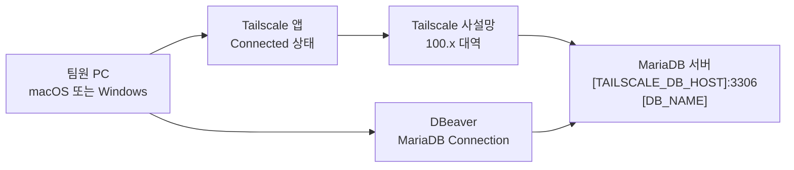

# MariaDB Tailscale 외부망 연결 가이드

> **작성일**: 2026-07-10
> **버전**: v0.1.0
> **대상**: Minchodan 팀원 macOS / Windows 개발 환경
> **목적**: Tailscale 사설망을 통해 외부망에서도 팀 공유 MariaDB에 안전하게 접속하는 절차를 정리합니다.

---

## 1. 핵심 요약

이 문서는 팀원이 학교, 집, 카페 등 로컬 WiFi가 다른 환경에서도 **Tailscale 사설망**을 통해 Minchodan MariaDB에 접속하기 위한 설정 가이드입니다.

중요한 점은 MariaDB를 일반 인터넷에 공개하는 방식이 아니라, 초대받은 팀원만 접근 가능한 **Tailscale tailnet 내부 주소**로 접속한다는 것입니다. 따라서 Tailscale 앱이 꺼져 있거나 로그아웃되어 있으면 DBeaver와 애플리케이션 모두 DB에 접속할 수 없습니다.

| 구분 | 올바른 값 | 주의할 값 |
| --- | --- | --- |
| **Host** | `[TAILSCALE_DB_HOST]` | `192.168.0.x`를 사용하지 않습니다. |
| **Port** | `3306` | Docker 로컬 포트와 혼동하지 않습니다. |
| **Database** | `[DB_NAME]` | 과거 초안의 `minchodan_tmp`를 사용하지 않습니다. |
| **Username** | `[DB_USER]` | 개인 OS 계정명과 다릅니다. |
| **Password** | `[DB_PASSWORD]` | 문서나 Git에 실제 값을 기록하지 않습니다. |
| **접속 전제** | Tailscale `Connected` | Tailscale이 꺼져 있으면 접속되지 않습니다. |

---

## 2. 연결 구조



---

## 3. 공통 접속 정보

| 항목 | 값 |
| --- | --- |
| **Database Type** | `MariaDB` |
| **Host** | `[TAILSCALE_DB_HOST]` |
| **Port** | `3306` |
| **Database** | `[DB_NAME]` |
| **Username** | `[DB_USER]` |
| **Password** | `[DB_PASSWORD]` |
| **Tailscale 초대 링크** | `[TAILSCALE_INVITE_URL]` |

> 실제 DB 비밀번호는 별도 안전한 채널로 전달받아야 합니다. `.env`, 문서, 커밋 메시지, 채팅 로그에 실제 비밀번호를 남기지 않습니다.

---

## 4. 사전 준비 체크리스트

| 순서 | 확인 항목 | 완료 기준 |
| --- | --- | --- |
| 1 | Tailscale 설치 | macOS 또는 Windows에 Tailscale 앱이 설치되어 있습니다. |
| 2 | 본인 계정 로그인 | Tailscale 앱에서 본인 계정으로 로그인되어 있습니다. |
| 3 | 공유 초대 수락 | 전달받은 초대 링크를 열고 Minchodan tailnet 초대를 수락했습니다. |
| 4 | 연결 상태 확인 | Tailscale 앱 상태가 `Connected`입니다. |
| 5 | DB 접속 정보 확인 | Host, Port, Database, Username 값을 위 표와 동일하게 입력합니다. |
| 6 | DB 비밀번호 확보 | `[DB_PASSWORD]` 실제 값을 별도 채널로 전달받았습니다. |

---

## 5. macOS 사용자 연결 가이드

### 5.1 Tailscale 설치

Homebrew를 사용하는 경우 아래 명령으로 설치합니다.

```bash
brew install tailscale-app
```

설치 후 Launchpad 또는 Applications 폴더에서 Tailscale 앱을 실행합니다.

> Homebrew 설치가 실패하거나 조직 정책상 Homebrew를 사용할 수 없는 경우에는 Tailscale 공식 다운로드 페이지에서 macOS용 앱을 직접 설치합니다.

### 5.2 Tailscale 로그인

| 단계 | 작업 | 확인 기준 |
| --- | --- | --- |
| 1 | Tailscale 앱 실행 | 메뉴 막대에 Tailscale 아이콘이 표시됩니다. |
| 2 | `Log in` 선택 | 브라우저 로그인 화면이 열립니다. |
| 3 | 본인 계정으로 로그인 | Tailscale 앱에 계정명이 표시됩니다. |
| 4 | 초대 링크 수락 | Minchodan tailnet 공유 초대가 수락됩니다. |
| 5 | 상태 확인 | 앱 상태가 `Connected`로 표시됩니다. |

초대 링크는 아래 주소를 사용합니다.

```text
[TAILSCALE_INVITE_URL]
```

### 5.3 터미널 연결 확인

터미널에서 아래 명령을 실행합니다.

```bash
tailscale status
tailscale ping [TAILSCALE_DB_HOST]
```

정상 상태는 아래와 같이 판단합니다.

| 명령 | 정상 기준 | 실패 시 확인 |
| --- | --- | --- |
| `tailscale status` | 본인 장비와 공유된 장비 목록이 표시됩니다. | 앱 로그인 상태와 초대 수락 여부를 확인합니다. |
| `tailscale ping [TAILSCALE_DB_HOST]` | `pong` 또는 직접 연결 성공 메시지가 표시됩니다. | Tailscale이 `Connected`인지 확인합니다. |

MariaDB 포트까지 열려 있는지 확인하려면 아래 명령을 사용할 수 있습니다.

```bash
nc -vz [TAILSCALE_DB_HOST] 3306
```

`succeeded` 또는 `open` 계열 메시지가 나오면 네트워크와 포트 도달성은 통과한 것입니다. 단, 이 결과는 DB 로그인 성공을 의미하지는 않습니다.

### 5.4 DBeaver 연결 설정

| DBeaver 화면 | 입력값 |
| --- | --- |
| **Database Type** | `MariaDB` |
| **Host** | `[TAILSCALE_DB_HOST]` |
| **Port** | `3306` |
| **Database** | `[DB_NAME]` |
| **Username** | `[DB_USER]` |
| **Password** | 전달받은 실제 DB 비밀번호 |

설정 순서는 아래와 같습니다.

| 순서 | DBeaver 작업 |
| --- | --- |
| 1 | `Database` 메뉴를 선택합니다. |
| 2 | `New Database Connection`을 선택합니다. |
| 3 | `MariaDB`를 선택합니다. |
| 4 | Host, Port, Database, Username, Password를 입력합니다. |
| 5 | `Test Connection`을 실행합니다. |
| 6 | 성공하면 `Finish`를 선택합니다. |

### 5.5 선택 사항: MariaDB CLI로 확인

MariaDB 클라이언트가 설치되어 있다면 아래 명령으로 SQL 응답까지 확인할 수 있습니다.

```bash
mariadb -h [TAILSCALE_DB_HOST] -P 3306 -u [DB_USER] -p [DB_NAME] -e "SELECT 1;"
```

비밀번호 입력 후 `1` 값이 반환되면 Tailscale 도달성, MariaDB 포트, DB 계정 인증이 모두 통과한 것입니다.

---

## 6. Windows 사용자 연결 가이드

### 6.1 Tailscale 설치

아래 공식 다운로드 페이지에서 Windows용 Tailscale 설치 파일을 내려받아 설치합니다.

```text
https://tailscale.com/download
```

설치 후 시작 메뉴에서 Tailscale 앱을 실행합니다.

### 6.2 Tailscale 로그인

| 단계 | 작업 | 확인 기준 |
| --- | --- | --- |
| 1 | Tailscale 앱 실행 | 시스템 트레이에 Tailscale 아이콘이 표시됩니다. |
| 2 | `Log in` 선택 | 기본 브라우저에서 로그인 화면이 열립니다. |
| 3 | 본인 계정으로 로그인 | Tailscale 앱에 계정명이 표시됩니다. |
| 4 | 초대 링크 수락 | Minchodan tailnet 공유 초대가 수락됩니다. |
| 5 | 상태 확인 | 앱 상태가 `Connected`로 표시됩니다. |

초대 링크는 아래 주소를 사용합니다.

```text
[TAILSCALE_INVITE_URL]
```

### 6.3 PowerShell 연결 확인

PowerShell에서 아래 명령을 실행합니다.

```powershell
tailscale status
tailscale ping [TAILSCALE_DB_HOST]
```

정상 상태는 아래와 같이 판단합니다.

| 명령 | 정상 기준 | 실패 시 확인 |
| --- | --- | --- |
| `tailscale status` | 본인 장비와 공유된 장비 목록이 표시됩니다. | Tailscale 앱 실행 여부와 로그인 상태를 확인합니다. |
| `tailscale ping [TAILSCALE_DB_HOST]` | `pong` 또는 직접 연결 성공 메시지가 표시됩니다. | 초대 수락 여부와 `Connected` 상태를 확인합니다. |

MariaDB 포트까지 열려 있는지 확인하려면 아래 PowerShell 명령을 사용할 수 있습니다.

```powershell
Test-NetConnection [TAILSCALE_DB_HOST] -Port 3306
```

`TcpTestSucceeded : True`가 표시되면 네트워크와 포트 도달성은 통과한 것입니다. 단, 이 결과는 DB 로그인 성공을 의미하지는 않습니다.

### 6.4 DBeaver 연결 설정

| DBeaver 화면 | 입력값 |
| --- | --- |
| **Database Type** | `MariaDB` |
| **Host** | `[TAILSCALE_DB_HOST]` |
| **Port** | `3306` |
| **Database** | `[DB_NAME]` |
| **Username** | `[DB_USER]` |
| **Password** | 전달받은 실제 DB 비밀번호 |

설정 순서는 아래와 같습니다.

| 순서 | DBeaver 작업 |
| --- | --- |
| 1 | `Database` 메뉴를 선택합니다. |
| 2 | `New Database Connection`을 선택합니다. |
| 3 | `MariaDB`를 선택합니다. |
| 4 | Host, Port, Database, Username, Password를 입력합니다. |
| 5 | 최초 연결 시 드라이버 다운로드 안내가 나오면 승인합니다. |
| 6 | `Test Connection`을 실행합니다. |
| 7 | 성공하면 `Finish`를 선택합니다. |

### 6.5 선택 사항: MariaDB CLI로 확인

MariaDB 클라이언트가 설치되어 있다면 아래 명령으로 SQL 응답까지 확인할 수 있습니다.

```powershell
mariadb -h [TAILSCALE_DB_HOST] -P 3306 -u [DB_USER] -p [DB_NAME] -e "SELECT 1;"
```

비밀번호 입력 후 `1` 값이 반환되면 Tailscale 도달성, MariaDB 포트, DB 계정 인증이 모두 통과한 것입니다.

---

## 7. 프로젝트 `.env` 설정 예시

FastAPI 서버나 DB 관련 스크립트에서 원격 MariaDB를 사용하려면 프로젝트 루트의 `.env`에 아래 값을 기준으로 설정합니다.

```dotenv
DB_TYPE=mariadb
DB_HOST=[TAILSCALE_DB_HOST]
DB_PORT=3306
DB_NAME=[DB_NAME]
DB_USER=[DB_USER]
DB_PASSWORD=[DB_PASSWORD]
```

| 항목 | 주의 사항 |
| --- | --- |
| **`.env` 위치** | 프로젝트 루트의 `.env`를 기준으로 합니다. |
| **`DB_HOST`** | `192.168.0.x`가 아니라 `[TAILSCALE_DB_HOST]`입니다. |
| **`DB_NAME`** | `minchodan_tmp`가 아니라 `[DB_NAME]`입니다. |
| **`DB_PASSWORD`** | 실제 값은 Git에 커밋하지 않습니다. |
| **Docker Compose 환경** | 로컬 Compose MariaDB는 별도 설정을 사용할 수 있으므로 원격 DB 설정과 혼동하지 않습니다. |

---

## 8. 연결 성공 판정 기준

DB 접속 문제를 볼 때는 아래 3단계를 분리해서 판단합니다.

| 단계 | 확인 대상 | 확인 명령 또는 도구 | 성공 기준 |
| --- | --- | --- | --- |
| 1 | **Tailscale 사설망 연결** | `tailscale status` | 장비 목록이 보이고 앱이 `Connected`입니다. |
| 2 | **원격 호스트 도달성** | `tailscale ping [TAILSCALE_DB_HOST]` | `pong` 또는 연결 성공 메시지가 나옵니다. |
| 3 | **MariaDB 포트 도달성** | macOS `nc -vz`, Windows `Test-NetConnection` | `3306` 포트가 열려 있습니다. |
| 4 | **MariaDB 인증** | DBeaver `Test Connection` 또는 `SELECT 1` | DB 로그인 후 쿼리 응답이 반환됩니다. |

> 1~3단계가 성공해도 4단계가 실패할 수 있습니다. 이 경우 네트워크 문제가 아니라 DB 계정, 비밀번호, 권한 문제일 가능성이 높습니다.

---

## 9. 자주 발생하는 문제와 해결

| 증상 | 가능 원인 | 해결 방법 |
| --- | --- | --- |
| `tailscale` 명령을 찾을 수 없음 | Tailscale CLI가 PATH에 없거나 앱이 설치되지 않았습니다. | 앱 설치 여부를 확인하고, 앱을 실행한 뒤 다시 터미널 또는 PowerShell을 엽니다. |
| `tailscale status`에 장비가 보이지 않음 | 로그인되지 않았거나 초대를 수락하지 않았습니다. | 본인 계정으로 로그인하고 초대 링크를 다시 확인합니다. |
| `tailscale ping [TAILSCALE_DB_HOST]` 실패 | Tailscale이 꺼져 있거나 공유 장비 접근 권한이 없습니다. | 앱 상태를 `Connected`로 만들고 초대 수락 상태를 확인합니다. |
| DBeaver `Connection refused` | MariaDB 포트가 열려 있지 않거나 서버 측 서비스가 내려가 있습니다. | `nc` 또는 `Test-NetConnection`으로 `3306` 도달성을 먼저 확인합니다. |
| DBeaver `Access denied` | DB 계정명, 비밀번호, 또는 MariaDB 권한이 맞지 않습니다. | `[DB_USER]` 계정과 전달받은 비밀번호를 다시 확인합니다. |
| DBeaver가 다른 DB를 보여줌 | Database 이름을 잘못 입력했습니다. | `[DB_NAME]`로 입력했는지 확인합니다. |
| 로컬에서는 되는데 외부망에서 안 됨 | Tailscale 연결이 빠졌거나 로컬 IP를 사용했습니다. | Host를 `[TAILSCALE_DB_HOST]`로 바꾸고 Tailscale을 켭니다. |
| 앱은 실패하지만 DBeaver는 성공 | 프로젝트 `.env`가 DBeaver 설정과 다릅니다. | 루트 `.env`의 `DB_HOST`, `DB_PORT`, `DB_NAME`, `DB_USER`를 확인합니다. |

---

## 10. 최종 점검표

| 점검 항목 | 기대값 |
| --- | --- |
| Tailscale 앱 상태 | `Connected` |
| Tailscale Host | `[TAILSCALE_DB_HOST]` |
| MariaDB Port | `3306` |
| Database | `[DB_NAME]` |
| Username | `[DB_USER]` |
| DBeaver Test Connection | 성공 |
| 선택 SQL 확인 | `SELECT 1;` 응답 |

위 항목이 모두 통과하면 팀 공유 MariaDB를 Tailscale 외부망 경유로 사용할 준비가 완료된 상태입니다.
