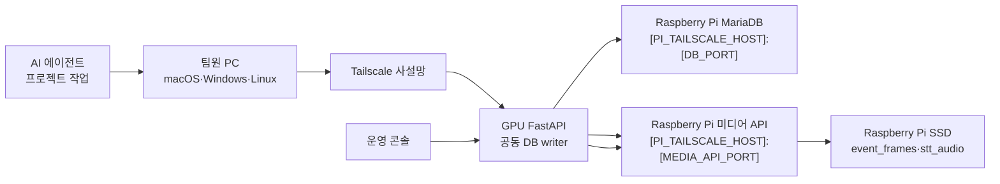

# MariaDB·미디어 저장 API Tailscale 연결 가이드 (외부 공개용)

> **작성일**: 2026-07-17
> **버전**: v0.3.0
> **공개 범위**: 외부 공유 가능
> **상태**: 실제 내부 식별자를 제거하고 플레이스홀더로 치환한 공개용 템플릿
> **내부 문서**: 실접속 정보가 필요한 승인 팀원은 Git에서 제외된 `README.internal.md`를 별도 보안 채널로 전달받습니다.
> **대상**: Minchodan 팀원, 백엔드 개발자, 운영 담당자, AI 코딩 에이전트
> **목적**: Tailscale 기반 MariaDB와 중앙 미디어 저장 API의 연결·진단 절차를 외부 공개 가능한 형태로 제공합니다. 대괄호 플레이스홀더는 각 조직의 실제 값으로 교체합니다.

---

## 1. 먼저 읽을 핵심 결론

Minchodan의 공동 데이터 저장소는 Raspberry Pi 5B 한 대에 모여 있지만, **MariaDB와 미디어 저장 API는 서로 다른 서비스**입니다.

| 구분                | 공개용 설정 형식                              | 저장 내용                                                      | 인증                     |
| :------------------ | :-------------------------------------------- | :------------------------------------------------------------- | :----------------------- |
| **MariaDB**         | `[PI_TAILSCALE_HOST]:[DB_PORT]`               | 사용자, 기기, 탐지·가이드 로그, 미디어 object key와 STT 전사문 | MariaDB 계정·비밀번호    |
| **미디어 저장 API** | `http://[PI_TAILSCALE_HOST]:[MEDIA_API_PORT]` | 이벤트 프레임 JPEG, 사용자가 말한 STT 원본 음성 파일           | Bearer Token             |
| **저장 디스크**     | Raspberry Pi SSD의 `[MEDIA_STORAGE_ROOT]`     | MariaDB datadir, `event_frames`, `stt_audio`                   | Pi 서비스 계정·파일 권한 |
| **네트워크**        | Tailscale 사설망                              | 팀 장비와 Raspberry Pi 간 통신                                 | Tailnet 멤버십·접근 정책 |

팀원이 기억해야 할 원칙은 다음과 같습니다.

| 원칙                                         | 설명                                                                                                                                    |
| :------------------------------------------- | :-------------------------------------------------------------------------------------------------------------------------------------- |
| **루트 `.env`가 서버 런타임 기준**           | FastAPI와 DB 코드는 프로젝트 루트 `.env`를 읽습니다. `client/.env` 또는 `.vscode/.env`에 DB 비밀번호나 미디어 API 토큰을 넣지 않습니다. |
| **DB에는 파일을 넣지 않음**                  | MariaDB에는 `frame_path`, `stt_audio_path` 같은 object key와 메타데이터만 저장합니다. JPEG/WAV BLOB을 저장하지 않습니다.                |
| **사용자 STT 음성과 TTS를 구분**             | `stt_audio_path`가 가리키는 파일은 LLM이 만든 TTS가 아니라 **사용자가 말한 원본 STT 입력 음성**입니다.                                  |
| **모든 FastAPI writer가 같은 저장 API 사용** | `EVENT_FRAME_STORAGE_BACKEND=remote`를 사용해야 여러 FastAPI가 공동 DB에 기록해도 로컬 파일 분산으로 인한 MISS가 재발하지 않습니다.     |
| **비밀값은 별도 전달**                       | DB 비밀번호와 `IMAGE_SERVER_TOKEN`은 문서, Git, 이슈, 채팅 로그, 콘솔 로그에 남기지 않습니다.                                           |
| **연결과 인증을 분리해 진단**                | Tailscale 연결, TCP 포트, MariaDB 인증, 미디어 API 인증을 각각 확인합니다.                                                              |

---

## 2. 운영 전 확인 항목

공개 문서에는 실제 호스트명, Tailscale IP, 서비스 버전, 현재 가동 상태, 디스크 용량을 기록하지 않습니다. 승인된 팀원은 내부 문서 또는 운영 환경에서 아래 항목을 다시 확인합니다.

| 검증 항목                   | 공개용 표기                                   | 내부 확인 기준                                    |
| :-------------------------- | :-------------------------------------------- | :------------------------------------------------ |
| **Raspberry Pi 호스트명**   | `[PI_HOSTNAME]`                               | 승인된 Tailnet 장비명과 일치                      |
| **Tailscale 주소**          | `[PI_TAILSCALE_HOST]`                         | 현재 Pi의 Tailscale IPv4 또는 MagicDNS            |
| **MariaDB 주소**            | `[PI_TAILSCALE_HOST]:[DB_PORT]`               | TCP 도달성과 DB 인증을 각각 확인                  |
| **미디어 API 주소**         | `http://[PI_TAILSCALE_HOST]:[MEDIA_API_PORT]` | 헬스체크와 Bearer 인증을 각각 확인                |
| **DB 식별자**               | `[DB_NAME]`, `[DB_USER]`                      | 팀 관리자가 전달한 값과 일치                      |
| **저장 경로·서비스명·버전** | 공개 문서에 미기재                            | Pi 운영 담당자가 내부에서 확인                    |
| **Log 확장 컬럼**           | 컬럼명만 공개 가능                            | 대상 MariaDB에서 `information_schema`로 존재 확인 |

과거의 정상 상태 기록은 현재 연결 성공을 보장하지 않습니다. 작업 시작 시 Tailscale, TCP, 서비스 인증 순서로 읽기 전용 재검증을 수행합니다.

---

## 3. 전체 연결 구조



| 데이터 흐름               | 처리 방식                                                                                                                           |
| :------------------------ | :---------------------------------------------------------------------------------------------------------------------------------- |
| **탐지 이벤트 프레임**    | FastAPI가 JPEG를 미디어 API에 업로드한 후 반환된 `YYYYMMDD/{event_id}.jpg`를 `detection_guidance_logs.frame_path`에 저장합니다.     |
| **사용자 STT 원본 음성**  | FastAPI가 사용자 입력 오디오를 미디어 API에 업로드한 후 object key를 `stt_audio_path`, 전사문을 `stt_transcript_text`에 저장합니다. |
| **운영 콘솔 이미지 조회** | 콘솔은 미디어 API 토큰을 직접 받지 않습니다. 관리자 FastAPI의 `GET [ADMIN_EVENT_FRAME_PROXY_PATH]`를 통해 프록시 조회합니다.        |
| **TTS 결과 음성**         | 현재 `stt_audio_path` 저장 대상이 아닙니다. 사용자 STT 입력과 혼동하지 않습니다.                                                    |

미디어 저장은 사용자 반사 알림과 인지 가이드 전송 이후의 로그 경로에서 수행합니다. 저장 서버 장애가 발생해도 사용자 안전 안내를 중단시키면 안 됩니다.

---

## 4. 접근 역할과 권한 경계

모든 팀원이 Raspberry Pi의 SSH·sudo 권한을 가질 필요는 없습니다. 작업 목적에 맞는 최소 권한만 사용합니다.

| 역할               | 필요한 접근                                  | 허용 작업                                         | 기본적으로 금지할 작업                           |
| :----------------- | :------------------------------------------- | :------------------------------------------------ | :----------------------------------------------- |
| **DBeaver 사용자** | Tailscale, MariaDB 앱 계정                   | 테이블 조회, 승인된 개발 데이터 CRUD              | Pi SSH, systemd, SSD 조작                        |
| **FastAPI 개발자** | Tailscale, MariaDB 앱 계정, 미디어 API Token | 애플리케이션 실행, 로그·미디어 연동 테스트        | 운영 DB 임의 DDL, 실제 사용자 음성 임의 다운로드 |
| **DB 담당자**      | 별도 승인된 MariaDB 관리 계정                | 백업, 검토된 마이그레이션, 권한 점검              | 백업 없는 ALTER, 운영 테이블 DROP                |
| **Pi 운영 담당자** | SSH 공개키, 필요한 sudo                      | 서비스·마운트·방화벽·로그 점검                    | 작업 범위 밖 설정 변경, 토큰 노출                |
| **AI 에이전트**    | 사용자가 명시한 작업 범위                    | 읽기 전용 진단, 코드·문서 수정, 승인된 smoke test | 비밀값 출력, 파괴적 명령, 권한 확대 추정         |

---

## 5. 팀원에게 안전하게 전달할 접속 정보

공개 문서에는 아래 비밀값의 실제 내용을 넣지 않습니다. 팀 관리자가 승인된 비밀관리 도구 또는 별도 안전 채널로 전달합니다.

| 항목                           | 팀 표준값 또는 전달 방식                      |
| :----------------------------- | :-------------------------------------------- |
| **Tailscale DB·미디어 호스트** | `[PI_TAILSCALE_HOST]`                         |
| **MariaDB Port**               | `[DB_PORT]`                                   |
| **Database**                   | `[DB_NAME]`                                   |
| **Username**                   | `[DB_USER]`                                   |
| **DB Password**                | `[DB_PASSWORD_FROM_TEAM_ADMIN]`               |
| **미디어 API URL**             | `http://[PI_TAILSCALE_HOST]:[MEDIA_API_PORT]` |
| **미디어 API Token**           | `[IMAGE_SERVER_TOKEN_FROM_TEAM_ADMIN]`        |
| **Tailnet 초대**               | `[TAILSCALE_INVITE_FROM_TEAM_ADMIN]`          |
| **Pi SSH 계정·키**             | 운영 담당자에게만 별도 제공                   |

비밀값을 전달받은 뒤 다음 위치에만 저장합니다.

| 값                   | 허용 위치                                      | 금지 위치                                              |
| :------------------- | :--------------------------------------------- | :----------------------------------------------------- |
| **DB Password**      | 프로젝트 루트 `.env`, 개인 DBeaver 보안 저장소 | `.env.example`, `client/.env`, Markdown, Git commit    |
| **미디어 API Token** | 프로젝트 루트 `.env`, Pi의 root 전용 환경 파일 | React Native 공개 환경 변수, Vite 환경 변수, 콘솔 코드 |
| **SSH private key**  | 사용자 홈의 `.ssh/`, 권한 `600`                | 프로젝트 폴더, 공유 드라이브, Git                      |

---

## 6. Tailscale 설치와 Tailnet 참여

설치 파일과 운영체제별 최신 절차는 [Tailscale 공식 설치 문서](https://tailscale.com/docs/install)를 기준으로 합니다.

| 운영체제    | 공식 문서                                                                  | 완료 기준                                                |
| :---------- | :------------------------------------------------------------------------- | :------------------------------------------------------- |
| **macOS**   | [Install Tailscale on macOS](https://tailscale.com/docs/install/mac)       | 메뉴 막대 앱 로그인, VPN 구성 허용, 팀 Tailnet 장비 표시 |
| **Windows** | [Install Tailscale on Windows](https://tailscale.com/docs/install/windows) | 시스템 트레이 앱 로그인, 팀 Tailnet 장비 표시            |
| **Linux**   | [Install Tailscale on Linux](https://tailscale.com/docs/install/linux)     | `tailscaled` 실행, `tailscale up` 인증, 팀 장비 표시     |

팀원 공통 절차는 다음과 같습니다.

| 순서  | 작업                                   | 정상 기준                                          |
| :---: | :------------------------------------- | :------------------------------------------------- |
| **1** | Tailscale 설치                         | 앱 또는 CLI가 실행됩니다.                          |
| **2** | 팀에서 지정한 계정으로 로그인          | 본인 장비가 Tailnet에 등록됩니다.                  |
| **3** | 팀 관리자의 초대 또는 장비 승인을 완료 | Raspberry Pi 장비가 상태 목록에 보입니다.          |
| **4** | Tailscale을 `Connected` 상태로 유지    | `tailscale status`가 정상 응답합니다.              |
| **5** | Raspberry Pi에 ping                    | `tailscale ping [PI_TAILSCALE_HOST]`이 응답합니다. |

Tailscale 연결이 꺼져 있으면 MariaDB와 미디어 API 모두 사용할 수 없습니다. 일반 공인 인터넷에 `[DB_PORT]` 또는 `[MEDIA_API_PORT]`을 직접 공개하는 방식으로 우회하지 않습니다.

---

## 7. 네트워크 도달성 확인

### 7.1 macOS·Linux

```bash
tailscale status
tailscale ping [PI_TAILSCALE_HOST]
nc -vz [PI_TAILSCALE_HOST] [DB_PORT]
nc -vz [PI_TAILSCALE_HOST] [MEDIA_API_PORT]
curl --fail http://[PI_TAILSCALE_HOST]:[MEDIA_API_PORT]/health
```

### 7.2 Windows PowerShell

```powershell
tailscale status
tailscale ping [PI_TAILSCALE_HOST]
Test-NetConnection [PI_TAILSCALE_HOST] -Port [DB_PORT]
Test-NetConnection [PI_TAILSCALE_HOST] -Port [MEDIA_API_PORT]
curl.exe --fail http://[PI_TAILSCALE_HOST]:[MEDIA_API_PORT]/health
```

| 계층               | 명령                           | 성공 기준                    | 의미                        |
| :----------------- | :----------------------------- | :--------------------------- | :-------------------------- |
| **Tailnet**        | `tailscale status`             | Raspberry Pi 장비가 보임     | Tailnet 가입 상태 확인      |
| **Tailscale 경로** | `tailscale ping`               | `pong` 또는 연결 성공        | 사설망 라우팅 확인          |
| **DB TCP**         | `nc` 또는 `Test-NetConnection` | `[DB_PORT]` 연결 성공        | MariaDB 포트 도달성 확인    |
| **미디어 TCP**     | `nc` 또는 `Test-NetConnection` | `[MEDIA_API_PORT]` 연결 성공 | 미디어 API 포트 도달성 확인 |
| **미디어 상태**    | `GET /health`                  | HTTP `200`                   | API와 SSD 쓰기 상태 확인    |

TCP 성공은 인증 성공을 의미하지 않습니다. `[DB_PORT]`이 열려 있어도 MariaDB 계정 권한이나 비밀번호가 틀리면 `Access denied`가 발생할 수 있습니다.

---

## 8. DBeaver로 공동 MariaDB 연결

DBeaver만 사용할 팀원은 로컬 MariaDB **서버**를 설치할 필요가 없습니다. DBeaver가 원격 DB 클라이언트 역할을 합니다.

| DBeaver 항목      | 입력값                               |
| :---------------- | :----------------------------------- |
| **Database Type** | `MariaDB`                            |
| **Host**          | `[PI_TAILSCALE_HOST]`                |
| **Port**          | `[DB_PORT]`                          |
| **Database**      | `[DB_NAME]`                          |
| **Username**      | `[DB_USER]`                          |
| **Password**      | 팀 관리자에게 전달받은 실제 비밀번호 |

| 순서  | DBeaver 작업                                                   |
| :---: | :------------------------------------------------------------- |
| **1** | `Database`에서 `New Database Connection`을 선택합니다.         |
| **2** | `MariaDB` 드라이버를 선택합니다.                               |
| **3** | 위 표의 Host, Port, Database, Username, Password를 입력합니다. |
| **4** | 최초 드라이버 다운로드가 필요하면 승인합니다.                  |
| **5** | `Test Connection`을 실행합니다.                                |
| **6** | 연결 후 아래 읽기 전용 SQL로 대상 DB와 컬럼을 확인합니다.      |

```sql
SELECT DATABASE(), CURRENT_USER(), VERSION();
SELECT 1;

SELECT COLUMN_NAME
FROM information_schema.COLUMNS
WHERE TABLE_SCHEMA = '[DB_NAME]'
  AND TABLE_NAME = 'detection_guidance_logs'
  AND COLUMN_NAME IN (
      'event_source',
      'stt_transcript_text',
      'stt_audio_path',
      'stt_audio_storage_status',
      'writer_instance_id'
  )
ORDER BY ORDINAL_POSITION;
```

`CURRENT_USER()`의 Host 부분은 MariaDB 권한 매칭 결과이며, 현재 PC의 표시 이름과 다를 수 있습니다.

---

## 9. 프로젝트 루트 `.env` 설정

새 체크아웃에서는 [`.env.example`](../../.env.example)을 복사해 루트 `.env`를 만들고, 기존 `.env`가 있다면 파일 전체를 덮어쓰지 말고 아래 키만 확인합니다.

```dotenv
# --- 공동 MariaDB ---
DB_TYPE=mariadb
DB_HOST=[PI_TAILSCALE_HOST]
DB_PORT=[DB_PORT]
DB_NAME=[DB_NAME]
DB_USER=[DB_USER]
DB_PASSWORD=[DB_PASSWORD_FROM_TEAM_ADMIN]

# --- Raspberry Pi 중앙 미디어 저장 API ---
EVENT_FRAME_STORAGE_BACKEND=remote
IMAGE_SERVER_BASE_URL=http://[PI_TAILSCALE_HOST]:[MEDIA_API_PORT]
IMAGE_SERVER_TOKEN=[IMAGE_SERVER_TOKEN_FROM_TEAM_ADMIN]
IMAGE_UPLOAD_TIMEOUT_SECONDS=3
IMAGE_UPLOAD_MAX_RETRIES=1
WRITER_INSTANCE_ID=[UNIQUE_FASTAPI_INSTANCE_ID]
```

| 변수                              | 규칙                                                                                                    |
| :-------------------------------- | :------------------------------------------------------------------------------------------------------ |
| **`DB_HOST`**                     | 공동 DB 사용 시 `[PI_TAILSCALE_HOST]`입니다. `localhost` 또는 `mariadb`로 바꾸면 다른 DB를 보게 됩니다. |
| **`EVENT_FRAME_STORAGE_BACKEND`** | 다중 writer 공동 환경에서는 `remote`를 사용합니다.                                                      |
| **`IMAGE_SERVER_BASE_URL`**       | 끝에 API 세부 경로를 붙이지 않고 기본 URL만 설정합니다.                                                 |
| **`IMAGE_SERVER_TOKEN`**          | Pi의 `[MEDIA_SERVER_ENV_FILE]`와 같은 토큰이어야 합니다. 실제 값은 서버 담당자에게 받습니다.            |
| **`WRITER_INSTANCE_ID`**          | FastAPI 인스턴스마다 고유해야 합니다. 예: `gpu-desktop-a`, `gpu-macmini-b`.                             |
| **`client/.env`**                 | 모바일 네트워크·device 설정용입니다. DB 비밀번호와 미디어 토큰을 넣지 않습니다.                         |

### 9.1 비밀값을 출력하지 않는 설정 확인

macOS·Linux에서 다음 명령은 값 대신 설정 여부만 표시합니다.

```bash
awk 'BEGIN { FS="=" }
  /^[[:space:]]*[A-Za-z_][A-Za-z0-9_]*[[:space:]]*=/ {
    key=$1
    gsub(/[[:space:]]/, "", key)
    if (key ~ /PASSWORD|TOKEN|SECRET|KEY/) {
      print key "=<configured>"
    }
  }
' .env
```

AI 에이전트는 `.env` 전체를 `cat`, `sed`, `git diff`, 터미널 로그로 출력하지 않습니다. 필요한 경우 변수명, 값 존재 여부, 길이, 해시처럼 비식별 정보만 확인합니다.

---

## 10. 애플리케이션 연결 smoke test

### 10.1 MariaDB `SELECT 1`

프로젝트 가상환경이 준비된 상태에서 실행합니다.

```bash
./.venv/bin/python - <<'PY'
import asyncio
from sqlalchemy import text


async def main() -> None:
    from server.db.connection import engine

    async with engine.connect() as connection:
        result = await connection.execute(text("SELECT 1"))
        print(f"db_select_1={result.scalar_one() == 1}")
    await engine.dispose()


asyncio.run(main())
PY
```

정상 결과는 `db_select_1=True`입니다. 이 검증은 DB 구조 전체가 최신이라는 뜻이 아니라 현재 `.env`의 네트워크·계정·Database 설정이 SQL 실행까지 통과했다는 뜻입니다.

### 10.2 미디어 API 상태와 Bearer 인증

다음 검증은 존재하지 않는 테스트 object key를 조회하므로 파일을 생성하거나 삭제하지 않습니다. 인증이 성공하면 `404`, 인증이 실패하면 일반적으로 `401` 또는 `403`이 반환됩니다.

```bash
./.venv/bin/python - <<'PY'
import os
import httpx
from dotenv import load_dotenv


load_dotenv(dotenv_path=".env")
base_url = os.environ["IMAGE_SERVER_BASE_URL"].rstrip("/")
token = os.environ["IMAGE_SERVER_TOKEN"]

with httpx.Client(base_url=base_url, timeout=3.0) as client:
    health = client.get("/health")
    auth_probe = client.get(
        "[EVENT_FRAME_API_PATH]/20990101/team-readonly-probe",
        headers={"Authorization": f"Bearer {token}"},
    )

print(f"health_status={health.status_code}")
print(f"authenticated_missing_object_status={auth_probe.status_code}")
PY
```

| 출력                                      | 정상값 | 의미                                                |
| :---------------------------------------- | :----- | :-------------------------------------------------- |
| **`health_status`**                       | `200`  | 미디어 API와 SSD 상태 정상                          |
| **`authenticated_missing_object_status`** | `404`  | Bearer Token 인증 성공, 테스트 파일은 존재하지 않음 |

### 10.3 원격 저장 활성화 확인

```bash
./.venv/bin/python -c "from server.services.remote_storage_client import is_remote_storage_enabled; print(is_remote_storage_enabled())"
```

정상값은 `True`입니다. 설정 변경 후에는 이미 실행 중인 FastAPI 프로세스나 컨테이너를 재시작해 환경 변수를 다시 읽게 합니다.

---

## 11. Docker Compose에서 공동 DB 유지하기

현재 Compose의 FastAPI는 루트 `.env`의 원격 `DB_HOST`를 유지하고, `COMPOSE_DB_HOST`가 명시된 경우에만 대상을 재정의합니다.

| 실행 목적                | 설정                                                    | FastAPI가 보는 DB             |
| :----------------------- | :------------------------------------------------------ | :---------------------------- |
| **공동 MariaDB 사용**    | `DB_HOST=[PI_TAILSCALE_HOST]`, `COMPOSE_DB_HOST` 미설정 | Raspberry Pi 공동 MariaDB     |
| **로컬 Compose DB 사용** | `COMPOSE_DB_HOST=mariadb`와 로컬 `COMPOSE_DB_*` 명시    | Compose의 `mariadb:[DB_PORT]` |

공동 DB를 사용할 때는 `DB_HOST=mariadb`로 바꾸지 않습니다. Compose 설정을 확인할 때 `docker compose config` 전체 출력에는 환경 비밀값이 포함될 수 있으므로 채팅이나 이슈에 그대로 붙이지 않습니다.

실행 중 FastAPI 컨테이너가 보는 비밀이 아닌 대상값만 확인합니다.

```bash
docker compose -f docker/docker-compose.yml exec fastapi \
  sh -lc 'printf "DB_HOST=%s\nDB_PORT=%s\nDB_NAME=%s\n" "$DB_HOST" "$DB_PORT" "$DB_NAME"'
```

데이터베이스 장애 진단 중 `docker compose down -v`를 실행하지 않습니다. `-v`는 로컬 MariaDB 볼륨 등 영속 데이터를 삭제할 수 있으며 원인 증거도 사라집니다.

---

## 12. 미디어 저장 API 계약

미디어 API는 FastAPI 서버가 호출하는 내부 저장 서비스입니다. 모바일 앱이나 운영 콘솔이 Bearer Token으로 직접 호출하지 않습니다.

| 메서드·경로                                       | 목적                                       | 인증         |
| :------------------------------------------------ | :----------------------------------------- | :----------- |
| `GET /health`                                     | SSD 마운트·프레임·음성 저장 쓰기 상태 확인 | 없음         |
| `PUT [EVENT_FRAME_API_PATH]/{event_id}`           | 이벤트 JPEG 업로드                         | Bearer Token |
| `GET [EVENT_FRAME_API_PATH]/{date}/{event_id}`    | 이벤트 JPEG 조회                           | Bearer Token |
| `DELETE [EVENT_FRAME_API_PATH]/{date}/{event_id}` | 이벤트 JPEG 관리자 삭제                    | Bearer Token |
| `PUT [STT_AUDIO_API_PATH]/{event_id}`             | 사용자 STT 원본 음성 업로드                | Bearer Token |
| `GET [STT_AUDIO_API_PATH]/{date}/{filename}`      | 사용자 STT 원본 음성 조회                  | Bearer Token |
| `DELETE [STT_AUDIO_API_PATH]/{date}/{filename}`   | 사용자 STT 원본 음성 관리자 삭제           | Bearer Token |

| 파일 종류         | object key 예시                         | MariaDB 연결 필드 |
| :---------------- | :-------------------------------------- | :---------------- |
| **이벤트 프레임** | `20260717/event-device-reflex-1234.jpg` | `frame_path`      |
| **STT 원본 음성** | `20260717/stt-device-1234.wav`          | `stt_audio_path`  |

`stt_audio_storage_status`는 다음 상태를 구분합니다.

| 상태                 | 의미                                                  |
| :------------------- | :---------------------------------------------------- |
| **`available`**      | 미디어 API 업로드 성공, `stt_audio_path` 사용 가능    |
| **`upload_failed`**  | 업로드를 시도했으나 실패, `stt_audio_error_code` 확인 |
| **`not_saved`**      | STT 이벤트지만 원본 음성이 저장되지 않음              |
| **`not_applicable`** | STT 음성 저장 대상이 아닌 탐지·내비게이션 이벤트      |

사용자 원본 음성은 개인정보가 포함될 수 있습니다. 기능 개발에 필요한 경우에도 합성 테스트 음성을 우선 사용하고, 실제 사용자 파일 조회는 명시적인 작업 목적과 권한이 있을 때만 수행합니다.

---

## 13. `detection_guidance_logs` 연결 기준

| 컬럼                           | 역할                                            |
| :----------------------------- | :---------------------------------------------- |
| **`event_source`**             | `detection`, `stt`, `navigation` 등 이벤트 출처 |
| **`frame_path`**               | 이벤트 프레임 중앙 저장 object key              |
| **`stt_transcript_text`**      | 사용자 음성을 STT로 변환한 발화 문장            |
| **`stt_audio_path`**           | 사용자 STT 원본 음성의 중앙 저장 object key     |
| **`stt_audio_storage_status`** | 원본 음성 저장 성공·실패·비대상 상태            |
| **`stt_audio_format`**         | `wav`, `m4a`, `ogg`, `mp3` 등 저장 포맷         |
| **`stt_audio_size_bytes`**     | 업로드된 원본 음성 크기                         |
| **`stt_audio_duration_ms`**    | STT 입력 음성 길이                              |
| **`stt_audio_sha256`**         | 파일 무결성 확인용 SHA-256                      |
| **`stt_audio_error_code`**     | 업로드 실패 원인 코드                           |
| **`stt_audio_consent_at`**     | 원본 음성 보존 동의 시각을 기록할 수 있는 필드  |
| **`stt_audio_expires_at`**     | 원본 음성 만료 시각을 기록할 수 있는 필드       |
| **`writer_instance_id`**       | 해당 로그를 기록한 FastAPI 인스턴스 식별자      |

최근 상태를 읽기 전용으로 확인하는 예시는 다음과 같습니다.

```sql
SELECT
    log_id,
    event_id,
    event_source,
    frame_path,
    stt_audio_path,
    stt_audio_storage_status,
    writer_instance_id,
    detected_at
FROM detection_guidance_logs
ORDER BY log_id DESC
LIMIT 20;
```

전사문과 실제 음성 파일은 민감정보일 수 있으므로 불필요하게 전체 조회하거나 로그에 출력하지 않습니다.

---

## 14. 기존 DB와 마이그레이션 원칙

현재 Raspberry Pi의 공동 MariaDB에는 STT·writer 컬럼이 이미 적용되어 있습니다. 팀원은 일반 개발 시작 과정에서 마이그레이션을 다시 실행하지 않습니다.

새 DB, 복원 DB 또는 별도 개발 DB에만 다음 파일을 검토해 적용합니다.

| 목적                       | 파일                                                                                                                                                                                     |
| :------------------------- | :--------------------------------------------------------------------------------------------------------------------------------------------------------------------------------------- |
| **STT·writer 컬럼 추가**   | [`server/db/migrations/20260716_002_add_stt_audio_columns_to_detection_guidance_logs.sql`](../../server/db/migrations/20260716_002_add_stt_audio_columns_to_detection_guidance_logs.sql) |
| **마이그레이션 운영 원칙** | [`server/db/migrations/README.md`](../../server/db/migrations/README.md)                                                                                                                 |

해당 마이그레이션은 기존 데이터를 삭제하지 않고 `ALTER TABLE ... ADD COLUMN IF NOT EXISTS`, 기존 행 backfill, 인덱스 추가를 수행합니다. 그래도 운영 반영 전에는 반드시 백업과 팀 리뷰가 필요합니다.

| 작업                          | 실행 주체                  | 필수 선행 조건                                  |
| :---------------------------- | :------------------------- | :---------------------------------------------- |
| **컬럼 조회**                 | 모든 승인된 DB 사용자      | 읽기 전용 SQL                                   |
| **마이그레이션 실행**         | DB 담당자                  | 대상 DB 확인, 백업, SQL 리뷰, 권한 확인         |
| **DROP·TRUNCATE·대량 UPDATE** | 일반 팀원·AI 에이전트 금지 | 별도 변경 승인과 복구 계획 없이는 실행하지 않음 |

Docker의 `/docker-entrypoint-initdb.d/` 초기화 SQL은 **빈 볼륨 최초 생성 시에만** 실행됩니다. 기존 MariaDB 볼륨을 재시작해도 새 마이그레이션이 자동 적용되지 않습니다.

---

## 15. AI 에이전트 작업 규칙

이 문서는 AI 에이전트가 가장 자주 읽는 운영 진입점입니다. 에이전트는 다음 순서를 기본으로 사용합니다.

### 15.1 작업 시작 순서

| 순서  | 에이전트 작업                                                           | 확인 기준                         |
| :---: | :---------------------------------------------------------------------- | :-------------------------------- |
| **1** | `AGENTS.md`, `SKILLS.md`, 본 문서를 읽음                                | 프로젝트·보안·문서 규칙 파악      |
| **2** | 사용자 요청이 DB 조회, 코드 연결, 스키마 변경, Pi 운영 중 무엇인지 분류 | 권한 범위 확정                    |
| **3** | `git status --short`로 기존 사용자 변경 확인                            | 무관한 변경 보존                  |
| **4** | `.env`는 키 존재 여부만 점검                                            | 비밀값 출력 방지                  |
| **5** | Tailscale, TCP, 인증 순서로 읽기 전용 진단                              | 실패 계층 특정                    |
| **6** | 필요한 최소 범위만 수정                                                 | 운영 설정·데이터 불필요 변경 금지 |
| **7** | 정적 검증과 실물 검증을 구분해 보고                                     | 과도한 완료 판정 금지             |

### 15.2 작업 목적별 첫 확인 파일

| 작업 목적              | 첫 확인 파일                                                                                                                                                                       |
| :--------------------- | :--------------------------------------------------------------------------------------------------------------------------------------------------------------------------------- |
| **DB 연결 코드**       | [`server/db/connection.py`](../../server/db/connection.py), [`docs/ops/environment_variables.md`](../ops/environment_variables.md)                                                 |
| **DB 모델·DTO**        | [`server/db/models.py`](../../server/db/models.py), [`server/db/schemas.py`](../../server/db/schemas.py)                                                                           |
| **기존 DB 변경**       | [`server/db/migrations/`](../../server/db/migrations/), 마이그레이션 README                                                                                                        |
| **이벤트 프레임 저장** | [`server/services/event_frame_store.py`](../../server/services/event_frame_store.py), [`server/services/remote_storage_client.py`](../../server/services/remote_storage_client.py) |
| **STT 원본 음성 저장** | [`server/api/ws_router.py`](../../server/api/ws_router.py), [`server/services/detection_guidance_log_service.py`](../../server/services/detection_guidance_log_service.py)         |
| **콘솔 이미지 조회**   | [`server/api/detection_log_router.py`](../../server/api/detection_log_router.py), [`docs/design/api_specification.md`](../design/api_specification.md) §8.5                        |
| **Docker DB 대상**     | [`docker/docker-compose.yml`](../../docker/docker-compose.yml), [`docker/docker-compose.macos.yml`](../../docker/docker-compose.macos.yml)                                         |
| **전체 저장 아키텍처** | [`docs/design/architecture.md`](../design/architecture.md) §13.3.1                                                                                                                 |

### 15.3 에이전트 금지 사항

| 금지 행동                                                  | 이유                                          |
| :--------------------------------------------------------- | :-------------------------------------------- |
| `.env` 전체 내용 출력                                      | DB 비밀번호, API 토큰, 외부 API 키 유출 가능  |
| `IMAGE_SERVER_TOKEN`을 curl 명령 인자에 직접 작성          | 셸 히스토리와 프로세스 목록에 남을 수 있음    |
| `docker compose down -v`를 진단 초기에 실행                | 영속 볼륨 삭제와 증거 소실 가능               |
| 운영 DB에 `DROP`, `TRUNCATE`, 무조건적 `CREATE TABLE` 실행 | 기존 데이터 손실 가능                         |
| `.env.example`을 기존 `.env` 위에 덮어쓰기                 | 사용자별 비밀값과 로컬 설정 손실              |
| `DB_HOST=mariadb`를 공동 환경에 임의 적용                  | FastAPI가 공동 DB가 아닌 로컬 빈 DB를 보게 됨 |
| 미디어 API 토큰을 `client/.env`나 콘솔에 전달              | 앱 번들·브라우저에 비밀 노출                  |
| 실제 사용자 STT 음성을 진단 로그로 출력                    | 개인정보·민감 발화 노출 가능                  |
| 포트가 열렸다는 이유만으로 연결 완료 판정                  | TCP 도달성과 서비스 인증은 별도 계층          |
| 정적 파일 확인만으로 운영 DB 마이그레이션 완료 판정        | 실제 MariaDB 구조 반영 여부를 증명하지 못함   |

---

## 16. 장애 분리와 해결 순서

| 증상                                                  | 우선 확인                                                  | 판단과 조치                                                                                                   |
| :---------------------------------------------------- | :--------------------------------------------------------- | :------------------------------------------------------------------------------------------------------------ |
| **DB와 미디어 API 모두 접속 실패**                    | Tailscale `Connected`, `tailscale ping`, Pi 상태           | Tailnet 또는 Pi 공통 장애 가능성이 큽니다.                                                                    |
| **[DB_PORT]만 실패**                                  | `nc`·`Test-NetConnection`, MariaDB 서비스                  | DB 포트·방화벽·MariaDB 장애를 확인합니다.                                                                     |
| **[DB_PORT]은 열리지만 `Access denied`**              | `DB_USER`, `DB_PASSWORD`, MariaDB Host grant               | 네트워크가 아니라 DB 인증·권한 문제입니다.                                                                    |
| **DBeaver는 되지만 FastAPI는 실패**                   | 루트 `.env`, 실행 프로세스의 실제 `DB_HOST`, 컨테이너 환경 | 앱이 다른 DB나 오래된 환경 변수를 보고 있을 수 있습니다.                                                      |
| **미디어 `/health` 실패**                             | `[MEDIA_API_PORT]`, Pi 서비스, SSD 마운트                  | API 또는 저장 디스크 장애입니다.                                                                              |
| **`/health`는 200, 업로드는 401·403**                 | `IMAGE_SERVER_TOKEN` 일치 여부                             | Bearer 인증 문제입니다. 인증 오류는 무의미하게 재시도하지 않습니다.                                           |
| **`is_remote_storage_enabled()`가 False**             | backend, URL, Token 존재 여부                              | `EVENT_FRAME_STORAGE_BACKEND=remote`와 두 필수값을 확인합니다.                                                |
| **DB에 `frame_path`가 있으나 콘솔 404**               | object key, 미디어 API 파일, 보존 기간                     | 과거 로컬 writer 데이터, 만료, 파일 유실 여부를 구분합니다.                                                   |
| **STT 행이 `not_saved`**                              | 이벤트 시각, 원격 저장 활성화, 업로드 로그                 | 과거 데이터이거나 저장 설정 비활성 상태일 수 있습니다.                                                        |
| **STT 행이 `upload_failed`**                          | `stt_audio_error_code`, [MEDIA_API_PORT], Token, SSD       | 미디어 업로드 실패 계층을 확인합니다.                                                                         |
| **Docker에서 로컬 빈 데이터만 보임**                  | 컨테이너의 `DB_HOST`                                       | `COMPOSE_DB_HOST=mariadb`가 설정됐는지 확인합니다.                                                            |
| **Compose 재시작 후 새 컬럼이 없음**                  | 기존 볼륨 여부, migrations                                 | init SQL은 기존 볼륨에 재실행되지 않으므로 승인된 마이그레이션이 필요합니다.                                  |
| **`[MEDIA_API_PORT]` 포트가 Metro와 충돌한다고 보임** | 호스트 주소 구분                                           | Pi `[PI_TAILSCALE_HOST]:[MEDIA_API_PORT]`과 개발 PC Metro `개발PC:[MEDIA_API_PORT]`은 서로 다른 호스트입니다. |

---

## 17. 팀 작업 완료 판정표

|  번호  | 확인 항목          | 완료 기준                                          |
| :----: | :----------------- | :------------------------------------------------- |
| **1**  | Tailscale 참여     | `tailscale status`에서 Pi 확인                     |
| **2**  | Pi 경로            | `tailscale ping [PI_TAILSCALE_HOST]` 성공          |
| **3**  | MariaDB 포트       | `[DB_PORT]` TCP 성공                               |
| **4**  | MariaDB 인증       | DBeaver 또는 애플리케이션 `SELECT 1` 성공          |
| **5**  | 미디어 API 상태    | `/health` HTTP `200`                               |
| **6**  | 미디어 API 인증    | 읽기 전용 미존재 object probe가 `404`              |
| **7**  | 루트 `.env`        | DB 6개 키와 원격 저장 6개 키 설정                  |
| **8**  | writer 구분        | `WRITER_INSTANCE_ID`가 팀원별로 고유               |
| **9**  | FastAPI 재시작     | 환경 변수 변경 후 새 프로세스에서 적용             |
| **10** | 실데이터 점검      | 신규 이벤트의 object key와 DB 메타데이터 정합 확인 |
| **11** | 비밀정보 보호      | Git·문서·로그에 비밀번호와 토큰 없음               |
| **12** | 사용자 데이터 보호 | 실제 STT 음성을 불필요하게 열람·복사하지 않음      |

---

## 18. 팀원이 AI 에이전트에게 전달할 작업 프롬프트 예시

```text
AGENTS.md와 docs/db_tailscale_guide/README.md를 먼저 읽어줘.
현재 루트 .env의 비밀값은 출력하지 말고 키 존재 여부만 확인해줘.
Tailscale -> TCP [DB_PORT]/[MEDIA_API_PORT] -> MariaDB SELECT 1 -> 미디어 API 인증 순서로
읽기 전용 점검하고, 실패한 계층과 근거만 보고해줘.
운영 DB DDL, docker compose down -v, 실제 사용자 음성 다운로드는 실행하지 마.
```

스키마 작업을 요청할 때는 다음 범위를 추가합니다.

```text
기존 데이터를 보존해야 해. DROP/CREATE로 재생성하지 말고,
server/db/migrations 규칙에 맞는 증분 SQL을 먼저 제안하고 검증해줘.
실제 공동 MariaDB 반영은 백업과 내 명시적 승인 전에는 실행하지 마.
```

---

## 19. 관련 기준 문서

| 문서                                                         | 용도                                                  |
| :----------------------------------------------------------- | :---------------------------------------------------- |
| [환경 변수 명세](../ops/environment_variables.md)            | DB·미디어 저장 환경 변수의 타입, 기본값, 참조 코드    |
| [시스템 아키텍처](../design/architecture.md)                 | 중앙 이벤트 프레임·STT 음성 보존 구조                 |
| [API 명세](../design/api_specification.md)                   | 관리자 로그 조회, 이벤트 프레임 프록시, STT 저장 계약 |
| [배포 가이드](../ops/deployment_guide.md)                    | Docker Compose 실행과 원격·로컬 DB 대상 선택          |
| [DB 마이그레이션 규칙](../../server/db/migrations/README.md) | 기존 MariaDB 증분 변경 절차                           |
| [코드 품질 가이드](../ops/code_quality_guide.md)             | 코드·문서 변경 후 검증 기준                           |

내부 조사 기록과 실접속 정보는 공개 문서와 분리해 보관합니다. 외부 공유 시에는 본 문서처럼 플레이스홀더가 적용된 자료만 사용합니다.

---

## 20. 변경 이력

| 날짜           | 버전       | 변경 내용                                                                                                                     |
| :------------- | :--------- | :---------------------------------------------------------------------------------------------------------------------------- |
| **2026-07-10** | **v0.1.0** | macOS·Windows 팀원의 MariaDB Tailscale 접속 절차를 최초 작성했습니다.                                                         |
| **2026-07-17** | **v0.2.0** | 공동 MariaDB와 Raspberry Pi 미디어 저장 API를 하나의 팀 연결 가이드로 통합했습니다.                                           |
| **2026-07-17** | **v0.3.0** | 실제 Tailscale 주소, DB 식별자, 호스트 상태와 내부 경로를 제거·일반화해 외부 공개용 문서로 전환하고 내부 문서를 분리했습니다. |
