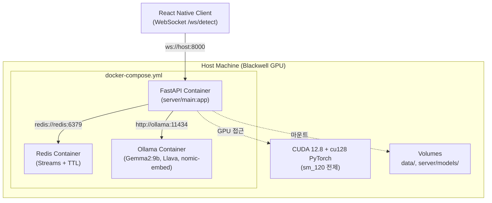

# Minchodan 배포 가이드

> **작성일**: 2026-06-27
> **버전**: v0.1.0
> **설계 기준**: [`docs/architecture.md`](architecture.md) 2절(기술 스택)·13절(MCP 연동)
> **환경 변수 기준**: [`docs/environment_variables.md`](environment_variables.md)
> **코딩 패턴 기준**: [`docs/course_codebase_guide.md`](course_codebase_guide.md) 3.3(경로)·3.4(.env)

---

## 1. 목적

본 문서는 Minchodan의 **Docker 기반 배포 절차**를 단일 명세로 정의합니다. 기존 `docker/` 폴더의 DoctorSkin용 스크립트를 Minchodan용(Redis + Ollama + FastAPI 3컨테이너 구성)으로 전면 재작성한 내용을 포함하며, `test_specification.md` TC-SMOKE-004 "Docker 구성" 검증 기준을 충족합니다.

---

## 2. 컨테이너 아키텍처



### 2.1 컨테이너 구성 매트릭스

| 컨테이너 | 이미지 | 포트 | 볼륨 마운트 | 역할 |
| :--- | :--- | :--- | :--- | :--- |
| **fastapi** | `minchodan-server:latest` (로컬 빌드) | `8000:8000` | `./server:/app/server`, `./data:/app/data`, `./.env:/app/.env` | FastAPI + uvicorn, WebSocket `/ws/detect`, SSE `/api/v1/monitor/stream` |
| **redis** | `redis:7-alpine` (공식) | `6379:6379` | `redis_data:/data` | Redis Streams(`risk.events`, `mcp:metrics`) + Track 컨텍스트 TTL(30초) |
| **ollama** | `ollama/ollama:latest` (공식) | `11434:11434` | `ollama_data:/root/.ollama` | 로컬 LLM(Gemma2:9b, Llava, nomic-embed-text) 추론 |

### 2.2 GPU 접근 가드레일

| 항목 | 지침 |
| :--- | :--- |
| **CUDA 요구사항** | CUDA 12.8 + cu128 PyTorch 휠 (Blackwell sm_120 전제). 11.8/12.1 휠은 silent CPU 폴백 발생 |
| **GPU 검증** | 배포 전 `python scripts/verify_gpu.py`로 `device_capability >= (12,0)` 및 GPU 1 step 연산 검증 |
| **컨테이너 GPU 전달** | `docker-compose.yml`의 `fastapi` 서비스에 `deploy.resources.reservations.devices`로 GPU 전달 |
| **Ollama GPU** | Ollama 컨테이너도 동일 GPU 장치를 사용. 로컬 추론 지연 < 80ms 목표 |

---

## 3. 사전 준비

### 3.1 필수 소프트웨어

| 소프트웨어 | 버전 | 용도 |
| :--- | :--- | :--- |
| **Docker Engine** | 24.0+ | 컨테이너 런타임 |
| **Docker Compose** | v2.20+ | 멀티 컨테이너 오케스트레이션 |
| **NVIDIA Driver** | 550+ | Blackwell GPU 지원 |
| **NVIDIA Container Toolkit** | 최신 | Docker 컨테이너 GPU 접근 |

### 3.2 환경 변수 설정

```powershell
# Windows (PowerShell)
Copy-Item .env.example .env
# .env 파일을 편집하여 실제 값을 채웁니다.
# 상세 변수 목록은 docs/environment_variables.md를 참조.
```

```bash
# macOS / Linux (bash 또는 zsh)
cp .env.example .env
# .env 파일을 편집하여 실제 값을 채웁니다.
```

### 3.3 Ollama 모델 사전 다운로드 (최초 1회)

```bash
# 호스트에서 Ollama 컨테이너 기동 후 모델 pull
docker exec -it minchodan-ollama ollama pull gemma2:9b
docker exec -it minchodan-ollama ollama pull llava
docker exec -it minchodan-ollama ollama pull nomic-embed-text
```

> 모델 다운로드는 최초 1회만 수행하며, `ollama_data` 볼륨에 영속화됩니다.

---

## 4. 배포 절차

### 4.1 Windows (PowerShell)

```powershell
# 1. 프로젝트 루트로 이동
cd D:\korea_IT\2025_LangChain_\Minchodan

# 2. 환경 변수 설정 (최초 1회)
Copy-Item .env.example .env
# .env 편집

# 3. Docker 컨테이너 빌드 및 시작
docker\windows_docker_start.bat

# 4. Ollama 모델 다운로드 (최초 1회)
docker exec -it minchodan-ollama ollama pull gemma2:9b
docker exec -it minchodan-ollama ollama pull llava
docker exec -it minchodan-ollama ollama pull nomic-embed-text

# 5. RAG 지식베이스 빌드 (최초 1회, 4단계)
bash scripts/build_chroma.sh
```

### 4.2 macOS / Linux (bash 또는 zsh)

```bash
# 1. 프로젝트 루트로 이동
cd /path/to/Minchodan

# 2. 환경 변수 설정 (최초 1회)
cp .env.example .env
# .env 편집

# 3. Docker 컨테이너 빌드 및 시작
bash docker/linux_docker_start.sh    # Linux
# 또는
bash docker/macos_docker_start.sh    # macOS

# 4. Ollama 모델 다운로드 (최초 1회)
docker exec -it minchodan-ollama ollama pull gemma2:9b
docker exec -it minchodan-ollama ollama pull llava
docker exec -it minchodan-ollama ollama pull nomic-embed-text

# 5. RAG 지식베이스 빌드 (최초 1회, 4단계)
bash scripts/build_chroma.sh
```

### 4.3 수동 배포 (Docker Compose 직접 호출)

```bash
# 빌드
docker compose -f docker/docker-compose.yml build

# 백그라운드 시작
docker compose -f docker/docker-compose.yml up -d

# 로그 확인
docker compose -f docker/docker-compose.yml logs -f fastapi

# 정지
docker compose -f docker/docker-compose.yml down
```

---

## 5. OS별 시작 스크립트 명세

`docker/` 폴더의 OS별 시작 스크립트 3종은 공통 흐름을 공유하며, 각 OS의 셸 문법에 맞게 작성됩니다.

### 5.1 공통 실행 흐름

| 단계 | 작업 | 실패 시 동작 |
| :--- | :--- | :--- |
| 1 | Docker 데몬 실행 여부 확인 | 에러 메시지 출력 후 종료 |
| 2 | `.env` 파일 존재 여부 확인 | 에러 메시지 출력 후 종료 |
| 3 | `docker compose config` 유효성 검사 | 에러 메시지 출력 후 종료 |
| 4 | `docker compose build` 이미지 빌드 | 에러 메시지 출력 후 종료 |
| 5 | `docker compose up -d` 컨테이너 시작 | 에러 메시지 출력 후 종료 |
| 6 | FastAPI 포트(8000) 연결 대기 (최대 60초) | 경고 출력 후 계속 |
| 7 | 접속 URL 출력 | - |

### 5.2 스크립트 파일 매핑

| OS | 스크립트 | 셸 |
| :--- | :--- | :--- |
| **Windows** | `docker/windows_docker_start.bat` | cmd.exe batch |
| **Linux** | `docker/linux_docker_start.sh` | bash |
| **macOS** | `docker/macos_docker_start.sh` | bash |

> 주의: 기존 `docker/` 스크립트 3종은 DoctorSkin 프로젝트용으로 작성되어 있었습니다. 2026-06-27에 Minchodan용으로 전면 재작성되었습니다. DoctorSkin의 `bump_docker_tag.ps1` 연동, `doctorskin` 이미지 태그, `HOST_PORT=8100` 등의 기존 로직은 모두 제거되었습니다.

---

## 6. Dockerfile 명세

### 6.1 FastAPI 컨테이너 (`docker/Dockerfile`)

| 항목 | 값 |
| :--- | :--- |
| **베이스 이미지** | `python:3.13-slim` |
| **작업 디렉토리** | `/app` |
| **시스템 패키지** | `curl`, `git`, `libgl1` (OpenCV 의존성) |
| **Python 의존성** | `requirements.txt` 기반 `pip install` |
| **포트 노출** | `8000` |
| **명령** | `uvicorn server.main:app --host 0.0.0.0 --port 8000` |
| **GPU 지원** | `nvidia-container-toolkit` 통해 런타임에 GPU 전달 |

### 6.2 컨테이너 파일 구조

```shell
/app/
├── server/                    # FastAPI 앱 (볼륨 마운트)
├── data/                      # RAG 데이터 (볼륨 마운트)
├── scripts/                   # 유틸리티 스크립트 (볼륨 마운트)
├── tests/                     # 테스트 (볼륨 마운트)
├── requirements.txt           # Python 의존성 (COPY)
└── .env                       # 환경 변수 (볼륨 마운트, 읽기 전용)
```

---

## 7. docker-compose.yml 명세

### 7.1 서비스 정의

| 서비스 | 이미지 | 빌드 컨텍스트 | 의존성 | 재시작 정책 |
| :--- | :--- | :--- | :--- | :--- |
| **fastapi** | `minchodan-server:latest` | `..` (프로젝트 루트) | `redis`, `ollama` | `unless-stopped` |
| **redis** | `redis:7-alpine` | (공식 이미지) | - | `unless-stopped` |
| **ollama** | `ollama/ollama:latest` | (공식 이미지) | - | `unless-stopped` |

### 7.2 볼륨 정의

| 볼명 | 마운트 대상 | 용도 |
| :--- | :--- | :--- |
| `redis_data` | `redis:/data` | Redis 영속화 |
| `ollama_data` | `ollama:/root/.ollama` | Ollama 모델 영속화 |

### 7.3 네트워크

모든 컨테이너는 `minchodan-net`이라는 브리지 네트워크를 공유하며, 서비스 이름으로 상호 참조합니다 (`redis://redis:6379`, `http://ollama:11434`).

> 주의: `.env` 파일의 `REDIS_URL`과 `OLLAMA_BASE_URL`은 Docker Compose 환경에서 컨테이너 서비스 이름 기반으로 재설정해야 합니다.
>
> | 변수 | 로컬 개발 | Docker Compose |
> | :--- | :--- | :--- |
> | `REDIS_URL` | `redis://localhost:6379` | `redis://redis:6379` |
> | `OLLAMA_BASE_URL` | `http://localhost:11434` | `http://ollama:11434` |

---

## 8. .dockerignore 명세

`.dockerignore`는 빌드 컨텍스트에서 제외할 파일 패턴을 정의합니다. 빌드 시간 단축과 이미지 크기 최소화가 목적입니다.

| 제외 대상 | 패턴 | 사유 |
| :--- | :--- | :--- |
| Python 캐시 | `__pycache__/`, `*.pyc` | 불필요 |
| 가상환경 | `.venv/`, `venv/` | 컨테이너 내 별도 설치 |
| 환경 변수 | `.env` | 볼륨 마운트로 전달 (보안) |
| Git | `.git/` | 불필요 |
| 테스트 캐시 | `.pytest_cache/` | 불필요 |
| IDE 설정 | `.vscode/`, `.idea/` | 불필요 |
| 문서 | `docs/` | 컨테이너에 불필요 |
| OS 파일 | `.DS_Store`, `Thumbs.db` | 불필요 |

---

## 9. 배포 검증

### 9.1 컨테이너 상태 확인

```bash
# 모든 컨테이너 실행 상태
docker compose -f docker/docker-compose.yml ps

# 기대 결과:
# NAME                 STATUS         PORTS
# minchodan-fastapi    Up             0.0.0.0:8000->8000/tcp
# minchodan-redis      Up             0.0.0.0:6379->6379/tcp
# minchodan-ollama     Up             0.0.0.0:11434->11434/tcp
```

### 9.2 엔드포인트 연결 확인

| 엔드포인트 | 명령 | 기대 결과 |
| :--- | :--- | :--- |
| FastAPI | `curl http://localhost:8000/docs` | Swagger UI HTML |
| Redis | `redis-cli ping` | `PONG` |
| Ollama | `curl http://localhost:11434/api/tags` | 모델 목록 JSON |

### 9.3 TC-SMOKE-004 검증 (Docker 구성)

본 배포 가이드는 [`docs/test_specification.md`](test_specification.md)의 TC-SMOKE-004 "Docker 구성: Redis + Ollama + FastAPI 컨테이너" 검증 기준을 충족합니다.

| 검증 항목 | 기준 | 본 가이드 대응 |
| :--- | :--- | :--- |
| 컨테이너 3종 기동 | Redis + Ollama + FastAPI 동시 실행 | 7.1절 서비스 정의 |
| 컨테이너 간 통신 | FastAPI -> Redis, FastAPI -> Ollama | 7.3절 네트워크 (서비스 이름 기반 참조) |
| GPU 접근 | FastAPI 컨테이너에서 CUDA 연산 | 2.2절 GPU 접근 가드레일 |
| 볼륨 영속화 | Redis 데이터, Ollama 모델 | 7.2절 볼륨 정의 |

---

## 10. 트러블슈팅

| 증상 | 원인 | 해결 방법 |
| :--- | :--- | :--- |
| FastAPI 컨테이너가 Ollama에 연결 불가 | `OLLAMA_BASE_URL`이 `localhost`로 설정됨 | `.env`에서 `OLLAMA_BASE_URL=http://ollama:11434`로 변경 |
| FastAPI 컨테이너가 Redis에 연결 불가 | `REDIS_URL`이 `localhost`로 설정됨 | `.env`에서 `REDIS_URL=redis://redis:6379`로 변경 |
| GPU 인식 실패 | NVIDIA Container Toolkit 미설치 | `nvidia-container-toolkit` 설치 후 Docker 데몬 재시작 |
| Ollama 모델 pull 실패 | 디스크 공간 부족 또는 네트워크 | 디스크 여유 공간 확인 (Gemma2:9b 약 5GB) |
| 포트 8000 충돌 | 기존 프로세스 사용 중 | `WS_PORT` 환경 변수 변경 또는 기존 프로세스 종료 |
| `.env` 파일 미발견 | `.env.example`을 `.env`로 복사하지 않음 | `cp .env.example .env` 실행 |

---

## 11. 관련 파일 인덱스

| 파일 | 경로 | 설명 |
| :--- | :--- | :--- |
| Dockerfile | [`docker/Dockerfile`](../docker/Dockerfile) | FastAPI 컨테이너 이미지 정의 |
| docker-compose.yml | [`docker/docker-compose.yml`](../docker/docker-compose.yml) | 3컨테이너 오케스트레이션 |
| .dockerignore | [`docker/.dockerignore`](../docker/.dockerignore) | 빌드 컨텍스트 제외 패턴 |
| Windows 시작 스크립트 | [`docker/windows_docker_start.bat`](../docker/windows_docker_start.bat) | Windows용 빌드·시작 자동화 |
| Linux 시작 스크립트 | [`docker/linux_docker_start.sh`](../docker/linux_docker_start.sh) | Linux용 빌드·시작 자동화 |
| macOS 시작 스크립트 | [`docker/macos_docker_start.sh`](../docker/macos_docker_start.sh) | macOS용 빌드·시작 자동화 |
| 환경 변수 명세서 | [`docs/environment_variables.md`](environment_variables.md) | 환경 변수 단일 명세 |
| GPU 검증 스크립트 | [`scripts/verify_gpu.py`](../scripts/verify_gpu.py) | sm_120 + CUDA 12.8 검증 |
