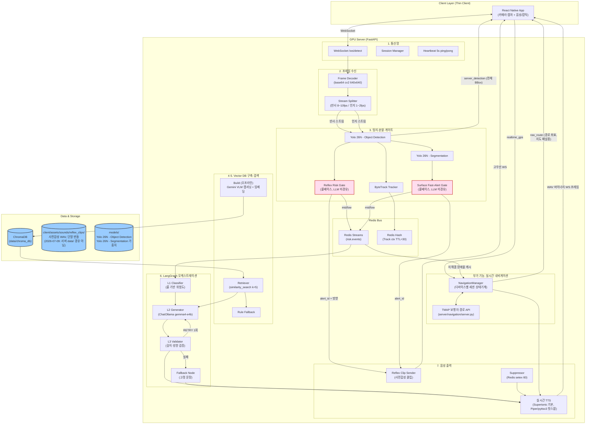
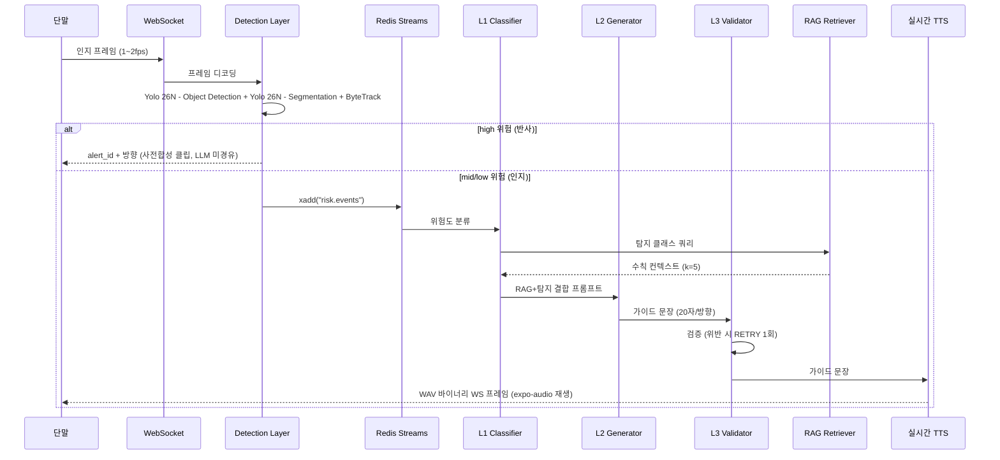

# Minchodan 시스템 아키텍처 설계서

> **작성일**: 2026-06-24
> **버전**: v0.4.13 (2026-07-19 RTX 5090 최대 사양과 Ubuntu·Windows·macOS별 PyTorch 2.13 가속 경로 반영)
> **설계 기준**: `docs/minchodan_design_note.md` (7단계 골격, 비전 설계서 v1.1)
> **코딩 패턴 기준**: [`docs/course_codebase_guide.md`](course_codebase_guide.md) (수업 전체 코드베이스 코딩 패턴·함수 시그니처 표준)

---

## 1. 프로젝트 개요

Minchodan은 시각장애인 보행 보조를 위한 스마트 가이드독 AI 플랫폼입니다. 스마트폰 카메라로 주변을 캡처해 GPU 서버로 전송하고, 서버에서 장애물·노면 상태를 실시간으로 탐지·분할한 뒤, 위험도에 따라 두 갈래 안전 대응 경로로 분기합니다. 가장 큰 특징은 **이중 경로 물리 분리 원칙**(비협상)입니다.

---

## 2. 기술 스택

### 서버 (GPU 추론)

- Python 3.13, FastAPI, uvicorn, asyncio
- Ultralytics Yolo 26N - Object Detection, Yolo 26N - Segmentation
- ByteTrack (객체 추적)
- Redis (Streams 이벤트 버스 + Track 컨텍스트 TTL=30)
- LangGraph (raw SimpleOllamaClient/SimpleOpenAIClient, LangChain 래퍼 미사용)
- Ollama (gemma4-e4b 가이드 생성, nomic-embed-text 임베딩, 호스트 로컬 실행)
- Gemini API (gemini-2.5-flash-lite, 4단계 오프라인 RAG 빌드 VLM 캡셔닝. 최초 계획 로컬 Llava에서 전환)
- ChromaDB (로컬 파일 기반 벡터 저장소)
- MariaDB (세션/디바이스/탐지-가이드 로그 영속화, `server/services/` 계층)
- **Supertonic**(기본, `TTS_ENGINE=supertonic`, ONNX 99M 파라미터) 로컬 TTS. **Piper**(`TTS_ENGINE=piper`)와 **pyttsx3**(`TTS_ENGINE=pyttsx3`)는 핫스왑 폴백으로 코드 보존 (선택 이력: piper → supertonic 최종 교체, 2026-07-09 발음 품질 한계 실측 확인)
- OpenCV (프레임 디코딩)

### 클라이언트 (단말)

- React Native (iOS/Android)
- react-native-vision-camera (Frame Processor 기반 연속 캡처, 기본; iOS/Android `FrameCaptureProvider` 인터페이스로 물리 분리)
- expo-audio (`createAudioPlayer`, 인지 음성 재생. Web Audio API 아님)
- expo-location (GPS 실시간 전송, `realtime_gps` WS 메시지)
- react-native-webview (하단 T맵 지도 패널 `NavMapPanel.tsx`, TMap JS API. 운영자/데모용, 2026-07-11 추가)
- Haptics + announceForAccessibility (접근성)

### 운영 콘솔

- React (운영자 모니터링용)
- SSE 또는 WebSocket 구독

### 인프라

- Docker (Redis + MariaDB + FastAPI 컨테이너. Ollama는 컨테이너가 아닌 호스트 로컬 실행 `OLLAMA_BASE_URL=http://host.docker.internal:11434`)
- 팀 GPU 서버 최대 사양 RTX 5090(Blackwell sm_120). Ubuntu x86_64/Windows amd64는 PyTorch 2.13 + CUDA 13.0(cu130), macOS는 PyTorch 2.13 MPS/CPU

---

## 3. 시스템 아키텍처 구성도

---

## 4. 디렉토리 구조 및 기능 매핑

| 디렉토리 / 파일                               | 기능적 역할                                                                | 단계 |
| :-------------------------------------------- | :------------------------------------------------------------------------- | :--- |
| `server/api/`                                 | WebSocket 엔드포인트, 세션 관리, 하트비트                                  | 1    |
| `server/api/ws_router.py`                     | `APIRouter` + `WebSocket /ws/detect`                                       | 1    |
| `server/api/session_manager.py`               | `device_token` 검증, `session_id` 발급, **2026-07-18 추가(T3-S)**: device_id별 STT 상호작용 활성 레지스트리(`_stt_activity`)로 인지 가이드 발행 억제 상태 공유 | 1    |
| `server/api/heartbeat.py`                     | 5초 ping/pong asyncio 루프                                                 | 1    |
| `server/capture/frame_decoder.py`             | base64 `np.frombuffer` `cv2.imdecode` resize(640,640)                      | 2    |
| `server/capture/stream_splitter.py`           | 반사 스트림(8~10fps) / 인지 스트림(1~2fps) 분기                            | 2    |
| `server/detection/yolo_detector.py`           | Yolo 26N - Object Detection `predict(conf=0.35)`, boxes 파싱               | 3    |
| `server/detection/yolo_segmentor.py`          | Yolo 26N - Segmentation 마스크 생성                                        | 3    |
| `server/detection/bytetrack_tracker.py`       | ByteTrack `update()` track_id 부여                                         | 3    |
| `server/detection/gates/reflex_gate.py`       | Reflex Risk Gate (고위험 + 근접 alert_id+방향)                             | 3    |
| `server/detection/gates/surface_gate.py`      | Surface Fast-Alert Gate (P0 노면 하단 검출 alert_id)                       | 3    |
| `server/detection/gates/head_level_gate.py`   | 두상 높이 장애물(간판/차양 등) 게이트 판정                                 | 3    |
| `server/detection/direction.py`               | bbox 기준 좌/우/직진 방향 판정 로직                                        | 3    |
| `server/detection/risk_rules.py`               | 클래스별 위험도(high/mid/low) 규칙 판정                                    | 3    |
| `server/detection/detection_pipeline.py`      | 탐지→게이트 전체 파이프라인 조립, `run()` 3-tuple 반환. **2026-07-18 추가(T1-a)**: 접근 객체(`direction==approaching`)의 hit_count 선필터를 4→2로 완화해 신규 접근 위험에 빠르게 반응 | 3    |
| `server/detection/schemas.py`                 | `DetectionResult`, `SurfaceResult`, `RiskEvent` 타입                       | 3    |
| `server/rag/build/frame_extractor.py`         | 영상 1fps 프레임 추출                                                      | 4    |
| `server/rag/build/dedup_phash.py`             | pHash 중복 제거                                                            | 4    |
| `server/rag/build/gemini_captioner.py`        | Gemini API(`gemini-2.5-flash-lite`) 한글 캡셔닝, `GOOGLE_API_KEY` 미설정 시 Mock 폴백 | 4    |
| `server/rag/build/db_builder.py`              | `Chroma.from_documents(persist_directory)`                                 | 4    |
| `server/rag/retriever.py`                     | `similarity_search_with_score(k=5)`                                        | 5    |
| `server/rag/fallback.py`                      | 유사도 미달 시 룰 기반 fallback 문자열                                     | 5    |
| `server/rag/vector_db_factory.py`             | Chroma Qdrant 핫스왑 추상화                                                | 4·5  |
| `server/orchestration/state.py`               | `OrchState` TypedDict (event, risk_level, rag_context)                     | 6    |
| `server/orchestration/graph.py`               | `StateGraph` 조립, 노드 등록, 엣지 정의                                    | 6    |
| `server/orchestration/nodes/l1_classifier.py` | L1 룰 기반 위험도 분류 (mid/low만 진입)                                    | 6    |
| `server/orchestration/nodes/l2_generator.py`  | L2 ChatOllama(gemma4-e4b) ainvoke (20자/방향)                              | 6    |
| `server/orchestration/nodes/l3_validator.py`  | L3 길이·방향 키워드 검증, RETRY(최대 1회)                                  | 6    |
| `server/orchestration/nodes/fallback_node.py` | 최종 실패 고정 문장                                                        | 6    |
| `server/orchestration/llm_client_factory.py`  | `BaseChatModel` Ollama(gemma4-e4b) gpt-4o-mini 핫스왑                      | 6    |
| `server/tts/realtime_tts.py`                  | 인지 경로 `TTSService.generate()` 호출, WAV 바이너리 WS 프레임 전송. (text, voice, speed) 키 FIFO 캐시(64건)로 고정 안내문 재합성 회피(2026-07-11, CPU 폴백 환경 합성 1.4~1.9초 실측 근거) | 7    |
| `server/tts/reflex_clip_sender.py`            | 반사 경로 alert_id 사전합성 클립 WS 고우선 전송                            | 7    |
| `server/tts/suppressor.py`                    | Redis `setex(suppress:…, 60)` 중복 억제                                    | 7    |
| `server/tts/tts_service.py`                   | `TTSService` 추상화(Supertonic/Piper/Pyttsx3), WAV 규격 통일               | 7    |
| `server/bus/redis_client.py`                  | aioredis 연결 풀                                                           | 3·6  |
| `server/bus/producer.py`                      | `xadd("risk.events", …)` 인지 경로 발행                                    | 3    |
| `server/bus/consumer.py`                      | `xread` 구독, orchestration 진입                                           | 6    |
| `server/detection/consumer.py`                | **2026-07-18**: 이중 큐(반사/인지) 소비, DetectionPipeline 실행, 반사 WS 고우선 전송, 인지 Redis 발행. T2-G(회랑/접근 필터 + **near 인지 TTS 차단·far 무발화**), T3-S(STT 활성 중 인지 발행 억제), T1-b(**medium만** 12시 회랑 접근 시 쿨다운 3초 단축). 거리 등급은 `_resolve_distance_class()`로 `effective_distance_zone` SSOT 우선 | 3·6·7 |
| `server/models/yolo26n/`                      | Yolo 26N - Object Detection 및 Yolo 26N - Segmentation 가중치 (git-ignore) | 3    |
| `data/raw/`                                   | AI Hub 보행자 데이터셋 원본                                                | 4    |
| `data/frames/`                                | 영상 1fps 추출 프레임                                                      | 4    |
| `data/deduped/`                               | pHash 중복 제거 후 프레임                                                  | 4    |
| `data/captions/`                              | Gemini VLM 캡셔닝 결과 JSON                                                | 4    |
| `data/chroma_db/`                             | ChromaDB persist 디렉토리                                                  | 4    |
| `client/assets/sounds/reflex_clips/`          | 사전합성 반사 음성 클립 5종(WAV, direction/유형 기준). **2026-07-09 정정**: 최초 설계는 `data/reflex_clips/`(서버측 MP3)였으나 실제로는 단말 번들 방식으로 구현됨(서버는 clip 경로 문자열만 전달) | 7    |
| `training/`                                   | 모델 학습 (오프라인)                                                       | 3    |
| `client/src/hooks/useWebSocket.ts`            | WS 연결·hello/welcome 핸드셰이크                                           | 1    |
| `client/src/hooks/useCamera.ts`               | `useCameraDevice('back')` + 이중 타이머·동적 FPS·Mock 분기(플랫폼 무관 오케스트레이션만 담당) | 2    |
| `client/src/services/frameCaptureProvider.ts` | **2026-07-10 정정**: 카메라 하드웨어 접근을 플랫폼별로 분리(iOS/Android 이원화 계약 §4). 공통 인터페이스(`FrameCaptureController`) + `takePhoto()` 공용 크롭 로직(`captureViaTakePhoto`)을 이 파일에 두고, 실제 캡처 방식은 `frameCaptureProviderSelect.ios.ts`/`.android.ts`(Metro 플랫폼 확장자 분기)가 구현 | 2    |
| `client/src/services/frameCaptureProviderSelect.ios.ts` | 반사 캡처 기본 경로(iOS). `useFrameProcessor` + `client/ios/ReflexFrameProcessorPlugin.swift`(CVPixelBuffer→크롭/리사이즈/JPEG→base64) | 2    |
| `client/src/services/frameCaptureProviderSelect.android.ts` | 반사 캡처 과도기 경로(Android). 네이티브 Frame Processor 플러그인이 아직 없어 `takePhoto()` 기반 단발 촬영으로 동작(`docs/mobile/ios_android_bifurcation_contract.md` §4.5 참조) | 2    |
| `client/src/services/audioEngine.ts`          | `expo-audio` 상시 웜 플레이어로 반사/인지 음성 재생 및 선점 정지. **2026-07-18 추가(T3-C)**: P3(반사)/P2(STT)/P1(인지) 3단계 우선순위 조정자로 STT 응답과 인지 안내 충돌 해결 | 7    |
| `client/src/services/audioSessionBridge.ts`   | iOS AVAudioSession voiceChat(AEC) 전환 TS 래퍼. STT 녹음 구간에서 스피커 출력의 마이크 유입(음향 블리드)을 상쇄(2026-07-11 신규, Android는 no-op) | -    |
| `client/ios/AudioSessionBridge.swift`         | AVAudioSession `.playAndRecord`+`.voiceChat` 전환 네이티브 브릿지(`.defaultToSpeaker` 유지, 이전 세션 저장/복구, 검증용 `getSessionInfo`) | -    |
| `client/src/services/depthProbe.ts`           | LiDAR 실거리 프로브 TS 래퍼(2026-07-11 프로토타입). iOS Pro 계열 전용, 그 외 null. bbox 거리 휴리스틱 검증 계측용 | -    |
| `client/ios/DepthProbeBridge.swift`           | `builtInLiDARDepthCamera`+`AVCaptureDepthDataOutput` 자체 세션으로 정규화 좌표의 실거리(m) 샘플링(3x3 미디언). vision-camera와 배타 전환(프로토타입 제약) | -    |
| `client/src/services/hapticEngine.ts`         | Haptics 패턴 실행 및 지속 진동 정리                                        | 7    |
| `client/src/hooks/useLocation.ts`             | `expo-location` `watchPositionAsync` GPS 실시간 전송(`realtime_gps`)       | -    |
| `client/src/components/NavMapPanel.tsx`       | 하단 T맵 지도 패널(WebView + TMap JS API). `nav_route` 좌표 폴리라인 + 현재 위치 마커(2초 스로틀), 토글 꺼짐 시 미마운트. 운영자/데모용(2026-07-11 신규) | -    |
| `server/navigation/manager.py`                | `NavigationManager`, 디바이스별 세션 상태기계(IDLE/대기/안내중)            | -    |
| `server/navigation/server.py`                 | TMAP POI 검색·보행자 경로 API 연동 (NavigationManager와 연동하는 내비게이션 전용 FastAPI) | -    |
| `server/navigation/navigation_filter.py`      | 경로 이탈·재탐색 필터링                                                    | -    |
| `server/stt/stt_service.py`                   | faster-whisper 기반 음성 전사 (`transcribe_file`)                          | -    |
| `server/stt/stt_to_llm_bridge.py`             | STT 전사 결과 → 네비게이션/LLM 브리지. 자기-에코 감지(`_check_self_echo`), 인텐트 분기, 자유 질의응답 | -    |
| `server/stt/stt_config.py`                    | STT 모델·VAD·hotwords 정책 (하드코딩 영역). 기본 모델 `faster-whisper-small`(2026-07-11 medium에서 전환, CPU 폴백 지연 실측 근거. 서버 기동 시 `main.py` lifespan에서 백그라운드 프리로드) | -    |
| `server/services/detection_guidance_log_service.py` | 탐지·가이드 로그 MariaDB 영속화. STT는 전사문 대신 `text_length` 비식별 메타만 저장 | -    |
| `console/src/`                                | 운영자 모니터링 (DetectionFeed, RiskEventLog, SessionStatus)               | -    |

---

## 5. 7단계 컴포넌트 상세

### 5.1 1단계 - 서버-앱 실시간 통신 (WebSocket)

- `FastAPI()` + `CORSMiddleware` `APIRouter().websocket("/ws/detect")`
- `ws.accept()` welcome 송신 hello 수신·디바이스 토큰 검증 5초 ping/pong 하트비트 루프
- `WebSocketDisconnect` 포착 소켓 close + 리소스 해제
- 완료 후 2단계에 WS 엔드포인트 공유

### 5.2 2단계 - 카메라 화면 전송 (이중 캡처)

- `react-native-vision-camera` 권한·후면 카메라 **이중 타이머**로 캡처
- 반사 캡처 8~10fps / 인지 캡처 1~2fps 분리 (v1.1 반영, 충돌 회피)
- **2026-07-09 정정**: iOS 기본 캡처 경로는 `useFrameProcessor`(연속 비디오 스트림, `AVCaptureVideoDataOutput`). 원래 `takePhoto({qualityPrioritization:'speed'})`(`AVCapturePhotoOutput`) 방식은 실기기 시스템 로그로 촬영마다 iOS 오디오 세션 인터럽션을 유발함이 확인돼(TTS 안내 음성 절단 근본 원인) 폐기
- **2026-07-10 정정**: 캡처 하드웨어 접근 계층을 `FrameCaptureProvider` 인터페이스로 물리 분리(`client/src/services/frameCaptureProvider.ts` + `frameCaptureProviderSelect.ios.ts`/`.android.ts`). 롤백은 더 이상 전역 플래그가 아니라 iOS 전용 파일 내부 수정만으로 가능(Android에 영향 없음). Android는 아직 네이티브 Frame Processor 플러그인이 없어 `takePhoto()` 과도기 경로로 동작(`docs/mobile/ios_android_bifurcation_contract.md` §4)
- raw JPEG bytes → WS 바이너리 프레임(`sendBinary()`, base64 미경유)
- 서버: `decode_frame_binary()` `cv2.imdecode` `resize(640,640)` ack
- 카메라 권한 거부(`NotAllowedError`); 소켓 유실 시 타이머/frameProcessor 자원 즉시 해제

### 5.3 3단계 - AI 장애물 실시간 인식 (듀얼헤드 + 이중 게이트) v1.1 핵심

1. `cv2.imdecode`로 프레임 복원
2. **Yolo 26N - Object Detection** `predict(conf=0.35)` 클래스·bbox 파싱
3. **Yolo 26N - Segmentation** 노면 의미 분할 마스크
4. **ByteTrack** `update()` Track ID 부여, Redis `hset`+TTL=30 접근/이탈·속도 산출. **2026-07-18 추가(T1-a)**: 접근 객체(`direction=="approaching"`)는 hit_count 선필터를 4→2로 완화해 신규 접근 위험에 빠르게 반응. 정적 오탐은 여전히 4프레임 유지
5. **Reflex Risk Gate(룰베이스, LLM 미경유)**: 고위험 클래스 && 근접(면적·하단) 즉시 `alert_id`+방향
6. **Surface Fast-Alert Gate(룰베이스)**: P0 노면(횡단볼도/맨홀/계단/그레이팅/점자블록파손) 하단 검출 즉시 `alert_id`
7. mid/low만 `redis_bus.xadd("risk.events", …)`로 인지 경로에 발행
8. **방어적 코딩**: Detector/Segmentor 중 하나가 예외를 던져도 나머지 결과는 유지하고 파이프라인은 멈추지 않음. Redis 연결 실패 시에도 탐지 결과는 정상 반환

노면 클래스 분리(C2): `braille normal/damaged`, `sidewalk normal/damaged`, `crosswalk`, `roadway`, `caution`(stairs/manhole/grating)을 **독립 클래스**로 분리합니다.

### 5.4 4단계 - 위험 대처 수칙 DB 구축 (RAG 시드, 오프라인 배치)

- 영상/사진 100+ 수집 1fps 프레임 추출 pHash 중복 제거
- **Gemini API**(`gemini-2.5-flash-lite`) 한글 캡셔닝(최초 계획 로컬 Llava에서 전환) 로컬 임베딩(nomic-embed-text, 768d)
- `Document` + 메타etadata(`scene_type`, `risk_level`, `objects`, `guidance_template`) `Chroma.from_documents(persist_directory)`
- 메타데이터 `objects`·`scene_type`을 3단계 분리 클래스(예: `braille_damaged`)와 일치시켜 검색 정합 확보

### 5.5 5단계 - 실시간 대처 수칙 검색 (RAG)

- `Chroma(persist_directory, embedding_function)` 읽기 전용 로드
- 탐지 클래스로 쿼리 생성(`f"{label} 보행 중 회피 방법"`) `similarity_search_with_score(query, k=5)`
- `page_content` 결합 LangGraph `state["rag_context"]` 저장
- 미적중 시 룰 기반 fallback
- `VectorDBFactory`로 Chroma Qdrant 추상화

### 5.6 6단계 - 종합 회피 가이드 생성 (LangGraph 계층 LLM)

- `StateGraph(OrchState)` 조립
- **L1**: 룰 기반 위험도 분류 (high는 이미 즉시 경보 처리됨 / mid·low만 진입)
- **T2-G (2026-07-18)**: 인지 발화 회랑/접근 필터. 보도 이탈·고위험·접근 객체·유의미 노면은 통과, 측면·원거리·정적 저위험은 무발화
- **L2**: RAG+탐지 결합 프롬프트로 ChatOllama(gemma4-e4b) `ainvoke` — "한국어 1문장, 20자 내, 방향(좌/우/직진/정지) 포함"
- **L3**: 길이·방향 키워드 검증, 위반 시 L2 RETRY(최대 1회)
- **Fallback/핫스왑**: L3 실패율 >10% 또는 `LLM_PROVIDER=openai` 시 gpt-4o-mini 자동 전환; 최종 실패 시 고정 문장("전방 주의, 천천히 멈추세요")
- `LLMClientFactory(BaseChatModel)`로 로컬상용 핫스왑

### 5.7 7단계 - 음성 안내 출력 (이중 채널)

> **2026-07-09 정정**: 아래는 실제 구현 기준이다(최초 계획 Kokoro/Coqui·MP3·Web Audio는 미구현).

- **(인지)** 로컬 TTS(**Supertonic**, `TTS_ENGINE=supertonic` 기본. **Piper**는 `TTS_ENGINE=piper` 핫스왑 폴백으로 코드 보존) `generate(guidance_text, voice="ko")` → WAV bytes → WS 바이너리 프레임(`transport:"binary"`, base64 미경유) → 단말 `expo-audio` 상시 재생 웜 플레이어(`player.replace()`, iOS Hearing Protection 우회)
- **T3-C (2026-07-18)**: 단말 `audioEngine`에서 P3(반사)/P2(STT)/P1(인지) 우선순위 조정. STT 상호작용 중 인지 안내 드롭, STT 응답은 인지 안내를 선점. 결정론적 콜백 해제 + 안전 상한 타이머
- **T3-S (2026-07-18)**: 서버 `session_manager`의 `_stt_activity` 레지스트리로 STT 처리 중인 device_id를 추적. `DetectionConsumer`는 해당 device_id의 인지 가이드 발행을 조기 반환(반사는 제외)
- **(반사)** 단말에 사전 번들된 고정 클립을 `alert_id`로 즉시 재생 (실시간 TTS 합성 금지)
- **선점(preempt)**: 반사 음성은 인지 음성을 중단시키고 재생. WS에서 반사 이벤트는 별도 고우선 타입
- 중복 억제 `setex(suppress:…, 60)`
- 햅틱·접근성(`announceForAccessibility`) 연동
- `TTSService` 추상화(`SupertonicTTSService`/`PiperTTSService`), 출력은 WAV로 규격 통일

---

## 6. 핵심 데이터 인터페이스

### 6.1 이벤트 추적

- 모든 단계 이벤트는 `event_id`로 추적
- Redis Streams 채널: `risk.events`(인지), 반사는 WS 고우선 타입으로 우회
- 프레임 원본을 Redis에 직접 싣지 말 것(`frame.hex()` 비효율) — 참조 키/공유 메모리 사용 권장

### 6.2 1단계 인터페이스

| 방향 | 페이로드                                    |
| ---- | ------------------------------------------- |
| In   | `{type:"hello", device_id, token}`          |
| Out  | `{type:"welcome", session_id, server_time}` |

### 6.3 2단계 인터페이스

| 방향 | 페이로드                                                                              |
| ---- | ------------------------------------------------------------------------------------- |
| In   | 비디오 프레임                                                                         |
| Out (바이너리, 기본) | JSON 메타 `{type:"detection", payload:{event_id, device_id, ts, frame_id, stream, transport:"binary"}}` + 뒤이은 raw JPEG 바이너리 WS 프레임 |
| Out (base64, 구버전 호환) | `{type:"detection", payload:{event_id, device_id, ts, frame_id, thumbnail_jpeg_b64}}` |

> 2026-07-07부터 실기기 기본 전송 방식은 base64 미경유 바이너리 프레임이다(페이로드 33% 절감). 상세는 [`api_specification.md`](api_specification.md) §3.1/§3.2 참조.

### 6.4 3단계 인터페이스

| 방향 | 페이로드                                                                                                                             |
| ---- | ------------------------------------------------------------------------------------------------------------------------------------ |
| In   | 이미지 bytes                                                                                                                         |
| Out  | `{event_id, detections:[{class_name, confidence, bbox, track_id}], surface:[{class_name, mask\|centroid}], risk_hint, inference_ms}` |

### 6.5 6단계 인터페이스

| 방향 | 페이로드                                    |
| ---- | ------------------------------------------- |
| In   | `OrchState{event, risk_level, rag_context}` |
| Out  | 가이드 문장(String)                         |

### 6.6 7단계 인터페이스

| 방향 | 페이로드                               |
| ---- | -------------------------------------- |
| In   | 가이드 문장(String) / `alert_id`(반사) |
| Out  | 오디오 bytes(ArrayBuffer)              |

### 6.7 부가 기능 인터페이스 (GPS 내비게이션 / 실시간 BBox)

| 방향 | 페이로드                                                                              |
| ---- | -------------------------------------------------------------------------------------- |
| In   | `{type:"realtime_gps", lat, lon, heading}`                                            |
| Out  | `{type:"server_detection", event_id, detections:[{model, className, confidence, bbox}], ts}` |
| Out  | `{type:"nav_route", waypoints:[{lat, lon}], app_key, ts}` (경로 수립/해제/재접속 복원 시, 지도 패널용. 2026-07-11 신설) |
| In   | `{type:"distance_probe_sample", payload:{event_id, samples:[{class_name, confidence, bbox, lidar_meters, ...}]}}` (LiDAR 실거리 검증 전용, 반사/인지 경로 미관여. 2026-07-17 신설) |

상세 스키마는 [`api_specification.md`](api_specification.md) §6.4~§6.6, §6.8을 참조합니다.

> **2026-07-11 길안내 발화 경로 분리**: 턴바이턴 멘트 조회가 `DetectionConsumer` 내부에만
> 있어 카메라 탐지가 없으면 NAVIGATING 상태여도 무음이던 결함을 수정했다. `realtime_gps`
> 수신 시점에 `ws_router`가 `nav_manager.get_combined_guidance()`를 직접 평가하고
> `_send_nav_guidance()`로 guide 메시지를 전송한다. 중복 발화는 nav_filter의
> announced_cache/silence_interval이 탐지 경로와 공용으로 차단한다.

---

## 7. 이중 경로 동작 모드

| 경로     | 위험도  | 흐름                                                            | 음성                      | 목표 지연               |
| -------- | ------- | --------------------------------------------------------------- | ------------------------- | ----------------------- |
| **반사** | high    | Detection Reflex Gate / Seg Surface Gate 사전합성 클립          | 사전합성 고정 클립 (선점) | <300ms (Detection 기준) |
| **인지** | mid/low | Detection+Seg → Redis Streams → LangGraph L1/T2-G/L2/L3 + RAG 실시간 TTS. STT 활성 중 발행 억제(T3-S) | 실시간 합성 상세 가이드   | 1~2Hz                   |

반사 경로는 **LLM/RAG/실시간 TTS를 절대 경유하지 않습니다** (비협상 원칙).

---

## 8. 챗봇-LangGraph 자동화 흐름

---

## 9. 추상화 지점 (핫스왑)

| 추상화     | 기본                               | 대안                 | 위치                                         |
| ---------- | ---------------------------------- | -------------------- | -------------------------------------------- |
| Vector DB  | ChromaDB                           | Qdrant               | `server/rag/vector_db_factory.py`            |
| LLM Client | ChatOllama(gemma4-e4b)             | gpt-4o-mini          | `server/orchestration/llm_client_factory.py` |
| Embeddings | OllamaEmbeddings(nomic-embed-text) | gemini-embedding-001 | `server/rag/build/` (Embeddings 추상 클래스) |
| TTS        | supertonic(기본)                   | piper / pyttsx3(핫스왑 폴백) | `server/tts/tts_service.py`                  |

---

## 10. 환경 변수

> **단일 명세**: 환경 변수의 전체 목록·타입·필수 여부·기본값·참조는 [`docs/environment_variables.md`](environment_variables.md)를 기준으로 합니다. 본 절은 핵심 변수 요약만 제공합니다.

| 변수                | 설명                                      | 기본값                   |
| ------------------- | ----------------------------------------- | ------------------------ |
| `LLM_PROVIDER`      | LLM 공급자 (`ollama` 또는 `openai`)       | `ollama`                 |
| `OLLAMA_BASE_URL`   | Ollama 서버 주소                          | `http://localhost:11434` |
| `GEMMA_MODEL`       | L2 가이드 생성 모델                       | `gemma4-e4b`             |
| `GOOGLE_API_KEY`    | 4단계 Gemini VLM 캡셔닝(`gemini-2.5-flash-lite`, 오프라인 빌드 전용) 필수 | (미설정) |
| `EMBEDDING_MODEL`   | 임베딩 모델                               | `nomic-embed-text`       |
| `REDIS_URL`         | Redis 연결 URL                            | `redis://localhost:6379` |
| `CHROMA_PATH`       | ChromaDB persist 디렉토리                 | `data/chroma_db`         |
| `CHROMA_COLLECTION` | ChromaDB 콜렉션명                         | `safety_guidelines`      |
| `WS_HOST`           | WebSocket 서버 바인드 호스트              | `0.0.0.0`                |
| `WS_PORT`           | WebSocket 서버 포트                       | `8000`                   |
| `DETECTOR_TYPE`     | 탐지기 유형 (`mock` 또는 `yolo`)          | `mock`                   |
| `TTS_ENGINE`        | TTS 엔진 (`supertonic` 기본, `piper`/`pyttsx3` 핫스왑) | `supertonic` |
| `HEARTBEAT_INTERVAL`| WS ping 주기(초)                          | `5`                      |
| `HEARTBEAT_TIMEOUT` | WS 하트비트 유예 타임아웃(초)             | `15`                     |
| `TMAP_APP_KEY`      | TMAP 보행자 경로 안내 API 키. `nav_route` 메시지 `app_key`로 단말 지도 패널에도 전달(2026-07-11) | (미설정)                 |
| `DB_HOST`           | MariaDB 접속 호스트                       | (필수, IP 지정)          |
| `YOLO_CONF`         | Yolo 26N - Segmentation 신뢰도 임계값     | `0.35`                   |
| `YOLO_DET_CONF`     | Yolo 26N - Object Detection 신뢰도 임계값 | `0.50`                   |
| `FRAME_SIZE`        | 프레임 리사이즈 크기                      | `640`                    |
| `REFLEX_FPS`        | 반사 캡처 목표 fps                        | `10`                     |
| `COGNITIVE_FPS`     | 인지 캡처 목표 fps                        | `2`                      |
| `OPENAI_API_KEY`    | OpenAI 전환 시 필요                       | (미설정)                 |
| `SLACK_WEBHOOK_URL` | Slack Incoming Webhook URL (경보 발행)    | (미설정)                 |

> **불일치 해소 이력**: 2026-06-27 환경 변수 3원화(`.env.example`·본 절·루트 `README.md`)를 단일 명세서로 통합. 상세 내용은 [`docs/environment_variables.md`](environment_variables.md) 4절을 참조.

---

## 11. 학습 환경 전제 (v1.1 C3)

3·4단계 모델 학습의 팀 GPU 서버 최대 사양은 **RTX 5090(Blackwell sm_120)**입니다. Ubuntu x86_64와 Windows amd64는 공식 **PyTorch 2.13 + CUDA 13.0(cu130)** 휠과 NVIDIA R580 이상 드라이버를 사용합니다. 이전 세대 NVIDIA GPU는 개발용으로 허용하되 Blackwell 최적화가 적용되지 않을 수 있습니다. macOS는 동일 PyTorch 2.13의 MPS/CPU 경로로 개발·기능 검증하며 CUDA 학습 서버로 간주하지 않습니다. 배포 전 `scripts/verify_gpu.py`로 실제 가속 연산을 검증하고, TensorRT 엔진은 배포 GPU에서 재빌드합니다(세대 간 전송 불가).

---

## 12. 검증 기준선 (계획)

코드 검증:

- `python -m pytest tests/test_ws_echo.py -v` - 1단계: RTT < 100ms echo 검증
- `python -m pytest tests/test_frame_decode.py -v` - 2단계: 캡처수신 < 50ms 검증
- `python -m pytest tests/test_detection.py -v` - 3단계: 게이트 분기, track_id, 예외 영속성 검증
- `python -m pytest tests/test_rag_retrieval.py -v` - 5단계: kickboard 쿼리 < 50ms 검증
- `python -m pytest tests/test_langgraph.py -v` - 6단계: bollard 주입 20자/방향 포함 검증
- `python -m pytest tests/test_tts_reflex.py -v` - 7단계: 반사 클립 선점 재생 검증
- `python scripts/eval_hitrate.py` - 4단계: Top-5 hit-rate ≥ 0.6 평가
- `python scripts/verify_gpu.py` - Ubuntu/Windows CUDA 13.0 또는 macOS MPS/CPU 실제 연산 검증

상세 검증 기준은 [`docs/test_specification.md`](test_specification.md)를 참조합니다.

---

## 13. MCP (Model Context Protocol) 연동 및 저지연 가드레일

본 프로젝트의 관측 가능성(Observability) 확보와 자원 관리를 위해 MCP를 연동하되, 핵심 지표인 **로우 레이턴시(반사 경로 < 300ms)**를 훼손하지 않도록 비동기 설계를 강제합니다.

### 13.1 단계별 MCP 연동 매트릭스

| 대상 단계 | MCP 구분 | RAG와의 차별점 및 구체적 역할 |
| :--- | :--- | :--- |
| **6단계 (오케스트레이션)** | **LangSmith Trace MCP** | `StateGraph` 내의 노드 전이 및 실행 지연(Latency)을 시각적으로 추적하고 가드레일 위반 시의 재시도 루프를 감시합니다. |
| **6단계 (오케스트레이션)** | **System / GPU Monitor MCP** | GPU 자원 사용량과 CUDA 메모리 한계를 모니터링하여 로컬 Ollama 모델 부하 임계치 도달 시 OpenAI GPT-4o-mini로의 핫스왑을 제어합니다. |
| **7단계 (음성 출력)** | **Audio Validator MCP** | 실시간 생성된 음성 안내(WAV 바이너리 WS 프레임)의 샘플 레이트 규격 준수 여부, 오디오 TTFB 및 무음 구간(Silence)을 검증합니다. |
| **7단계 (음성 출력)** | **Redis Cache Monitor MCP** | 중복 경보 방지를 위한 `suppress:alert_id` 캐시 키와 TTL(60초)의 정밀 상태를 상시 모니터링하고 관리합니다. |
| **7단계 (음성 출력)** | **Accessibility Simulator MCP** | `announceForAccessibility` 텍스트와 실제 재생되는 오디오 파일 간의 의미 정합성을 시각장애인 접근성 관점에서 비교 검증합니다. |
| **공통 (경보)** | **Slack Notification MCP** | L3 가드레일 최종 실패(Fallback 작동) 및 추론 서버 크리티컬 예외 발생 시 실시간으로 개발팀 채널에 즉시 에러 로그를 전송합니다. |

### 13.2 저지연(Low-Latency) 보장을 위한 4대 가드레일

모니터링 데이터 수집으로 인해 메인 추론/전송 스레드에 블로킹(Blocking)이 발생하는 것을 방지하기 위해 다음 원칙을 반드시 준수합니다.

1. **아웃오브밴드 비동기 처리 (Out-of-Band)**: 메인 API 통신 및 오디오 전송 루프 내에 MCP 연동 코드를 인라인(Inline)으로 배치하는 것을 전면 금지하며, `asyncio.create_task` 등 비동기 백그라운드 태스크나 멀티프로세싱을 사용하여 통신 오버헤드 지연을 **0ms**로 유지합니다.
2. **Redis Streams 완충 (실구현 완료)**: 메인 파이프라인은 로컬 Redis 버퍼에 초고속(<1ms)으로 메트릭 데이터만 밀어 넣고, MCP 수집기가 별도의 프로세스에서 이 이벤트를 컨슈밍하여 비동기 처리하도록 구성해 결합도를 완전히 제거합니다. (싱글톤 `MCPManager` 내부의 `publish_metric` 채널을 통해 구현 완료)
3. **운영 환경 조건부 비활성화 (No-op)**: 개발 및 QA(CI/CD) 테스트 단계에서만 상세 모니터링 MCP를 기동하고, 프로덕션(Production) 빌드 단계에서는 해당 모니터링 함수를 `No-op` (더미 함수) 처리하여 가동 자원 오버헤드를 제로화합니다.
4. **다중 프로세스(Uvicorn Multi-workers) 비공유 극복**: 백엔드가 Uvicorn 다중 프로세스(`workers > 1`)로 기동될 시 메모리 상의 리스너 큐가 프로세스 간에 공유되지 않습니다. 따라서 모든 메트릭 모듈은 싱글톤 객체 내부 메모리를 직접 참조하지 않고 Redis Stream을 매개로 `publish_metric` 채널을 이용해 발행함으로써 데이터의 정합성과 무손실 전파를 보장합니다.

### 13.3 프론트엔드 관제 연동 및 SSE 전송 규격

통합 MCP 모듈이 Redis Streams에서 수집한 메트릭 데이터는 운영자 콘솔(React)에서 실시간으로 모니터링할 수 있도록 FastAPI의 SSE(Server-Sent Events) 채널을 통해 전달됩니다.

1. **관제 연동 아키텍처**
   - **이벤트 발행자(Publisher)**: 메인 추론 모듈이 `mcp:metrics` Redis Stream으로 메트릭을 초고속 발행합니다.
   - **수집/가공기(MCP Manager)**: 백그라운드에서 실행되는 `MCPManager`가 스트림 데이터를 컨슈밍하고 정규화합니다.
   - **브로드캐스터(FastAPI Router)**: `/api/v1/monitor/stream` 엔드포인트를 통해 연결된 클라이언트들에게 SSE 형식으로 정규화된 JSON 데이터를 전송합니다.

2. **SSE 이벤트 전송 데이터 포맷**
   - 프론트엔드에서 수신하는 실시간 JSON 규격은 다음과 같습니다:

| 필드명 | 타입 | 설명 |
| :--- | :--- | :--- |
| **event_type** | `string` | 모니터링 이벤트 종류 (`gpu_status`, `audio_validation`, `cache_suppression`, `system_error`) |
| **timestamp** | `string` | ISO 8601 형식의 이벤트 발생 일시 |
| **payload** | `dict` | 각 이벤트 타입에 대응하는 상세 메트릭 오브젝트 |

3. **이벤트 페이로드 예시**
   - **gpu_status**: `{"gpu_usage_pct": 45.2, "memory_used_mb": 2048, "current_provider": "ollama"}`
   - **audio_validation**: `{"alert_id": "ref_alert_001", "ttfb_ms": 120, "is_valid": true}`
   - **cache_suppression**: `{"suppressed_keys": ["suppress:ref_alert_001"], "ttl_seconds": 45}`
   - **system_error**: `{"error_message": "Ollama connection timeout, hot-swapping to OpenAI", "severity": "warning"}`

### 13.3.1 사후 이력 조회와 이벤트 프레임·STT 음성 보존 (2026-07-16 갱신)

실시간 SSE와 별개로, 콘솔의 Detection Guidance Log 테이블은 REST 폴링으로 `detection_guidance_logs`를 조회합니다. 오탐 여부 판별과 안내 발화 당시 상황 확인을 위해 로그 적재 이벤트의 발생 시점 프레임을 함께 보존합니다. STT 경로는 사용자의 원본 음성 파일 경로와 전사 문장을 같은 로그 행에 보존합니다.

| 항목 | 내용 |
| :--- | :--- |
| **저장 주체** | `DetectionConsumer` 백그라운드 로그 태스크 및 `/ws/detect` STT 처리부 (`server/services/event_frame_store.py`, `server/services/remote_storage_client.py`) |
| **저장 대상** | 반사 알림/인지 가이드가 실제 전송 성사된 이벤트의 원본 프레임(JPEG)과 STT 경로에서 사용자가 말한 원본 음성 파일 |
| **DB 연결** | 이미지: `detection_guidance_logs.frame_path`; 사용자 음성: `stt_audio_path`, `stt_transcript_text`, `stt_audio_storage_status` 등 메타데이터. 파일 BLOB은 DB에 저장하지 않음 |
| **실시간 경로 영향** | 없음 - 인코딩/디스크 IO/원격 업로드는 로그 태스크 내부에서 수행 (반사 <300ms 비협상 원칙 유지) |
| **콘솔 표시** | `GET /api/v1/admin/detection-logs` 목록 + `GET /api/v1/admin/event-frames/{event_id}` 이미지. 로컬 파일이 없으면 중앙 저장 API에서 프록시 조회. bbox는 `detected_objects_json` 좌표로 콘솔이 오버레이 렌더링 |
| **보존 정책** | 기본 7일(`EVENT_FRAME_RETENTION_DAYS`), 서버 기동 시 만료 폴더 삭제 (개인정보 기간 한정 보존) |

상세 계약은 [`api_specification.md`](api_specification.md) §8.5를 참조하십시오.

### 13.3.2 실제 구현된 실시간 채널: SSE vs 콘솔 전용 WS (2026-07-13 정리)

§13.3의 이벤트 타입(`gpu_status`/`audio_validation`/`cache_suppression`/`accessibility_validation`/`langsmith_trace`)은 최초 설계 당시의 예시이며, 실제 구현 및 연동을 완료하여 **두 개의 물리적으로 분리된 실시간 채널**로 정착했다. 콘솔이 어떤 패널을 어떤 채널로 받는지 헷갈리지 않도록 정리한다.

**채널 A - SSE `/api/v1/monitor/stream`** (`server/mcp/manager.py` MCPManager, `server/api/monitor.py`)

관제 상태성 지표 및 MCP 검증 메트릭을 실시간으로 브로드캐스트한다. in-process `MCPManager.broadcast_event()`로 직접 발행되는 `event_type`은 9가지다.

| event_type | 발행 위치 | 콘솔 소비 패널 |
| :--- | :--- | :--- |
| `system_metrics` | `LLMClientFactory.start_gpu_monitor()` 백그라운드 루프(2초 주기) | `SystemMetrics` |
| `session_status` | `server/api/ws_router.py` `_broadcast_session_status()` - 단말 연결/heartbeat_ack(RTT 갱신)/해제 3개 지점 | `SessionStatus` |
| `llm_status` | `NavigationManager._broadcast_nav_change()`(내비게이션 상태) + `DetectionConsumer._broadcast_ai_pipeline_status()` | `AiPipelineMonitor` |
| `detection_event` | `DetectionConsumer._broadcast_detection_event()` - 탐지/노면 분류가 있는 프레임마다 | `DetectionFeed` |
| `risk_event` | `DetectionConsumer._broadcast_risk_event()` - 반사/인지 경보가 **실제 전송 성사**된 직후 | `RiskEventLog` |
| `audio_validation` | `server/tts/realtime_tts.py` 및 `server/mcp/audio_validator.py` - TTS 음성 규격 및 TTFB 지연 시간 검증 시 | `McpValidationMonitor` (오디오 검증) |
| `cache_suppression` | `server/mcp/cache_monitor.py` - Redis 억제 캐시 키 및 남은 TTL 상시 감시 시 | `McpValidationMonitor` (캐시 모니터) |
| `accessibility_validation` | `server/tts/realtime_tts.py` 및 `server/mcp/accessibility_simulator.py` - 발화 방향성/의미 대조 검증 시 | `McpValidationMonitor` (접근성 검증) |
| `langsmith_trace` | `server/orchestration/graph.py` 및 `server/mcp/langsmith_tracer.py` - LangGraph 노드 지연 및 전이 상태 검증 시 | `McpValidationMonitor` (LangSmith 추적) |

`rag_score` 등 콘솔 타입에는 정의돼 있지만 서버가 채우지 않는 필드가 일부 남아 있다. `risk_event`는 Redis `risk.events` 스트림이 아니라 위 표와 같이 `DetectionConsumer`가 SSE in-process 브로드캐스트한다(2026-07-16 wiring).

**채널 B - WS `/ws/console/live-feed`** (`server/api/session_manager.py` `console_connections`, `console/src/api/useLiveFeed.ts`)

카메라 프레임처럼 고빈도·저지연이 필요한 데이터를 별도 WebSocket으로 분리했다(SSE는 서버→클라이언트 단방향 폴링성 채널이라 바이너리 프레임에 부적합).

| 메시지 타입 | 발행 위치 | 콘솔 소비 |
| :--- | :--- | :--- |
| 바이너리 프레임(JPEG) | `ws_router.py`가 단말 프레임 수신 시 그대로 중계 | `LiveCameraFeed`, `DeviceTelemetryPanel` 배경 이미지 |
| `server_detection` | `DetectionConsumer._send_server_detection()` - 프레임마다 bbox 좌표 | 위 두 패널의 bbox 오버레이 |
| `latency_event` | `DetectionConsumer._broadcast_latency_event()` / STT 경로 인라인 | `LatencySummaryPanel`(REST 폴링 폴백보다 우선 사용) |
| `guidance_log_event` | `DetectionConsumer._broadcast_guidance_log_event()` - DB 저장(+프레임 파일 저장) 완료 후에만 | `DetectionGuidanceLogTable`(1페이지에서만 병합) |

> **타임존 버그(2026-07-12 수정)**: `now_iso()`(`server/api/schemas.py`)와 SSE `timestamp` 생성(`server/mcp/manager.py`)이 `datetime.now()`(naive, 컨테이너 시스템 시각=UTC)를 그대로 직렬화해 오프셋이 빠져 있었다. 브라우저 `new Date(...)`가 이를 로컬(KST)로 오인식해 9시간이 밀리는 문제였다 - `datetime.now(UTC)`로 수정. DB에서 재조회되는 `detected_at`/`created_at`도 MariaDB `DATETIME`이 타임존을 저장하지 않아 같은 문제가 있었고, `server/db/schemas.py`의 `field_validator`로 naive 값을 UTC로 간주하도록 보정했다.

### 13.4 MCP별 자격 증명 및 API 키 요구사항

각 MCP 및 연동 기술 스택의 외부 API 의존성과 키 발급 필요 여부는 아래와 같이 정의됩니다.

1. **외부 자격 증명(API Key) 요구 사항**
   - 상용 SaaS 서비스 또는 클라우드 모니터링 연동을 활성화하기 위해 다음의 키를 `.env` 설정에 필수로 기입해야 합니다.

| 연동 모듈 | 필수 환경변수 필드 | 발급처 및 용도 |
| :--- | :--- | :--- |
| **OpenAI 핫스왑 폴백** | `OPENAI_API_KEY` | **OpenAI API Platform** GPU 자원 초과 시 로컬 Ollama에서 GPT-4o-mini 백업 모델로 실시간 핫스왑하기 위해 사용됩니다. |
| **Slack Notification MCP** | `SLACK_WEBHOOK_URL` | **Slack App Console (Incoming Webhooks)** L3 가드레일 최종 실패 및 서버 크리티컬 예외 상황 발생 시 개발팀 전용 채널로 실시간 경보 메시지를 발행하기 위해 사용됩니다. |
| **LangSmith Trace MCP** | `LANGCHAIN_API_KEY` `LANGCHAIN_TRACING_V2` | **LangSmith Platform** StateGraph의 비정상 루프 및 병목 구간 모니터링을 활성화하기 위해 선택적으로 기입합니다. |

2. **자격 증명이 불필요한 로컬/내부 모듈**
   - 로컬 머신의 자원을 직접 쿼리하거나 오프라인 분석을 활용하므로 별도의 외부 자격 증명이 불필요합니다.

| 모듈명 | 분석 대상 및 작동 방식 | 비고 |
| :--- | :--- | :--- |
| **Redis Streams** | 로컬 메모리 기반 버퍼 통신 | 로컬 Docker 네트워크의 Redis 환경을 직접 사용하여 키가 불필요합니다. |
| **System / GPU Monitor MCP** | PyTorch CUDA API 및 OS 자원 조회 | 하드웨어 드라이버 수준의 자원을 직접 점검하므로 인증이 필요 없습니다. |
| **Audio Validator MCP** | 생성된 base64 오디오 바이너리 헤더 직접 분석 | 로컬에서 무음 구간 및 샘플 레이트 규칙을 파싱하는 순수 연산이므로 키가 필요 없습니다. |
| **Accessibility Simulator MCP** | 스키마 정합성 직접 대조 연산 | 시각장애인 텍스트와 실제 합성된 음성 가이드 간의 일치 여부를 대조하는 순수 연산 모듈입니다. |

### 13.5 내부 MCP 구현 현황 및 단계적 착수 로드맵

`server/mcp/` 패키지의 현재 구현 상태와 향후 착수 시점을 명시합니다. 설계 6종 중 구현 시점이 도래한 모듈만 단계적으로 착수되었으며, 7단계 의존 모듈은 7단계 착수 시 동시 구현을 원칙으로 합니다.

1. **구현 현황 매트릭스 (2026-06-27 기준)**

| MCP 모듈 | 대상 단계 | 구현 위치 | 상태 | 비고 |
| :--- | :--- | :--- | :--- | :--- |
| **System / GPU Monitor MCP** | 6단계 | `server/mcp/gpu_monitor.py` | **구현 완료** | 6단계 핫스왑 제어 신호로 즉시 필요 |
| **MCPManager (공통 기반)** | 공통 | `server/mcp/manager.py` | **구현 완료** | 6종 MCP 공통 Redis Streams 컨슈머 + SSE 브로드캐스트 백본 |
| **Slack Notification MCP** | 공통 | `scripts/slack_publisher.py` (standalone) | **부분 구현** | 일반 발행 스크립트로 도입, `server/mcp/` 통합 미완 |
| **LangSmith Trace MCP** | 6단계 | - | 미구현 | `LANGCHAIN_API_KEY` 필수, 설계상 "선택적" 명시 |
| **Audio Validator MCP** | 7단계 | - | 미구현 | **2026-07-10 갱신**: 7단계 TTS(Supertonic 기본) 자체는 구현 완료됐으나, `server/mcp/`에 검증 전용 모듈은 미착수 |
| **Redis Cache Monitor MCP** | 7단계 | - | 미구현 | `suppress:alert_id` 캐시는 `server/tts/suppressor.py`로 실사용 중이나, 별도 MCP 모니터 모듈은 미착수 |
| **Accessibility Simulator MCP** | 7단계 | - | 미구현 | `announceForAccessibility` 연동은 클라이언트에 존재하나, 별도 MCP 대조 모듈은 미착수 |

2. **단계적 착수 원칙**
   - **6단계 완료 시점**: 6단계 전용 MCP(GPU Monitor) + 공통 인프라(MCPManager) 우선 구현 완료.
   - **7단계 착수 시점**: Audio Validator, Redis Cache Monitor, Accessibility Simulator 3종 동시 구현 권장. 검증 입력 데이터가 7단계 TTS 출력에 의존.
   - **즉시 구현 가능**: Slack Notification MCP는 단계 의존성 없으므로 `scripts/slack_publisher.py`를 `server/mcp/slack_notifier.py`로 통합하여 즉시 구현 가능.

3. **검증 상태**
   - 구현 완료 2종 + 공통 기반 1종에 대해 `tests/test_mcp_gpu.py`(2 케이스) 및 `tests/test_mcp_integration.py`(1 케이스) pytest 통과 완료 (2026-06-27, **3 passed in 21.60s**).
   - 상세 검증 항목은 [`docs/test_specification.md`](test_specification.md) 5.8절을 참조.

---

## 14. Post-MVP: 하이브리드 온디바이스 로드맵

MVP(서버 중심 7단계 파이프라인) 완성 후 도입할 **하이브리드 온디바이스-서버 아키텍처**의 구체적 청사진은 별도 문서로 관리한다.

> **상세 설계서**: [`docs/post_mvp_hybrid_roadmap.md`](post_mvp_hybrid_roadmap.md) (2026-07-01, v0.1.0)

### 14.1 핵심 개념

| 구분 | MVP (현행) | Post-MVP |
| ---- | --------- | -------- |
| **클라이언트 역할** | thin client (카메라 캡처 + 음성/햡틱 재생) | 온디바이스 추론 엔진 추가 (반사 루프) |
| **추론 위치** | 서버 GPU에서 **모든** 추론 수행 | **엣지(반사)** + **클라우드(인지)** 이중 추론 |
| **반사 경로 처리** | 서버 `Reflex Gate` → 사전합성 클립 WS 전송 | 단말 NPU 즉시 추론 → 햅틱 (네트워크 RTT 0ms) |
| **오프라인 내성** | **부분**: WS 단절(폴백 모드) 시 온디바이스 CoreML 추론으로 BBox 표시·반사 햅틱/비프는 유지, 서버 인지 가이드·길안내는 정지. **2026-07-11 보강**: 재연결은 지수 백오프(1s~30s)로 무한 반복하며, 연속 3회 실패 시 폴백 전환을 음성으로 고지("기본 경보 모드로 전환")하고 복구 시에도 음성 고지한다(`useWebSocket.ts`) | 최소 반사 기능(충돌 방지) 온디바이스 전환 |

### 14.2 도입 시기

**서버 MVP 3~7단계 먼저 완성 후 착수** (2026-07-01 검토 확정). 현행 설계 문서의 **비협상 원칙**(이중 경로 물리 분리, 반사 경로 LLM 미경유)은 Post-MVP에서도 그대로 준수한다.

### 14.3 점진적 전환 4단계

| 단계 | 작업 | 검증 항목 |
| ---- | ---- | -------- |
| **포스트 A** | `yolo26n.pt` → CoreML/TFLite 익스포트 실험 | 모바일 추론 10~30ms, NMS-Free 정합성 |
| **포스트 B** | iOS 실기기 빌드 환경(CocoaPods) + 2fps WS RTT 재검증 | TC-WS-001~006 + TC-CAP-007/008 통과 |
| **포스트 C** | `Frame Processor`(10fps 로컬 추론) + `setInterval`(2fps 서버 전송) 병행 | 배터리·발열 프로파일링, 오프라인 반사 동작 |
| **포스트 D** | 단말-서버 알림 중복 조정 (dedupe/debounce/우선순위 머지) | 알림 중복 억제, 온라인 복귀 자동화 |

> 상세 매커니즘, 시나리오 흐름도, 리스크 분석, 환경 변수 추가 예정, 검증 기준은 [`docs/post_mvp_hybrid_roadmap.md`](post_mvp_hybrid_roadmap.md)를 참조.

---

## 11. 필드 테스트 개선 (2026-07-17, M1-M7)

실사용 필드 테스트 피드백 기반 7개 마일스톤 개선. 상세는 [`docs/research/field_test_improvement_plan.md`](../research/field_test_improvement_plan.md).

### 11.1 반사 경로 강화 (P0)

| 마일스톤 | 개선 | 핵심 모듈 |
| :--- | :--- | :--- |
| **M1/P0-2** | 반사 큐 최신성 보장 (latest-frame-wins + 신선도 검사) | `stream_splitter`, `consumer` |
| **M2/P0-1** | 억제 재무장 정책 (60s 침묵 -> 상황 변화 시 즉시 재발화) | `suppressor`, `reflex_gate` |
| **M3/P0-3** | 소형 객체 하단 근접 + Approach-Lost 즉시 재발화 | `reflex_gate`, `bytetrack_tracker` |

### 11.2 인지 경로 강화 (P1)

| 마일스톤 | 개선 | 핵심 모듈 |
| :--- | :--- | :--- |
| **M4/P1-2** | 발화 가치 게이트 (동일 상황 30s 쿨다운, TTS 합성 생략) | `consumer` |
| **M5/P1-1** | 반사 후속 avoidance fast lane (LangGraph 우회, 우회 방향 즉시 안내) | `avoidance.py` 신규, `consumer` |
| **M6/T2-G** | 인지 발화 회랑/접근 필터. **2026-07-18 정합**: near=인지 TTS 차단(반사 전담), far=무발화(BBox만), medium=12시 회랑·접근 시 발화 | `consumer`, `direction`, `distance_policy` |
| **M7/T3-C** | 단말 통합 오디오 우선순위 조정자 (P3 반사/P2 STT/P1 인지) | `client/src/services/audioEngine.ts`, `client/src/hooks/useWebSocket.ts` |
| **M8/T3-S** | 서버 STT 활성 중 인지 발행 억제 게이트 | `server/api/session_manager.py`, `server/api/ws_router.py`, `server/detection/consumer.py` |
| **M9/T1-b** | 12시 회랑 접근 객체 쿨다운 단축 (**medium만** 3초; near는 반사 전담이라 인지 쿨다운 단축 대상 제외) | `consumer` |

### 11.3 노면/지연 보정 (P2)

| 마일스톤 | 개선 | 핵심 모듈 |
| :--- | :--- | :--- |
| **M6/P2-1(a)(b)** | 계단 실측 평가 스크립트 + surface_caution 히스테리시스 | `scripts/eval_segmentation_stairs.py`, `consumer`, `risk_rules` |
| **M7/P2-1(c)** | 세그 5클래스 재학습 파이프라인 + STAIR_DOWN 활성화 사전 등록 | `scripts/train_segmentation_5class.py`, `surface_gate` |
| **M7/P2-2** | 파이프라인 지연 관측 (콘솔 latency_alert) | `consumer` |

### 11.4 신규 환경변수

`REFLEX_QUEUE_MAXSIZE`, `COGNITIVE_QUEUE_MAXSIZE`, `REFLEX_MAX_AGE_S`, `COGNITIVE_MAX_AGE_S`, `REFLEX_SUPPRESS_TTL_S`, `REFLEX_MIN_GAP_S`, `REFLEX_NEAR_HAPTIC_THROTTLE_S`, `APPROACH_LOST_WINDOW_S`, `APPROACH_LOST_MIN_PREV_HIT`, `COGNITIVE_UTTERANCE_COOLDOWN_S`, `SURFACE_CAUTION_CONFIRM_STREAK`, `REFLEX_LATENCY_ALERT_MS`, `COGNITIVE_LATENCY_ALERT_MS` (상세는 `docs/ops/environment_variables.md`).

### 11.5 오해 방지 조항

"폴백 동작 제거"는 임시 함수 기본값 폴백(예: detector 미로드 시 mock 반환)을 의미하며, **서버-온디바이스 폴백(WS 끊김 시 단말 CoreML/TFLite 추론 전환)은 유지**됩니다. 단말 `useWebSocket.ts`의 서버-온디바이스 폴백 메커니즘은 본 개선에서 변경되지 않습니다.
