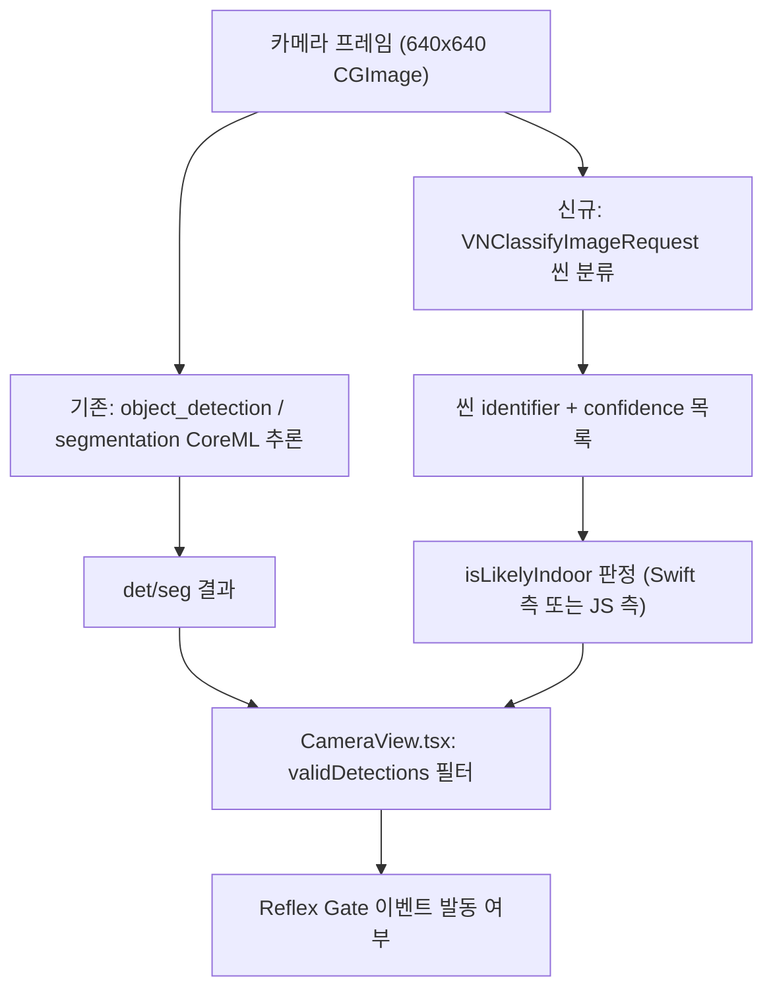

# Minchodan 실내 오탐 완화 2차 설계서 (물리적 타당성 필터 + 씬 분류기 게이트)

> **작성일**: 2026-07-07
> **버전**: v0.2.0 (§4.4 게이트 규칙을 실내 558건 + 실외 74건 실측 로그 분석 결과로 확정)
> **설계 기준**: 2026-07-07 실기기(고태현 iPhone) 실내/실외 현장 테스트 로그 실측
> **선행 조치**: `client/src/components/CameraView.tsx`의 클래스별 confidence 임계값(`CLASS_MIN_CONFIDENCE`), 연속 프레임 검증(서버 `MIN_HIT_COUNT`), 실외 노면 co-occurrence 게이트(`OUTDOOR_SURFACE_CLASSES`), 안전 노면 제외(`SAFE_SURFACE_CLASSES`) — 본 문서는 이 1차 완화책의 구조적 한계를 보완하는 2차 설계다.
> **관련 문서**: [`docs/stage-guides/stage3_detection_design.md`](../stage-guides/stage3_detection_design.md), [`docs/design/behavior_and_risk_insight.md`](behavior_and_risk_insight.md)

---

## 1. 배경 및 문제 정의

### 1.1 1차 완화책의 실측 결과

2026-07-07 실기기 실내 현장 테스트(Metro 로그 실측)에서 확인된 수치:

| 클래스 | 관측된 confidence 범위 | 비고 |
| --- | --- | --- |
| `car` (오탐, 실내) | 최대 **0.916** (696건 중 0.9 초과 9건, 0.6 초과 183건) | HIGH_RISK_CLASSES 문턱(0.6)을 뚫고 지속 |
| `sidewalk_normal` (오탐, 실내) | 최대 **0.95** | segmentation 모델도 동일 도메인쉬프트 공유 |
| `person` (미탐, 실내 실제 사람) | **0.17** | 전역 임계값(40%) 미달로 완전히 무시됨 |

관측된 `car` 오탐 bbox 공통 패턴 (카메라를 대상에 밀착시킨 경우):

```
h≈641~676, w≈410~666, x≈-30~-260 (음수), y≈-100~130
```

박스 크기가 640x640 입력 캔버스 크기에 근접하거나 초과하고, 좌측으로 화면 밖까지 밀려나 있다.

### 1.2 구조적 한계 (1차 완화책이 못 막는 이유)

1. **confidence 임계값의 한계**: `car`/`sidewalk_normal` 오탐 confidence가 각각 0.916, 0.95까지 나오므로, 실제 탐지(TP)에서도 낮은 confidence(예: 검증 샘플 `bicycle_3_result.jpg`의 `kiosk 0.33`, `person 0.40`)가 흔한 상황에서 문턱을 올려 오탐만 걸러내는 것은 불가능하다(FP와 TP confidence 분포가 겹침).
2. **co-occurrence 게이트의 논리적 구멍**: 현재 `CameraView.tsx`의 `hasOutdoorSurface` 게이트는 "segmentation이 실외 노면을 잡으면 실외로 간주"하는데, segmentation 모델 자체도 실내에서 `sidewalk_normal`을 0.95까지 오탐한다. 즉 두 모델이 같은 도메인쉬프트를 공유하므로, "노면이 잡혔으니 실외가 맞다"는 전제가 실내에서도 자주 거짓으로 성립한다.
3. **미탐과 오탐이 동일 원인의 반대 증상**: `person`처럼 고수준·구체적 패턴(실외 보행 실루엣)에 의존하는 클래스는 실내에서 확신을 못 얻어 미탐되고, `car`/`sidewalk_normal`처럼 저수준·범용적 패턴(평평한 바닥 질감, 어둡고 반사되는 사각형)에 의존하는 클래스는 실내 사물에도 확신을 갖고 오탐한다. 두 실패 모드 모두 confidence 조정으로는 해결 불가.

### 1.3 근본 해결과의 관계

근본 해결(하드 네거티브 재학습, 실내 person 포즈 데이터 추가)은 데이터/ML 작업으로 이번 설계서의 범위 밖이다. 본 문서는 **재학습 없이 코드 레벨에서 즉시~단기로 적용 가능한 2개 방어선**을 설계한다.

---

## 2. 설계 목표

| 방어선 | 시급도 | 목표 |
| --- | --- | --- |
| §3 물리적 타당성 필터 | 즉시 | 기하학적으로 정상적인 탐지 결과가 나올 수 없는 형태(캔버스 초과 크기 등)의 오탐을 규칙으로 차단 |
| §4 실내/실외 씬 분류기 게이트 | 단기 | seg 모델과 독립적인 신호로 실내/실외를 판별하여, co-occurrence 게이트의 논리적 구멍(1.2의 2번)을 해소 |

두 방어선은 상호 대체가 아니라 **중첩 방어(defense in depth)** 로 설계한다. 씬 분류기가 실패하거나 낮은 확신을 보이면 §3과 기존 co-occurrence 게이트가 계속 동작한다.

---

## 3. §3 물리적 타당성 필터 설계 (즉시 적용)

### 3.1 원리

YOLO 계열 모델의 bbox 회귀 목표(ground truth)는 항상 학습 이미지 경계 내부에 그려진 어노테이션이다. 따라서 정상적으로 학습된 모델이라면, 640x640 입력 캔버스에 대한 회귀 출력의 너비(`w`)와 높이(`h`)가 캔버스 크기(640)를 뚜렷하게 초과할 수 없다 — 이는 훈련 데이터 자체가 가르친 적 없는 값이다. 1.1절의 실측 데이터(`h`가 641~676까지 관측됨)는 이 구조적 불가능성을 위반하는 회귀 출력이 실제로 나오고 있음을 보여준다.

이 필터는 "실내냐 실외냐"를 판별하지 않는다. **"이 bbox 자체가 기하학적으로 신뢰할 수 있는가"만 판별**하므로 도메인쉬프트 여부와 무관하게 항상 유효한 규칙이다.

### 3.2 판정 규칙

`client/src/components/CameraView.tsx`의 `handleFrame` 내 `validDetections` 필터에 아래 규칙을 추가한다.

```ts
// 640x640 캔버스를 기준으로 회귀된 좌표이므로, 정상적인 학습 데이터의 GT는
// 캔버스 경계를 초과할 수 없다. w/h가 캔버스 크기를 뚜렷하게 초과하면
// 회귀 자체가 붕괴한 것으로 간주해 즉시 제외한다 (부동소수점 회귀 노이즈
// 감안 2% 여유만 허용).
const CANVAS_OVERFLOW_MARGIN = 1.02;

function isGeometricallyImplausible(bbox: BBox): boolean {
  const maxSize = FRAME_SIZE * CANVAS_OVERFLOW_MARGIN;
  return bbox.w > maxSize || bbox.h > maxSize;
}
```

`validDetections` 필터 체인에 추가:

```ts
const validDetections = allDetections.filter((d: OnDeviceDetectionResult) => {
  if (SAFE_SURFACE_CLASSES.includes(d.className)) return false;
  if (isGeometricallyImplausible(d.bbox)) return false;   // <- 신규
  if (d.confidence <= getEffectiveConfThreshold(d.className, confThresholdRef.current)) return false;
  if (!hasOutdoorSurface) return false;
  return true;
});
```

### 3.3 적용 대상 범위

**전체 클래스에 적용**(특정 클래스로 한정하지 않음). 캔버스 초과 회귀는 클래스와 무관하게 발생하는 회귀 붕괴 현상이므로, `car` 등 특정 클래스에만 걸면 다른 클래스(예: `bollard`, `movable_signage`)의 동일 패턴 오탐을 놓친다. 1.1절에서 이미 여러 클래스에서 동일 패턴(w/h가 640 근접·초과)이 공통으로 관측됐다.

### 3.4 안전성 검토 (False Negative 리스크)

실제 근접 충돌 상황(진짜 차량이 매우 가까워 화면을 거의 채우는 경우)에서 이 필터가 과도하게 작동해 정상 경보를 죽일 위험을 검토해야 한다.

- 정상 학습 데이터의 bbox는 이미지 경계 내부로 클리핑되어 있으므로, **실제로 매우 가까운 물체도 GT상 `w`, `h`는 최대 640(캔버스 전체)을 넘지 않도록 학습됐어야 한다.** 즉 진짜 근접 상황이라면 모델이 학습한 대로 `w`/`h`가 640 이하로 나와야 정상이다.
- 다만 이 가정은 **실외 현장에서의 실측 검증이 아직 없다.** 이번 세션에서 확보한 데이터는 전부 실내 오탐 사례이며, 실외에서 실제로 근접한 차량/장애물의 정상 bbox가 640을 초과하는지 여부는 로그로 확인되지 않았다.
- **권고**: 프로덕션 반영 전, 실외 현장에서 사람/차량에 실제로 근접하는 시나리오를 재현해 `w`/`h`가 항상 640 이하로 나오는지 최소 1회 실측 검증한다. 만약 실외 근접 상황에서도 640 초과가 정상적으로 발생한다면 `CANVAS_OVERFLOW_MARGIN`을 상향 조정하거나, 이 필터를 §4의 씬 분류기 결과와 결합(실내로 판정된 프레임에서만 적용)하는 방식으로 완화한다.

### 3.5 테스트 계획

| 테스트 | 검증 내용 |
| --- | --- |
| 단위 테스트(TS) | `isGeometricallyImplausible()`에 실측 오탐 bbox(예: `h=676, w=472`) 입력 시 `true`, 정상 bbox(예: `h=300, w=200`) 입력 시 `false` |
| 실기기 재현 테스트 | 이번 세션에서 오탐이 재현된 동일 실내 물체에 카메라 밀착 → `[ReflexGate]` 미발동 확인 |
| 실외 회귀 테스트 (권고, 3.4 참조) | 실외에서 사람/자전거에 근접 → 정상 경보가 여전히 발동하는지 확인 |

---

## 4. §4 실내/실외 씬 분류기 게이트 설계 (단기 적용)

### 4.1 원리

`Vision` 프레임워크의 `VNClassifyImageRequest`는 iOS 13+ 에 내장된 범용 이미지 분류 요청으로, Apple이 사전 학습해 OS에 내장한 분류 모델(약 1300개 identifier)을 온디바이스에서 실행한다. Photos 앱이 사진을 "실내/실외/자연/차량" 등으로 자동 분류할 때 사용하는 것과 동일한 시스템 API다.

이 분류기는 **우리 YOLO26n det/seg 모델과 완전히 독립적인 학습 데이터/파이프라인**을 사용하므로, 1.2절의 2번 문제(seg 모델이 자기 자신의 도메인쉬프트를 게이트로 쓰는 논리적 구멍)를 근본적으로 해소한다. 새 라이브러리 추가, 외부 모델 다운로드, 재학습이 전혀 필요 없다(시스템 API만 사용).

### 4.2 아키텍처



`CoreMLInferenceBridge.swift`의 `detectFrame` 흐름에 씬 분류를 병행 실행하고, 응답 payload에 결과를 추가하는 구조로 설계한다(기존 det/seg 파이프라인은 변경하지 않음).

### 4.3 인터페이스 계약

**Swift 측 (`CoreMLInferenceBridge.swift`) 신규 함수**:

```swift
// VNClassifyImageRequest 결과에서 "실내/실외" 관련 identifier를 집계해
// 간단한 이진 판정과 원본 top-N identifier를 함께 반환한다.
// 키워드 집합은 실내 558건(2026-07-07) + 실내/실외 혼합 74건(2026-07-07) 실측 로그
// 분석으로 확정 (4.5절 근거 참조).

// "outdoor" 단독 confidence보다 신뢰도가 높은 실외 긍정 증거: 지면/초목/도로 계열
// identifier. 실측 최대 confidence 0.66(grass/land), 0.48(foliage/plant), crosswalk
// 등장(0.27) 시 실외로 확정해도 안전했다.
private let OUTDOOR_POSITIVE_IDENTIFIERS: Set<String> = [
  "grass", "land", "path", "plant", "foliage", "crosswalk", "sand_dune", "sand"
]

// "outdoor"가 등장해도 실내 천장 조명을 달/밤하늘로 오인하는 것으로 추정되는
// 동반 identifier. 실내 558건 중 25%(139건)에서 이 조합으로 "outdoor" confidence가
// 최대 0.71까지 나왔다 — outdoor 리터럴 단독으로는 신뢰 불가.
private let INDOOR_FALSE_POSITIVE_IDENTIFIERS: Set<String> = [
  "night_sky", "moon", "celestial_body"
]

private func classifyScene(cgImage: CGImage) throws -> [String: Any] {
  let request = VNClassifyImageRequest()
  let handler = VNImageRequestHandler(cgImage: cgImage, options: [:])
  try handler.perform([request])

  guard let observations = request.results else {
    // observations 자체가 없으면(분류 실패) 판정 불가 상태이므로, 4.6절 폴백 정책에
    // 따라 isLikelyIndoor=false(허용적)로 반환해 기존 co-occurrence 게이트만으로 동작시킨다.
    return ["isLikelyIndoor": false, "confidence": 0.0, "topLabels": []]
  }

  let top5 = observations.prefix(5)
  let topLabels = top5.map {
    ["identifier": $0.identifier, "confidence": Double($0.confidence)]
  }
  let identifierSet = Set(top5.map { $0.identifier })

  let outdoorEvidence = top5.first { OUTDOOR_POSITIVE_IDENTIFIERS.contains($0.identifier) }
  let hasIndoorFPSignature = identifierSet.contains("outdoor")
    && !identifierSet.isDisjoint(with: INDOOR_FALSE_POSITIVE_IDENTIFIERS)

  let isLikelyIndoor: Bool
  let indoorConfidence: Double
  if let outdoorEvidence {
    // 지면/초목/도로 identifier가 top-5에 있으면 실외로 확정한다.
    isLikelyIndoor = false
    indoorConfidence = Double(outdoorEvidence.confidence)
  } else if hasIndoorFPSignature {
    // "outdoor"가 나와도 night_sky/moon/celestial_body와 동반되면 조명 오탐으로 간주해 override.
    isLikelyIndoor = true
    indoorConfidence = Double(top5.first { $0.identifier == "outdoor" }?.confidence ?? 0.0)
  } else {
    // 확정적 실외 증거가 없으면 보수적으로 실내로 취급한다(반사 경보 억제 방향 기본값).
    isLikelyIndoor = true
    indoorConfidence = 0.0
  }

  return [
    "isLikelyIndoor": isLikelyIndoor,
    "confidence": indoorConfidence,
    "topLabels": topLabels
  ]
}
```

`detectFrame`의 응답 딕셔너리에 `"scene": {...}` 필드로 추가한다. 기존 `det`/`seg`/`benchmark` 필드는 변경하지 않는다.

**JS 측 (`useOnDeviceDetection.ts`, `CameraView.tsx`) 타입 확장**:

```ts
export interface SceneClassification {
  isLikelyIndoor: boolean;
  confidence: number;
  topLabels: { identifier: string; confidence: number }[];
}
```

`detectFrame`의 반환 타입에 `scene?: SceneClassification`을 추가하고, `CameraView.tsx`의 `handleFrame`에서 `hasOutdoorSurface` 판정에 병행 반영한다.

### 4.4 게이트 적용 방식

기존 `hasOutdoorSurface`(seg 기반)를 완전히 대체하지 않고, **두 신호를 AND로 결합**한다(중첩 방어 원칙, §2 참조):

```ts
const isOutdoorByScene = scene ? !scene.isLikelyIndoor : true; // 씬 분류 실패 시 기존 게이트로 폴백(4.6)
const canFireReflex = hasOutdoorSurface && isOutdoorByScene;
```

`scene`이 `undefined`이거나 `confidence`가 낮으면 `isOutdoorByScene`을 `true`로 두어 기존 seg 기반 co-occurrence 게이트만으로 동작하도록 안전하게 폴백한다(4.6절).

`scene.isLikelyIndoor` 자체의 판정 로직은 4.3절 `classifyScene()`에서 계산되며, 그 판정 기준은 다음 실측 결과로 확정됐다.

**실측 근거 (2026-07-07, 실내 558건 + 실내/실외 혼합 74건)**

| 구간 | `outdoor` confidence | 동반 identifier | 판정 |
| --- | --- | --- | --- |
| 실내(천장 조명 오탐, 21건 연속) | 0.51 고정 | `night_sky`/`sky`/`celestial_body`/`moon` | 실내(오탐 signature) |
| 실내(복도 이동, 저confidence 잡음) | 0.02~0.17 | `material`/`structure`/`wood_processed`/`toilet_seat` 등 | 실내(긍정 증거 없음, 기본값) |
| 실외(잔디/보도) | 0.48~0.66 | `grass`/`land`/`path`/`plant`/`foliage` | 실외(긍정 증거) |
| 실외(횡단보도) | 0.27 | `crosswalk`, `land`, `path` | 실외(긍정 증거) |
| 실내(계단실 재진입) | 거의 미등장 | `structure`/`conveyance`/`stairs`/`escalator`/`railroad` | 실내(긍정 증거 없음, 기본값) |

**확정 규칙**:

1. top-5 identifier에 `grass`/`land`/`path`/`plant`/`foliage`/`crosswalk`/`sand`/`sand_dune`(지면·초목·도로 계열) 중 하나라도 있으면 **실외로 확정**한다(`isLikelyIndoor = false`).
2. 그렇지 않고 `outdoor`가 `night_sky`/`moon`/`celestial_body`와 함께 등장하면 조명 오탐 signature로 간주해 **실내로 override**한다(`isLikelyIndoor = true`).
3. 위 두 조건에 모두 해당하지 않으면(확정적 실외 증거 없음) **보수적으로 실내로 취급**한다(`isLikelyIndoor = true`).

`outdoor` 리터럴 identifier의 confidence 값 자체는 판정 기준으로 사용하지 않는다 — 실측상 실내 오탐(최대 0.51~0.71)과 실외 정탐(0.27~0.66)의 confidence 분포가 겹쳐, confidence 임계값만으로는 안정적으로 분리되지 않았다. 대신 **동반 identifier의 종류**(지면/초목/도로 vs 천체/조명)로 판정한다.

### 4.5 한계 및 실측 필요 사항

**해결된 항목** (2026-07-07 실측으로 확인):

- `VNClassifyImageRequest`의 identifier taxonomy에 `"indoor"` 리터럴은 실내 558건 + 오늘 74건 전체에서 **한 번도 등장하지 않았다.** 대신 개념어 조합(`night_sky`/`moon`/`celestial_body` = 조명 오탐, `grass`/`land`/`path`/`plant`/`foliage`/`crosswalk` = 실외 긍정 증거, `computer_monitor`/`computer_keyboard`/`desk`/`people` = 실내 긍정 증거)으로 추론해야 함을 확인했다. 4.3절 키워드 매핑에 반영 완료.
- 씬 분류 지연시간 실측(오늘 74건): **평균 11.27ms, 최소 7.15ms, 최대 74.13ms**(최초 1회 콜드스타트 추정). 반사 경로 예산(300ms) 대비 부담이 크지 않아, N프레임 주기 캐싱 절충안은 현재로선 불필요하다고 판단.

**남은 한계**:

- **실외 표본이 매우 작다.** 오늘 수집된 실외 성격 로그는 74건 중 4~5건(191·194·200·212행)뿐이며, 이동 구간도 짧았다(잔디/보도/횡단보도 인근으로 추정). 맑은 날/흐린 날/야간, 도로/공원/골목 등 다양한 실외 환경에서의 추가 수집이 필요하다.
- 실외 정탐 confidence(0.27~0.66)의 하한이 아직 낮게 나온 사례(0.27, crosswalk)가 있어, `crosswalk`처럼 화면 일부만 잡히는 상황에서 긍정 증거 identifier 자체가 top-5에 못 들어가는 false negative 가능성은 배제되지 않았다.
- `OUTDOOR_POSITIVE_IDENTIFIERS`/`INDOOR_FALSE_POSITIVE_IDENTIFIERS` 키워드 집합은 이번 표본에서 관측된 것으로 한정되며, VNClassifyImageRequest의 약 1300개 identifier 전체를 전수 검토한 것은 아니다. 추가 실외 데이터 수집 시 리스트를 계속 보강해야 한다.
- 카메라를 물체에 극단적으로 밀착시키는 매크로 촬영 상황에서의 안정성은 이번 세션에서 별도 확인되지 않았다.

### 4.6 폴백 정책

씬 분류 실행 중 예외가 발생하거나(`try handler.perform` 실패), `observations`가 비어 있거나, confidence가 낮아 판정을 신뢰할 수 없는 경우, `isLikelyIndoor`를 판정하지 않고(`scene` 필드를 생략하거나 `confidence: 0.0`으로 반환) JS 측에서 `isOutdoorByScene = true`로 처리해 **기존 co-occurrence 게이트만으로 동작**하도록 한다. 씬 분류기가 단일 장애점(SPOF)이 되지 않도록 설계한다.

---

## 5. 구현 파일 목록

| 파일 | 변경 유형 | 내용 |
| --- | --- | --- |
| `client/src/components/CameraView.tsx` | 수정 | §3 `isGeometricallyImplausible()` 추가 및 `validDetections` 필터 반영. §4 `isOutdoorByScene` 결합 로직 추가 |
| `client/ios/CoreMLInferenceBridge.swift` | 수정 | §4 `classifyScene()` 함수 추가, `detectFrame` 응답에 `scene` 필드 추가 |
| `client/src/hooks/useOnDeviceDetection.ts` | 수정 | `SceneClassification` 타입 반영, `detectFrame` 반환값에 `scene` 전달 |
| `client/src/inference/types.ts` (또는 동등 타입 정의 파일) | 수정 | `SceneClassification` 인터페이스 추가 |
| 테스트 | 신규 | §3 단위 테스트(`isGeometricallyImplausible`), §4는 계측 단계 로그 수집 후 회귀 테스트 추가 |

---

## 6. 롤아웃 순서

1. **완료**: §3 물리적 타당성 필터 구현 및 실기기 재현 테스트(3.5절)
2. **완료**: §4 `classifyScene()` 로깅 전용 계측 배포 (게이트 미적용, `topLabels`만 로그 수집), 실내 558건 + 실내/실외 혼합 74건 로그 수집·분석
3. **완료(규칙 확정, 코드 미반영)**: 4.3/4.4절 키워드 매핑 및 게이트 로직 확정. **다음 작업**: `CoreMLInferenceBridge.swift`의 `classifyScene()`을 4.3절 코드로 교체하고, `CameraView.tsx`에 4.4절 `isOutdoorByScene` AND 결합 로직을 실제 반영
4. **검증(진행 필요)**: 코드 반영 후 실내(오탐 억제) + 실외(정상 탐지 유지, 특히 4.5절의 작은 실외 표본 보강) 양쪽 현장 재테스트로 §3, §4 각각의 효과와 부작용(false negative) 확인

---

## 7. 참고 문서

- [`docs/stage-guides/stage3_detection_design.md`](../stage-guides/stage3_detection_design.md) — 3단계 탐지·게이트 원본 설계
- [`docs/design/behavior_and_risk_insight.md`](behavior_and_risk_insight.md) — 위험도 게이트 정의 근거
- `client/src/components/CameraView.tsx` — 1차 완화책(클래스별 confidence, co-occurrence 게이트, 안전 노면 제외) 구현 위치
- `server/detection/gates/reflex_gate.py` — 서버 측 1차 완화책(hit_count, 클래스별 confidence) 구현 위치
