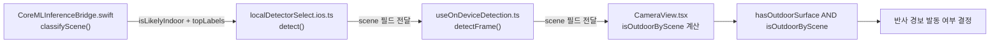

# 씬 분류기 게이트 기법 해설 (팀 학습용)

> **작성일**: 2026-07-07
> **버전**: v1.1.0 (2026-07-24: Android ML Kit 씬 게이트 대응 반영)
> **목적**: `docs/design/indoor_fp_mitigation_design.md` §4에서 설계하고 실제 코드에 반영한 "씬 분류기 게이트" 기법을, 처음 접하는 팀원도 배경부터 코드 위치까지 따라갈 수 있도록 상세히 풀어 쓴 학습용 문서
> **관련 문서**: [`docs/design/indoor_fp_mitigation_design.md`](indoor_fp_mitigation_design.md)(원본 설계서, 실측 데이터·안전성 검토 포함), [`docs/design/behavior_and_risk_insight.md`](behavior_and_risk_insight.md)

---

## 1. 이 문서를 왜 읽어야 하나

Minchodan의 반사 경로(Reflex Path)는 카메라 프레임을 YOLO26n 탐지·분할 모델에 넣고, 위험하다고 판단되면 즉시 경보(비프음+진동)를 울립니다. 그런데 이 모델은 **AI Hub 한국 인도(실외) 데이터셋만으로 학습**되어 있어서, 실내에서 촬영하면 모델이 "실외라고 가정하고" 엉뚱한 사물을 위험 물체로 착각하는 일이 반복적으로 관측됐습니다(예: 사무실 의자를 `car`로, 사무실 바닥을 `sidewalk_normal`로 오인).

이 문제를 막기 위해 이번에 추가한 것이 **씬 분류기 게이트**입니다. 플랫폼별 온디바이스 이미지 분류(iOS: Vision `VNClassifyImageRequest`, Android: ML Kit Image Labeling)로 "지금 이 프레임이 실내인지 실외인지"를 독립적으로 한 번 더 확인하고, 실내로 판단되면 반사 경보를 억제합니다.

이 문서는 다음을 다룹니다.

- 왜 하필 이 방법을 골랐는가(대안과 비교)
- 정확히 어떻게 동작하는가(원리, 판정 규칙, 실측 근거)
- 코드 어디를 보면 되는가(파일별 역할)
- 무엇을 조심해야 하는가(한계, FAQ)

---

## 2. 문제 상황을 먼저 이해하기

### 2.1 왜 하필 오탐이 나는가

YOLO 계열 모델은 학습 데이터에 없던 환경(도메인)을 만나면, "가장 비슷하게 생긴 학습 클래스"로 강한 확신을 갖고 오분류하는 경향이 있습니다. 이걸 **도메인 시프트(domain shift)** 라고 부릅니다. 우리 모델은 실외 인도 사진만 봤기 때문에, 실내 사무실 사진을 넣으면 "본 적 없는 장면"이 아니라 "본 적 있는 장면과 억지로 매칭"해버립니다.

실측 사례(2026-07-07 실내 현장 테스트):

| 클래스 | 관측된 confidence | 실제로는 |
| --- | --- | --- |
| `car` | 최대 0.916 | 실내 사물(의자 등) |
| `sidewalk_normal` | 최대 0.95 | 사무실 바닥 |

confidence(모델의 확신도)가 90%를 넘는데도 완전히 틀린 판단입니다. 즉 **"confidence 임계값을 올리면 되지 않나?"** 라는 직관적인 해결책이 통하지 않습니다 — 진짜 실외 탐지도 confidence가 낮게 나오는 경우가 흔해서(예: 검증 샘플에서 `person 0.40`), 임계값을 오탐이 안 걸릴 만큼 올리면 진짜 탐지까지 함께 죽습니다.

### 2.2 왜 기존 방어선(1차 완화책)만으로는 부족한가

이전에 이미 두 가지를 적용했습니다.

1. **클래스별 confidence 상향** + **연속 프레임 검증(hit_count)**: 오탐 클래스(`car`, `bus` 등)만 임계값을 더 높이고, 여러 프레임 연속으로 잡혀야 인정.
2. **co-occurrence 게이트**: "같은 프레임에서 segmentation이 실외 보행로(`sidewalk_normal` 등)를 같이 잡았을 때만" 반사 경보를 허용.

문제는 2번입니다. segmentation 모델도 **같은 데이터셋으로 학습된 같은 도메인 시프트를 공유**합니다. 즉 "노면이 잡혔으니 실외가 맞다"는 전제 자체가, 실내에서 `sidewalk_normal`을 0.95로 오탐하는 순간 무너집니다. **자기 자신의 오류를 자기 자신으로 검증하는 논리적 구멍**인 셈입니다.

이 구멍을 메우려면, **det/seg 모델과 완전히 다른 학습 데이터를 쓰는 제3의 판정 근거**가 필요합니다. 그게 씬 분류기 게이트입니다.

---

## 3. 핵심 아이디어: 독립적인 두 번째 눈

### 3.1 VNClassifyImageRequest란

`VNClassifyImageRequest`는 애플이 iOS 13부터 기본 제공하는 이미지 분류 API입니다. 사진 앱이 "이 사진은 실내/자연/음식/차량 사진이다"를 자동으로 분류할 때 쓰는 것과 동일한 시스템 기능이며, 약 1,300개의 개념(identifier)을 인식합니다. 우리가 추가로 설치하거나 학습시킨 모델이 아니라 **iOS에 이미 내장된 기능**이라, 새 라이브러리 설치나 재학습이 전혀 필요 없습니다.

중요한 점은 이 분류기가 **우리 YOLO26n 모델과 완전히 다른 회사(Apple)가, 완전히 다른 데이터로 학습시킨 별개의 모델**이라는 것입니다. 그래서 YOLO가 실내에서 헤매는 것과 VNClassifyImageRequest가 실내에서 헤매는 것은 서로 독립적인 사건입니다 — 하나가 틀려도 다른 하나가 맞을 확률이 높아집니다. 이게 "두 번째 눈"이라는 비유의 의미입니다.

### 3.2 왜 완전 대체가 아니라 "추가"인가

씬 분류기가 기존 co-occurrence 게이트를 대체하는 게 아니라 **AND로 결합**됩니다(중첩 방어, defense in depth). 씬 분류기도 실패하거나 확신이 낮을 수 있으니, 하나가 뚫려도 다른 하나가 막아주는 구조입니다.


두 신호 중 하나라도 "실내"라고 하면 경보가 억제됩니다. 이렇게 하면 어느 한쪽 모델의 도메인 시프트만으로는 오탐이 통과하기 어려워집니다.

---

## 4. 판정 규칙: 왜 이렇게 정했는가

### 4.1 처음 시도했던 단순한 방법과 그 실패

가장 먼저 떠오르는 방법은 "identifier 목록에 `indoor`나 `outdoor`라는 단어가 있으면 그대로 믿는다"입니다. 실측해보니 이건 통하지 않았습니다.

- **`indoor`라는 리터럴 identifier는 실내 558건 + 실내/실외 혼합 74건, 총 632건 중 단 한 번도 등장하지 않았습니다.** Apple의 taxonomy에 그 정확한 단어가 없거나, 우리가 테스트한 장면에서 전혀 활성화되지 않았습니다.
- **`outdoor`는 등장하지만 실내에서도 25% 확률로 오탐됩니다.** 사무실 천장 조명을 카메라가 보면, `night_sky`/`moon`/`celestial_body`와 함께 `outdoor`가 confidence 0.51~0.71로 잡히는 패턴이 반복 관측됐습니다 — 천장 조명을 밤하늘의 달로 착각하고 "그럼 실외겠구나"라고 연쇄 추론하는 것으로 보입니다.
- 실외로 나가서 실측해보니, 진짜 실외 장면의 `outdoor` confidence(0.48~0.66)가 오히려 이 오탐 패턴(0.51 고정)과 **겹치거나 더 높게** 나왔습니다. 즉 confidence 숫자만 보고 임계값을 정하는 방식은 YOLO 모델 때와 똑같은 함정에 빠집니다.

### 4.2 실제로 통했던 방법: "무엇과 함께 나오는가"를 본다

confidence 숫자 대신 **동반 identifier의 의미**를 봤더니 뚜렷한 차이가 보였습니다.

| 상황 | `outdoor` confidence | 함께 나온 identifier | 실제로는 |
| --- | --- | --- | --- |
| 실내, 천장 조명 오탐 | 0.51 고정 (21건 연속) | `night_sky`, `sky`, `celestial_body`, `moon` | 실내 |
| 실내, 복도 이동 | 0.02~0.17 (낮음) | `material`, `structure`, `wood_processed` 등 | 실내 |
| 실외, 잔디밭/보도 | 0.48~0.66 | `grass`, `land`, `path`, `plant`, `foliage` | 실외 |
| 실외, 횡단보도 | 0.27 | `crosswalk`, `land`, `path` | 실외 |
| 실내, 계단실 | 거의 안 나옴 | `structure`, `conveyance`, `stairs`, `escalator` | 실내 |

오탐은 항상 "천체/조명" 계열 단어와 함께 나오고, 진짜 실외는 항상 "지면/초목/도로" 계열 단어와 함께 나옵니다. 이 둘은 절대 섞이지 않았습니다. 그래서 최종 규칙은 confidence가 아니라 **"어떤 종류의 단어가 함께 나왔는가"** 를 기준으로 삼습니다.

### 4.3 최종 규칙 (코드에 반영된 그대로)

top-5 identifier를 확인해서, 순서대로 다음 규칙을 적용합니다.

1. `grass`/`land`/`path`/`plant`/`foliage`/`crosswalk`/`sand`/`sand_dune` (지면·초목·도로 계열) 중 하나라도 있으면 → **실외로 확정**.
2. 1번에 해당하지 않고, `outdoor`가 `night_sky`/`moon`/`celestial_body`와 함께 나오면 → **조명 오탐으로 간주해 실내로 override**.
3. 위 두 경우 모두 아니면(확정적 실외 증거 없음) → **보수적으로 실내 취급** (기본값).

말로 풀면: "지면이나 초목, 도로가 보여야만 진짜로 실외라고 인정하고, 그 외에는 `outdoor`라는 단어가 나와도 의심하며, 아무 증거가 없으면 안전한 쪽(실내, 즉 경보 억제)으로 판단한다"는 보수적인 원칙입니다.

---

## 5. 코드에서 실제로 어디를 보면 되는가

전체 흐름은 카메라 프레임 한 장이 아래 순서로 처리됩니다.



| 파일 | 역할 |
| --- | --- |
| `client/ios/CoreMLInferenceBridge.swift` | iOS `classifyScene()`. `VNClassifyImageRequest`를 실행하고, 4.3절 규칙대로 `isLikelyIndoor`/`confidence`/`topLabels`를 계산해 반환. `outdoorPositiveIdentifiers`/`indoorFalsePositiveIdentifiers` 키워드 집합이 여기 정의돼 있음. |
| `client/android/.../SceneClassifyBridgeModule.kt` | Android 대응. ML Kit Image Labeling으로 top labels를 얻고, Android taxonomy용 identifier 집합으로 동일 정책(`isLikelyIndoor`)을 산출. |
| `client/src/inference/tfliteDetector.ts` | `classifySceneAndroid()`가 `SceneClassifyBridgeModule`을 호출해 `scene` 필드를 채움. |
| `client/src/inference/types.ts` | `SceneClassification` 타입 정의(`isLikelyIndoor`, `confidence`, `topLabels`). |
| `client/src/inference/localDetectorSelect.ios.ts` | Swift 브릿지 응답(`scene` 필드)을 JS 쪽으로 전달. `[SceneClassify]` 로그도 여기서 출력(디버깅용, top-5 identifier 계속 확인 가능). |
| `client/src/hooks/useOnDeviceDetection.ts` | `detectFrame()`이 `scene`을 반환값에 포함해 컴포넌트까지 전달. |
| `client/src/components/CameraView.tsx` | `isOutdoorByScene = scene ? !scene.isLikelyIndoor : true` 계산 후, 기존 `hasOutdoorSurface`(seg 기반)와 AND로 결합해 `validDetections` 필터에 적용. 플랫폼 구분 없이 동일 소비. |

`scene`이 없거나 판정 자체가 실패하면 `isOutdoorByScene`을 `true`로 두어, 기존 co-occurrence 게이트만으로 동작하도록 안전하게 폴백합니다. 씬 분류기가 죽어도 전체 파이프라인이 멈추지 않게 하기 위함입니다. Apple Vision과 ML Kit taxonomy는 다르므로 identifier 집합·실측 오탐률은 플랫폼별로 별도 검증이 필요합니다(배선 완료 ≠ 품질 동일).

---

## 6. 실제로 확인하는 방법

앱을 실행한 상태에서 Metro 콘솔(또는 `npx expo start` 터미널)에 아래와 같은 로그가 매 프레임 찍힙니다.

```
[SceneClassify] outdoor(0.51), night_sky(0.51), sky(0.51), celestial_body(0.20), moon(0.20)
```

이 로그만 보고도 "지금 이 프레임이 게이트에서 실내로 판정됐겠구나"를 규칙(4.3절)에 대입해 예상할 수 있습니다. 위 예시는 `outdoor` + `night_sky`/`celestial_body`/`moon` 조합이라 2번 규칙에 해당 → 실내 override.

반대로 아래 같은 로그가 보이면 실외로 판정됩니다.

```
[SceneClassify] outdoor(0.66), land(0.66), grass(0.66), path(0.28), plant(0.08)
```

`grass`/`land`/`path`가 있으므로 1번 규칙에 해당 → 실외 확정.

---

## 7. 한계와 주의할 점

- **표본이 아직 작습니다.** 이 규칙은 실내 558건과 실외 74건(그중 진짜 실외로 보이는 건 4~5건뿐)이라는, 한 번의 세션에서 나온 데이터로 확정된 것입니다. 맑은 날/흐린 날/야간, 도로/공원/골목 등 더 다양한 실외 환경에서 계속 검증하며 키워드 목록(`outdoorPositiveIdentifiers`)을 보강해야 합니다.
- **`crosswalk`처럼 화면 일부만 잡히는 상황은 false negative 위험이 있습니다.** 긍정 증거 identifier가 top-5 안에 아예 안 들어가면 규칙 3번(보수적 실내 처리)으로 빠져 실외인데도 게이트가 닫힐 수 있습니다.
- **이 게이트는 "실내냐 실외냐"만 판단하지, bbox 자체의 신뢰도는 보지 않습니다.** bbox 회귀가 기하학적으로 말이 안 되는 경우(캔버스 크기 초과 등)는 별도의 §3 물리적 타당성 필터(`isGeometricallyImplausible()`)가 담당합니다. 두 방어선은 서로 다른 종류의 오탐을 막으므로 항상 같이 봐야 합니다.
- **지연시간은 문제없는 것으로 확인됐습니다.** 실측 평균 11.27ms(최대 74.13ms는 최초 1회 콜드스타트로 추정)로, 반사 경로 예산(300ms) 대비 부담이 크지 않습니다.

---

## 8. 자주 나올 법한 질문

**Q. confidence 임계값을 조정하면 안 되나요?**
A. 안 됩니다. 실내 오탐(0.51~0.71)과 실외 정탐(0.27~0.66)의 confidence 분포가 서로 겹쳐서, 어떤 임계값을 잡아도 한쪽은 반드시 희생됩니다. 그래서 confidence가 아니라 "동반 identifier의 의미"로 구분합니다.

**Q. `indoor`라는 identifier를 직접 쓰면 안 되나요?**
A. 실측 632건에서 단 한 번도 등장하지 않았습니다. Apple taxonomy에 이 정확한 단어가 우리가 테스트한 장면에서는 나오지 않는 것으로 보이며, 그래서 개념어 조합(지면/초목/도로 vs 천체/조명)으로 추론하는 우회 전략을 씁니다.

**Q. 안드로이드에서는 이 게이트가 동작하나요?**
A. 예. `SceneClassifyBridgeModule.kt`(ML Kit Image Labeling) + `tfliteDetector.ts`의 `classifySceneAndroid()`로 `scene`을 채우고, `CameraView`의 `isOutdoorByScene` 게이팅은 iOS와 동일하게 소비합니다. 다만 taxonomy·키워드 집합이 Apple Vision과 달라 실측 오탐률 정합은 별도 검증 대상입니다. 브릿지 실패 시에만 `isOutdoorByScene=true` 폴백으로 기존 co-occurrence 게이트만 동작합니다.

**Q. 이 게이트가 오작동하면 앱이 멈추나요?**
A. 아니요. `classifyScene()` 내부에서 예외가 발생하거나 분류 결과가 비어 있으면 `isLikelyIndoor: false`(허용적 폴백)를 반환하도록 만들어져 있어서, 씬 분류기가 죽어도 기존 게이트만으로 계속 동작합니다(단일 장애점이 되지 않도록 설계).

**Q. 이 규칙을 더 좋게 만들려면 무엇을 하면 되나요?**
A. 다양한 실외 환경(날씨, 시간대, 장소)에서 `[SceneClassify]` 로그를 더 수집해서, `outdoorPositiveIdentifiers`/`indoorFalsePositiveIdentifiers` 두 목록에 새로운 identifier를 추가·검증하면 됩니다. `docs/design/indoor_fp_mitigation_design.md` §4.5(한계 및 실측 필요 사항)에 지금까지 확인된 것과 남은 과제가 정리돼 있습니다.

---

## 9. 참고 문서

- [`docs/design/indoor_fp_mitigation_design.md`](indoor_fp_mitigation_design.md) — 원본 설계서. 안전성 검토(§3.4), 인터페이스 계약(§4.3), 롤아웃 이력(§6) 등 더 기술적인 내용
- [`docs/design/behavior_and_risk_insight.md`](behavior_and_risk_insight.md) — 위험도 게이트 정의 근거
- `client/ios/CoreMLInferenceBridge.swift` — `classifyScene()` 구현 위치
- `client/src/components/CameraView.tsx` — `isOutdoorByScene` 결합 위치
- `docs/changelogs/kb.md` (2026-07-07 항목들) — 이 기법이 만들어진 과정의 시간순 기록(실내 분석 → 실외 데이터 수집 → 규칙 확정 → 코드 반영)
