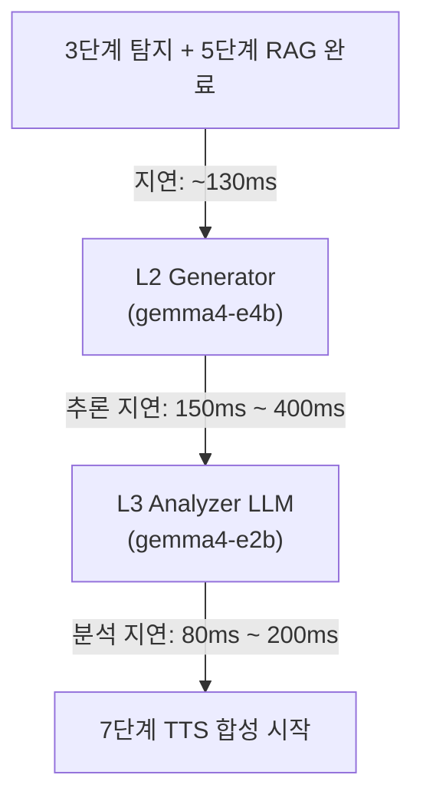

> **작성일**: 2026-06-28
> **버전**: v1.0.0

# Gemma 4-E4B 및 Gemma 4-E2B 이중 LLM 구성에 따른 성능 영향도 분석

본 분석 보고서는 **6단계 종합 회피 가이드 생성(LangGraph)**에서 가이드 생성 LLM으로 `gemma4-e4b` (4B)를 사용하고, 이를 정밀 분석/검증하는 LLM으로 `gemma4-e2b` (2B)를 배치하여 2개의 LLM을 동시에 구동할 때 발생하는 지연 시간(Latency), GPU 자원(VRAM 및 연산), 그리고 최적의 워크플로우에 대해 심층 분석합니다.

---

## 1. 지연 시간 (Latency) 영향 분석

경량 모델인 `gemma4-e4b`와 `gemma4-e2b`는 기존 `gemma2:9b` 모델보다 추론 속도가 현저히 빠르기 때문에, 2개의 LLM을 직렬로 연쇄 호출하더라도 지연 시간 측면에서 비교적 현실적인 수치를 보여줍니다.

### 1.1 직렬(Sequential) 호출 시 지연 예측

* **gemma4-e4b 1회 추론**: 약 **150ms ~ 400ms** (GPU 하드웨어 성능 및 출력 길이 20자 제한 기준)
* **gemma4-e2b 1회 추론**: 약 **80ms ~ 200ms** (경량 2B 규모 및 Multi-Token Prediction 기술 적용으로 매우 빠름)
* **두 모델의 직렬 지연 시간**: **약 230ms ~ 600ms**

### 1.2 전체 인지 경로(1~2Hz) 예산 내 타당성 검토

| 파이프라인 구간 | 기존 Gemma 2 (9B) 1회 구성 | Gemma 4-E4B + E2B 이중 구성 |
| :--- | :--- | :--- |
| **선행 구간 (탐지 + RAG)** | 약 130ms | 약 130ms |
| **LLM 추론 구간** | 약 300ms ~ 800ms (1회) | **약 230ms ~ 600ms (2회 직렬)** |
| **후행 구간 (TTS 합성)** | 약 200ms ~ 400ms | 약 200ms ~ 400ms |
| **총 누적 지연 시간** | **약 630ms ~ 1330ms** | **약 560ms ~ 1130ms** |

* **분석**: 놀랍게도 경량 모델 2개를 연쇄 호출하는 경우가 기존 무거운 9B 모델 1개를 실행하는 것보다 비슷하거나 더 빠르게 나타날 수 있습니다.
* **리스크**: 그러나 여전히 최소 560ms에서 최대 1.1초의 지연이 발생하므로, 인지 경로의 안정적인 반응 주기인 **1~2Hz**의 하한선에 아슬아슬하게 걸치게 됩니다. L3 검증 LLM에서 "실패 및 재시도(Retry)"가 일어날 경우, 전체 지연 시간이 **1.5초를 즉시 초과**하여 보행 보조 중 음성 안내가 밀리는 병목 현상이 발생할 수 있습니다.

---

## 2. GPU VRAM 및 연산 자원 영향

두 개의 모델을 동시에 메모리에 상주시켜야 하므로 VRAM 점유량과 연산 병목을 확인해야 합니다.

### 2.1 VRAM 점유 비교

* **gemma4-e4b (4-bit 양자화)**: 약 **2.5GB**
* **gemma4-e2b (4-bit 양자화)**: 약 **1.5GB**
* **이중 모델 로드 시 필요 VRAM**: **약 4.0GB**

| 자원 구성 요소 | 기존 Gemma 2 (9B) 단독 | Gemma 4-E4B + E2B 동시 로드 |
| :--- | :--- | :--- |
| **LLM 메모리** | 약 5.4GB | **약 4.0GB** |
| **YOLO + TTS + 임베딩 모델** | 약 3.5GB | 약 3.5GB |
| **총 필요 VRAM** | **약 8.9GB** | **약 7.5GB** |

* **하드웨어 사양별 영향**:
  * **VRAM 8GB 이하 (RTX 3060 등)**: 시스템 VRAM 한계에 매우 근접하여 메모리 Swapping이 발생할 수 있으며, 이 경우 추론 성능이 극도로 저하될 수 있습니다.
  * **VRAM 12GB 이상 (RTX 4070 Ti, 5070 Ti 이상)**: 7.5GB 수준은 GPU 메모리 공간에서 매우 안정적으로 동작하므로 OOM 오류 없이 동시 추론이 가능합니다.

---

## 3. 추천 설계 및 대안 구성 방안

지연 속도를 방어하면서도 안전성을 정밀하게 확보하기 위해 다음 3가지 구성을 제안합니다.

### 3.1 방안 A: L2 생성기를 E2B로 경량화 + L3 분석기를 E4B로 정밀화 (역발상 구조)
* **구조**: 1차 문장 생성을 가장 가볍고 빠른 **`gemma4-e2b`**로 신속하게 수행하고(지연 ~100ms), 2차 분석/가드레일 검증을 상대적으로 똑똑한 **`gemma4-e4b`**로 진행합니다(지연 ~250ms).
* **효과**: 가이드는 빠르게 초안이 잡히고, 검증은 보다 확실하게 이루어지며, 총 LLM 지연을 350ms 수준으로 최소화할 수 있습니다.

### 3.2 방안 B: 실시간 E2B 생성 + 비동기 E4B 사후 검증 (병렬 구조)
* **구조**:
  1. 보행 중인 사용자에게는 **`gemma4-e2b`**가 생성한 안전 가이드를 지연 없이 실시간으로 즉시 재생합니다.
  2. 동시에, 백그라운드 스레드에서 **`gemma4-e4b`**가 생성된 문장과 탐지 정보의 위험도를 분석합니다.
  3. 만약 2B 모델이 잘못된 방향을 지시했거나 위험한 수칙을 생성했음이 백그라운드 E4B에 의해 감지되면, 즉시 **"수정 음성"** 또는 7단계 TTS의 선점 로직을 통해 우선순위 높은 정정 명령을 송신합니다.
* **효과**: 평균 실시간 지연이 **100ms**대로 단축되며, 안전 마진을 위한 정밀 분석은 시스템 지연을 방해하지 않고 별도의 연산 흐름으로 확보할 수 있습니다.

### 3.3 방안 C: E2B 단독 구동 + 파이썬 룰 기반 L3 검증 (극단적 최적화)
* **구조**: LLM을 1개만 로드하여 **`gemma4-e2b`**만 사용하고, L3 Validator는 정규표현식이나 키워드 검색 등 파이썬 코드 기반으로 룰을 설계합니다.
* **효과**: LLM 호출이 1회로 줄어들어 지연 시간이 **100ms~150ms**로 대폭 단축되며, VRAM 요구량도 **1.5GB**로 내려가 GPU 자원에 완전히 여유가 생깁니다.
