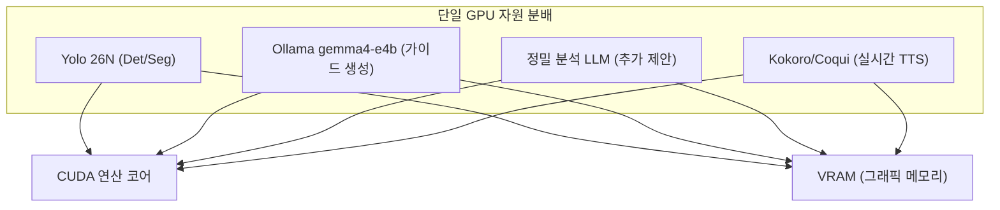
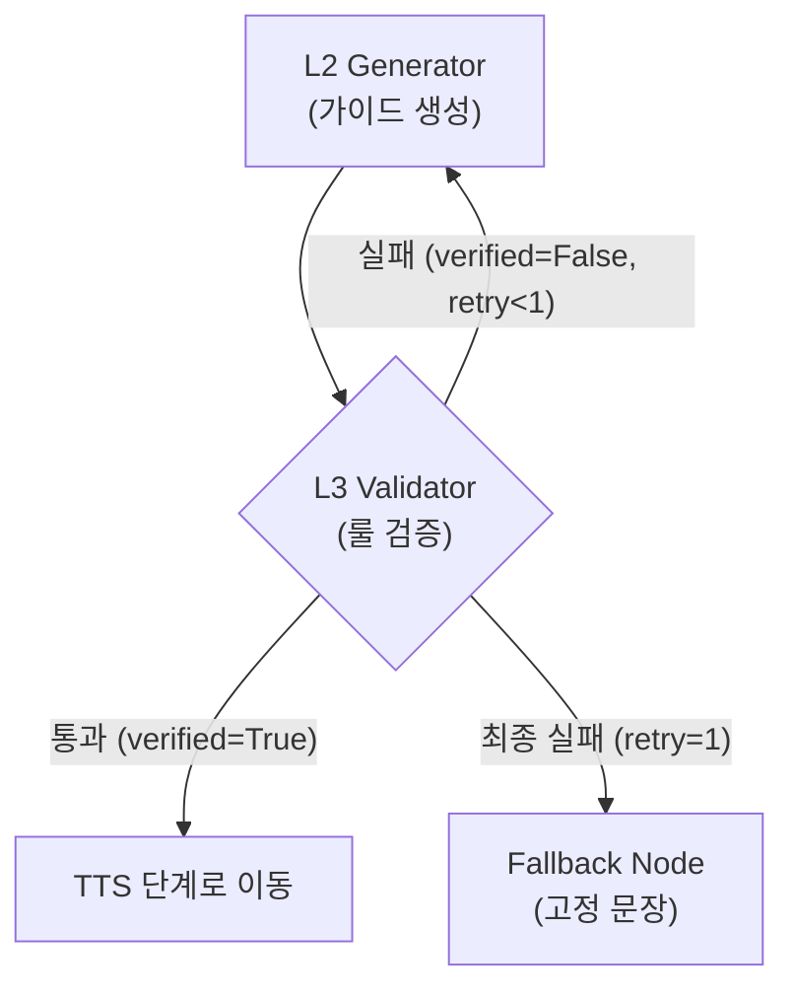

> **작성일**: 2026-06-28
> **버전**: v1.0.0

# 6단계 오케스트레이션 내 정밀 분석 LLM 추가에 따른 지연 시간 영향도 분석

본 문서는 Minchodan 프로젝트의 **6단계 종합 회피 가이드 생성(LangGraph)** 과정에서, 추론 LLM의 결과를 보다 정밀하게 검증/분석하기 위해 추가적인 LLM(정밀 분석 LLM)을 도입할 경우 발생하는 지연 시간(Latency) 영향과 하드웨어 자원 상태를 분석하고, 이에 대한 대안 아키텍처를 제안합니다.

---

## 1. 지연 시간(Latency) 영향 평가

결론부터 말씀드리면, 6단계 파이프라인 내에 정밀 분석을 위한 LLM을 추가적으로 두는 직렬(Sequential) 구성은 **인지 경로의 실시간 성능 목표에 매우 심각한 지장을 초래**합니다.

### 1.1 직렬 LLM 호출에 따른 지연 누적
현재 인지 경로의 종단 지연 목표는 **1~2Hz (500ms ~ 1000ms)**의 주기성 확보입니다.

| 컴포넌트 | 지연 시간 예산 (기존) | 정밀 분석 LLM 추가 시 예상 지연 |
| :--- | :--- | :--- |
| **3단계 Detection/Seg 추론** | < 80ms | < 80ms |
| **5단계 RAG 검색** | < 50ms | < 50ms |
| **6단계 L2 L2 Generator (gemma4-e4b)** | 300ms ~ 700ms | 300ms ~ 700ms |
| **6단계 정밀 분석 LLM (추가)** | **없음 (0ms)** | **300ms ~ 700ms (추가)** |
| **7단계 실시간 TTS 합성** | 200ms ~ 400ms | 200ms ~ 400ms |
| **총 누적 지연 시간** | **약 630ms ~ 1230ms** | **약 930ms ~ 1930ms** |

* 로컬 LLM(gemma4-e4b)의 1회 비동기 호출(`ainvoke`)은 GPU 사양에 따라 보통 수백 ms가 소요됩니다.
* 두 개의 LLM을 직렬로 배치하게 되면, LLM 추론 지연이 고스란히 두 배로 증가하여 전체 인지 경로 주기가 1Hz 미만(1.5초 이상)으로 늘어납니다. 이는 시각장애인이 보행 중 실시간 가이드를 받기에 너무 느린 반응 속도입니다.

---

## 2. 하드웨어 자원(VRAM 및 연산) 경합

Minchodan 서버는 단일 GPU 환경(CUDA)에서 다수의 무거운 모델들을 동시에 구동합니다.



1. **VRAM 고갈 위험**: gemma4-e4b 모델 하나만 로드해도 약 2.5GB의 VRAM이 필요합니다. 여기에 또 다른 분석용 LLM을 로드하거나 동시 실행할 경우, VRAM 한계를 초과하여 CPU 폴백(Fallback)이 일어나거나 OOM(Out of Memory) 에러가 발생할 수 있습니다.
2. **CUDA 연산 병목**: 여러 LLM과 YOLOv8, TTS 합성 모델이 동일한 CUDA 스트림을 공유하여 연산하기 때문에, 정밀 분석 LLM이 실행되는 동안 다른 실시간 파이프라인의 추론 지연이 동반 상승하게 됩니다.

---

## 3. LangGraph 가드레일(L3)과의 상호작용

현재 설계된 6단계 LangGraph는 다음과 같이 루프 백(Retry) 구조를 가지고 있습니다.



* L3 검증 노드에서 규칙(길이 20자 이하, 방향 키워드 포함 등)을 만족하지 못하면 L2가 최대 1회 재수행됩니다.
* 만약 정밀 분석 LLM이 L3의 검증 역할을 대체하거나 가이드 생성 이후에 붙게 된다면, L2 재시도 루프와 결합되어 **최악의 경우 3~4회의 LLM 추론이 직렬로 발생**할 수 있으며, 이 경우 지연 시간은 수 초(3초 이상)에 달하게 됩니다.

---

## 4. 권장 대안 아키텍처

안전성과 실시간 성능을 모두 확보하기 위해, 추가 LLM 도입 대신 아래의 4가지 대안을 권장합니다.

### 4.1 대안 1: 파이썬 룰 기반 검증 고도화 (현재 방식 유지)
* **내용**: LLM 대신 정규표현식(Regex) 및 텍스트 파싱을 기반으로 한 Python 함수(L3 Validator)를 고도화합니다.
* **장점**: 실행 지연 시간이 거의 제로(<1ms)에 수렴하며 VRAM을 차지하지 않습니다.

### 4.2 대안 2: 구조화된 출력 (Structured Output / JSON 모드) 적용
* **내용**: LLM(L2) 호출 시 프롬프트 튜닝이나 Ollama의 JSON 모드를 활용하여 처음부터 구조화된 형태로 응답을 강제합니다.
* **예시**:
  ```json
  {
    "guidance_text": "우측으로 피하세요",
    "direction": "우",
    "safety_score": 0.95
  }
  ```
* **장점**: 단 1회의 LLM 추론으로 안전성 자가 진단 및 가이드 문장을 한꺼번에 받아볼 수 있어, 추가 분석 LLM이 필요 없습니다.

### 4.3 대안 3: 비동기 백그라운드 품질 분석 (Offline Evaluation)
* **내용**: 실시간 추론 스트림(인지 경로)에서는 1차 LLM 결과만 빠르게 단말로 내보내고, 해당 입력 데이터와 생성 결과는 Redis/Log에 저장합니다. 이후 백그라운드 프로세스나 오프라인 배치에서 정밀 분석 LLM을 돌려 생성 품질을 평가(LLM-as-a-Judge)하고, 이 결과를 바탕으로 향후 프롬프트 및 RAG 데이터를 사후 튜닝합니다.
* **장점**: 시각장애인 보행 지연에 전혀 영향을 주지 않으면서 생성 품질의 지속적인 개선이 가능합니다.

### 4.4 대안 4: 고속 상용 LLM 핫스왑 (gpt-4o-mini)
* **내용**: 지연 단축 및 높은 정확도의 검증이 동시에 꼭 필요하다면, 로컬 Ollama 모델 대신 API 응답 속도가 현저히 빠른 클라우드 기반의 `gpt-4o-mini` 모델을 사용하도록 6단계 `LLMClientFactory`의 우선순위를 조정합니다.
* **장점**: 로컬 GPU의 VRAM 및 연산 부담이 없으며 비교적 빠른 응답 속도를 얻을 수 있습니다.
