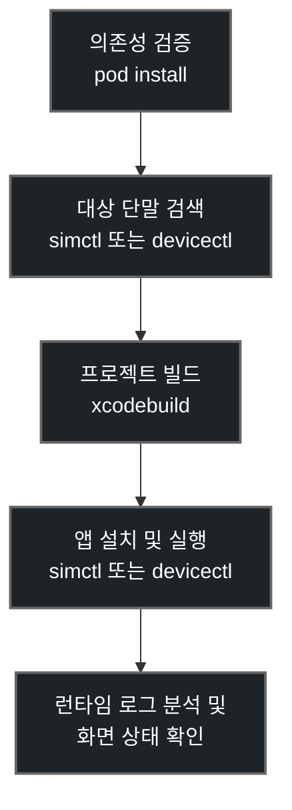

# Xcode MCP 설정 가이드

> **작성일**: 2026-07-11
> **버전**: v1.0.0
> **원본**: `.vscode/xcode_mcp_setup_guide.md`
> **문서 목적**: 개인 Mac 절대경로, 단말 식별자, 로컬 계정 정보를 제거한 팀 공유용 Xcode MCP 설정 가이드입니다.

---

## 1. Xcode MCP 개요

**xcodebuildmcp**는 AI 에이전트가 macOS 환경에서 Xcode Command Line Tools와 iOS 시뮬레이터 또는 실기기를 제어할 수 있도록 돕는 **Model Context Protocol (MCP)** 서버입니다. 이 연동을 사용하면 에이전트가 소스코드 수정, 빌드, 앱 설치, 실행, Metro 번들러 연동, 콘솔 로그 분석까지 iOS 앱 개발 반복 작업을 이어서 수행할 수 있습니다.

---

## 2. 사전 준비 사항

Xcode MCP를 사용하기 전 로컬 Mac 환경에 다음 도구가 준비되어 있어야 합니다.

| **구분** | **필수 요구사항** | **확인 및 준비 명령** |
| :--- | :--- | :--- |
| **Xcode CLI** | **Xcode Command Line Tools** 및 Xcode 설치 | `xcode-select --install` |
| **CocoaPods** | CocoaPods 설치 및 iOS 의존성 동기화 | `cd client/ios && pod install` |
| **Node.js** | Node.js와 npm 사용 가능 상태 | `node -v` 및 `npm -v` |
| **시뮬레이터** | 사용 가능한 iOS 시뮬레이터 확보 | `xcrun simctl list devices available` |
| **실기기** | 케이블 연결, 신뢰 승인, 개발자 모드 활성화 | `xcrun devicectl list devices` |

---

## 3. 로컬 설정 파일

`xcodebuildmcp` 서버는 프로젝트 루트의 `.xcodebuildmcp/config.yaml` 설정 파일을 참조할 수 있습니다. 이 파일에는 개인 Mac 경로와 단말 식별자가 들어갈 수 있으므로, 공유 커밋 전에는 실제 값을 placeholder로 복구해야 합니다.

### 설정 필드

| **필드명** | **설명** | **공유 문서용 표기** |
| :--- | :--- | :--- |
| **workspacePath** | Xcode 작업 공간 `.xcworkspace`의 절대 경로 | `<PROJECT_ROOT>/client/ios/Minchodan.xcworkspace` |
| **scheme** | 빌드할 Xcode 타깃 스키마 이름 | `Minchodan` |
| **deviceId** | 실행 대상 iOS 시뮬레이터 또는 실기기 식별자 | `<IOS_SIMULATOR_OR_DEVICE_ID>` |
| **platform** | 빌드 및 실행 대상 플랫폼 | `iOS` 또는 `iOS Simulator` |
| **bundleId** | Xcode target의 번들 식별자 | `<IOS_BUNDLE_ID>` |

### 예시

```yaml
schemaVersion: 1

sessionDefaults:
  workspacePath: "<PROJECT_ROOT>/client/ios/Minchodan.xcworkspace"
  scheme: Minchodan
  deviceId: "<IOS_SIMULATOR_OR_DEVICE_ID>"
  platform: iOS
  bundleId: "<IOS_BUNDLE_ID>"
```

> [!WARNING]
> 개인 홈 디렉터리 절대경로, Apple Team ID, 실제 단말 UDID, CoreDevice Identifier, Apple ID, provisioning profile 식별자는 공유 문서와 커밋에 그대로 남기지 않습니다.

---

## 4. MCP 클라이언트 연동 설정

프로젝트 루트의 `.mcp.json` 또는 사용하는 MCP 클라이언트 설정에 다음 형태로 `xcodebuildmcp` 서버를 등록합니다.

```json
{
  "mcpServers": {
    "xcodebuildmcp": {
      "type": "stdio",
      "command": "npx",
      "args": [
        "-y",
        "xcodebuildmcp@latest",
        "mcp"
      ],
      "env": {
        "XCODEBUILDMCP_ENABLED_WORKFLOWS": "simulator,device,macos,debugging,ui-automation,swiftpm,project-scaffolding"
      }
    }
  }
}
```

### 클라이언트별 등록 기준

| **클라이언트** | **설정 위치** | **입력값** |
| :--- | :--- | :--- |
| **Cursor 또는 Cline** | MCP 설정 화면 | 이름 `xcodebuildmcp`, 명령 `npx`, 인자 `-y xcodebuildmcp@latest mcp` |
| **Claude Desktop** | `<CLAUDE_CONFIG_PATH>` | 위 JSON의 `mcpServers.xcodebuildmcp` 항목 |
| **기타 MCP Client** | 해당 클라이언트의 MCP 서버 설정 | stdio 서버로 `npx -y xcodebuildmcp@latest mcp` 등록 |

---

## 5. 기본 워크플로우

Xcode MCP 연동 후 에이전트는 다음 흐름으로 iOS 빌드 및 실행을 수행합니다.



---

## 6. 주요 MCP 도구 예시

| **도구명** | **주요 역할** |
| :--- | :--- |
| **build_run_simulator** | 설정된 시뮬레이터 대상으로 Xcode 빌드 및 앱 실행 |
| **build_run_device** | 연결된 실기기 대상으로 빌드 및 앱 실행 |
| **launch_app_device** | 실기기에 설치된 `<IOS_BUNDLE_ID>` 앱 실행 |
| **launch_app_simulator** | 시뮬레이터에 설치된 `<IOS_BUNDLE_ID>` 앱 실행 |
| **screenshot_simulator** | 시뮬레이터 화면 캡처 및 렌더링 확인 |

---

## 7. 오동작 대처 기준

| **증상** | **가능 원인** | **우선 조치** |
| :--- | :--- | :--- |
| **Metro 번들 오류** | Metro dev server 미실행 | `cd client && npm run start -- --clear` |
| **실기기 실행 거부** | 단말 잠금 또는 신뢰 승인 누락 | iPhone 잠금 해제, Mac 신뢰 승인 후 재시도 |
| **CocoaPods 불일치** | Podfile.lock과 Pods 상태 불일치 | `cd client/ios && pod install` |
| **시뮬레이터 아키텍처 충돌** | Apple Silicon 환경의 Pods 설정 문제 | Podfile `post_install`, `EXCLUDED_ARCHS` 확인 |
| **bundle id 실행 실패** | 설정 파일의 `bundleId`와 Xcode target 값 불일치 | Xcode target의 `PRODUCT_BUNDLE_IDENTIFIER` 확인 |

---

## 8. 커밋 전 점검

공유 커밋 전에는 다음 명령으로 개인 로컬 값이 남아 있는지 확인합니다.

```bash
rg -n "/Users/|file:///|deviceId:|DEVELOPMENT_TEAM|Apple Development|CoreDevice|UDID|<실제 단말명>" .xcodebuildmcp docs client/ios
git diff --check
```

| **점검 항목** | **공유 문서 기준** |
| :--- | :--- |
| **Mac 절대경로** | `<PROJECT_ROOT>` 또는 프로젝트 상대경로로 표기 |
| **단말 식별자** | `<IOS_SIMULATOR_OR_DEVICE_ID>`로 표기 |
| **bundle id** | 실제 값이 필요한 내부 설정 파일 외 문서에서는 `<IOS_BUNDLE_ID>`로 표기 |
| **Apple 계정 및 Team** | 실제 계정명, Team ID, 인증서명 제거 |
