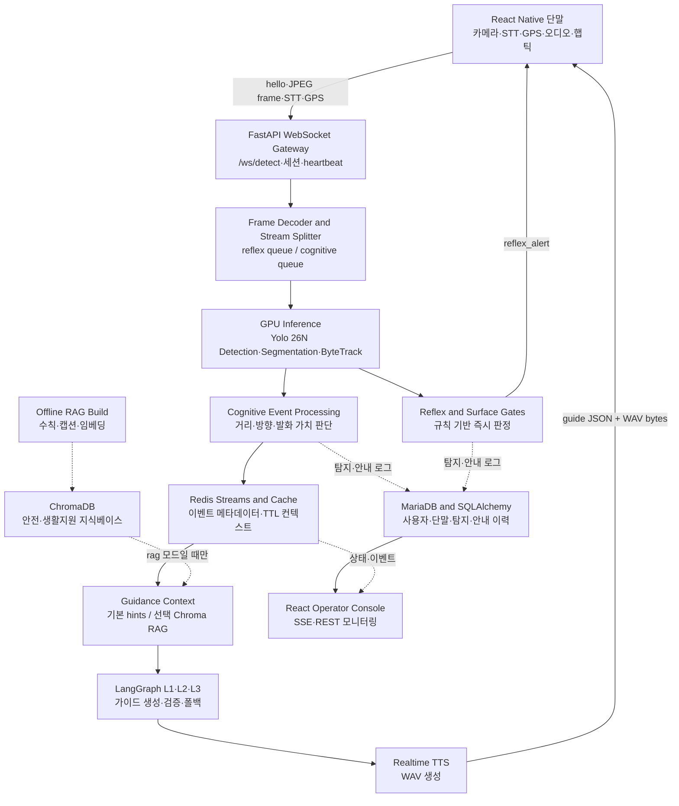

<!-- | docs/mjy_Project_Reports/MJY_project_report.md | -->

# Gildang 프로젝트 보고서

> **작성일**: 2026-07-27
> **버전**: v0.3.0
> **작성 범위**: 질문 양식의 **1~6번 전체 항목**
> **작성 기준**: 저장소의 현재 소스 코드·구성 파일과 설계 문서를 대조하였습니다. 실행하지 않은 기능은 실행 완료로 표현하지 않았습니다.

---

## 1. 프로젝트 개요

### 1.1 프로젝트명·주제·개발 목적

| 항목 | 내용 |
| --- | --- |
| **프로젝트명** | **Gildang(길댕) 스마트 가이드독 AI 플랫폼** |
| **프로젝트 주제** | 스마트폰 카메라 영상과 AI 객체·노면 인식 결과를 이용하여, 시각장애인의 보행 중 위험을 음성·햅틱으로 안내하는 실시간 보행 보조 시스템입니다. |
| **개발 목적** | 사용자가 화면을 보지 않아도 전방 장애물과 위험 노면을 빠르게 인지하고 회피할 수 있도록 돕습니다. 동시에 운영자는 별도 관제 화면에서 세션, 탐지, 안내 이력, 지연 시간을 확인할 수 있도록 구성합니다. |
| **핵심 설계 원칙** | 안전성이 필요한 경보와 설명이 필요한 안내를 하나의 처리 체인에 넣지 않고, **반사 경로**와 **인지 경로**로 분리합니다. 반사 경로는 LLM·RAG·실시간 TTS를 거치지 않는 즉시 경보용이고, 인지 경로는 탐지 맥락을 바탕으로 짧은 회피 안내를 생성하는 상세 안내용입니다. |
| **시스템 분업** | 스마트폰은 카메라 캡처와 음성·햅틱 재생을 맡는 thin client이고, FastAPI 기반 GPU 서버는 프레임 해석, 위험 판단, 안내 생성, 데이터 기록을 맡습니다. React 기반 운영자 콘솔은 사용자가 보는 앱이 아니라 시스템 상태를 관찰하는 별도 화면입니다. |

본 절과 다음 절은 **팀 전체 시스템의 구조와 동작**을 설명합니다. 특정 팀원이 직접 구현한 기능이나 개인 기여는 여기서 귀속시키지 않으며, 질문 양식의 3번 ‘본인의 담당 역할’에서 별도로 구분하여 작성해야 합니다.

### 1.2 해결하려는 문제와 사용 시나리오

시각장애인 보행에서는 위험을 발견한 뒤 긴 설명을 듣는 것보다, 가까운 장애물에 먼저 반응할 수 있어야 합니다. 반대로 중간 거리의 장애물이나 노면 변화는 위험의 위치·방향·회피 방법을 짧게 설명해야 합니다. Gildang은 이 차이를 다음과 같이 처리합니다.

| 사용 상황 | 입력 | 서버 처리 | 사용자 출력 |
| --- | --- | --- | --- |
| **즉시 회피가 필요한 근접 위험** | 후면 카메라의 반사 스트림 프레임 | 객체 탐지 결과와 노면 분할 결과를 규칙 기반 Gate로 판정합니다. 고위험이면 인지 생성 모듈을 우회합니다. | 우선순위가 높은 `reflex_alert`와 방향 정보에 따라 경고음·반사 클립·햅틱을 제공합니다. |
| **상세 안내가 필요한 중간 위험** | 인지 스트림 프레임 | 객체·노면 탐지, 추적, 거리·방향·발화 가치 판단 후 인메모리 회피 힌트 또는 선택적 RAG 검색을 적용합니다. 이후 LangGraph가 짧은 한국어 안내문을 검증합니다. | `guide` 메시지의 안내문과 WAV 오디오를 재생하여 방향과 회피 행동을 안내합니다. |
| **음성 명령·길안내가 필요한 경우** | 단말의 STT 오디오 또는 GPS 위치 | STT 전사 결과를 내비게이션/LLM 브리지로 보내고, GPS 갱신 시 내비게이션 상태를 평가합니다. | 기존 `guide` 형식으로 음성 안내를 재생하고, 데모·운영 화면에서는 지도 정보도 표시할 수 있습니다. |
| **운영·사후 확인이 필요한 경우** | 서버 이벤트, 탐지·안내 로그, 세션 상태 | FastAPI의 모니터링 API와 데이터 저장 계층이 이벤트·지연·이력을 관리합니다. | 운영자 콘솔에서 실시간 피드, 지연 요약, 위험 이벤트, 안내 이력, 단말 상태를 확인합니다. |

### 1.3 주요 사용자와 활용 대상

| 구분 | 사용자·대상 | 활용 방식 | 필요한 결과 |
| --- | --- | --- | --- |
| **주 사용자** | 시각장애인 보행자 | 스마트폰을 소지하고 후면 카메라를 보행 방향으로 사용합니다. 화면 조작보다 음성·햅틱 피드백을 중심으로 상호작용합니다. | 위험의 빠른 인지, 방향성 있는 경보, 짧고 이해하기 쉬운 회피 안내 |
| **보조 사용자** | 보호자, 시연 진행자, 테스트 담당자 | 단말 연결 상태와 탐지·안내 결과를 확인하고, 시연 중 동작을 점검합니다. | 단말이 어떤 프레임을 보냈고 어떤 경보·안내가 발생했는지에 대한 확인 수단 |
| **운영 사용자** | 관리자·운영자 | React 관제 콘솔에서 회원, 세션, 탐지 이력, 지연, 시스템 지표를 모니터링합니다. | 실시간 상태와 사후 로그를 통한 품질 점검·오탐 표시·운영 판단 |
| **개발·학습 사용자** | 프로젝트 팀원 | 모델 학습, RAG 지식베이스 구축, 통합 테스트, 안전 규칙 개선을 수행합니다. | 모듈별 교체 가능 구조, 테스트 가능한 데이터 계약, 모델·문서·운영 근거 |

### 1.4 주요 기능

| 기능 | 입력 | 핵심 처리 | 출력 | 구현 근거 |
| --- | --- | --- | --- | --- |
| **실시간 단말 연결** | 단말의 `hello`, 프레임 메타데이터·바이너리, heartbeat | `/ws/detect`에서 인증·세션·heartbeat를 관리하고 프레임 수신 확인(`ack`)을 보냅니다. | 연결 상태, `auth_ok`, `ack`, 오류 메시지 | [`server/api/ws_router.py`](../../server/api/ws_router.py), [`server/api/session_manager.py`](../../server/api/session_manager.py) |
| **이중 카메라 스트림 처리** | JPEG 프레임과 `stream=reflex/cognitive` 메타데이터 | 프레임을 디코딩한 뒤 반사·인지 `asyncio.Queue`로 분기합니다. 큐가 밀리면 신선도가 낮은 프레임을 처리하지 않도록 제어합니다. | 각 경로에 맞는 비동기 프레임 전달 | [`server/capture/frame_decoder.py`](../../server/capture/frame_decoder.py), [`server/capture/stream_splitter.py`](../../server/capture/stream_splitter.py) |
| **장애물·노면 인식과 추적** | 디코딩된 프레임 | Yolo 26N 객체 탐지와 세그멘테이션, ByteTrack, 거리·방향 규칙을 조합해 탐지 결과를 만듭니다. | 객체 라벨·신뢰도·bbox·track ID·거리 구역·노면 정보 | [`server/detection/detection_pipeline.py`](../../server/detection/detection_pipeline.py), [`server/detection/yolo_detector.py`](../../server/detection/yolo_detector.py), [`server/detection/yolo_segmentor.py`](../../server/detection/yolo_segmentor.py) |
| **반사 경보** | 근접 객체 또는 위험 노면 | Reflex Gate·Surface Gate가 규칙으로 위험을 판정합니다. 이 경로는 RAG, LangGraph, 실시간 TTS 생성을 호출하지 않습니다. | 고우선 `reflex_alert`, 단말의 경고음·햅틱·반사 음성 처리 | [`server/detection/gates/reflex_gate.py`](../../server/detection/gates/reflex_gate.py), [`server/detection/gates/surface_gate.py`](../../server/detection/gates/surface_gate.py), [`client/src/services/audioEngine.ts`](../../client/src/services/audioEngine.ts), [`client/src/services/hapticEngine.ts`](../../client/src/services/hapticEngine.ts) |
| **인지 회피 안내** | 중·저위험 탐지 이벤트 | 기본값인 인메모리 회피 힌트를 사용하거나 Chroma 검색 모드로 수칙을 가져온 뒤, L1 분류·L2 생성·L3 검증으로 안내문을 만듭니다. | 방향·행동을 포함한 짧은 `guide` 메시지와 WAV 음성 | [`server/detection/consumer.py`](../../server/detection/consumer.py), [`server/rag/guidance_hints.py`](../../server/rag/guidance_hints.py), [`server/orchestration/graph.py`](../../server/orchestration/graph.py) |
| **음성 명령과 보행 길안내** | 음성 파일, GPS 좌표 | faster-whisper STT, 명령·LLM 브리지, TMAP 기반 내비게이션 상태기를 통해 요청을 해석합니다. | 음성 안내와 운영자/데모용 경로 정보 | [`server/stt/stt_service.py`](../../server/stt/stt_service.py), [`server/stt/stt_to_llm_bridge.py`](../../server/stt/stt_to_llm_bridge.py), [`server/navigation/manager.py`](../../server/navigation/manager.py) |
| **운영자 관제와 이력 관리** | 서버 이벤트·저장된 로그 | 인증된 콘솔이 SSE/실시간 피드를 구독하고 REST로 탐지·안내 이력을 조회합니다. | 대시보드, 위험 이벤트, 지연 요약, 단말 상태, 이력 표 | [`console/src/pages/DashboardPage.tsx`](../../console/src/pages/DashboardPage.tsx), [`console/src/api/useMonitorStream.ts`](../../console/src/api/useMonitorStream.ts), [`server/services/detection_guidance_log_service.py`](../../server/services/detection_guidance_log_service.py) |

---

## 2. 프로젝트 전체 구조

### 2.1 전체 아키텍처와 경로 분리

Gildang의 구조는 ‘모바일 입력·서버 판단·모바일 피드백’이라는 공통 흐름을 가지지만, 위험도에 따라 결과를 내는 경로가 달라집니다. 다음 그림에서 실선은 온라인 요청 흐름이고, 점선은 오프라인 지식베이스 구축 또는 운영 관측 흐름입니다.

| 구조 원칙 | 적용 방식 | 의미 |
| --- | --- | --- |
| **반사·인지의 물리적 분리** | 프레임을 별도 큐로 나누고 `DetectionConsumer`가 반사 알림은 WebSocket 고우선 채널, 인지 이벤트는 Redis 기반 처리로 보냅니다. | LLM 응답이나 벡터 검색 지연이 즉시 위험 경보를 늦추지 않도록 합니다. |
| **단말과 추론 서버의 역할 분리** | 단말은 카메라·오디오·햅틱·GPS·STT 녹음을 담당하고, 서버는 프레임 해석과 AI 판단을 담당합니다. | 모바일 자원 사용을 줄이고 모델·규칙·지식베이스를 서버에서 관리합니다. |
| **동기 응답과 비동기 작업의 분리** | 프레임 수신 확인은 빠르게 `ack`를 보내고, 탐지·로그 저장·관제 갱신은 비동기 큐와 태스크로 처리합니다. | 카메라 전송 흐름이 로그 저장이나 관제 화면의 처리 때문에 막히지 않도록 합니다. |
| **안전한 폴백** | 빈 프레임·디코딩 오류·외부 모델/DB 오류 시 파이프라인 중단 대신 빈 결과·규칙 기반 힌트·고정 안내로 우회하도록 각 모듈을 구성합니다. | 보행 보조 서비스가 일부 의존성 오류로 전체 정지하는 것을 줄입니다. |

### 2.2 계층별 기술 구성

| 계층 | 현재 사용 기술·도구 | 담당 역할 | 소스·설정 근거 |
| --- | --- | --- | --- |
| **모바일 프론트엔드** | React Native, Expo, TypeScript, `react-native-vision-camera`, `expo-audio`, `expo-haptics`, `expo-location`, `expo-speech` | 후면 카메라 프레임 캡처, WebSocket 연결, 반사 알림과 인지 안내 재생, 햅틱, 위치·음성 입력을 담당합니다. | [`client/package.json`](../../client/package.json), [`client/src/components/CameraView.tsx`](../../client/src/components/CameraView.tsx), [`client/src/hooks/useWebSocket.ts`](../../client/src/hooks/useWebSocket.ts) |
| **모바일 네이티브 확장** | Swift/Objective-C++, iOS AudioSession·LiDAR·CoreML 브리지, Android용 TFLite 선택 모듈 | iOS 오디오 세션·거리 검증·프레임 프로세서와 플랫폼별 로컬 추론 인터페이스를 제공합니다. 단, 저장소의 기본 서버 경로와 별개인 로컬/하이브리드 확장 모듈은 기기별 빌드·실측 검증이 필요합니다. | [`client/ios/`](../../client/ios), [`client/src/inference/localDetectorSelect.ios.ts`](../../client/src/inference/localDetectorSelect.ios.ts), [`client/src/inference/localDetectorSelect.android.ts`](../../client/src/inference/localDetectorSelect.android.ts) |
| **API·실시간 백엔드** | Python 3.13, FastAPI, uvicorn, asyncio, WebSocket, REST, SSE, Pydantic | `/ws/detect` 단말 세션과 프레임 수신, REST 관리 API, `/api/v1/monitor/stream` 관제 스트림, STT·사용자·관리자 라우터를 제공합니다. | [`server/main.py`](../../server/main.py), [`server/api/ws_router.py`](../../server/api/ws_router.py), [`server/api/monitor.py`](../../server/api/monitor.py) |
| **영상 AI·위험 판단** | Ultralytics Yolo 26N Object Detection, Yolo 26N Segmentation, OpenCV, ByteTrack, 규칙 기반 Gate | 객체 bbox와 노면 마스크를 해석하고, 추적·방향·거리 구역을 계산한 뒤 반사 또는 인지 경로를 결정합니다. | [`server/detection/`](../../server/detection), [`server/models/yolo26n/`](../../server/models/yolo26n), [`training/`](../../training) |
| **인지 안내·LLM** | LangGraph, `SimpleOllamaClient`, 선택 `SimpleOpenAIClient`, Ollama `gemma4:e4b` | L1 위험도 분류, L2 한국어 안내 생성, L3 길이·방향 검증, 실패 시 폴백을 담당합니다. | [`server/orchestration/graph.py`](../../server/orchestration/graph.py), [`server/orchestration/llm_client_factory.py`](../../server/orchestration/llm_client_factory.py) |
| **RAG·지식 데이터** | ChromaDB, LangChain Chroma 래퍼, Ollama `nomic-embed-text`, Gemini 2.5 Flash Lite 캡셔닝, 인메모리 힌트 | 안전 수칙을 오프라인에 임베딩하고, 필요 시 의미 검색에 사용합니다. 현재 인지 경로의 기본 컨텍스트는 벡터 검색이 아닌 `guidance_hints.py`의 짧은 인메모리 힌트이며, Chroma는 `GUIDANCE_CONTEXT_MODE=rag`일 때 선택적으로 사용합니다. | [`server/rag/`](../../server/rag), [`scripts/build_safety_db.py`](../../scripts/build_safety_db.py), [`scripts/build_convenience_db.py`](../../scripts/build_convenience_db.py) |
| **데이터베이스·메시지 버스** | MariaDB 11.4, SQLAlchemy 비동기 ORM, Redis 7, Redis Streams, TTL 캐시 | 사용자·관리자·단말·탐지/안내 이력과 거리 검증 샘플을 관계형 데이터로 관리합니다. Redis에는 프레임 원본 대신 이벤트 메타데이터와 짧은 수명의 추적 컨텍스트를 둡니다. | [`server/db/models.py`](../../server/db/models.py), [`server/bus/`](../../server/bus), [`server/services/detection_guidance_log_service.py`](../../server/services/detection_guidance_log_service.py) |
| **음성·접근성 출력** | Supertonic 3 기본 TTS, Piper/pyttsx3/edge-tts 대체 엔진, WAV, `expo-audio`, `expo-haptics` | 인지 경로의 문장을 WAV로 합성해 전송하고, 단말은 안내 재생·반사 경보·햅틱 피드백을 우선순위에 맞게 처리합니다. | [`server/tts/`](../../server/tts), [`client/src/services/audioEngine.ts`](../../client/src/services/audioEngine.ts), [`client/src/services/hapticEngine.ts`](../../client/src/services/hapticEngine.ts) |
| **운영자 콘솔** | React, Vite, TypeScript, SSE, REST | 로그인한 운영자가 관제 대시보드, 회원 관리, 탐지·안내 로그, 위험 이벤트, 지연과 오디오 미러를 확인합니다. | [`console/package.json`](../../console/package.json), [`console/src/`](../../console/src) |
| **배포·개발 환경** | Docker Compose, Dockerfile, macOS/Linux/Windows 실행 스크립트, 호스트 Ollama | FastAPI 서버·Redis·MariaDB·운영자 콘솔을 컨테이너 단위로 구성합니다. Ollama는 Compose 컨테이너가 아니라 호스트 프로세스로 두고 서버가 접속합니다. | [`docker/docker-compose.macos.yml`](../../docker/docker-compose.macos.yml), [`docker/docker-compose.yml`](../../docker/docker-compose.yml), [`docker/Dockerfile`](../../docker/Dockerfile) |

### 2.3 저장소의 물리적 모듈 구조

| 경로 | 구성 요소 | 시스템 안에서의 역할 |
| --- | --- | --- |
| `client/` | React Native 앱, `src/components`, `hooks`, `services`, `inference`, `ios/` | 단말 카메라·연결·GPS·STT·오디오·햅틱과 iOS 네이티브 브리지를 포함합니다. |
| `server/api/` | WebSocket, 인증, 세션, heartbeat, 사용자·관리자·STT·모니터 라우터 | 외부 단말·콘솔 요청의 진입점이며 요청 검증과 연결 생명주기를 담당합니다. |
| `server/capture/` | `frame_decoder.py`, `stream_splitter.py` | JPEG/기존 base64 프레임을 복원하고 반사·인지 처리 큐로 나눕니다. |
| `server/detection/` | detector·segmentor·ByteTrack·distance policy·gates | AI 모델 실행, 추적, 거리·방향 계산, 반사/인지 라우팅을 담당합니다. |
| `server/orchestration/` | LangGraph, L1/L2/L3 노드, LLM factory | 중·저위험 상황의 회피 문장을 생성·검증하고 대체 모델/고정 문장으로 폴백합니다. |
| `server/rag/` | 빌드·retriever·embedding/vector DB factory·hints·convenience RAG | 보행 안전 수칙과 생활지원 지식의 구축·검색·기본 힌트 제공을 담당합니다. |
| `server/tts/`, `server/stt/`, `server/navigation/` | TTS, faster-whisper STT, TMAP 보행 길안내 | 청각 입출력과 목적지·경로 안내라는 보조 상호작용을 담당합니다. |
| `server/db/`, `server/services/`, `server/bus/` | ORM·마이그레이션·서비스·Redis producer/client | 데이터 영속화, 탐지/안내 로그, 원격 프레임 저장, 이벤트 발행을 담당합니다. |
| `console/` | React 관제 화면, API hooks, 대시보드 구성 요소 | 운영자가 실시간·사후 데이터를 보는 별도 프론트엔드입니다. |
| `data/`, `training/`, `scripts/` | 수칙 JSON·RAG 저장소, 모델 학습 설정·학습 스크립트, DB·클립 빌드 도구 | 온라인 서비스와 분리된 데이터 준비, 학습, 지식베이스·반사 음성 자산 빌드를 담당합니다. |
| `docker/`, `tests/`, `docs/` | Compose/Dockerfile, 단계별 테스트, 설계·운영·검증 문서 | 재현 가능한 실행 환경, 기능 검증 기준, 팀 공통 설계 근거를 제공합니다. |

### 2.4 데이터와 사용자 요청의 처리 흐름

#### 2.4.1 공통 연결과 프레임 수신

| 순서 | 입력 | 처리 | 출력·다음 단계 |
| --- | --- | --- | --- |
| **1. 연결 수립** | 단말이 `/ws/detect`에 접속하고 `hello`에 디바이스 식별·인증 정보를 보냅니다. | 서버는 WebSocket을 수락하고 세션과 heartbeat를 관리합니다. | `welcome`, `auth_ok`, 주기적 heartbeat가 단말로 전송됩니다. |
| **2. 프레임 전송** | 단말 카메라가 반사 또는 인지 스트림의 JPEG 프레임과 `event_id`, `frame_id`, `stream`, `transport` 메타데이터를 보냅니다. | 서버는 JSON 메타데이터와 바이너리 프레임을 연결해 OpenCV용 이미지로 디코딩합니다. | 수신 결과와 서버 혼잡도는 `ack`로 빠르게 응답하고, 정상 프레임은 Stream Splitter에 전달됩니다. |
| **3. 스트림 분기** | 디코딩된 프레임과 스트림 종류 | `reflex_queue` 또는 `cognitive_queue`에 넣고, Redis에는 프레임 원본이 아니라 식별자·시각·스트림 같은 메타데이터만 발행합니다. | 각 큐의 `DetectionConsumer`가 독립적으로 최신 프레임을 소비합니다. |
| **4. 탐지·분할 공통 처리** | 큐에서 꺼낸 최신 프레임 | 객체 탐지·노면 세그멘테이션·추적·거리·방향 계산을 수행합니다. 디코딩 실패, 무탐지, 일부 모델 오류는 예외 처리하여 전체 연결이 중단되지 않게 합니다. | 객체 목록, 표면 정보, 위험 힌트, 추론 시간, 거리 구역이 이후 경로 판정에 전달됩니다. |

#### 2.4.2 반사 경로: 근접 위험을 먼저 알리는 흐름

| 순서 | 입력 | 처리 | 출력 |
| --- | --- | --- | --- |
| **1. 반사 프레임 입력** | 비교적 높은 빈도의 `reflex` 프레임 | 반사 전용 큐에서 오래된 프레임은 버리고, 최신 프레임의 위험도를 판단합니다. | 즉시 판단 가능한 탐지·노면 결과 |
| **2. 규칙 Gate 판정** | 객체 신뢰도·bbox 위치·연속 hit·거리 구역 또는 노면 클래스·하단 위치 | `ReflexGate`와 `SurfaceGate`가 규칙으로 통과 여부를 정합니다. 이 단계는 생성형 모델 호출을 하지 않습니다. | `ReflexAlert` 또는 위험 해제 이벤트 |
| **3. 고우선 전송** | 경보 ID, 방향, 거리·위험 메타데이터 | `DetectionConsumer`가 연결된 단말에 WebSocket 고우선 메시지로 전송합니다. | `reflex_alert` |
| **4. 단말 피드백** | `reflex_alert` | 단말의 오디오·햅틱 계층이 인지 안내보다 우선하여 경고음/반사 음성과 진동을 처리합니다. | 사용자가 즉시 들을 수 있고 느낄 수 있는 위험 경보 |

이 경로의 핵심은 **‘탐지 결과를 설명 문장으로 바꾸기 전에 먼저 알려야 하는 위험’**을 처리한다는 점입니다. 따라서 Chroma 검색, LangGraph L1·L2·L3, 서버 실시간 TTS 합성은 반사 경로의 선행 조건이 아닙니다.

#### 2.4.3 인지 경로: 맥락을 포함한 회피 안내 흐름

| 순서 | 입력 | 처리 | 출력 |
| --- | --- | --- | --- |
| **1. 인지 이벤트 선별** | `cognitive` 프레임의 객체·노면·거리·방향 결과 | 중·저위험 객체, 보도 이탈, 의미 있는 노면 변화를 선별합니다. 같은 상황의 반복 발화와 너무 멀거나 측면인 저가치 발화는 억제합니다. | 안내가 필요한 인지 이벤트 |
| **2. 컨텍스트 선택** | 객체 라벨·노면 클래스·위험도 | 기본 모드에서는 `guidance_hints.py`의 짧은 수칙 dict에서 힌트를 선택합니다. `GUIDANCE_CONTEXT_MODE=rag`로 설정한 경우에만 ChromaDB에서 유사 수칙을 검색합니다. | `rag_context` 또는 동등한 회피 힌트 |
| **3. 안내문 생성·검증** | 탐지 방향, 거리, 회피 힌트, 위험도 | LangGraph가 L1 분류, L2 문장 생성, L3 길이·방향 검증을 수행합니다. 실패하면 재시도 횟수를 제한하고 고정 폴백 문장을 사용합니다. | 짧은 한국어 회피 문장 |
| **4. TTS·전송** | 최종 안내문 | 서버 TTS가 WAV 바이트를 만들고, 서버는 `guide` JSON 뒤에 바이너리 오디오를 전송합니다. 안내 이력·지연 정보는 비동기로 저장합니다. | 단말 재생용 안내문과 WAV 오디오, 관제·사후 분석용 로그 |
| **5. 관제 반영** | 탐지·안내·지연 이벤트 | 데이터베이스 이력과 모니터링 스트림을 통해 콘솔이 최신 상태를 표시합니다. | 대시보드의 위험 이벤트, 안내 이력, 지연 요약, 단말 상태 |

#### 2.4.4 보조 요청 흐름: STT와 GPS 길안내

| 요청 유형 | 입력 | 처리 | 출력 |
| --- | --- | --- | --- |
| **음성 명령** | 단말이 녹음한 오디오 데이터 | 서버가 파일 크기·형식을 확인하고 faster-whisper로 전사한 뒤, STT-to-LLM 브리지에서 내비게이션·연락처·일반 질의를 분기합니다. | 기존 인지 안내와 동일한 `guide` 형식의 문장·WAV 음성 |
| **GPS 길안내** | 단말의 `realtime_gps` 위치 | `NavigationManager`가 디바이스별 길안내 상태를 평가하고 TMAP 연동 결과를 처리합니다. | 시점에 맞는 길안내 음성과 운영자/데모용 지도 경로 |

### 2.5 데이터 저장과 관제의 연결

| 데이터 종류 | 저장·전달 위치 | 목적 | 유의점 |
| --- | --- | --- | --- |
| **실시간 프레임 메타데이터** | Redis Streams·캐시 | 스트림 상태와 이벤트 연결, 짧은 수명의 추적 컨텍스트 유지 | 대용량 JPEG 원본을 Redis에 직접 저장하지 않고 메타데이터 중심으로 처리합니다. |
| **탐지·안내 이력** | MariaDB의 SQLAlchemy 모델·마이그레이션 | 탐지 객체, 안내문, 경로 유형, 지연, 오탐 표시, 프레임 경로를 사후 점검합니다. | 로그 저장은 단말 경보 전송을 막지 않도록 비동기 처리합니다. |
| **위험 수칙 지식** | `data/`의 JSON·캡션 자료와 ChromaDB persist 저장소 | 안전 수칙·생활지원 문서의 오프라인 구축과 선택적 의미 검색 | 현재 기본 인지 컨텍스트는 Chroma 검색이 아니라 인메모리 힌트입니다. |
| **모델·학습 산출물** | `server/models/yolo26n/`, `training/` | 서버 추론 모델과 탐지·분할 학습 설정을 관리합니다. | 커스텀 학습 가중치, 실제 데이터, 런타임 DB는 배포 환경과 Git 추적 정책을 구분하여 관리합니다. |
| **운영 화면 데이터** | FastAPI REST·SSE와 React 콘솔 상태 | 현재 상태·이력·지연을 운영자에게 표시합니다. | 콘솔의 일부 확장 이벤트는 화면 준비·데모 목적의 계약도 포함하므로, 실제 producer가 있는 이벤트와 시연용 데이터를 구분하여 검증해야 합니다. |

### 2.6 구현 범위와 검증 해석 기준

본 보고서는 저장소에서 확인한 **구조와 코드 연결 관계**를 설명한 것입니다. 특정 장비에서 서버·Docker·Ollama·모델·실기기가 모두 기동되었다는 뜻은 아닙니다. 특히 다음 사항을 구분하여 해석합니다.

| 구분 | 현재 코드에서 확인한 내용 | 이 보고서에서 주장하지 않는 내용 |
| --- | --- | --- |
| **서버 파이프라인** | WebSocket, 큐 분기, 탐지 Consumer, 반사 Gate, 인지 오케스트레이션, TTS/로그 모듈이 소스 트리에 연결되어 있습니다. | 실제 GPU·Redis·MariaDB·Ollama가 현재 이 컴퓨터에서 모두 실행 중이라는 주장 |
| **RAG** | ChromaDB 구축·검색 모듈이 있고, 기본 인지 컨텍스트는 인메모리 hints, RAG는 선택 모드입니다. | 현재 디스크의 ChromaDB에 충분한 실제 임베딩 데이터가 구축되어 있다는 주장 |
| **모바일 로컬 추론** | iOS CoreML·Android TFLite 선택 모듈과 네이티브 브리지가 존재합니다. | 모든 기기에서 온디바이스 반사 추론이 기본 경로로 검증 완료되었다는 주장 |
| **성능 수치** | 코드와 설계 문서에는 목표·계측 필드가 존재합니다. | 현 시점의 종단 지연, 탐지 정확도, RAG hit-rate가 목표를 충족했다는 단정 |

따라서 이후 3번부터의 개인 역할과 4번 세부 구현에서는, 각 담당자가 직접 수정한 파일·실행한 명령·검증 로그·화면 캡처·모델 평가 결과를 이 전체 구조의 해당 단계에 연결하여 제시해야 합니다.

---

## 3. 본인의 담당 역할

### 3.1 팀 내 역할

본인은 **백엔드 데이터·운영 인프라 및 iOS 실기기 통합**을 담당하였습니다. 팀의 객체·노면 탐지와 안내 생성 결과가 실제 단말, 데이터베이스, 중앙 저장소, 운영 환경까지 안전하게 이어지도록 연결·검증하는 역할입니다.

### 3.2 직접 구현·수행한 기능

| 담당 영역 | 입력 | 직접 수행한 처리 | 결과 |
| --- | --- | --- | --- |
| **MariaDB 데이터 모델·로그** | 사용자·단말 정보, 탐지 객체, 안내문, 지연 정보 | SQLAlchemy 모델·스키마·마이그레이션과 환경변수 기반 비동기 MariaDB 연결을 구성하고, 탐지·안내 이력 테이블을 추가했습니다. | 사용자·단말·탐지·안내 이력을 운영자 콘솔과 사후 분석에 사용할 수 있게 되었습니다. |
| **중앙 저장소 연동** | 이벤트 JPEG 프레임, STT 음성 파일 | GPU 서버가 중앙 저장 API로 파일을 전송하고, DB에는 파일 자체가 아니라 저장 경로·상태·형식·크기를 기록하도록 구현했습니다. | 대용량 미디어와 관계형 로그를 분리하여 관리하고, 저장 실패도 이력으로 확인할 수 있게 되었습니다. |
| **iOS LiDAR 거리 검증** | iPhone LiDAR 깊이 샘플, YOLO bbox, 단말 검증 요청 | Swift 기반 Depth Probe 브리지와 단말 화면·WebSocket 보고 흐름을 보정하여 실측 거리와 탐지 거리의 비교 데이터를 남기도록 했습니다. | 모델 거리 판단을 실제 기기 거리로 검증할 수 있는 계측 경로를 마련했습니다. |
| **Docker·Tailscale 운영 연결** | 환경별 DB·미디어 API·Ollama 접속 설정 | Docker Compose, LAN/Tailscale WebSocket 경로, Raspberry Pi demo/test 네트워크 프로필 전환 스크립트를 정비했습니다. | 이미지를 다시 빌드하지 않고 시연 내부망과 외부 테스트망의 접속 대상을 전환할 수 있게 되었습니다. |
| **실기기 음성 UX·보안 보완** | 서버 `guide` 메시지와 WAV 오디오, 네트워크·의존성 설정 | 단말 TTS 폴백과 늦게 도착한 WAV의 중복 재생을 차단하고, 전화번호 발화 문자열을 정규화했습니다. 또한 ngrok 제거와 취약 의존성 정리를 수행했습니다. | 음성 안내가 한 번만 재생되고, 외부 연결 방식과 클라이언트 의존성의 보안 위험을 줄였습니다. |

### 3.3 다른 팀원 작업과의 연결

| 연결 대상 | 본인 작업의 연결 지점 | 협업 결과 |
| --- | --- | --- |
| **객체·노면 탐지 및 위험 판단 모듈** | 탐지 이벤트, 프레임 경로, 거리·지연 정보를 `detection_guidance_logs`에 기록합니다. | 탐지 담당자가 만든 결과를 운영자 콘솔의 이력 조회와 오탐·지연 분석에 활용할 수 있습니다. |
| **React Native 단말 기능** | WebSocket, iOS LiDAR, STT 오디오, 안내 WAV 재생의 실제 기기 연동을 점검·보완합니다. | 단말의 입력과 서버의 탐지·안내 결과가 실기기에서 끊기지 않고 연결됩니다. |
| **운영자 콘솔** | 탐지·안내 로그, 프레임 경로, 지연 정보를 REST·실시간 화면이 읽을 수 있는 형태로 제공합니다. | 운영자는 단말 화면을 직접 보지 않아도 탐지 결과와 시스템 상태를 점검할 수 있습니다. |
| **배포·시연 환경** | Docker, MariaDB, Redis, 호스트 Ollama, Raspberry Pi 미디어 API의 환경 변수를 연결합니다. | 팀원들이 동일한 실행 절차로 내부망 시연과 Tailscale 기반 테스트를 수행할 수 있습니다. |

### 3.4 역할 범위의 구분

본인의 역할은 **탐지·안내 파이프라인을 데이터·기기·운영 환경에 연결하고 검증하는 통합 영역**입니다. 따라서 YOLO 모델 학습 자체, LangGraph 핵심 안내 생성 로직 자체, 운영자 콘솔 전체 화면 디자인을 본인의 단독 구현으로 표현하지 않고, 이 결과들을 저장·전송·실기기에서 검증하는 연결 역할로 구분합니다.

---

## 4. 세부 구현 내용

본 절은 본인이 직접 담당한 ‘데이터 영속화·실기기 검증·음성 안내 안정화’ 기능을 중심으로 작성합니다. 모델 학습이나 LLM 안내문 생성 자체가 아니라, 그 결과가 사용자와 운영 환경에 신뢰성 있게 전달되도록 만든 연결 계층이 구현 범위입니다.

### 4.1 탐지·안내 로그와 중앙 저장소 연동

#### 4.1.1 구현 목표

탐지 결과와 음성 안내는 실시간으로 끝나는 정보가 아니라, 오탐 확인·지연 분석·사용자 지원을 위해 나중에도 조회할 수 있어야 합니다. 그러나 JPEG 프레임과 STT 음성처럼 큰 파일을 관계형 DB에 그대로 저장하면 DB 용량과 조회 성능에 부담이 생깁니다. 이에 따라 **메타데이터는 MariaDB에, 실제 미디어 파일은 중앙 저장 API에** 분리하여 저장하도록 구현했습니다.

#### 4.1.2 입력·처리·출력 흐름

| 단계 | 입력 | 처리 내용 | 출력 |
| --- | --- | --- | --- |
| **1. 이벤트 수집** | `event_id`, 사용자·단말 식별값, 탐지 객체 목록, 스트림 종류, 안내 문장, 단계별 지연 | 탐지 Consumer와 WebSocket 처리부가 이벤트 정보를 수집합니다. | 로그 저장에 필요한 구조화된 이벤트 데이터 |
| **2. 미디어 업로드** | 이벤트 JPEG 또는 STT 오디오 바이트 | `remote_storage_client`가 중앙 저장 API에 HTTP 요청을 보내고, 환경 변수로 읽은 토큰은 서버 내부에서만 사용합니다. | `object_key`, 저장 상태, 형식, 파일 크기, SHA-256 정보 |
| **3. 관계형 로그 저장** | 탐지 결과 JSON, 안내문, 프레임·음성 경로, 지연·디버그 정보 | SQLAlchemy 비동기 세션으로 `detection_guidance_logs`에 저장합니다. 사용자·단말이 삭제되어도 로그는 남도록 외래 키를 `SET NULL` 정책으로 둡니다. | 탐지·안내 이력 레코드 |
| **4. 실패 처리** | 저장 API 미설정, 네트워크 오류, HTTP 오류, 업로드 응답 누락 | 업로드 실패 코드를 남기되, 탐지·안내 로그 자체는 보존합니다. | 원인 분석이 가능한 실패 상태와 부분 성공 로그 |
| **5. 운영 화면 조회** | 저장된 로그와 프레임 경로 | 운영자 콘솔이 REST API로 페이지 단위 이력을 조회합니다. | 탐지 객체, 안내문, 지연, 오탐 여부, 프레임을 확인하는 관제 화면 |

#### 4.1.3 데이터 모델과 코드 동작 원리

| 구현 요소 | 동작 원리 | 설계 의도 |
| --- | --- | --- |
| **비동기 DB 연결** | `DB_HOST`, `DB_PORT`, `DB_NAME`, `DB_USER`, `DB_PASSWORD`를 읽어 `mysql+aiomysql` URL을 만들고, `async_sessionmaker`로 세션을 관리합니다. | PC·Docker·원격 DB 환경의 접속 값을 코드에 고정하지 않고, 연결 실패 시 트랜잭션을 안전하게 롤백합니다. |
| **탐지·안내 로그 모델** | `event_id`, 객체 JSON, 안내문, 프레임 경로, 오탐 여부, 지연 JSON, STT 파일 메타데이터를 하나의 이력으로 연결합니다. | 반사 경로와 인지 경로의 지연 데이터가 섞이지 않게 하고, 콘솔과 사후 분석에서 같은 이벤트를 추적합니다. |
| **중앙 저장 API 클라이언트** | 공유 `httpx.AsyncClient`의 keep-alive 연결을 재사용하고, 설정·네트워크·HTTP 오류를 상태 코드로 반환합니다. | 매 업로드마다 TCP 연결을 새로 열지 않고, 파일 저장 실패가 전체 보행 안내를 중단시키지 않도록 합니다. |
| **미디어·로그 분리** | DB에는 중앙 저장소의 `object_key`와 상태를 저장하고, 파일 바이트는 저장 API가 관리합니다. | 관계형 조회 성능을 유지하면서 이미지·음성의 보관 정책을 분리합니다. |

대표 근거는 [connection.py](../../server/db/connection.py), [models.py](../../server/db/models.py), [remote_storage_client.py](../../server/services/remote_storage_client.py), [detection_guidance_log_service.py](../../server/services/detection_guidance_log_service.py)이며, 관련 직접 작업 커밋은 `8f6a9275`, `f8820203`, `0c986700`, `c1fa4260`입니다.

### 4.2 iOS LiDAR 거리 검증 기능

#### 4.2.1 구현 목표

YOLO bbox의 크기와 화면상 위치로 추정한 거리는 카메라 각도·객체 크기·조명에 영향을 받습니다. iPhone Pro 계열의 LiDAR 깊이 정보를 별도 계측 경로로 수집하여, 모델의 거리 구역 판단과 실제 거리의 차이를 확인할 수 있도록 구현했습니다. 이 기능은 **실시간 경보를 대체하지 않고 거리 정책을 검증하는 용도**입니다.

#### 4.2.2 입력·처리·출력 흐름

| 단계 | 입력 | 처리 내용 | 출력 |
| --- | --- | --- | --- |
| **1. 거리 검증 시작** | 사용자가 단말의 거리 측정 모드를 실행 | React Native 화면이 iOS 네이티브 Depth Probe를 시작합니다. | 깊이 측정이 가능한 기기에서의 거리 샘플 |
| **2. 깊이·탐지 결합** | LiDAR 깊이 값, 프레임, YOLO bbox | 동일 장면의 객체 bbox 영역과 깊이 샘플을 연결합니다. | 객체별 실측 거리와 탐지 결과의 비교 후보 |
| **3. 서버 보고** | `distance_probe_sample` 또는 고정 지점 검증 메시지 | WebSocket 라우터가 검증 메시지를 받고, 별도 LiDAR 검증 서비스가 DB 모델로 저장합니다. | 시간·단말·객체·거리 정보가 있는 검증 레코드 |
| **4. 사후 분석** | 누적된 LiDAR 검증 레코드 | 휴리스틱 거리 추정과 실측값의 차이를 분석하여 거리 정책 보정 근거로 사용합니다. | 거리 오차와 보정 필요 구간을 확인할 수 있는 데이터 |

#### 4.2.3 구현 시 유의한 점

| 항목 | 적용 내용 |
| --- | --- |
| **기기 범위** | LiDAR 하드웨어가 있는 iPhone Pro 계열에서만 유효하며, 그 외 기기에서는 결과가 없을 수 있습니다. |
| **파이프라인 격리** | 거리 검증 모드는 반사·인지 경보 판단을 직접 바꾸지 않는 수동 계측 경로입니다. 따라서 검증 실패가 사용자 경보를 막지 않습니다. |
| **데이터 보존** | 서버는 `LidarDistanceValidationSample`, `LidarFixedPointSample`으로 검증 데이터를 저장해 이후 분석 스크립트와 DB 조회에 활용합니다. |
| **발표 근거** | “AI가 거리를 정확히 안다”라고 단정하지 않고, 실제 센서값으로 휴리스틱을 검증·보정하기 위한 장치를 만들었다고 설명하는 것이 정확합니다. |

대표 근거는 [DepthProbeBridge.swift](../../client/ios/DepthProbeBridge.swift), [depthProbe.ts](../../client/src/services/depthProbe.ts), [CameraView.tsx](../../client/src/components/CameraView.tsx), [lidar_validation_service.py](../../server/services/lidar_validation_service.py)이며, 관련 직접 작업 커밋은 `ba5714db`, `6d8f421a`입니다.

### 4.3 실기기 음성 안내 중복 방지와 발화 정규화

#### 4.3.1 문제 상황

서버는 `guide` 메시지 뒤에 WAV 바이너리를 전송합니다. 네트워크 지연으로 WAV가 늦게 도착하면 단말은 무음을 피하기 위해 `expo-speech` 폴백을 재생할 수 있습니다. 이때 늦은 WAV까지 재생되면 사용자는 같은 안내를 두 번 듣게 됩니다. 또한 기관 전화번호의 하이픈 표기를 TTS에 그대로 넣으면 자연스럽지 않게 읽는 문제가 있었습니다.

#### 4.3.2 처리 방식

| 입력 | 처리 | 출력 |
| --- | --- | --- |
| `guide` JSON, `event_id`, 서버 WAV 바이너리 | 폴백 TTS가 재생을 맡은 `event_id`를 집합에 기록하고, 같은 이벤트의 늦은 WAV 수신 시 재생하지 않고 폐기합니다. 연결 종료·훅 정리 시에는 관련 타이머와 상태를 초기화합니다. | 하나의 안내 이벤트가 단말에서 한 번만 재생됩니다. |
| 안내문 안의 하이픈 전화번호 | 화면 표시와 DB 원문은 보존하고, TTS 엔진에 전달하는 문자열에서만 숫자를 자릿수 단위 한국어 발음으로 변환합니다. | 전화번호·대표번호를 더 알아듣기 쉬운 음성으로 안내합니다. |

서버와 단말 양쪽에 같은 발화 정규화 규칙을 두어, 서버 WAV 경로와 단말 TTS 폴백 경로의 발음이 달라지지 않게 했습니다. 대표 근거는 [useWebSocket.ts](../../client/src/hooks/useWebSocket.ts), [speechText.ts](../../client/src/utils/speechText.ts), [speech_text.py](../../server/tts/speech_text.py)이며, 관련 직접 작업 커밋은 `5d61e918`입니다.

---

## 5. 문제 해결 과정

### 5.1 탐지·안내 미디어를 관계형 로그와 함께 관리하는 문제

| 항목 | 내용 |
| --- | --- |
| **문제** | 탐지 프레임과 STT 음성은 크기가 크고 파일 형식도 다양하여, 관계형 DB에 직접 넣으면 이력 조회와 저장소 관리가 복잡해집니다. |
| **원인 분석** | DB는 사용자·단말·이벤트·지연처럼 구조화된 메타데이터 조회에 적합하지만, 대용량 JPEG/WAV 보관과 재시도·보존 정책까지 맡기에는 부담이 큽니다. |
| **해결 시도** | 중앙 저장 API를 별도 두고, 서버는 파일 업로드 후 `object_key`와 상태만 DB에 남기도록 분리했습니다. 공유 HTTP 클라이언트, 타임아웃·재시도·실패 코드도 추가했습니다. |
| **최종 결과** | 미디어 저장 실패를 기록하면서도 탐지·안내 로그는 보존할 수 있게 되었고, 콘솔은 로그와 프레임 경로를 이용해 사후 점검할 수 있게 되었습니다. |

### 5.2 LiDAR 실측과 화면 기반 거리 추정을 비교하는 문제

| 항목 | 내용 |
| --- | --- |
| **문제** | 화면 bbox만으로 계산한 거리 구역은 실제 거리와 차이가 날 수 있어, 거리 정책의 타당성을 설명하기 어려웠습니다. |
| **원인 분석** | bbox 면적은 객체 종류·카메라 높이·촬영 각도에 영향을 받으며, 단일 영상 정보만으로 절대 거리를 보장할 수 없습니다. |
| **해결 시도** | LiDAR가 있는 iPhone에서 깊이 값을 얻는 Swift 브리지를 연결하고, 객체 bbox와 고정 지점의 측정값을 WebSocket으로 서버에 보고하여 DB에 저장했습니다. |
| **최종 결과** | 휴리스틱 거리 결과를 실제 센서값과 비교할 수 있는 검증 데이터 경로를 마련했습니다. 단, 지원 기기와 실측 표본이 제한되므로 거리 정확도가 보장되었다고 단정하지 않습니다. |

### 5.3 서버 음성과 단말 폴백 음성이 중복되는 문제

| 항목 | 내용 |
| --- | --- |
| **문제** | 서버 WAV가 지연될 때 단말 폴백 TTS가 먼저 재생되고, 이후 같은 이벤트의 WAV가 도착하면 안내가 중복 재생되었습니다. |
| **원인 분석** | JSON 안내 메시지와 바이너리 WAV는 서로 다른 수신 시점에 도착할 수 있는데, 기존 단말 상태는 폴백이 이미 맡은 이벤트를 구분하지 못했습니다. |
| **해결 시도** | 폴백 재생을 맡은 `event_id`를 기록하고, 늦은 WAV가 같은 이벤트인지 검사해 폐기했습니다. 훅 종료 시 타이머와 이벤트 상태도 함께 정리했습니다. |
| **최종 결과** | 동일 안내의 이중 재생을 차단했습니다. 당시 변경의 테스트 기록에서는 `test_speech_text.py`와 `test_ws_router_stt.py`가 총 12건 통과한 것으로 남아 있습니다. 이 수치는 해당 시점의 기록이며, 현재 환경에서 다시 실행한 결과는 아닙니다. |

### 5.4 시연 내부망과 외부 테스트망을 전환하는 문제

| 항목 | 내용 |
| --- | --- |
| **문제** | 시연 시에는 Raspberry Pi 내부망 DB·미디어 API를, 외부 테스트 시에는 Tailscale 경로를 사용해야 했으며, 접속 대상을 바꿀 때마다 이미지를 재생성하면 시간이 오래 걸렸습니다. |
| **원인 분석** | DB 호스트, 미디어 API URL, Compose 내부 접속 주소가 환경마다 달라 런타임 설정을 한곳에서 일관되게 바꿔야 했습니다. |
| **해결 시도** | Git 제외 네트워크 프로필과 `switch_rpi_network.sh`를 만들고, 프로필 유효성 검사·Compose 설정 확인·DB 연결·미디어 헬스체크를 순서대로 수행하도록 했습니다. |
| **최종 결과** | Docker 이미지를 새로 만들지 않고 `demo`와 `test`의 접속 대상을 전환하는 절차를 마련했습니다. 실제 네트워크 주소·비밀번호·토큰은 코드와 문서에 기록하지 않았습니다. |

---

## 6. 프로젝트 평가 및 개선 방향

### 6.1 프로젝트 성과

| 평가 항목 | 성과 |
| --- | --- |
| **안전 중심 구조** | 반사 경로와 인지 경로를 분리하여, 생성형 AI·벡터 검색의 지연이 즉시 위험 경보의 선행 조건이 되지 않도록 설계했습니다. |
| **종단 연결성** | 단말의 카메라·STT·GPS 입력부터 서버 탐지·안내, MariaDB 로그, 중앙 저장소, 운영자 콘솔까지 연결되는 구조를 마련했습니다. |
| **검증 가능성** | 탐지·안내 이력, 단계별 지연, 오탐 표시, LiDAR 거리 샘플을 남겨 단순 시연 결과가 아닌 사후 분석 근거를 확보했습니다. |
| **실사용 음성 UX** | 서버 WAV 지연에 대한 단말 폴백과 중복 방지, 전화번호 발화 정규화를 적용해 음성 안내의 이해 가능성을 높였습니다. |
| **운영 유연성** | Docker·Tailscale·Raspberry Pi 네트워크 프로필을 분리하여, 시연 내부망과 외부 테스트망을 런타임 설정으로 전환할 수 있게 했습니다. |

### 6.2 현재 구현의 한계

| 한계 | 영향 | 해석 시 유의점 |
| --- | --- | --- |
| **실시간 성능의 환경 의존성** | GPU, 네트워크, Ollama, DB 상태에 따라 탐지·LLM·TTS 지연이 달라질 수 있습니다. | 코드의 지연 목표나 계측 필드가 존재한다고 해서 모든 환경에서 목표를 달성한 것은 아닙니다. |
| **거리 추정의 제약** | LiDAR는 일부 iPhone Pro 계열에만 있고, bbox 기반 거리 추정은 장면 조건에 영향을 받습니다. | LiDAR 검증 기능은 정확도 보장 기능이 아니라 오차 측정·정책 보정용입니다. |
| **RAG 데이터의 운영 상태** | Chroma 구축 코드와 검색 모드는 있으나, 실제 배포 DB의 문서 수·임베딩 수·검색 품질은 별도 점검이 필요합니다. | 현재 인지 경로의 기본값은 Chroma 검색이 아닌 인메모리 힌트입니다. |
| **네트워크·외부 서비스 의존성** | Tailscale, 중앙 저장 API, TMAP, 모델 서버가 이용 불가하면 일부 보조 기능이 제한될 수 있습니다. | 반사 경로를 인지 경로와 분리했더라도, 현재 MVP의 서버 기반 탐지는 네트워크 연결 품질의 영향을 받습니다. |
| **실기기 검증 범위** | 기종·운영체제·네트워크·보행 환경별 표본이 충분하지 않을 수 있습니다. | 기능 존재와 대규모 실사용 안정성 검증은 구분해야 합니다. |

### 6.3 향후 개선 방향

| 우선순위 | 개선 방향 | 기대 효과 |
| --- | --- | --- |
| **P0** | 실제 보행 환경의 거리·오탐·지연 로그를 체계적으로 수집하고, LiDAR 실측값과 모델 판단의 오차를 자동 분석합니다. | 위험도·거리 정책을 경험적 데이터로 보정할 수 있습니다. |
| **P0** | 네트워크 지연·서버 과부하 시 반사 경보와 인지 안내가 어떻게 동작하는지 실기기 종단 테스트를 반복합니다. | 안전 경보의 누락·지연 가능성을 줄이고 장애 상황의 폴백을 검증할 수 있습니다. |
| **P1** | 탐지·안내·TTS·DB 저장의 지연을 콘솔에서 장기간 추적하고, 경보 기준을 운영 데이터에 맞춰 조정합니다. | 순간 시연이 아닌 지속 운영 기준의 성능 관리가 가능해집니다. |
| **P1** | RAG 지식베이스의 실제 컬렉션·임베딩 수·검색 품질을 점검하고, 안전 수칙 데이터의 출처·갱신 절차를 관리합니다. | 안내 문장의 근거성과 재현성을 높일 수 있습니다. |
| **P2** | 지원 기기 외에서도 일관된 거리·반사 경보를 제공할 수 있도록 온디바이스 추론과 센서 폴백 전략을 단계적으로 검토합니다. | 기기 제약과 네트워크 의존성을 줄이는 post-MVP 확장 기반이 됩니다. |

### 6.4 종합 평가

Gildang은 객체 탐지 모델을 연결하는 데서 그치지 않고, 시각장애인 보행 상황에서 필요한 **즉시 경보, 짧은 회피 안내, 음성·햅틱 출력, 운영 이력**을 하나의 구조로 통합한 프로젝트입니다. 본인은 그중 데이터 영속화·중앙 저장소·실기기 LiDAR 검증·네트워크 운영·음성 안내 안정화 영역을 담당하여, 팀의 AI 결과가 실제 사용자와 운영 환경에 전달되고 검증될 수 있는 기반을 구성했습니다. 향후에는 실제 보행 데이터와 장기간 실기기 시험을 통해 안전성·지연·안내 품질을 수치로 검증하는 과정이 필요합니다.
