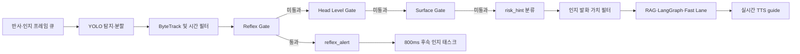
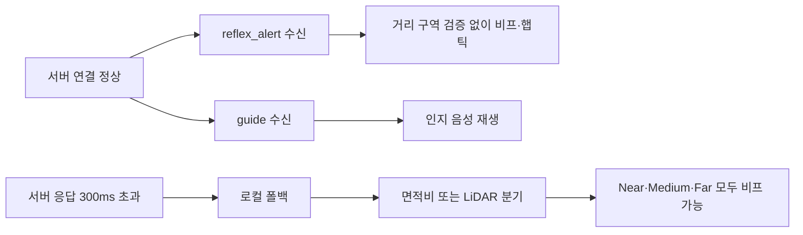
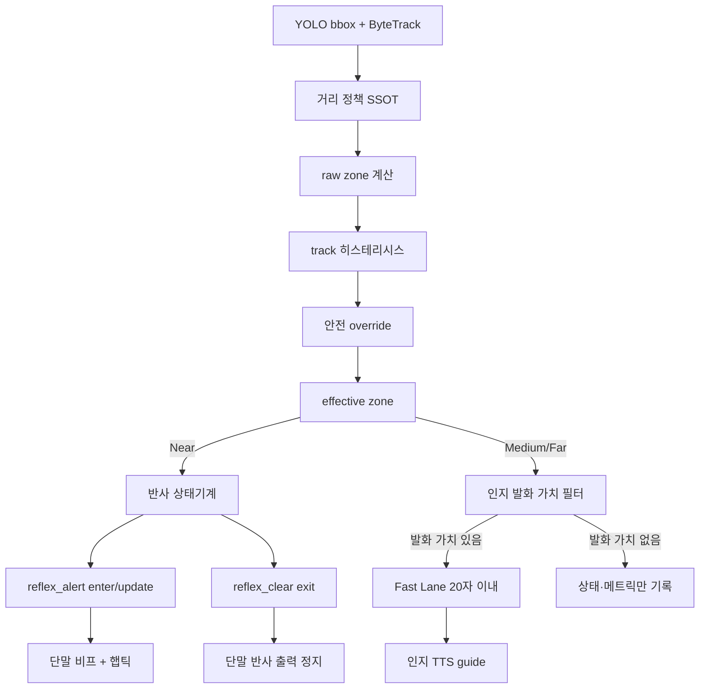

# 휴리스틱 거리 구역 기반 객체 탐지 알림 라우팅 구현 계획서

> **작성일**: 2026-07-18
> **문서 버전**: v1.0.0
> **상태**: 구현 전 정합성 검토 및 실행 계획
> **적용 범위**: 객체 탐지 알림의 거리 판정, 반사·인지 경로 라우팅, 중복 억제, 서버·클라이언트 계약
> **이번 작업 범위**: 코드 구현 없이 현행 코드·문서·테스트를 감사하고 구현 순서와 수용 기준을 확정합니다.

---

## 1. 결론

제안하신 **Near / Medium / Far 3구역 분리**는 Minchodan의 이중 경로 원칙과 정합합니다. 다만 현재 코드에서 임곗값만 바꾸면 알림 피로가 해결되지 않습니다. 같은 `near / medium / far` 명칭 아래 서로 다른 거리 공식과 알림 경로가 중복되어 있고, 동일 객체를 프레임마다 다시 알리는 상태 구조가 남아 있기 때문입니다.

권장하는 최종 정책은 다음과 같습니다.

| 구분 | 권장 정책 | 최종 출력 | 핵심 제한 |
| :--- | :--- | :--- | :--- |
| **Near** | 신뢰도·추적 안정화·충돌 회랑 검증을 통과한 모든 일반 객체를 반사 경로로 분기 | **비프음 + 햅틱** | 실시간 TTS·RAG·LLM 금지, 같은 객체의 같은 Near 에피소드를 프레임마다 재알림하지 않음 |
| **Medium** | 인지 경로 후보로 분기 | **짧은 결정론적 TTS** | 새 트랙, 구역 진입, 접근·방향 변화 때만 발화 |
| **Far** | 인지 경로 후보로 분기 | **조건부 짧은 TTS** | 정적·측면·반복 Far는 무발화, 새 트랙 또는 정면 접근일 때만 1회 안내 |
| **안전 예외** | 노면 주의·차도 이탈·머리 높이 위험 등 객체 거리만으로 판단할 수 없는 기존 안전 게이트 | 기존 반사 경로 유지 | 일반 객체 거리 정책과 별도 네임스페이스·억제 상태 사용 |

여기서 “Near의 모든 객체”는 **모든 원시 YOLO bbox**가 아니라, 클래스 allow-list 없이 **유효 bbox, 신뢰도, 트랙 안정화, 충돌 회랑을 통과한 객체**를 뜻합니다. 측면의 정적 객체까지 무조건 비프 처리하면 이번 개선 목표인 알림 피로 감소와 충돌하므로, 객체 클래스는 열어 두되 공간·시간 안전 게이트는 유지하는 해석이 적절합니다.

Medium/Far도 탐지 프레임마다 TTS를 생성하면 비프 피로가 음성 피로로 이동합니다. 따라서 Medium/Far는 항상 **인지 경로 후보**가 되지만, 실제 합성은 `speech_worthy` 정책과 분당 예산을 통과할 때만 수행해야 합니다.

---

## 2. 문제 정의와 목표

### 2.1 현재 현상

| 현상 | 사용자 영향 | 코드상 원인 가설 |
| :--- | :--- | :--- |
| 같은 객체가 반복 탐지될 때 비프·햅틱이 계속 재생됨 | 경고 의미 약화, 피로와 불안 증가 | Near가 에피소드 상태가 아니라 반복 이벤트로 취급되고, 서버 Near 스로틀이 0.5초마다 다시 열림 |
| 서버가 느리거나 일시적으로 응답하지 않을 때 알림 패턴이 달라짐 | 동일 장면에서 서버 정책과 단말 정책이 번갈아 적용됨 | 300ms 응답 타임아웃을 기준으로 로컬 폴백이 켜지고, 로컬 폴백은 Medium/Far까지 비프 처리 |
| 동일한 거리 표현인데 경로가 서로 다르게 선택됨 | 디버깅·튜닝 결과를 신뢰하기 어려움 | 서버 면적비, 서버 bbox 하단 의사 미터, 클라이언트 면적비 공식이 각각 독립 동작 |
| Medium/Far 안내가 지나치거나 필요한 순간에 누락됨 | 음성 피로 또는 접근 위험 안내 누락 | 인지 중복 서명에 track·distance zone·direction이 없고, `mid`와 `medium` 문자열이 혼용됨 |
| Near 반사 직후 TTS가 뒤따름 | 한 위험에 이중 알림 발생 | 반사 전송 성공·억제 여부와 무관하게 800ms 지연 인지 태스크가 예약됨 |

### 2.2 구현 목표

| 목표 ID | 목표 | 측정 가능한 완료 기준 |
| :--- | :--- | :--- |
| **G-01** | 거리 판정 단일화 | 서버·클라이언트가 같은 정책 버전과 경계값을 사용 |
| **G-02** | 출력 경로 단일화 | 일반 객체 Near는 반사만, Medium/Far는 인지만 사용 |
| **G-03** | 반복 알림 억제 | 같은 트랙의 같은 Near 에피소드에서 `enter` 1회만 발생 |
| **G-04** | 음성 피로 제한 | 일반 객체 TTS가 기본 **분당 3회 이하**, 정적 Far 반복 안내 0회 |
| **G-05** | 반사 지연 보존 | 안정화된 Near 진입부터 단말 비프·햅틱 시작까지 p95 300ms 이하 |
| **G-06** | 이중 경로 물리 분리 | 반사 처리 코드에서 RAG·오케스트레이션·실시간 TTS import 0건 |
| **G-07** | 서버·단말 중복 방지 | 한 시점의 알림 소유자가 서버 또는 로컬 중 하나로만 결정됨 |
| **G-08** | 실측 보정 가능성 확보 | 휴리스틱 결과와 LiDAR 검증 데이터를 동일 정책 버전으로 비교 가능 |

### 2.3 비목표

| 비목표 | 이유 |
| :--- | :--- |
| YOLO 모델 재학습 또는 클래스 변경 | 이번 문제는 모델 정확도보다 거리·라우팅·중복 상태 정책의 문제임 |
| iOS LiDAR 실시간 bbox fusion 구현 | 현재 기능은 수동 검증 프로브이며 별도 네이티브 프로젝트로 분리해야 함 |
| RAG 지식 DB 재구축 | 일반 Medium/Far의 단순 존재 안내는 결정론적 Fast Lane으로 처리 가능 |
| 새로운 운영자 UI 화면 추가 | 우선 로그·메트릭 필드만 추가하고 현장 검증 후 시각화 범위를 정함 |
| 기존 노면·머리 높이 안전 정책 삭제 | 일반 객체 거리 라우팅과 별개의 안전 override이므로 보존해야 함 |

---

## 3. 용어와 데이터 의미

| 용어 | 이 문서의 의미 | 사용 금지 또는 주의사항 |
| :--- | :--- | :--- |
| **거리 구역** | `near / medium / far` 상대 구역 | `risk_level`의 `high / mid / low`와 혼용 금지 |
| **면적비** | 프레임 안으로 클리핑한 bbox 면적을 프레임 면적으로 나눈 값 | bbox가 프레임 밖으로 나간 면적을 그대로 계산하지 않음 |
| **휴리스틱 거리** | bbox 면적비로 계산한 상대 거리 추정치 | LiDAR 실측 거리 또는 물리적 절대 거리로 표기하지 않음 |
| **원시 구역** | 면적비 공식만으로 구한 `raw_distance_zone` | 하단 소형 장애물 override 전 값 |
| **유효 구역** | 히스테리시스와 안전 override를 반영한 `effective_distance_zone` | 실제 라우팅은 이 값만 사용 |
| **Near 에피소드** | 한 트랙이 Near에 진입한 시점부터 이탈·소실할 때까지의 상태 | 프레임별 독립 알림으로 취급하지 않음 |
| **인지 경로 후보** | Medium/Far로 분기되어 발화 가치 평가를 받는 이벤트 | 후보가 곧 TTS 발화를 의미하지 않음 |
| **안전 override** | 노면·머리 높이 위험 또는 하단 소형 객체처럼 일반 거리 공식만으로 놓칠 수 있는 조건 | override 이유를 `route_reason`으로 기록 |

---

## 4. 현재 실행 경로 감사

### 4.1 서버 실행 흐름



현재 `DetectionPipeline.run(stream=...)`은 `stream` 값을 받지만 실제 라우팅에 사용하지 않습니다. 그 결과 반사 프레임에서도 Medium/Far 인지 후보가 만들어질 수 있고, 인지 프레임에서도 반사 경보가 나올 수 있습니다. 제안 정책을 안정적으로 적용하려면 **거리 정책뿐 아니라 스트림 소유권도 함께 분리**해야 합니다.

### 4.2 서버 코드 근거

| 파일·라인 | 현재 동작 | 정합성 판단 |
| :--- | :--- | :--- |
| `server/detection/direction.py:8-10,54-65` | 면적비 `>=0.08` Near, `>=0.03` Medium, 나머지 Far | 인지용 거리 분류는 존재하지만 반사 게이트와 임곗값이 다름 |
| `server/detection/direction.py:68-73` | bbox 면적비 계산 | bbox 프레임 클리핑과 히스테리시스가 없음 |
| `server/detection/gates/reflex_gate.py:59-73,91-121` | 신뢰도 0.35, 중앙 30~70%, 면적비 0.10 또는 하단 80%·면적비 0.04 이상, hit 3회 | 실제 Near 반사 조건은 `estimate_distance()`와 별도임 |
| `server/detection/gates/reflex_gate.py:134-152` | bbox 하단으로 `0.4~1.5` 의사 미터와 별도 `distance_band` 생성 | 결과 범위상 Far가 발생할 수 없고 인지 거리와 의미가 다름 |
| `server/detection/gates/reflex_gate.py:154-183` | 의사 미터에 따라 비프·햅틱 간격 구성 | 라우팅과 출력 패턴에 두 번째 거리 체계를 사용 |
| `server/detection/detection_pipeline.py:97-135` | `stream`을 받지만 탐지·분할 및 이후 분기에 반영하지 않음 | 반사 8~10fps와 인지 1~2fps의 물리 분리가 실행 코드에서 약화됨 |
| `server/detection/detection_pipeline.py:148-219` | 시간 필터 뒤 Reflex, Head, Surface 순으로 평가 | Near 정책을 적용할 핵심 위치이나 구역 결과를 한 번만 계산하지 않음 |
| `server/detection/detection_pipeline.py:42,309-328` | 일반 객체 `MID_RISK_CLASSES`가 공집합이며 게이트 미통과 객체는 주로 low | 위험도만으로 Near/Medium/Far 경로를 나눌 수 없음 |
| `server/detection/consumer.py:174-187` | 인지 중복 서명이 객체 클래스 집합·노면·이탈 여부로만 구성 | 동일 클래스 새 트랙과 거리 악화를 구별하지 못함 |
| `server/detection/consumer.py:212-249` | Far 정적 객체는 무발화, Medium은 정면·접근 조건에서 발화 후보 | 피로 억제 방향은 맞지만 거리 전이 기반 재무장이 없음 |
| `server/detection/consumer.py:231-240` | 위험 예외 문자열을 `high`, `medium`으로 검사 | 시스템 정본 `mid`와 불일치하여 surface-only 안내가 누락될 수 있음 |
| `server/detection/consumer.py:556-578` | 반사 처리 뒤 항상 800ms 지연 인지 태스크 예약 | Near를 반사 전용으로 만들려는 정책과 직접 충돌 |
| `server/detection/consumer.py:767-829` | track·band 억제 후 WS 반사 전송 | 전송 함수가 성공 여부를 반환하지 않아 호출부가 후속 작업을 판단하지 못함 |
| `server/detection/consumer.py:990-1003` | 인지 직전에 최고 confidence 객체를 선택하고 거리 계산 | 가장 가까운 객체보다 confidence가 높은 먼 객체가 대표가 될 수 있음 |
| `server/detection/consumer.py:1017-1038` | 상황 서명 30초와 전역 안내 간격으로 중복 억제 | signature에 track·zone·direction이 없어 거리 전이와 불일치 |
| `server/detection/consumer.py:1051-1127` | RAG 이후 오케스트레이션·Fast Lane 수행 | 단순 Medium/Far 문장도 RAG를 먼저 거쳐 불필요한 지연·부하가 발생 가능 |
| `server/tts/suppressor.py:13-20,53-60` | 같은 track·band 5초, 장치 1.5초, Near 0.5초 스로틀 | 같은 Near 에피소드가 초당 2회 재알림될 수 있음 |
| `server/orchestration/nodes/fast_lane.py:20-38,58-91` | 단일 객체의 Near/Medium/Far 짧은 템플릿이 있으나 29종 중 10종만 대상 | Medium/Far 단순 TTS에 재사용하되 `CLASS_TEXT`가 있는 전 객체로 확장하고 Near 일반 안내는 차단해야 함 |
| `server/detection/risk_rules.py:11-13,119-170` | `medium` 위험도와 별도 규칙 기반 힌트 정의 | 런타임 라우터가 아니며 `mid` 계약과 불일치함 |
| `server/services/lidar_validation_service.py:31-49` | 서버 `estimate_distance()` 결과와 LiDAR 샘플을 저장 | 면적비 휴리스틱 보정에는 유용하지만 반사 의사 미터식은 검증하지 않음 |

### 4.3 클라이언트 실행 흐름



### 4.4 클라이언트 코드 근거

| 파일·라인 | 현재 동작 | 정합성 판단 |
| :--- | :--- | :--- |
| `client/src/components/CameraView.tsx:417-420` | `0.22 / sqrt(areaRatio)`를 0.3~3.0으로 clamp | 보정되지 않은 휴리스틱을 미터처럼 표시함 |
| `client/src/inference/pathObstacleDetector.ts:76-106` | 같은 공식을 별도 구현 | 정책 변경 시 플랫폼·경로별 드리프트 위험 |
| `client/src/components/CameraView.tsx:233-249` | bbox 하단 85% 또는 면적비를 긴급 판정에 사용 | 거리 구역과 안전 override 의미가 혼재함 |
| `client/src/components/CameraView.tsx:334-394` | 면적비 `>0.20`, `>0.08`, `>0.03`, 그 이하 단계까지 비프·햅틱·클립 선택 | Medium/Far까지 반사 출력을 내는 직접 충돌 지점 |
| `client/src/components/CameraView.tsx:1031-1077` | 긴급 객체가 없으면 Medium/Far 후보도 로컬 반사 후보가 됨 | Near 전용 반사 원칙을 위반함 |
| `client/src/components/CameraView.tsx:1079-1093` | 모든 객체가 하나의 `localReflexStreakRef`를 공유 | 다른 객체 프레임이 연속 탐지로 합산될 수 있음 |
| `client/src/components/CameraView.tsx:1095-1184` | 서버 단절 또는 응답 지연 시 로컬 반사 실행 | 300ms 경계에서 서버·로컬 알림 소유권이 흔들릴 수 있음 |
| `client/src/components/CameraView.tsx:1153-1169` | Android 로컬 반사 폴백 안에서 STOP/BLOCKED TTS 수행 | 반사 경로의 실시간 TTS 금지 원칙과 충돌함 |
| `client/src/hooks/useWebSocket.ts:356-377` | 모든 `reflex_alert`를 거리 검증 없이 비프·햅틱으로 실행 | Medium/Far 오분류를 단말에서 방어하지 못함 |
| `client/src/hooks/useWebSocket.ts:294-315,378-425` | 인지 안내는 최신 슬롯 중심으로 교체 | 방향성은 적절하지만 명시적 만료·거리 전이·분당 예산 계약이 부족함 |
| `client/src/services/audioEngine.ts:20-26,242-258` | 250ms 이하를 고위험으로 판단 | WebSocket 계층의 100ms 기준과 의미가 다름 |
| `client/src/services/audioEngine.ts:708-738` | 반사 클립 호출마다 플레이어 생성 및 인지 안내 선점 | 활성 클립 추적·중복 병합이 없어 중첩 가능 |
| `client/src/services/hapticEngine.ts:30-64` | 연속 햅틱 재호출 시 중지 후 다시 시작 | 매 프레임 이벤트가 5초 상한을 계속 초기화할 수 있음 |
| `client/src/types/detection.ts:10-12` | 방향 타입과 위험 타입 정의 | 서버 `front-left / front-right`, `mid` 계약을 전체 payload와 일치시켜야 함 |
| `client/src/types/detection.ts:50-98,120-144` | 반사 payload의 track·class·distance band 일부가 누락 | 런타임 검증과 중복 상태 키를 안전하게 만들기 어려움 |
| `client/ios/DepthProbeBridge.swift:1-10,42-95,278-378` | 별도 세션 기반 수동 LiDAR 프로브 | 일반 객체 탐지 프레임과 자동 동기화된 거리 입력이 아님 |

---

## 5. 거리 정책 정합성 진단

### 5.1 현재 혼재한 거리 체계

| 체계 | 공식·경계 | 사용 위치 | 문제 |
| :--- | :--- | :--- | :--- |
| **서버 인지 면적 구역** | Near `r>=0.08`, Medium `r>=0.03`, Far `r<0.03` | `direction.py` | 반사 게이트의 0.10과 불일치 |
| **서버 반사 진입 구역** | 기본 `r>=0.10`, 하단 override `bottom>=0.80 and r>=0.04` | `reflex_gate.py` | `near` 타입을 사용하지 않고 별도 계산 |
| **서버 반사 의사 미터** | `clamp(1.5 - bottom_ratio*1.1, 0.4, 1.5)` | `reflex_alert.distance`, `distance_band` | Far가 구조상 발생 불가, 실제 미터가 아님 |
| **클라이언트 표시 휴리스틱** | `clamp(0.22/sqrt(r), 0.3, 3.0)` | `CameraView`, Android path detector | 서버 구역과 라우팅에 직접 연결되지 않음 |
| **클라이언트 로컬 출력 단계** | 면적비 0.20, 0.08, 0.03 및 LiDAR 0.5, 1.0, 1.5, 3.0 | `CameraView` 폴백 | Medium/Far도 반사 비프 출력 |
| **LiDAR 검증 거리** | 보정된 실제 meter 샘플 | 수동 거리측정·검증 저장 | 일반 bbox 실시간 경로와 아직 fusion되지 않음 |

### 5.2 의미 충돌

| 충돌 ID | 충돌 | 영향 | 조치 |
| :--- | :--- | :--- | :--- |
| **C-01** | `distance_class`와 `distance_band`가 같은 3개 문자열이지만 산식이 다름 | 서버 로그·API·단말 동작을 비교할 수 없음 | `distance_zone` 하나로 통합하고 레거시 필드는 호환 alias로만 유지 |
| **C-02** | 휴리스틱 값이 `distance`라는 미터형 필드로 노출됨 | 실측 거리로 오인 | `heuristic_distance_m` 또는 `estimated_distance_m`로 명시하고 `distance_source` 추가 |
| **C-03** | 위험도 `mid`와 `medium` 혼용 | 노면 안내 누락 및 타입 우회 | `RiskLevel=high|mid|low|none`으로 고정 |
| **C-04** | 반사와 인지 프레임이 같은 파이프라인 분기를 탐 | 중복 추론·중복 안내·트래커 상태 경쟁 | `stream`별 허용 출력 타입을 불변식으로 강제 |
| **C-05** | Near 반사 뒤 일반 인지 TTS가 예약됨 | 이중 알림 | 일반 Near 후속 TTS 제거, 행동 가치가 있는 별도 `post_reflex`만 허용 |
| **C-06** | Medium/Far가 단말 폴백에서 비프 | 제안 경로와 정반대 | 로컬 반사 폴백을 Near로 제한 |
| **C-07** | 같은 구역 반복을 시간 TTL만으로 억제 | TTL 종료 때 같은 객체가 다시 울림 | track 기반 `enter/update/exit` 에피소드 상태 도입 |
| **C-08** | 인지 서명에 track·zone·direction이 없음 | 거리 악화 누락 또는 클래스 흔들림 재발화 | 상황 키를 구조화하고 재무장 조건을 명시 |
| **C-09** | 최고 confidence가 대표 객체 | 먼 대형 객체가 가까운 장애물보다 먼저 안내될 수 있음 | 유효 거리, 회랑, 접근, 안전 override, confidence 순으로 우선순위 변경 |
| **C-10** | 수동 LiDAR를 실시간 근거로 오해할 여지 | 정책 검증 범위 과대평가 | 1차는 bbox 휴리스틱, LiDAR는 오프라인 보정 근거로만 명시 |

### 5.3 제안의 정합성 판정

| 검토 축 | 판정 | 이유 |
| :--- | :--- | :--- |
| 이중 경로 원칙 | **적합** | Near 반사와 Medium/Far 인지를 명시적으로 분리함 |
| 알림 피로 감소 | **조건부 적합** | Medium/Far를 프레임마다 발화하지 않는 상태·예산 정책이 필수임 |
| 현행 서버 구조 | **부분 적합** | Fast Lane·speech-worthy·suppressor는 재사용 가능하나 거리 계산과 stream 경계 수정 필요 |
| 현행 클라이언트 구조 | **수정 필요** | 로컬 4단계 반사 규칙과 무검증 `reflex_alert` 실행이 직접 충돌함 |
| LiDAR 정합성 | **1차 범위 외** | 수동 계측은 보정 자료로 사용 가능하지만 실시간 객체 거리 입력은 아님 |
| 문서 정합성 | **일괄 갱신 필요** | 60초 억제, 동적 alert ID, MP3/WAV, 클래스 제한, 거리 공식 서술이 혼재함 |

---

## 6. 권장 거리 휴리스틱 v1

### 6.1 계산 원칙

라우팅의 정본은 반올림된 의사 미터가 아니라 **클리핑한 bbox 면적비와 이전 트랙 상태**로 둡니다. 의사 미터는 운영 로그와 LiDAR 보정 분석을 위한 파생값으로만 사용합니다.

```text
clipped_bbox = bbox를 프레임 경계 [0, width] x [0, height]로 클리핑
area_ratio = clipped_bbox_area / frame_area
heuristic_distance_m = clamp(0.22 / sqrt(max(area_ratio, 1e-6)), 0.3, 3.0)
```

`0.22 / sqrt(area_ratio)`는 객체 실제 크기, 카메라 화각, crop, bbox 오차를 반영하지 못하므로 물리 거리의 진실값이 아닙니다. API·로그·UI에는 반드시 `distance_source="bbox_heuristic"`와 정책 버전을 함께 기록합니다.

### 6.2 초기 임곗값

| 구역 | 최초 진입 조건 | 유지·이탈 조건 | 휴리스틱 환산 참고 | 라우팅 |
| :--- | :--- | :--- | :--- | :--- |
| **Near** | `area_ratio >= 0.10` | 기존 Near는 `area_ratio < 0.08`일 때만 Medium으로 이탈 | 0.10은 약 0.70m, 0.08은 약 0.78m | 반사 |
| **Medium** | Far에서 `area_ratio >= 0.03`, 또는 Near에서 `<0.08` | `area_ratio >=0.10`이면 Near, `<0.025`이면 Far | 0.03은 약 1.27m, 0.025는 약 1.39m | 인지 후보 |
| **Far** | 최초 `area_ratio < 0.03`, 또는 Medium에서 `<0.025` | `area_ratio >=0.03`일 때 Medium으로 진입 | 0.03 미만은 약 1.27m 초과 | 인지 후보 |

Near 진입값 `0.10`은 현재 서버 반사 게이트의 피로 완화 기준과 맞추고, `0.08`은 현재 인지 Near 기준을 **이탈 히스테리시스**로 재사용합니다. Medium 진입 `0.03`도 현행 분류와 호환됩니다. 이 수치는 **LiDAR 클래스별 검증 전 잠정값**이며 현장 데이터로 조정해야 합니다.

### 6.3 소형 하단 장애물 override

| 조건 | 결과 | 제한 |
| :--- | :--- | :--- |
| `bottom_ratio >= 0.80` 및 `area_ratio >= 0.04` | `effective_distance_zone=near` | confidence, 트랙 안정화, 충돌 회랑을 모두 통과해야 함 |
| 원시 Medium이지만 override가 적용됨 | `route_reason=bottom_close_override` | 원시 구역을 덮어쓰지 않고 원시·유효 구역 둘 다 로그에 보존 |
| 한 프레임만 하단에 걸림 | Near 미확정 | 2~3회 안정화 또는 approaching 안정화 조건 필요 |

이 override는 볼라드·소화전처럼 작아서 면적비 0.10에 도달하기 전에 화면 하단으로 빠지는 장애물을 위한 안전 장치입니다. 단순히 하단 80%만 통과한 먼 작은 bbox를 Near로 올리지 않도록 최소 면적비와 회랑 조건을 함께 사용합니다.

### 6.4 트랙 기반 구역 전이

| 이전 상태 | 관측 조건 | 새 상태 | 출력 |
| :--- | :--- | :--- | :--- |
| 없음 | 안정화된 Near | Near | `reflex_alert` 1회 |
| 없음 | 안정화된 Medium | Medium | 인지 후보 1회 |
| 없음 | 안정화된 Far | Far | 정면·접근일 때만 인지 후보 1회 |
| Far | `area_ratio >=0.03` | Medium | 거리 악화 재안내 가능 |
| Medium | `area_ratio >=0.10` 또는 하단 override | Near | 인지 음성 선점 후 반사 1회 |
| Near | `area_ratio >=0.08` | Near 유지 | 프레임별 재알림 없음, 방향·심각도 악화 때만 update |
| Near | `area_ratio <0.08`가 안정적으로 지속 | Medium | `reflex_clear`, 필요 시 오래되지 않은 Medium 안내 1회 |
| Medium | `area_ratio <0.025`가 안정적으로 지속 | Far | 기본 무발화, 상태만 갱신 |
| 임의 상태 | 허용 공백 초과 또는 track 소실 | 종료 | Near였다면 `reflex_clear` |

### 6.5 객체 우선순위

한 프레임에 객체가 여러 개면 모든 객체를 동시에 안내하지 않고 다음 순서로 대표 객체를 선택합니다.

| 우선순위 | 기준 | 설명 |
| :---: | :--- | :--- |
| 1 | 안전 override | 머리 높이·노면·하단 근접 등 즉시 안전 조건 |
| 2 | 유효 거리 구역 | Near, Medium, Far 순 |
| 3 | 충돌 회랑 | 중앙·진행 경로와 더 겹치는 객체 우선 |
| 4 | 접근 상태 | 정적보다 안정적으로 approaching인 객체 우선 |
| 5 | 면적비·하단 비율 | 더 크고 더 하단인 객체 우선 |
| 6 | confidence | 위 조건이 같을 때만 높은 신뢰도 사용 |

---

## 7. 목표 알림 정책

### 7.1 일반 객체 정책 매트릭스

| 장면 | 반사 비프 | 햅틱 | 인지 TTS | 재알림 조건 |
| :--- | :---: | :---: | :---: | :--- |
| Near 신규 진입 | 예 | 예 | 아니요 | 새 track 또는 이탈 후 재진입 |
| Near 유지 | 상태 유지 | 상태 유지 | 아니요 | 방향 변화·심각도 악화만 update |
| Near 이탈·소실 | 정지 | 정지 | 기본 아니요 | `reflex_clear` 처리 |
| Medium 신규 진입 | 아니요 | 아니요 | 예 | 새 track, Far→Medium, 유의미한 방향 변화 |
| Medium 반복 정적 | 아니요 | 아니요 | 아니요 | 30초 경과만으로 자동 재발화하지 않고 장면 변화 필요 |
| Far 신규·정면·접근 | 아니요 | 아니요 | 조건부 예 | 새 track 또는 approaching 전이 |
| Far 정적·측면 | 아니요 | 아니요 | 아니요 | 상태·로그만 유지 |
| 같은 프레임에 Near와 Medium/Far 공존 | Near만 실행 | Near만 실행 | 보류·폐기 | Near 종료 후에도 최신성·가치가 남을 때만 새 안내 |

### 7.2 안전 예외

| 예외 | 권장 경로 | 거리 구역과의 관계 |
| :--- | :--- | :--- |
| `surface_caution`, `roadway`, 보도 이탈 | 기존 Surface Gate 또는 전용 안전 경로 | 일반 객체 거리 정책보다 우선 |
| 머리 높이 충돌 위험 | Head Level Gate 반사 | bbox 면적만으로 거리 판정하지 않음 |
| 하단 소형 장애물 | Near override | 원시 구역과 override 이유를 같이 기록 |
| approaching 후 화면 하단 소실 | 별도 `obstacle_lost` 안전 이벤트 검토 | 일반 Near 반복 경보와 다른 이벤트 ID 사용 |

안전 예외는 일반 객체와 같은 `high_obstacle:unknown:medium` 억제 키를 공유하면 안 됩니다. 최소한 `alert_source=object|head_level|surface`를 키에 포함해 서로 다른 위험이 교차 억제되지 않도록 합니다.

### 7.3 TTS 생성 규칙

| 항목 | Medium | Far |
| :--- | :--- | :--- |
| 기본 엔진 경로 | Fast Lane 결정론 템플릿 | Fast Lane 결정론 템플릿 |
| RAG·LLM | 단순 단일 객체는 생략 | 단순 단일 객체는 생략 |
| 발화 길이 | 20자 이내 | 20자 이내 |
| 권장 예시 | `12시 차량 있습니다` | `12시 멀리 차량` |
| 발화 조건 | 새 track, 구역 진입, 접근, 유의미한 방향 변화 | 새 track이면서 정면·접근, 또는 Far→Medium 직전의 명확한 접근 |
| 억제 키 | `device+track+zone+direction+guidance_mode` | 동일 |
| 전역 예산 | 일반 객체 합산 분당 3회 이하 | Medium과 예산 공유 |
| 만료 | 생성·재생 시작 시 2초 초과 이벤트 폐기 | 동일 |

현재 Fast Lane은 Near/Medium/Far 템플릿을 이미 지원하지만 대상 객체가 29종 중 10종으로 제한됩니다. 구현 시 `CLASS_TEXT`가 정의된 일반 객체 전체를 결정론적 템플릿 대상으로 확장하고, **Fast Lane 자격 판정을 RAG 검색보다 먼저** 수행하면 단순 Medium/Far 알림의 지연과 GPU·LLM 부하를 줄일 수 있습니다. 복합 객체·노면·사용자 상태가 함께 필요한 경우에만 RAG·LangGraph로 승격합니다.

### 7.4 Near 이후 인지 안내

현재처럼 모든 Near 반사 뒤 800ms 후 일반 인지 안내를 예약하면 제안 정책과 충돌합니다. 다음 두 모드를 분리합니다.

| 모드 | 허용 여부 | 조건 |
| :--- | :---: | :--- |
| 일반 Near 존재 안내 | 금지 | 비프·햅틱과 같은 사실을 TTS로 반복하지 않음 |
| `post_reflex` 행동 안내 | 제한 허용 | 회피 방향이 명확하고, 반사 전송 성공 후, 새로운 행동 정보가 있으며, 별도 쿨다운을 통과할 때만 1회 |
| 억제·전송 실패한 반사의 후속 안내 | 금지 | `_send_reflex_alert()`의 성공 결과가 false이면 태스크 생성 금지 |
| 오래된 후속 안내 | 금지 | Near가 이미 해제됐거나 2초 이상 지난 경우 폐기 |

---

## 8. 목표 아키텍처



### 8.1 스트림 불변식

| 입력 스트림 | 허용 계산 | 허용 출력 | 금지 출력 |
| :--- | :--- | :--- | :--- |
| **reflex** 8~10fps | 객체 탐지, 최소 추적, 거리·안전 게이트 | Near `reflex_alert`, `reflex_clear`, 안전 override | 일반 Medium/Far TTS, RAG, LLM, 실시간 TTS |
| **cognitive** 1~2fps | 상세 탐지·분할, 거리·장면·인지 평가 | Medium/Far `guide`, 노면·내비 인지 안내 | 일반 객체 Near 반사 재발행 |
| **post_reflex** 이벤트 | 반사 성공 결과와 최신 장면 상태 | 제한된 행동 안내 | 원시 프레임마다 태스크 생성 |

### 8.2 서버·단말 알림 소유권

| 상태 | 알림 소유자 | Near | Medium/Far |
| :--- | :--- | :--- | :--- |
| WS 정상·응답 최신 | 서버 | 서버 `reflex_alert`를 단말이 실행 | 서버 인지 TTS |
| 응답 일시 지연 | 서버 유지 | 로컬 폴백 즉시 전환 금지 | 기존 최신 안내만 유지 |
| 연속 실패로 폴백 확정 | 단말 | 로컬 SSOT로 Near 비프·햅틱 | 1차 구현에서는 무발화·상태 표시만 |
| 서버 복구 안정화 | 서버로 원자적 전환 | 로컬 활성 반사 clear 후 서버 이벤트 수용 | 오래된 로컬 후보 폐기 |

현재의 단일 300ms 비교 대신 연결 상태기계를 도입합니다. 초기값은 `1.5초 또는 3회 연속 응답 누락` 뒤 로컬 폴백 진입, `2회 연속 정상 응답` 뒤 서버 소유권 복구로 두고 실제 RTT p95로 조정합니다. 이 값 역시 정책 파일 또는 명시적 환경 변수로 관리합니다.

---

## 9. 거리 정책 SSOT 설계

### 9.1 권장 파일 구조

| 파일 | 역할 |
| :--- | :--- |
| `shared/risk_rules.json` | 거리 공식, 구역 경계, 히스테리시스, route mapping, override의 정본 |
| `shared/risk_rules.schema.json` | JSON Schema 기반 타입·범위 검증 |
| `scripts/generate_risk_rules.py` | 정본에서 서버·클라이언트 생성물을 만드는 스크립트 |
| `server/detection/generated_risk_rules.py` | 서버가 import하는 생성 상수 |
| `client/src/generated/riskRules.ts` | Metro 경계와 무관하게 번들되는 생성 상수·타입 |
| `server/detection/distance_policy.py` | bbox 클리핑, 면적비, 히스테리시스, override, route 결정을 수행하는 순수 함수 |
| `client/src/policies/distancePolicy.ts` | 단말 폴백에서 같은 규칙을 수행하는 순수 함수 |
| `tests/test_risk_ssot.py` | JSON, 생성물, 문서화된 정책 버전의 정합성 검증 |

서버는 런타임마다 디스크 JSON을 읽지 않고 시작 시 생성 상수를 import합니다. 클라이언트는 프로젝트 루트 바깥 JSON을 직접 import하지 않고 생성된 TypeScript를 사용합니다. pre-commit과 CI에서 생성물 checksum을 확인해 수동 복사 드리프트를 막습니다.

### 9.2 권장 정책 필드

| 필드 | 예시 | 의미 |
| :--- | :--- | :--- |
| `policy_version` | `distance-alert-v1` | 로그·API·검증 데이터의 정책 식별자 |
| `heuristic.coefficient` | `0.22` | 면적비 의사 거리 계수 |
| `heuristic.min_m / max_m` | `0.3 / 3.0` | 표시·로그 파생값 clamp |
| `zones.near.enter_area_ratio` | `0.10` | Medium에서 Near 진입 |
| `zones.near.exit_area_ratio` | `0.08` | Near에서 Medium 이탈 |
| `zones.medium.enter_area_ratio` | `0.03` | Far에서 Medium 진입 |
| `zones.medium.exit_area_ratio` | `0.025` | Medium에서 Far 이탈 |
| `bottom_override.bottom_ratio` | `0.80` | 소형 하단 장애물 조건 |
| `bottom_override.min_area_ratio` | `0.04` | 먼 작은 bbox 오승격 방지 |
| `route.near` | `reflex` | 일반 객체 Near 출력 경로 |
| `route.medium / route.far` | `cognitive` | Medium/Far 평가 경로 |
| `cognitive.far_requires_approaching` | `true` | 정적 Far 자동 발화 차단 |
| `cognitive.max_object_tts_per_minute` | `3` | 일반 객체 음성 예산 |

### 9.3 순수 정책 출력 계약

| 필드 | 타입 | 설명 |
| :--- | :--- | :--- |
| `raw_distance_zone` | `near|medium|far` | 현재 프레임 면적비 기준 구역 |
| `effective_distance_zone` | `near|medium|far` | 히스테리시스·override 적용 결과 |
| `area_ratio` | float | 클리핑한 bbox 면적비 |
| `bottom_ratio` | float | bbox 하단의 정규화 위치 |
| `heuristic_distance_m` | float | 디버그·보정용 파생값 |
| `distance_source` | `bbox_heuristic` | 1차 구현의 거리 출처 |
| `route` | `reflex|cognitive|none` | 일반 객체 기본 경로 |
| `route_reason` | string | `zone_near`, `bottom_close_override`, `far_static_suppressed` 등 |
| `policy_version` | string | 정책 정합성 추적용 버전 |

---

## 10. WebSocket 및 내부 스키마 변경 계획

### 10.1 서버 내부 타입

| 타입 | 변경 |
| :--- | :--- |
| `Detection` | `area_ratio`, `bottom_ratio`, `raw_distance_zone`, `effective_distance_zone`, `distance_source`, `policy_version` 추가 |
| `DetectionResult` | `guidance_mode`, `route_reason`, 대표 `track_id` 추가 |
| `ReflexAlert` | `alert_source`, `event_state`, `effective_distance_zone`, `estimated_distance_m`, `policy_version` 추가 |
| `RiskLevel` | `high|mid|low|none`으로 통일 |
| `GuidanceMode` | `distance_cognitive|post_reflex|surface_departure`로 분리 |

### 10.2 반사 이벤트

| 이벤트 | 필수 필드 | 단말 동작 |
| :--- | :--- | :--- |
| `reflex_alert` `event_state=enter` | `track_id`, `alert_source`, `distance_zone=near`, `beep_pattern`, `haptic_pattern`, `policy_version` | 인지 음성 선점, 비프·햅틱 시작 |
| `reflex_alert` `event_state=update` | 기존 필드 + 변경 이유 | 방향·심각도 악화 시에만 출력 패턴 갱신 |
| `reflex_clear` | `track_id`, `alert_source`, `reason`, `policy_version`, `timestamp` | 해당 트랙 반사 출력 종료 |

기존 클라이언트를 위한 한 번의 호환 기간 동안 `distance_band`와 `distance`를 유지하되, 새 클라이언트는 `distance_zone`과 `estimated_distance_m`을 우선 사용합니다. `reflex_clear`를 모르는 구 클라이언트에서는 기존 짧은 비프 자동 종료가 안전 폴백으로 남습니다.

### 10.3 인지 guide 이벤트

| 필드 | 변경 |
| :--- | :--- |
| `distance_zone` | 새 정본 필드로 추가 |
| `distance_class` | 호환 기간 동안 alias로 유지 |
| `track_id` | 중복·재무장 판단과 단말 최신성 검증에 사용 |
| `guidance_mode` | 일반 거리 안내와 post-reflex를 분리 |
| `route_reason` | 발화 이유를 운영 로그에 노출 |
| `created_at_ms`, `expires_at_ms` | 오래된 TTS 폐기 |
| `policy_version` | 서버·클라이언트 정책 불일치 감지 |

### 10.4 타입 정합성

| 항목 | 현재 | 목표 |
| :--- | :--- | :--- |
| 방향 | 서버 `front-left|front|front-right`, 클라이언트 일부 `left|front|right|stop` | 공간 방향 타입과 행동 명령 타입을 분리 |
| 위험도 | `mid`와 `medium` 혼재 | `high|mid|low|none` |
| 거리 | `distance_class`, `distance_band`, `distance` 혼재 | `distance_zone`, `distance_source`, `estimated_distance_m` |
| 반사 식별 | 고정 `high_obstacle`과 문서의 동적 ID 혼재 | `alert_source + track_id + episode_id` 구조화 |

---

## 11. 서버 구현 계획

| 순서 | 파일 | 상세 변경 | 검증 포인트 |
| :---: | :--- | :--- | :--- |
| 1 | `shared/risk_rules.json` | v1 경계, 히스테리시스, override, route mapping 확정 | JSON Schema 통과, 버전 필수 |
| 2 | `scripts/generate_risk_rules.py` | Python·TypeScript 생성물과 checksum 작성 | 재실행 시 diff 0 |
| 3 | `server/detection/distance_policy.py` | bbox 클리핑, 면적비, 파생거리, 트랙 히스테리시스, route 순수 함수 구현 | 경계·invalid bbox·NaN 테스트 |
| 4 | `server/detection/direction.py` | `estimate_distance()`를 새 정책 wrapper로 전환하고 직접 상수 제거 | 기존 호출 호환, 경계값 변경 명시 |
| 5 | `server/detection/schemas.py` | 거리 평가·정책 버전·event state 타입 추가, risk Literal 통일 | 직렬화·역직렬화 |
| 6 | `server/detection/detection_pipeline.py` | 추적 뒤 거리 평가를 객체당 1회 수행, stream 불변식과 대표 객체 우선순위 적용 | reflex stream에서 cognitive 결과 0, cognitive stream에서 일반 Near reflex 0 |
| 7 | `server/detection/gates/reflex_gate.py` | 자체 면적·의사 거리 band 계산 제거, 유효 Near와 안전 조건만 소비 | Medium/Far 일반 객체 반사 0 |
| 8 | `server/detection/gates/head_level_gate.py`, `surface_gate.py` | 별도 `alert_source`, 억제 네임스페이스, 정책 이유 부착 | object 경보와 교차 억제 0 |
| 9 | `server/detection/consumer.py` | `_send_reflex_alert()->bool`, Near 에피소드 상태, `reflex_clear`, 거리 기반 cognitive 서명, `mid` 오타 수정 | 억제·연결 실패 시 후속 태스크 0 |
| 10 | `server/tts/suppressor.py` | track·episode·source 기반 억제, enter/update/exit 상태 지원 | 같은 Near 에피소드 enter 1회 |
| 11 | `server/orchestration/nodes/fast_lane.py` | Medium/Far 20자 템플릿, 일반 거리 안내 모드 분리, `CLASS_TEXT`가 있는 29종 전체로 결정론 경로 확장 | 단일 객체는 RAG·LLM 없이 TTS 가능 |
| 12 | `server/orchestration/nodes/l2_generator.py` | “이미 반사 후 정지” 가정을 일반 Medium/Far 프롬프트에서 제거 | 일반 인지와 post-reflex 프롬프트 분리 |
| 13 | `server/bus/producer.py` | `distance_zone`, `route_reason`, `policy_version`를 관측 이벤트에 추가 | Redis 소비자 역호환 |
| 14 | `server/services/lidar_validation_service.py` | 저장 샘플에 정책 버전·면적비·원시·유효 구역 추가 | 정책 버전별 정확도 비교 가능 |

### 11.1 반드시 함께 고칠 서버 결함

| 결함 | 구현 계획에 포함하는 이유 | 완료 조건 |
| :--- | :--- | :--- |
| `mid` 대 `medium` | Medium 거리와 mid 위험도를 혼동하는 재발 원인 | 위험도 문자열 `medium` 런타임 사용 0건 |
| stream 인자 미사용 | 거리별 경로를 만들어도 두 fps 경로에서 중복 발화 가능 | stream별 허용 출력 단위 테스트 통과 |
| 반사 성공과 후속 인지 예약 분리 | Near 이중 알림·불필요한 RAG/TTS 생성 원인 | false 반환 시 태스크 생성 0 |
| cognitive signature에 거리 없음 | Far→Medium 재안내 누락 | track·zone·direction 전이 테스트 통과 |
| 히스테리시스 없음 | 경계 노이즈가 억제 키를 바꾸며 재알림 유도 | 경계 진동 시 구역 전이 횟수 제한 |
| 최고 confidence 대표 선택 | 거리 기반 정책의 의미를 훼손 | 우선순위 행렬 테스트 통과 |
| tracker 연속성 의미 불일치 | 서로 떨어진 관측이 안정화 hit로 누적될 수 있음 | 허용 공백 초과 시 hit reset, 정상 연속 관측은 reacquired=false |
| approaching 픽셀 속도 노이즈 | Far TTS 발화 조건을 과도하게 통과시킬 수 있음 | 정규화·EMA·deadband 후 정적 bbox 오발화 0 |

---

## 12. 클라이언트 구현 계획

| 순서 | 파일 | 상세 변경 | 검증 포인트 |
| :---: | :--- | :--- | :--- |
| 1 | `client/src/generated/riskRules.ts` | 서버와 같은 정책에서 자동 생성된 상수·타입 사용 | checksum 일치 |
| 2 | `client/src/policies/distancePolicy.ts` | 단말 폴백용 순수 거리·구역·route 함수 구현 | Python 정책과 golden vector 일치 |
| 3 | `client/src/components/CameraView.tsx` | 4단계 로컬 비프 분기를 제거하고 Near만 비프·햅틱, track별 안정화 Map 적용 | Medium/Far 로컬 비프 0 |
| 4 | `client/src/components/CameraView.tsx` | 300ms 단일 타임아웃을 서버 소유권 상태기계로 교체 | 서버·로컬 중복 알림 0 |
| 5 | `client/src/inference/pathObstacleDetector.ts` | 중복 `0.22/sqrt()`와 독립 경계 제거, 공통 정책 사용 | 경계값 단일화 |
| 6 | `client/src/hooks/useWebSocket.ts` | 객체 `reflex_alert`는 Near만 수용, event state와 `reflex_clear` 처리, 오래된 event 폐기 | 잘못된 Medium/Far 반사 payload 방어 |
| 7 | `client/src/services/audioEngine.ts` | `startReflex/updateReflex/clearReflex` 원자 API, 활성 clip·guide generation token 관리 | 동일 이벤트 중첩 0, Near 선점 즉시 |
| 8 | `client/src/services/hapticEngine.ts` | 동일 패턴 재시작 병합, episode 단위 상한, clear 처리 | 5초 상한이 프레임마다 초기화되지 않음 |
| 9 | `client/src/types/detection.ts` | 거리·출처·정책·track·event state 필드와 방향 타입 분리 | `npx tsc --noEmit` 통과 |
| 10 | `client/src/services/depthProbe.ts` | 1차에는 수동 검증 계약 유지, 정책 버전만 기록 | 일반 탐지 fusion으로 오인되는 코드 없음 |

### 12.1 오프라인 폴백 결정

1차 구현에서는 서버 단절 시 **Near만 로컬 비프·햅틱**으로 유지하고 Medium/Far는 로컬 TTS를 생성하지 않는 안을 권장합니다. 이는 thin-client 원칙과 반사 경로의 결정론을 보존하며, 서버 복구 시 중복 음성을 줄입니다.

| 대안 | 장점 | 단점 | 권장도 |
| :--- | :--- | :--- | :---: |
| **A. 오프라인 Near만 출력** | 안전 핵심 유지, 중복·음성 피로 최소, 구현 단순 | 서버 단절 중 Medium/Far 안내 없음 | **권장** |
| B. 오프라인 Medium/Far 로컬 템플릿 TTS | 연결 장애 중에도 안내 지속 | 반사 폴백 안에 음성 책임이 다시 섞이고 서버 복구 중복 위험 | 2차 검토 |
| C. 기존 4단계 비프 유지 | 변경량 최소 | 사용자 문제와 직접 충돌 | 제외 |

---

## 13. 테스트 계획

### 13.1 단위 테스트

| 테스트 파일 | 추가 시나리오 |
| :--- | :--- |
| `tests/test_risk_ssot.py` | JSON Schema, 생성 Python·TS checksum, 정책 버전, 문서 표기값 검증 |
| `tests/test_cognitive_fields.py` | `0.10`, `0.08`, `0.03`, `0.025` 경계 전후, bbox clipping, 0 크기 프레임, 음수 bbox |
| 신규 `tests/test_distance_routing.py` | Far→Medium→Near→Medium→Far 히스테리시스, 하단 override, raw/effective 구역 보존 |
| `tests/test_detection.py` | 거리×stream×회랑×approaching×안전 override 라우팅 행렬 |
| `tests/test_detection.py` | suppressed/disconnected 반사가 delayed cognitive를 생성하지 않음 |
| `tests/test_detection.py` | surface-only `risk_hint=mid` 안내 회귀, source별 억제 분리 |
| `tests/test_suppressor_rearm.py` | 같은 Near 에피소드 반복, 새 track, 이탈 후 재진입, 방향 악화, 전송 실패 |
| `tests/test_fast_lane.py` | Medium/Far 문장 20자 이하, 일반 인지와 post-reflex 분리, cache key에 zone 포함 |
| `tests/test_langgraph.py` | 일반 Medium/Far가 “이미 멈춘 상태” 프롬프트를 사용하지 않음 |
| 클라이언트 정책 테스트 | Python과 공통 golden vector로 면적비·구역·route 결과 일치 |

현재 `tests/test_suppressor_rearm.py`와 `tests/test_detection.py` 일부는 Medium/Far인 `ReflexAlert`의 재무장을 정상 동작으로 기대합니다. 새 정책에서는 이 테스트를 단순 삭제하지 않고, **Medium/Far 반사 생성 금지**와 **Medium/Far 인지 재무장** 테스트로 역할을 이전해야 합니다.

### 13.2 라우팅 행렬

| stream | 유효 구역 | 조건 | 기대 서버 결과 | 기대 단말 출력 |
| :--- | :--- | :--- | :--- | :--- |
| reflex | Near | 안정화·회랑 통과 | `reflex_alert enter` | 비프·햅틱 |
| reflex | Near | 같은 episode 유지 | no-op 또는 의미 있는 update | 반복 시작 없음 |
| reflex | Medium | 일반 객체 | no-op·telemetry | 없음 |
| reflex | Far | 일반 객체 | no-op·telemetry | 없음 |
| cognitive | Near | 일반 객체 | 일반 guide 없음 | 없음 |
| cognitive | Medium | 새 track·정면 | guide | 짧은 TTS |
| cognitive | Medium | 같은 상태 반복 | suppressed | 없음 |
| cognitive | Far | 정적·측면 | speech suppressed | 없음 |
| cognitive | Far | 새 track·정면·approaching | guide 1회 | 짧은 TTS |
| reflex | 임의 구역 | head/surface 안전 override | source별 reflex | 비프·햅틱 또는 기존 안전 출력 |

### 13.3 상태·오디오 테스트

| 시나리오 | 기대 결과 |
| :--- | :--- |
| 같은 track Near 30프레임 | `enter` 1회, 매 프레임 새 clip·햅틱 없음 |
| Near에서 방향이 front-right로 유의미하게 변경 | update 최대 1회, 기존 출력을 원자적으로 교체 |
| Near 소실 | `reflex_clear`, 250ms 안에 활성 반사 출력 종료 |
| Medium TTS 도중 Near 진입 | Medium TTS 즉시 폐기·중지, Near 비프·햅틱 시작 |
| Near 종료 뒤 오래된 Medium guide 도착 | `expires_at_ms`를 보고 폐기 |
| 서버 응답이 300~900ms로 흔들림 | 로컬 폴백이 켜졌다 꺼지는 현상 없음 |
| 서버 폴백 확정 뒤 복구 | local clear 후 서버 소유권 하나만 활성 |

### 13.4 LiDAR 기반 캘리브레이션

현재 `distance_probe_sample`과 `scripts/analyze_lidar_validation.py`를 활용해 다음을 검증합니다.

| 분석 축 | 산출물 | 정책 반영 기준 |
| :--- | :--- | :--- |
| 전역 면적비 대 LiDAR 거리 | 거리 구간별 precision·recall | Near false negative를 우선 최소화 |
| 클래스별 오차 | scooter, bollard, car 등 `median(d_lidar*sqrt(r))` | 표본 수가 충분할 때만 클래스 계수 검토 |
| 화면 위치별 오차 | 중앙·좌·우, 하단 비율 | 하단 override와 회랑 조건 보정 |
| 정책 버전별 결과 | `distance-alert-v1` 전후 비교 | 임곗값 변경의 회귀 추적 |
| 구역 혼동 행렬 | heuristic zone 대 LiDAR reference zone | Near recall 목표와 Medium/Far 오분류 확인 |

LiDAR reference zone의 실제 미터 경계는 휴리스틱 v1의 `0.70m`, `1.27m`를 그대로 진실값으로 간주하지 않고, 실제 보행 안전 거리·기기 거치 높이·카메라 FOV를 포함한 현장 기준으로 별도 승인합니다.

---

## 14. 현장 검증 계획과 KPI

### 14.1 전후 비교 로그

| 필드 | 목적 |
| :--- | :--- |
| `device_id`, `track_id`, `episode_id` | 동일 객체·에피소드 추적 |
| `stream`, `alert_source` | 반사·인지·안전 예외 구분 |
| `raw_distance_zone`, `effective_distance_zone` | override와 히스테리시스 검증 |
| `area_ratio`, `bottom_ratio`, `heuristic_distance_m` | 거리 판단 근거 확인 |
| `route`, `route_reason`, `policy_version` | 라우팅 결정 재현 |
| `event_state`, `suppression_reason` | 반복 억제 원인 확인 |
| `created_at`, `sent_at`, `played_at`, `cleared_at` | 종단 지연·만료 측정 |

### 14.2 핵심 KPI

| KPI | 목표 | 측정 방법 |
| :--- | :---: | :--- |
| Medium/Far 일반 객체의 반사 출력 | **0건** | payload·audio/haptic 로그 교차 확인 |
| 동일 Near 에피소드 중복 `enter` | **0건** | `track_id+episode_id` 집계 |
| 일반 객체 TTS 빈도 | **분당 3회 이하** | 5분 이상 보행 세션 평균과 p95 |
| 정적 Far 반복 TTS | **0건** | 정적 장면 60초 유지 테스트 |
| Near 반사 지연 | **p95 300ms 이하** | 안정화 완료 시점부터 `played_at` |
| Near clear 지연 | **p95 250ms 이하** | 이탈 확정부터 출력 정지 |
| 서버·로컬 중복 출력 | **0건** | alert owner 상태와 단말 재생 로그 비교 |
| 구역 경계 플래핑 | **2초당 1회 이하** | 동일 track의 zone transition 집계 |
| 반사 경로 RAG·LLM 호출 | **0건** | trace·import 경계 테스트 |
| 정책 불일치 | **0건** | 서버·클라이언트 `policy_version` 로그 비교 |

### 14.3 필드 시나리오

| ID | 장면 | 기대 결과 |
| :--- | :--- | :--- |
| FT-01 | 정면 Far 차량이 30초 정지 | 최초 발화도 기본 억제하거나 최대 1회, 비프·햅틱 0 |
| FT-02 | Far 차량이 천천히 접근해 Medium 진입 | Medium 진입 TTS 1회, 비프·햅틱 0 |
| FT-03 | Medium 차량이 Near 진입 | 기존 TTS 선점, 비프·햅틱 1회 시작 |
| FT-04 | Near 차량 앞에서 10초 정지 | 프레임별 재시작 없이 episode 유지 |
| FT-05 | Near 차량을 지나침 | clear 후 출력 정지, 오래된 TTS 재개 없음 |
| FT-06 | 측면 Far 보행자 다수 | 일반 객체 TTS·비프 0 |
| FT-07 | 정면 볼라드가 화면 하단에서 급격히 커짐 | 하단 override로 Near 반사 |
| FT-08 | 노면 caution과 Medium 객체 동시 탐지 | 안전 override 우선, 일반 Medium 음성은 보류 |
| FT-09 | 서버 응답이 400~800ms로 흔들림 | 로컬·서버 중복 출력 0 |
| FT-10 | 서버 연결 완전 단절 | 로컬 Near 비프·햅틱만 유지, Medium/Far 무발화 |

---

## 15. 문서 정합성 갱신 계획

현재 문서에는 최신 5초·1.5초·0.5초 억제 정책과 과거 60초 정책이 함께 남아 있고, 반사 게이트의 클래스·영역·alert ID·오디오 포맷도 코드와 다른 설명이 있습니다. 구현 커밋에서는 다음 문서를 같은 변경 묶음으로 갱신해야 합니다.

### 15.1 확인된 문서·코드 모순

| 문서·라인 | 현재 서술 | 실행 코드와의 차이 |
| :--- | :--- | :--- |
| `docs/design/risk_ssot_contract.md:56-78,91-112` | 서버 class-agnostic 기준과 서버·단말 차이를 설명 | 서버 인지용 0.08/0.03이라는 세 번째 거리 체계가 누락되고, 일부 단말 confidence 확장값은 현재 코드 0.35와 불일치 |
| `docs/design/api_specification.md:112-114,238-275` | 60초 억제, 동적 `high_car_front`, 최신 5초 고정 키 설명이 한 문서에 공존 | 실제 객체 반사는 `high_obstacle/obstacle`과 5초·1.5초·0.5초 정책 사용 |
| `docs/design/api_specification.md:291-321` | 로컬 반사 면적비 `.32/.12/.03`과 예시 클래스를 기술 | 실제 출력 분기는 `.20/.08/.03`, 긴급 선필터는 `.12/.08`로 서로 다름 |
| `docs/design/api_specification.md:367-375` | `distance_class`와 반사 `distance_band`가 별개라고만 기술 | 두 필드가 실제로 다른 공식이라는 사실과 route 의미가 부족함 |
| `docs/design/architecture.md:187-201,253-264,291-301` | 고위험 클래스 중심 Reflex와 60초 억제 | 실제 서버 게이트는 class-agnostic이며 억제는 최신 5초·1.5초·0.5초 정책 |
| `docs/stage-guides/stage3_detection_design.md:3-5,317-362,437-480` | hit count 제거, 5개 고위험 클래스, 하단 15%, 동적 ID, MP3 | 실제는 hit 3회, class-agnostic, 중앙·면적·하단 복합, 고정 ID, WAV |
| `docs/stage-guides/stage7_tts_design.md:30-39,78-86,107-134` | `alert_reflex`, MP3, Redis 60초 억제 | 실행 타입·오디오 포맷·억제 정책이 모두 뒤처짐 |
| `docs/ops/test_specification.md:72,137-149,224-231` | 60초 억제와 고위험 5종을 완료 기준으로 유지 | 최신 source·track·band 억제 및 class-agnostic 게이트와 충돌 |
| `docs/design/reflex_audio_specification.md:72-96,156-181` | bbox 하단 의사 값을 meter로 표현하고 Medium도 반사 출력으로 규정 | 새 Near-only 반사 정책과 충돌하며 실제 물리 거리가 아님 |
| `docs/stage-guides/stage6_orchestration_design.md:20-22,111-153` | mid/low만 인지 진입하는 구형 상태 계약 | 현재 반사 후 high 인지 호출과 Fast Lane 구조화 필드가 반영되지 않음 |
| `docs/research/field_test_improvement_plan.md:31-65,95-119,180-190` | 수정 전 60초 상태와 완료된 5초 개선안을 함께 현재형으로 기술 | 독자가 현재 구현과 미래 계획을 구분하기 어려움 |
| `README.md`, `docs/README.md` | 모든 추론 서버·온디바이스 post-MVP라는 설명 | 현재 CameraView에 서버 timeout 기반 로컬 반사 폴백이 존재함 |
| `.vscode/docs/Docs_Root_경로문서/LiDAR_distanceMeters.md` | 초기 고정 지점 프로토타입과 0.5~3.0m 전 구간 반사를 중심으로 제안 | 현재 수동 동기화·bbox 검증 helper와 새 Near-only 정책을 반영하지 못함 |

### 15.2 동기화 대상과 우선순위

| 우선순위 | 문서 | 갱신 내용 |
| :---: | :--- | :--- |
| P0 | `docs/design/risk_ssot_contract.md` | 세 번째 서버 인지 면적 구역까지 포함한 거리 SSOT, 생성물·checksum 계약, 정책 버전 |
| P0 | `docs/design/api_specification.md` | `distance_zone`, `distance_source`, `reflex_clear`, event state, 호환 필드, Near 전용 반사 |
| P0 | `docs/design/reflex_audio_specification.md` | enter/update/clear 오디오 상태, Medium/Far 반사 금지, source별 억제 |
| P0 | `docs/design/architecture.md` | stream 불변식과 거리 라우팅 흐름, 서버·단말 alert owner |
| P0 | `docs/ops/test_specification.md` | 거리 라우팅 행렬과 KPI, 남아 있는 60초 억제 설명 제거 |
| P1 | `docs/stage-guides/stage3_detection_design.md` | 실제 class-agnostic 객체 게이트, 중앙·면적·하단·hit 기준, 정책 SSOT 참조 |
| P1 | `docs/stage-guides/stage6_orchestration_design.md` | 일반 Medium/Far와 post-reflex guidance mode 분리 |
| P1 | `docs/stage-guides/stage7_tts_design.md` | 60초 레거시 제거, 상태 기반 반사와 인지 예산 반영 |
| P1 | `docs/design/pipeline_stage_design.md` | 반사·인지 stream 허용 출력과 지연 목표 |
| P1 | `docs/ops/redis_streams_schema.md` | source·track·episode·zone 기반 억제 키와 관측 이벤트 필드 |
| P1 | `docs/ops/environment_variables.md`, `.env.example` | alert owner timeout, 인지 예산·만료·cooldown의 단일 명세; 거리 경계는 JSON SSOT를 참조 |
| P1 | `docs/design/behavior_and_risk_insight.md` | 클래스 제한 설명과 실제 class-agnostic 회랑 정책 정합화 |
| P1 | `README.md`, `docs/README.md` | thin-client 설명과 현재 온디바이스 폴백 범위, 4개 노면 클래스 기준, SSOT 상태를 실제와 일치시킴 |
| P2 | `docs/research/field_test_improvement_plan.md` | 이미 구현된 T2-G·5초 재무장 항목의 상태를 현재 코드에 맞게 표시 |
| P2 | `docs/research/field_test_round2_improvement_plan.md` | 구현 전제로 남은 항목과 완료 항목 분리 |
| P2 | `.vscode/docs/Docs_Root_경로문서/LiDAR_distanceMeters.md` | 구형 고정 3점 설명을 현재 동기화·bbox 샘플링 검증 helper에 맞추고, 수동 검증과 실시간 fusion 경계를 유지하며 새 정책 링크 추가 |
| P2 | `.agents/skills/yolo-obstacle-detection/`, `.agents/skills/tts-voice-streamer/`, `.agents/skills/llm-guidance-orchestrator/` | 새 거리 route, Near 상태형 반사, Medium/Far 일반 인지 계약 반영 후 `.claude/skills/` 사본과 동기화 |

문서 내 모든 임곗값을 여러 곳에 복사하지 않고 정본 JSON과 정책 문서를 참조하게 합니다. 문서 검증 테스트는 핵심 숫자와 정책 버전이 서로 다른지 감지해야 합니다. `.vscode/`는 Git에서 ignore되는 로컬 문서 영역이므로 `LiDAR_distanceMeters.md`를 팀 정본으로 사용하지 않고, 추적되는 `docs/design/risk_ssot_contract.md`와 API 명세를 정본으로 유지합니다.

---

## 16. 단계별 구현 순서

| 단계 | 작업 | 선행 조건 | 완료 산출물 |
| :---: | :--- | :--- | :--- |
| **0** | 현재 로그 baseline과 LiDAR 샘플 확보 | 없음 | 알림/분, TTS/분, 구역 분포, 중복률 baseline |
| **1** | 정책 정본·Schema·생성기·순수 함수 구현 | 제품 임곗값 잠정 승인 | `shared/risk_rules.json`, Python·TS 생성물, 정책 단위 테스트 |
| **2** | 서버 거리 평가와 stream 라우팅 적용 | 1단계 | Near 반사, Medium/Far 인지 후보, 안전 override 분리 |
| **3** | 반사 episode와 WebSocket clear 계약 구현 | 2단계 | enter/update/clear, source별 억제, 후속 인지 제한 |
| **4** | 클라이언트 Near 전용 폴백과 오디오 상태 구현 | 1·3단계 | Medium/Far 반사 0, owner 상태기계, 타입 정합 |
| **5** | Medium/Far Fast Lane·TTS 예산 적용 | 2단계 | 20자 이하 안내, 최신성·재무장·분당 제한 |
| **6** | 통합·실기기·장시간 필드 테스트 | 3~5단계 | KPI 보고서와 임곗값 조정 근거 |
| **7** | 설계·API·테스트·스킬 문서 일괄 동기화 | 구현값 확정 | 코드·문서·테스트 정합성 통과 |
| **8** | 점진 배포와 rollback 준비 | KPI 통과 | feature flag, 이전 정책 복구 절차, 정책 버전 모니터링 |

### 16.1 권장 커밋 분리

| 커밋 | 범위 | rollback 단위 |
| :--- | :--- | :--- |
| 1 | 정책 SSOT·생성기·단위 테스트 | 정책 인프라만 되돌림 |
| 2 | 서버 거리 평가·stream 라우팅 | 서버 route만 되돌림 |
| 3 | 반사 episode·API·suppressor | 반사 상태 계약만 되돌림 |
| 4 | 클라이언트 Near 전용 폴백·오디오 | 앱 동작만 되돌림 |
| 5 | Medium/Far Fast Lane·예산 | 인지 발화 정책만 되돌림 |
| 6 | 문서·Changelog·검증 보고 | 실행 코드와 함께 정합화 |

---

## 17. 하드코딩·바이브코딩 분리

프로젝트의 교육용 구현 원칙에 따라 핵심 판단식은 담당자가 직접 작성하고, 주변 배선·테스트·문서 자동화는 에이전트가 지원하는 구성이 적절합니다.

| 구분 | 담당자가 직접 작성할 영역 | 에이전트 지원 영역 |
| :--- | :--- | :--- |
| 거리 핵심 | bbox 클리핑, area ratio, Near/Medium/Far 경계, 히스테리시스 함수 | 타입·schema·생성기·호출부 배선 |
| 라우팅 핵심 | `effective_zone -> route` 순수 결정 함수와 안전 override 우선순위 | pipeline·consumer 통합, 로그 필드 |
| 상태 핵심 | Near `enter/update/exit` 전이와 재무장 조건 | WebSocket payload·클라이언트 연결 |
| 음성 핵심 | Medium/Far 발화 가치·분당 예산·만료 조건 | Fast Lane 템플릿·TTS 큐 구현 |
| 검증 | 현장 임곗값 선택과 실패 사례 판정 | 경계 테스트·golden vector·리포트 자동화 |

---

## 18. 위험과 대응

| 위험 | 발생 가능성 | 영향 | 대응 |
| :--- | :---: | :---: | :--- |
| 큰 자동차가 멀리 있어도 bbox가 커서 Near로 오분류 | 중 | 높음 | class별 LiDAR 오차 분석, 회랑·하단·접근 증거 결합, 정책 버전별 실측 |
| 작은 볼라드가 가까워도 면적비가 작음 | 높음 | 높음 | 하단 override, tracker 안정화, 향후 클래스 보정 계수 검토 |
| 히스테리시스가 너무 넓어 Near clear가 늦음 | 중 | 중 | clear 지연 KPI와 이탈 연속 프레임 수를 함께 튜닝 |
| Far TTS를 너무 억제해 유용한 랜드마크 안내 누락 | 중 | 중 | 일반 장애물과 사용자 요청형 랜드마크 안내를 guidance mode로 분리 |
| source별 억제 분리 후 동시 경보 증가 | 중 | 높음 | 단일 대표 위험 선택과 오디오 전역 우선순위 유지 |
| 서버·클라이언트 버전 불일치 | 중 | 높음 | `policy_version`, checksum, 호환 alias, 서버 경고 로그 |
| 서버·로컬 owner 전환 중 이중 알림 | 중 | 높음 | lease·epoch, 복구 grace period, local clear 선행 |
| ByteTrack 상태 경쟁 | 중 | 높음 | stream별 tracker 소유권 또는 직렬 실행 검토, `persist=True` 동시 호출 방지 |
| 문서의 레거시 60초 설명이 다시 구현에 반영됨 | 높음 | 중 | SSOT 문서 우선순위와 자동 정합성 테스트 명시 |

---

## 19. 구현 전 확정할 제품 결정

| 결정 ID | 질문 | 권장안 | 영향 |
| :--- | :--- | :--- | :--- |
| **D-01** | Near는 화면 측면까지 모두 반사할 것인가 | 모든 클래스는 포함하되 충돌 회랑은 유지 | 피로와 안전의 핵심 균형 |
| **D-02** | Far 신규 정적 객체도 1회 TTS할 것인가 | 기본 무발화, 정면 approaching만 발화 | TTS 빈도와 랜드마크 정보량 |
| **D-03** | Near 이후 행동 TTS를 허용할 것인가 | 명확한 회피 방향이 있을 때 별도 `post_reflex` 1회만 허용 | 이중 알림과 행동 정보의 균형 |
| **D-04** | 초기 Near 진입값 | `0.10`, 이탈 `0.08` | 현행 반사 게이트와 인지 분류를 히스테리시스로 통합 |
| **D-05** | 서버 단절 시 Medium/Far 로컬 TTS | 1차에는 끄고 Near 반사만 유지 | thin-client 원칙과 장애 시 정보량 |
| **D-06** | 실제 LiDAR meter zone 경계 | 1차 정책과 분리해 현장 실측 후 승인 | 휴리스틱을 물리 거리로 오인하는 위험 방지 |

이 계획서는 D-01부터 D-05까지 권장안을 기본 구현안으로 사용합니다. D-06은 별도 LiDAR fusion 설계가 준비되기 전까지 라우팅 입력으로 승격하지 않습니다.

---

## 20. 완료 정의

| 완료 항목 | 판정 기준 |
| :--- | :--- |
| 정책 SSOT | 서버·클라이언트 생성물이 같은 checksum과 `policy_version`을 가짐 |
| 거리 계산 | bbox clipping·경계·히스테리시스·override 단위 테스트 통과 |
| 경로 분리 | 일반 Near의 RAG·LLM·실시간 TTS 호출 0, Medium/Far의 비프·햅틱 0 |
| 상태 제어 | 같은 Near episode enter 1회, 이탈 시 clear, 재진입 시 정상 재무장 |
| 음성 제어 | 정적 Far 반복 0, 일반 객체 TTS 분당 3회 이하, 오래된 guide 폐기 |
| 연결 복구 | 서버·로컬 alert owner 동시 활성 0 |
| 안전 예외 | surface·head-level·bottom override 회귀 없음 |
| 프로토콜 | 새·구 클라이언트 호환 테스트와 TypeScript 검사 통과 |
| 성능 | Near p95 300ms 이하, clear p95 250ms 이하 |
| 데이터 검증 | 정책 버전이 포함된 LiDAR 비교 리포트 생성 가능 |
| 문서 정합성 | 설계·API·테스트·환경·스킬 문서의 임곗값·필드·TTL 모순 0 |
| 품질 검사 | Ruff, Bandit, mypy, 관련 pytest, TypeScript, `git diff --check` 통과 |

---

## 21. 최종 권고

첫 구현은 다음 순서를 벗어나지 않는 것이 안전합니다.

| 우선순위 | 권고 |
| :---: | :--- |
| 1 | `shared/risk_rules.json`과 거리 순수 함수를 먼저 확정합니다. |
| 2 | 일반 객체의 **Near만 반사**, **Medium/Far는 인지 후보**라는 route 불변식을 서버 테스트로 잠급니다. |
| 3 | Near를 반복 이벤트가 아닌 `enter/update/exit` 에피소드로 바꿉니다. |
| 4 | 클라이언트 로컬 4단계 비프를 제거하고 서버·로컬 owner 전환을 안정화합니다. |
| 5 | Medium/Far는 Fast Lane과 발화 예산을 적용해 “알림을 옮기는 것”이 아니라 “의미 있을 때만 안내하는 것”으로 구현합니다. |
| 6 | LiDAR는 1차 라우팅 소스가 아니라 임곗값 보정 자료로 사용하고, 실시간 fusion은 별도 2차 프로젝트로 분리합니다. |
| 7 | 구현값이 확정된 커밋에서 관련 설계·API·테스트 문서를 한꺼번에 갱신합니다. |

현재 구조는 제안 방향을 수용할 기반인 Fast Lane, 거리 라벨, 억제기, LiDAR 검증 저장을 이미 갖고 있습니다. 다만 이 구성요소들이 서로 다른 거리 의미와 상태 키를 사용하고 있으므로, **정책 정본과 상태 전이를 먼저 만들고 라우팅을 연결하는 방식**이 가장 적은 위험으로 알림 피로를 줄이는 구현 경로입니다.

---

## 22. 이번 감사·문서화 검증 결과

| 검증 | 결과 | 비고 |
| :--- | :--- | :--- |
| 서버 거리·게이트·consumer·suppressor 읽기 감사 | 완료 | 코드 수정 없이 실행 경로와 필드 의미 교차 확인 |
| 클라이언트 CameraView·WebSocket·오디오·햅틱·LiDAR 읽기 감사 | 완료 | 서버 정상·timeout·오프라인 폴백을 분리 확인 |
| 설계·API·단계·테스트·필드 개선 문서 교차 감사 | 완료 | 60초 레거시, 거리 공식, alert ID, class-agnostic 설명 모순 확인 |
| `tests/test_cognitive_fields.py`, `tests/test_fast_lane.py`, `tests/test_suppressor_rearm.py` | **27 passed** | 기존 Medium/Far 반사 기대 테스트가 새 정책에서 변경 대상임을 확인 |
| `tests/test_detection.py`, `tests/test_risk_ssot.py`, `tests/test_langgraph.py` | **91 passed** | 현재 기준선 통과, MCP Redis client `close()` deprecation warning 3건은 이번 범위 외 |
| UTF-8·공백 오류 | 통과 | 계획서 UTF-8, `git diff --check` 통과 |
| 사용자 로컬 변경 보존 | 통과 | `AppDelegate.swift`, `client/src/config/index.ts`, `.claude/skills/.DS_Store` 미수정 |

이번 결과는 **현재 테스트 기준선이 통과한다는 의미**이며, 제안 정책이 이미 구현되었다는 의미는 아닙니다. 새 정책 구현 시 기존 테스트 가운데 Medium/Far 반사와 구형 거리 band를 정상으로 보는 항목을 목표 라우팅 행렬에 맞게 먼저 전환해야 합니다.
