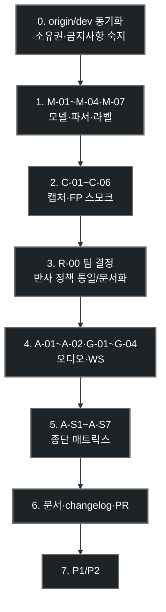

# Android-iOS 정합 체크리스트 및 Gemini 에이전트 작업 지시서

> **작성일**: 2026-07-21
> **버전**: v1.0.0
> **작성 브랜치**: kb (문서 기준선) / **구현 담당**: Android (dg 계열 권장)
> **설계 기준**: [`ios_android_bifurcation_contract.md`](ios_android_bifurcation_contract.md), [`ondevice_inference_engine_isolation_plan.md`](ondevice_inference_engine_isolation_plan.md), [`../design/api_specification.md`](../design/api_specification.md), [`../ops/environment_variables.md`](../ops/environment_variables.md), [`../ops/wireless_test_guide.md`](../ops/wireless_test_guide.md)
> **인수인계**: [`android_handoff_kb_to_dg.md`](android_handoff_kb_to_dg.md) (2026-07-21 실기기 검증·미푸시 커밋·iOS 영향·잔여 P0)
> **모델 기준선**: 서버·온디바이스 공통 `object_detection260714.pt` / `segmentation260714.pt` (iOS=CoreML export, Android=TFLite export)
> **목적**: Mac/iOS 중심 검증과 동등한 Android 실기기 종단 품질을 확보하기 위한 P0~P2 체크리스트와, Gemini 등 Android 담당 에이전트용 실행 지시

---

## 0. Gemini / Android 에이전트용 작업 지시 (복붙용)

아래 블록을 Gemini(또는 Android 담당 에이전트) 세션 첫 메시지로 그대로 사용할 수 있습니다.

```text
당신은 Minchodan 프로젝트의 Android 정합 담당 에이전트다.
저장소 루트에서 아래를 순서대로 읽고 따른다.

1) AGENTS.md, SKILLS.md
2) docs/mobile/ios_android_bifurcation_contract.md (파일 소유권·비협상 원칙)
3) docs/mobile/android_handoff_kb_to_dg.md (kb 인수인계: 실측 실패 원인·미푸시 커밋·CameraView iOS 영향)
4) docs/mobile/android_ios_parity_checklist.md (본 문서, 단일 작업 기준)
5) docs/design/api_specification.md (WS 계약)
6) docs/ops/environment_variables.md 의 YOLO26N_* / EXPO_PUBLIC_* 관련 절

작업 브랜치: dg (또는 팀 합의된 Android 개인 브랜치). main 직접 push 금지.
기준선: 최신 origin/dev 를 먼저 merge/rebase 한 뒤 작업한다. stale dg2 위에 단독 작업하지 않는다.
주의: 인수인계서의 "P0 통과" 주장은 기각됨. 네트워크(Tailscale/Wi-Fi)·Metro 번들부터 복구한 뒤 A-S1~S7을 다시 실측한다.

목표: Android 실기기가 iOS와 같은 서버·모델·이중경로·오디오 우선순위 계약을 만족하도록
본 문서 §2~§9 의 P0 항목을 닫는다. P1/P2는 P0 완료 보고 후 진행.

금지:
- server/detection/gates/ 에 LLM/RAG/TTS import
- docker compose down -v, 원격 DB DROP/TRUNCATE
- .env 전체 내용 출력/커밋
- 공유 파일(CameraView.tsx, tfliteDetector.ts, api types, docker-compose, requirements.txt,
  .env.example)을 iOS 합의 없이 임의 변경
- .tflite 자산만 바꾸거나 파서(attrsPerBox)만 바꾸는 단독 커밋 (반드시 같은 커밋)

필수 산출:
- 코드/문서 변경
- docs/changelogs/dg.md (또는 담당 이니셜) 엔트리
- §10 검증 매트릭스 A-S1~A-S7 실측 결과 표
- 완료 시 PR 또는 merge 요청 요약(한국어)

착수 순서: §11 권장 실행 순서 P0 만.
첫 응답에서 (a) 현재 브랜치 tip, (b) 서버 YOLO 경로, (c) 번들 tflite shape 실측,
(d) CameraView Android 로컬반사 정책에 대한 팀 결정 질문을 보고한 뒤 P0-1부터 구현한다.
```

---

## 1. 배경과 범위

### 1.1 현황 요약 (2026-07-21 코드 실측)

| 영역 | iOS | Android | 정합 상태 |
| :--- | :--- | :--- | :--- |
| 서버 WS / 이중 경로 계약 | 실기기 통합 테스트 진행 | 동일 앱·동일 서버 사용 가능 | 계약 공유, 검증 깊이 비대칭 |
| 온디바이스 엔진 | CoreML 우선 (`CoreMLInferenceBridge`) | TFLite만 (`localDetectorSelect.android.ts`) | 원본 `.pt` 통일 목표, 런타임 다름 |
| Frame Processor | `ReflexFrameProcessorPlugin.swift` | `ReflexFrameProcessorPlugin.kt` 존재 | **구현됨**. 계약서 구절 "미착수"는 stale → 본 문서로 대체 |
| 모델 기준선 | `*260714` → mlpackage | `*260714` → tflite (07-15 자산) | export 스크립트 정합. **실기기 shape 재검증 필요** |
| 로컬 반사 정책 | 서버 연동 중심 | 서버 정상 시 온디바이스 경보 억제 (`CameraView` Platform 분기) | **정책 통일 또는 의도적 차이 문서화 필요 (P0)** |
| LiDAR 실거리 | `DepthProbeBridge` | 없음 | 대칭 불가 (휴리스틱만) |
| AEC | AVAudioSession voiceChat | `AudioSessionBridgeModule` MODE_IN_COMMUNICATION | 코드 있음. 주석 "no-op"은 stale. **실측 필요** |
| 통합 테스트 스킬 | iOS/xcodebuild 중심 | 본 체크리스트 + adb/실기기 절차 | Android 절 보강은 P1 |

### 1.2 범위

| 포함 | 제외 |
| :--- | :--- |
| Android 실기기 종단 (캡처·온디바이스·WS·오디오·STT) | CoreML과 TFLite 바이트 단위 동일성 |
| `*260714` 모델·파서·라벨 정합 | LiDAR/ARCore 필수화 (ARCore는 P2 선택) |
| 문서·changelog·검증 매트릭스 | iOS 전용 UI/번들 ID 강제 통일 |
| 공유 파일 변경 시 계약서 §2 준수 | `docker compose down -v`, 원격 DB DDL |

### 1.3 성공 정의

Android 실기기에서 §10 A-S1~A-S7이 Pass이고, 서버 가중치·온디바이스 원본이 `*260714`이며, 로컬 반사 정책이 팀 결정(통일 또는 문서화된 의도적 차이)과 일치하면 **P0 완료**로 본다.

---

## 2. 비협상 원칙 (계약서 계승)

상세는 [`ios_android_bifurcation_contract.md`](ios_android_bifurcation_contract.md) §2. 요약만 반복한다.

| # | 원칙 |
| :--- | :--- |
| 1 | 플랫폼 차이는 `.android.ts` / Kotlin으로 **물리 분리**. 공유 파일 내부 `Platform.OS` 확장은 최소화하고, 불가피하면 양측 합의 |
| 2 | 네이티브 기능은 대칭 구현 없이 공유 기본값을 바꾸지 않는다 |
| 3 | WS 메시지 타입은 `api_specification.md` 선행 |
| 4 | `docker-compose*.yml` / `requirements.txt` / `.env.example` 기본값을 로컬 편의로 오염시키지 않는다 |
| 5 | `.tflite`와 `tfliteDetector.ts` 파서는 **같은 커밋**에서만 변경 |

---

## 3. 모델·온디바이스 추론 체크리스트

| ID | 항목 | 통과 기준 | 우선 |
| :--- | :--- | :--- | :--- |
| M-01 | 원본 가중치 | TFLite는 `object_detection260714.pt` / `segmentation260714.pt`에서 export (`scripts/export_tflite.py` / `export_mobile.py`) | P0 |
| M-02 | det 출력 포맷 | 번들 `object_detection.tflite` 실측 shape가 `[1,33,8400]`(nms=False, channels-first)이고 JS NMS와 일치. (legacy `[1,300,6]`는 폴백만). 불일치 시 **자산+코드 동시** 수정 | P0 |
| M-03 | seg 출력 포맷 | `segmentation.tflite`가 코드의 dense `[1,40,8400]`(또는 문서화된 현행 포맷)과 일치 | P0 |
| M-04 | 클래스 라벨 | 29 OD + 4 surface 이름·순서가 iOS CoreML / 서버 `CLASS_TEXT`와 동일 | P0 |
| M-05 | conf / NMS | 온디바이스 conf·IoU가 Near 경보 체감을 iOS·서버와 과도하게 어긋나지 않음 | P1 |
| M-06 | GPU/CPU 폴백 | `android-gpu` 로드 실패 시 CPU 폴백 로그(`delegate 로드 실패`)·연속 추론 30s 안정 | P1 |
| M-07 | 입력 계약 | Frame Processor → Float32/base64 경로가 `requiresFloat32`와 일치, 첫 프레임 추론 성공 | P0 |
| M-08 | 벤치 로그 | det/seg/total ms 표준 로그 (iOS CoreMLBench와 비교 가능) | P2 |

**관련 파일**: `client/src/inference/tfliteDetector.ts`, `localDetectorSelect.android.ts`, `client/assets/models/yolo26n/*.tflite`, `scripts/export_tflite.py`

---

## 4. 카메라·프레임 캡처 체크리스트

| ID | 항목 | 통과 기준 | 우선 |
| :--- | :--- | :--- | :--- |
| C-01 | FP 플러그인 | `reflexFrameCapture` 등록, 로그에 등록됨, 반사 프레임 유입 | P0 |
| C-02 | 640 크롭·방향 | 손 피사체(손가락 위)로 방향·bbox가 화면과 일치. orientation 메타 오판 시 Image 실측 경로 유지 | P0 |
| C-03 | takePhoto 폴백 | 플러그인 미등록 시에도 이중 FPS 유지, 오디오 세션 파괴 없음 | P1 |
| C-04 | JPEG WS | binary JPEG 기본, 서버 decode 성공 | P0 |
| C-05 | 이중 스트림 | reflex 8~10fps / cognitive 1~2fps, stream 메타 정확 | P0 |
| C-06 | 권한 | CAMERA / RECORD_AUDIO / LOCATION 런타임 허용·거부 복구 | P0 |

**관련 파일**: `frameCaptureProviderSelect.android.ts`, `ReflexFrameProcessorPlugin.kt`, `useCamera.ts`

---

## 5. 반사 경로 정책 체크리스트 (핵심 결정)

`CameraView.tsx`의 `Platform.OS === "android"` 분기는 서버 연결 정상 시 **온디바이스 반사 경보를 억제**하고, 타임아웃 시에만 pathObstacle + speakFallback을 사용한다.

| ID | 항목 | 통과 기준 | 우선 |
| :--- | :--- | :--- | :--- |
| R-00 | **팀 결정** | (A) iOS와 동일하게 로컬 반사 병행으로 통일, 또는 (B) "서버 우선·로컬 백업"을 의도적 차이로 문서 고정. **결정 없이 코드만 바꾸지 말 것** | P0 |
| R-01 | 이중 경보 금지 | 서버 반사/인지와 로컬이 동시에 같은 Near를 울리지 않음 | P0 |
| R-02 | 타임아웃 폴백 | 서버 disconnect 시 A-S5 정책대로만 동작 | P0 |
| R-03 | 오디오 우선순위 | STT > Near 비프/햅틱 > … 공유 `audioEngine` 규약 | P0 |
| R-04 | 긴급 비프 전용 | 짧은 간격에서 클립 생략 정책 iOS와 동일 | P1 |
| R-05 | 스테레오 패닝 | 좌/우 객체에 패닝 유효 | P1 |
| R-06 | 억제 채터 | 로컬 streak/억제가 서버 TTL(5s 등)과 충돌해 따닥거리지 않음 | P0 |

**관련 파일**: `client/src/components/CameraView.tsx`, `pathObstacleDetector.ts`, `audioEngine.ts`, `hapticEngine`

---

## 6. 인지 경로 (서버) 체크리스트

| ID | 항목 | 통과 기준 | 우선 |
| :--- | :--- | :--- | :--- |
| G-01 | WS auth | Tailscale/LAN에서 auth_ok, device_id 세션 1 | P0 |
| G-02 | server_detection | bbox가 프리뷰와 정렬 (회전/크롭 회귀 없음) | P0 |
| G-03 | guide TTS | 대기열·선점·위험도순 폐기 정상 | P0 |
| G-04 | detection_control | 탐지 on/off ↔ 서버 `detection_enabled` | P0 |
| G-05 | GPS / nav | realtime_gps·nav_route (해당 시) | P1 |

서버 가중치는 `YOLO26N_OBJECT_DET`/`YOLO26N_SEG` = `*260714.pt` 인지 환경에서 검증한다.

---

## 7. 오디오·STT·전화 체크리스트

| ID | 항목 | 통과 기준 | 우선 |
| :--- | :--- | :--- | :--- |
| A-01 | AEC 실측 | STT 중 비프가 전사에 섞이지 않음. `audioSessionBridge.ts` 상단 "Android no-op" 주석 정정 | P0 |
| A-02 | STT 포맷 | Android `.m4a` 서버 decode·인식 품질 | P0 |
| A-03 | STT hold | iOS 전용 최소 초와 체감 정합 또는 Android 기준 문서화 | P1 |
| A-04 | TTS 보이스 | compact/robot 배제, 한국어 자연도 | P1 |
| A-05 | 전화 연결 | `PhoneDialBridgeModule` / ACTION_CALL 권한·실패 UX | P1 |

---

## 8. 거리·깊이 (의도적 비대칭)

| ID | 항목 | 처리 | 우선 |
| :--- | :--- | :--- | :--- |
| D-01 | LiDAR | 대칭 불가. UI/로그에 추정 거리임 명시 | P1 |
| D-02 | distanceMeters? | 없으면 휴리스틱. 필드 계약 유지 | P0 |
| D-03 | ARCore Depth | 선택. `depthProbe` 인터페이스 유지 시에만 | P2 |

---

## 9. 네트워크·빌드·문서

| ID | 항목 | 통과 기준 | 우선 |
| :--- | :--- | :--- | :--- |
| N-01 | Tailscale | host/device ping, `:8000`·`:8081` Tailscale IP HTTP 200 | P0 |
| N-02 | cleartext | LAN/TS 평문 URL과 Android 네트워크 보안 설정 정합 | P0 |
| N-03 | 패키지 ID | `com.minchodan.app` 등 팀 규칙 정리 | P1 |
| N-04 | Mac/Windows 빌드 | `expo run:android` 재현 절차를 Android 계획서 또는 본 문서 부록에 1페이지 | P1 |
| N-05 | APK 모델 번들 | `.tflite` 포함·로드 성공 | P0 |
| N-06 | 계약서 stale | `ios_android_bifurcation_contract.md` §4.5 "미착수" → 구현+검증 상태로 갱신 (본 문서 링크) | P0 |
| N-07 | 통합 테스트 | Android 실기기 절을 스킬 또는 본 문서 §10에 고정 | P1 |
| N-08 | changelog | `docs/changelogs/dg.md` (또는 담당 이니셜) | P0 (완료 시) |

---

## 10. 검증 매트릭스 (Android 실기기)

iOS 통합 테스트와 side-by-side. 결과는 표로 changelog 또는 PR에 첨부.

| ID | 시나리오 | Pass 조건 | P0 |
| :--- | :--- | :--- | :--- |
| A-S1 | 기동 → Metro → WS auth_ok | 60s 내 | 예 |
| A-S2 | 탐지 ON → 인지 프레임 서버 수신 | decode 에러 0 | 예 |
| A-S3 | Near 정면 → 비프+햅틱 | <300ms 체감, 이중 경보 없음 | 예 |
| A-S4 | Medium → TTS 가이드 | 방향 포함, 대기열 정상 | 예 |
| A-S5 | 서버 강제 종료 → 로컬 폴백 | R-00 정책대로만 | 예 |
| A-S6 | STT 명령 | 에코 오탐 없음 | 예 |
| A-S7 | 노면 caution/roadway | 서버·로컬 라벨 정합 | 예 |
| A-S8 | 장시간 10분 | 메모리·오디오 고착 없음 | P1 |
| A-S9 | Tailscale 외부망 | Metro+API 200, 흰 화면 없음 | P0 (외부 테스트 시) |
| A-S10 | 세로 고정·크롭 | bbox 방향 정상 | 예 |

병합 전 추가 확인 (`bifurcation_contract` §8): merge-tree, attrsPerBox↔자산, requirements/docker 오염 없음.

---

## 11. 권장 실행 순서



---

## 12. 맞추지 않는 것 (명시적 제외)

| 항목 | 이유 |
| :--- | :--- |
| CoreML 바이너리 == TFLite 바이너리 | 포맷 상이. 동일 `.pt` 원본이면 충분 |
| LiDAR | 하드웨어 부재 |
| iOS Xcode 통합 테스트 스킬 그대로 복제 | 도구 상이. Android는 adb/실기기 절차 |
| iOS bundle id 강제 | 패키징 정책이 다름 |

---

## 13. 참고 경로 빠른표

| 용도 | 경로 |
| :--- | :--- |
| Android 추론 선택 | `client/src/inference/localDetectorSelect.android.ts` |
| TFLite 파서 | `client/src/inference/tfliteDetector.ts` |
| Android 캡처 | `client/src/services/frameCaptureProviderSelect.android.ts` |
| FP 네이티브 | `client/android/app/src/main/java/com/minchodan/app/ReflexFrameProcessorPlugin.kt` |
| 로컬 반사 분기 | `client/src/components/CameraView.tsx` (android 블록) |
| AEC | `client/src/services/audioSessionBridge.ts`, `AudioSessionBridgeModule.kt` |
| TFLite 자산 | `client/assets/models/yolo26n/*.tflite` |
| export | `scripts/export_tflite.py`, `scripts/export_mobile.py` |
| 이원화 계약 | [`ios_android_bifurcation_contract.md`](ios_android_bifurcation_contract.md) |

---

## 14. 변경 이력

| 버전 | 일자 | 내용 |
| :--- | :--- | :--- |
| v1.0.0 | 2026-07-21 | 초판. Gemini/Android 에이전트 지시문 + P0~P2 체크리스트 + A-S 매트릭스. kb 세션 분석 반영 (FP 구현됨·로컬반사 정책 갭·260714 기준선) |
