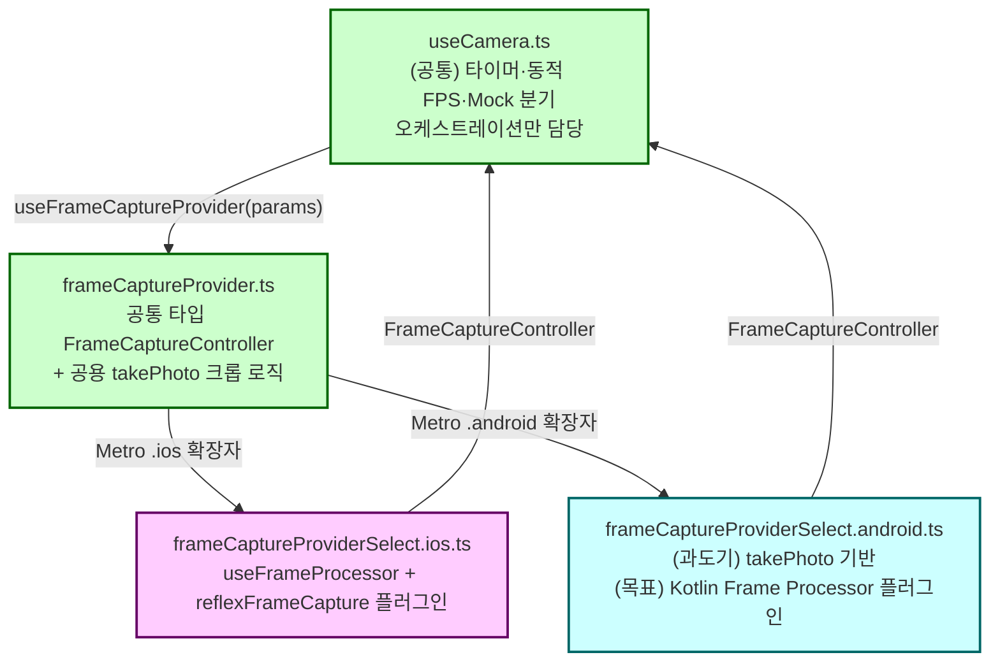

# iOS/Android 클라이언트 이원화 및 서버 정합성 통합 계약서

> **작성일**: 2026-07-10
> **버전**: v1.1.1 (2026-07-11 §3 소유권 매트릭스에 iOS 오디오 세션(AEC) 브릿지 `AudioSessionBridge.swift/.mm`(iOS 전용)과 TS 래퍼 `audioSessionBridge.ts`(공유 계약, Android no-op) 등재 + 이전 v1.1.0 이력 유지: 2026-07-10 §4 카메라 캡처 계층 iOS 측 구현 완료 반영 - 실제 파일명을 `frameCaptureProvider*.ts`로 확정, §7.3 NETWORK_MODE 플래그 구현 완료)
> **설계 기준**: [`docs/mobile/ondevice_inference_engine_isolation_plan.md`](ondevice_inference_engine_isolation_plan.md)(추론 계층 격리, 본 문서의 §5는 이 문서를 계승·확정한다), [`docs/design/api_specification.md`](../design/api_specification.md)(WS 프로토콜 단일 명세)
> **근거**: kb 브랜치(iOS 작업, `bbfe812` 기준) ↔ dg2 브랜치(Android 작업, `249f51a` 기준) `git merge-tree` 실병합 시뮬레이션 결과 (2026-07-10 분석)
> **적용 대상**: iOS 작업자(kb 계열 브랜치)와 Android 작업자(dg2 계열 브랜치)는 신규 작업 착수 전 본 문서를 먼저 읽고, 본 문서가 정의한 파일 소유권과 인터페이스 계약을 벗어나는 변경을 하지 않는다.

---

## 1. 배경 및 목적

kb와 dg2는 같은 조상 커밋(`62b5aa4`)에서 독립적으로 분기해, iOS는 반사 캡처 리팩토링(Frame Processor 전환)을, Android는 실기기 최초 연동을 각각 진행했다. `git merge-tree kb origin/dg2`로 실제 병합을 시뮬레이션한 결과는 다음과 같다.

| 구분 | 파일 | 결과 |
| --- | --- | --- |
| **텍스트 충돌** | `.env.example`, `docs/ops/environment_variables.md`, `server/tts/tts_service.py` | TTS 엔진 기본값(`supertonic` vs `pyttsx3`)이 정면 충돌 |
| **조용히 깨짐 (git 충돌 미표시)** | `client/src/inference/tfliteDetector.ts` | Android 쪽 채널 수 변경(`6`)이 그대로 승리하지만 번들 모델은 33채널 그대로라 파싱 오류 |
| **조용히 깨짐** | `docker/docker-compose.yml` | Android 쪽에서 주석 처리한 `ollama` 서비스가 그대로 승리 → RAG/로컬 LLM 인프라 소실 |
| **조용히 깨짐** | `requirements.txt` | Windows 전용 `pywin32`가 마커 없이 합류 → Linux/macOS Docker 빌드 실패 |
| **구조적 결함 (git과 무관)** | `client/src/hooks/useCamera.ts`, `client/ios/ReflexFrameProcessorPlugin.swift` | kb의 신규 기본 캡처 경로(`useFrameProcessor`)가 iOS 네이티브 플러그인만 있고 Android 대응이 없어, 병합 여부와 무관하게 Android 반사 캡처가 무음 실패 상태 |

이 결과가 보여주는 근본 문제는 **"공유 파일을 두 사람이 각자 판단으로 동시에 고친다"** 는 작업 방식 자체다. 본 문서는 이를 구조적으로 막기 위해 (1) 플랫폼 분기 지점을 물리적으로 분리하는 파일 소유권 규칙, (2) 두 구현체가 반드시 지켜야 하는 인터페이스/프로토콜 계약, (3) 공유 인프라 설정의 단일 진실 공급원을 정의한다.

---

## 2. 비협상 원칙

| # | 원칙 | 근거 |
| --- | --- | --- |
| 1 | 플랫폼별로 동작이 달라야 하는 코드는 반드시 Metro의 `.ios.ts` / `.android.ts` 확장자 분기로 **파일을 물리 분리**한다. 공유 파일 안에서 `Platform.OS` 런타임 분기로 처리하지 않는다 | `client/src/inference/localDetectorSelect.ios.ts`/`.android.ts`가 이미 이 패턴으로 정상 작동 중이며 병합 충돌이 발생하지 않았다. 반대로 `useCamera.ts`(공유 파일 내부 분기)는 이번 시뮬레이션에서 유일하게 구조적으로 깨진 지점이다 |
| 2 | 네이티브 코드가 필요한 기능은 **양 플랫폼에 대칭 구현이 있어야** 공유 코드의 기본값을 바꿀 수 있다. 한쪽 플랫폼 구현이 없는 상태로 공유 상수 기본값(`CAPTURE_ENGINE` 등)을 변경 금지 | kb가 Android 구현 없이 `CAPTURE_ENGINE` 전역 기본값을 `frameProcessor`로 바꿔 Android가 무음 실패했다 |
| 3 | 서버가 보내거나 받는 모든 WS 메시지 타입은 **`docs/design/api_specification.md`에 먼저 반영**되어야 하며, 클라이언트 타입(`client/src/types/detection.ts`)과 서버 스키마는 이 문서만을 유일한 진실 공급원으로 삼는다 | dg2가 추가한 `server_detection` 타입이 문서화 없이 코드에만 존재해, iOS 작업자가 그 존재조차 모른 채 같은 파일(`CameraView.tsx`)을 수정할 위험이 있었다 |
| 4 | 공유 인프라 설정(`.env.example` 기본값, `docker-compose.yml` 서비스 목록, `requirements.txt`)은 로컬 개발 편의를 위해 **한쪽이 임의로 끄거나 바꾸지 않는다**. 필요하면 별도 override 파일로 분리한다 | dg2가 로컬 macOS/Windows 개발 편의를 위해 `ollama` 서비스를 통째로 주석 처리해 팀 공용 인프라 정의가 오염됐다 |
| 5 | 모델 자산(`.tflite`/`.mlpackage`/`.pt`)과 그것을 파싱하는 코드의 출력 포맷은 **§5의 표가 유일 기준**이며, 코드만 바꾸고 자산을 재수출하지 않는 변경, 혹은 자산만 바꾸고 코드를 갱신하지 않는 변경은 금지한다 | dg2가 파싱 코드만 33→6으로 바꾸고 실제 `.tflite` 자산은 재수출하지 않아 두 산출물이 서로 다른 포맷을 가정하게 됐다 |

---

## 3. 파일 소유권 매트릭스

| 계층 | 경로 | 소유 | 변경 규칙 |
| --- | --- | --- | --- |
| 카메라 캡처 오케스트레이션 | `client/src/hooks/useCamera.ts` | **공유** (§4 인터페이스로 축소 완료) | 인터페이스 시그니처 변경 시 양측 합의 필수. 구현 세부는 건드리지 않는다 |
| 카메라 캡처 공통 인터페이스·로직 | `client/src/services/frameCaptureProvider.ts` | 공유 (계약) | `FrameCaptureController`/`FrameData` 타입 변경 시 양측 합의 필수 |
| 카메라 캡처 실구현 (완료) | `client/src/services/frameCaptureProviderSelect.ios.ts` | iOS 전용 | iOS 작업자 단독 소유 |
| 카메라 캡처 실구현 (과도기) | `client/src/services/frameCaptureProviderSelect.android.ts` | Android 전용 | Android 작업자 단독 소유 |
| iOS 네이티브 Frame Processor | `client/ios/ReflexFrameProcessorPlugin.swift`, `.m` | iOS 전용 | iOS 작업자 단독 소유 |
| iOS 오디오 세션(AEC) 브릿지 | `client/ios/AudioSessionBridge.swift`, `.mm` | iOS 전용 | iOS 작업자 단독 소유. STT 녹음 구간 voiceChat(AEC) 전환 (2026-07-11 신규) |
| 오디오 세션 TS 래퍼 | `client/src/services/audioSessionBridge.ts` | 공유 (계약) | iOS는 네이티브 호출, Android는 no-op(null 반환). Android AEC(AcousticEchoCanceler) 구현 시 인터페이스(`setVoiceProcessing`/`getSessionInfo`) 유지 필수 |
| Android 네이티브 Frame Processor (신규 필요) | `client/android/app/src/main/java/.../ReflexFrameProcessorPlugin.kt` | Android 전용 | Android 작업자 단독 소유 |
| 온디바이스 추론 인터페이스 | `client/src/inference/localDetector.ts`, `types.ts` | 공유 (계약) | §5 표 변경 시에만, 양측 합의 필수 |
| 온디바이스 추론 iOS 구현 | `client/src/inference/localDetectorSelect.ios.ts` | iOS 전용 | 이미 정상 분리됨. 유지 |
| 온디바이스 추론 Android 구현 | `client/src/inference/localDetectorSelect.android.ts` | Android 전용 | 이미 정상 분리됨. 유지 |
| TFLite 공용 파서 | `client/src/inference/tfliteDetector.ts` | **공유** | §5 표의 `attrsPerBox`를 변경하려면 반드시 같은 커밋에서 `client/assets/models/yolo26n/*.tflite`도 재수출·교체한다 |
| WS 메시지 타입 | `client/src/types/detection.ts` | 공유 (계약) | `docs/design/api_specification.md` 갱신이 선행되지 않으면 타입 추가 금지 |
| WS 프로토콜 명세 | `docs/design/api_specification.md` | 공유 (계약 원본) | 신규 메시지 타입은 이 문서에 먼저 등재 |
| 서버 탐지 파이프라인 | `server/detection/*.py` | 공유 | 반환 시그니처 변경 시 `tests/test_detection.py` 동반 수정 필수 |
| TTS 엔진 기본값 | `.env.example`, `server/tts/tts_service.py` | 공유 (§7 절차 따름) | §7.1 절차 없이 기본값 변경 금지 |
| Docker 인프라 정의 | `docker/docker-compose.yml`, `docker-compose.macos.yml` | 공유 | 서비스 삭제/주석 처리 금지. 로컬 전용 오버라이드는 §7.2 참조 |
| Python 의존성 | `requirements.txt` | 공유 | OS 전용 패키지는 반드시 `; sys_platform == "..."` 마커 동반 |
| 네트워크 접속 설정 | `client/src/config/index.ts` | 공유 | §7.3 규칙 준수 (하드코딩 금지) |

---

## 4. 카메라 캡처 계층 재설계 (신규, 최우선)

> **진행 상태 (2026-07-10)**: §4.1~§4.4(iOS 측)는 kb 브랜치에 구현·실기기 회귀 테스트 완료. §4.5(Android 네이티브 Frame Processor 플러그인)는 미착수 — 실제 구현 파일명은 문서 초안(`frameCapture.ios.ts` 등)과 달리 `frameCaptureProvider*.ts`로 확정됐다. 아래 내용은 실제 구현에 맞춰 갱신했다.

### 4.1 현재 문제 (해결됨)

`client/src/hooks/useCamera.ts` 448줄 단일 파일 안에 Mock 캡처, `takePhoto()` 레거시 경로, `useFrameProcessor` 신규 경로가 전부 섞여 있었다. 신규 경로는 iOS 네이티브 플러그인(`VisionCameraProxy.initFrameProcessorPlugin("reflexFrameCapture")`)을 호출하는데, 이 이름으로 등록된 네이티브 모듈이 `client/android/`에는 없었다. `CAPTURE_ENGINE`(`client/src/config/capture.ts`)이 플랫폼 구분 없는 전역 상수라, Android에서도 그대로 `"frameProcessor"`가 적용되어 **반사 프레임이 한 장도 캡처되지 않는** 문제가 있었다(크래시는 없음 — null 가드가 조용히 흡수). §4.2~§4.4 구조로 리팩터링해 해결했다.

### 4.2 목표 구조



`localDetector.ts` / `localDetectorSelect.ios.ts` / `localDetectorSelect.android.ts`와 완전히 동일한 패턴이다.

### 4.3 인터페이스 정의 (구현 완료, kb 브랜치 기준)

```typescript
// client/src/services/frameCaptureProvider.ts (공통 — 타입 + 공용 로직 + Metro 진입점)

export interface FrameData {
  float32: Float32Array;
  stream: StreamType;
  base64: string | null;
  jpegBytes: Uint8Array | null;
}

export interface FrameCaptureController {
  /** true면 <Camera>가 frameProcessor(연속 스트림)로 구동돼야 한다. */
  readonly supportsStream: boolean;
  /** supportsStream이 true일 때만 값이 있다. <Camera frameProcessor={...}>에 그대로 전달한다. */
  readonly frameProcessor: unknown | undefined;
  /** 단발 촬영 기반 캡처 (supportsStream=false 플랫폼의 기본 경로, 또는 폴백용). */
  capturePhoto(stream: StreamType): Promise<FrameData | null>;
}

// takePhoto() 기반 크롭 로직(captureViaTakePhoto)도 이 파일에 공용으로 둔다 -
// iOS/Android 모두 react-native-vision-camera의 동일한 단발 촬영 API를 쓰므로
// 크롭·리사이즈 수학은 한 곳에만 둔다. 플랫폼별로 다른 파일 읽기 방식만
// readJpegBytes 콜백으로 각 select 파일에서 주입한다.

export { useFrameCaptureProvider } from "./frameCaptureProviderSelect";
```

```typescript
// client/src/services/frameCaptureProviderSelect.ts (tsc 정적 분석용 기본 폴백)
// Metro 번들러는 빌드 시 항상 .ios.ts/.android.ts를 우선 선택하므로 실제 앱에서는
// 쓰이지 않지만, tsc는 RN의 플랫폼 확장자 분기를 인식하지 못해 이 파일이 필요하다
// (client/src/inference/localDetectorSelect.ts와 동일한 이유). 내용은 Android
// 과도기 구현과 동일한 takePhoto() 기반 안전 기본값.
```

### 4.4 iOS 구현 지침 (완료)

- `frameCaptureProviderSelect.ios.ts`는 훅(`useFrameCaptureProvider`)으로 구현되며, 기존 `useCamera.ts`에 있던 `useFrameProcessor` + `reflexFrameProcessorPlugin` 로직을 그대로 이관했다. `ReflexFrameProcessorPlugin.swift`/`.m`은 변경 없음.
- `supportsStream`은 네이티브 플러그인 등록 여부(`VisionCameraProxy.initFrameProcessorPlugin(...) != null`)로 자동 판정된다(고정값이 아님 - 개발 빌드 미동기화 등으로 플러그인이 없으면 자동으로 `capturePhoto()` 경로로 폴백).
- 실기기 회귀 테스트 완료(2026-07-10): LAN 직결 기준 반사/인지 프레임 정상 수신, 에러 0건, 반사 경보 정상 전송.

### 4.5 Android 구현 지침 (미착수)

**과도기 (구현 완료, kb 브랜치)**: `frameCaptureProviderSelect.android.ts`는 `supportsStream = false`로 선언하고 `takePhoto()` 기반 `capturePhoto()`를 사용한다. dg2 브랜치에서 확인된 크롭/파일읽기 우회(Android 실기기의 `File.bytes()` rejected 에러 우회 - `FileSystem.readAsStringAsync` + 수동 base64 디코드)를 이 파일에 이미 반영해뒀다. dg2의 `Image.getSize()` 기반 크롭 좌표 재계산(orientation 메타데이터 대신 실측 해상도 사용)은 아직 포팅하지 않았다 — 필요 시 Android 작업자가 이 파일 안에서 추가한다.

**목표 (Android 작업자 담당)**: `client/android/app/src/main/java/.../ReflexFrameProcessorPlugin.kt`를 신규 작성해 iOS의 `ReflexFrameProcessorPlugin.swift`와 동일한 이름(`reflexFrameCapture`)·동일한 반환 계약(JPEG base64 문자열)으로 등록한다. 완료되면 `frameCaptureProviderSelect.android.ts`를 iOS 파일과 동일한 훅 구조(`useFrameProcessor` + `VisionCameraProxy`)로 교체하면 된다. react-native-vision-camera의 Android Frame Processor 플러그인 작성 가이드를 따른다(Kotlin, `FrameProcessorPlugin` 상속).

### 4.6 useCamera.ts 리팩터링 (완료)

`useCamera.ts`는 `useFrameCaptureProvider()`가 반환한 `supportsStream` 값에 따라 스트림 루프(`<Camera frameProcessor={...}>`가 구동) 또는 타이머 기반 `capturePhoto()` 루프 중 하나를 선택하는 오케스트레이션만 담당하도록 축소됐다. 동적 FPS 조절, Mock 분기, 반사/인지 비율 계산 로직은 그대로 공유 유지.

### 4.7 CAPTURE_ENGINE 상수 처리 (완료)

전역 `CAPTURE_ENGINE` 상수(`client/src/config/capture.ts`)는 **삭제**됐다. 스트림 지원 여부는 `FrameCaptureController.supportsStream`이 플랫폼별로 자동 결정한다. iOS 롤백이 필요하면 `frameCaptureProviderSelect.ios.ts` 내부에서 `supportsStream`을 임시로 `false`로 바꾸면 된다(파일이 iOS 전용이므로 Android에 영향 없음).

---

## 5. 온디바이스 추론 포맷 계약 확정

`docs/mobile/ondevice_inference_engine_isolation_plan.md` TC-INF-003은 이미 `object_detection` 출력 포맷을 `[1,300,6]`(NMS 내장)으로 목표 스펙에 못박아 두었다. dg2가 `tfliteDetector.ts`의 `attrsPerBox`를 `33`→`6`으로 바꾼 것은 이 기존 설계와 방향이 일치한다 — 문제는 **번들 자산(`client/assets/models/yolo26n/object_detection.tflite`)이 재수출되지 않아 여전히 33채널 raw(NMS-free) 출력을 낸다**는 것뿐이다.

| 항목 | 현재 상태 | 목표 (기존 설계 §4.2 폴백 전략과 별개, TC-INF-003 기준) |
| --- | --- | --- |
| 코드 (`tfliteDetector.ts`) | `attrsPerBox: 33` (kb 현재) / `6`(dg2) | `6` (`[1,300,6]`: x1,y1,x2,y2,score,classId) |
| 자산 (`object_detection.tflite`) | 33채널 raw, NMS-free 익스포트 | `yolo export ... nms=True` 로 재수출한 `[1,300,6]` |
| `segmentation.tflite` | 변경 없음 (`attrsPerBox=38`) | 변경 없음 — TC-INF-003이 seg는 `[1,300,38]`로 별도 명시, dg2도 이 부분은 건드리지 않음 |

**액션 아이템**: `scripts/export_tflite.py`에 `nms=True` 옵션을 추가해 `object_detection.tflite`를 재수출하고, 재수출된 자산과 `attrsPerBox=6`으로의 코드 변경을 **같은 커밋**에 넣는다. 이 작업 전까지는 코드를 `33`으로 유지한다(현재 서버가 실제로 사용하는 `det_best_20260705.pt` 커스텀 가중치도 NMS-free 아키텍처이므로 서버 추론 로직과의 정합성도 함께 고려해야 한다 — 서버는 자체 NMS를 python에서 수행하므로 클라이언트 온디바이스 자산만 별도 재수출 대상이다).

---

## 6. 서버 WS 프로토콜 계약 갱신

dg2가 추가한 `server_detection` 메시지(서버 YOLO/Seg 결과를 BBox 오버레이용으로 단말에 실시간 브로드캐스트)는 실용적인 기능이지만 `docs/design/api_specification.md`에 없다. 정식 반영안:

| 필드 | 타입 | 설명 |
| --- | --- | --- |
| `type` | `"server_detection"` | 신규 메시지 타입 |
| `event_id` | string | 원본 프레임 이벤트 ID |
| `detections` | array | `{model, className, confidence, bbox:{x,y,w,h}}[]`. `surfaces`의 centroid는 서버가 80x80 가상 bbox로 변환해 병합 |
| `ts` | number | 서버 타임스탬프(초) |

**작업 항목**: `docs/design/api_specification.md` §6(인지 경로 메시지) 뒤에 `6.4 server_detection`으로 추가하고, `client/src/types/detection.ts`의 `detections?: any[]`를 위 필드 스키마에 맞는 명시적 타입으로 교체한다(`any[]` 금지, `course_codebase_guide.md` 타입 규율 준수).

---

## 7. 공유 인프라 거버넌스

### 7.1 TTS 엔진 기본값

현재 세 후보가 경쟁 중이다.

| 엔진 | 상태 | 비고 |
| --- | --- | --- |
| `supertonic` | kb 현재 기본값 | 2026-07-09 발음 품질 실측 검증 완료, CLAUDE.md 명시 기준 |
| `piper` | 핫스왑 폴백으로 보존 | 발음 누락 이슈로 대체됨 |
| `pyttsx3` | dg2가 새 기본값으로 제안 | Windows/Linux `espeak` 백엔드, 한국어 발음 품질 미검증. Windows 개발 환경에서 로컬 서버 구동 시 네트워크/GPU 없이도 즉시 동작하는 장점 때문으로 추정 |

이 문서는 **기본값을 강제하지 않는다** — 이건 코드 구조 문제가 아니라 팀이 결정할 제품 품질 트레이드오프다. 다만 절차는 강제한다: 기본값을 바꾸려는 쪽은 (1) 다른 엔진 구현을 삭제하지 않고, (2) `.env.example`/`docs/ops/environment_variables.md`/`server/tts/tts_service.py`의 기본값을 **한 커밋에서 함께** 바꾸고, (3) PR 설명에 발음 품질 비교 근거를 남긴다. 서버가 CPU-only(Windows, GPU 없는 환경)로 구동될 가능성이 있으므로, `pyttsx3`를 **로컬 개발용 저사양 폴백**으로 유지하고 실기기 시연 기본값은 `supertonic`으로 하는 절충안을 권장한다.

### 7.2 Docker 인프라

`docker/docker-compose.yml`, `docker-compose.macos.yml`의 `ollama` 서비스는 삭제·주석 처리 금지(RAG 임베딩·L2 로컬 LLM 폴백이 여기 의존). Gemini 전용으로 가볍게 로컬 구동하고 싶다면 `docker-compose.override.yml`(git-ignore 대상)을 별도로 만들어 개인 환경에서만 `ollama` 서비스를 끄고, 공용 파일은 건드리지 않는다.

### 7.3 네트워크 접속 설정 (`client/src/config/index.ts`, 완료)

`LAN_IP`(로컬 Wi-Fi 직결)와 `NGROK_DOMAIN`(외부망) 두 상수를 **둘 다 유지**하고, `NETWORK_MODE: "lan" | "ngrok"` 플래그로 `WS_URL`을 전환하도록 구현했다(2026-07-10). 어느 한쪽이 이 파일을 손대 상수를 통째로 지우지 않는다. ngrok 고정 도메인(`partake-primer-surround.ngrok-free.dev`)은 무료 티어라 **동시에 한 프로세스만** 터널을 열 수 있다(`ERR_NGROK_334` 충돌 실제 발생 이력 있음) — LTE/외부망 테스트 일정은 팀 채널에서 사전 조율한다.

### 7.4 `requirements.txt` 플랫폼 마커

OS 전용 패키지는 반드시 PEP 508 환경 마커를 동반한다.

```text
pywin32==306; sys_platform == "win32"
```

---

## 8. 병합 전 체크리스트

| 확인 항목 | 통과 기준 |
| --- | --- |
| `git merge-tree <base> <branch>` 재실행 | 텍스트 충돌 0건, 또는 §2 원칙에 따라 사전 조율된 충돌만 존재 |
| Android 반사 캡처 스모크 테스트 | `frameCapture.android.ts` 경로로 최소 1개 이상 `reflex_alert` 또는 `server_detection` 수신 확인 |
| iOS 반사 캡처 스모크 테스트 | 기존과 동일하게 회귀 없는지 확인 |
| `tfliteDetector.ts` `attrsPerBox`와 번들 `.tflite` 자산 포맷 일치 | §5 표 기준 |
| `requirements.txt` | Linux/macOS 대상 `pip install -r requirements.txt --dry-run` 통과 |
| `docker compose config` | `ollama` 서비스가 정의에 존재 |
| `docs/design/api_specification.md` | 클라이언트/서버가 주고받는 모든 `type` 값이 문서에 등재됨 |

---

## 9. 참고 문서

| 문서 | 경로 |
| --- | --- |
| 온디바이스 추론 엔진 격리 설계서 | [`ondevice_inference_engine_isolation_plan.md`](ondevice_inference_engine_isolation_plan.md) |
| API 명세서 | [`../design/api_specification.md`](../design/api_specification.md) |
| 카메라 프레임 캡처 스킬 | [`../../.agents/skills/camera-frame-capture/SKILL.md`](../../.agents/skills/camera-frame-capture/SKILL.md) |
| Git 브랜칭 전략 | [`../ops/git_branching_strategy.md`](../ops/git_branching_strategy.md) |
| 환경 변수 명세서 | [`../ops/environment_variables.md`](../ops/environment_variables.md) |
