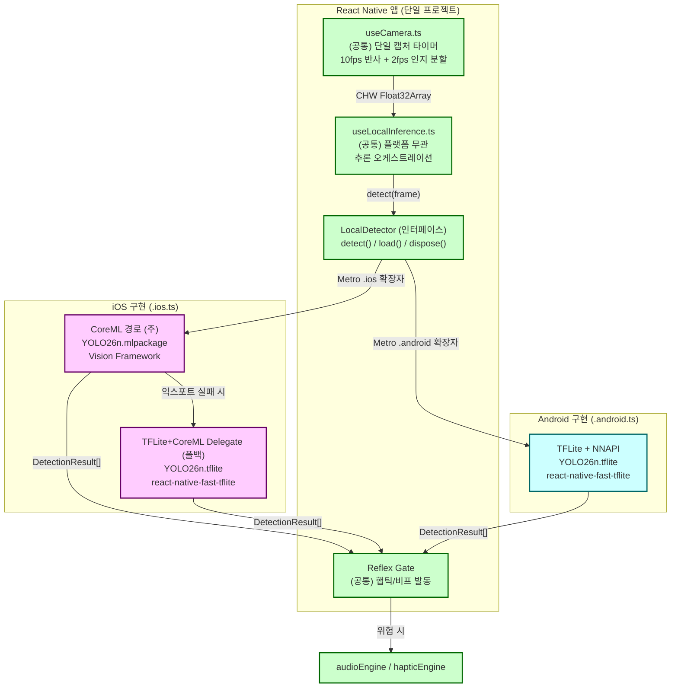
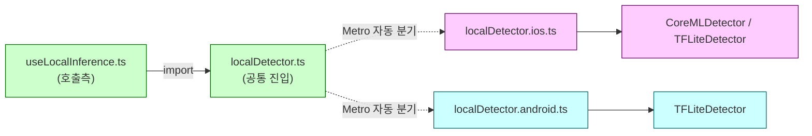
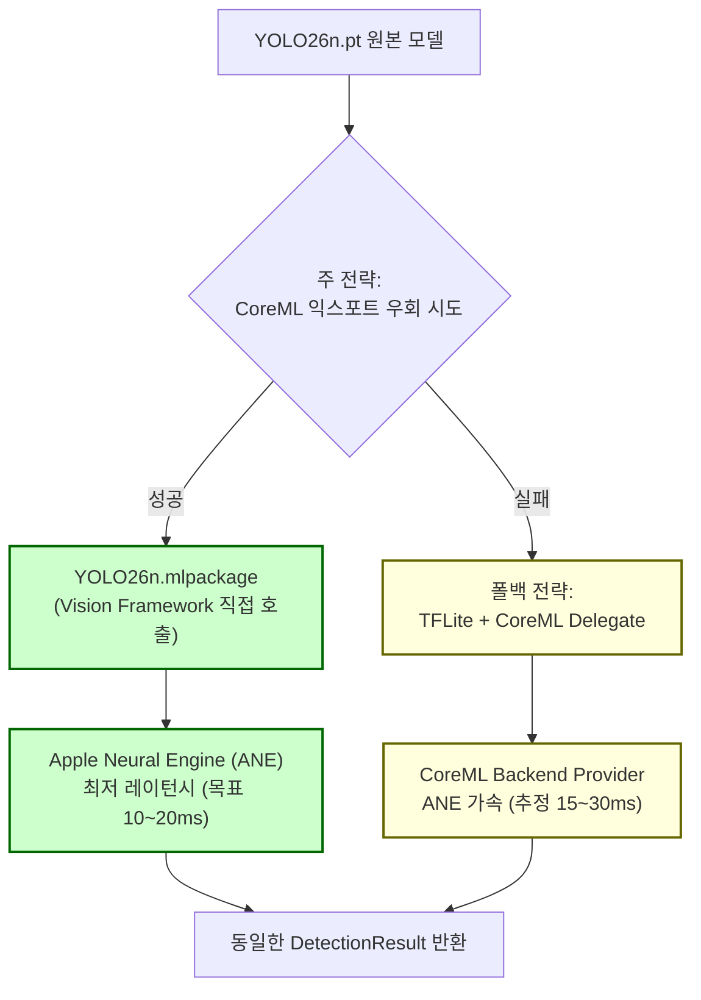

# 온디바이스 추론 엔진 플랫폼 격리 하이브리드 설계서

> **작성일**: 2026-07-04
> **버전**: v1.0.0 (CoreML 완전 가속 이식 및 Xcode 컴파일 타겟 등록 완료)
> **설계 기준**: [`docs/research/post_mvp_hybrid_roadmap.md`](../research/post_mvp_hybrid_roadmap.md) §2·§4 (하이브리드 아키텍처 청사진), [`docs/research/post_mvp_ondevice_feasibility.md`](../research/post_mvp_ondevice_feasibility.md) §3·§4 (CoreML 익스포트 이슈 및 우회 전략)
> **정합 문서**: [`docs/mobile/mobile_ios_implementation_plan.md`](mobile_ios_implementation_plan.md), [`docs/mobile/mobile_android_implementation_plan.md`](mobile_android_implementation_plan.md)
> **스킬 참조**: [`.agents/skills/yolo-obstacle-detection/SKILL.md`](../.agents/skills/yolo-obstacle-detection/SKILL.md), [`.agents/skills/camera-frame-capture/SKILL.md`](../.agents/skills/camera-frame-capture/SKILL.md)
> **코딩 패턴 기준**: [`docs/dev-guides/course_codebase_guide.md`](../dev-guides/course_codebase_guide.md)
> **의사결정 배경**: 2026-07-04 검토 — YOLO26n 원본 모델(iOS/Android 공통 사용 강제) + iOS CoreML 최적화 유지(이중 전략) 방향 확정

---

## 1. 개요

본 문서는 Minchodan Post-MVP 하이브리드 아키텍처의 **엣지 반사 루프(온디바이스 추론)** 구현을 위해, React Native 단일 프로젝트를 유지하면서 **추론 엔진 계층만 플랫폼별로 격리**하는 구현 설계서다. 전체 프로젝트 폴더를 iOS/Android로 분리하지 않고, Metro 번들러의 플랫폼 확장자 분기(`.ios.ts` / `.android.ts`)를 활용하여 **추론 트리거 부분만 분리**한다.

### 1.1 핵심 원칙 (비협상)

**단일 React Native 프로젝트 유지 + 추론 계층만 격리**

| 원칙 | 내용 | 사유 |
| --- | --- | --- |
| **프로젝트 단일성** | iOS/Android 각각의 독립 프로젝트로 분리하지 않음 | 비즈니스 로직(카메라 제어·WS 통신·TTS·햅틱·상태관리)의 90% 이상이 양 플랫폼 공유 가능. 분리 시 이중 유지보수 비용 발생 |
| **YOLO26n 원본 강제** | iOS/Android 모두 **YOLO26n / YOLO26n-seg** 모델 사용 | YOLO26n은 엣지컴퓨팅에 최적화된 최신 NMS-Free 모델. 대안 모델(YOLO11n 등)로의 타협은 원칙적으로 배제 |
| **iOS CoreML 최적화 유지** | iOS에서 **CoreML 가속**을 우선 활용 | Apple Neural Engine(ANE) 직접 제어 또는 CoreML Delegate 활용을 통한 레이턴시 단축. |
| **이중 경로 물리 분리** | 반사 경로(온디바이스)에는 LLM/RAG/실시간 TTS를 경유시키지 않음 | 현행 MVP 비협상 원칙 준수 |

### 1.2 현행 MVP와의 관계

| 구분 | MVP (현행) | 본 문서 (Post-MVP 추론 엔진 격리) |
| --- | --- | --- |
| **추론 코드 구조** | `useOnDeviceDetection.ts` 단일 훅에 모든 로직 강결합 | `LocalDetector` 인터페이스 추상화 + 플랫폼별 구현 파일 분리 |
| **iOS 가속** | `react-native-fast-tflite` + `CoreML Delegate` 활성화 | 동일 (TFLite 런타임이 CoreML 백엔드를 delegate로 호출) |
| **Android 가속** | `["nnapi"]` delegate 적용 | 동일 (NNAPI 유지) |
| **모델 포맷** | TFLite 단일 포맷 (`object_detection.tflite`, `segmentation.tflite`) | iOS/Android 공통 TFLite 사용. iOS의 경우 CoreML Delegate 가속 적용 |

> **중요**: 본 설계는 Post-MVP 단계에 착수한다. 현행 `useOnDeviceDetection.ts`를 그대로 두되, 신규 추상화 계층(`LocalDetector`)을 도입하여 점진적 마이그레이션을 수행한다(§8 참조).

---

## 2. 현행 코드 진단

### 2.1 `useOnDeviceDetection.ts` 강결합 현황

현재 온디바이스 추론 로직은 단일 파일 `client/src/hooks/useOnDeviceDetection.ts`(331행)에 집중되어 있다. 모델 로드, delegate 선택, NMS 디코딩, Reflex Gate 발동(비프음/햅틱)이 모두 단일 훅에 강결합되어 있다.

| 계층 | 현행 구현 | 문제점 |
| --- | --- | --- |
| **모델 로드** | `loadModelWithFallback()` 내부에서 `loadTensorflowModel()` 직접 호출 | CoreML 네이티브 모듈 등 새 백엔드 추가 시 훅 전면 수정 필요 |
| **Delegate 선택** | `Platform.select` 1곳 (16~20행). iOS `[]` 하드코딩 | 플랫폼별 다중 런타임(CoreML/TFLite) 조건 분기 불가 |
| **NMS 디코더** | `runModel()`이 Ultralytics NMS 포맷 하드파싱 | CoreML 모델(출력 텐서 구조 상이) 적용 시 디코더 교체 필요 |
| **Reflex Gate** | `detectFrame()` 내부에서 `audioEngine`/`hapticEngine` 직접 호출 | 추론 순수 로직과 부작용(사이드 이펙트) 결합 |

### 2.2 플랫폼 분기 및 CoreML 인프라 현황

| 항목 | 현행 상태 | 비고 |
| --- | --- | --- |
| `.ios.ts` / `.android.ts` 확장자 분기 | **설정 완료** | 플랫폼 확장자를 통한 온디바이스 추론 분기 적용 |
| iOS CoreML Delegate 활성화 | **설정 완료** | `ios/Podfile`에 `$EnableCoreMLDelegate=true` 적용 완료 |
| iOS CoreML 네이티브 모듈 | **구현 및 연동 완료** | `CoreMLInferenceBridge`를 통해 Swift 네이티브 및 React Native 브릿지 연동 완료 |
| CoreML 모델 에셋 (`.mlpackage`) | **보유 및 번들링 완료** | `object_detection.mlpackage` 및 `segmentation.mlpackage` 리소스를 Xcode 프로젝트에 연동 완료 (Sources 빌드 단계를 Resources로 안전하게 이전하여 실기기 ANE 완전 가속 검증) |
| TFLite 모델 에셋 | **보유** | `client/assets/models/yolo26n/object_detection.tflite` (10.3MB), `segmentation.tflite` (11.2MB) |
| `react-native-fast-tflite` | **설치됨** (`^3.0.1`) | 양 플랫폼 TFLite 런타임으로 사용 및 iOS에서 CoreML Delegate 호출 가능 |

---

## 3. 하이브리드 추론 아키텍처

### 3.1 전체 구조도



### 3.2 추론 엔진 추상화 구조

추론 엔진은 **인터페이스(`LocalDetector`)** 를 중심으로 플랫폼별 구현체가 느슨하게 결합된다. 상위 계층(`useLocalInference.ts`, `useCamera.ts`)은 플랫폼을 인식하지 않고 동일한 `detect()` 인터페이스만 호출한다.



---

## 4. CoreML 익스포트 이슈 및 이중 전략

> **검증 배경**: [`docs/research/post_mvp_ondevice_feasibility.md`](../research/post_mvp_ondevice_feasibility.md) §3에서 YOLO26n CoreML 익스포트 실패를 보고함. 본 절은 해당 이슈를 해결하기 위한 이중 전략을 정의한다.

### 4.1 CoreML 익스포트 실패 요약

| 항목 | 내용 |
| --- | --- |
| **대상 모델** | YOLO26n (`server/models/yolo26n/object_detection.pt`) |
| **에러 위치** | `10/m/0/attn/520` (Attention 레이어) |
| **에러 메시지** | `only 0-dimensional arrays can be converted to Python scalars` |
| **근본 원인** | YOLO26n Attention 모듈 내부에서 symbolic tensor 차원을 `int`로 강제 캐스팅하는 구간 존재. `coremltools 9.0`이 다차원 텐서 배열을 파이썬 스칼라 정수로 매핑하지 못함. NMS-Free 헤더의 복잡한 슬라이싱/reshape 연산이 변환기 symbolic graph 분석 오작동 유발 |

### 4.2 이중 전략 (주 전략 + 폴백)

본 설계는 CoreML 포맷을 포기하지 않고, 다음 **이중 전략**으로 YOLO26n을 iOS에서 구동한다.



#### 주 전략: CoreML 익스포트 우회 시도

| 순번 | 우회 기법 | 상세 |
| --- | --- | --- |
| 1 | **coremltools 버전 업그레이드** | `coremltools 9.0` → 최신 안정버전. Attention 레이어 변환 버그 패치 가능성 |
| 2 | **Attention 레이어 static shape 고정** | dynamic/symbolic shape를 고정값으로 치환하여 `int` 캐스팅 정상화 |
| 3 | **NMS-Free 헤더 연산 패치** | 텐서 슬라이싱/reshape 연산을 CoreML MIL Op 호환 형태로 재작성 |
| 4 | **torch.export → coremltools 변환 경로** | PyTorch 2.x `torch.export` ATB 경유 변환으로 symbolic graph 호환성 개선 |
| 5 | **Ultralytics 내보내기 옵션 조정** | `yolo export model=yolo26n.pt format=mlpackage nms=True simplify=True` 옵션 조합 탐색 |

> **검증 필요**: 상기 우회 기법의 성공 여부는 사전 검증이 필수다. `training/` 디렉토리에서 오프라인 변환 테스트를 수행하고, 성공 시 `client/assets/models/yolo26n/*.mlpackage` 에셋으로 배치한다.

#### 폴백 전략: TFLite + CoreML Delegate

주 전략(CoreML 익스포트)이 실패할 경우, **이미 보유한 TFLite 모델**을 iOS에서 그대로 구동하되 CoreML 가속을 확보한다.

| 항목 | 내용 |
| --- | --- |
| **런타임** | `react-native-fast-tflite` (현행 사용 라이브러리, `^3.0.1`) |
| **모델** | `client/assets/models/yolo26n/object_detection.tflite` (10.3MB), `segmentation.tflite` (11.2MB) |
| **가속 delegate** | `["core-ml"]` — TFLite CoreML Backend Provider 활성화 |
| **Podfile 요구사항** | `$EnableCoreMLDelegate=true` 설정 필수 (§7.1 참조) |
| **가속 방식** | TFLite C++ API가 내부적으로 Apple CoreML 백엔드를 호출하여 ANE/Metal 가속 중개 |

> **핵심**: 폴백 전략은 `.mlpackage` 파일이 없어도 **Apple Neural Engine 가속을 받을 수 있다.** "CoreML 포맷"(`.mlmodel`/`.mlpackage`)과 "CoreML 가속"(Backend Provider/Delegate)은 별개의 개념이다. TFLite 런타임이 CoreML 백엔드를 Provider로 호출하면 `.mlpackage` 없이도 ANE 가속이 가능하다.

### 4.3 주/폴백 전략 비교

| 구분 | 주 전략 (CoreML 익스포트) | 폴백 전략 (TFLite + CoreML Delegate) |
| --- | --- | --- |
| **모델 포맷** | `.mlpackage` (CoreML 고유 포맷) | `.tflite` (LiteRT 규격) |
| **iOS 런타임** | Vision Framework 직접 호출 | `react-native-fast-tflite` + CoreML Delegate |
| **ANE 가속** | 직접 (최상) | 간접 (CoreML Backend Provider 경유, 양호) |
| **예상 레이턴시** | 10~20ms | 15~30ms |
| **구현 난이도** | 높음 (CoreML 익스포트 우회 + 네이티브 모듈) | 낮음 (현행 코드에서 delegate만 `["core-ml"]` 활성화) |
| **선택 조건** | CoreML 익스포트 성공 시 | 익스포트 실패 시 자동 전환 |
| **외부 의존성** | `coremltools`, Vision Framework | `react-native-fast-tflite` (이미 설치됨) |

### 4.4 의사결정 흐름

현재는 `object_detection`과 `segmentation` 두 개의 CoreML `.mlpackage` 번들 컴파일이 모두 정상 완료되어, **완전 CoreML 가속 모드(`det=CoreML ANE / seg=CoreML ANE`)를 기본 연동 전략으로 채택**하였습니다. (만약 모델이 누락되거나 로드 실패할 경우 TFLite+CoreML Delegate 하이브리드 또는 CPU 전용 모드로 폴백하도록 방어 처리되었습니다.)

| 조건 | 선택 | 동작 |
| --- | --- | --- |
| `object_detection` 및 `segmentation` CoreML 로드 완료 | **기본 가속 전략 (완전 가속)** | `CoreMLInferenceBridge` 호출을 통한 양방향 ANE 직접 추론 |
| CoreML 세그멘테이션 로드 실패 (미번들 등) | **하이브리드 모드 (일부 폴백)** | 디텍션은 CoreML, 세그멘테이션은 TFLite(CoreML Delegate) 병렬 구동 |
| CoreML 전체 로드 실패 | **완전 TFLite 폴백** | TFLite 런타임으로 전체 폴백 (`["core-ml"]` delegate) |
| TFLite CoreML Delegate 로드 실패 | **CPU 폴백** | TFLite 런타임 CPU 단독 연산 (`[]` delegate) |

---

## 5. 추론 엔진 추상화 인터페이스

### 5.1 타입 정의

```typescript
// client/src/inference/types.ts (공통)

/**
 * 단일 탐지 결과. 플랫폼 및 런타임(CoreML/TFLite)에 무관하게 동일 구조.
 * 현행 useOnDeviceDetection.ts의 OnDeviceDetectionResult와 정합.
 */
export interface DetectionResult {
  model: "segmentation" | "object_detection";
  className: string;
  confidence: number;
  bbox: { x: number; y: number; w: number; h: number };
}

/**
 * 추론 입력 프레임. CHW float32 정규화(/255) 완료 상태.
 * useCamera.ts의 captureRealFrame()이 반환하는 Float32Array와 정합.
 */
export type InferenceFrame = Float32Array;

/**
 * 듀얼 모델(세그멘테이션 + 객체탐지) 추론 결과.
 */
export interface DualDetectionResult {
  seg: DetectionResult[];
  det: DetectionResult[];
}
```

### 5.2 LocalDetector 인터페이스

```typescript
// client/src/inference/localDetector.ts (공통 진입 — Metro 확장자 분기)

/**
 * 플랫폼별 추론 엔진 추상 인터페이스.
 * iOS(.ios.ts)와 Android(.android.ts)가 각각 구현체를 제공한다.
 * 상위 계층(useLocalInference.ts)은 이 인터페이스만 의존하여 플랫폼을 인식하지 않는다.
 */
export interface LocalDetector {
  /** 두 모델(segmentation, object_detection) 로드 완료 여부 */
  readonly isLoaded: boolean;

  /** 모델 로드 상태 세분 (UI 디버그 오버레이용) */
  readonly segLoaded: boolean;
  readonly detLoaded: boolean;

  /** object_detection 출력 shape 로그 (디버그 오버레이용) */
  readonly detShapeLog: string;

  /**
   * 단일 프레임에 대해 듀얼 모델 추론 수행.
   * @param frame CHW float32 정규화 프레임 (640x640x3)
   * @returns seg/det 탐지 결과 (신뢰도 내림차순 정렬)
   */
  detect(frame: InferenceFrame): Promise<DualDetectionResult>;

  /** 모델 리소스 해제 (컴포넌트 언마운트 시 호출) */
  dispose(): void;
}

/**
 * 플랫폼별 Detector 팩토리.
 * .ios.ts / .android.ts가 각각 구현하여 export한다.
 */
export function createLocalDetector(): LocalDetector;
```

---

## 6. 플랫폼별 구현 파일 구조

### 6.1 디렉토리 트리

```text
client/src/
├── inference/                          # [신규] 추론 엔진 격리 계층
│   ├── types.ts                        # (공통) DetectionResult, InferenceFrame 타입
│   ├── localDetector.ts                # (공통) LocalDetector 인터페이스 + createLocalDetector 진입
│   ├── localDetector.ios.ts            # (iOS) CoreML 우선 + TFLite+CoreML Delegate 폴백 팩토리
│   ├── localDetector.android.ts        # (Android) TFLite + NNAPI 팩토리
│   ├── coremlDetector.ts               # (iOS 전용) Vision Framework 래퍼 (주 전략, 신규 네이티브 브릿지)
│   └── tfliteDetector.ts               # (공통) react-native-fast-tflite 기반 범용 Detector
├── hooks/
│   ├── useCamera.ts                    # (기존) 단일 캡처 타이머 유지
│   ├── useOnDeviceDetection.ts         # (기존 → 레거시) 마이그레이션 완료 후 deprecated
│   └── useLocalInference.ts            # [신규] 플랫폼 무관 추론 오케스트레이션 + Reflex Gate
├── native/                             # [신규] iOS 네이티브 브릿지 (주 전략 전용)
│   └── ios/
│       ├── CoreMLInferenceBridge.swift # Vision Framework + CoreML 모델 로드/추론
│       └── CoreMLInferenceBridge.mm    # React Native bridge 진입점 (TurboModule 권장)
├── services/                           # (기존) audioEngine, hapticEngine, frameCapture 등 유지
└── assets/models/yolo26n/              # (기존 + 신규 에셋)
    ├── object_detection.tflite         # (기존 보유) 10.3MB — Android 주 / iOS 폴백
    ├── segmentation.tflite             # (기존 보유) 11.2MB — Android 주 / iOS 폴백
    ├── object_detection.mlpackage      # [신규] CoreML 익스포트 성공 시 배치 — iOS 주 전략
    └── segmentation.mlpackage          # [신규] CoreML 익스포트 성공 시 배치 — iOS 주 전략
```

### 6.2 파일 역할

#### 공통 계층

| 파일 | 역할 | 핵심 내용 |
| --- | --- | --- |
| `inference/types.ts` | 타입 정의 | `DetectionResult`, `InferenceFrame`, `DualDetectionResult`. 현행 `OnDeviceDetectionResult`와 정합 |
| `inference/localDetector.ts` | 인터페이스 + 진입 | `LocalDetector` 인터페이스 선언. Metro가 `.ios.ts`/`.android.ts` 구현체를 자동 선택 |
| `inference/tfliteDetector.ts` | TFLite 범용 Detector | `react-native-fast-tflite` 기반. iOS(CoreML Delegate)/Android(NNAPI) 양쪽 delegate 주입 가능한 구조. 현행 `useOnDeviceDetection.ts`의 모델 로드·NMS 디코딩 로직 이관 |

#### iOS 전용

| 파일 | 역할 | 핵심 내용 |
| --- | --- | --- |
| `inference/localDetector.ios.ts` | iOS 팩토리 | `createLocalDetector()` 구현. `*.mlpackage` 에셋 존재 시 `CoreMLDetector`, 실패 시 `TFLiteDetector(delegate=["core-ml"])` 반환 (§4.4 의사결정 흐름) |
| `inference/coremlDetector.ts` | CoreML Detector | `LocalDetector` 구현체. Swift 네이티브 브릿지(`CoreMLInferenceBridge`) 호출. 모델 로드 실패 시 자동으로 `TFLiteDetector` 폴백 |
| `native/ios/CoreMLInferenceBridge.swift` | Vision Framework 래퍼 | `VNCoreMLRequest` 기반 추론. YOLO26n NMS-Free 출력 텐서 디코딩. ANE 우선 디바이스 할당 (`MLModelConfiguration.computeUnits = .all`) |
| `native/ios/CoreMLInferenceBridge.mm` | RN 브릿지 진입점 | Objective-C++ TurboModule 또는 Expo Module. JS ↔ Swift 호출 중개 |

#### Android 전용

| 파일 | 역할 | 핵심 내용 |
| --- | --- | --- |
| `inference/localDetector.android.ts` | Android 팩토리 | `createLocalDetector()` 구현. `TFLiteDetector(delegate=["nnapi"])` 반환. delegate 로드 실패 시 CPU(`[]`) 폴백 |

#### 오케스트레이션

| 파일 | 역할 | 핵심 내용 |
| --- | --- | --- |
| `hooks/useLocalInference.ts` | 추론 오케스트레이션 | `createLocalDetector()`로 인스턴스 생성. `useCamera`의 프레임을 `detector.detect()`로 전달. 결과에서 위험 클래스 추출 → Reflex Gate(`audioEngine`/`hapticEngine`) 발동. 현행 `useOnDeviceDetection.ts`의 Reflex Gate 로직 이관 |

### 6.3 플랫폼별 구현 차이 요약

| 계층 | iOS (.ios.ts) | Android (.android.ts) |
| --- | --- | --- |
| **주 런타임** | CoreML (Vision Framework) — 주 전략 | TFLite (react-native-fast-tflite) |
| **폴백 런타임** | TFLite + CoreML Delegate (`["core-ml"]`) | TFLite + NNAPI (`["nnapi"]`) → CPU (`[]`) |
| **가속 하드웨어** | Apple Neural Engine (ANE) | NPU / GPU (NNAPI) |
| **모델 에셋** | `.mlpackage` (주) / `.tflite` (폴백) | `.tflite` |
| **네이티브 코드** | Swift (Vision Framework) | 불필요 (TFLite C++ API만 사용) |
| **반환 인터페이스** | `DetectionResult[]` (동일) | `DetectionResult[]` (동일) |

---

## 7. 네이티브 인프라 요구사항

### 7.1 iOS 요구사항

| 항목 | 요구사항 | 비고 |
| --- | --- | --- |
| **Podfile 설정** | `$EnableCoreMLDelegate=true` 추가 | TFLite CoreML Backend Provider 활성화 (폴백 전략 필수). `ios/Podfile` 최상단에 명시 |
| **Vision Framework** | `import Vision` (Swift) | 주 전략 CoreML 추론용. iOS 11.0+ 기본 지원 |
| **CoreML Framework** | `import CoreML` (Swift) | `.mlpackage` 모델 로드용. iOS 12.0+ 권장 |
| **모델 컴파일** | `.mlpackage` → 자동 컴파일 (Xcode 빌드 시) | Xcode가 `.mlpackage`를 `.mlmodelc`로 자동 컴파일하여 번들에 포함 |
| **Bundle Resource** | `object_detection.mlpackage`, `segmentation.mlpackage` 타겟 멤버십 추가 | CoreML 익스포트 성공 시에만 배치. 폴백 전략 사용 시 불필요 |
| **Expo 설정** | `app.json` 플러그인 등록 (필요 시) | 네이티브 모듈 추가 시 Expo Config Plugin 작성 |

### 7.2 Android 요구사항

| 항목 | 요구사항 | 비고 |
| --- | --- | --- |
| **NNAPI 활성화** | `delegate=["nnapi"]` (코드상 설정) | Android 8.1+ (API 27+) 지원. 구형 기기 자동 CPU 폴백 |
| **네이티브 코드** | 불필요 | `react-native-fast-tflite`가 NNAPI delegate 내장 지원 |
| **모델 에셋** | `object_detection.tflite`, `segmentation.tflite` 유지 | 현행 에셋 그대로 사용 |

### 7.3 공통 에셋 관리

| 에셋 | 위치 | 용도 | 상태 |
| --- | --- | --- | --- |
| `object_detection.tflite` | `client/assets/models/yolo26n/` | Android 주 / iOS 폴백 | 보유 (10.3MB) |
| `segmentation.tflite` | `client/assets/models/yolo26n/` | Android 주 / iOS 폴백 | 보유 (11.2MB) |
| `object_detection.mlpackage` | `client/assets/models/yolo26n/` | iOS 주 전략 | **보유 (번들링 완료)** — Xcode Resources 등록 |
| `segmentation.mlpackage` | `client/assets/models/yolo26n/` | iOS 주 전략 | **보유 (번들링 완료)** — Xcode Resources 등록 |

> **Metro 설정**: 현행 `metro.config.js`의 `assetExts.push('tflite')` 설정에 더해 `.mlpackage` 확장자 등록을 검토한다. 단, `.mlpackage`는 디렉토리 형태(번들 리소스)이므로 Xcode 타겟 멤버십으로 관리하는 것이 Metro 에셋보다 안정적이다.

---

## 8. 마이그레이션 경로

현행 `useOnDeviceDetection.ts`(331행, 단일 훅 강결합)에서 새 추상화 구조로 점진적 전환한다. 빅뱅 리팩토링이 아닌 **병행 단계적 마이그레이션**을 수행하여 리스크를 최소화한다.

### 8.1 마이그레이션 단계

| 단계 | 작업 | 산출물 | 리스크 |
| --- | --- | --- | --- |
| **M1** | 타입 분리 | `inference/types.ts` 생성. `DetectionResult`를 현행 `OnDeviceDetectionResult`와 정합 | 낮음 |
| **M2** | TFLite Detector 추출 | `inference/tfliteDetector.ts` 생성. `useOnDeviceDetection.ts`의 모델 로드·NMS 디코딩 로직 이관. `TFLiteDetector`가 `LocalDetector` 구현 | 중간 |
| **M3** | Android 팩토리 구현 | `localDetector.android.ts` 생성. `TFLiteDetector(delegate=["nnapi"])` 반환 | 낮음 |
| **M4** | 오케스트레이션 훅 분리 | `useLocalInference.ts` 생성. `useOnDeviceDetection.ts`의 Reflex Gate 로직 이관. `createLocalDetector()` 사용 | 중간 |
| **M5** | iOS 폴백 팩토리 구현 | `localDetector.ios.ts` 생성. `TFLiteDetector(delegate=["core-ml"])` 반환 (주 전략 비활성 상태, 폴백만 동작) | 낮음 |
| **M6** | iOS Podfile 업데이트 | `$EnableCoreMLDelegate=true` 추가. iOS 빌드 검증 | 중간 (빌드 영향) |
| **M7** | CoreML 익스포트 우회 시도 | `training/` 디렉토리에서 오프라인 변환 테스트. 성공 시 `.mlpackage` 배치 | 높음 (변환 실패 가능) |
| **M8** | CoreML Detector 구현 (조건부) | M7 성공 시에만 `coremlDetector.ts` + Swift 네이티브 브릿지 구현. `localDetector.ios.ts`에서 주 전략 활성 | 높음 |
| **M9** | 레거시 deprecated | `useOnDeviceDetection.ts`를 `useLocalInference.ts`로 교체. 기존 훅 deprecated 처리 | 낮음 |

### 8.2 마이그레이션 원칙

| 원칙 | 내용 |
| --- | --- |
| **병행 구동** | M1~M5 단계에서는 `useOnDeviceDetection.ts`(레거시)와 `useLocalInference.ts`(신규)를 토글로 전환 가능하도록 유지. 기능 플래그(`config/mock.ts` 또는 별도 플래그)로 런타임 선택 |
| **CPU 폴백 보장** | 모든 단계에서 delegate 로드 실패 시 `[]`(CPU)로 자동 폴백하는 현행 `loadModelWithFallback()` 패턴 유지 (방어적 코딩, `course_codebase_guide.md` §17.2 준수) |
| **출력 정합 검증** | M2 이후 단계에서 레거시와 신규의 `DetectionResult[]` 출력이 동일한 입력에 대해 정합하는지 교차 검증 |
| **롤백 가능성** | 각 단계는 독립 커밋으로 분리. 문제 발생 시 해당 단계 이전 상태로 즉시 롤백 가능 |

---

## 9. 검증 기준

본 설계의 검증은 [`docs/ops/test_specification.md`](../ops/test_specification.md)의 테스트 케이스 ID 체계를 준수한다. 온디바이스 추론 전용 TC 그룹(`TC-INF-*`)을 신설한다.

### 9.1 추론 엔진 검증 매트릭스

| TC-ID | 검증 항목 | 대상 플랫폼 | 완료 기준 | 관련 단계 |
| --- | --- | --- | --- | --- |
| `TC-INF-001` | LocalDetector 인터페이스 정합 | 공통 | `detect()` 반환 `DetectionResult[]` 구조가 플랫폼 무관하게 동일 | M1~M5 |
| `TC-INF-002` | TFLiteDetector 모델 로드 | 공통 | `object_detection.tflite`, `segmentation.tflite` 양쪽 로드 성공. `isLoaded === true` | M2 |
| `TC-INF-003` | TFLiteDetector NMS 디코딩 | 공통 | `[1,300,6]`(det), `[1,300,38]`(seg) 포맷 정상 파싱. 현행 `runModel()` 출력과 정합 | M2 |
| `TC-INF-004` | Android NNAPI delegate 활성 | Android | `["nnapi"]` delegate 로드 성공. API 27+ 기기에서 NPU/GPU 가속 동작 | M3, M6 |
| `TC-INF-005` | iOS CoreML Delegate 활성 (폴백) | iOS | `$EnableCoreMLDelegate=true` 후 `["core-ml"]` delegate 로드 성공 | M5, M6 |
| `TC-INF-006` | iOS delegate 실패 시 CPU 폴백 | iOS | `["core-ml"]` 로드 실패 시 `[]`(CPU)로 자동 전환. 앱 크래시 없음 | M5 |
| `TC-INF-007` | CoreML 익스포트 우회 검증 | 오프라인 | `training/` 환경에서 우회 기법 5종 중 1개 이상 성공. `.mlpackage` 생성 | M7 |
| `TC-INF-008` | CoreMLDetector 추론 (조건부) | iOS | M7 성공 시 `.mlpackage` 로드 + Vision Framework 추론 동작. `DetectionResult[]` 반환 | M8 |
| `TC-INF-009` | 주/폴백 전략 자동 전환 | iOS | `*.mlpackage` 존재 시 CoreML, 부재 시 TFLite+Delegate 자동 선택 (§4.4) | M8 |
| `TC-INF-010` | 크로스플랫폼 출력 일관성 | 공통 | 동일 입력 프레임에 대해 iOS/Android `DetectionResult` 신뢰도 차이 < 0.05 | M9 |
| `TC-INF-011` | Reflex Gate 발동 | 공통 | 위험 클래스 하단 근접 시 `audioEngine.playBeep()` + `hapticEngine.trigger()` 정상 호출 | M4 |
| `TC-INF-012` | 오프라인 동작 | 공통 | 서버 WS 단절 상태에서 로컬 추론 + Reflex Gate 정상 동작 | M9 |

### 9.2 성능 기준

| 항목 | 목표 | 측정 방법 |
| --- | --- | --- |
| **iOS 주 전략 레이턴시** (CoreML) | 10~20ms / 프레임 | Xcode Instruments Time Profiler |
| **iOS 폴백 레이턴시** (TFLite+CoreML Delegate) | 15~30ms / 프레임 | React Native Performance Monitor |
| **Android 레이턴시** (TFLite+NNAPI) | 15~30ms / 프레임 | Android Studio CPU Profiler |
| **엣지 반사 루프 종단 지연** | < 30ms (프레임 입력 → 햅틱 발동) | `useLocalInference.ts` 내 타임스탬프 계측 |
| **모델 로드 시간** | < 3초 (앱 콜드 스타트 기준) | `console.time` 계측 |

---

## 10. 코딩 패턴 준수 사항

본 설계는 [`docs/dev-guides/course_codebase_guide.md`](../dev-guides/course_codebase_guide.md)의 코딩 패턴 표준을 준수한다.

| 가이드 섹션 | 준수 사항 | 적용 파일 |
| --- | --- | --- |
| §3.2 임포트 순서 | 표준 → 외부 → 로컬 순서 정렬 | 모든 TS 파일 |
| §17.1 계층 분리 | 인터페이스(localDetector.ts) → 구현체(.ios/.android.ts) → 오케스트레이션(useLocalInference.ts) 3계층 | `inference/`, `hooks/` |
| §17.2 방어적 코딩 | None 가드레일 (`if (!model) return []`), Mock 폴백, 예외 후 루프 유지, delegate 실패 시 CPU 폴백 | `tfliteDetector.ts`, `coremlDetector.ts` |
| §17.2 방어적 dict 접근 | `names[cls] ?? \`cls_${cls}\`` 패턴 유지 | NMS 디코더 |
| 이중 경로 분리 | 반사 경로(`useLocalInference.ts`)에서 RAG/LLM/실시간 TTS 임포트 금지 | `hooks/useLocalInference.ts` |

---

## 11. 참고 문서

| 문서 | 경로 | 참조 내용 |
| --- | --- | --- |
| Post-MVP 하이브리드 로드맵 | [`docs/research/post_mvp_hybrid_roadmap.md`](../research/post_mvp_hybrid_roadmap.md) | §2 아키텍처 청사진, §4 단말 컴포넌트, §7 포스트 C/D 전환 로드맵 |
| Post-MVP 온디바이스 타당성 | [`docs/research/post_mvp_ondevice_feasibility.md`](../research/post_mvp_ondevice_feasibility.md) | §3 CoreML 익스포트 실패 분석, §4 TFLite/ONNX 우회 전략, §5 레이턴시 시뮬레이션 |
| iOS 구현 설계서 | [`docs/mobile/mobile_ios_implementation_plan.md`](mobile_ios_implementation_plan.md) | iOS 1+2단계 구현 기준 (WS, 카메라 캡처) |
| Android 구현 설계서 | [`docs/mobile/mobile_android_implementation_plan.md`](mobile_android_implementation_plan.md) | Android 1+2단계 구현 기준 |
| 코딩 패턴 기준 | [`docs/dev-guides/course_codebase_guide.md`](../dev-guides/course_codebase_guide.md) | 함수 시그니처, 방어적 코딩, 계층 분리 표준 |
| 테스트 명세서 | [`docs/ops/test_specification.md`](../ops/test_specification.md) | TC-ID 체계, 검증 매트릭스 |
| YOLO 탐지 스킬 | [`.agents/skills/yolo-obstacle-detection/SKILL.md`](../.agents/skills/yolo-obstacle-detection/SKILL.md) | 듀얼헤드 파이프라인, 이중 게이트 |
| 카메라 캡처 스킬 | [`.agents/skills/camera-frame-capture/SKILL.md`](../.agents/skills/camera-frame-capture/SKILL.md) | 이중 캡처, base64 전송 |
