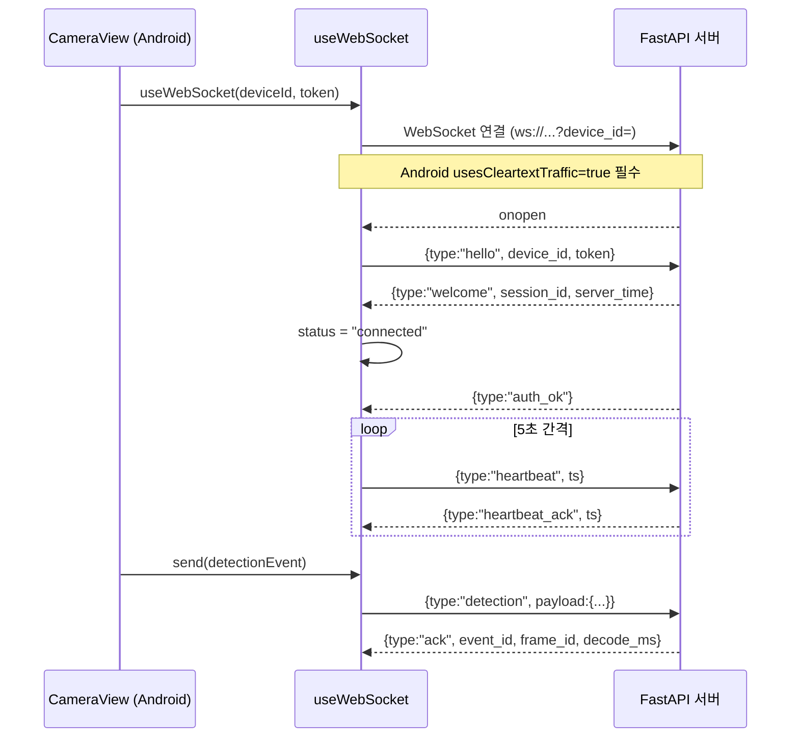
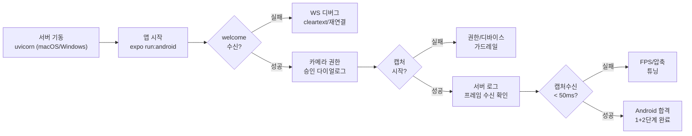
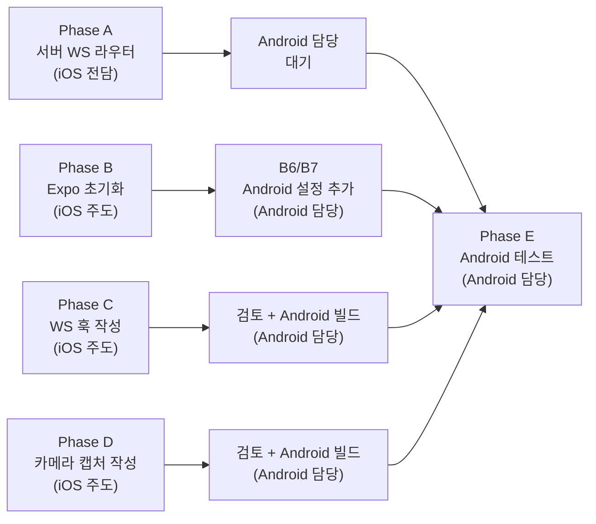

# Minchodan 온디바이스 모바일 앱 구현 설계서 — Android (1+2단계)

> **작성일**: 2026-06-30
> **버전**: v0.1.0
> **설계 기준**: [`docs/minchodan_design_note.md`](minchodan_design_note.md) 1·2단계 (v1.1 이중 스트림 반영)
> **API 명세 기준**: [`docs/api_specification.md`](api_specification.md) v0.2.0 (필드 정합 최우선)
> **통합 계획서 참조**: [`docs/mobile_app_implementation_plan.md`](mobile_app_implementation_plan.md) (분리 전 원본)
> **iOS 설계서 참조**: [`docs/mobile_ios_implementation_plan.md`](mobile_ios_implementation_plan.md) (서버 Phase A + 공통 TS 코드 주도)
> **스킬 참조**: [`.agents/skills/websocket-gateway/SKILL.md`](../.agents/skills/websocket-gateway/SKILL.md), [`.agents/skills/camera-frame-capture/SKILL.md`](../.agents/skills/camera-frame-capture/SKILL.md)
> **코딩 패턴 기준**: [`docs/course_codebase_guide.md`](course_codebase_guide.md)
> **담당 브랜치**: `dg`
> **협업 대상**: iOS 담당자 (`kb`) — 서버 Phase A + 공통 TS 코드 주도 작성

---

## 1. 개요

본 문서는 Minchodan 시각장애인 보행 보조 앱의 **Android 클라이언트(React Native)** 구현 설계서입니다. **1단계(WebSocket 실시간 통신)** 와 **2단계(카메라 이중 캡처·전송)** 를 구현하며, **Android 담당자는 공통 TypeScript 코드 검토 및 Android 네이티브 빌드/권한/테스트**를 담당합니다.

### 1.1 분담 구조 (주도-지원 분담)

React Native는 단일 TypeScript 코드베이스를 공유하므로, 플랫폼별 독립 구현이 아닌 **주도-지원 분담**을 채택합니다.

| 역할 | 담당자 | 책임 | 브랜치 |
| --- | --- | --- | --- |
| **iOS 주도** | `kb` | 서버 Phase A(WS 라우터) 전체 + 공통 TS 코드 주도 작성 + iOS 네이티브 빌드/권한/테스트 | `kb` |
| **Android 지원** | `dg` | 공통 TS 코드 검토 + Android 네이티브 빌드/권한/테스트 | `dg` |

> 서버 Phase A 및 공통 TS 코드의 상세 구현 내용은 [`docs/mobile_ios_implementation_plan.md`](mobile_ios_implementation_plan.md) 참조.

### 1.2 작업 분배 매트릭스

| Phase | 작업 | iOS 담당 (`kb`) | Android 담당 |
| --- | --- | --- | --- |
| A | 서버 `/ws/detect` 라우터 | 전담 (구현) | **인터페이스 참조만** |
| B | Expo Dev Client 프로젝트 초기화 | 주도 (공통 설정) | **Android 플러그인/권한 추가** |
| C | `useWebSocket.ts` + 타입 정의 | 주도 (작성) | **검토 + Android 빌드 검증** |
| D | `useCamera.ts` + `frameCapture.ts` + `CameraView.tsx` | 주도 (작성) | **검토 + Android 빌드 검증** |
| E | 실기기 테스트 | iOS 실기기 검증 | **Android 실기기/에뮬레이터 검증** |

### 1.3 핵심 원칙 (비협상)

**이중 경로 물리 분리** — 반사 스트림(8~10fps)은 Detection 즉시 경보 용도, 인지 스트림(1~2fps)은 상세 가이드 용도로 단말 단에서부터 분리 캡처합니다.

| 경로 | 위험도 | 단말 캡처 (Android) | 서버 처리 | 목표 지연 |
| --- | --- | --- | --- | --- |
| **반사 (reflex)** | high | 10fps `takePhoto({qualityPrioritization:'speed'})` | 3단계 Detection → Reflex Gate → 사전합성 클립 | **캡처수신 < 50ms** |
| **인지 (cognitive)** | mid/low | 2fps `takePhoto({qualityPrioritization:'speed'})` | 3단계 Detection+Seg → Redis Streams → LangGraph + RAG → 실시간 TTS | 1~2Hz |

### 1.4 확정된 결정 사항

| 항목 | 결정 | 비고 |
| --- | --- | --- |
| RN 워크플로우 | **Expo Dev Client** | `react-native-vision-camera` 네이티브 모듈, Expo Go 불가 |
| 빌드 전략 | **로컬 빌드 우선** | macOS/Windows에서 `expo run:android --device` (에뮬레이터 가능) |
| 구현 범위 | **1+2단계 (WS + 카메라)** | 음성/햅틱 재생(7단계)은 다음 패스 |
| 서버 WS 라우터 | **iOS 담당자 겸임** | Android 담당자는 산출물 인터페이스 참조 |
| 디바이스 인증 | **MVP 하드코딩** | `REGISTERED_DEVICES` dict, 추후 `.env`/DB 확장 |
| 필드 정합 기준 | **API 명세서 v0.2.0** | `ts`(epoch ms), `thumbnail_jpeg_b64`, `frame_id`, `heartbeat`/`heartbeat_ack` |

---

## 2. Android 플랫폼 제약 및 환경

### 2.1 빌드 환경 요건

| 항목 | 요건 | 비고 |
| --- | --- | --- |
| OS | **macOS 또는 Windows** | Android Studio는 양쪽 지원 (iOS와 달리 OS 제약 없음) |
| Android Studio | Hedgehog (2023.1)+ | SDK, 에뮬레이터, Gradle |
| JDK | 17 | Android Gradle Plugin 8+ 요건 |
| Android SDK | API 24+ (Android 7.0) | `compileSdk 34`, `minSdk 24` 권장 |
| Expo CLI | `expo-dev-client` | `npx expo run:android --device` 또는 `--android` |
| 실기기 | Android 단말 (USB 디버깅) | 에뮬레이터로 대체 가능 (가상 카메라 지원) |

### 2.2 Android 특화 제약 및 장점

| 항목 | 내용 | 비고 |
| --- | --- | --- |
| 에뮬레이터 카메라 지원 | **가상 카메라로 캡처 가능** | iOS 시뮬레이터와 달리 2단계 카메라 테스트를 에뮬레이터에서 수행 가능 |
| 카메라 권한 (`android.permission.CAMERA`) | `AndroidManifest.xml` 필수 | `app.json` → `android.permissions`에 명시 |
| 인터넷 권한 (`android.permission.INTERNET`) | WebSocket 통신 필수 | Expo 기본 포함, 명시 권장 |
| 백그라운드 카메라 제한 | Android 10+ 백그라운드 카메라 접근 제한 | 화면 항상 켜짐 유지 (활성 상태 전제) |
| Cleartext Traffic (`usesCleartextTraffic`) | HTTP WebSocket (`ws://`) 허용 | 개발 중 `app.json` → `android.usesCleartextTraffic: true`, 운영 시 `wss://` |
| USB 디버깅 | 실기기 개발자 모드 + USB 디버깅 활성화 필수 | 설정 → 개발자 옵션 → USB 디버깅 |
| Windows 빌드 | macOS 없이 Android 빌드 가능 | iOS 담당자가 서버 구현, Android 담당자는 Windows에서 독립 테스트 가능 |

### 2.3 Android vs iOS 환경 비교

| 항목 | iOS | Android |
| --- | --- | --- |
| 빌드 가능 OS | macOS만 | macOS, Windows |
| 시뮬레이터/에뮬레이터 카메라 | 미지원 | **지원 (가상 카메라)** |
| 실기기 필수 여부 (2단계) | 필수 | 에뮬레이터 대체 가능 |
| 권한 설정 파일 | Info.plist (`ios.infoPlist`) | AndroidManifest.xml (`android.permissions`) |
| HTTP 예외 | ATS (`NSAppTransportSecurity`) | `usesCleartextTraffic` |
| 백그라운드 카메라 | 제한 | 제한 (Android 10+) |

---

## 3. Phase A: 서버측 WebSocket 라우터 (참조)

> 본 Phase는 **iOS 담당자(`kb`)가 전담하여 구현**합니다. Android 담당자는 산출물의 인터페이스를 참조하여 클라이언트 연동에 활용합니다.

### 3.1 서버 인터페이스 (Android 클라이언트 연동용)

Android 담당자가 클라이언트 구현 시 참조할 서버 인터페이스 요약입니다. 상세 구현은 [`docs/mobile_ios_implementation_plan.md`](mobile_ios_implementation_plan.md) Phase A를 참조하십시오.

| 항목 | 값 |
| --- | --- |
| 엔드포인트 | `ws://{서버IP}:{WS_PORT}/ws/detect?device_id={deviceId}` |
| 핸드셰이크 | `hello` → `welcome` → `auth_ok` |
| 하트비트 | 서버→단말 `{type:"heartbeat", ts}`, 단말→서버 `{type:"heartbeat_ack", ts}` (5초 간격) |
| 프레임 전송 | `{type:"detection", payload:{event_id, device_id, ts, frame_id, stream, thumbnail_jpeg_b64}}` |
| ack 응답 | `{type:"ack", event_id, frame_id, decode_ms}` |
| 테스트 디바이스 | `dev-001` / `token-abc-001` (MVP 하드코딩) |

### 3.2 Android 담당자 대기 사항

| 항목 | 내용 |
| --- | --- |
| 대기 조건 | iOS 담당자가 Phase A(서버 WS 라우터) 구현 완료 후 `kb` 브랜치 PR |
| 확인 사항 | `tests/test_ws_echo.py` RTT < 100ms 통과 여부 |
| 환경 설정 | 서버 LAN IP 확인, 동일 WiFi망 연결, 디바이스 등록(`dev-001`) 확인 |

> Android 담당자는 Phase A 완료 전에 Phase B(Android 설정)와 공통 TS 코드 검토를 선제 수행할 수 있습니다. WS 연결 테스트는 Phase A 완료 후 가능합니다.

---

## 4. Phase B: Expo Dev Client 프로젝트 초기화 (Android 설정)

### 4.1 공통 초기화 (iOS 담당자 주도)

iOS 담당자가 `client/` 디렉토리에 Expo 프로젝트를 생성하고 공통 설정을 완료합니다. Android 담당자는 **Android 특화 설정을 추가**합니다.

| 순번 | 내용 | 담당 |
| --- | --- | --- |
| B1 | 기존 `client/` 빈 스캐폴딩 정리 | iOS 주도 |
| B2 | `npx create-expo-app` (blank TypeScript) | iOS 주도 |
| B3 | `app.json` / `app.config.js` 공통 설정 | iOS 주도 |
| B4 | 의존성 설치 (`react-native-vision-camera`, `expo-dev-client`, `expo-haptics`) | iOS 주도 |
| B5 | 디렉토리 구조 정리 | iOS 주도 |
| **B6** | **Android 권한/플러그인 추가** | **Android 담당** |
| **B7** | **Android 빌드 검증** | **Android 담당** |

### 4.2 Android 특화 설정 (Android 담당자)

| 항목 | 내용 | 파일 |
| --- | --- | --- |
| 패키지명 | `com.minchodan.app` (개발용) | `app.json` → `android.package` |
| 카메라 권한 | `android.permission.CAMERA` | `app.json` → `android.permissions: ["CAMERA"]` |
| 인터넷 권한 | `android.permission.INTERNET` | `app.json` → `android.permissions: ["INTERNET"]` (명시 권장) |
| Cleartext Traffic (개발용) | `usesCleartextTraffic: true` (WebSocket `ws://` 허용) | `app.json` → `android.usesCleartextTraffic` |
| 최소 SDK | API 24 (Android 7.0) | `app.json` → `android.minSdkVersion` (또는 `expo-build-properties`) |
| Expo 플러그인 | `expo-dev-client`, `react-native-vision-camera` | `app.json` → `plugins` (iOS와 공통) |

### 4.3 `app.json` Android 설정 예시

```json
{
  "expo": {
    "name": "Minchodan",
    "android": {
      "package": "com.minchodan.app",
      "permissions": ["CAMERA", "INTERNET"],
      "usesCleartextTraffic": true
    },
    "plugins": ["expo-dev-client", "react-native-vision-camera"]
  }
}
```

> `usesCleartextTraffic`은 개발 중 `ws://` 통신을 위한 임시 설정입니다. 운영 환경에서는 `wss://` (TLS)를 사용하고 이 값을 `false`로 변경해야 합니다.

### 4.4 디렉토리 구조 (공통, iOS 담당자가 생성)

```
client/
├── app.json                      # Expo 설정 (iOS/Android 권한)
├── package.json                  # 의존성
├── tsconfig.json                 # TypeScript 설정
├── src/
│   ├── config/
│   │   └── index.ts              # WS_URL, DEVICE_ID, TOKEN, FPS 설정
│   ├── types/
│   │   └── detection.ts          # WSMessage, DetectionEvent, AckMessage 타입
│   ├── hooks/
│   │   ├── useWebSocket.ts       # 1단계 WS 연결/하트비트/재연결
│   │   └── useCamera.ts          # 2단계 이중 캡처 타이머
│   ├── services/
│   │   └── frameCapture.ts       # takePhoto → base64 → send
│   ├── components/
│   │   ├── CameraView.tsx        # 카메라 + WS 연동
│   │   └── ConnectionStatus.tsx  # 접속 상태 표시 (접근성)
│   └── utils/
│       └── haptics.ts            # 햅틱 + announceForAccessibility (7단계 준비 stub)
├── assets/
│   └── reflex_clips/             # 사전합성 반사 음성 클립 (7단계)
└── App.tsx                       # 엔트리 포인트
```

> 상세 파일 내용은 [`docs/mobile_ios_implementation_plan.md`](mobile_ios_implementation_plan.md) Phase B를 참조하십시오.

### 4.5 Android 개발 클라이언트 빌드

| 명령 | 비고 |
| --- | --- |
| `npx expo run:android --device` | 실기기 빌드 (USB 디버깅 활성화 필수) |
| `npx expo run:android` | 에뮬레이터 빌드 (가상 카메라로 2단계 테스트 가능) |

> **Android 장점**: iOS와 달리 에뮬레이터에서 카메라 캡처가 가능하므로, 실기기 없이도 1+2단계 전체 테스트가 가능합니다. 다만 가상 카메라 이미지는 실제 보행 환경과 다르므로, 최종 검증은 실기기를 권장합니다.

---

## 5. Phase C: 클라이언트측 1단계 WebSocket 훱 (검토 + Android 검증)

> 공통 TypeScript 코드는 **iOS 담당자가 주도 작성**합니다. Android 담당자는 코드 검토 및 Android 빌드 검증을 수행합니다.

### 5.1 검토 대상 파일

| 파일 | 역할 | 상세 참조 |
| --- | --- | --- |
| `src/types/detection.ts` | WSMessage, DetectionPayload, AckPayload 타입 정의 | iOS 설계서 §5.1 |
| `src/hooks/useWebSocket.ts` | WS 연결/하트비트/재연결 훅 | iOS 설계서 §5.1 |
| `src/components/ConnectionStatus.tsx` | 접속 상태 표시 (접근성) | iOS 설계서 §5.1 |

### 5.2 Android 검증 포인트

| 항목 | 검증 내용 | 합격 기준 |
| --- | --- | --- |
| WebSocket 연결 | `ws://` cleartext 연결 허용 | `usesCleartextTraffic: true` 설정 후 연결 성공 |
| 하트비트 | 5초 간격 heartbeat/heartbeat_ack | 타임아웃 없음 |
| 재연결 | 의도적 단절 후 복구 | 3회 이내 성공 |
| 백그라운드 전환 | 앱 백그라운드 시 WS 상태 | 백그라운드에서 WS 유지 또는 의도적 단절 처리 확인 |

### 5.3 메시지 처리 흐름 (Android 관점)



---

## 6. Phase D: 클라이언트측 2단계 이중 카메라 캡처 (검토 + Android 검증)

> 공통 TypeScript 코드는 **iOS 담당자가 주도 작성**합니다. `react-native-vision-camera`의 `takePhoto` API는 iOS/Android 공통이므로 단일 코드로 양쪽 동작합니다. Android 담당자는 코드 검토 및 Android 빌드 검증을 수행합니다.

### 6.1 검토 대상 파일

| 파일 | 역할 | 상세 참조 |
| --- | --- | --- |
| `src/hooks/useCamera.ts` | 이중 캡처 타이머 (반사 10fps/인지 2fps) | iOS 설계서 §6.1 |
| `src/services/frameCapture.ts` | 프레임 전송 서비스 (base64 → WS) | iOS 설계서 §6.1 |
| `src/components/CameraView.tsx` | 카메라 + WS 연동 | iOS 설계서 §6.1 |
| `src/utils/haptics.ts` | 햅틱/접근성 stub (7단계 준비) | iOS 설계서 §6.1 |

### 6.2 Android 검증 포인트

| 항목 | 검증 내용 | 합격 기준 |
| --- | --- | --- |
| 카메라 권한 | `CAMERA` 권한 승인 다이얼로그 | Android 승인 |
| 후면 카메라 | `useCameraDevice('back')` 디바이스 검색 | `device !== null` |
| `takePhoto` 호출 | `qualityPrioritization:'speed'` 캡처 | base64 문자열 반환 (30~50KB) |
| 이중 타이머 | 반사 10fps / 인지 2fps setInterval | ±100ms 오차 |
| 에뮬레이터 카메라 | 가상 카메라로 캡처 가능 여부 | 에뮬레이터에서 base64 반환 |
| 백그라운드 캡처 중단 | 백그라운드 전환 시 타이머 해제 | `clearInterval` 확인 |

### 6.3 detection 페이로드 (API 명세서 v0.2.0 준수)

```typescript
{
  type: "detection",
  payload: {
    event_id: "evt-1719216000000-001",
    device_id: "dev-001",
    ts: 1719216000000,           // epoch ms (number)
    frame_id: 42,                // 증가 번호
    stream: "reflex",            // "reflex" | "cognitive"
    thumbnail_jpeg_b64: "/9j/4AAQ..."
  }
}
```

> 페이로드는 iOS와 완전히 동일합니다. 플랫폼별 분기 없이 단일 코드로 동작합니다.

### 6.4 가드레일 (설계 의존성·예외 준수)

| 예외 | 처리 |
| --- | --- |
| 카메라 권한 거부 (`NotAllowedError`) | 안내 메시지 표시, 종료 |
| 소켓 유실 | `clearInterval`로 타이머 자원 즉시 해제 (메모리 고갈 방지) |
| `takePhoto` 실패 | `null` 반환, 에러 없이 스킵 (파이프라인 영속성) |
| `cameraRef.current` null | `null` 반환, 캡처 시도 안 함 |

---

## 7. Phase E: Android 실기기/에뮬레이터 테스트 및 검증

### 7.1 Android 검증 매트릭스

| 항목 | 기대 결과 | 합격 기준 | 단계 | 테스트 환경 |
| --- | --- | --- | --- | --- |
| WS 연결 수립 | welcome 메시지 수신 | 3초 이내 | 1 | 실기기/에뮬레이터 |
| hello/인증 | auth_ok 응답 | 토큰 일치 시 성공 | 1 | 실기기/에뮬레이터 |
| echo 왕복 | 앱→서버→앱 | **RTT < 100ms** | 1 | 실기기/에뮬레이터 |
| 하트비트 | heartbeat/heartbeat_ack 5초 간격 | 타임아웃 없음 | 1 | 실기기/에뮬레이터 |
| 재연결 | 의도적 단절 후 복구 | 3회 이내 성공 | 1 | 실기기/에뮬레이터 |
| WebSocketDisconnect | 소켓 close + 리소스 해제 | 예외 없이 정리 | 1 | 실기기/에뮬레이터 |
| 카메라 권한 요청 | 승인 다이얼로그 | Android 승인 | 2 | 실기기/에뮬레이터 |
| 후면 카메라 활성화 | `isActive=true` | `device !== null` | 2 | 실기기/에뮬레이터 |
| 반사 캡처 10fps | setInterval 주기 | ±100ms 오차 | 2 | 실기기/에뮬레이터 |
| 인지 캡처 2fps | setInterval 주기 | ±100ms 오차 | 2 | 실기기/에뮬레이터 |
| base64 변환 | JPEG base64 문자열 | 30~50KB 범위 | 2 | 실기기/에뮬레이터 |
| 서버 프레임 수신 | 디코딩 성공 | 640×640, 30~50KB | 2 | 실기기/에뮬레이터 |
| **캡처수신 지연** | 전체 파이프라인 | **< 50ms** | 2 | 실기기/에뮬레이터 |
| ack 응답 | event_id 일치 | decode_ms 포함 | 2 | 실기기/에뮬레이터 |
| 소켓 유실 타이머 해제 | clearInterval | 자원 해제 확인 | 2 | 실기기/에뮬레이터 |

> **Android 장점**: 모든 항목을 에뮬레이터에서 테스트할 수 있습니다. iOS와 달리 실기기가 필수가 아닙니다. 다만 최종 검증은 실기기를 권장합니다.

### 7.2 테스트 환경

| 항목 | 설정 |
| --- | --- |
| 서버 실행 | macOS 또는 Windows 로컬 `uvicorn server.main:app --host 0.0.0.0 --port 8000` |
| 단말 네트워크 | 서버와 **동일 WiFi망**, `WS_URL` = 서버 LAN IP |
| 디바이스 등록 | `auth.py`에 `dev-001`/`token-abc-001` 사전 등록 (iOS 담당자가 구현) |
| Android 실기기 | USB 디버깅 활성화, `expo run:android --device` |
| Android 에뮬레이터 | Android Studio 에뮬레이터, 가상 카메라, `expo run:android` |
| Windows 환경 | 서버를 Windows에서 직접 실행 가능, Android 에뮬레이터로 전체 테스트 가능 |

### 7.3 Android 테스트 시나리오



### 7.4 에뮬레이터 vs 실기기 테스트 비교

| 항목 | 에뮬레이터 | 실기기 |
| --- | --- | --- |
| WS echo (1단계) | 가능 | 가능 |
| 카메라 캡처 (2단계) | 가능 (가상 카메라) | 가능 (실제 카메라) |
| 프레임 품질 | 가상 이미지 (정적/단조) | 실제 보행 환경 |
| 성능 (RTT/지연) | 호스트 머신 의존 | 실제 네트워크 조건 |
| 권장 용도 | 초기 개발/단위 검증 | 최종 KPI 검증 |

> 권장 흐름: 에뮬레이터로 초기 검증 → 실기기로 최종 KPI(RTT < 100ms, 캡처수신 < 50ms) 검증.

---

## 8. 산출물 목록 (Android 담당자)

### 8.1 신규/수정 파일 (Android 특화)

| 파일 | 유형 | 역할 | 담당 |
| --- | --- | --- | --- |
| `client/app.json` (Android 섹션) | 수정 | Android 권한/패키지/cleartext 설정 | Android 담당 |

### 8.2 검토 대상 파일 (iOS 담당자 주도 작성)

| 파일 | 유형 | 역할 | 담당 |
| --- | --- | --- | --- |
| `server/api/ws_router.py` | 신규 | `/ws/detect` 엔드포인트 | iOS 담당 (참조) |
| `server/main.py` | 수정 | `ws_router` 마운트 | iOS 담당 (참조) |
| `tests/test_ws_echo.py` | 신규 | RTT < 100ms echo 검증 | iOS 담당 (참조) |
| `client/src/types/detection.ts` | 신규 | 타입 정의 | iOS 주도 (검토) |
| `client/src/hooks/useWebSocket.ts` | 신규 | WS 연결/하트비트/재연결 | iOS 주도 (검토) |
| `client/src/hooks/useCamera.ts` | 신규 | 이중 캡처 타이머 | iOS 주도 (검토) |
| `client/src/services/frameCapture.ts` | 신규 | 프레임 전송 서비스 | iOS 주도 (검토) |
| `client/src/components/CameraView.tsx` | 신규 | 카메라 + WS 연동 | iOS 주도 (검토) |
| `client/src/components/ConnectionStatus.tsx` | 신규 | 접속 상태 표시 | iOS 주도 (검토) |
| `client/src/utils/haptics.ts` | 신규 | 햅틱/접근성 stub | iOS 주도 (검토) |

---

## 9. 작업 순서



### 9.1 Android 담당자 작업 순서

| 순번 | 작업 | 의존성 | 비고 |
| --- | --- | --- | --- |
| 1 | Phase A 완료 대기 (iOS 담당자 PR) | - | 서버 인터페이스 참조 가능 |
| 2 | Phase B6: Android 권한/플러그인 추가 | Phase B 공통 설정 완료 | `app.json` Android 섹션 |
| 3 | Phase C/D 코드 검토 | iOS 담당자 TS 코드 작성 완료 | 코드 리뷰, 플랫폼 호환성 확인 |
| 4 | Phase B7: Android 빌드 검증 | B6 완료 | `expo run:android` 에뮬레이터/실기기 |
| 5 | Phase E: Android 테스트 | Phase A 완료 + B7 완료 | WS echo + 카메라 캡처 end-to-end |

### 9.2 병렬 작업 가능 영역

| 작업 | 선행 조건 | 비고 |
| --- | --- | --- |
| Android 권한 설정 (B6) | Phase B 공통 설정 완료 | iOS 담당자가 초기화 완료한 후 |
| 공통 TS 코드 검토 | iOS 담당자 코드 작성 중 또는 완료 | PR 리뷰 방식으로 병렬 가능 |
| 에뮬레이터 WS echo 테스트 | Phase A 완료 | 서버가 구동 중이면 Android 에뮬레이터에서 echo 가능 |

### 9.3 브랜치 전략

| 항목 | 내용 |
| --- | --- |
| 작업 브랜치 | Android 담당자 개별 브랜치 (이니셜) |
| 병합 대상 | `dev` (PR 기반, `master`/`main` 직접 push 금지) |
| PR 단위 | Android 설정 + 검증 완료 후 PR |
| 협업 | iOS 담당자 PR에 Android 검토 리뷰 참여 |

---

## 10. 위험 및 완화 (Android 특화)

| 위험 | 영향 | 완화 |
| --- | --- | --- |
| `usesCleartextTraffic` 미설정 | `ws://` WebSocket 연결 차단 | `app.json` → `android.usesCleartextTraffic: true` (개발용) |
| 카메라 권한 미승인 | `takePhoto` 호출 시 크래시 | 권한 요청 다이얼로그 후 승인 확인, 거부 시 안내 |
| 에뮬레이터 가상 카메라 품질 | 실제 보행 환경과 다른 프레임 | 초기 검증용, 최종 KPI는 실기기 권장 |
| Android 백그라운드 카메라 제한 (10+) | 백그라운드 전환 시 캡처 중단 | 화면 항상 켜짐 유지 (`keepScreenAwake`) |
| Windows 환경 iOS 빌드 불가 | iOS 테스트 불가 | iOS는 iOS 담당자(macOS)에 의존, Android는 Windows에서 독립 수행 |
| WiFi망 지연 변동 | RTT/캡처수신 KPI 달성 불확실 | 동일 LAN망 사용, 반복 측정 |
| Gradle 빌드 실패 | 네이티브 의존성 해결 실패 | `expo prebuild --clean` 후 재빌드, JDK 17 확인 |

---

## 11. 다음 패스 예정 (범위 밖)

| 항목 | 단계 | 비고 |
| --- | --- | --- |
| 음성/햅틱 재생 (반사 클립 선점 + 인지 TTS 수신) | 7단계 클라이언트측 | `haptics.ts` 본격 구현, `reflexClipPlayer`, `audioPlayer` |
| 반사 클립 사전합성 | 7단계 서버측 | `data/reflex_clips/` MP3 번들 |
| 서버 디바이스 인증 DB 연동 | 1단계 확장 | `REGISTERED_DEVICES` → `.env`/DB |
| 운영자 콘솔 연동 | 별도 | `console/` React 앱, SSE 구독 |

---

## 12. 참고 자료

| 자료 | 경로 |
| --- | --- |
| 통합 구현 계획서 (원본) | [`docs/mobile_app_implementation_plan.md`](mobile_app_implementation_plan.md) |
| iOS 구현 설계서 (서버 Phase A + 공통 TS 코드 상세) | [`docs/mobile_ios_implementation_plan.md`](mobile_ios_implementation_plan.md) |
| 설계 노트 (원본) | [`docs/minchodan_design_note.md`](minchodan_design_note.md) |
| API 명세서 | [`docs/api_specification.md`](api_specification.md) |
| 2단계 캡처 설계서 | [`docs/stage2_capture_design.md`](stage2_capture_design.md) |
| WebSocket 게이트웨이 스킬 | [`.agents/skills/websocket-gateway/SKILL.md`](../.agents/skills/websocket-gateway/SKILL.md) |
| 카메라 프레임 캡처 스킬 | [`.agents/skills/camera-frame-capture/SKILL.md`](../.agents/skills/camera-frame-capture/SKILL.md) |
| 코딩 패턴 기준 | [`docs/course_codebase_guide.md`](course_codebase_guide.md) |
| react-native-vision-camera | https://react-native-vision-camera.com/ |
| Expo Dev Client (Android) | https://docs.expo.dev/develop/development-builds/introduction/ |
| Android Studio | https://developer.android.com/studio |
