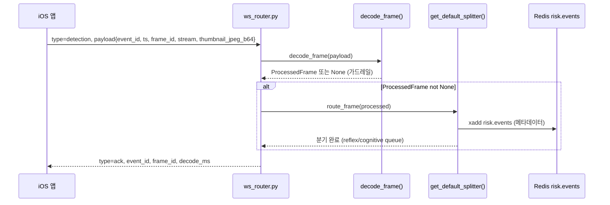
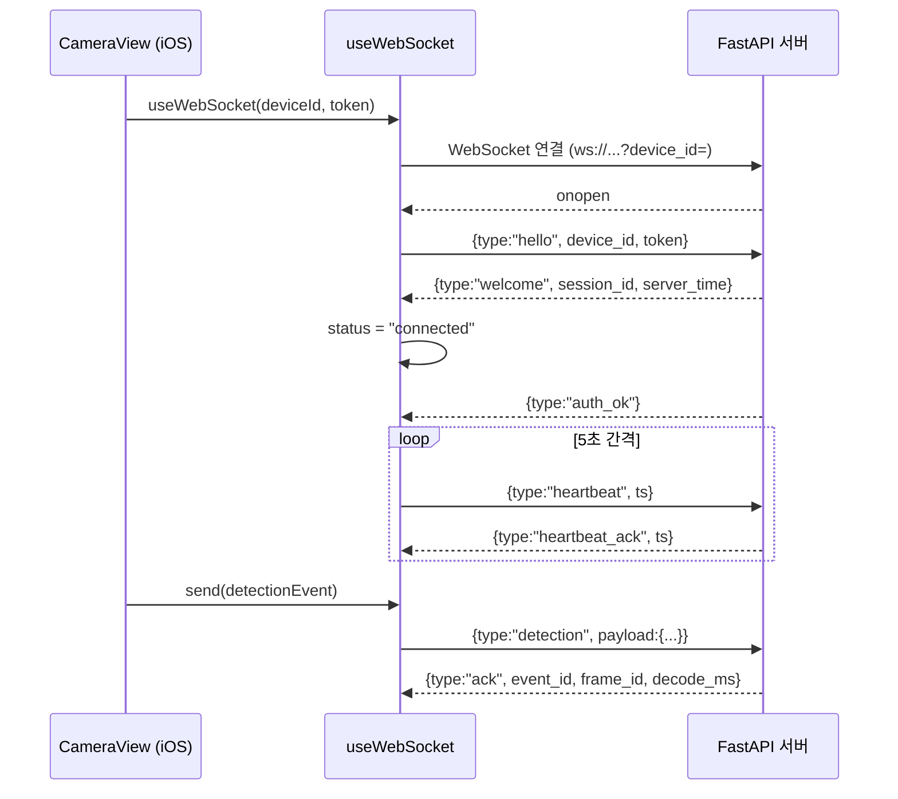
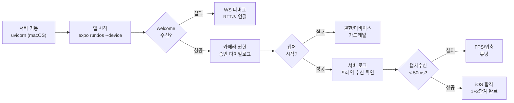
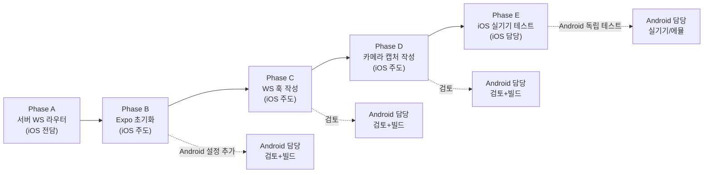

# Minchodan 온디바이스 모바일 앱 구현 설계서 — iOS (1+2단계)

> **작성일**: 2026-06-30
> **버전**: v0.1.0
> **설계 기준**: [`docs/minchodan_design_note.md`](minchodan_design_note.md) 1·2단계 (v1.1 이중 스트림 반영)
> **API 명세 기준**: [`docs/api_specification.md`](api_specification.md) v0.2.0 (필드 정합 최우선)
> **통합 계획서 참조**: [`docs/mobile_app_implementation_plan.md`](mobile_app_implementation_plan.md) (분리 전 원본)
> **스킬 참조**: [`.agents/skills/websocket-gateway/SKILL.md`](../.agents/skills/websocket-gateway/SKILL.md), [`.agents/skills/camera-frame-capture/SKILL.md`](../.agents/skills/camera-frame-capture/SKILL.md)
> **코딩 패턴 기준**: [`docs/course_codebase_guide.md`](course_codebase_guide.md)
> **담당 브랜치**: `kb` (iOS 주도 + 서버 Phase A)
> **협업 대상**: Android 담당자 (`dg`) — 공통 TS 코드 검토 + Android 빌드/검증

---

## 1. 개요

본 문서는 Minchodan 시각장애인 보행 보조 앱의 **iOS 클라이언트(React Native)** 구현 설계서입니다. **1단계(WebSocket 실시간 통신)** 와 **2단계(카메라 이중 캡처·전송)** 를 구현하며, **iOS 담당자는 서버측 WebSocket 라우터(Phase A)와 공통 TypeScript 코드 주도 작성**을 함께 담당합니다.

### 1.1 분담 구조 (주도-지원 분담)

React Native는 단일 TypeScript 코드베이스를 공유하므로, 플랫폼별 독립 구현이 아닌 **주도-지원 분담**을 채택합니다.

| 역할 | 담당자 | 책임 | 브랜치 |
| --- | --- | --- | --- |
| **iOS 주도** | `kb` | 서버 Phase A(WS 라우터) 전체 + 공통 TS 코드(useWebSocket/useCamera/frameCapture) 주도 작성 + iOS 네이티브 빌드/권한/테스트 | `kb` |
| **Android 지원** | `dg` | 공통 TS 코드 검토 + Android 네이티브 빌드/권한/테스트 | `dg` |

> 상세 분담 내용은 [`docs/mobile_android_implementation_plan.md`](mobile_android_implementation_plan.md) 참조.

### 1.2 작업 분배 매트릭스

| Phase | 작업 | iOS 담당 (`kb`) | Android 담당 |
| --- | --- | --- | --- |
| A | 서버 `/ws/detect` 라우터 | **전담 (구현)** | 인터페이스 참조만 |
| B | Expo Dev Client 프로젝트 초기화 | **주도 (공통 설정)** | Android 플러그인/권한 추가 |
| C | `useWebSocket.ts` + 타입 정의 | **주도 (작성)** | 검토 + Android 빌드 검증 |
| D | `useCamera.ts` + `frameCapture.ts` + `CameraView.tsx` | **주도 (작성)** | 검토 + Android 빌드 검증 |
| E | 실기기 테스트 | **iOS 실기기 검증** | Android 실기기/에뮬레이터 검증 |

### 1.3 핵심 원칙 (비협상)

**이중 경로 물리 분리** — 반사 스트림(8~10fps)은 Detection 즉시 경보 용도, 인지 스트림(1~2fps)은 상세 가이드 용도로 단말 단에서부터 분리 캡처합니다.

| 경로 | 위험도 | 단말 캡처 (iOS) | 서버 처리 | 목표 지연 |
| --- | --- | --- | --- | --- |
| **반사 (reflex)** | high | 10fps `takePhoto({qualityPrioritization:'speed'})` | 3단계 Detection → Reflex Gate → 사전합성 클립 | **캡처수신 < 50ms** |
| **인지 (cognitive)** | mid/low | 2fps `takePhoto({qualityPrioritization:'speed'})` | 3단계 Detection+Seg → Redis Streams → LangGraph + RAG → 실시간 TTS | 1~2Hz |

### 1.4 확정된 결정 사항

| 항목 | 결정 | 비고 |
| --- | --- | --- |
| RN 워크플로우 | **Expo Dev Client** | `react-native-vision-camera` 네이티브 모듈, Expo Go 불가 |
| 빌드 전략 | **로컬 빌드 우선** | macOS에서 `expo run:ios --device` (실기기 필수) |
| 구현 범위 | **1+2단계 (WS + 카메라)** | 음성/햅틱 재생(7단계)은 다음 패스 |
| 서버 WS 라우터 | **iOS 담당자 겸임** | Phase A 전담 |
| 디바이스 인증 | **MVP 하드코딩** | `REGISTERED_DEVICES` dict, 추후 `.env`/DB 확장 |
| 필드 정합 기준 | **API 명세서 v0.2.0** | `ts`(epoch ms), `thumbnail_jpeg_b64`, `frame_id`, `heartbeat`/`heartbeat_ack` |

---

## 2. iOS 플랫폼 제약 및 환경

### 2.1 빌드 환경 요건

| 항목 | 요건 | 비고 |
| --- | --- | --- |
| OS | **macOS 필수** | Xcode iOS 빌드는 macOS에서만 가능 |
| Xcode | 15+ | iOS 16+ 타겟, Swift 컴파일러 |
| CocoaPods | 최신 안정 버전 | 네이티브 의존성 해결 |
| Expo CLI | `expo-dev-client` | `npx expo run:ios --device` |
| 실기기 | iPhone (Lightning/USB-C) | 시뮬레이터는 카메라 미지원 → **실기기 필수** |
| Apple Developer 계정 | 무료(개인) 가능 | 실기기 빌드용, 7일 프로비저닝 (유료 시 1년) |

### 2.2 iOS 특화 제약

| 제약 | 영향 | 완화 |
| --- | --- | --- |
| 시뮬레이터 카메라 미지원 | iOS 시뮬레이터에서 캡처 테스트 불가 | **실기기 필수**, macOS 환경 확보 |
| 카메라 권한 (`NSCameraUsageDescription`) | Info.plist 필수 키 누락 시 앱 크래시 | `app.json` `ios.infoPlist`에 명시 |
| 오디오 권한 (`NSMicrophoneUsageDescription`) | 마이크 접근 시 필수 (본 패스에서는 미사용, 7단계 대비) | `app.json`에 사전 추가 권장 |
| 백그라운드 카메라 제한 | iOS는 백그라운드에서 카메라 접근 불가 | 보행 중 화면 항상 켜짐 유지 (활성 상태 전제) |
| 사진 라이브러리 접근 | `takePhoto` 저장 시 권한 필요 | 본 패스에서는 저장 안 함, 메모리 base64만 사용 |
| App Transport Security (ATS) | HTTP 차단 (WebSocket `ws://` 예외 필요) | 개발 중 `app.json` ATS 예외 설정, 운영 시 `wss://` |

---

## 3. Phase A: 서버측 1단계 WebSocket 라우터 구현 (iOS 담당자 전담)

> 본 Phase는 iOS 담당자가 전담하여 구현합니다. Android 담당자는 산출물의 인터페이스를 참조하여 클라이언트 연동에 활용합니다.

### 3.1 현재 서버 구현 현황

| 영역 | 상태 | 비고 |
| --- | --- | --- |
| `server/main.py` | 모니터링 라우터만 마운트 | **`/ws/detect` 미연결** |
| `server/api/monitor.py` | 구현됨 | SSE 모니터링 (유지) |
| `server/api/ws_router.py` | **미구현** | 본 Phase에서 신규 작성 |
| `server/capture/frame_decoder.py` | **구현됨** | `decode_frame(payload)` 재사용 |
| `server/capture/stream_splitter.py` | **구현됨** | `get_default_splitter()` 싱글턴 재사용 |
| `server/bus/redis_client.py` | **구현됨** | `redis_bus` 싱글턴 재사용 |

### 3.2 신규 파일 (6개)

#### `server/api/config.py` — 환경 설정

| 항목 | 내용 |
| --- | --- |
| 역할 | WS/Redis/Heartbeat 설정값 중앙화 |
| 핵심 | `__file__` 기반 경로 계산 (guide 3.3), `load_dotenv()` (guide 3.4), `Settings(BaseSettings)` |
| 필드 | `WS_HOST`, `WS_PORT`, `REDIS_HOST/PORT/DB`, `HEARTBEAT_INTERVAL=5`, `HEARTBEAT_TIMEOUT=5`, `MAX_RECONNECT_ATTEMPTS=3`, `CORS_ORIGINS` |

#### `server/api/schemas.py` — Pydantic 메시지 스키마

| 항목 | 내용 |
| --- | --- |
| 역할 | WS 메시지 타입별 스키마 정의 |
| 모델 | `WSMessage`(type/device_id/token/session_id/server_time/ts/payload), `WelcomeMessage`, `AckMessage` |
| type 값 | `hello`, `welcome`, `auth_ok`, `heartbeat`, `heartbeat_ack`, `detection`, `ack`, `alert_reflex`, `guide`, `error` (API 명세서 §1) |

#### `server/api/auth.py` — 디바이스 토큰 검증 (MVP)

| 항목 | 내용 |
| --- | --- |
| 역할 | hello 핸드셰이크 시 디바이스 토큰 검증 |
| MVP 방식 | 하드코딩 `REGISTERED_DEVICES = {"dev-001": "token-abc-001", ...}` |
| 함수 | `async verify_device(device_id, token) -> bool` |
| 확장 | 추후 `.env`/DB 연동 |

#### `server/api/session_manager.py` — 연결 관리자

| 항목 | 내용 |
| --- | --- |
| 역할 | 활성 WebSocket 연결 추적 싱글턴 |
| 클래스 | `SessionManager` (`active_connections: dict[str, WebSocket]`) |
| 메서드 | `connect()`, `disconnect()`, `send_json()`, `is_connected()` |
| 인스턴스 | `manager = SessionManager()` |

#### `server/api/heartbeat.py` — 하트비트 관리

| 항목 | 내용 |
| --- | --- |
| 역할 | 서버→단말 5초 `heartbeat` 송신, 타임아웃 시 종료 |
| 클래스 | `HeartbeatManager(ws, device_id, interval, timeout)` |
| 메서드 | `start()` (async 루프), `record_pong()`, `stop()` |
| 타임아웃 | `elapsed > interval + timeout` 시 `ws.close(code=1001)` |
| 메시지 | API 명세서 기준 `{type:"heartbeat", ts}` 송신 |

#### `server/api/ws_router.py` — WebSocket 엔드포인트 (핵심)

| 항목 | 내용 |
| --- | --- |
| 엔드포인트 | `@router.websocket("/ws/detect")` |
| 쿼리 | `device_id: str = Query(...)` |
| 핸드셰이크 | `manager.connect()` → `welcome` 송신 → `hello` 수신 → `verify_device()` → `auth_ok` |
| detection 처리 | `decode_frame(payload)` → `get_default_splitter().route_frame(processed)` → `ack` 응답 |
| ack 필드 | `{type:"ack", event_id, frame_id, decode_ms}` (API 명세서 §3.2) |
| 가드레일 | `decode_frame` None 반환 시에도 ack 정상 응답 (파이프라인 영속성) |
| 예외 | `WebSocketDisconnect`, `json.JSONDecodeError`, `Exception` → `finally`에서 정리 |

### 3.3 수정 파일 (1개)

| 파일 | 변경 내용 |
| --- | --- |
| `server/main.py` | `from server.api.ws_router import router as ws_router` 추가, `app.include_router(ws_router, prefix="")` 마운트. 기존 `monitor_router`/`lifespan` 유지 |

### 3.4 detection 처리 흐름



### 3.5 신규 테스트 (1개)

| 파일 | 내용 |
| --- | --- |
| `tests/test_ws_echo.py` | 1단계 검증: 연결 수립, hello/welcome, echo 왕복 **RTT < 100ms**, 하트비트, 재연결, `WebSocketDisconnect` 정리. `pytest` + `websockets` 클라이언트 |

---

## 4. Phase B: Expo Dev Client 프로젝트 초기화 (iOS 주도)

### 4.1 프로젝트 생성 (공통)

| 순번 | 내용 | 담당 |
| --- | --- | --- |
| B1 | 기존 `client/` 빈 스캐폴딩 정리 (`.gitkeep` 제거) | iOS 주도 |
| B2 | `npx create-expo-app` (blank TypeScript) | iOS 주도 |
| B3 | `app.json` / `app.config.js` 공통 설정 | iOS 주도 |
| B4 | 의존성 설치 (`react-native-vision-camera`, `expo-dev-client`, `expo-haptics`) | iOS 주도 |
| B5 | 디렉토리 구조 정리 (스킬 기준) | iOS 주도 |

### 4.2 iOS 특화 설정

| 항목 | 내용 | 파일 |
| --- | --- | --- |
| 번들 식별자 | `com.minchodan.app` (개발용) | `app.json` → `ios.bundleIdentifier` |
| 카메라 권한 메시지 | `"보행 보조를 위해 카메라 접근이 필요합니다."` | `app.json` → `ios.infoPlist.NSCameraUsageDescription` |
| 마이크 권한 (7단계 대비) | `"음성 안내를 위해 마이크 접근이 필요합니다."` | `app.json` → `ios.infoPlist.NSMicrophoneUsageDescription` |
| ATS 예외 (개발용) | `NSAllowsArbitraryLoads: true` (WebSocket `ws://` 허용) | `app.json` → `ios.infoPlist.NSAppTransportSecurity` |
| 최소 iOS 버전 | iOS 16.0+ | `app.json` → `ios.minimumVersion` |
| Expo 플러그인 | `expo-dev-client`, `react-native-vision-camera` | `app.json` → `plugins` |

### 4.3 디렉토리 구조 (공통)

```
client/
├── app.json                      # Expo 설정 (iOS/Android 권한)
├── package.json                  # 의존성
├── tsconfig.json                 # TypeScript 설정
├── src/
│   ├── config/
│   │   └── index.ts              # WS_URL, DEVICE_ID, TOKEN, FPS 설정
│   ├── types/
│   │   └── detection.ts          # WSMessage, DetectionEvent, AckMessage 타입
│   ├── hooks/
│   │   ├── useWebSocket.ts       # 1단계 WS 연결/하트비트/재연결
│   │   └── useCamera.ts          # 2단계 이중 캡처 타이머
│   ├── services/
│   │   └── frameCapture.ts       # takePhoto → base64 → send
│   ├── components/
│   │   ├── CameraView.tsx        # 카메라 + WS 연동
│   │   └── ConnectionStatus.tsx  # 접속 상태 표시 (접근성)
│   └── utils/
│       └── haptics.ts            # 햅틱 + announceForAccessibility (7단계 준비 stub)
├── assets/
│   └── reflex_clips/             # 사전합성 반사 음성 클립 (7단계)
└── App.tsx                       # 엔트리 포인트
```

### 4.4 설정 파일

| 파일 | 핵심 내용 |
| --- | --- |
| `src/config/index.ts` | `WS_URL`(서버 LAN IP), `DEVICE_ID`, `TOKEN`, `REFLEX_FPS=10`, `COGNITIVE_FPS=2`, `HEARTBEAT_INTERVAL=5000`, `MAX_RECONNECT=3` |

### 4.5 iOS 개발 클라이언트 빌드

| 명령 | 비고 |
| --- | --- |
| `npx expo run:ios --device` | 실기기 빌드 (iPhone USB 연결 필수) |
| `npx expo run:ios` | 시뮬레이터 빌드 (카메라 미지원, WS echo 테스트만 가능) |

> **주의**: iOS 시뮬레이터에서는 카메라 캡처가 동작하지 않습니다. WS 연결·하트비트·echo 테스트는 시뮬레이터에서 가능하지만, 2단계 카메라 캡처 검증은 **반드시 실기기**에서 수행해야 합니다.

---

## 5. Phase C: 클라이언트측 1단계 WebSocket 훅 (iOS 주도 작성)

> 공통 TypeScript 코드입니다. iOS 담당자가 주도 작성하고 iOS 실기기에서 검증한 뒤, Android 담당자가 검토 및 Android 빌드 검증을 수행합니다.

### 5.1 신규 파일 (3개)

#### `src/types/detection.ts` — 타입 정의

| 타입 | 필드 |
| --- | --- |
| `WSStatus` | `'connecting' \| 'connected' \| 'disconnected' \| 'fallback'` |
| `WSMessage` | `type`, `device_id?`, `token?`, `session_id?`, `server_time?`, `ts?`, `payload?` |
| `DetectionPayload` | `event_id`, `device_id`, `ts`(number), `frame_id`(number), `stream`('reflex'\|'cognitive'), `thumbnail_jpeg_b64` |
| `AckPayload` | `event_id`, `frame_id`, `decode_ms` |

#### `src/hooks/useWebSocket.ts` — WS 연결 훅

| 항목 | 내용 |
| --- | --- |
| 역할 | WebSocket 연결 생명주기 관리 |
| 입력 | `deviceId: string, token: string` |
| 반환 | `{ status, send, ws }` |
| 연결 흐름 | `new WebSocket(WS_URL?device_id=)` → `onopen`: hello 송신 → `onmessage`: welcome 수신 시 `connected` |
| 하트비트 | 5초 간격 `{type:"heartbeat", ts: Date.now()}` 송신, `heartbeat_ack` 수신 |
| 재연결 | `onclose` 시 `MAX_RECONNECT=3`회까지 `RECONNECT_DELAY=1000ms` 후 재시도, 초과 시 `fallback` |
| 가드레일 | 소켓 유실 시 `heartbeatTimer` 즉시 `clearInterval` (메모리 고갈 방지) |
| 정리 | `useEffect` cleanup에서 `ws.close()` + 타이머 해제 |

#### `src/components/ConnectionStatus.tsx` — 접속 상태 표시

| 항목 | 내용 |
| --- | --- |
| 역할 | WS 연결 상태 시각화 + 접근성 |
| 접근성 | `accessibilityLabel={`연결: ${status}`}` (시각장애인 운영자용) |
| 상태 색상 | connecting(황), connected(녹), disconnected(적), fallback(회) |

### 5.2 메시지 처리 흐름



---

## 6. Phase D: 클라이언트측 2단계 이중 카메라 캡처 (iOS 주도 작성)

> 공통 TypeScript 코드입니다. `react-native-vision-camera`의 `takePhoto` API는 iOS/Android 공통이므로 단일 코드로 양쪽 동작합니다.

### 6.1 신규 파일 (4개)

#### `src/hooks/useCamera.ts` — 이중 캡처 타이머

| 항목 | 내용 |
| --- | --- |
| 역할 | 후면 카메라 이중 타이머 캡처 |
| 입력 | `reflexFps=10`, `cognitiveFps=2` |
| 반환 | `{ cameraRef, device, hasPermission, isCapturing, startCapture, stopCapture, captureFrame }` |
| 권한 | `useCameraPermission()`, 거부 시 안내 |
| 디바이스 | `useCameraDevice('back')` |
| 캡처 | `cameraRef.current.takePhoto({qualityPrioritization:'speed', flash:'off', enableShutterSound:false})` → `photo.toBase64()` |
| 타이머 | `setInterval(1000/reflexFps)`, `setInterval(1000/cognitiveFps)` 별도 관리 |
| 가드레일 | `cameraRef.current` null 체크, `takePhoto` 예외 시 `null` 반환 (에러 없이 스킵) |
| 정리 | 언마운트 시 `clearInterval` 즉시 해제 |

#### `src/services/frameCapture.ts` — 프레임 전송 서비스

| 항목 | 내용 |
| --- | --- |
| 역할 | 캡처 프레임 → detection 이벤트 조립 → WS 전송 |
| 함수 | `generateEventId()`, `buildDetectionEvent(base64, deviceId, stream)`, `sendFrame(base64, stream, deviceId, send)` |
| event_id | `evt-{Date.now()}-{random 3자리}` |
| 페이로드 | API 명세서 §3.1: `{type:"detection", payload:{event_id, device_id, ts:Number, frame_id, stream, thumbnail_jpeg_b64}}` |
| frame_id | 모듈 수준 증가 카운터 |
| ts | `Date.now()` (epoch ms) |

#### `src/components/CameraView.tsx` — 카메라 + WS 연동

| 항목 | 내용 |
| --- | --- |
| 역할 | 카메라 컴포넌트 + WS 상태 연동 게이트 |
| 연동 | `status === 'connected' && !isCapturing` → `startCapture()`, `status !== 'connected' && isCapturing` → `stopCapture()` |
| 권한 거부 | "카메라 권한이 필요합니다." 안내 |
| 디바이스 없음 | "카메라를 찾을 수 없습니다." 안내 |
| 접근성 | `accessibilityLabel`로 연결·캡처 상태 전달 |

#### `src/utils/haptics.ts` — 햅틱/접근성 (7단계 준비 stub)

| 항목 | 내용 |
| --- | --- |
| 역할 | 햅틱 + `announceForAccessibility` 래퍼 (본 패스에서는 stub) |
| 함수 | `triggerHaptic()`, `announce(message)` |
| 구현 | `expo-haptics` 호출 래퍼, 7단계 반사/인지 음성 재생 시 본격 활용 |

### 6.2 detection 페이로드 (API 명세서 v0.2.0 준수)

```typescript
{
  type: "detection",
  payload: {
    event_id: "evt-1719216000000-001",
    device_id: "dev-001",
    ts: 1719216000000,           // epoch ms (number)
    frame_id: 42,                // 증가 번호
    stream: "reflex",            // "reflex" | "cognitive"
    thumbnail_jpeg_b64: "/9j/4AAQ..."
  }
}
```

### 6.3 가드레일 (설계 의존성·예외 준수)

| 예외 | 처리 |
| --- | --- |
| 카메라 권한 거부 (`NotAllowedError`) | 안내 메시지 표시, 종료 |
| 소켓 유실 | `clearInterval`로 타이머 자원 즉시 해제 (메모리 고갈 방지) |
| `takePhoto` 실패 | `null` 반환, 에러 없이 스킵 (파이프라인 영속성) |
| `cameraRef.current` null | `null` 반환, 캡처 시도 안 함 |

---

## 7. Phase E: iOS 실기기 테스트 및 검증

### 7.1 iOS 검증 매트릭스

| 항목 | 기대 결과 | 합격 기준 | 단계 | 테스트 환경 |
| --- | --- | --- | --- | --- |
| WS 연결 수립 | welcome 메시지 수신 | 3초 이내 | 1 | 실기기/시뮬레이터 |
| hello/인증 | auth_ok 응답 | 토큰 일치 시 성공 | 1 | 실기기/시뮬레이터 |
| echo 왕복 | 앱→서버→앱 | **RTT < 100ms** | 1 | 실기기/시뮬레이터 |
| 하트비트 | heartbeat/heartbeat_ack 5초 간격 | 타임아웃 없음 | 1 | 실기기/시뮬레이터 |
| 재연결 | 의도적 단절 후 복구 | 3회 이내 성공 | 1 | 실기기/시뮬레이터 |
| WebSocketDisconnect | 소켓 close + 리소스 해제 | 예외 없이 정리 | 1 | 실기기/시뮬레이터 |
| 카메라 권한 요청 | 승인 다이얼로그 | iOS 승인 | 2 | **실기기 필수** |
| 후면 카메라 활성화 | `isActive=true` | `device !== null` | 2 | **실기기 필수** |
| 반사 캡처 10fps | setInterval 주기 | ±100ms 오차 | 2 | **실기기 필수** |
| 인지 캡처 2fps | setInterval 주기 | ±100ms 오차 | 2 | **실기기 필수** |
| base64 변환 | JPEG base64 문자열 | 30~50KB 범위 | 2 | **실기기 필수** |
| 서버 프레임 수신 | 디코딩 성공 | 640×640, 30~50KB | 2 | **실기기 필수** |
| **캡처수신 지연** | 전체 파이프라인 | **< 50ms** | 2 | **실기기 필수** |
| ack 응답 | event_id 일치 | decode_ms 포함 | 2 | **실기기 필수** |
| 소켓 유실 타이머 해제 | clearInterval | 자원 해제 확인 | 2 | **실기기 필수** |

> WS echo 테스트(1단계)는 iOS 시뮬레이터에서 가능하지만, 카메라 캡처(2단계)는 **반드시 실기기**에서 검증해야 합니다.

### 7.2 테스트 환경

| 항목 | 설정 |
| --- | --- |
| 서버 실행 | macOS 로컬 `uvicorn server.main:app --host 0.0.0.0 --port 8000` |
| 단말 네트워크 | 서버와 **동일 WiFi망**, `WS_URL` = 서버 LAN IP |
| 디바이스 등록 | `auth.py`에 `dev-001`/`token-abc-001` 사전 등록 |
| iOS 테스트 | **실기기 필수** (iPhone USB 연결, `expo run:ios --device`) |
| 시뮬레이터 | WS echo 테스트만 가능 (카메라 미지원) |

### 7.3 iOS 테스트 시나리오



---

## 8. 산출물 목록

### 8.1 서버측 (Phase A — iOS 담당자 전담)

| 파일 | 유형 | 역할 |
| --- | --- | --- |
| `server/api/config.py` | 신규 | 환경 설정 |
| `server/api/schemas.py` | 신규 | Pydantic 스키마 |
| `server/api/auth.py` | 신규 | 디바이스 토큰 검증 (MVP) |
| `server/api/session_manager.py` | 신규 | 연결 추적 싱글턴 |
| `server/api/heartbeat.py` | 신규 | 5 heartbeat 하트비트 |
| `server/api/ws_router.py` | 신규 | `/ws/detect` 엔드포인트 |
| `server/main.py` | 수정 | `ws_router` 마운트 |
| `tests/test_ws_echo.py` | 신규 | RTT < 100ms echo 검증 |

### 8.2 클라이언트측 (Phase B+C+D — iOS 담당자 주도)

| 파일 | 유형 | 역할 |
| --- | --- | --- |
| `client/app.json` | 신규 | Expo 설정, iOS/Android 권한 |
| `client/package.json` | 신규 | 의존성 |
| `client/tsconfig.json` | 신규 | TypeScript 설정 |
| `client/App.tsx` | 신규 | 엔트리 포인트 |
| `client/src/config/index.ts` | 신규 | WS_URL, 디바이스, FPS 설정 |
| `client/src/types/detection.ts` | 신규 | 타입 정의 |
| `client/src/hooks/useWebSocket.ts` | 신규 | WS 연결/하트비트/재연결 |
| `client/src/hooks/useCamera.ts` | 신규 | 이중 캡처 타이머 |
| `client/src/services/frameCapture.ts` | 신규 | 프레임 전송 서비스 |
| `client/src/components/CameraView.tsx` | 신규 | 카메라 + WS 연동 |
| `client/src/components/ConnectionStatus.tsx` | 신규 | 접속 상태 표시 |
| `client/src/utils/haptics.ts` | 신규 | 햅틱/접근성 stub |

---

## 9. 작업 순서



### 9.1 순차 의존성

| 순번 | Phase | 담당 | 의존성 |
| --- | --- | --- | --- |
| 1 | Phase A (서버 WS 라우터) | iOS 담당 | 선행 없음 |
| 2 | Phase B (Expo 초기화) | iOS 주도 | Phase A 완료 (end-to-end 테스트 위해) |
| 3 | Phase C (WS 훅) | iOS 주도 | Phase B 완료 |
| 4 | Phase D (카메라 캡처) | iOS 주도 | Phase C 완료 |
| 5 | Phase E (iOS 실기기 테스트) | iOS 담당 | Phase A+D 완료 |

### 9.2 브랜치 전략

| 항목 | 내용 |
| --- | --- |
| 작업 브랜치 | `kb` (iOS 주도 + 서버) |
| 병합 대상 | `dev` (PR 기반, `master`/`main` 직접 push 금지) |
| PR 단위 | Phase A 완료 후 1차 PR, Phase B+D 완료 후 2차 PR |

---

## 10. 위험 및 완화 (iOS 특화)

| 위험 | 영향 | 완화 |
| --- | --- | --- |
| iOS 시뮬레이터 카메라 미지원 | 2단계 캡처 테스트 불가 | 실기기 필수, 1단계 WS echo만 시뮬레이터 가능 |
| Apple Developer 무료 계정 7일 프로비저닝 | 빌드 만료 빈번 | 개발 중 주기적 재빌드, 유료 계정 검토 |
| ATS 차단 (`ws://`) | iOS 앱에서 HTTP WebSocket 차단 | 개발 중 ATS 예외, 운영 시 `wss://` (TLS) |
| `NSCameraUsageDescription` 누락 | 앱 크래시 | `app.json` `ios.infoPlist`에 필수 명시 |
| 백그라운드 카메라 제한 | 화면 꺼짐 시 캡처 중단 | 화면 항상 켜짐 유지 (`keepScreenAwake`) |
| WiFi망 지연 변동 | RTT/캡처수신 KPI 달성 불확실 | 동일 LAN망 사용, 반복 측정 |

---

## 11. 다음 패스 예정 (범위 밖)

| 항목 | 단계 | 비고 |
| --- | --- | --- |
| 음성/햅틱 재생 (반사 클립 선점 + 인지 TTS 수신) | 7단계 클라이언트측 | `haptics.ts` 본격 구현, `reflexClipPlayer`, `audioPlayer` |
| 반사 클립 사전합성 | 7단계 서버측 | `data/reflex_clips/` MP3 번들 |
| 서버 디바이스 인증 DB 연동 | 1단계 확장 | `REGISTERED_DEVICES` → `.env`/DB |
| 운영자 콘솔 연동 | 별도 | `console/` React 앱, SSE 구독 |

---

## 12. 참고 자료

| 자료 | 경로 |
| --- | --- |
| 통합 구현 계획서 (원본) | [`docs/mobile_app_implementation_plan.md`](mobile_app_implementation_plan.md) |
| Android 구현 설계서 | [`docs/mobile_android_implementation_plan.md`](mobile_android_implementation_plan.md) |
| 설계 노트 (원본) | [`docs/minchodan_design_note.md`](minchodan_design_note.md) |
| API 명세서 | [`docs/api_specification.md`](api_specification.md) |
| 2단계 캡처 설계서 | [`docs/stage2_capture_design.md`](stage2_capture_design.md) |
| WebSocket 게이트웨이 스킬 | [`.agents/skills/websocket-gateway/SKILL.md`](../.agents/skills/websocket-gateway/SKILL.md) |
| 카메라 프레임 캡처 스킬 | [`.agents/skills/camera-frame-capture/SKILL.md`](../.agents/skills/camera-frame-capture/SKILL.md) |
| 코딩 패턴 기준 | [`docs/course_codebase_guide.md`](course_codebase_guide.md) |
| react-native-vision-camera | https://react-native-vision-camera.com/ |
| Expo Dev Client (iOS) | https://docs.expo.dev/develop/development-builds/introduction/ |
| Apple Developer | https://developer.apple.com/ |
