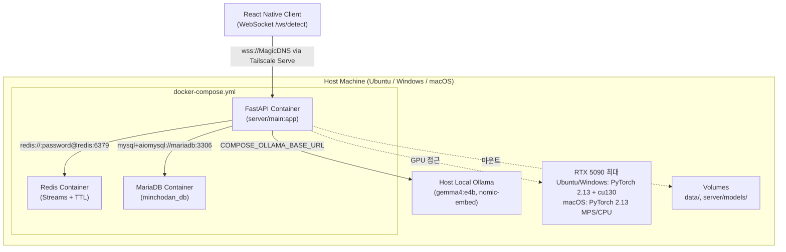

# Minchodan 배포 가이드

> **작성일**: 2026-06-27
> **버전**: v0.5.10 (2026-07-20 kb 병합: 실기기 통합테스트 중 STT 무한 대기 결함 확인 - huggingface_hub 캐시 미영속화로 컨테이너 재생성마다 faster-whisper-small 재다운로드가 발생, 느린 네트워크에서 중간에 정체되면 STT가 응답 없이 무한 대기. `hf_cache` 명명 볼륨을 fastapi 서비스(Linux/macOS 변형 모두)에 추가해 해결. 기존 v0.5.9 이력 유지: jy 병합 Raspberry Pi DB·미디어 demo/test 무빌드 전환 추가. 기존 v0.5.8 이력 유지: 코드-문서 정합 mariadb 포트 검증 기대결과 정정, schema.sql 마운트 경로 정정, §7.1 console 행 추가, macOS 변형 fastapi 0.0.0.0 바인딩 예외 명시)
> **설계 기준**: [`../design/architecture.md`](../design/architecture.md) 2절(기술 스택)·13절(MCP 연동)
> **환경 변수 기준**: [`environment_variables.md`](environment_variables.md)
> **코딩 패턴 기준**: [`../dev-guides/course_codebase_guide.md`](../dev-guides/course_codebase_guide.md) 3.3(경로)·3.4(.env)

---

## 1. 목적

본 문서는 Minchodan의 **Docker 기반 배포 절차**를 단일 명세로 정의합니다. 기존 `docker/` 폴더의 DoctorSkin용 스크립트를 Minchodan용(Redis + MariaDB + FastAPI 3컨테이너 구성, Ollama는 호스트 로컬 프로세스)으로 전면 재작성한 내용을 포함하며, `test_specification.md` TC-SMOKE-004 "Docker 구성" 검증 기준을 충족합니다.

---

## 2. 컨테이너 아키텍처



### 2.1 컨테이너 구성 매트릭스

| 컨테이너 | 이미지 | 포트 | 볼륨 마운트 | 역할 |
| :--- | :--- | :--- | :--- | :--- |
| **fastapi** | `minchodan-server:latest` (로컬 빌드) | `127.0.0.1:${WS_PORT:-8000}:8000` | `server/scripts/tests` 읽기 전용, `data` 쓰기 가능, `hf_cache:/home/minchodan/.cache/huggingface`(2026-07-20 신규) | 비루트 사용자 FastAPI + WebSocket/SSE. 공통 `.env`와 선택적 `.env.network.*`를 `env_file`로 주입하며 외부 단말은 Tailscale Serve의 TLS 종단을 경유. `hf_cache`는 faster-whisper-small 등 huggingface_hub 모델을 영속화해 컨테이너 재생성마다 재다운로드(느린 네트워크에서 STT 무한 대기 유발 확인)하지 않도록 함 |
| **redis** | `redis:7-alpine` (공식) | `127.0.0.1:6379:6379` | `redis_data:/data` | `REDIS_PASSWORD` 필수, AOF 영속화, Redis Streams + 컨텍스트 TTL |
| **mariadb** | `mariadb:11.4` (공식) | 미노출(주석 처리, 2026-07-17) | `mariadb_data:/var/lib/mysql`, `../server/db/schema.sql:/docker-entrypoint-initdb.d/1-schema.sql:ro` (Linux 변형, 2026-07-20 정정) | 공유 GPU 서버 로컬 3306 포트 충돌 방지를 위해 호스트 포트 노출을 비활성화. 원격 DB(`DB_HOST`) 기본 연결 유지, 로컬 노출이 필요하면 `docker-compose.macos.yml` 사용 (macOS 변형은 schema.sql 마운트 미적용) |
| **console** | `minchodan-console:latest` (로컬 빌드) | `127.0.0.1:${CONSOLE_PORT:-5174}:5174` | `./console:/app`, `/app/node_modules` | 권한 제한 `node` 사용자로 Vite 콘솔 실행. 외부 공개가 필요하면 인증된 TLS 프록시를 별도로 사용 |

> Ollama는 Compose 서비스가 아닙니다. 호스트에서 `ollama serve`로 실행하고, FastAPI 컨테이너는 `COMPOSE_OLLAMA_BASE_URL` 값을 통해 호스트 Ollama에 접속합니다.
> WSL2/Linux처럼 `systemd`가 동작하지 않는 환경에서는 `docker/linux_docker_start.sh`가 `ollama serve`를 백그라운드 실행합니다. 기본은 `127.0.0.1:11434`이며, Docker 컨테이너 접근을 위해 전체 인터페이스 바인딩이 필요할 때만 `MINCHODAN_EXPOSE_OLLAMA=1`과 `OLLAMA_HOST=0.0.0.0:11434`를 명시합니다.
> Linux Compose는 브리지 서브넷과 게이트웨이를 `172.18.0.0/16`, `172.18.0.1`로 고정합니다. 전체 인터페이스에 바인딩한 Ollama는 다음 최소 UFW 규칙으로 Compose 대역에서만 접근을 허용합니다: `sudo ufw allow from 172.18.0.0/16 to 172.18.0.1 port 11434 proto tcp`.

### 2.2 GPU 접근 가드레일

| 항목 | 지침 |
| :--- | :--- |
| **OS별 가속 기준** | 팀 최대 RTX 5090. Ubuntu x86_64/Windows amd64는 PyTorch 2.13 + CUDA 13.0(cu130) 및 NVIDIA R580 이상, macOS는 PyTorch 2.13 MPS/CPU |
| **가속 검증** | 배포 전 `python scripts/verify_gpu.py`로 Ubuntu·Windows의 CUDA 13과 GPU 연산 또는 macOS의 MPS/CPU 연산 검증 |
| **컨테이너 GPU 전달** | `docker-compose.yml`의 `fastapi` 서비스에 `deploy.resources.reservations.devices`로 GPU 전달 |
| **Ollama 실행 위치** | Ollama는 호스트 로컬 프로세스로 실행합니다. Docker 컨테이너에 모델 볼륨을 만들지 않습니다. |

---

## 3. 사전 준비

### 3.1 필수 소프트웨어

| 소프트웨어 | 버전 | 용도 |
| :--- | :--- | :--- |
| **Docker Engine** | 24.0+ | 컨테이너 런타임 |
| **Docker Compose** | v2.20+ | 멀티 컨테이너 오케스트레이션 |
| **Ollama** | 최신 안정 버전 | 호스트 로컬 LLM 및 임베딩 서버 |
| **NVIDIA Driver** | 550+ | Blackwell GPU 지원 |
| **NVIDIA Container Toolkit** | 최신 | Docker 컨테이너 GPU 접근 |

### 3.2 환경 변수 설정

```powershell
# Windows (PowerShell)
Copy-Item .env.example .env
# .env 파일을 편집하여 실제 값을 채웁니다.
# 상세 변수 목록은 docs/environment_variables.md를 참조.
```

```bash
# macOS / Linux (bash 또는 zsh)
cp .env.example .env
# .env 파일을 편집하여 실제 값을 채웁니다.
# macOS Colima에서 수동 compose 실행 시:
# COMPOSE_OLLAMA_BASE_URL=http://host.lima.internal:11434
```

### 3.3 호스트 로컬 Ollama 모델 사전 다운로드 (최초 1회)

```bash
# 별도 터미널에서 Ollama 서버 실행
# 안전한 로컬 기본값
OLLAMA_HOST=127.0.0.1:11434 ollama serve

# 신뢰할 수 있는 로컬망에서 전체 인터페이스 바인딩이 꼭 필요할 때만
MINCHODAN_EXPOSE_OLLAMA=1 OLLAMA_HOST=0.0.0.0:11434 ollama serve

# 모델 pull
ollama pull gemma4:e4b
ollama pull nomic-embed-text
ollama pull bge-m3
```

> 모델 다운로드는 최초 1회만 수행하며, 호스트의 Ollama 모델 저장소에 영속화됩니다. 현재 RAG 캡셔닝은 Gemini API 경로가 기준이므로 `llava`는 기본 Docker 실행 절차에서 제외합니다.
>
> `bge-m3`는 생활지원 RAG(`convenience_guidelines` 컬렉션) 임베딩 전용 모델입니다. 보행 안전 수칙 RAG는 `nomic-embed-text`를 사용하므로 두 모델 모두 필요합니다.

---

## 4. 배포 절차

### 4.1 Windows (PowerShell)

```powershell
# 1. 프로젝트 루트로 이동
cd D:\korea_IT\2025_LangChain_\Minchodan

# 2. 환경 변수 설정 (최초 1회)
Copy-Item .env.example .env
# .env 편집

# 3. Docker 컨테이너 빌드 및 시작
docker\windows_docker_start.bat

# 4. Ollama 모델 다운로드
# Linux 시작 스크립트는 누락 모델을 자동으로 pull합니다.

# 5. RAG 지식베이스 빌드 (최초 1회, 4단계)
python scripts/build_safety_db.py
python scripts/build_convenience_db.py
```

### 4.2 macOS / Linux (bash 또는 zsh)

```bash
# 1. 프로젝트 루트로 이동
cd /path/to/Minchodan

# 2. 환경 변수 설정 (최초 1회)
cp .env.example .env
# .env 편집

# 3. Docker 컨테이너 빌드 및 시작
bash docker/linux_docker_start.sh    # Linux
# 또는
bash docker/macos_docker_start.sh    # macOS

# 4. Ollama 모델 다운로드 (최초 1회, 호스트에서 실행)
ollama pull gemma4:e4b
ollama pull nomic-embed-text
ollama pull bge-m3

# 5. RAG 지식베이스 빌드 (최초 1회, 4단계)
python scripts/build_safety_db.py
python scripts/build_convenience_db.py
```

### 4.3 수동 배포 (Docker Compose 직접 호출)

```bash
# 빌드
docker compose --env-file .env -f docker/docker-compose.yml build

# 백그라운드 시작
docker compose --env-file .env -f docker/docker-compose.yml up -d

# 로그 확인
docker compose --env-file .env -f docker/docker-compose.yml logs -f fastapi

# 정지
docker compose --env-file .env -f docker/docker-compose.yml down
```

### 4.4 Raspberry Pi 내부망·Tailscale 프로필 전환

Raspberry Pi 한 대가 MariaDB와 중앙 미디어 API를 함께 제공할 때, 시연은 내부망, 테스트는 Tailscale 경로를 사용합니다. 비밀번호와 토큰은 루트 `.env`에 유지하고 접속 대상만 Git-ignore된 프로필 파일로 분리합니다.

| 프로필 | DB 대상 | 미디어 API 대상 |
| :--- | :--- | :--- |
| **`demo`** | `[PI_LAN_HOST]:[DB_PORT]` | `http://[PI_LAN_HOST]:[MEDIA_API_PORT]` |
| **`test`** | `[PI_TAILSCALE_HOST]:[DB_PORT]` | `http://[PI_TAILSCALE_HOST]:[MEDIA_API_PORT]` |

`.env.network.demo` 형식:

```dotenv
NETWORK_ENV_FILE=../.env.network.demo
DB_HOST=[PI_LAN_HOST]
DB_PORT=[DB_PORT]
IMAGE_SERVER_BASE_URL=http://[PI_LAN_HOST]:[MEDIA_API_PORT]
```

`.env.network.test` 형식:

```dotenv
NETWORK_ENV_FILE=../.env.network.test
DB_HOST=[PI_TAILSCALE_HOST]
DB_PORT=[DB_PORT]
IMAGE_SERVER_BASE_URL=http://[PI_TAILSCALE_HOST]:[MEDIA_API_PORT]
```

전환 명령:

```bash
bash scripts/switch_rpi_network.sh demo
bash scripts/switch_rpi_network.sh test
```

스크립트는 DB TCP와 미디어 `/health`를 먼저 검사하고, Compose 구성을 검증한 다음 FastAPI만 `--no-build --no-deps --force-recreate`로 교체합니다. macOS에서는 `socat` 프록시를 launchd 작업으로 관리해 선택된 DB 경로로 함께 전환합니다. 최초 1회 `brew install socat`이 필요합니다.

| 구분 | 동작 |
| :--- | :--- |
| **이미지** | 기존 `minchodan-server:latest` 재사용 |
| **컨테이너** | 새 환경변수 반영을 위해 FastAPI 재생성 |
| **DB·Redis 볼륨** | 보존, `down -v` 사용 금지 |
| **검증 전용** | `MINCHODAN_SWITCH_CHECK_ONLY=1 bash scripts/switch_rpi_network.sh demo` |

Raspberry Pi 미디어 API는 두 인터페이스에서 접근할 수 있도록 `0.0.0.0:[MEDIA_API_PORT]`에 바인딩하고, UFW에서 내부망 대역과 `tailscale0`만 허용합니다. 내부 IP는 DHCP 예약으로 고정합니다.

---

## 5. OS별 시작 스크립트 명세

`docker/` 폴더의 OS별 시작 스크립트 3종은 공통 흐름을 공유하며, 각 OS의 셸 문법에 맞게 작성됩니다.

### 5.1 공통 실행 흐름

| 단계 | 작업 | 실패 시 동작 |
| :--- | :--- | :--- |
| 1 | Docker 데몬 실행 여부 확인 | 에러 메시지 출력 후 종료 |
| 2 | `.env` 파일 존재 여부 확인 | 에러 메시지 출력 후 종료 |
| 3 | Linux: 호스트 Ollama 실행 및 `gemma4:e4b`/`nomic-embed-text` 모델 확인 | Ollama 미설치·기동 실패·pull 실패 시 종료 |
| 4 | `docker compose config` 유효성 검사 | 에러 메시지 출력 후 종료 |
| 5 | `docker compose build` 이미지 빌드 | 에러 메시지 출력 후 종료 |
| 6 | `docker compose up -d` 컨테이너 시작 | 에러 메시지 출력 후 종료 |
| 7 | FastAPI 포트(8000) 연결 대기 (최대 60초) | 경고 출력 후 계속 |
| 8 | 접속 URL 출력 | - |

### 5.2 스크립트 파일 매핑

| OS | 스크립트 | 셸 |
| :--- | :--- | :--- |
| **Windows** | `docker/windows_docker_start.bat` | cmd.exe batch |
| **Linux** | `docker/linux_docker_start.sh` | bash |
| **macOS** | `docker/macos_docker_start.sh` | bash |

> 주의: 기존 `docker/` 스크립트 3종은 DoctorSkin 프로젝트용으로 작성되어 있었습니다. 2026-06-27에 Minchodan용으로 전면 재작성되었습니다. DoctorSkin의 `bump_docker_tag.ps1` 연동, `doctorskin` 이미지 태그, `HOST_PORT=8100` 등의 기존 로직은 모두 제거되었습니다.

---

## 6. Dockerfile 명세

### 6.1 FastAPI 컨테이너 (`docker/Dockerfile`)

| 항목 | 값 |
| :--- | :--- |
| **베이스 이미지** | `python:3.13-slim` |
| **작업 디렉토리** | `/app` |
| **시스템 패키지** | `curl`, `git`, `libgl1` (OpenCV 의존성) |
| **Python 의존성** | `requirements.txt` 기반 `pip install` |
| **포트 노출** | `8000` |
| **명령** | `uvicorn server.main:app --host 0.0.0.0 --port 8000` |
| **GPU 지원** | `nvidia-container-toolkit` 통해 런타임에 GPU 전달 |

### 6.2 컨테이너 파일 구조

```shell
/app/
├── server/                    # FastAPI 앱 (볼륨 마운트)
├── data/                      # RAG 데이터 (볼륨 마운트)
├── scripts/                   # 유틸리티 스크립트 (볼륨 마운트)
├── tests/                     # 테스트 (볼륨 마운트)
├── requirements.txt           # Python 의존성 (COPY)
└── .env                       # 환경 변수 (볼륨 마운트, 읽기 전용)
```

---

## 7. docker-compose.yml 명세

### 7.1 서비스 정의

| 서비스 | 이미지 | 빌드 컨텍스트 | 의존성 | 재시작 정책 |
| :--- | :--- | :--- | :--- | :--- |
| **fastapi** | `minchodan-server:latest` | `..` (프로젝트 루트) | `redis`, `mariadb` | `unless-stopped` |
| **redis** | `redis:7-alpine` | (공식 이미지) | - | `unless-stopped` |
| **mariadb** | `mariadb:11.4` | (공식 이미지) | - | `unless-stopped` |
| **console** | `minchodan-console:latest` | `../console` | `fastapi` | `unless-stopped` |

### 7.2 볼륨 정의

| 볼명 | 마운트 대상 | 용도 |
| :--- | :--- | :--- |
| `redis_data` | `redis:/data` | Redis 영속화 |
| `mariadb_data` | `mariadb:/var/lib/mysql` | MariaDB 데이터 영속화 |
| `hf_cache` | `fastapi:/home/minchodan/.cache/huggingface` | **2026-07-20 신규.** huggingface_hub 모델 캐시(faster-whisper-small 등) 영속화. 미마운트 시 컨테이너 재생성마다 ~480MB 재다운로드가 필요하고, 느린 네트워크에서 다운로드가 중간에 멈추면 STT가 응답 없이 무한 대기하는 결함이 실기기 테스트에서 확인됨 |

### 7.3 네트워크

모든 컨테이너는 `minchodan-net`이라는 브리지 네트워크를 공유합니다. Linux Compose는 UFW 규칙과 호스트 별칭이 재생성 후에도 일치하도록 서브넷 `172.18.0.0/16`, 게이트웨이 `172.18.0.1`을 고정하고 `host.docker.internal`을 해당 게이트웨이에 매핑합니다. Redis는 인증 URL을 사용하고, MariaDB는 루트 `.env`의 원격 `DB_HOST`를 기본 유지하되 로컬 Compose DB가 필요할 때만 `COMPOSE_DB_HOST=mariadb`로 전환합니다. 호스트 공개 포트는 루프백에만 바인딩하며, Tailscale 외부 단말은 Tailscale Serve의 HTTPS/WSS 역방향 프록시를 통해 접근합니다.

> 주의: Compose는 FastAPI의 `REDIS_URL`과 `OLLAMA_BASE_URL`을 컨테이너·호스트 연결 기준으로 재설정합니다. DB는 공동 Raspberry Pi MariaDB 사용 시 루트 `.env` 값을 유지하고, 로컬 Compose DB가 필요한 경우에만 `COMPOSE_DB_HOST`, `COMPOSE_DB_PORT`, `COMPOSE_DB_NAME`, `COMPOSE_DB_USER`로 재정의합니다.
>
> | 변수 | 로컬 개발 | Docker Compose |
> | :--- | :--- | :--- |
> | `REDIS_URL` | `redis://:${REDIS_PASSWORD}@localhost:6379` | `redis://:${REDIS_PASSWORD}@redis:6379` |
> | `OLLAMA_BASE_URL` | `http://localhost:11434` | `${COMPOSE_OLLAMA_BASE_URL}` |
> | `DB_HOST` | `.env`의 원격 또는 로컬 호스트 | `${COMPOSE_DB_HOST:-${DB_HOST:-mariadb}}` |
> | `DB_PORT` | `.env`의 MariaDB 포트 | `${COMPOSE_DB_PORT:-3306}` |

### 7.4 보안 및 인증 전제

| 통제 항목 | 적용 상태 |
| :--- | :--- |
| **비밀값 생성** | `python scripts/configure_security_secrets.py`가 JWT·Redis·Compose DB·개발 단말 토큰을 무작위 생성하고 `.env` 권한을 `600`으로 제한 |
| **Redis** | `REDIS_PASSWORD` 없이는 Compose 구성이 실패하며 `requirepass`를 항상 적용 |
| **MariaDB** | `COMPOSE_DB_PASSWORD`와 `COMPOSE_DB_ROOT_PASSWORD` 기본 폴백을 제거해 미설정 시 즉시 실패 |
| **호스트 포트** | FastAPI·Redis·MariaDB·콘솔 포트를 `127.0.0.1`에만 바인딩 (Linux 변형). **macOS 변형 예외**(`docker-compose.macos.yml`): FastAPI는 `${WS_BIND_HOST:-0.0.0.0}`로 바인딩해 Tailscale IP 직접 접속을 허용(2026-07-20, Tailscale Serve 경유 없이 단말이 직접 Tailscale IP:8000으로 접속하는 시나리오 지원) |
| **컨테이너 권한** | FastAPI와 콘솔을 비루트 사용자로 실행하고 모든 서비스에 `no-new-privileges` 적용 |
| **Tailscale 공개** | iOS ATS 전역 예외 없이 `wss`를 사용하도록 Tailscale Serve 또는 동등한 TLS 종단 필요 |

Tailscale Serve는 FastAPI의 루프백 포트를 tailnet 전용 HTTPS/WSS 종단으로 프록시합니다. 최초 1회 tailnet 관리자 승인과 로컬 운영자 지정이 필요합니다.

```bash
# 최초 1회: 출력되는 승인 URL에서 Serve 활성화 후 현재 사용자에게 운영 권한 부여
sudo tailscale set --operator="$USER"

# FastAPI HTTP와 /ws/detect WebSocket을 동일한 TLS 종단으로 프록시
tailscale serve --bg http://127.0.0.1:8000
tailscale serve status
```

클라이언트 로컬 `client/.env`는 인증서가 일치하는 MagicDNS 이름과 HTTPS 표준 포트를 사용합니다.

```dotenv
EXPO_PUBLIC_NETWORK_MODE=tailscale
EXPO_PUBLIC_TAILSCALE_HOST=<서버_MagicDNS_이름>.ts.net
EXPO_PUBLIC_SERVER_PORT=443
EXPO_PUBLIC_WS_SCHEME=wss
```

---

## 8. .dockerignore 명세

`.dockerignore`는 빌드 컨텍스트에서 제외할 파일 패턴을 정의합니다. 빌드 시간 단축과 이미지 크기 최소화가 목적입니다.

| 제외 대상 | 패턴 | 사유 |
| :--- | :--- | :--- |
| Python 캐시 | `__pycache__/`, `*.pyc` | 불필요 |
| 가상환경 | `.venv/`, `venv/` | 컨테이너 내 별도 설치 |
| 환경 변수 | `.env` | 빌드 컨텍스트에서 제외하고 Compose `env_file`로 런타임 주입 |
| Git | `.git/` | 불필요 |
| 테스트 캐시 | `.pytest_cache/` | 불필요 |
| IDE 설정 | `.vscode/`, `.idea/` | 불필요 |
| 문서 | `docs/` | 컨테이너에 불필요 |
| OS 파일 | `.DS_Store`, `Thumbs.db` | 불필요 |

---

## 9. 배포 검증

### 9.1 컨테이너 상태 확인

```bash
# 모든 컨테이너 실행 상태
docker compose --env-file .env -f docker/docker-compose.yml ps

# 기대 결과:
# NAME                 STATUS         PORTS
# minchodan-fastapi    Up             127.0.0.1:8000->8000/tcp
# minchodan-redis      Up             127.0.0.1:6379->6379/tcp
# minchodan-mariadb    Up             (포트 미노출, 2026-07-17 주석 처리)
# minchodan-console    Up             127.0.0.1:5174->5174/tcp
```

### 9.2 엔드포인트 연결 확인

| 엔드포인트 | 명령 | 기대 결과 |
| :--- | :--- | :--- |
| FastAPI | `curl http://localhost:8000/docs` | Swagger UI HTML |
| Redis | `REDISCLI_AUTH="$REDIS_PASSWORD" redis-cli ping` | `PONG` |
| MariaDB | `docker exec -it minchodan-mariadb sh -c 'mariadb -u"$MARIADB_USER" -p"$MARIADB_PASSWORD" "$MARIADB_DATABASE" -e "SELECT 1"'` | `1` |
| Ollama | `curl http://localhost:11434/api/tags` | 모델 목록 JSON |

### 9.3 TC-SMOKE-004 검증 (Docker 구성)

본 배포 가이드는 [`docs/test_specification.md`](test_specification.md)의 TC-SMOKE-004 "Docker 구성: Redis + MariaDB + FastAPI 컨테이너 + 호스트 로컬 Ollama 연결" 검증 기준을 충족합니다.

| 검증 항목 | 기준 | 본 가이드 대응 |
| :--- | :--- | :--- |
| 컨테이너 3종 기동 | Redis + MariaDB + FastAPI 동시 실행 | 7.1절 서비스 정의 |
| 컨테이너 간 통신 | FastAPI -> Redis, FastAPI -> 원격 또는 로컬 MariaDB | 7.3절 네트워크 (`DB_HOST`·`COMPOSE_DB_HOST` 대상 선택) |
| 호스트 Ollama 연결 | FastAPI -> 호스트 로컬 Ollama | `COMPOSE_OLLAMA_BASE_URL` 환경 변수 |
| GPU 접근 | FastAPI 컨테이너에서 CUDA 연산 | 2.2절 GPU 접근 가드레일 |
| 볼륨 영속화 | Redis 데이터, MariaDB 데이터 | 7.2절 볼륨 정의 |

---

## 10. 트러블슈팅

| 증상 | 원인 | 해결 방법 |
| :--- | :--- | :--- |
| FastAPI 컨테이너가 Ollama에 연결 불가 | 호스트 Ollama 미기동, `127.0.0.1`로만 바인딩, 또는 Linux UFW 규칙 누락 | Linux/WSL은 `bash docker/linux_docker_start.sh`로 자동 기동합니다. Docker 컨테이너 접근 시 `MINCHODAN_EXPOSE_OLLAMA=1`, `OLLAMA_HOST=0.0.0.0:11434`를 설정하고 `sudo ufw allow from 172.18.0.0/16 to 172.18.0.1 port 11434 proto tcp`를 적용합니다. Docker Desktop/Windows/Linux는 `http://host.docker.internal:11434`, macOS Colima는 `http://host.lima.internal:11434`를 사용합니다. |
| FastAPI 컨테이너가 Redis에 연결 불가 | Redis 인증 URL 불일치 | `REDIS_PASSWORD`와 `REDIS_URL=redis://:${REDIS_PASSWORD}@redis:6379`의 일치 여부 확인 |
| FastAPI 컨테이너가 MariaDB에 연결 불가 | 기존 원격 `DB_HOST` 또는 선택적 `COMPOSE_DB_HOST`가 의도한 대상을 가리키지 않거나 MariaDB healthcheck 실패 | 원격 DB 유지 시 `.env`의 `DB_HOST`, 로컬 컨테이너 사용 시 `COMPOSE_DB_HOST=mariadb`, 공통으로 `DB_PORT=3306` 적용 여부를 확인 |
| MariaDB 컨테이너가 시작되지 않음 | `COMPOSE_DB_PASSWORD` 또는 `COMPOSE_DB_ROOT_PASSWORD` 누락 | `.env` 값 확인 (2026-07-17부터 `docker-compose.yml`은 호스트 포트를 노출하지 않아 3306 충돌은 발생하지 않음. macOS 변형에서 포트 충돌 시 `DB_HOST_PORT`를 빈 포트로 변경) |
| GPU 인식 실패 | NVIDIA Container Toolkit 미설치 | `nvidia-container-toolkit` 설치 후 Docker 데몬 재시작 |
| Ollama 모델 pull 실패 | 디스크 공간 부족 또는 네트워크 | 호스트에서 디스크 여유 공간 확인 (gemma4:e4b 약 9.6GB) |
| 포트 8000 충돌 | 기존 프로세스 사용 중 | `WS_PORT` 환경 변수 변경 또는 기존 프로세스 종료 |
| `.env` 파일 미발견 | `.env.example`을 `.env`로 복사하지 않음 | `cp .env.example .env` 실행 |

---

## 11. 관련 파일 인덱스

| 파일 | 경로 | 설명 |
| :--- | :--- | :--- |
| Dockerfile | [`docker/Dockerfile`](../../docker/Dockerfile) | FastAPI 컨테이너 이미지 정의 |
| docker-compose.yml | [`docker/docker-compose.yml`](../../docker/docker-compose.yml) | 3컨테이너 오케스트레이션 (GPU 서버용, `deploy.resources` GPU 예약 포함) |
| docker-compose.macos.yml | [`docker/docker-compose.macos.yml`](../../docker/docker-compose.macos.yml) | macOS 로컬 테스트용 CPU 전용 3컨테이너 변형 (GPU `deploy` 블록 없음). `macos_docker_start.sh`/`windows_docker_start.bat`가 실제로 이 파일을 사용함 |
| .dockerignore | [`.dockerignore`](../../.dockerignore) | 루트 build context 기준 제외 패턴 |
| Windows 시작 스크립트 | [`docker/windows_docker_start.bat`](../../docker/windows_docker_start.bat) | Windows용 빌드·시작 자동화 |
| Linux 시작 스크립트 | [`docker/linux_docker_start.sh`](../../docker/linux_docker_start.sh) | Linux용 빌드·시작 자동화 |
| macOS 시작 스크립트 | [`docker/macos_docker_start.sh`](../../docker/macos_docker_start.sh) | macOS용 빌드·시작 자동화 |
| 환경 변수 명세서 | [`environment_variables.md`](environment_variables.md) | 환경 변수 단일 명세 |
| GPU 검증 스크립트 | [`scripts/verify_gpu.py`](../../scripts/verify_gpu.py) | RTX 5090·CUDA 13.0 또는 macOS MPS/CPU 검증 |
