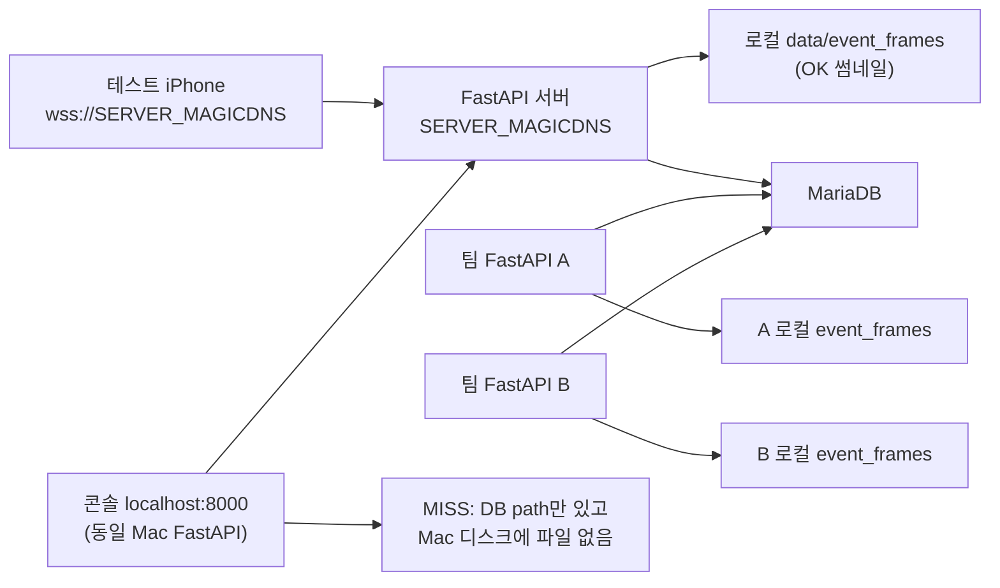

# 콘솔 Detection Guidance Log 이미지 유실 조사 정리

> **작성일**: 2026-07-15
> **버전**: v0.1.0
> **대상**: kb 브랜치 / 2026-07-15 실측 세션 (고태현 iPhone + Mac mini Docker FastAPI + RPi MariaDB)
> **관련 설계**: [`docs/design/api_specification.md`](../design/api_specification.md) §8.5, [`docs/design/architecture.md`](../design/architecture.md) §13.3.1

---

## 1. 증상

운영 콘솔 **Detection Guidance Log** 테이블에서 다음 두 가지가 혼재한다.

| 표시 | 의미 | 사용자 체감 |
| :--- | :--- | :--- |
| **`-`** (썸네일 없음) | DB `frame_path`가 `NULL` | 이미지 자체가 없음 |
| **썸네일 깨짐 / 404** | DB `frame_path`는 있으나 `GET /api/v1/admin/event-frames/{event_id}`가 404 | "저장했다고 나오는데 이미지가 없음" |

본 문서는 특히 **DB에 경로만 있고 로컬 디스크에 JPEG가 없는 경우**(이하 **MISS**)를 중심으로 정리한다.

---

## 2. 이벤트 프레임 저장 계약 (기준)

| 항목 | 내용 |
| :--- | :--- |
| **저장 주체** | `DetectionConsumer._persist_log_safe()` 백그라운드 태스크 |
| **저장 시점** | 반사 알림 또는 인지 guide 전송 **이후** (`save_event_frame` → DB INSERT) |
| **디스크 경로** | `data/event_frames/YYYYMMDD/{event_id}.jpg` |
| **DB 필드** | `detection_guidance_logs.frame_path` (상대 경로만) |
| **서빙 API** | `GET /api/v1/admin/event-frames/{event_id}` |
| **실패 처리** | 저장 실패 시 `frame_path=NULL`, 로그 행은 계속 적재 |
| **STT** | `ws_router`의 `stt_audio` 경로는 프레임 미전달 → `frame_path` 항상 NULL |

코드 경로:

- `server/services/event_frame_store.py`
- `server/detection/consumer.py` (`_persist_log_safe`)
- `server/api/detection_log_router.py`
- `console/src/components/DetectionGuidanceLogTable.tsx` (`frame_path` 있을 때만 ``)

---

## 3. 조사 타임라인 요약

| 순서 | 주제 | 결론 |
| :--- | :--- | :--- |
| 1 | 콘솔 `-` / 깨진 썸네일 원인 | STT·기능 도입 전 로그·공유 DB+로컬 디스크 분리 등 복합 |
| 2 | 콘솔 API를 앱과 같은 호스트로 / 공유 스토리지 | **앱=원격·콘솔=로컬** 가설은 **이 환경에서는 반만 맞음** |
| 3 | MISS 266건 (2026-07-15) 원인 | 바인드 마운트·레이스·중복 `event_id` **아님** |
| 4 | 다른 writer 위치 | DB `PROCESSLIST`로 **다중 FastAPI writer** 확인 |
| 5 | `whois`로 호스트 이름 확정 | **원인 추적용**이며, **유실 자체는 해결하지 않음** |

---

## 4. `-` 표시 (frame_path NULL) — 정상/설계 범주

2026-07-15 기준 DB 집계(전체 로그 약 3,667건):

| 원인 | 건수(대략) | 설명 |
| :--- | :--- | :--- |
| **STT 로그** (`stt-dev-001-...`) | 685 | 음성 명령 경로, 카메라 프레임 없음 |
| **7/10~7/11 탐지 로그** | 668 | `event_frames` 기능 **7/12 도입 이전** |
| **7/12 이후 STT null** | 지속 발생 | 당일 null 53건 전부 STT |

콘솔은 `frame_path`가 없으면 의도적으로 `-`를 표시한다 (`DetectionGuidanceLogTable.tsx`).

---

## 5. MISS (frame_path 있음 + 파일 없음) — 2026-07-15 실측

### 5.1 수치

| 항목 | 값 |
| :--- | :--- |
| **조사일** | 2026-07-15 |
| **DB `frame_path` 보유 (당일)** | 527건 |
| **로컬 디스크 JPEG (당일 `20260715/`)** | 261건 |
| **MISS** | **266건** (약 50%) |
| **디스크에만 있고 DB에 없는 파일** | 0건 |

API 검증 예:

- `frame_path` 있고 파일 있음 → `GET .../event-frames/{event_id}` **200**
- MISS 샘플 → **404**

### 5.2 배제된 가설

| 가설 | 검증 | 결과 |
| :--- | :--- | :--- |
| **바인드 마운트 고장** | Docker→호스트 동시 쓰기 40/40, probe 파일 호스트 반영 | **배제** |
| **저장 레이스 (path 먼저, 파일 나중)** | `_persist_log_safe`는 `save_event_frame` 후 DB INSERT | 코드상 순서 정상 |
| **중복 event_id dedup** | 당일 duplicate 0건, `UK_DETECTION_GUIDANCE_LOGS_EVENT_ID` | **배제** |
| **개별 JPEG 삭제** | `event_frame_store`는 날짜 폴더 단위 `cleanup_expired_frames`만 | **배제** |
| **앱=원격 / 콘솔=로컬 호스트 불일치** | 앱 WS와 콘솔 API 모두 **동일 서버 `[SERVER_MAGICDNS]:8000`** | **단독 원인 아님** |

### 5.3 결정적 증거: 이 Mac FastAPI는 MISS를 한 번도 처리하지 않음

현재 컨테이너 `minchodan-fastapi` 로그에서 `FrameDecoder` 수신 / `guide 전송` / `반사 알림 전송` 기준:

| 구분 | 이 컨테이너 처리 여부 |
| :--- | :--- |
| **파일 있는 OK 268건** | **268/268 처리됨** |
| **MISS 267건** | **0/267 처리됨** (콘솔 404 GET 로그만 존재) |

MISS 샘플(`event-dev-001-reflex-1784105448378` 등)은 **FrameDecoder/guide/반사 알림 로그가 없음**.
반면 OK 샘플(`...4388127`)은 수신 → guide 전송 → 파일 존재 → API 200.

**결론**: MISS 행의 `frame_path`는 **다른 FastAPI 인스턴스**가 자기 로컬 디스크에 저장한 뒤 **공유 MariaDB에만 경로를 남긴 것**이다. 콘솔은 이 Mac의 `data/event_frames`에서 조회하므로 404가 난다.

### 5.4 시간대 교차 패턴

08:30~08:35 UTC 구간에서 OK/MISS가 **초 단위로 교차** (동일 `device_id=3`, 동일 날짜 폴더 `20260715/`).
단일 writer라면 설명하기 어렵고, **동시에 여러 FastAPI가 같은 DB에 INSERT**하는 그림과 일치한다.

---

## 6. 현재 네트워크·토폴로지 (2026-07-15 실측)

### 6.1 단말(앱) 실제 WS URL

Metro/`client/.env` 기준 **고태현 iPhone은 아래만 사용**:

```text
wss://[SERVER_MAGICDNS]/ws/detect?device_id=[DEVICE_ID]
```

| 설정 | 값 |
| :--- | :--- |
| `EXPO_PUBLIC_NETWORK_MODE` | `tailscale` |
| `EXPO_PUBLIC_TAILSCALE_HOST` | `[SERVER_MAGICDNS]` |
| Tailscale peer 중 `:8000` FastAPI | **이 Mac만** (`Minchodan GPU Inference Server`) |

### 6.2 공유 MariaDB

| 항목 | 값 |
| :--- | :--- |
| **DB_HOST** | `<TAILSCALE_IP>` (minchodan-rpi-db, moon1053759@ Tailnet) |
| **FastAPI `:8000`** | RPi에는 **없음** |

### 6.3 DB 클라이언트 IP (PROCESSLIST, 실측)

| 소스 IP (DB가 본 주소) | 연결 수 | 해석 |
| :--- | :--- | :--- |
| **`<TAILSCALE_IP>`** | 6 | **이 Mac Docker FastAPI** (컨테이너 `USER()` = `minchodan_team@<TAILSCALE_IP>`) |
| **`<TAILSCALE_IP>`** | 9 | 다른 머신 FastAPI connection pool 추정 |
| **`<TAILSCALE_IP>`** | 7 | 다른 머신 FastAPI connection pool 추정 |
| **`<TAILSCALE_IP>`** | 2 | 기타 클라이언트 |

이 Mac의 Tailscale `status --json` peer에는 `[TAILSCALE_SUBNET_PREFIXES]`(sublet/exit node 등) **호스트명이 노출되지 않음**.
RPi Tailnet(`tail77994d`)과 개발 Mac Tailnet(`tailb6acd5`)이 **분리**되어 있어, Mac에서 `tailscale whois`로 타 IP 해석 불가.

### 6.4 device_id 공유

당일 `detection_guidance_logs`는 전부 `device_id=3` (`user_devices.device_uuid=dev-001`).
팀 기본값 `EXPO_PUBLIC_DEVICE_ID=dev-001`을 여러 FastAPI가 동시에 쓰면, **로그는 한 DB에 모이고 JPEG는 각 서버 로컬에만** 남는다.

---

## 7. 아키텍처 다이어그램



---

## 8. 정합성 판단 (SSOT)

| 선택 | 현재 환경에서의 정합성 |
| :--- | :--- |
| **FastAPI 1대 + 로컬 `event_frames` + 공유 DB** | **정합** (단, writer는 반드시 1대) |
| **콘솔 URL만 Tailscale로 통일** | 주소 표기 통일일 뿐, **MISS 미해결** |
| **공유 스토리지 (`EVENT_FRAMES_DIR` NFS 등)** | FastAPI **2대 이상**일 때만 필요 |
| **`tailscale whois`로 호스트 이름 확정** | **원인 추적용**. 유실 **미해결** |

설계상 계약:

> **추론 FastAPI 1대 = 로그 + `event_frames` 소유자.**
> 앱·콘솔은 그 서버만 본다. MariaDB는 메타데이터만 공유 가능.

현재는 **DB writer가 3대 이상**이라 계약 위반 상태다.

---

## 9. 해결 방안

### 9.1 근본 해결 (권장)

| 방안 | 내용 |
| :--- | :--- |
| **Writer 단일화** | 팀 전원 **하나의 FastAPI**만 `detection_guidance_logs` + `event_frames`에 쓰기 |
| **device_id 분리** | 개발자별 `EXPO_PUBLIC_DEVICE_ID` / `DEVICE_STATIC_TOKENS` 분리 (공유 DB 유지 시) |
| **공유 스토리지** | 모든 FastAPI에 동일 `EVENT_FRAMES_DIR` 마운트 (NFS/SMB 등) |

### 9.2 부분 완화 (근본 해결 아님)

| 방안 | 한계 |
| :--- | :--- |
| 콘솔 `VITE_API_BASE_URL`을 "파일 있는" FastAPI로 변경 | 그 서버가 쓴 로그만 썸네일 OK |
| RPi에서 `tailscale whois <TAILSCALE_IP>` | **누가 쓰는지** 확인만 가능 |

### 9.3 코드/운영 후속 (선택)

| 항목 | 설명 |
| :--- | :--- |
| DB에 `writer_host` / `writer_instance_id` 컬럼 | 어느 FastAPI가 저장했는지 추적 |
| 콘솔 MISS 행에 "타 서버 저장" 배지 | 404 대신 UX 개선 |
| 팀 Tailnet 통합 또는 RPi admin `whois` | `[TAILSCALE_SUBNET_PREFIXES]` 실제 호스트명 확정 |

---

## 10. 호스트 이름 확정 (미완 — RPi 관리자 필요)

Mac 개발 Tailnet에서는 peer 이름을 알 수 없었다. RPi DB Tailnet 관리자(`moon1053759`)에게 아래 실행 요청:

```bash
tailscale whois <TAILSCALE_IP>
tailscale whois <TAILSCALE_IP>
tailscale whois <TAILSCALE_IP>
tailscale status
```

**이 작업만으로는 썸네일 404가 사라지지 않는다.** writer 정책 또는 공유 스토리지가 필요하다.

---

## 11. 참고: 콘솔 API / 앱 호스트 통일 옵션 (대화 중 논의)

앱과 콘솔을 동일 호스트로 맞추는 예 (`console/.env`):

```env
VITE_API_BASE_URL=https://[SERVER_MAGICDNS]
VITE_MONITOR_STREAM_URL=https://[SERVER_MAGICDNS]/api/v1/monitor/stream
```

**2026-07-15 환경**: 콘솔은 이미 `localhost:8000` → 동일 Mac Docker이므로 **추가 변경 효과 없음**.
MISS는 **다른 writer의 DB row** 때문이다.

---

## 12. 관련 파일·문서

| 구분 | 경로 |
| :--- | :--- |
| 프레임 저장 | `server/services/event_frame_store.py` |
| 로그 적재 | `server/detection/consumer.py` |
| STT (프레임 없음) | `server/api/ws_router.py` |
| 이미지 API | `server/api/detection_log_router.py` |
| 콘솔 테이블 | `console/src/components/DetectionGuidanceLogTable.tsx` |
| 환경 변수 | `docs/ops/environment_variables.md` (`EVENT_FRAMES_DIR`) |
| API 계약 | `docs/design/api_specification.md` §8.5 |

---

## 13. 한 줄 요약

**콘솔 이미지 유실(MISS)은 저장 버그가 아니라, 공유 MariaDB에 여러 FastAPI가 `frame_path`를 쓰는데 JPEG는 각 서버 로컬 디스크에만 있기 때문이다. iPhone은 이 Mac FastAPI만 쓰지만, DB에는 다른 팀 서버(`[TAILSCALE_SUBNET_PREFIXES]` 등) 로그가 섞여 콘솔에서 404가 난다.**
