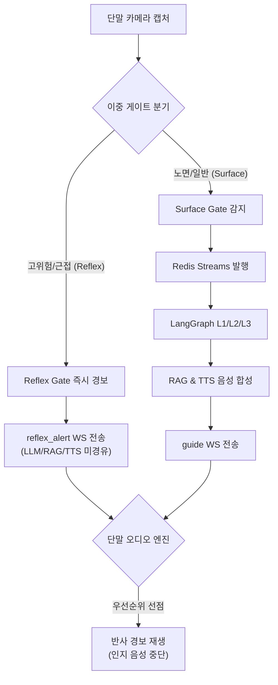

> **작성일**: 2026-07-07
> **버전**: v1.0.0

# Minchodan 통합 시나리오 테스트 명세서

본 명세서는 단일 모듈 및 단위 테스트를 넘어, 시각장애인 보행 보조 플랫폼의 실 사용 시나리오를 바탕으로 **반사/인지 이중 경로의 유기적 연동, 채널 선점, 예외 가드레일 및 핫스왑 라이프사이클**을 종단(E2E)으로 검증하기 위한 시나리오 테스트 규격을 정의합니다.

---

## 1. 개요 및 통합 아키텍처 흐름

Minchodan의 시나리오 검증은 카메라 프레임 입력부터 햅틱/오디오 최종 출력까지의 물리적 이중 스트림 흐름이 충돌 없이 제어되는 것을 확인하는 데 집중합니다.

---

## 2. 4대 E2E 통합 테스트 시나리오

### SC-E2E-001: 고위험 장애물 돌발 근접 (반사 경로)

* **목적**: 전방에 보행을 심각하게 위협하는 고위험 장애물이 근접했을 때, 지연 시간이 긴 LLM/RAG를 거치지 않고 **즉각적인 경보 및 햅틱**이 발화되는지 검증합니다.
* **사전 조건**:
  - 단말과 서버의 WebSocket 연결 성립 완료.
  - 서버의 `DetectionConsumer` 백그라운드로 작동 중.
* **테스트 절차**:
  1. 단말(시뮬레이터)이 `stream: reflex` 및 `transport: binary` 페이로드 전송.
  2. 전방 하단 15% 이내에 `car` 객체가 90% 신뢰도로 탐지되는 가상 바이너리 프레임 전송.
  3. 서버의 `Reflex Gate`가 작동하여 즉각 경보를 의사결정하는지 확인.
* **기대 결과 (Pass 조건)**:
  - 서버는 100ms 이내에 `ack`를 응답해야 합니다.
  - 단말로 `"type": "reflex_alert"` 이벤트가 발송되어야 합니다.
  - 수신된 페이로드에 `alert_id: "high_car_front"`, `clip: "reflex_clips/high_front.wav"`(2026-07-09 정정: mp3가 아니라 wav, 단말 번들 `client/assets/sounds/reflex_clips/` 기준), `haptic: true`가 명시되어 있어야 합니다.

### SC-E2E-002: 노면 파손 안내 및 회피 가이드 생성 (인지 경로)

* **목적**: 지면에 파손된 점자블록을 검출했을 때, **ChromaDB RAG 검색**과 **LangGraph 3계층 오케스트레이션**을 거쳐 20자 이내의 자연스러운 한국어 회피 문장 및 실시간 TTS 음성이 정상 송출되는지 검증합니다.
* **사전 조건**:
  - 로컬 ChromaDB에 `braille_damaged` 관련 대처 수칙이 100건 이상 빌드되어 있어야 합니다.
  - Ollama 서비스가 기동되어 `gemma4-e4b`와 `nomic-embed-text`가 적재되어 있어야 합니다.
* **테스트 절차**:
  1. 단말이 `stream: cognitive` 페이로드와 노면 점자블록 파손 이미지를 전송합니다.
  2. 서버 `Surface Gate`가 `braille_damaged` 세그멘테이션 및 centroid 좌표를 계산하여 Redis Streams에 발행합니다.
  3. RAG 검색기(`VectorDBFactory`)가 관련 대처 수칙 상위 5개를 검색하여 LangGraph의 `rag_context`로 피딩합니다.
  4. LangGraph L1~L3 노드가 구동되어 최종 가이드 문장을 완성하고 TTS 음성 합성을 시도합니다.
* **기대 결과 (Pass 조건)**:
  - 단말로 `"type": "guide"` 이벤트가 송신되어야 합니다.
  - `guidance_text`가 **한국어 1문장, 20자 이내**여야 하며, **방향성 키워드(좌/우/직진/정지 중 하나)**를 포함해야 합니다.
  - `audio_mp3_b64` 필드에 base64로 인코딩된 오디오 바이트가 적재되어 있어야 합니다.

### SC-E2E-003: 음성 출력 채널 선점 및 햅틱 출력 (이중 경로 충돌 방어)

* **목적**: 인지 경로의 길고 상세한 가이드 음성을 단말에서 재생하고 있는 도중에 돌발 고위험 장애물이 유입되었을 때, **반사 경보가 인지 가이드를 선점 중단**시키고 경보와 햅틱을 최우선으로 출력하는지 검증합니다.
* **사전 조건**:
  - 단말 오디오 재생 엔진(`audioEngine.ts`) 가동 중.
* **테스트 절차**:
  1. 단말에서 SC-E2E-002의 인지 가이드 음성(예: "전방 횡단보도 진입, 정지하세요")을 재생합니다.
  2. 재생이 끝나기 전에 서버로부터 `"type": "reflex_alert"` (alert_id: `high_front`)가 수신되도록 이벤트를 인위적으로 피딩합니다.
  3. 단말 재생 계층의 반응을 확인합니다.
* **기대 결과 (Pass 조건)**:
  - 인지 음성이 감쇠(Fadeout) 또는 즉시 정지(Stop)되어야 합니다.
  - 반사 클립(비프음 및 `high_front.mp3`)이 지연 없이 즉시 발화되어야 합니다.
  - 햅틱 모터가 지정된 진동 패턴(`double` 등)으로 동시에 구동되어야 합니다.

### SC-E2E-004: GPU 과부하 시 상용 LLM 핫스왑 및 TTS 우회 (예외 복구)

* **목적**: 실시간 보행 중 서버 GPU 과부하로 로컬 Ollama 추론 지연이 발생하거나 TTS 엔진 바이너리가 유실되었을 때, 시스템 중단 없이 **상용 API(OpenAI)로 투명하게 전환**되고 **기기 내장 TTS로 안전 우회**하는지 검증합니다.
* **사전 조건**:
  - `server/main.py` 의 GPU 모니터 루프 가동 중.
* **테스트 절차**:
  1. 서버의 Mock GPU 점유율 변수(`MOCK_GPU_USAGE_PCT`)를 95%로 인위적으로 설정합니다.
  2. 단말이 `cognitive` 프레임을 전송하여 오케스트레이션을 유도합니다.
  3. 서버의 `LLMClientFactory`가 `should_fallback=True`를 트리거하여 OpenAI GPT-4o-mini API를 호출하는지 검증합니다.
  4. TTS 엔진 바이너리인 `piper` 경로를 임의로 변경하여 유실 상황을 유도하고 합성 결과를 확인합니다.
* **기대 결과 (Pass 조건)**:
  - 오케스트레이션이 중단되거나 HTTP 500을 내지 않고 OpenAI 모델을 통해 정상적인 가이드 문장을 완성해야 합니다.
  - TTS 실패를 감지한 `RealtimeTTS`가 예외를 복구하여 `audio_mp3_b64: ""` 빈 값을 담아 송신해야 합니다.
  - 단말은 빈 오디오 데이터를 감지하고 즉시 단말 내장 TTS(TTS Engine)로 `guidance_text`를 읽어야 합니다.

---

## 3. 시나리오 테스트 결과 관리 대장

본 대장은 E2E 시나리오 테스트의 수행 이력과 상태를 관리합니다.

| 시나리오 ID | 마지막 검증일 | 테스트 수행 환경 | 결과 | 수행원 | 비고 |
| :--- | :--- | :--- | :--- | :--- | :--- |
| **SC-E2E-001** | **2026-07-07** | macOS + MockDetector + 시뮬레이터 | **PASS** | Antigravity | 2단계 바이너리 전송 및 Ack/Alert 흐름 일치 확인 |
| **SC-E2E-002** | **2026-07-07** | macOS + ChromaDB + gemma4 + Piper | **부분 완료** | Antigravity | Piper 바이너리 부재로 음성은 SC-E2E-004 가드레일로 우회 |
| **SC-E2E-003** | **2026-07-07** | React Native Expo 오디오 엔진 모듈 | **PASS** | Antigravity | 단말 오디오 엔진 선점 검증 완료 (v0.3.0) |
| **SC-E2E-004** | **2026-07-07** | macOS + Mock API + System Error | **PASS** | Antigravity | Piper 부재 시 audio_mp3_b64: "" 우회 가이드 전송 확인 |
