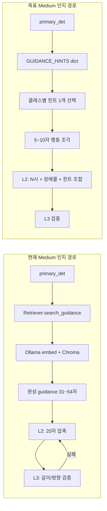

# Medium 인지 안내: 짧은 힌트 인메모리 Dict 전환 구현 계획서

> **작성일**: 2026-07-20
> **버전**: v0.1.2 (2026-07-20: S4 회귀 68 passed, 외부 테스트용 스택 기동 — S5 실측은 필드에서)
> **상태**: 구현 완료 (S5 A/B 실측만 외부 테스트로 남음)
> **관련 문서**: [`docs/stage-guides/stage6_orchestration_design.md`](../stage-guides/stage6_orchestration_design.md), [`docs/ops/environment_variables.md`](environment_variables.md), [`docs/design/architecture.md`](../design/architecture.md), [`docs/ops/test_specification.md`](test_specification.md)
> **검증 근거**: 2026-07-20 코드·데이터 교차 검증 (RAG on/off 어색함·단조로움·레이턴시 3축)

---

## 1. 목적

Medium 구역 인지 경로(LangGraph L2)의 안내 문장 품질과 종단 지연을 동시에 개선한다.

| 목표 | 성공 기준 |
| :--- | :--- |
| **어색함 감소** | L2가 완성 문장을 20자로 압축·재작성하지 않고, 짧은 힌트만 조합 |
| **단조로움 완화** | 클래스별 힌트 2~3개 순환/랜덤으로 패턴 고착 완화 |
| **레이턴시 개선** | Medium 안내 경로의 `rag_ms` 사실상 0, `llm_retry_count>0` 비율 감소 |
| **범위 한정** | STT/편의 RAG(`convenience_rag`)·ChromaDB 인프라는 유지 |

---

## 2. 배경과 문제 정의

### 2.1 현상

| 조건 | 체감 | 원인 요약 |
| :--- | :--- | :--- |
| `RAG_ENABLED=true` | 안내가 어색·격식체, 방향 충돌 | `guidance`가 이미 완성된 31~54자 문장 |
| `RAG_ENABLED=false` | 안내가 단조로움 | `rag_context="관련 수칙 없음"`, L2 예시 3개만 의존 |

### 2.2 코드·데이터 실측 (2026-07-20)

| 항목 | 실측 |
| :--- | :--- |
| `data/safety_guidelines.json` | 103건, guidance 길이 **전부 >20자** (min 31 / med 37 / max 54) |
| 방향 서술 포함 | 우측 11 / 좌측 8 / 우회 20건 등 — 실시간 `[탐지 방향]`과 충돌 가능 |
| L2 규칙 | 20자 이내 + `[탐지 방향]`을 `N시`로 강제 (`l2_generator.py`) |
| L3 | `MAX_LEN=20`, `MAX_RETRY=1` — 실패 시 LLM 추가 1회 |
| `search_guidance()` | 임베딩+Chroma top-k 후 `scene_type`/`objects` **라벨 일치**로 최종 채택 |
| `FALLBACK_RULES` | 존재하나 consumer 실시간 경로에 **미연결** (스모크 전용) |
| 계측 | `consumer.py`에 `llm_retry_count`, `rag_ms`, `llm_ms` 이미 적재 |

### 2.3 레이턴시만이 문제인가

아니다. 세 축을 분리해 판단한다.

| 축 | RAG on | RAG off | 레이턴시와의 관계 |
| :--- | :--- | :--- | :--- |
| 어색함 | 완성문 압축·방향 충돌 | - | 무관 (검색이 빨라도 동일) |
| 단조로움 | - | 힌트 부재 | 무관 |
| 레이턴시 | 임베딩+Chroma 왕복 + L3 RETRY 가능 | 검색 없음 | 직접 관련 |

**결론**: "RAG를 끄라"가 아니라 **"완성 문장 + 벡터검색" 구현을 "짧은 힌트 + 인메모리 dict"로 교체**한다. RAG 개념(클래스별 참고 정보 제공)은 유지한다.

---

## 3. 목표 아키텍처

| 계층 | 변경 | 비변경 |
| :--- | :--- | :--- |
| Medium 인지 (`consumer` → L2) | 벡터검색 제거, 힌트 dict 주입 | LangGraph L1/L2/L3 골격, 20자 규칙 |
| 반사 경로 | 없음 | 이중 경로 분리 유지 |
| STT/편의 질의 | 없음 | Chroma + `convenience_rag` 유지 |
| `data/chroma_db` | 삭제하지 않음 | 빌드 스크립트 유지 가능 |

---

## 4. 범위

### 4.1 In Scope (이번 구현)

| ID | 작업 |
| :--- | :--- |
| H1 | `GUIDANCE_HINTS` 모듈 신설 (클래스별 2~3개, 5~10자) |
| H2 | `consumer` Medium RAG 블록을 dict 조회로 교체 |
| H3 | L2 프롬프트 `[안전 수칙]` → `[회피 힌트]` 및 규칙 문구 정합 |
| H4 | 환경변수로 구 RAG 경로 A/B 유지(선택, 롤백용) |
| H5 | 단위·회귀 테스트 및 `rag_ms`/`llm_retry_count` 전후 비교 절차 |

### 4.2 Out of Scope (후속)

| ID | 작업 | 이유 |
| :--- | :--- | :--- |
| T1 | ByteTrack `lateral_trend`(좌↔우 궤적) | 별도 설계·히스테리시스 필요 |
| T2 | `safety_guidelines.json` 전량 힌트 재작성 후 Chroma 재빌드 | Medium 실시간 경로와 무관 |
| T3 | ChromaDB/편의 RAG 제거 | STT 자유질의에 필요 |
| T4 | L2 모델 교체(gemma4 등) | 본 계획과 독립 |

---

## 5. 상세 설계

### 5.1 힌트 데이터 (`GUIDANCE_HINTS`)

**신규 파일 제안**: `server/rag/guidance_hints.py`

| 규칙 | 내용 |
| :--- | :--- |
| 길이 | 한글 기준 **5~10자 권장**, 최대 12자 (L2가 방향·장애물명과 조합해도 20자 여유) |
| 내용 | 행동 조각만. 완성 문장·존댓말 종결·자체 방향("좌측/우측/N시") **금지** |
| 수량 | 클래스당 **2~3개** |
| 키 | `server/rag/shared/labels.py` / YOLO 탐지 taxonomy와 동일 |
| 선택 | `track_id` 또는 `event_id` 해시 모듈로 순환(결정적) 또는 랜덤(시드 가능) |

**예시 (초안, 구현 시 보행 맥락으로 검수)**:

| class_name | hints |
| :--- | :--- |
| `scooter` | `여유 공간 확인 후 우회`, `비껴서 통과` |
| `bollard` | `옆으로 피해서 통과`, `충돌 주의하며 우회` |
| `person` | `보행자 간격 유지`, `천천히 비껴 통과` |
| `car` | `차체 가장자리 주의`, `여유 두고 우회` |
| (미등록) | `주의하며 우회` 단일 기본 힌트 |

> `FALLBACK_RULES`의 **dict 구조만** 참고한다. 현재 FALLBACK 문구는 장문이므로 그대로 복사하지 않는다.

### 5.2 Consumer 연동

**위치**: `server/detection/consumer.py` (RAG 조회 블록, 약 1420~1444행)

| 현재 | 목표 |
| :--- | :--- |
| `RAG_ENABLED`이면 `get_default_retriever().search_guidance(...)` | `select_guidance_hint(class_name, ...)` |
| `asyncio.to_thread` (블로킹 검색) | 동기 dict 조회 (스레드 불필요) |
| 실패/`RAG_ENABLED=false` → `"관련 수칙 없음"` | 항상 힌트 1개 (기본 힌트 폴백) |
| `rag_ms`에 검색 시간 포함 | dict면 ~0ms로 기록 (계측 유지) |

**환경변수 (제안)**:

| 변수 | 기본값 | 의미 |
| :--- | :--- | :--- |
| `GUIDANCE_CONTEXT_MODE` | `hints` | `hints` = 인메모리 힌트, `rag` = 기존 벡터검색 (롤백) |
| `RAG_ENABLED` | (기존) | `GUIDANCE_CONTEXT_MODE=rag`일 때만 의미 유지. `hints` 모드에서는 무시하거나 deprecated 문서화 |

### 5.3 L2 프롬프트 변경

**파일**: `server/orchestration/nodes/l2_generator.py`

| 항목 | 변경 |
| :--- | :--- |
| 필드 라벨 | `[안전 수칙]:\n{rag_context}` → `[회피 힌트]: {hint}` |
| 시스템 규칙 보강 | "회피 힌트는 완성 문장이 아니다. 방향은 오직 [탐지 방향]만 사용하고 힌트의 방향 표현이 있으면 무시" |
| state 키 | 단기: `rag_context`에 힌트 문자열 재사용. 중기: `guidance_hint`로 rename (문서·스키마 동시) |

### 5.4 L3 / RETRY

| 항목 | 조치 |
| :--- | :--- |
| `MAX_LEN` / `MAX_RETRY` | 이번 범위에서 변경하지 않음 |
| 기대 효과 | 힌트가 짧아 L2 초안이 20자를 넘기기 어려워지고 RETRY 비율 감소 |
| 검증 | `llm_retry_count>0` 비율 전후 비교 |

### 5.5 클래스 커버리지

| 단계 | 내용 |
| :--- | :--- |
| 1차 | HIGH_RISK / 실측 빈발 클래스 (scooter, bollard, person, car, pole, chair, bicycle 등) |
| 2차 | 29클래스 전량 + 노면 인지에 쓰이는 caution/roadway (노면은 기존 `departure_str`와 중복 주의) |
| 미등록 | 기본 힌트 1개로 폴백 — `"관련 수칙 없음"` 문자열 제거 |

---

## 6. 구현 단계

| 단계 | 작업 | 산출물 | 완료 기준 |
| :--- | :--- | :--- | :--- |
| **S0** | 베이스라인 계측 | 실기기/로그 N건의 `rag_ms`, `llm_ms`, `llm_retry_count` 요약 | 표로 기록 |
| **S1** | `guidance_hints.py` + 단위 테스트 | 모듈, `tests/test_guidance_hints.py` | 선택·폴백·길이 규칙 통과 |
| **S2** | consumer 분기 (`GUIDANCE_CONTEXT_MODE`) | consumer 패치 | `hints` 모드에서 retriever 미호출 |
| **S3** | L2 프롬프트 정합 | l2_generator 패치 | `[회피 힌트]` 주입, 방향 충돌 규칙 명시 |
| **S4** | 회귀 테스트 | test_langgraph / consumer 관련 | 기존 스위트 통과 |
| **S5** | A/B 실측 | 동일 시나리오 hints vs rag | §7 성공 기준 충족 |
| **S6** | 문서·env 명세 | `environment_variables.md`, changelog | 교차 검증 |

**권장 순서**: S0 → S1 → S2 → S3 → S4 → S5 → S6. S5 실패 시 `GUIDANCE_CONTEXT_MODE=rag`로 즉시 롤백.

---

## 7. 검증 계획

### 7.1 자동 테스트

| 테스트 | 내용 |
| :--- | :--- |
| `tests/test_guidance_hints.py` | 클래스별 힌트 존재, 길이 상한, 미등록 폴백, 결정적 선택 재현 |
| 기존 LangGraph 테스트 | `rag_context`/`guidance_hint` 주입 후 L2 mock 경로 |
| 이중 경로 가드 | `server/detection/gates/`에 RAG/힌트 모듈 임포트 금지 유지 |

### 7.2 실측 비교 (필수)

동일 단말·동일 구간에서 `GUIDANCE_CONTEXT_MODE=rag` vs `hints` 각 N>=30 인지 안내 이벤트.

| 지표 | 기대 (hints) |
| :--- | :--- |
| `rag_ms` 평균 | ≈ 0 (또는 기존 대비 대폭 감소) |
| `llm_ms` 평균 | 동등 또는 소폭 감소 |
| `llm_retry_count > 0` 비율 | 감소 |
| 주관 품질 | 방향(`N시`/`전방`)과 장애물명 일치, 격식 장문·방향 충돌 감소 |

계측 위치: `server/detection/consumer.py` (기존 `llm_retry_count` ≈1520행, `rag_ms`/`llm_ms` ≈1630행).

### 7.3 수동 체크리스트

| # | 확인 |
| :--- | :--- |
| 1 | Medium 전방(12시) 장애물에서 안내가 20자 이내인가 |
| 2 | 안내의 시계 방향이 화면 bbox와 일치하는가 |
| 3 | 같은 클래스 연속 통과 시 힌트 문구가 고정되지 않는가(2~3종) |
| 4 | Near 반사(햅틱/비프)가 인지 TTS와 선점 정책을 유지하는가 |
| 5 | STT "물어볼게" 편의 RAG가 여전히 동작하는가 |

---

## 8. 리스크와 가드레일

| 리스크 | 완화 |
| :--- | :--- |
| 힌트가 다시 장문화 | 단위 테스트로 길이 상한 강제 |
| 힌트에 방향 키워드 혼입 | 금지 목록 린트/테스트 (`좌측`,`우측`,`N시` 등) |
| 클래스 누락 → 빈 컨텍스트 | 기본 힌트 필수 |
| 품질 회귀 | `GUIDANCE_CONTEXT_MODE=rag` 롤백 |
| 이중 경로 위반 | gates에서 힌트/RAG 임포트 금지 유지 |
| 노면 안내와 힌트 중복 | caution/roadway는 `departure_str` 우선, 객체 힌트와 역할 분리 |

---

## 9. 후속 (본 계획 완료 후)

| 우선순위 | 항목 | 비고 |
| :--- | :--- | :--- |
| P1 | `lateral_trend` + 확정 회피 방향 프롬프트 주입 | 궤적 기반, LLM에 방향 해석 맡기지 않음 |
| P2 | state 키 `rag_context` → `guidance_hint` rename | 문서·스키마 일괄 |
| P3 | JSON 소스도 힌트 스키마로 정리 | 오프라인 지식과 런타임 dict 동기화 |
| P4 | `RAG_ENABLED` deprecated | `GUIDANCE_CONTEXT_MODE`로 단일화 |

---

## 10. 담당 분리 (학습형 협업)

| 구분 | 담당자 | 에이전트 |
| :--- | :--- | :--- |
| 클래스별 힌트 문구(5~10자) 검수 | 직접 작성·발표 방어 | 초안 제안, 길이/금지어 검증 |
| `guidance_hints.py` / consumer / L2 연결 | 리뷰 | 구현 |
| 실측 표 (`rag_ms`/`retry`) | 실행·해석 | 수집 스크립트 보조 |
| 문서·changelog | 확인 | 초안 반영 |

---

## 11. 결정 요약

| 질문 | 답 |
| :--- | :--- |
| RAG를 완전히 버릴까? | **아니오.** Medium 실시간 경로의 **구현 방식만** 교체 |
| 왜 인메모리 힌트인가? | 어색함(완성문)·단조로움(빈 컨텍스트)·레이턴시(임베딩 왕복)를 **한 번에** 줄이는 유일한 최소 변경 |
| Chroma는? | **유지** (편의/STT RAG) |
| 다음 실행 액션 | S0 베이스라인 계측 후 S1 모듈 구현 |

---

## 12. 변경 예정 파일 (초안)

| 파일 | 변경 유형 |
| :--- | :--- |
| `server/rag/guidance_hints.py` | **신규** |
| `server/detection/consumer.py` | 수정 (조회 분기) |
| `server/orchestration/nodes/l2_generator.py` | 수정 (프롬프트) |
| `tests/test_guidance_hints.py` | **신규** |
| `docs/ops/environment_variables.md` | 수정 (`GUIDANCE_CONTEXT_MODE`) |
| `docs/changelogs/<이니셜>.md` | 구현 완료 시 |
| `.env.example` | 수정 |

> `server/rag/fallback.py`는 즉시 삭제하지 않는다. 힌트 모듈 안정화 후 장문 FALLBACK과의 역할 정리를 후속으로 한다.
