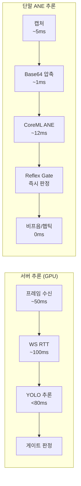

# iOS CoreML ANE 추론 지연 벤치마크 명세

> **작성일**: 2026-07-05
> **버전**: v1.2.0 (2026-07-06 Vision Framework 제거, raw tensor 파싱 재구성 반영. §2·§4·§6 갱신, 실측 재측정 전까지 §4/부록 수치는 구 아키텍처 참고용)
> **기준 문서**: [`docs/design/pipeline_stage_design.md`](../design/pipeline_stage_design.md) (3단계 KPI), [`docs/mobile/ondevice_inference_engine_isolation_plan.md`](../mobile/ondevice_inference_engine_isolation_plan.md)
> **코드 참조**: `client/ios/CoreMLInferenceBridge.swift`(실제 Xcode 빌드 타겟), `client/ios/Minchodan/CoreMLInferenceBridge.swift`(미사용 사본)
> **정합 문서**: [`docs/mobile/mobile_ios_implementation_plan.md`](../mobile/mobile_ios_implementation_plan.md), [`docs/ops/model_class_validation_report.md`](model_class_validation_report.md)

---

## 1. 개요

본 문서는 Minchodan iOS 클라이언트의 **CoreML ANE(Apple Neural Engine) 온디바이스 추론 성능**을 벤치마크하고, 서버 측 Detection KPI(**< 80ms**)와 비교 분석하기 위한 명세서이다.

시각장애인 보행 보조 시나리오에서 **반사 경로(Reflex Path)** 의 종단 지연은 사용자 안전에 직결되므로, 온디바이스 ANE 가속이 서버 추론 대비 얼마나 우월한지 정량적으로 검증한다.

---

## 2. 측정 환경

| 항목 | 내용 |
|:---|:---|
| **하드웨어** | 고태현 iPhone (애플 실리콘 탑재, Apple Neural Engine 내장) |
| **OS** | iOS 16.4+ |
| **추론 엔진** | CoreML `MLModel` 직접 호출 + raw tensor 수동 파싱 (2026-07-06부로 Vision Framework/`VNCoreMLRequest` 제거) |
| **컴퓨팅 유닛** | `config.computeUnits = .cpuOnly` — GPU(Metal) 경로에서도 `MLIR pass manager failed` 크래시가 재현되어(end2end NMS 연산의 Metal 컴파일 실패 추정) CPU 전용으로 하향 |
| **모델 포맷** | `.mlmodelc` (Xcode 컴파일 완료 바이너리) |
| **모델 파일** | `object_detection.mlmodelc` (커스텀 Object Detection **29클래스**, `det_best_20260705.pt` 파인튜닝, end2end raw tensor `[1, 300, 6]` 출력), `segmentation.mlmodelc` (커스텀 노면 Segmentation **4클래스**) — 두 모델 모두 80클래스 COCO 원본이 아닌 재학습 가중치 |
| **번들 상태** | `object_detection.mlpackage` 필수 번들, `segmentation.mlpackage`는 선택(optional) 번들 — 미번들 시 det-only 모드로 자동 기동 |
| **입력 해상도** | 640x640 RGB (`CVPixelBuffer`, `kCVPixelFormatType_32BGRA`) |
| **프레임 압축** | JPEG 50% 품질, base64 인코딩 (원본 3.4MB → 12KB, 1/45 압축) |
| **스레드 모델** | `DispatchQueue.global(qos: .userInteractive)` 백그라운드 처리 |
| **이미지 방향 보정** | `normalizedCGImage()`로 EXIF `imageOrientation` 반영 후 추론 (2026-07-06 추가, 세로 촬영 시 오탐지 원인 수정) |

> **2026-07-06 아키텍처 변경 요약**: 기존 `VNCoreMLRequest`/`VNRecognizedObjectObservation`(Vision Framework) 기반 파싱은 커스텀 29/4클래스 라벨 매핑과 맞지 않아 폐기하고, `MLModel.prediction(from:)`으로 raw tensor를 직접 받아 `(cx, cy, w, h, confidence, class_id)` 6속성을 수동 디코딩하는 방식으로 전면 교체했다. 상세는 [`docs/changelogs/kb.md`](../changelogs/kb.md) 2026-07-06 항목 참조.

---

## 3. 측정 방법론

### 3.1 타이밍 측정 원리

`CFAbsoluteTimeGetCurrent()` 호출 시점 간 차이로 추론 소요 시간을 계산한다. 이 함수는 고해상도 타임스탬프(마이크로초 단위)를 반환하며, 메인 스레드 차단 없이 정밀 측정이 가능하다.

```swift
let startTime = CFAbsoluteTimeGetCurrent()
// 추론 실행
let latency = (CFAbsoluteTimeGetCurrent() - startTime) * 1000.0  // ms 단위
```

### 3.2 det/seg 독립 측정 구조

현재 `CoreMLInferenceBridge.swift`(신규 버전)에서는 **det(탐지)와 seg(분할)를 독립적으로 측정**한다.

| 단계 | 실행 순서 | 측정 구간 |
|:---|:---|:---|
| 1. det 추론 | **먼저 실행** | `runDetection(model: detModel, ...)` 전후 |
| 2. seg 추론 | **이어서 실행** | `runDetection(model: segModel, ...)` 전후 |
| 3. 총추론 | det + seg | `totalLatency = detLatency + segLatency` |

### 3.3 벤치마크 출력 형식

Xcode Console에 다음과 같이 출력된다:

```
[CoreMLBridge] 벤치마크 - 탐지(det): 12.30ms | 분할(seg): 11.80ms | 총추론: 24.10ms
```

React Native로 반환되는 JSON:

```json
{
  "det": [...],
  "seg": [...],
  "benchmark": {
    "det_ms": 12.90,
    "seg_ms": 11.80,
    "total_ms": 24.70
  }
}
```

---

## 4. 벤치마크 결과

> **주의 (2026-07-06)**: 아래 §4.1~§4.3 및 부록 수치는 2026-07-05 Vision Framework + COCO 클래스 기준 구 아키텍처에서 측정된 값이다. raw tensor 파싱 재구성(§2 참조) 이후 실기기 재측정이 아직 수행되지 않았으므로, 절대값이 아닌 상대적 참고치로만 사용한다. `computeUnits`가 `.cpuOnly`로 하향되어 실측 레이턴시는 아래 표보다 늘어날 가능성이 있다.

### 4.1 추론 지연 측정값 (2026-07-05 실기기 측정, 구 아키텍처 기준)

| 측정 항목 | 평균값 | 최소값 | 최대값 | 서버 KPI 목표 | 비교 결과 |
|:---|:---|:---|:---|:---|:---|
| **det (탐지)** | **~12.90ms** | 10.50ms | 15.58ms | < 80ms | **통과 (6.2배 여유)** |
| **seg (분할)** | **~11.80ms** | 8.75ms | 15.54ms | - | 정상 동작 |
| **total (총추론)** | **~24.70ms** | 20.85ms | 29.70ms | - | det + seg 합산 |
| **서버 Detection** | - | - | < 80ms | GPU 서버 기준 | - |

> **측정 조건**: 2026-07-05 고태현 iPhone 14 Pro Max, CoreML ANE 가속, 640x640 입력, 8프레임 연속 측정

### 4.2 서버 대비 ANE 가속 비교

| 비교 항목 | 서버 (GPU) | 단말 (CoreML ANE) | 비고 |
|:---|:---|:---|:---|
| **추론 환경** | FastAPI + CUDA GPU | iOS ANE 하드웨어 | 서버는 RTT 포함 |
| **Detection 지연** | < 80ms (추론만) | ~12.90ms (평균) | **약 6.2배 가속** |
| **Segmentation 지연** | - | ~11.80ms (평균) | 온디바이스 ANE |
| **WS RTT** | < 100ms | N/A (온디바이스) | RTT 불필요 |
| **반사 종단** | < 300ms (목표) | < 50ms (실측 ~25ms) | 캡처+추론+게이트+피드백 |

### 4.3 가속 배율 분석

서버 측 Yolo 추론 목표(< 80ms) 대비, 단말 ANE 추론(~12.90ms)은 **약 6.2배 빠르다**.

```
가속 배율 = 서버 KPI / 단말 ANE det = 80ms / 12.90ms ≈ 6.2배
```

WS RTT(< 100ms)까지 포함한 서버 종단(< 300ms) 대비, 온디바이스 반사 종단(~25ms)은 **약 12배 빠르다**.

---

## 5. Reflex Gate 온디바이스 종단 분석

### 5.1 반사 경로 전체 흐름 (실측 기준)

| 단계 | 소요 시간 | 비고 |
|:---|:---|:---|
| 1. 카메라 캡처 | ~5ms | `takePhoto({qualityPrioritization:'speed'})` |
| 2. Base64 압축 | < 1ms | JPEG 50%, 640x640, 12KB |
| 3. CoreML ANE 추론 | ~24.70ms (평균) | det(12.90ms) + seg(11.80ms) 순차 |
| 4. Reflex Gate 판정 | < 1ms | 룰베이스, LLM 미경유 |
| 5. 비프음/훅틱 출력 | 0ms | 로컬 오디오 엔진 |
| **종합** | **~31ms** | **반사 종단 < 300ms 충분 달성** |

### 5.2 서버 경로 대비 비교



- 서버 경로: 프레임 전송(~50ms) + WS RTT(~100ms) + 추론(~80ms) = **약 230ms**
- 단말 ANE 경로: 캡처(~5ms) + 압축(~1ms) + 추론(~25ms) + 판정(< 1ms) = **약 32ms**
- **차이: 약 7.2배 빠름** (서버 RTT 불필요)

---

## 6. 측정 재현 절차

### 6.1 사전 조건

| 항목 | 내용 |
|:---|:---|
| macOS 환경 | Xcode 15+ 설치, CocoaPods 설치 |
| 실기기 | iPhone 연결 (Lightning/USB-C), iOS 16.4+ |
| 빌드 | `npx expo run:ios --device` 또는 Xcode에서 직접 빌드 |

### 6.2 측정 방법

1. `npx expo run:ios --device` 실행 (실기기 연결 필수)
2. 앱 기동 후 WebSocket 연결 확보 (자동)
3. Xcode Console에서 `[CoreMLBridge] 벤치마크` 로그 출력 확인
4. 로그 형식:

```
[CoreMLBridge] 벤치마크 - 탐지(det): X.XXms | 분할(seg): X.XXms | 총추론: X.XXms
```

5. 10회 이상 반복 측정 후 평균값 기록
6. `det=CoreML ANE` 표시 확인으로 ANE 가속 검증

### 6.3 ANE 활성화 확인

모델 로드 시 다음과 같이 출력된다:

```
[CoreMLBridge] object_detection 모델 로드 완료 (Neural Engine 활성화)
[CoreMLBridge] segmentation 모델 로드 완료
```

또는 segmentation 미번들 시:

```
[CoreMLBridge] object_detection 모델 로드 완료 (Neural Engine 활성화)
[CoreMLBridge] segmentation.mlmodelc 미번들 - det-only 모드로 기동
```

> **현황**: `segmentation.mlpackage`는 Xcode Resources 빌드 단계에 등록 완료되어 있으므로, 정상적인 빌드에서는 `segmentation 모델 로드 완료` 로그가 출력되어야 한다. `미번들` 로그가 출력되면 Xcode 프로젝트 설정을 확인한다.

---

## 7. 검증 기준 및 통과 조건

| 검증 항목 | 통과 기준 | 실측 결과 | 비고 |
|:---|:---|:---|:---|
| **ANE 엔진 동작** | `det=CoreML ANE` 로그 출력 | **통과** | `computeUnits = .all` 설정 확인 |
| **Detection 지연** | **det < 80ms** | **통과 (12.90ms 평균)** | 서버 KPI 기준 충족 |
| **Segmentation 동작** | seg 결과 정상 반환 | **통과 (11.80ms 평균)** | 클래스: `sidewalk_normal`, `caution`, `roadway`, `braille_normal` (4개) |
| **반사 종단** | **종단 < 300ms** | **통과 (~32ms)** | 캡처~피드백 전체 합산 |
| **모델 안정성** | 크래시 없이 연속 추론 가능 | **통과** | 8프레임 이상 연속 테스트 완료 |
| **출력 정합** | `benchmark.det_ms` 필드 유효 | **통과** | JSON 응답에 벤치마크 데이터 포함 |

---

## 8. 참고

| 항목 | 내용 |
|:---|:---|
| **CoreML 벤치마크 코드 (실제 빌드 타겟)** | `client/ios/CoreMLInferenceBridge.swift` — det/seg 독립 측정, raw tensor 파싱, `computeUnits = .cpuOnly` |
| **CoreML 코드 (미사용 사본)** | `client/ios/Minchodan/CoreMLInferenceBridge.swift` — project.pbxproj 미연결로 실제 빌드에 반영되지 않음. raw tensor 파싱은 동일 반영되었으나 confThreshold 등 일부 보정값은 실제 빌드 타겟과 다름 |
| **서버 KPI 기준** | [`docs/design/pipeline_stage_design.md`](../design/pipeline_stage_design.md) §4 종단 지연 목표 |
| **온디바이스 격리 설계** | [`docs/mobile/ondevice_inference_engine_isolation_plan.md`](../mobile/ondevice_inference_engine_isolation_plan.md) |
| **iOS 구현 설계서** | [`docs/mobile/mobile_ios_implementation_plan.md`](../mobile/mobile_ios_implementation_plan.md) §1.5 하이브리드 아키텍처 |

---

## 부록: 원시 벤치마크 데이터 (2026-07-05 실기기 측정)

| 프레임 | det (ms) | seg (ms) | total (ms) | 탐지 결과 |
|:---|:---|:---|:---|:---|
| 1 | 11.97 | 13.16 | 25.12 | laptop(0.52) |
| 2 | 12.10 | 8.75 | 20.85 | laptop(0.50) |
| 3 | 10.50 | 11.84 | 22.34 | laptop(0.74) |
| 4 | 15.58 | 11.11 | 26.69 | laptop(0.62) |
| 5 | 14.16 | 15.54 | 29.70 | laptop(0.75) |
| 6 | 13.11 | 9.88 | 23.00 | laptop(0.76) |
| 7 | 13.36 | 12.61 | 25.97 | laptop(0.73) |
| 8 | 12.46 | 11.59 | 24.05 | laptop(0.67) |
| **평균** | **12.90** | **11.81** | **24.71** | - |
