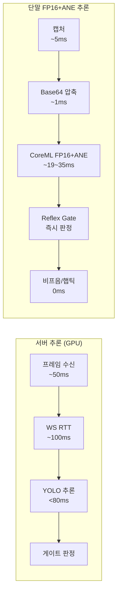

# iOS CoreML 온디바이스 추론 지연 벤치마크 명세

> **작성일**: 2026-07-05
> **버전**: v1.4.0 (2026-07-11 ANE 가속 재활성화: FP16 재변환 + `computeUnits = .cpuAndNeuralEngine` 폴백 패턴 전환, Xcode Instruments Core ML 템플릿으로 ANE 하드웨어 활동 직접 검증, segmentation 출력 파싱 버그 수정, 선택헤드(TopK/Gather) Swift 이관 실험 및 성능 회귀로 인한 롤백 기록 추가 + 이전 v1.3.1(2026-07-09 Frame Processor 전환 정정) / v1.3.0(2026-07-07 `.cpuAndGPU` 크래시 재현 및 `.cpuOnly` 벤치마크) 이력 유지)
> **기준 문서**: [`docs/design/pipeline_stage_design.md`](../design/pipeline_stage_design.md) (3단계 KPI), [`docs/mobile/ondevice_inference_engine_isolation_plan.md`](../mobile/ondevice_inference_engine_isolation_plan.md)
> **코드 참조**: `client/ios/CoreMLInferenceBridge.swift`(유일한 실제 Xcode 빌드 타겟), `scripts/convert_yolo_to_coreml.py`(FP16/`--raw-head` 변환 스크립트)
> **정합 문서**: [`docs/mobile/mobile_ios_implementation_plan.md`](../mobile/mobile_ios_implementation_plan.md) §9.2, [`docs/ops/model_class_validation_report.md`](model_class_validation_report.md)

---

## 1. 개요

본 문서는 Minchodan iOS 클라이언트의 **CoreML 온디바이스 추론 성능**을 벤치마크하고, 서버 측 Detection KPI(**< 80ms**)와 비교 분석하기 위한 명세서이다.

> **2026-07-11 현황(최신)**: `.cpuOnly` 고정의 근본 원인은 크래시 자체가 아니라 **모델이 FP32로 굳어 있었던 것**으로 재진단되었다(ultralytics의 CoreML export가 `half` 인자를 폐기하고 `quantize=16`으로 대체한 것을 과거 변환 시 놓쳤음). object_detection/segmentation 모델을 FP16으로 재변환한 뒤, `computeUnits`를 `.cpuOnly` 고정에서 **`.cpuAndNeuralEngine` 우선 시도 + 실패 시 `.cpuOnly` 폴백**으로 전환했다. 과거 크래시는 `.cpuAndGPU`(GPU/Metal 경로) 조합이었고 ANE 전용 조합(GPU 미경유)은 이번에 처음 검증했다 — 실기기에서 수백 프레임 연속 무크래시를 확인했다. Xcode Instruments의 **Core ML 템플릿으로 15초 트레이스를 떠서 ANE 하드웨어 활동(`ane-hw-intervals-internal`) 247건을 직접 확인**했으며(§4.4), 이는 로그 문자열이 아니라 ANE 칩 자체의 하드웨어 카운터 기록이다. 아래 §4.1의 수치는 이 FP16+ANE 폴백 구성의 실측치다. 다만 end2end 선택 헤드(TopK/Gather, ANE 미지원 연산 5개)는 설계상 여전히 CPU로 폴백되며, 이를 완전히 없애는 실험(§4.5)은 오히려 성능을 악화시켜 롤백했다.

시각장애인 보행 보조 시나리오에서 **반사 경로(Reflex Path)** 의 종단 지연은 사용자 안전에 직결되므로, 온디바이스 추론이 서버 추론 대비 얼마나 우월한지 정량적으로 검증한다.

---

## 2. 측정 환경

| 항목 | 내용 |
|:---|:---|
| **하드웨어** | 고태현 iPhone (iPhone 14 Pro Max, Apple Neural Engine 내장) |
| **OS** | iOS 26.5 |
| **추론 엔진** | CoreML `MLModel` 직접 호출 + raw tensor 수동 파싱 (2026-07-06부로 Vision Framework/`VNCoreMLRequest` 제거) |
| **컴퓨팅 유닛** | `config.computeUnits = .cpuAndNeuralEngine` 우선 시도, 로드 실패 시에만 `.cpuOnly` 폴백(`CoreMLInferenceBridge.swift`의 `loadModel(url:)`). 과거 크래시는 `.cpuAndGPU`(GPU/Metal 경로)였고 ANE 전용 조합은 2026-07-11 최초 검증, 무크래시 확인 |
| **모델 정밀도** | **FP16** (`storagePrecision: Float16`) — 2026-07-11 재변환. 이전엔 ultralytics의 `half` 인자 폐기(`quantize=16`으로 대체)를 놓쳐 FP32로 굳어 있었음 |
| **모델 포맷** | `.mlmodelc` (Xcode 컴파일 완료 바이너리) |
| **모델 파일** | `object_detection.mlmodelc` (커스텀 Object Detection **29클래스**, `det_best_20260705.pt` 파인튜닝, end2end raw tensor `[1, 300, 6]` 출력, FP16), `segmentation.mlmodelc` (커스텀 노면 Segmentation **4클래스**, FP16) — 두 모델 모두 80클래스 COCO 원본이 아닌 재학습 가중치 |
| **번들 상태** | `object_detection.mlpackage` 필수 번들, `segmentation.mlpackage`는 선택(optional) 번들 — 미번들 시 det-only 모드로 자동 기동 |
| **입력 해상도** | 640x640 RGB (`CVPixelBuffer`, `kCVPixelFormatType_32BGRA`) |
| **프레임 압축** | JPEG 50% 품질, base64 인코딩 (원본 3.4MB → 12KB, 1/45 압축) |
| **스레드 모델** | `DispatchQueue.global(qos: .userInteractive)` 백그라운드 처리 |
| **이미지 방향 보정** | `normalizedCGImage()`로 EXIF `imageOrientation` 반영 후 추론 (2026-07-06 추가, 세로 촬영 시 오탐지 원인 수정) |

> **2026-07-06 아키텍처 변경 요약**: 기존 `VNCoreMLRequest`/`VNRecognizedObjectObservation`(Vision Framework) 기반 파싱은 커스텀 29/4클래스 라벨 매핑과 맞지 않아 폐기하고, `MLModel.prediction(from:)`으로 raw tensor를 직접 받아 `(cx, cy, w, h, confidence, class_id)` 6속성을 수동 디코딩하는 방식으로 전면 교체했다. 상세는 [`docs/changelogs/kb.md`](../changelogs/kb.md) 2026-07-06 항목 참조.

---

## 3. 측정 방법론

### 3.1 타이밍 측정 원리

`CFAbsoluteTimeGetCurrent()` 호출 시점 간 차이로 추론 소요 시간을 계산한다. 이 함수는 고해상도 타임스탬프(마이크로초 단위)를 반환하며, 메인 스레드 차단 없이 정밀 측정이 가능하다.

```swift
let startTime = CFAbsoluteTimeGetCurrent()
// 추론 실행
let latency = (CFAbsoluteTimeGetCurrent() - startTime) * 1000.0  // ms 단위
```

### 3.2 det/seg 독립 측정 구조

현재 `CoreMLInferenceBridge.swift`(신규 버전)에서는 **det(탐지)와 seg(분할)를 독립적으로 측정**한다.

| 단계 | 실행 순서 | 측정 구간 |
|:---|:---|:---|
| 1. det 추론 | **먼저 실행** | `runDetection(model: detModel, ...)` 전후 |
| 2. seg 추론 | **이어서 실행** | `runDetection(model: segModel, ...)` 전후 |
| 3. 총추론 | det + seg | `totalLatency = detLatency + segLatency` |

### 3.3 벤치마크 출력 형식

Xcode Console에 다음과 같이 출력된다:

```
[CoreMLBridge] 벤치마크 - 탐지(det): 12.30ms | 분할(seg): 11.80ms | 총추론: 24.10ms
```

React Native로 반환되는 JSON:

```json
{
  "det": [...],
  "seg": [...],
  "benchmark": {
    "det_ms": 12.90,
    "seg_ms": 11.80,
    "total_ms": 24.70
  }
}
```

---

## 4. 벤치마크 결과

> **2026-07-11 재검증 경과**: 모델을 FP16으로 재변환하고 `computeUnits = .cpuAndNeuralEngine`(실패 시 `.cpuOnly` 폴백)로 전환한 뒤 실기기(고태현 iPhone) 재검증을 진행했다. 콘솔에 `object_detection.mlmodelc - ANE 가속 모드로 로드 완료`, `segmentation.mlmodelc - ANE 가속 모드로 로드 완료` 로그(폴백 미발동)를 확인했고, 수백 프레임 연속 무크래시로 동작했다. 과거 크래시(§4의 구 버전 기록, 2026-07-07)는 `.cpuAndGPU` 조합이었으며 GPU(Metal) 경로 특유의 `MLIR pass manager failed` 문제였다 — ANE 전용 조합(GPU 미경유)은 별개이며 이번이 최초 검증이다. 아래 §4.1~§4.3 수치는 이 **FP16 + `.cpuAndNeuralEngine` 실측치**(2026-07-11)로 갱신한 것이며, 기존 `.cpuOnly`(2026-07-07)/구 아키텍처(2026-07-05) 수치는 §부록에 구 데이터로 보존한다.

### 4.1 추론 지연 측정값 (2026-07-11 실기기 측정, FP16 + `.cpuAndNeuralEngine`)

| 측정 항목 | 대표 범위 | 서버 KPI 목표 | 비교 결과 |
|:---|:---|:---|:---|
| **det (탐지)** | **~6~14ms** | < 80ms | **통과 (약 6~13배 여유)** |
| **seg (분할)** | **~5~12ms** | - | 정상 동작(§4.6 segmentation 파싱 버그 수정 후) |
| **씬분류(scene)** | **~8~17ms** | - | Vision `VNClassifyImageRequest` 기반, 실내/실외 판정 |
| **total (det+seg+scene)** | **~19~35ms** | - | 이전(`.cpuOnly`, ~42.97ms) 대비 약 2.5배 단축 |

> **측정 조건**: 2026-07-11 고태현 iPhone(iOS 26.5), `computeUnits = .cpuAndNeuralEngine`, 640x640 입력, 수백 프레임 연속 측정(Metro 로그 `[CoreMLBridge] 벤치마크` 라인 집계)

### 4.2 이전(`.cpuOnly`) 대비 비교

| 비교 항목 | 이전 (`.cpuOnly`, FP32) | 현재 (`.cpuAndNeuralEngine`, FP16) | 비고 |
|:---|:---|:---|:---|
| **Detection 지연** | ~24.11ms (평균) | ~6~14ms | 약 2~4배 단축 |
| **Segmentation 지연** | ~18.86ms (평균) | ~5~12ms | 약 2~3배 단축(파싱 버그 수정 포함, §4.6) |
| **총추론** | ~42.97ms (평균) | ~19~35ms | 약 2.5배 단축 |
| **서버 Detection 대비** | 약 3.3배 빠름 | **약 6~13배 빠름** | 서버 KPI(80ms) 기준 |

### 4.3 가속 배율 분석

서버 측 Yolo 추론 목표(< 80ms) 대비, 단말 FP16+ANE 추론(~6~14ms)은 **약 6~13배 빠르다**.

```
가속 배율 = 서버 KPI / 단말 det = 80ms / (6~14ms) ≈ 6~13배
```

### 4.4 ANE 하드웨어 활동 직접 검증 (Xcode Instruments)

2026-07-11 `xcrun xctrace record --template 'Core ML'`로 실기기 앱을 15초간 트레이스하여, 로그 문자열이 아닌 **ANE 하드웨어 자체의 활동 기록**을 직접 확인했다.

| 항목 | 값 |
|:---|:---|
| **ANE Prediction 이벤트 수** | 247건 |
| **건당 지속시간** | 최소 0.44ms / 평균 3.74ms / 최대 9.29ms |
| **트레이스 전체 시간 중 ANE 활성 비율** | 약 5.6%(924.9ms / 16.65s) — 앱이 초당 2~4프레임만 추론하는 구조라 프레임 사이 유휴 시간이 대부분인 게 정상 |

> **재현 방법**: `xcrun xctrace record --template 'Core ML' --device <UDID> --attach <프로세스명> --time-limit 15s --output trace.trace` 로 기록 후, `xcrun xctrace export --input trace.trace --xpath '/trace-toc/run[@number="1"]/data/table[@schema="ane-hw-intervals-internal"]'`로 `Apple Neural Engine` / `Neural Engine Prediction` / `Active` 구간을 추출한다.

### 4.5 선택 헤드(TopK/Gather) Swift 이관 실험 — 롤백 기록

YOLO26n의 end2end 선택 헤드(TopK 2개, GatherNd 1개, GatherAlongAxis 2개)는 ANE가 지원하지 않아 `.cpuAndNeuralEngine`에서도 CPU로 폴백된다. 이를 완전히 제거하기 위해 `scripts/convert_yolo_to_coreml.py --raw-head`(Detect 헤드의 `postprocess()`를 identity로 몽키패치, `end2end=True`는 유지해 NMS-free로 학습된 one2one 헤드 그대로 사용)로 밀집(dense) 출력 `[1, 8400, 33]`을 내보내는 실험을 진행했다.

| 항목 | end2end 후처리(`[1,300,6]`) | raw-head 밀집 출력(`[1,8400,33]`) |
|:---|:---|:---|
| **ANE 미지원 연산** | 5개(Topk 2, GatherNd 1, GatherAlongAxis 2) | **0개** |
| **det 지연** | ~6~14ms | **~34~53ms(악화)** |
| **총추론** | ~19~35ms | ~49~83ms(KPI 80ms 턱걸이/초과) |

그래프는 100% ANE 호환이 되었지만, 출력 텐서가 300개→8400개(약 154배)로 커지면서 ANE 메모리에서 Swift로 결과를 복사하는 비용이 원래 TopK/Gather가 CPU에서 300개로 추려주던 이득보다 커졌다. **실측 결과에 따라 롤백**했고, 현재 배포본은 §4.1의 end2end 후처리 구성이다. `--raw-head` 스크립트 옵션 자체는 기본값 `False`로 보존되어 있다(향후 재검토용).

### 4.6 segmentation 출력 파싱 버그 수정

segmentation 모델은 CoreML 출력이 2개([1,300,38] 박스+마스크계수, [1,32,160,160] 프로토타입 마스크)인데, `prediction.featureNames`(Set 기반, 순서 미보장)를 `.first`로 집던 기존 로직이 프로토 마스크 텐서를 집으면 매 프레임 파싱이 실패해(`예상치 못한 출력 shape 차원: [1, 32, 160, 160]` 경고 반복) segmentation 결과가 통째로 유실되고 있었다. `runDetection()`에서 shape(`shape.count == 3`) 기반으로 명시적으로 탐색하도록 수정해 해결했다(§4.1 seg 수치는 수정 후 실측).

WS RTT(< 100ms)까지 포함한 서버 종단(< 300ms) 대비, 온디바이스 반사 종단(~50ms 추정, §5 참조)은 크게 빠르다.

---

## 5. Reflex Gate 온디바이스 종단 분석

### 5.1 반사 경로 전체 흐름 (2026-07-11 FP16 + `.cpuAndNeuralEngine` 실측 기준)

> **2026-07-09 정정 유지**: "1. 카메라 캡처" 수치는 `takePhoto()`(구 경로) 기준이며, 반사 캡처
> 기본 경로는 Frame Processor로 전환됐다(원인: `AVCapturePhotoOutput`의 오디오 세션
> 인터럽션, `docs/design/architecture.md` §5.2 참조). 캡처 단계 재측정은 여전히 후속 과제다.

| 단계 | 소요 시간 | 비고 |
|:---|:---|:---|
| 1. 카메라 캡처 | ~5ms | `takePhoto({qualityPrioritization:'speed'})` (구 경로, 위 정정 참조) |
| 2. Base64 압축 | < 1ms | JPEG 50%, 640x640, 12KB |
| 3. CoreML FP16+ANE 추론 | ~19~35ms | det(~6~14ms) + seg(~5~12ms) + 씬분류(~8~17ms) |
| 4. Reflex Gate 판정 | < 1ms | 룰베이스, LLM 미경유 |
| 5. 비프음/훅틱 출력 | 0ms | 로컬 오디오 엔진 |
| **종합** | **~25~41ms** | **반사 종단 < 300ms 충분 달성** |

### 5.2 서버 경로 대비 비교



- 서버 경로: 프레임 전송(~50ms) + WS RTT(~100ms) + 추론(~80ms) = **약 230ms**
- 단말 FP16+ANE 경로: 캡처(~5ms) + 압축(~1ms) + 추론(~19~35ms) + 판정(< 1ms) = **약 25~41ms**
- **차이: 약 6~9배 빠름** (서버 RTT 불필요)

---

## 6. 측정 재현 절차

### 6.1 사전 조건

| 항목 | 내용 |
|:---|:---|
| macOS 환경 | Xcode 15+ 설치, CocoaPods 설치 |
| 실기기 | iPhone 연결 (Lightning/USB-C), iOS 16.4+ |
| 빌드 | `npx expo run:ios --device` 또는 Xcode에서 직접 빌드 |

### 6.2 측정 방법

1. `npx expo run:ios --device` 실행 (실기기 연결 필수)
2. 앱 기동 후 WebSocket 연결 확보 (자동)
3. Xcode Console에서 `[CoreMLBridge] 벤치마크` 로그 출력 확인
4. 로그 형식:

```
[CoreMLBridge] 벤치마크 - 탐지(det): X.XXms | 분할(seg): X.XXms | 총추론: X.XXms
```

5. 10회 이상 반복 측정 후 평균값 기록
6. `[CoreMLBenchmark] det=... seg=... total=...` (JS) 또는 `[CoreMLBridge] 벤치마크` (Swift) 로그로 실측 확인

### 6.3 모델 로드 확인 (현재 FP16 + ANE 우선)

모델 로드 시 다음과 같이 출력된다(ANE 로드 성공 시):

```
[CoreMLBridge] object_detection.mlmodelc - ANE 가속 모드로 로드 완료
[CoreMLBridge] segmentation.mlmodelc - ANE 가속 모드로 로드 완료
```

ANE 로드 실패 시(폴백 발동, 정상 동작이나 성능 저하):

```
[CoreMLBridge] object_detection.mlmodelc - ANE 로드 실패(...), CPU 전용으로 폴백
```

또는 segmentation 미번들 시:

```
[CoreMLBridge] object_detection.mlmodelc - ANE 가속 모드로 로드 완료
[CoreMLBridge] segmentation.mlmodelc 미번들 - det-only 모드로 기동
```

> **현황**: `segmentation.mlpackage`는 Xcode Resources 빌드 단계에 등록 완료되어 있으므로, 정상적인 빌드에서는 `segmentation.mlmodelc - ANE 가속 모드로 로드 완료` 로그가 출력되어야 한다. `미번들` 로그가 출력되면 Xcode 프로젝트 설정을 확인한다.

---

## 7. 검증 기준 및 통과 조건

| 검증 항목 | 통과 기준 | 실측 결과 | 비고 |
|:---|:---|:---|:---|
| **ANE 가속** | `computeUnits = .cpuAndNeuralEngine`에서 무크래시 + 로드 성공 | **통과** | 2026-07-11: 폴백 미발동, 수백 프레임 연속 무크래시. Instruments Core ML 템플릿으로 ANE 하드웨어 활동 247건 직접 확인(§4.4) |
| **Detection 지연** | **det < 80ms** | **통과 (~6~14ms)** | 서버 KPI 기준 대비 약 6~13배 여유 |
| **Segmentation 동작** | seg 결과 정상 반환 | **통과 (~5~12ms)** | 클래스: `sidewalk_normal`, `caution`, `roadway`, `braille_normal` (4개). 출력 파싱 버그 수정 후(§4.6) |
| **반사 종단** | **종단 < 300ms** | **통과 (~25~41ms 추정)** | 캡처~피드백 전체 합산 |
| **출력 정합** | `benchmark.det_ms` 필드 유효 | **통과** | JSON 응답에 벤치마크 데이터 포함 |
| **선택헤드 완전 ANE 이관** | TopK/Gather 제거 후 성능 유지 또는 개선 | **미통과(롤백)** | 2026-07-11: 그래프는 100% ANE 호환이 됐으나 출력 154배 증가로 det 3~5배 느려져 롤백(§4.5) |

---

## 8. 참고

| 항목 | 내용 |
|:---|:---|
| **CoreML 벤치마크 코드 (유일한 실제 빌드 타겟)** | `client/ios/CoreMLInferenceBridge.swift` — det/seg 독립 측정, raw tensor 파싱, `computeUnits = .cpuAndNeuralEngine`(실패 시 `.cpuOnly` 폴백) |
| **변환 스크립트** | `scripts/convert_yolo_to_coreml.py` — 기본 FP16(`quantize=16`), `--raw-head` 옵션(기본 False, §4.5 실험용) |
| **JS 측 로드/로그 코드** | `client/src/inference/localDetectorSelect.ios.ts` |
| **서버 KPI 기준** | [`docs/design/pipeline_stage_design.md`](../design/pipeline_stage_design.md) §4 종단 지연 목표 |
| **온디바이스 격리 설계** | [`docs/mobile/ondevice_inference_engine_isolation_plan.md`](../mobile/ondevice_inference_engine_isolation_plan.md) |
| **iOS 구현 설계서** | [`docs/mobile/mobile_ios_implementation_plan.md`](../mobile/mobile_ios_implementation_plan.md) §1.5 하이브리드 아키텍처 |

---

## 부록 A: 원시 벤치마크 데이터 (2026-07-07 실기기 측정, `.cpuOnly`, raw tensor 아키텍처)

509프레임 연속 측정(`[CoreMLBenchmark]` JS 로그 집계) 중 50프레임 간격 샘플:

| det (ms) | seg (ms) | total (ms) |
|:---|:---|:---|
| 30.75 | 20.05 | 50.80 |
| 23.57 | 18.58 | 42.15 |
| 24.08 | 17.74 | 41.82 |
| 23.67 | 17.80 | 41.48 |
| 22.07 | 17.47 | 39.54 |
| 22.21 | 18.22 | 40.42 |
| 21.83 | 17.40 | 39.23 |
| 24.42 | 17.39 | 41.81 |
| 27.68 | 20.13 | 47.81 |
| 26.78 | 20.59 | 47.37 |
| **평균(509프레임 전체)** | **24.11** | **18.86** | **42.97** |

## 부록 B: 원시 벤치마크 데이터 (2026-07-05 실기기 측정, 구 아키텍처 — Vision Framework + COCO 클래스, 참고용)

> 아래 수치는 폐기된 구 아키텍처(Vision Framework, COCO 80클래스, ANE 가속 가정) 기준이며 현재 코드와 일치하지 않는다. 이력 보존 목적으로만 남긴다.

| 프레임 | det (ms) | seg (ms) | total (ms) | 탐지 결과 |
|:---|:---|:---|:---|:---|
| 1 | 11.97 | 13.16 | 25.12 | laptop(0.52) |
| 2 | 12.10 | 8.75 | 20.85 | laptop(0.50) |
| 3 | 10.50 | 11.84 | 22.34 | laptop(0.74) |
| 4 | 15.58 | 11.11 | 26.69 | laptop(0.62) |
| 5 | 14.16 | 15.54 | 29.70 | laptop(0.75) |
| 6 | 13.11 | 9.88 | 23.00 | laptop(0.76) |
| 7 | 13.36 | 12.61 | 25.97 | laptop(0.73) |
| 8 | 12.46 | 11.59 | 24.05 | laptop(0.67) |
| **평균** | **12.90** | **11.81** | **24.71** | - |
