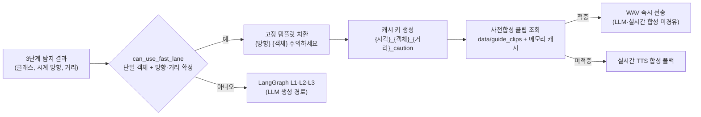

# 발표 대본 추가 제안 검토 보고서 — 고정 템플릿 캐시·탐지 객체 동적 치환

> **작성일**: 2026-07-19
> **버전**: v1.0
> **작성 브랜치**: th
> **검토 방식**: 코드 수정 없음(읽기 전용 검토). 본 문서는 발표 대본(`Minchodan_발표대본.md.pdf`)에 추가하자고 제안된 서술이 실제 코드와 일치하는지 검증한 결과입니다.

---

## 1. 검토 대상 제안 문구

발표 대본에 아래 내용을 추가하자는 제안이 있었습니다.

> RAG 설정: 고정된 프롬프트 템플릿을 캐시에 저장해두고 템플릿 변수를 탐지되는 객체들로 동적으로 치환할 수 있도록 만들기.
> 예시: "전방에 {클래스명}이 있으니 주의하세요"

---

## 2. 결론 요약

**판정: 부분 사실 — 기능 자체는 코드에 실재하나, 용어와 분류가 부정확하여 그대로 발표하면 Q&A에서 반박당할 수 있습니다.**

| 제안 서술 | 판정 | 근거 |
| :--- | :--- | :--- |
| 고정 템플릿이 존재한다 | **사실** | `fast_lane.py`, `fallback_node.py`, `avoidance.py`에 고정 템플릿 실재 |
| 템플릿 변수를 탐지 객체로 동적 치환한다 | **사실** | `CLASS_TEXT`(29클래스 한글명 SSoT) 기반 `object_ko` 치환 |
| "프롬프트 템플릿"을 캐시에 저장한다 | **부정확** | 캐시에 저장되는 것은 LLM 프롬프트가 아니라 **사전합성 TTS 음성 클립(WAV)**, **RAG 검색 결과 문자열**, **합성 오디오**입니다. LLM 프롬프트는 모듈 상수로 상주할 뿐 캐시 계층이 없습니다 |
| "RAG 설정"으로 분류한다 | **부정확** | 템플릿 치환+캐시 조합의 실체는 **6단계 인지 패스트 레인 + 7단계 사전합성 클립**입니다. RAG(5단계)에는 클래스별 검색 결과 캐시만 있고 변수 치환이 없습니다 |
| 예시 "전방에 {클래스명}이 있으니 주의하세요" | **유사하나 문구 상이** | 실제 코드 템플릿은 `"{방향} {객체} 주의하세요"`(near) 등 거리 밴드별 3종입니다 |

---

## 3. 코드 실측 — 템플릿·치환·캐시 메커니즘 전수 매핑

저장소 내에서 "고정 템플릿 + 동적 치환 + 캐시"에 해당하는 메커니즘을 전수 조사한 결과입니다.

| # | 메커니즘 | 위치 | 고정 템플릿 | 치환 변수 | 캐시 | 실시간 파이프라인 배선 |
| :--- | :--- | :--- | :--- | :--- | :--- | :--- |
| 1 | **인지 패스트 레인** | `server/orchestration/nodes/fast_lane.py:58-65` | near `"{방향} {객체} 주의하세요"` / medium `"...확인하세요"` / far `"...있습니다"` | 시계 방향, 한글 객체명, 거리 | 사전합성 클립 조회 키 생성(`:41-49`) | **연결됨** (`graph.py:32-34` 조건 분기) |
| 2 | **사전합성 클립 캐시** | `scripts/build_guide_clips.py:39-52`, `server/tts/realtime_tts.py:73-111` | 위 1번 템플릿의 전 조합 | 객체 10종 x 시계 7방향 x 거리 3단계 = **최대 210조합** | 디스크(`data/guide_clips/*.wav`) + 메모리(`_guide_clip_cache`) | **연결됨** (`synthesize_fast_lane` 클립 우선) |
| 3 | **L3 최후 폴백 템플릿** | `server/orchestration/nodes/fallback_node.py:47-54` | `"{N시 방향/전방} {객체} 주의하세요"` | 시계 방향, 한글 객체명 | 없음(오디오 수준 캐시가 대신 흡수) | **연결됨** (LangGraph 최종 안전망) |
| 4 | **RAG 검색 결과 캐시** | `server/rag/retriever.py:38,61-62,104,114` | ChromaDB 메타데이터 `guidance_template`(완성 문장) | 없음(치환 아님, 통째 반환) | 메모리 dict(클래스명 키) | **연결됨** (`consumer.py:1188-1198`) |
| 5 | **RAG 룰 폴백** | `server/rag/fallback.py:18-48` | `FALLBACK_RULES` 4종 + 미등록 클래스 f-string `"전방에 {class_name}이(가) 있습니다..."` | 영문 클래스명(한글 미변환) | 없음(모듈 상수) | **미배선** — `consumer.py:1181` 주석 "실패 시 빈 문자열, fallback 미경유 유지". 현재 호출처는 자체 스모크 테스트뿐 |
| 6 | **L2 LLM 프롬프트** | `server/orchestration/nodes/l2_generator.py:23-38,122-131` | `GUIDANCE_SYSTEM_PROMPT` 상수 + 사용자 프롬프트 골격 | 탐지 클래스·방향·거리·위험도·RAG 수칙 | 없음(매 호출 조립) | **연결됨** |
| 7 | **합성 오디오 캐시** | `server/tts/realtime_tts.py:60-63,72,137-139` | 해당 없음(텍스트 그대로) | 없음 | `(text, voice, speed)` 키 FIFO 최대 64건 | **연결됨** |
| 8 | **반사 후속 회피 템플릿** | `server/orchestration/avoidance.py:26-62` | `"오른쪽/왼쪽으로 비켜주세요"` 등 | 방향·panning(객체명 치환 없음) | 없음 | **연결됨** (`consumer.py` P1-1 경로) |

### 3.1 제안과 가장 가까운 실제 구조: 패스트 레인 + 사전합성 클립

- 오프라인 단계: `scripts/build_guide_clips.py`가 빈도·위험 상위 객체 10종(`scooter`, `bicycle`, `car`, `motorcycle`, `bollard`, `pole`, `person`, `barricade`, `bus`, `truck`) x 시계 방향 7종(9시~3시) x 거리 3단계(near/medium/far) 조합의 안내문을 20자 초과분 제외 후 일괄 합성하여 `data/guide_clips/{키}.wav`로 저장합니다.
- 실시간 단계: `RealtimeTTS.synthesize_fast_lane()`이 캐시 키로 클립을 조회하고, 첫 로드 시 base64 결과를 메모리 캐시(`_guide_clip_cache`)에 올려 재사용합니다. 클립이 없으면 실시간 합성으로 폴백합니다.

### 3.2 제안 예시 문구와 실제 코드 문구 비교

| 구분 | 문구 | 상태 |
| :--- | :--- | :--- |
| 제안 예시 | "전방에 {클래스명}이 있으니 주의하세요" | 코드에 동일 문구 없음 |
| fast_lane near | "전방 볼라드 주의하세요" (`"{방향} {객체} 주의하세요"`) | 실사용, 사전합성 클립 존재 |
| fallback_node | "2시 방향 볼라드 주의하세요" (`"{방향} {객체} 주의하세요"`) | 실사용(최후 폴백) |
| rag/fallback.py 미등록 클래스 | "전방에 fire_hydrant이(가) 있습니다..." | **미배선 + 영문 라벨 그대로 치환** — 발표 인용 부적합 |

---

## 4. 발표 대본 반영 시 필수 정정 사항

1. **용어**: "프롬프트 템플릿 캐시"가 아니라 **"안내문 템플릿 + 사전합성 음성 클립 캐시"**로 표현해야 합니다. 이 경로의 설계 의도 자체가 LLM 프롬프트를 **거치지 않는 것**이므로, "프롬프트"라는 단어가 들어가면 자기모순이 됩니다.
2. **분류**: "RAG 설정" 항목이 아니라 **6단계(오케스트레이션 패스트 레인)·7단계(TTS 클립 캐시)** 항목입니다. 슬라이드 10(LangGraph) 말미 또는 슬라이드 11(이중 채널 음성)에 배치하는 것이 정확하며, 슬라이드 10을 권장합니다(LLM 생략 분기이므로 오케스트레이션 문맥이 자연스럽습니다).
3. **예시 문장**: 실제 클립이 존재하는 `"전방 볼라드 주의하세요"` 형태를 사용해야 합니다. 시연 중 청중이 실제로 듣게 될 문장과 일치합니다.
4. **RAG를 언급하려면**: "RAG 검색 결과를 클래스별로 캐시하여 동일 장애물 재탐지 시 벡터 검색을 생략한다"(`retriever.py`의 `_cache`)로 한정해야 하며, 여기에는 변수 치환이 없습니다.
5. **인용 금지**: `server/rag/fallback.py`의 "전방에 {클래스명}..." 문구는 현재 실시간 파이프라인에 배선되어 있지 않으므로(consumer가 RAG 미적중 시 "관련 수칙 없음"으로 L2에 직행) 실사용 기능처럼 발표하면 안 됩니다.

---

## 5. 발표 대본 반영 권장 문안 (슬라이드 10 말미 추가용)

발표 대본 원본 md/pdf는 저장소에 없으므로, 아래 문안을 그대로 붙여 넣을 수 있도록 제공합니다.

### 화면 구성 추가 항목

- **패스트 레인(LLM 생략)**: 단일 객체 + 시계 방향 + 거리 확정 시 고정 템플릿(`"{방향} {객체} 주의하세요"`)에 탐지 객체를 동적 치환, 최대 210개 조합(객체 10종 x 방향 7종 x 거리 3단계)의 음성을 **사전합성 클립으로 캐시**해 즉시 재생

### 대본 추가 문단

> 추가로 저희는 인지 경로의 지연을 더 줄이기 위해 '패스트 레인'을 도입했습니다. 단일 장애물에 방향과 거리까지 확정된 일상적인 상황은 LLM을 아예 거치지 않고, "전방 볼라드 주의하세요"처럼 고정 템플릿에 탐지된 객체명과 시계 방향, 거리를 동적으로 치환해 즉시 문장을 만듭니다. 나아가 이 조합들 — 객체 10종, 시계 방향 7종, 거리 3단계 — 의 음성을 미리 합성해 서버에 캐시해 두었기 때문에, 탐지 즉시 저장된 클립을 재생해 실시간 음성 합성 시간까지 제거했습니다. 캐시에 없는 조합만 실시간 합성으로 폴백합니다.

> **주의**: 위 문단의 "미리 합성해 캐시해 두었다"는 서술은 시연 서버에서 `scripts/build_guide_clips.py`를 실행해 둔 경우에만 사실이 됩니다. 6절의 실측 경고를 반드시 확인하십시오.

---

## 6. 검증 방법과 한계

- **방법**: `server/orchestration/`, `server/rag/`, `server/tts/`, `server/detection/`, `scripts/build_guide_clips.py` 전수 열람 및 리포지토리 전역 키워드 검색(템플릿·캐시·사전합성·fallback 호출처). 코드 실행·수정은 하지 않았습니다.
- **한계 및 실측 경고**: 2026-07-19 현재 개발 PC의 `data/guide_clips/` 폴더에 **WAV 파일이 0건**입니다(폴더만 존재). 즉 사전합성 클립 캐시는 코드·스크립트 수준에서 완성되어 있으나, 이 환경에서는 아직 클립이 생성되지 않아 패스트 레인이 매번 실시간 합성 폴백으로 동작합니다. 발표에서 "미리 합성해 캐시해 두었다"고 말하려면 **시연 전 `python scripts/build_guide_clips.py` 실행이 선행 조건**입니다(`--dry-run`으로 조합 목록 사전 확인 가능).
- **후속 제안(코드 변경 아님, 의사결정 필요)**: `server/rag/fallback.py`를 실시간 경로에 배선할지(consumer의 "fallback 미경유 유지" 주석과 상충), 폐기할지 팀 결정이 필요합니다. 배선 시에는 영문 라벨이 그대로 발화되지 않도록 `class_name_to_ko` 경유가 선행되어야 합니다.
