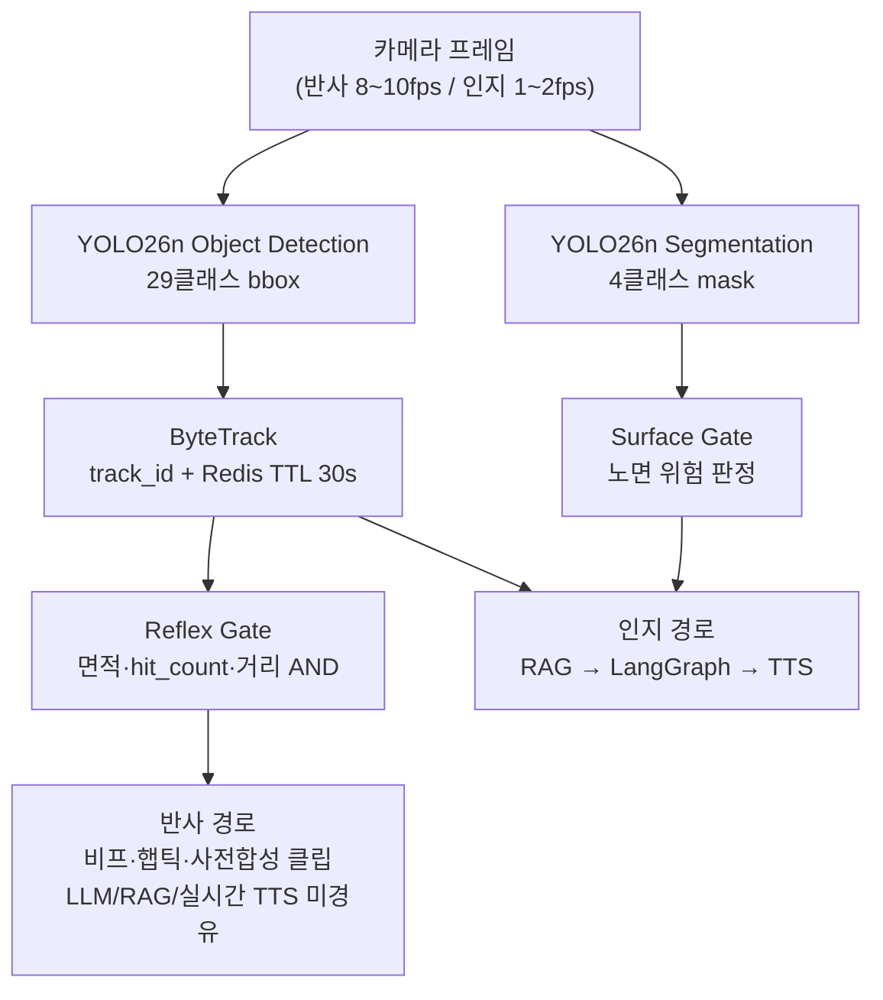
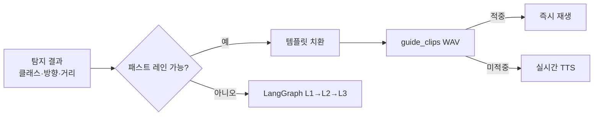

# YOLO26n 듀얼헤드 탐지·분할 종합 정리

> **작성일**: 2026-07-21
> **버전**: v1.0.0
> **작성 브랜치**: th
> **목적**: `docs/ops/reports/` 발표·정합성 보고서와 클래스 검증 보고에 흩어진 YOLO Object Detection / Segmentation 관련 사실을 한 문서로 재정리한다. 발표·면접·후속 개발 시 단일 참조용.
> **소스 보고서** (본문 수치·판정의 1차 출처):
>
> | 문서 | 역할 |
> | :--- | :--- |
> | [`presentation_final_script_30min.md`](presentation_final_script_30min.md) | 30분 발표 대본 — 슬라이드 8(탐지) 핵심 서사·Q&A |
> | [`presentation_script_consistency_check.md`](presentation_script_consistency_check.md) | 대본 vs 코드 전수 대조 — 29+4클래스·게이트·실측 수치 일치 근거 |
> | [`presentation_template_cache_code_review.md`](presentation_template_cache_code_review.md) | 탐지 결과 → 패스트 레인·사전합성 클립 치환 경로 |
> | [`../model_class_validation_report.md`](../model_class_validation_report.md) | 클래스별 샘플 검증(99장) 원본 수치 |
>
> **설계·구현 정본** (상세 설계는 여기): [`../../stage-guides/stage3_detection_design.md`](../../stage-guides/stage3_detection_design.md), [`.agents/skills/yolo-obstacle-detection/SKILL.md`](../../../.agents/skills/yolo-obstacle-detection/SKILL.md)

---

## 1. 한 줄 요약

Minchodan 3단계는 **YOLO26n 듀얼헤드**로 구성된다.

| 헤드 | 모델 파일(대표) | 출력 | 클래스 수 | 1차 판정 |
| :--- | :--- | :--- | ---: | :--- |
| **Object Detection** | `server/models/yolo26n/det_best_*.pt` | 바운딩 박스 | **29** | Reflex Gate (+ head-level / 하단 근접 보조) |
| **Segmentation** | `server/models/yolo26n/segbest.pt` | 픽셀 마스크 | **4** | Surface Gate |

추적·맥락은 **ByteTrack + Redis 컨텍스트 TTL 30초**. 반사 경로는 **룰베이스 게이트만** 경유하며 LLM/RAG/실시간 TTS를 거치지 않는다.

---

## 2. 왜 듀얼헤드인가 (발표 슬라이드 8 핵심)

보고서 대본 기준 설계 의도는 다음과 같다.

1. **개별 장애물**(킥보드, 볼라드, 차량 등)은 바운딩 박스로 충분하다 → Detection 29클래스.
2. **보도 경계·노면 상태**(점자블록, 주의 구간, 차도)는 사각형 박스로는 표현 불가 → Segmentation 4클래스 픽셀 분할이 필수.
3. YOLO26n 선택 이유: **NMS-free**(후처리 지연 감소), Blackwell GPU 최적화, 소형 객체 탐지 성능.
4. ByteTrack으로 track ID를 부여하고 Redis에 30초 컨텍스트를 유지해 **접근·이탈·접근 속도**를 계산한다.



---

## 3. 클래스 목록

### 3.1 Object Detection (29)

한글명 SSoT는 `server/detection/risk_rules.py`의 `CLASS_TEXT`이다. 발표·인지 문장 치환·패스트 레인 모두 이 테이블을 기준으로 한다.

| 영문 라벨 | 한글명 | 영문 라벨 | 한글명 |
| :--- | :--- | :--- | :--- |
| barricade | 바리케이드 | parking_meter | 주차 미터기 |
| bench | 벤치 | person | 사람 |
| bicycle | 자전거 | pole | 기둥 |
| bollard | 볼라드 | potted_plant | 화분 |
| bus | 버스 | power_controller | 전력 제어기 |
| car | 차량 | scooter | 전동 킥보드 |
| carrier | 운반구 | stop | 정지 표지판 |
| cat | 고양이 | stroller | 유모차 |
| chair | 의자 | table | 테이블 |
| dog | 개 | traffic_light | 신호등 |
| fire_hydrant | 소화전 | traffic_light_controller | 신호등 제어기 |
| kiosk | 키오스크 | traffic_sign | 교통 표지판 |
| motorcycle | 오토바이 | tree_trunk | 나무 줄기 |
| movable_signage | 이동형 표지판 | truck | 트럭 |
| wheelchair | 휠체어 | | |

### 3.2 Segmentation (4)

`server/detection/gates/surface_gate.py` 및 `CLASS_TEXT`와 일치한다.

| 영문 라벨 | 한글명 | 역할 요약 |
| :--- | :--- | :--- |
| sidewalk_normal | 일반 보도 | 보행 가능 노면 |
| braille_normal | 점자블록 | 점자 유도 블록 |
| caution | 주의 노면 | 주의가 필요한 노면 |
| roadway | 차도 | 차도(이탈·진입 위험) |

> **참고**: 계단(stairs)은 별도 클래스로 분리되어 있지 않다. 발표 한계 슬라이드·향후 계획에서 "재학습으로 분리"가 과제로 적혀 있다.

---

## 4. 게이트·보조 규칙 (탐지 직후)

정합성 검사 보고서에서 **코드와 일치**로 확인된 항목이다.

| 구성요소 | 역할 | 코드 근거(보고서 인용) |
| :--- | :--- | :--- |
| **Reflex Gate** | 고위험 근접 객체를 룰로 즉시 경보. 면적 비율·화면 위치·`hit_count`를 **AND** 결합 | `server/detection/gates/reflex_gate.py` |
| **Surface Gate** | Segmentation 4클래스 기반 노면 위험 1차 판정 | `server/detection/gates/surface_gate.py` |
| **Head-level Gate** | 화면 **상단 40%**에 위험 객체가 잡히면 격상 경보(흰지팡이 사각지대) | `head_level_gate.py` `TOP_REGION_RATIO=0.40` |
| **하단 근접 보조** | 소화전 등 소형 장애물이 코앞에 와도 면적만으로는 놓치는 사각지대 보완 | `distance_policy.py` `BOTTOM_OVERRIDE_*` |
| **시계 방향** | 자기중심 좌표, 정면=12시, 대략 9시~3시 | `direction.py` `estimate_clock_direction` |
| **중복 억제** | 객체(track)+거리 밴드별 재무장, 기본 **TTL 5초**(레거시 전역 60초는 폐기) | `suppressor.py` `REFLEX_SUPPRESS_TTL_S=5` |

**이중 경로 비협상 규칙**: 반사 경로(`server/detection/gates/` 포함)에는 오케스트레이션·RAG·실시간 TTS 모듈을 임포트·경유시키지 않는다. 반사 음성은 사전합성 고정 클립(또는 긴급 비프)만 사용한다.

---

## 5. 클래스 검증 결과 (슬라이드 14 / 검증 보고서)

| 항목 | 내용 |
| :--- | :--- |
| 검증 방식 | 클래스당 실사 3장, Detection 29 × 3 = 87장 + Seg 4 × 3 = 12장 → **총 99장** |
| conf threshold | 0.25 |
| Detection | **28/29** 클래스에서 최소 1장 이상 탐지 성공 |
| Segmentation | **4/4** 전부 성공 |
| 유일한 전량 실패 | **`stop`(정지 표지판)** — 3/3 미탐지. `traffic_sign`과의 혼동·학습 데이터 부족 추정 |
| 저조 사례 | cat·chair(1/3), wheelchair·carrier(신뢰도 ~0.6대), traffic_light_controller(해외 샘플 대체) |

재현:

```bash
python scripts/validate_class_samples.py
```

상세 표·후속 조치는 [`../model_class_validation_report.md`](../model_class_validation_report.md)를 본다.

---

## 6. 지연 KPI vs 실측 (탐지 중심)

| 단계 | 목표(KPI) | 실측(보고서) | 판정 |
| :--- | :--- | :--- | :--- |
| 캡처 수신 | < 50ms | **0.8ms** | 초과 달성 |
| Detection 추론 | < 80ms | **235~340ms** | 미달(최우선 과제) |
| RAG 검색 | < 50ms | 56~78ms | 근접 |
| LLM 생성 | (편차 큼) | 460ms~3.7s | 편차 큼 |

**Q&A 대비 (보고서 인용)**: "Detection이 235~340ms인데 반사 300ms 목표와 모순 아닌가?"

- 반사 경로는 탐지 직후 게이트에서 발화되어 LLM 등 **후속 지연은 없다**.
- 다만 **추론 자체가 병목**인 것은 인정. 대응: YOLO 추론 전용 스레드풀 분리(적용), TensorRT·온디바이스 이관(계획).

---

## 7. 탐지 결과가 이어지는 경로

탐지(3단계)는 단독으로 끝나지 않는다. 보고서들이 강조하는 **다운스트림 계약**만 정리한다.

### 7.1 RAG 쿼리

- 실제 쿼리 문자열: `f"{class_name} 보행 중 회피 방법"` → 예: **`scooter 보행 중 회피 방법`** (영문 라벨 그대로).
- 콘솔 라이브 시연 시 로그에 영문 클래스가 노출되므로, 대본 예시도 이에 맞출 것(정합성 검사 §2.2).

### 7.2 패스트 레인 + 사전합성 클립 (템플릿 캐시 검토)

- "프롬프트 템플릿 캐시"라는 표현은 **부정확**. 실체는 **6단계 패스트 레인 + 7단계 사전합성 WAV 클립**.
- 조건: 단일 객체 + 시계 방향 + 거리 확정 → LLM 생략.
- 템플릿: `"{방향} {객체} 주의하세요"` 등 거리 밴드별 문구. 객체 한글명은 `CLASS_TEXT`.
- 캐시 규모: 객체 **10종** × 시계 **7방향** × 거리 **3단계** = 최대 **210조합** (`data/guide_clips/`).
- 시연 전 `python scripts/build_guide_clips.py` 미실행 시 "미리 합성해 두었다" 서술은 사실이 아님.



### 7.3 L3 동적 폴백

- 탐지 객체가 있으면: `"{N시 방향/전방} {객체} 주의하세요"`.
- 무탐지일 때만 고정 안전 문장. (대본의 "항상 고정 문장"은 **구버전** — 정합성 검사에서 수정 권고)

---

## 8. 온디바이스 탐지 현황 (한계 서술 정정)

| 구분 | 상태 (정합성 검사 기준) |
| :--- | :--- |
| iOS CoreML 브릿지 | `CoreMLInferenceBridge.swift` — 실기기 배포·검증 중 |
| Android TFLite | `tfliteDetector.ts` — 실기기 배포·검증 중 |
| 모델 변환 이력 | changelog 2026-07-16 `object_detection260714` 등 |
| 아직 미완 | 반사 경보가 **서버 왕복 없이 단말 안에서 완전 완결**되는지는 미검증 |

발표 권고 문구: *"온디바이스 추론 모듈은 배포되어 검증 중이며, 반사 경보의 완전 온디바이스 완결은 향후 과제"*.  
"진짜 의미의 온디바이스 반사 레이어는 아직 없다"는 **단정은 부정확**하다.

---

## 9. 필드테스트에서 나온 탐지 관련 개선 (슬라이드 15)

| 증상 | 원인 | 개선 |
| :--- | :--- | :--- |
| 낯선 장애물에 햅틱 무반응·지연 | 전역 60초 중복 억제 | 객체·거리별 재무장, TTL **5초** |
| 시간이 지날수록 알림 밀림 | 오래된 프레임 적체 | 큐 축소 + **latest-frame-wins** |
| 소화전 등 소형 근접 무반응 | 면적 비율만으로 근접 판정 | **하단 근접 보조 게이트** |
| Android bbox·비율 왜곡 | 실기기 카메라/파싱 | 센터크롭·bbox 파싱 수정 |

---

## 10. 발표·면접용 짧은 멘트

**슬라이드 8 (탐지) — 보고서 대본 요지**

> 객체 탐지 모델 하나만 쓰지 않고 듀얼헤드를 택했습니다. 장애물 29클래스는 바운딩 박스로, 노면 4클래스는 픽셀 분할로 잡습니다. YOLO26n은 NMS 없이 더 빠르고, ByteTrack과 Redis 30초 컨텍스트로 접근 속도까지 봅니다. 게이트는 AI가 아니라 순수 조건문입니다. 반사 경로는 결정론이 생명입니다.

**30초 압축 (Q&A용)**

> 3단계는 듀얼헤드입니다. 29클래스는 박스, 4클래스는 마스크. ByteTrack으로 접근 속도를 내고, 게이트는 룰만 씁니다. 검증은 29개 중 28개 성공·정지 표지판만 실패로 기록했고, 추론 지연 235~340ms는 최우선 최적화 과제입니다.

---

## 11. 코드·문서 맵

| 관심사 | 경로 |
| :--- | :--- |
| 서버 탐지 래퍼 | `server/detection/yolo_detector.py` |
| 한글 클래스 SSoT | `server/detection/risk_rules.py` (`CLASS_TEXT`) |
| 반사/노면/머리높이 게이트 | `server/detection/gates/` |
| 거리·하단 보조 | `server/detection/distance_policy.py` |
| 시계 방향 | `server/detection/direction.py` |
| 클래스 샘플 검증 | `scripts/validate_class_samples.py` |
| 패스트 레인 클립 빌드 | `scripts/build_guide_clips.py` |
| 3단계 설계서 | `docs/stage-guides/stage3_detection_design.md` |
| 클래스 검증 원본 | `docs/ops/model_class_validation_report.md` |
| CoreML 벤치 | `docs/ops/ondevice_coreml_benchmark.md` |

---

## 12. 검사·서술 시 주의 (보고서 교차 경고)

1. Detection **29** + Segmentation **4** = 합산 33클래스. "33클래스 단일 헤드"로 말하지 말 것.
2. 억제 TTL을 **현재형으로 60초**라고 말하면 슬라이드 15(5초 개선)와 모순된다.
3. RAG 미적중을 "룰 기반 기본 문구로 대체"라고 하면 안 된다 — 실시간은 `"관련 수칙 없음"` → L2 LLM → L3 폴백.
4. `server/rag/fallback.py`의 영문 치환 문구는 **파이프라인 미배선**이므로 실사용처럼 인용 금지.
5. 온디바이스·셀룰러는 "없다/미검증" 단정 대신 **배포 검증 중 / 예비 검증**으로 정밀화.

---

## 13. 변경 이력

| 버전 | 날짜 | 내용 |
| :--- | :--- | :--- |
| v1.0.0 | 2026-07-21 | reports 3종 + model_class_validation_report 내용을 YOLO/Seg 중심으로 종합 정리 |
