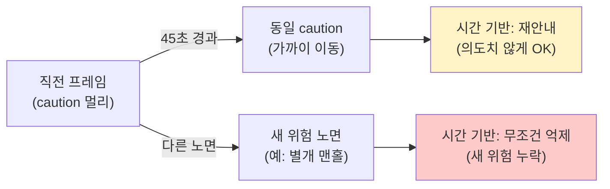
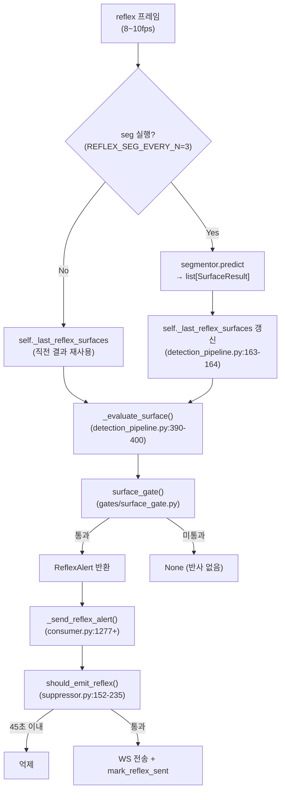
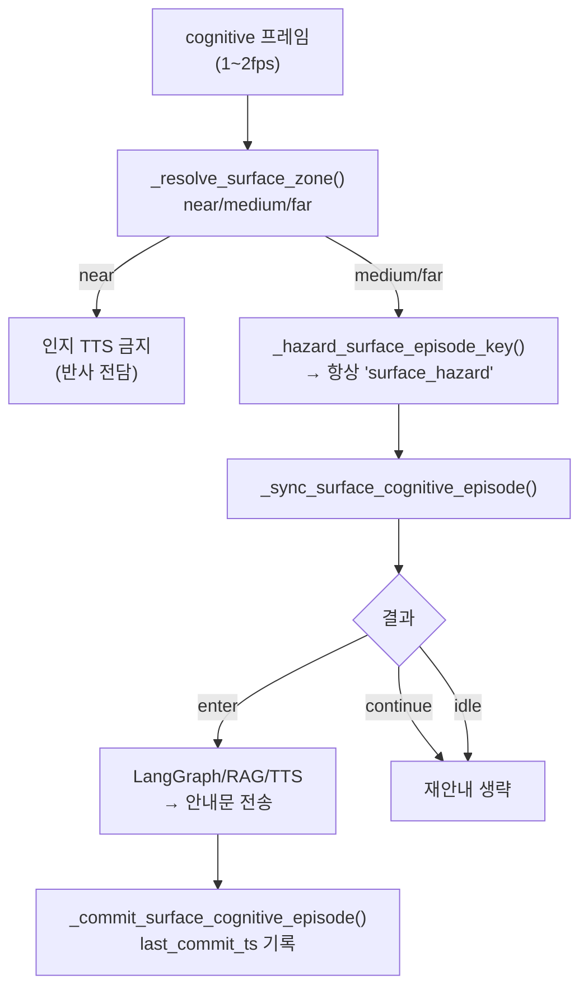
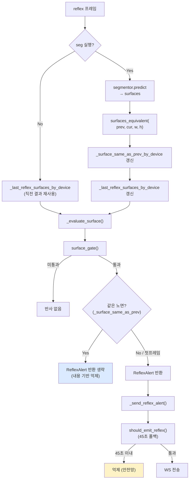

# 노면 알림 중복 억제: 시간 기반 → 내용 기반 전환 설계 기획서

> **작성일**: 2026-07-22
> **버전**: v1.0.1 (추적 설계서·코드 교차검증 반영)
> **담당**: kb
> **관련 코드**: `server/detection/gates/surface_gate.py`, `server/detection/detection_pipeline.py`, `server/detection/consumer.py`, `server/tts/suppressor.py`
> **관련 문서**: [`design/reflex_audio_specification.md`](../design/reflex_audio_specification.md), [`stage-guides/stage3_detection_design.md`](../stage-guides/stage3_detection_design.md), [`ops/environment_variables.md`](environment_variables.md)

### 교차검증 요약 (2026-07-22, kb 브랜치 추적본 기준)

| 기획서 주장 | 추적 설계서/코드 | 판정 |
| :--- | :--- | :--- |
| 반사 노면 억제 `REFLEX_SURFACE_MIN_GAP_S=45` + TTL 60s | `reflex_audio_specification.md`, `suppressor.py` | 일치 |
| 인지 `SURFACE_REENTER_COOLDOWN_S=20`, 키 `"surface_hazard"` 고정 | `consumer.py` `_hazard_surface_episode_key` | 일치 |
| `REFLEX_SEG_EVERY_N=3`, `_last_reflex_surfaces` 재사용 | `environment_variables.md`, `detection_pipeline.py` | 일치 |
| Surface Gate P0=`caution`(+stair_down/manhole), y>0.6, 12시 회랑 | `surface_gate.py`, stage3 설계 | 일치 |
| 본 문서는 구현 전 기획(내용 기반 dedup 미배선) | 코드에 `surface_similarity` 모듈 없음 | 기획서 상태 유지 |

---

## 1. 배경 및 문제 정의

### 1.1 현상

실기기 필드 테스트에서 **같은 위험 노면(caution 등)이 시야에 계속 잡혀 있을 때 노면 알림이 반복해서 울리는 현상**이 지속적으로 보고되었습니다. 담당자는 이를 완화하기 위해 시간 기반 쿨다운 값을 아래처럼 반복 상향해 왔습니다.

| 일자 | 변경 | 파일 | 상수 |
| :--- | :--- | :--- | :--- |
| 2026-07-20 1차 | 15s → 30s | `server/tts/suppressor.py` | `REFLEX_SURFACE_MIN_GAP_S` |
| 2026-07-20 2차 | 30s → 45s (TTL 15s → 60s) | `server/tts/suppressor.py` | `REFLEX_SURFACE_MIN_GAP_S` |

> 출처: `docs/changelogs/kb.md` 및 `server/tts/suppressor.py:25-30` 주석.

### 1.2 근본 원인: 시간 기반 억제는 "같은/다른 노면"을 구분하지 못한다

현재 노면 알림 억제는 **세 곳에서 모두 시간 기반(`device_id` 단위 monotonic/epoch)**으로만 동작하며, 노면의 **내용(클래스·위치)**을 판별하지 않습니다.

| 경로 | 파일:줄 | 상수 (기본값) | 판정 키 |
| :--- | :--- | :--- | :--- |
| 반사 | `server/tts/suppressor.py:30, 173-185` | `REFLEX_SURFACE_MIN_GAP_S=45.0` | `device_id` 단독 (클래스·위치 무관) |
| 인지(위험 노면) | `server/detection/consumer.py:113, 446` | `SURFACE_REENTER_COOLDOWN_S=20.0` | `device_id` + 고정 문자열 `"surface_hazard"` |
| 인지(점자) | `server/detection/consumer.py:116, 513` | `BRAILLE_REENTER_COOLDOWN_S=45.0` | `device_id` 단독 |

특히 인지 경로의 `_sync_surface_cognitive_episode()`는 hazard_key를 **항상 `"surface_hazard"`라는 고정 문자열**로 반환합니다(`server/detection/consumer.py` 내 `_hazard_surface_episode_key`). 이 때문에 아래 두 시나리오가 같은 에피소드 키로 묶입니다.



**결과적 부작용 두 가지**:

| 시나리오 | 현재 동작 | 이상적 동작 |
| :--- | :--- | :--- |
| 같은 노면이 45초+ 지속 | 45초마다 재알림 (필드 피드백 원인) | 같은 노면이면 알림 없음 |
| 45초 이내 다른 위험 노면 등장 | 무조건 억제 (새 위험 누락) | 다른 노면이면 즉시 알림 |

즉, 시간 기반 쿨다운은 **"얼마나 오래"만 보고 "무엇이 같고 다른가"는 보지 못**합니다. 이것이 쿨다운 값을 계속 올려도 문제가 근본 해결되지 않는 이유입니다.

### 1.3 목표

> **"같은 노면이면 알림하지 않고, 다른 노면이면 인지하여 안내한다."**

직전 프레임의 노면 탐지 결과와 현재 프레임 결과를 **내용 기반으로 비교**해 억제 여부를 결정합니다. 시간 기반 쿨다운은 예외 상황(첫 프레임, 비교 불가)의 안전망(폴백)으로 유지합니다.

---

## 2. 현행 구조 조사 결과

> 본 절은 변경 설계의 근거가 되는 현행 코드 구조를 정리한 것입니다.

### 2.1 SurfaceResult 스키마 (변경 없음)

**파일**: `server/detection/schemas.py:48-55`

| 필드 | 타입 | 비고 |
| :--- | :--- | :--- |
| `class_name` | `str` | `sidewalk_normal` / `caution` / `roadway` / `braille_normal` (4클래스) |
| `mask` | `str \| None` | 항상 `None` (레거시 필드, 미사용) |
| `centroid` | `list[float]` | `[cx, cy]` 마스크 무게중심 단일 점 |
| `polygon` | `list[list[float]]` | `exclude=True` (직렬화 시 제거, 인메모리에는 존재) |

**핵심**: `polygon`은 `exclude=True`로 선언되어 Redis publish / WS 전송 / 직렬화 경로에서는 자동 제거되지만, **파이프라인 내부 인메모리 객체에는 전체 폴리곤 점이 그대로 살아 있습니다.** 따라서 동일 프로세스 내에서 프레임 간 비교에 폴리곤/centroid를 사용할 수 있습니다.

### 2.2 반사 경로: Surface Gate → ReflexAlert

**흐름**:



**Surface Gate 발동 3조건** (`server/detection/gates/surface_gate.py:50-63`):

1. `class_name in P0_SURFACE_CLASSES` (`{"caution", "stair_down", "manhole"}`)
2. `centroid_y > frame_height * 0.6` (화면 하단 40% 진입)
3. centroid_x가 12시 회랑 내 (`is_speech_front_x(..., "near")`, `x 비율 0.35~0.65`)

**이미 존재하는 프레임 간 상태**: `detection_pipeline.py:105-106, 163-164`의 `_last_reflex_surfaces` (반사 경로 단일 변수, 1프레임분 보존). 이 변수의 원래 목적은 **seg 스킵 프레임에서 게이트 지속성 유지**이지만, 확장하면 내용 비교용 히스토리로 재사용 가능합니다.

### 2.3 인지 경로: Surface Hazard / Braille 에피소드

**흐름** (`server/detection/consumer.py:1544+`):



**핵심 결함 지점**: `_hazard_surface_episode_key()`는 caution/roadway 여부만 보고 **동일한 문자열 `"surface_hazard"`**를 반환합니다. 즉 서로 다른 위치의 서로 다른 위험 노면이 같은 에피소드 키로 묶입니다.

### 2.4 현행 억제 구조 요약

| 계층 | 위치 | 억제 방식 | 한계 |
| :--- | :--- | :--- | :--- |
| 반사 1차 | `detection_pipeline.py:163` | `_last_reflex_surfaces` 재사용 (seg 스킵 시) | 내용 비교 아님, 단순 결과 복사 |
| 반사 2차 | `consumer.py:1277+` + `suppressor.py:173-185` | 45초 device 갭 + 60초 Redis TTL | 시간 기반, 클래스/위치 무관 |
| 인지(위험) | `consumer.py:400-459` | episode key + 20초 재진입 쿨다운 | hazard_key가 항상 동일 문자열 |
| 인지(점자) | `consumer.py:490-522` | braille episode + 45초 재진입 쿨다운 | 위치 변화 무시 |

---

## 3. 설계 원칙

| 원칙 | 내용 |
| :--- | :--- |
| **내용 기반 비교 (SSOT)** | 직전 프레임과 현재 프레임의 노면 결과를 클래스 + centroid L2 거리로 비교. 반사·인지 양쪽이 동일 비교 함수 사용. |
| **45초 쿨다운은 폴백 유지** | 첫 프레임, 세션 시작, polygon/centroid 누락 등 비교 불가 상황에서 작동. 이중 안전망. |
| **반사 경로 물리 분리 준수** | 새 비교 로직은 순수 Python/numpy만 사용. LLM/RAG/TTS 임포트 절대 금지 (비협상 원칙). |
| **device_id 단위 상태** | 멀티 디바이스 간섭 방지를 위해 모든 히스토리는 `device_id` 키 dict로 관리. |
| **polygon 직렬화 비용 0 유지** | `exclude=True` 유지. 비교는 파이프라인 인메모리에서만 수행. |
| **기존 히스테리시스 패턴 재사용** | `consumer.py:163-180`의 dict 패턴, `surface_departure.py`의 레이캐스팅 철학 일관 유지. |

### 3.1 사용자 의사결정 (반영)

> 본 설계는 아래 세 가지 결정을 전제로 합니다.

| 결정 항목 | 선택 | 근거 |
| :--- | :--- | :--- |
| "같은 노면" 판별 기준 | **클래스 + centroid L2 거리** | 반사 8~10fps에서 연산 비용 최소, polygon 없이도 동작 |
| 적용 범위 | **반사 + 인지 모두** | 양 경로 모두 시간 기반 억제 한계 공유, 일관성 확보 |
| 기존 45초 쿨다운 처리 | **비교 실패 시 폴백으로 유지** | 첫 프레임/예외 상황 안전망 |

---

## 4. 상세 설계

### 4.1 신규 모듈: `server/detection/surface_similarity.py`

두 `SurfaceResult`(또는 두 리스트)가 "사실상 같은 노면"인지 판별하는 순수 함수 모듈입니다. `surface_departure.py`의 "외부 라이브러리 없이 순수 Python으로 기하 계산" 철학과 동일하게 작성합니다.

**제공 함수 3종**:

| 함수 | 시그니처 | 용도 |
| :--- | :--- | :--- |
| `is_same_surface` | `(prev: SurfaceResult, cur: SurfaceResult, frame_width: float, frame_height: float) -> bool` | 단일 노면 쌍 비교. 반사 경로에서 사용. |
| `surfaces_equivalent` | `(prev: list[SurfaceResult], cur: list[SurfaceResult], frame_width: float, frame_height: float) -> bool` | 노면 리스트 비교. 인지 경로 episode 판정에서 사용. |
| `surface_hazard_signature` | `(surfaces: list[SurfaceResult], frame_width: float, frame_height: float) -> str` | 노면 리스트의 안정적 서명(클래스 + centroid 버킷 양자화). 인지 episode 키 동적화에 사용. |

**판별 알고리즘**:

```
is_same_surface(prev, cur, w, h):
    1. prev.class_name == cur.class_name  (아니면 False)
    2. centroid 양쪽 모두 길이 >= 2        (아니면 False → 폴백 위임)
    3. dx = cur.cx - prev.cx
       dy = cur.cy - prev.cy
       distance = sqrt(dx*dx + dy*dy)
    4. 임계 = w * SURFACE_SAME_CENTROID_RATIO (기본 0.10)
    5. distance <= 임계  →  True (같은 노면)
       distance >  임계  →  False (다른 노면)
```

**centroid 거리 임계값 근거**: `SURFACE_SAME_CENTROID_RATIO=0.10`은 frame_width=640 기준 64픽셀로, 보행 1보폭(약 60~80cm) 동안의 노면 마스크 이동 근사치입니다. 환경변수로 오버라이드 가능.

**surfaces_equivalent 알고리즘** (리스트 비교):

- 한쪽이 빈 리스트 → `False` (비교 불가, 폴백 위임)
- 현재 리스트의 각 surface가 직전 리스트의 "같은 클래스 + 거리 임계 이내" surface와 매칭되면 True
- 매칭은 1:1 greedy (정렬 후 첫 매칭 사용), 완전 매칭 매커니즘은 오버엔지니어링 회피

**surface_hazard_signature 알고리즘** (동적 episode 키):

- `(클래스명, centroid_x // bucket_width, centroid_y // bucket_height)` 튜플을 정렬 후 조인
- bucket_width = `w * SURFACE_SAME_CENTROID_RATIO`, bucket_height = `h * 0.10`
- 결과: `"caution@3,9|roadway@4,9"` 형태. 같은 버킷이면 동일 키 → continue, 다른 버킷이면 다른 키 → enter
- 빈 입력 → `""` (기존 계약 유지: "위험 노면 없음")

> **[면접 대비 주석 설계]** 본 모듈의 핵심 의도는 "시간이 아니라 내용으로 같음을 판별한다"입니다. 시간 기반 억제는 보행 속도라는 외생 변수에 종속되지만, centroid 거리는 카메라에 잡힌 실제 위험의 물리적 동일성을 직접 측정합니다. 이것이 시간 쿨다운을 아무리 올려도 해결되지 않던 근본 원인을 해소하는 포인트입니다. 구현 시 본 의도를 `# [면접 대비 주석]` 형태로 코드에 명시합니다.

### 4.2 반사 경로 변경: `server/detection/detection_pipeline.py`

#### 4.2.1 멤버 변수 device_id dict화 (line 105-106)

```python
# AS-IS (단일 변수, 멀티 디바이스 간섭 결함)
self._last_reflex_surfaces: list[SurfaceResult] = []

# TO-BE (device_id 키 dict)
# [면접 대비 주석] 직전 반사 노면 결과를 device_id별로 보존.
# 1) seg 스킵 프레임 게이트 지속성, 2) 다음 seg 프레임과의 내용 비교 두 용도 통합.
self._last_reflex_surfaces_by_device: dict[str, list[SurfaceResult]] = {}
```

> 기존 `_last_reflex_surfaces`는 단일 변수라 멀티 디바이스 환경에서 간섭이 발생할 수 있는 잠재 결함이었습니다. 이번 변경에서 동시 해결합니다.

#### 4.2.2 seg 실행 후 비교 삽입 (line 163-164 부근)

```python
if stream == "reflex" and surfaces:
    prev_surfaces = self._last_reflex_surfaces_by_device.get(device_id, [])
    # [면접 대비 주석] 직전 프레임과 내용(클래스+centroid)으로 비교.
    # 같은 노면이면 surface 게이트가 ReflexAlert을 반환하더라도 억제.
    # 다른 노면이면 그대로 게이트 통과 → 새 위험 즉시 반사.
    same_flag = (
        surfaces_equivalent(prev_surfaces, surfaces, float(width), float(height))
        if prev_surfaces else False  # 첫 프레임은 False (폴백 경로)
    )
    self._surface_same_as_prev_by_device[device_id] = same_flag
    self._last_reflex_surfaces_by_device[device_id] = surfaces
```

#### 4.2.3 surface 게이트 평가 분기 (line 256-264)

```python
# seg 간헐 프레임에서는 직전 유효 노면 결과로 surface 게이트만 평가
surfaces_for_gate = (
    surfaces if surfaces
    else self._last_reflex_surfaces_by_device.get(device_id, [])
)
surface_alert = self._evaluate_surface(surfaces_for_gate, height, width)
# [면접 대비 주석] 직전 프레임과 사실상 같은 노면이면 ReflexAlert 반환 생략.
# 내용 기반 억제가 우선. 시간 쿨다운(45s)은 첫 프레임/비교 실패 시 suppressor에서 폴백.
if surface_alert is not None and not self._surface_same_as_prev_by_device.get(
    device_id, False
):
    surface_alert.event_id = event_id
    surface_alert.ts = time.time()
    surface_alert.inference_ms = (time.time() - start_ts) * 1000
    logger.info(f"[Pipeline] 반사 경로: {surface_alert.alert_id}")
    return surface_alert, detections, surfaces_for_gate
```

#### 4.2.4 seg 스킵 프레임 처리 (line 257)

`surfaces_for_gate` 산출 시 `_last_reflex_surfaces_by_device.get(device_id, [])`로 변경. seg 스킵 프레임에서도 직전 결과를 재사용하므로, 직전(seg 실행 프레임)과의 비교 결과가 자연스럽게 이어집니다.

### 4.3 인지 경로 변경: `server/detection/consumer.py`

#### 4.3.1 직전 인지 surfaces 보존 dict 추가 (line 166 부근)

```python
# [면접 대비 주석] 인지 경로(1~2fps)에서 직전 노면 결과를 device_id별로 보존.
# 반사 경로의 _last_reflex_surfaces_by_device와 동일 패턴이지만 스트림 분리.
self._last_cognitive_surfaces_by_device: dict[str, list[SurfaceResult]] = {}
```

#### 4.3.2 `_hazard_surface_episode_key()` 동적화

**AS-IS**: 항상 `"surface_hazard"` 고정 문자열 반환.

**TO-BE**: `surface_hazard_signature(surfaces, frame_width, frame_height)`를 호출해 동적 키 반환.

- 같은 버킷(같은 centroid 영역)의 위험 노면 → 동일 키 → `"continue"` (재안내 생략)
- 다른 버킷(다른 위치)의 위험 노면 → 다른 키 → `"enter"` (새 안내)

**시그니처 변경 영향 최소화**: `_hazard_surface_episode_key()`의 반환값이 비어있지 않은 문자열이면 hazard로 취급하는 기존 계약은 유지합니다. 단 빈 문자열(`""`)은 여전히 "위험 노면 없음"을 의미합니다. 이를 보존하기 위해 `surface_hazard_signature`는 빈 입력에 대해 `""`을 반환합니다.

> **주의**: 인지 경로에서 `frame_width/frame_height`가 항상 사용 가능한지 확인 필요. `DetectionResult`에는 직접 포함되어 있지 않으므로, `_send_cognitive_guide` 진입 시점에 pipeline 반환값이나 `processed.frame.shape`에서 확보해야 합니다. 본 설계에서는 `_last_cognitive_surfaces_by_device` 갱신 시점(width/height가 있는 pipeline.run 직후)에 signature를 미리 계산해 캐싱하는 방식을 채택합니다.

#### 4.3.3 `_sync_surface_cognitive_episode()` 보강 (line 400-459)

기존 episode 매칭 로직에 **centroid 기반 동적 키**를 통합:

```python
# AS-IS: episode 키가 항상 "surface_hazard"라, 다른 위치의 위험 노면이
#        같은 episode로 묶여 새 위험 재안내가 막힘.
# TO-BE: surface_hazard_signature()로 산출한 동적 키를 episode에 저장/비교.
#        같은 버킷이면 continue, 다른 버킷이면 enter.
```

`SURFACE_REENTER_COOLDOWN_S=20.0`는 **비교 실패(첫 진입, 직전 surfaces 없음) 시 폴백**으로 유지합니다.

#### 4.3.4 점자 에피소드 동일 패턴 적용

`_sync_braille_cognitive_episode()` (line 490-522)에도 동일 패턴 적용. 점자블록의 centroid 이동을 감지해 같은 점자 블록 연속 추종 시 재안내를 억제합니다.

`BRAILLE_REENTER_COOLDOWN_S=45.0`는 폴백으로 유지.

### 4.4 suppressor 45초 쿨다운: 수정 없음 (폴백 역할)

**`server/tts/suppressor.py:173-185`의 surface 분기는 수정하지 않습니다.** 이유:

| 시나리오 | 동작 경로 | 결과 |
| :--- | :--- | :--- |
| 같은 노면 연속 | pipeline에서 ReflexAlert 반환 안 함 | suppressor 도달 안 함 |
| 다른 노면 등장 | pipeline에서 ReflexAlert 반환 | suppressor 통과 (45초 이내여도) |
| 첫 프레임/비교 실패 | pipeline에서 ReflexAlert 반환 | suppressor의 45초가 안전망 |

중복 억제가 두 겹(내용 기반 + 시간 기반)이 되어 안전성이 강화됩니다.

### 4.5 환경 변수

**`docs/ops/environment_variables.md`** 및 **`.env.example`**에 추가:

| 변수 | 기본값 | 설명 |
| :--- | :--- | :--- |
| `SURFACE_SAME_CENTROID_RATIO` | `0.10` | 같은 노면 판별 centroid 거리 임계 (frame_width 비율) |

**기존 변수는 유지 (폴백)**:

| 변수 | 기본값 | 역할 |
| :--- | :--- | :--- |
| `REFLEX_SURFACE_MIN_GAP_S` | `45.0` | 반사 1차 폴백 (pipeline 비교 실패 시) |
| `REFLEX_SURFACE_SUPPRESS_TTL_S` | `60` | 반사 2차 폴백 (Redis TTL) |
| `SURFACE_REENTER_COOLDOWN_S` | `20.0` | 인지(위험) 재진입 폴백 |
| `BRAILLE_REENTER_COOLDOWN_S` | `45.0` | 인지(점자) 재진입 폴백 |

---

## 5. 데이터 흐름 (TO-BE)

### 5.1 반사 경로 전체 흐름



### 5.2 인지 경로 전체 흐름

```mermaid
flowchart TD
    CF["cognitive 프레임"] --> ZONE["_resolve_surface_zone()"]
    ZONE -->|near| NR["인지 TTS 금지"]
    ZONE -->|medium/far| SIG["surface_hazard_signature(<br/>surfaces, w, h) → 동적 키"]
    SIG --> UP2["_last_cognitive_surfaces_by_device 갱신"]
    UP2 --> SYNC["_sync_surface_cognitive_episode()<br/>(동적 키 비교)"]
    SYNC --> ENTER{"결과"}
    ENTER -->|enter<br/>(다른 버킷)| TTS["LangGraph/RAG/TTS<br/>→ 새 안내"]
    ENTER -->|continue<br/>(같은 버킷)| SKIP["재안내 생략"]
    ENTER -->|idle| SKIP
    TTS --> COMMIT["_commit_surface_cognitive_episode()"]
    style ENTER fill:#dbeafe
```

---

## 6. 시나리오별 동작 비교

| 시나리오 | AS-IS (시간 기반) | TO-BE (내용 기반) |
| :--- | :--- | :--- |
| 같은 노면 45초+ 지속 | 45초마다 재알림 | 직전 프레임과 같으므로 알림 없음 |
| 같은 노면 45초 이내 | 45초 쿨다운 억제 | 내용 비교로 억제 (동일 결과) |
| 다른 위험 노면 등장 (45초 이내) | 무조건 억제 (새 위험 누락) | centroid 다르면 즉시 알림 |
| 첫 프레임 / 세션 시작 | 45초 쿨다운 적용 | 내용 비교 불가 → 45초 폴백 적용 |
| seg 스킵 프레임 (반사) | `_last_reflex_surfaces` 재사용 | 동일 (비교는 매 seg 프레임마다 수행) |
| 위험 노면 멀리→가까이 이동 (같은 객체) | 45초 안이면 억제 | centroid 변화 작으면 억제, 크면 알림 |
| 위험 노면 좌→우 이동 | 45초 안이면 억제 | centroid 변화 크면 알림 (오탐 가능성) |

> **오탐 가능성**: 보행 중 같은 위험 노면이 카메라 각도 변화로 centroid가 크게 이동할 수 있습니다. 이때 "같은 노면"임에도 "다른 노면"으로 오탐해 재알림이 발생할 수 있습니다. 이는 기존 45초 폴백이 자연스럽게 완화(같은 device 45초 내 재알림 차단)하므로 심각한 문제가 아닙니다. 반대 방향 오탐(다른 노면을 같은 노면으로 묶어 억제)은 centroid 임계값이 64픽셀로 보수적이라 발생 가능성이 낮습니다.

---

## 7. 파일별 수정 요약

| 파일 | 수정 유형 | 주요 변경 |
| :--- | :--- | :--- |
| `server/detection/surface_similarity.py` | **신규** | `is_same_surface`, `surfaces_equivalent`, `surface_hazard_signature` 함수 3종 |
| `server/detection/detection_pipeline.py` | 수정 | 멤버 변수 device_id dict화 + seg 후 비교 삽입 + 게이트 분기 |
| `server/detection/consumer.py` | 수정 | `_last_cognitive_surfaces_by_device` 추가 + `_hazard_surface_episode_key` 동적화 + episode 키 비교 |
| `docs/ops/environment_variables.md` | 수정 | `SURFACE_SAME_CENTROID_RATIO` 신규 변수 추가 |
| `.env.example` | 수정 | 신규 변수 예시 |
| `docs/design/reflex_audio_specification.md` | 수정 | 변경 이력 표 추가 (45초 쿨다운 → 내용 기반 전환) |
| `docs/stage-guides/stage3_detection_design.md` | 수정 | Surface Gate 섹션에 내용 기반 억제 설명 추가 |
| `docs/changelogs/kb.md` | 수정 | changelog 엔트리 |
| `.agents/skills/yolo-obstacle-detection/SKILL.md` (+ `.claude/` 미러) | 수정 | Surface Fast-Alert Gate 섹션 업데이트 |
| `tests/test_surface_similarity.py` | **신규** | 단위 테스트 |
| `tests/test_detection_pipeline_surface_dedup.py` | **신규** | 통합 테스트 |

---

## 8. 테스트 계획

### 8.1 단위 테스트 (`tests/test_surface_similarity.py` 신규)

| 케이스 | 입력 | 기대 결과 |
| :--- | :--- | :--- |
| 같은 클래스 + 가까운 centroid | `caution` 두 개 centroid 거리 30px | `True` |
| 같은 클래스 + 먼 centroid | `caution` 두 개 centroid 거리 100px | `False` |
| 다른 클래스 | `caution` vs `roadway` | `False` |
| centroid 누락 | 빈 centroid | `False` (폴백 위임) |
| polygon 누락 | polygon=[] | centroid 있으면 정상 동작, centroid도 없으면 `False` |
| 빈 리스트 양쪽 | `[]` vs `[]` | `False` (비교 불가) |
| 한쪽만 빈 리스트 | `[caution]` vs `[]` | `False` |
| 서명 안정성 | 같은 버킷 두 호출 | 동일 서명 문자열 |
| 서명 변화 | centroid 버킷 이동 | 다른 서명 문자열 |

### 8.2 통합 테스트 (`tests/test_detection_pipeline_surface_dedup.py` 신규)

| 케이스 | 시나리오 | 기대 결과 |
| :--- | :--- | :--- |
| 같은 노면 연속 2프레임 | 동일 centroid caution 2프레임 | 두 번째 프레임에서 ReflexAlert 반환 안 함 |
| 다른 노면 이동 | 첫 프레임 caution, 두 번째 프레임 다른 위치 caution | 두 번째 프레임에서 ReflexAlert 반환 |
| 첫 프레임 | 직전 surfaces 없음 | ReflexAlert 반환 (폴백 경로) |
| seg 스킵 프레임 | REFLEX_SEG_EVERY_N=3에서 스킵 프레임 | 직전 결과 재사용으로 비교 유지 |

### 8.3 회귀 테스트

기존 `tests/test_surface_gate.py`, `tests/test_suppressor.py`, `tests/test_detection_consumer_surface.py` (존재 시)가 통과하는지 확인. 폴백 경로가 그대로 작동하므로 기존 테스트는 수정 없이 통과해야 합니다.

---

## 9. 코드 품질 게이트

커밋 전 반드시 실행 ([`docs/ops/code_quality_guide.md`](code_quality_guide.md) 준수):

```bash
# 1. 자동 수정 + 린트
ruff format . ; ruff check --fix .

# 2. 보안 심층
bandit -r server/detection/surface_similarity.py

# 3. 타입 점검
mypy server/detection/

# 4. 중복 검출 (surface_similarity ↔ surface_departure 유사도 확인)
jscpd

# 5. 의존성 CVE
pip-audit -r requirements.txt

# 6. 테스트
pytest tests/test_surface_similarity.py tests/test_detection_pipeline_surface_dedup.py -v
```

**주의 (jscpd)**: `surface_similarity.py`의 centroid 거리 계산은 `surface_departure.py:point_in_polygon`과 동일한 "순수 Python 기하" 철학을 공유하지만, 알고리즘(레이캐스팅 vs L2 거리)이 다르므로 중복 임계(1%)를 넘지 않을 것으로 예상됩니다. 만약 넘으면 공통 유틸로 추출을 검토합니다.

---

## 10. 비협상 원칙 준수 확인

| 원칙 | 준수 여부 | 근거 |
| :--- | :--- | :--- |
| 반사 경로 물리 분리 | 준수 | `surface_similarity.py`는 순수 Python/numpy만 사용, LLM/RAG/TTS 임포트 없음 |
| 반사 음성 사전합성 클립 | 준수 | `reflex_clips/surface_*.wav` 그대로 사용, 클립 파일 변경 없음 |
| SurfaceResult.polygon 직렬화 제외 | 준수 | `exclude=True` 유지, 비교는 인메모리에서만 수행 |
| 이모지 금지 | 준수 | 코드 주석, 본 문서 전체 이모지 없음 |
| 한국어 응답 | 준수 | 본 문서 및 주석 한국어 작성 |

---

## 11. Git 브랜치 및 작업 순서

> [`docs/ops/git_branching_strategy.md`](git_branching_strategy.md) 준수.

1. 현재 `kb` 브랜치에서 작업
2. 1단계: `surface_similarity.py` 신규 모듈 + 단위 테스트
3. 2단계: `detection_pipeline.py` 반사 경로 변경 + 통합 테스트
4. 3단계: `consumer.py` 인지 경로 변경
5. 4단계: 환경 변수, 문서 업데이트
6. 5단계: 전체 린트/테스트 게이트 통과
7. 사용자 요청 시 `kb` → `dev` 병합 후 push

---

## 12. 잔여 논의 / 리스크

| 항목 | 내용 | 대응 |
| :--- | :--- | :--- |
| centroid 임계값 튜닝 | 0.10 (64px)이 필드에서 적정인지 검증 필요 | 첫 구현 후 필드 테스트에서 `SURFACE_SAME_CENTROID_RATIO` 조정 |
| 인지 경로 frame_width/height 확보 | `DetectionResult`에 직접 포함되지 않음 | pipeline.run 직후(또는 `processed.frame.shape`)에서 확보해 signature 캐싱 |
| 멀티 디바이스 dict 메모리 | `device_id`별 dict가 세션 종료 후에도 잔류 가능 | 기존 consumer.py의 다른 dict와 동일하게 방치(현재 패턴)하거나, 명시적 clear 훅 추가 검토 |
| polygon 기반 IoU 도입 검토 | centroid만으로 부족하다고 판단되면 | post-MVP에서 `SURFACE_DEDUP_MODE=centroid\|iou` 환경변수로 확장 가능 (본 설계 범위 외) |

---

## 13. 참조

- [`docs/design/reflex_audio_specification.md`](../design/reflex_audio_specification.md) - 반사 오디오 명세, 45초 상향 이력
- [`docs/stage-guides/stage3_detection_design.md`](../stage-guides/stage3_detection_design.md) - 3단계 Surface Gate 설계
- [`docs/ops/environment_variables.md`](environment_variables.md) - 환경 변수 단일 명세
- [`docs/changelogs/kb.md`](../changelogs/kb.md) - 기존 15→30→45→60초 상향 변경 이력
- `server/detection/gates/surface_gate.py` - 현행 Surface Gate 구현
- `server/detection/surface_departure.py` - 레이캐스팅 기하 알고리즘 (재사용 패턴)
- `server/tts/suppressor.py` - 현행 반사 억제 (폴백 유지)
