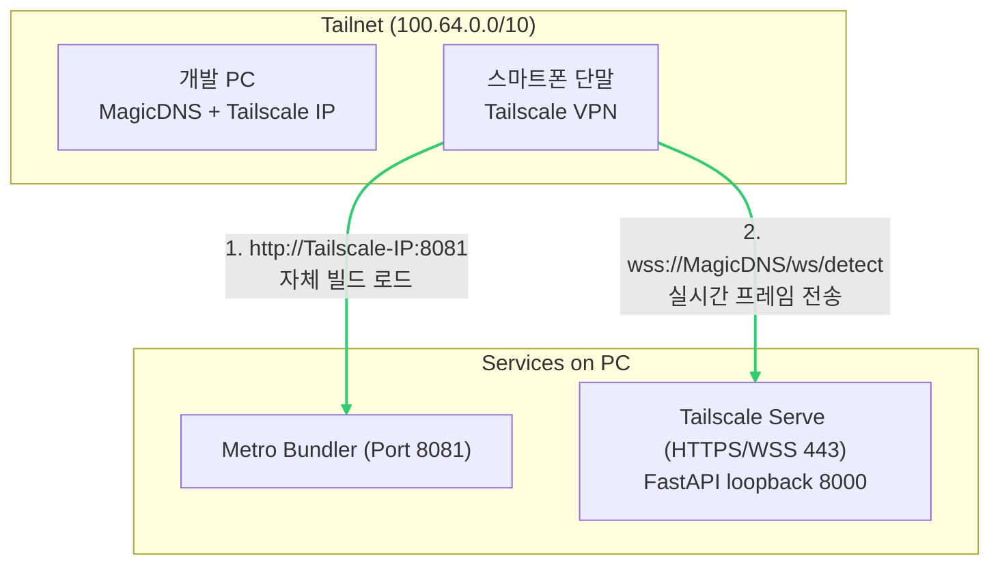

> **작성일**: 2026-07-13
> **버전**: v1.1.0 (2026-07-19 Tailscale Serve WSS MagicDNS/443 및 loopback FastAPI 반영)
> **작성 목적**: Tailscale P2P VPN 기반 초고속 보행보조 실시간 스트리밍 환경 구축 가이드

---

# Tailscale 기반 고속 무선 개발 연결 가이드

## 1. 개요

Minchodan 보행보조 플랫폼은 즉각적인 장애물 반응(반사 경로) 및 실시간 가이드(인지 경로)를 위해 극도의 초저지연(Ultra-low Latency)이 요구됩니다.

본 가이드는 가상 사설망(VPN) 솔루션인 **Tailscale**을 도입하여 개발 PC(API 서버 및 Metro 번들러 호스트)와 물리 스마트폰 간에 직접 P2P 터널링을 구성하고, 외부망 및 LTE 환경에서도 내부 LAN 직결에 준하는 전송 속도를 확보하기 위한 설정 절차를 정의합니다.

---

## 2. 네트워크 아키텍처

아래 다이어그램은 Tailscale을 경유하는 PC와 단말 간의 암호화 터널 통신 구조입니다.



---

## 3. 기기별 사전 준비 작업

팀원 개개인이 소유한 PC와 테스트용 스마트폰에 아래의 공통 작업을 수행합니다.

| 분류 | 작업 항목 | 세부 수행 내용 |
| :--- | :--- | :--- |
| **공통** | **Tailscale 회원가입** | Tailscale 공식 웹사이트에서 조직 또는 개인 계정으로 가입합니다. |
| **PC** | **Tailscale 설치 및 로그인** | Windows/macOS용 Tailscale 클라이언트를 설치하고 로그인합니다. |
| **모바일** | **Tailscale 앱 설치 및 로그인** | Android/iOS 앱스토어에서 Tailscale을 내려받은 뒤 PC와 **동일한 계정**으로 로그인하고 VPN Profile 생성을 허용합니다. |
| **공통** | **장치 연결 상태 확인** | Tailscale 관리 콘솔(Admin Console)에서 PC와 스마트폰이 모두 Connected 상태인지 확인하고 각각의 가상 IP(100.x.y.z)를 메모합니다. |

---

## 4. 개발 환경 설정 (PC)

### 4.1 클라이언트 설정 수정
FastAPI는 소스에 주소를 하드코딩하지 않고 로컬 `client/.env`에서 Tailscale Serve의 MagicDNS 이름을 주입합니다.

```env
EXPO_PUBLIC_NETWORK_MODE=tailscale
EXPO_PUBLIC_TAILSCALE_HOST=[SERVER_MAGICDNS_NAME].ts.net
EXPO_PUBLIC_SERVER_PORT=443
EXPO_PUBLIC_WS_SCHEME=wss
```

Metro는 별도 개발 번들 경로이므로 개발 PC의 Tailscale IP와 포트 `8081`을 사용합니다.

### 4.2 Metro Bundler 실행 방식 변경
이전의 외부망 테스트를 위해 추가했던 `--tunnel` 옵션을 제거하고 순수 LAN/로컬 모드로 번들러를 켭니다.

```bash
# client 폴더 내부에서 실행
npx expo start -c --scheme minchodan
```

---

## 5. 앱 실행 및 접속 방법 (단말)

> [!IMPORTANT]
> **Expo Go 범용 클라이언트 미지원 경고**
> `react-native-vision-camera` 등 네이티브 카메라 모듈을 사용하는 프로젝트 특성상 **일반 Expo Go 앱으로는 접속 시 'runtime not ready' 오류가 발생**하며 구동할 수 없습니다.

### 5.1 네이티브 개발 빌드 앱(Development Build) 설치가 되어 있는 경우
1. 스마트폰의 Tailscale 앱에서 커넥션 상태를 활성화(Active)합니다.
2. 기기에 미리 빌드된 `minchodan` 개발용 독립 앱을 실행합니다.
3. 연결 주소창이 나타나면 PC의 Tailscale IPv4와 Metro 포트를 조합한 주소를 기입하고 엔터를 누릅니다.
   - 예: `[SERVER_TAILSCALE_IP]:8081`

### 5.2 기기에 개발 빌드가 설치되어 있지 않은 경우 (최초 1회 필수)
1. 스마트폰을 PC에 USB 케이블로 연결하고 Android 개발자 모드(USB 디버깅)를 켭니다.
2. 다음 명령어로 스마트폰 기기에 네이티브 코드가 포함된 커스텀 개발 빌드 앱을 생성하여 직접 업로드 및 설치합니다.
   ```bash
   npm run android
   ```
3. 설치된 앱 아이콘을 터치하여 실행한 후 메트로 서버 주소(`[SERVER_TAILSCALE_IP]:8081`)로 연동을 완료합니다.

---

## 6. 문제 해결 및 문제 상황 진단 (Troubleshooting)

### 6.1 호스트 방화벽에 의한 포트 차단
FastAPI는 루프백 `127.0.0.1:8000`을 유지하고 Tailscale Serve가 tailnet 전용 TLS 프록시를 제공합니다. 개발 번들이 필요한 경우에만 Metro `8081`을 Tailscale 인터페이스 범위에서 허용하며 MariaDB와 FastAPI 포트를 모든 네트워크에 직접 공개하지 않습니다.

### 6.2 MagicDNS 이름 해석 실패
MagicDNS를 사용하는데 서버 이름이 해석되지 않으면 단말과 서버가 같은 tailnet에 로그인했는지, 관리 콘솔에서 MagicDNS가 활성화됐는지 확인합니다.
- **조치**: `tailscale status`와 `tailscale serve status`로 피어와 TLS 프록시를 확인합니다. `wss` 인증서가 IP 주소와 일치하지 않으므로 `EXPO_PUBLIC_TAILSCALE_HOST`를 Tailscale IPv4로 대체하지 않습니다.
