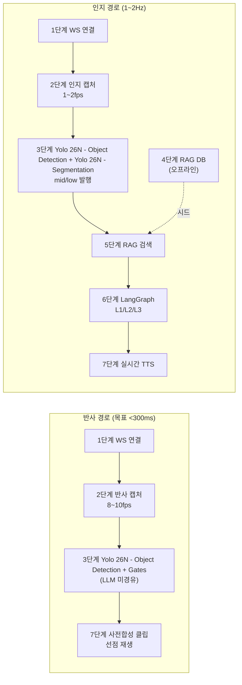

# Minchodan 파이프라인 단계 설계

> **작성일**: 2026-06-24
> **버전**: v0.1.0
> **설계 기준**: `docs/minchodan_design_note.md` (7단계 골격, 비전 설계서 v1.1)

---

## 1. 개요

Minchodan 파이프라인은 7단계로 구성되며, 각 단계는 독립적인 run mode와 종단 지연 목표를 가집니다. 가장 중요한 설계 원칙은 **이중 경로 물리 분리**(반사=즉시 경보 / 인지=상세 가이드)입니다.

---

## 2. 단계 구조

---

## 3. 단계별 run mode

| 단계 | 이름 | run mode | 실행 환경 | 동기/비동기 |
| --- | --- | --- | --- | --- |
| 1 | 서버-앱 통신 | `online` | FastAPI 서버 | 비동기 (asyncio) |
| 2 | 카메라 캡처 전송 | `online_reflex` / `online_cognitive` | 단말 + 서버 | 비동기 (이중 타이머) |
| 3 | 탐지·분할·게이트 | `online_inference` | GPU 서버 | 동기 (프레임 단위) |
| 4 | RAG DB 구축 | `offline_batch` | GPU 서버 (오프라인) | 배치 |
| 5 | RAG 검색 | `online_retrieval` | 서버 | 동기 (쿼리 단위) |
| 6 | LangGraph 가이드 | `online_orchestration` | 서버 (Ollama) | 비동기 (`ainvoke`) |
| 7 | 음성 출력 | `online_reflex_clip` / `online_cognitive_tts` | 서버 + 단말 | 비동기 |

---

## 4. 종단 지연 목표

| 경로 | 흐름 | 목표 | 비고 |
| --- | --- | --- | --- |
| 반사 | 캡처  WS  Yolo 26N - Object Detection  Gate  사전합성 클립 재생 | **<300ms** (Detection 기준) | LLM/RAG/실시간 TTS 미경유 |
| 인지 | 캡처  WS  탐지  Redis  RAG  LangGraph  TTS  재생 | 1~2Hz | 상세 가이드 |

단계별 지연 목표:

| 단계 | 항목 | 목표 |
| --- | --- | --- |
| 1 | WS RTT | < 100ms |
| 2 | 캡처수신 | < 50ms |
| 3 | Detection 추론 | < 80ms |
| 5 | RAG 검색 | < 50ms |
| 6 | L2 `ainvoke` | (측정 필요) |
| 7 | 실시간 TTS 합성 | (측정 필요) |

---

## 5. 단계별 핵심 절차

### 5.1 1단계 - 서버-앱 실시간 통신

- `FastAPI()` + `CORSMiddleware`  `APIRouter().websocket("/ws/detect")`
- `ws.accept()`  welcome  hello 검증  5초 ping/pong  `WebSocketDisconnect` 정리
- 출력: WS 엔드포인트 (2단계 공유)

### 5.2 2단계 - 카메라 화면 전송

- **이중 타이머**: 반사 8~10fps / 인지 1~2fps 분리 (v1.1, 충돌 회피)
- `takePhoto({qualityPrioritization:'speed'})`  JPEG base64  `ws.send()`
- 서버: `base64.b64decode`  `np.frombuffer`  `cv2.imdecode`  `resize(640,640)`  ack
- 출력: 640x640 프레임 (3단계 입력)

### 5.3 3단계 - AI 장애물 실시간 인식  핵심

- Yolo 26N - Object Detection `predict(conf=0.35)` + Yolo 26N - Segmentation + ByteTrack 추적
- **이중 게이트 (룰베이스, LLM 미경유)**:
  - Reflex Gate: 고위험 + 근접  `alert_id`+방향  반사 경로
  - Surface Gate: P0 노면 하단  `alert_id`  반사 경로
- mid/low  `redis_bus.xadd("risk.events")`  인지 경로
- 노면 클래스 분리(C2): `braille normal/damaged`, `sidewalk normal/damaged`, `crosswalk`, `roadway`, `caution`

### 5.4 4단계 - RAG DB 구축 (오프라인 배치)

- 영상  1fps 프레임 추출  pHash 중복 제거  Llava 한글 캡셔닝  nomic-embed-text(768d)  `Chroma.from_documents(persist_directory)`
- 메타데이터 `objects`/`scene_type`을 3단계 분리 클래스와 일치

### 5.5 5단계 - 실시간 대처 수칙 검색

- `Chroma(persist_directory, embedding_function)` 읽기 전용 로드
- 탐지 클래스 쿼리  `similarity_search_with_score(k=5)`  `page_content` 결합  `state["rag_context"]`
- 미적중 시 룰 기반 fallback

### 5.6 6단계 - 종합 회피 가이드 생성 (LangGraph)

- `StateGraph(OrchState)`:
  - L1: 룰 기반 위험도 분류 (mid/low만 진입)
  - L2: ChatOllama(Gemma2) `ainvoke` (20자/방향)
  - L3: 검증 + RETRY(최대 1회)
  - Fallback: gpt-4o-mini 핫스왑 또는 고정 문장

### 5.7 7단계 - 음성 안내 출력 (이중 채널)

- **인지**: Kokoro/Coqui `generate()`  base64 MP3  WS  Web Audio
- **반사**: 사전합성 고정 클립 `alert_id`로 즉시 재생 (선점, 실시간 합성 금지)
- 중복 억제 `setex(suppress:…, 60)`, 햅틱 연동

---

## 6. 추상화 지점 (핫스왑)

| 추상화 | 기본 | 대안 | 위치 |
| --- | --- | --- | --- |
| Vector DB | ChromaDB | Qdrant | `server/rag/vector_db_factory.py` |
| LLM Client | ChatOllama(Gemma2) | gpt-4o-mini | `server/orchestration/llm_client_factory.py` |
| Embeddings | OllamaEmbeddings(nomic-embed-text) | gemini-embedding-001 | `server/rag/build/` (Embeddings 추상) |
| TTS | Kokoro/Coqui | OpenAI TTS | `server/tts/tts_service.py` |

---

## 7. 데이터 흐름 계약

- 모든 단계 이벤트는 `event_id`로 추적합니다.
- Redis Streams 채널: `risk.events` (인지), 반사는 WS 고우선 타입으로 우회.
- 프레임 원본을 Redis에 직접 싣지 않습니다 (참조 키/공유 메모리 사용).
- Redis Track 컨텍스트: `hset` + TTL=30 (접근/이탈·속도 산출).

---

## 8. 학습 환경 전제 (v1.1 C3)

3·4단계 모델 학습은 Blackwell sm_120 / CUDA 12.8 + cu128 PyTorch 휠이 필요합니다. 학습 전 `scripts/verify_gpu.py`로 `device_capability ≥ (12,0)`을 검증합니다. TensorRT 엔진은 데모 머신에서 재빌드합니다(세대 간 전송 불가).

---

## 9. MVP 스코프

| 단계 | MVP 스코프 |
| --- | --- |
| 1 | 시작 버튼  연결  echo 왕복, 초기 안정화 |
| 2 | 640 해상도 시작, 전송 속도 확보 후 점진 상향 |
| 3 | 탐지 클래스 3~5개 시작, 사전학습+fine-tuning은 여유 시 |
| 4 | 10~15개로 작게 시작, 검색 품질 확인 후 확장 |
| 5 | top_k 3~5 조정하며 품질 확인 |
| 6 | temperature 0.2~0.3, 일관·안전 우선 |
| 7 | 위험물+행동 핵심만 짧게 |

---

## 10. post-MVP 백로그

- 단말 on-device 반사 레이어 (셀룰러/실환경, 네트워크 왕복 0)
- RT-DETR occlusion recall (데이터 ~54% 가림)
- WebRTC/gRPC 통신 프로토콜 승급
- `braille_damaged`/`crosswalk` mIoU 고도화
- 사용자 음성 명령(STT) 경로 (Whisper, 본 골격 범위 밖)
