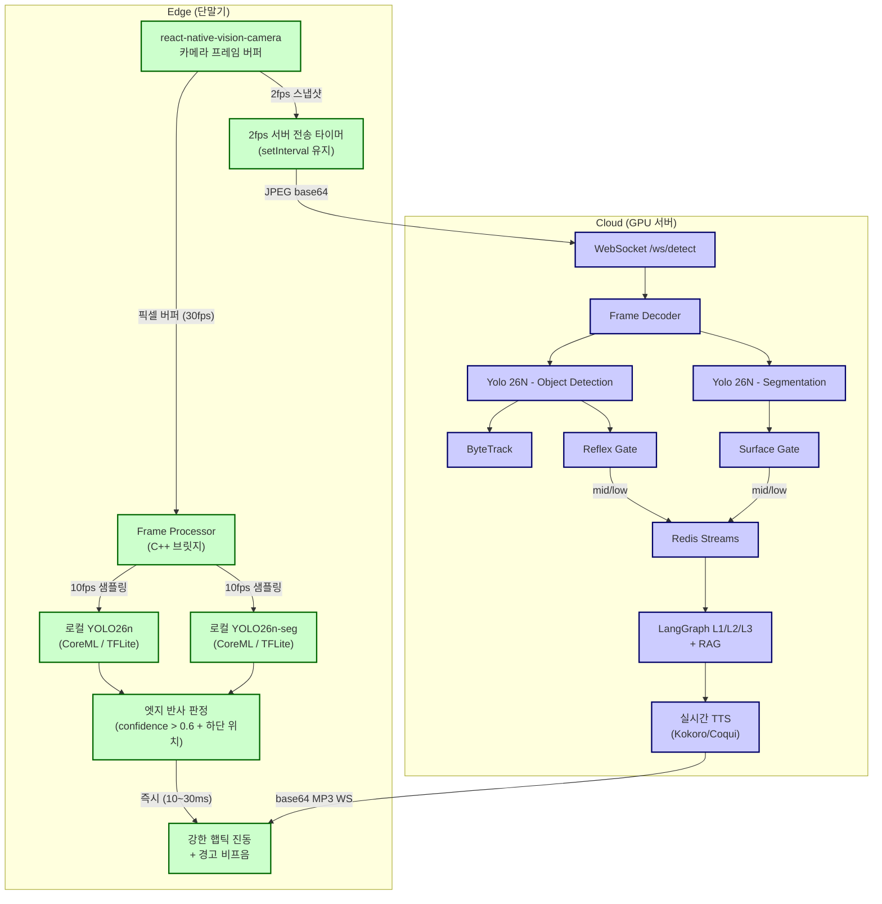
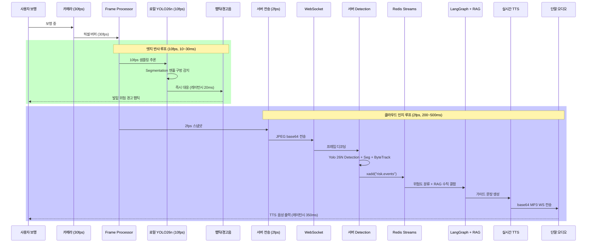

# Post-MVP 하이브리드 온디바이스 로드맵 설계서

> **작성일**: 2026-07-01
> **버전**: v0.1.0
> **설계 기준**: [`docs/minchodan_design_note.md`](minchodan_design_note.md) 부록 B "On-device 추론: 반사 레이어 (post-MVP)"
> **정합 문서**: [`docs/architecture.md`](architecture.md) (MVP 아키텍처), [`docs/minchodan_design_note.md`](minchodan_design_note.md) (7단계 골격)
> **의사결정 배경**: 2026-06-30 커밋 `16732ab` (1+2단계 Phase A~D 완료) 기반 하이브리드 아키텍처 청사진 검토 (3가지 권장안 채택)

---

## 1. 개요

### 1.1 목적

본 문서는 Minchodan MVP(서버 중심 7단계 파이프라인) 완성 후 도입할 **하이브리드 온디바이스-서버 아키텍처**의 구체적 청사진을 정의한다. 인간의 신경계가 위험을 감지했을 때 뇌까지 거치지 않고 척수 반사로 손을 떼는 것처럼, 앱도 **즉각적인 위험은 단말기(Edge)에서, 종합적인 상황 판단은 서버(Cloud)에서** 처리하는 이중 구조를 구축한다.

### 1.2 현행 MVP와의 관계

| 구분 | MVP (현행) | Post-MVP (본 문서) |
| ---- | --------- | ------------------ |
| **클라이언트 역할** | thin client (카메라 캡처 + 음성/햡틱 재생) | 온디바이스 추론 엔진 추가 (반사 루프) |
| **추론 위치** | 서버 GPU에서 **모든** 추론 수행 | **엣지(반사)** + **클라우드(인지)** 이중 추론 |
| **반사 경로 처리** | 서버 `Reflex Gate` → 사전합성 클립 WS 고우선 전송 | 단말 NPU 즉시 추론 → 햅틱/경고음 (네트워크 RTT 0ms) |
| **이중 캡처 10fps/2fps** | 두 타이머 모두 **서버 전송** → 서버 `stream_splitter` 분기 | **10fps는 단말 로컬 추론**, **2fps는 서버 전송 유지** |
| **오프라인 내성** | 없음 (서버 단절 시 전체 기능 정지) | 최소 반사 기능(충돌 방지)은 오프라인에서도 작동 |

> **중요**: Post-MVP는 MVP 3~7단계 완성 **이후**에 착수한다. 현행 설계 문서의 **비협상 원칙**(이중 경로 물리 분리, 반사 경로 LLM 미경유)은 Post-MVP에서도 그대로 준수한다.

### 1.3 의사결정 근거 (2026-07-01 검토)

| 항목 | 결정 | 근거 |
| ---- | ---- | ---- |
| **도입 시기** | 서버 MVP 3~7단계 먼저 완성 후 착수 | `design_note` 부록 B "반사 레이어 post-MVP" 정합, 일정 리스크 최소화 |
| **모델 포팅** | `yolo26n.pt` → CoreML/TFLite 직수출 시도 | Yolo 26N의 NMS-free 이점을 모바일에서도 유지하는지 벤치마크 우선 검증 |
| **캡처 패러다임** | `Frame Processor`(로컬 추론) + `setInterval`(서버 전송) 병행 | 기존 `useCamera.ts` 변경 최소화, 기존 WS 연동 유지 |

---

## 2. 하이브리드 아키텍처 전체 구상도



---

## 3. 두 루프의 역할 분담 및 데이터 흐름

| 구분 | **엣지 반사 루프** (Local Reflex Loop) | **클라우드 인지 루프** (Cloud Cognitive Loop) |
| --- | --- | --- |
| **주요 목적** | 충돌 방지, 게이트라인 이탈 방지 (생존 직결) | 경로 재탐색, 보행 수칙 기반 환경 분석, 종합 가이드 |
| **구동 주기** | **10 fps** (100ms 주기 로컬 프레임 스캔) | **2 fps** (500ms 주기 서버 이미지 전송) |
| **대상 모델** | **YOLO26n** (BBox) / **YOLO26n-seg** (세그멘테이션) | **gemma4-e4b** (LangGraph 기반 LLM 에이전트) |
| **입력 데이터** | 카메라 실시간 픽셀 버퍼 (C++ 메모리 직접 참조) | JPEG 압축 변환 후 WebSocket 스트리밍 페이로드 |
| **처리 레이턴시** | **10ms ~ 30ms 이내** (NPU 가속 목표) | 200ms ~ 500ms 내외 (네트워크 RTT 포함) |
| **피드백 형태** | 강한 햅틱 진동 (Haptics), 경고 비프음 | 회피 안내용 **TTS 음성 메시지** (상세 가이드) |
| **LLM 경유** | **미경유** (비협상 원칙 유지) | LangGraph L1/L2/L3 + RAG 경유 |
| **오프라인 동작** | **작동** (단말 NPU 독립 추론) | 미작동 (서버 단절 시 정지) |

---

## 4. 단말기 내부 컴포넌트 청사진

MVP 클라이언트 구조(`client/src/`)에 로컬 추론 계층을 추가한다.

```text
client/src/
├── components/
│   └── CameraView.tsx           # (기존) 실시간 카메라 프리뷰 및 WS 연동 상태 표시
├── hooks/
│   ├── useCamera.ts             # (기존) 2fps 서버 전송 타이머 제어 (setInterval 유지)
│   └── useLocalInference.ts     # [신규] 10fps 로컬 YOLO26 추론 엔진 훅
├── native/
│   └── FrameProcessor.cpp       # [신규] Vision Camera 프레임 버퍼를 로컬 AI 모델로 전달하는 C++ 브릿지
└── services/
    ├── frameCapture.ts          # (기존) 서버 전송용 스냅샷 처리
    ├── localDetector.ts         # [신규] CoreML / TFLite 로컬 추론 결과 파싱 (NMS-Free 처리)
    └── reflexClipPlayer.ts      # (기존 7단계) 반사 클립 즉시 재생 (선점 로직)
```

### 4.1 기존 컴포넌트 변경 범위

| 파일 | MVP 상태 | Post-MVP 변경 |
| ---- | ------- | ------------- |
| `useCamera.ts` | 반사 10fps / 인지 2fps **모두 서버 전송** | **반사 10fps는 로컬 추론용으로 전환**, 인지 2fps 서버 전송 유지 |
| `CameraView.tsx` | `setInterval` 기반 캡처 | `Frame Processor` 바인딩 추가 (로컬 추론 전용 경로) |
| `frameCapture.ts` | 2fps 서버 전송 `buildDetectionEvent` | 변경 없음 (서버 전송 로직 유지) |

### 4.2 신규 컴포넌트 상세

#### useLocalInference.ts

- 10fps 로컬 YOLO26n 추론 엔진 훅
- `Frame Processor` 콜백에서 호출되어 네이티브 단(CoreML/TFLite) 모델 구동
- 추론 결과(`detections`, `surface`)를 `reflexEdgeRef`에 저장
- `confidence > 0.6` && 화면 하단(보행자 직전 거리) 위치 조건 충족 시 `triggerHaptic()` 즉시 호출

#### FrameProcessor.cpp

- `react-native-vision-camera` 프레임 프로세서 인터페이스 구현
- 프레임 버퍼(C++ 메모리)를 로컬 AI 모델 입력 텐서로 변환
- JS 스레드 블로킹 방지 (백그라운드 스레드 구동)

#### localDetector.ts

- CoreML / TFLite 로컬 추론 결과 파싱
- **NMS-Free 처리**: YOLO26n은 후처리 NMS가 불필요하므로, 출력 배열을 루프 돌며 `confidence > 0.6` 이상 객체만 필터링
- 화면 하단(보행자 직전 거리) 위치 체크 단순 수학 공식
- 서버를 거치지 않고 단말기 세션에서 직접 `triggerHaptic()` 호출

---

## 5. NMS-Free 모바일 추론 매커니즘

YOLO26n은 후처리 연산(NMS)이 필요 없는 **NMS-Free** 설계가 핵심 전제다. 이는 모바일 NPU 환경에서 다음 장점을 제공한다.

### 5.1 MVP 서버 사이드 vs Post-MVP 모바일 사이드

| 구분 | MVP 서버 (GPU) | Post-MVP 모바일 (NPU) |
| ---- | ------------- | -------------------- |
| **NMS 처리** | Ultralytics `predict()` 내장 (NMS-Free) | CoreML/TFLite 익스포트 시 NMS-Free 정합성 검증 필요 |
| **추론 파이프라인** | 서버 `stream_splitter` → Detection/Seg → Gates | 단말 `localDetector.ts` → confidence 필터 → 햅틱 |
| **추론 레이턴시 목표** | < 80ms (`SKILL.md` 기준) | **10ms ~ 30ms** (NPU 가속) |

### 5.2 localDetector.ts 의사 코드

```typescript
// client/src/services/localDetector.ts
// NMS-Free: 모델 출력 배열을 루프 돌며 confidence > 0.6 필터링만 수행

function parseLocalDetections(rawOutput: Float32Array, frameHeight: number): LocalDetection[] {
  const detections: LocalDetection[] = [];
  for (const det of iterateDetections(rawOutput)) {
    if (det.confidence > 0.6) {
      // 화면 하단(보행자 직전 거리) 위치 체크
      const bottomY = det.bbox.y + det.bbox.h;
      if (bottomY > frameHeight * 0.85) {
        detections.push(det);
      }
    }
  }
  return detections;
}

// 조건 충족 시 즉시 단말기 세션에서 햅틱 호출 (서버 미경유)
function triggerReflexHaptic(detections: LocalDetection[]): void {
  if (detections.length > 0) {
    triggerHaptic("warning");  // 강한 햅틱 패턴
  }
}
```

> **검증 필요**: `yolo26n.pt`를 CoreML/TFLite로 익스포트할 때 NMS-Free 설계가 모바일 추론기에서 동일하게 작동하는지 벤치마크 수행 (포스트 A 단계).

---

## 6. 시나리오 기반 통합 작동 흐름

사용자가 보행 중 전방의 공사 현장 게이트와 바닥의 장애물을 마주했을 때의 시스템 작동 순서다.



### 6.1 시나리오 예시 출력

| 루프 | 감지 객체 | 출력 | 레이턴시 |
| ---- | -------- | ---- | -------- |
| **엣지 반사** | 바닥 맨홀 구멍 (Segmentation) | 발밑 위험 경고 햅틱 패턴 | ~20ms |
| **클라우드 인지** | 전방 공사 게이트 (Detection) | "전방 3m 공사 게이트 진입 제한, 우측 점자블록으로 2보 이동하세요." | ~350ms |

---

## 7. 점진적 전환 로드맵

MVP 3~7단계 완성 후 포스트 A~D 순서로 진행한다. 각 단계는 선행 단계 검증 통과 후 착수한다.

### 7.1 로드맵 개요

| 단계 | 시점 | 작업 | 선행 조건 | 검증 항목 |
| ---- | ---- | ---- | --------- | -------- |
| **MVP 3~7** | 지금 ~ | 서버 Yolo 26N Detection/Seg + Gates + RAG + LangGraph + TTS (현행 설계 그대로) | 없음 | `test_specification.md` 기준 |
| **포스트 A** | **완료** | `yolo26n.pt` CoreML/ONNX/TFLite 익스포트 및 벤치마크 검증 완료 | yolo26n 모델 확보 | ONNX/TFLite 성공, CoreML 실패 원인 규명 및 YOLO11n 대안 수립 |
| **포스트 B** | MVP 완료 후 | iOS 실기기 빌드 환경(CocoaPods) 구축, 2fps WS RTT 재검증 | 네이티브 빌드 성공 | 기존 TC-WS-001~006 + TC-CAP-007/008 통과 |
| **포스트 C** | 포스트 B 후 | `Frame Processor` + `useLocalInference` 훅 도입, 서버 2fps 전송 유지하며 10fps 로컬 추론 병렬 구동 | 포스트 A·B 검증 | 배터리·발열 프로파일링, 단말-서버 알림 중복 시나리오 정의 |
| **포스트 D** | 포스트 C 통합 후 | 단말-서버 알림 중복 조정 로직 (dedupe / debounce / 우선순위 머지) 설계 | 이중 추론 시나리오 정의 | 오프라인 모드 반사 동작, 온라인 전환 시 인지 경로 복귀 |

### 7.2 포스트 A: 모델 경량화 및 변환 (Export) - 검증 완료

- **목표**: `yolo26n.pt` 모델의 모바일 호환성 검증 및 컴파일 검증
- **검증 결과 요약**:
  - **CoreML (YOLO26n)**: 실패 (Attention 레이어 `10/m/0/attn/520` 내부 dynamic int 캐스팅 오류)
  - **CoreML (YOLOv8n/11n)**: 성공 (대안 모델 YOLO11n CoreML 10.2 MB 확보)
  - **ONNX / TFLite (YOLO26n)**: 성공 ([object_detection.onnx](file:///Users/kwanbum/Documents/korea_IT/lanhchain_ai_vision/Minchodan/server/models/yolo26n/object_detection.onnx) / [object_detection.tflite](file:///Users/kwanbum/Documents/korea_IT/lanhchain_ai_vision/Minchodan/server/models/yolo26n/object_detection.tflite) 9.8 MB)
  - **ONNX Runtime 레이턴시 시뮬레이션**: 1-Thread CPU 환경 평균 **22.89 ms** 달성 (NPU 가속 시 10~30ms 도달 가능성 입증)
- **배포 가이드라인**: React Native 내 TFLite/ONNX 런타임 구동을 통해 YOLO26n 및 YOLO26n-seg 모델을 직접 배포하는 것으로 설계를 단일화한다. 대안 모델(YOLO11n 등) 대체 배포 안을 완전히 배제하며, 변환 성공이 검증된 TFLite/ONNX 포맷을 사용하여 원본 모델 가동을 의무화한다. 상세는 [`docs/post_mvp_ondevice_feasibility.md`](post_mvp_ondevice_feasibility.md) 참조.


### 7.3 포스트 B: iOS 시뮬레이터/실기기 타겟팅 전환

- **목표**: CocoaPods 설정 및 빌드 환경 구축, 2fps WS 전송 코드가 아이폰 실기기에서 네트워크 RTT 성능 검증
- **검증**:
  - 기존 TC-WS-001~006 (RTT < 100ms) 통과
  - 기존 TC-CAP-007/008 (단말 권한·타이머 해제) 통과
  - iOS 실기기 카메라 권한·ATS 설정 정상 동작

### 7.4 포스트 C: 로컬 프레임 프로세서 결합

- **목표**: `react-native-vision-camera` 환경에 `Frame Processor` 연동, 2fps 전송 스냅샷과 별개로 10fps 로컬 추론을 백그라운드 스레드에서 병렬 구동
- **구조**: **두 패러다임 병행** (채택된 권장안)
  - `Frame Processor`: 로컬 추론 전용 (10fps 내부 샘플링)
  - `setInterval + takePhoto`: 서버 전송 전용 (2fps 유지)
- **검증**:
  - 배터리 소모율·발열 프로파일링 (1시간 연속 구동 기준)
  - 단말-서버 알림 중복 시나리오 정의 (예: 동일 객체를 엣지와 서버가 동시 감지)
  - 오프라인 모드 반사 동작 확인 (서버 단결 상태에서 햅틱만 작동)

### 7.5 포스트 D: 이중 추론 정합성 및 알림 조정

- **목표**: 단말 추론 결과(햅틱)와 서버 응답(TTS)의 중복·충돌 조정 로직 설계
- **조정 메커니즘**:
  - **dedupe**: 동일 객체(alert_id 기반) 중복 알림 억제
  - **debounce**: 단말 햅틱 후 서버 TTS 도달 시간차 보정
  - **우선순위 머지**: 반사(햅틱) > 인지(TTS) 우선순위 보장 (기존 선점 로직 확장)
- **검증**:
  - 오프라인 → 온라인 전환 시 인지 경로 자동 복귀
  - 단말-서버 객체 평가 불일치 시 알림 충돌 없음 확인

---

## 8. 기술적 리스크 및 대응

| 리스크 | 상세 | 심각도 | 대응 |
| ------ | ---- | ------ | ---- |
| **YOLO26n 모바일 포팅** | Yolo 26N은 **sm_120(Blackwell GPU) 최적화**가 핵심 전제. CoreML/TFLite 익스포트 시 NPU 친화 연산 보장 불확실. NMS-Free 설계가 모바일 추론기에서 동일 작동 여부 별도 검증 필요. | **높음** | 포스트 A에서 벤치마크 우선 검증. 타당성 미확보 시 `yolo11n`/`yolov8n` 모바일 변종 병행 검토. |
| **비전 카메라 패러다임 전환** | 현행 `setInterval + takePhoto`(스냅샷) → `Frame Processor`(30fps+ 동기 콜백, C++ 브릿지). `useCamera.ts` 변경 범위 확대 위험. | **높음** | 두 패러다임 병행 구조 채택 (포스트 C). `Frame Processor`는 로컬 추론 전용, `setInterval`은 서버 전송 유지로 변경 최소화. |
| **모델 이중 관리** | 서버용(`yolo26n` sm_120)과 모바일용(CoreML/TFLite) **다른 가중치 파일** 2종 관리·정합 필요. | **중간** | `server/models/yolo26n/`(서버용) + `client/src/assets/models/`(모바일용) 분리 관리. 익스포트 스크립트(`scripts/export_mobile.py`)로 단일 소스 추적. |
| **MVP 일정 지연** | 온디바이스를 3단계와 병렬 진행 시 서버 3~7단계 완성이 후순위로 밀릴 위험. | **높음** | 도입 시기 결정: **서버 MVP 3~7단계 먼저 완성** (채택됨). |
| **이중 추론 정합성** | 단말이 "맨홀 감지 → 햅틱"을 내리고, 서버가 350ms 뒤 다르게 평가할 위험. 알림 중복·충동 조정 로직 미설계. | **중간** | 포스트 D에서 dedupe/debounce/우선순위 머지 로직 설계. |
| **단말 리소스** | 비전 카메라 + 로컬 YOLO 상시 구동 시 배터리·발열. 시각장애인 보행 보조기에서 화면 켜짐·발열은 핵심 가용성 지표. | **중간** | 포스트 C에서 1시간 연속 구동 배터리·발열 프로파일링. 허용 범위 초과 시 추론 주기 조정(10fps → 8fps). |

---

## 9. 설계 원칙 정합성

Post-MVP 도입 시에도 현행 설계 문서의 **비협상 원칙**은 그대로 준수한다.

| 원칙 | MVP | Post-MVP 유지 여부 |
| ---- | --- | ----------------- |
| **이중 경로 물리 분리** | 서버 `stream_splitter`가 `reflex_queue`/`cognitive_queue` 분기 | **유지**: 엣지(반사) + 클라우드(인지) 물리 분리 확장 |
| **반사 경로 LLM 미경유** | 서버 `Reflex Gate` / `Surface Gate` 룰베이스 | **유지**: 단말 `localDetector.ts`도 룰베이스만 (LLM 미경유) |
| **반사 음성 = 사전합성 고정 클립** | 앱 번들 `reflex_clips/` | **유지**: 단말 햅틱은 실시간 합성 아님 (고정 패턴) |
| **선점(preempt)** | 반사 음성이 인지 음성 중단 후 재생 | **유지**: 햅틱은 TTS보다 항상 우선 (포스트 D 머지 로직) |
| **thin client** | 카메라 캡처 + 음성/햡틱 재생만 | **Post-MVP 확장**: 로컬 추론 엔진 추가 (MVP 범위 유지하다가 post-MVP에서 변경) |

> **`AGENTS.md` §1 갱신 필요**: Post-MVP 착수 시 "thin client" 표현을 "thin client + 온디바이스 반사 추론"으로 갱신. 단, MVP 범위에서는 "thin client" 유지.

---

## 10. 환경 변수 추가 예정

Post-MVP 착수 시 `docs/environment_variables.md`에 추가될 환경 변수다.

| 변수 | 설명 | 기본값 | 단계 |
| ---- | --- | ------ | ---- |
| `ENABLE_LOCAL_INFERENCE` | 온디바이스 로컬 추론 활성화 여부 | `false` | 포스트 C |
| `LOCAL_INFERENCE_FPS` | 로컬 추론 목표 fps | `10` | 포스트 C |
| `LOCAL_CONFIDENCE_THRESHOLD` | 로컬 추론 confidence 임계값 | `0.6` | 포스트 C |
| `LOCAL_MODEL_PATH` | 모바일 모델 파일 경로 (번들) | `assets/models/yolo26n.mlpackage` | 포스트 A |
| `HAPTIC_PATTERN_WARNING` | 반사 햅틱 패턴 식별자 | `warning` | 포스트 C |

> MVP 범위에서는 위 변수 모두 미사용. Post-MVP 착수 시 `environment_variables.md` 갱신.

---

## 11. 검증 기준 (Post-MVP)

| 단계 | 검증 항목 | 합격 기준 |
| ---- | -------- | -------- |
| **포스트 A** | CoreML 익스포트 성공 | `.mlpackage` 파일 생성 |
| **포스트 A** | 모바일 NPU 추론 레이턴시 | **10ms ~ 30ms 이내** |
| **포스트 A** | NMS-Free 정합성 | 서버 대비 탐지 결과 일치율 ≥ 90% |
| **포스트 A** | 탐지 정확도 손실 | mAP 손실 ≤ 5% (서버 대비) |
| **포스트 B** | iOS 실기기 WS RTT | **< 100ms** (TC-WS-001~006 유지) |
| **포스트 B** | 카메라 권한·타이머 해제 | TC-CAP-007/008 통과 |
| **포스트 C** | 로컬 추론 10fps 구동 | 프레임당 추론 < 30ms |
| **포스트 C** | 배터리 소모율 | 1시간 연속 구동 시 ≤ 20% 소모 |
| **포스트 C** | 발열 프로파일 | 기기 온도 ≤ 45°C (1시간 기준) |
| **포스트 C** | 오프라인 반사 동작 | 서버 단절 상태에서 햅틱 정상 작동 |
| **포스트 D** | 알림 중복 억제 | 동일 객체 5초 내 중복 알림 ≤ 1회 |
| **포스트 D** | 온라인 복귀 | 서버 재연결 시 인지 경로 자동 복귀 |
| **포스트 D** | 우선순위 머지 | 반사 햅틱이 TTS보다 항상 우선 출력 |

---

## 12. 참고 문서

| 문서 | 참조 내용 |
| ---- | -------- |
| [`docs/minchodan_design_note.md`](minchodan_design_note.md) | 부록 B "On-device 추론: 반사 레이어 (post-MVP)" 원천 정의 |
| [`docs/architecture.md`](architecture.md) | MVP 시스템 아키텍처 (§5.3 3단계 이중 게이트, §7 이중 경로 동작 모드) |
| [`.agents/skills/yolo-obstacle-detection/SKILL.md`](../.agents/skills/yolo-obstacle-detection/SKILL.md) | 3단계 Yolo 26N Detection/Seg 서버 구현 가이드 |
| [`docs/test_specification.md`](test_specification.md) | MVP 검증 기준 (TC-WS, TC-CAP 시리즈) |
| [`docs/environment_variables.md`](environment_variables.md) | 환경 변수 단일 명세 (Post-MVP 변수 추가 예정) |
