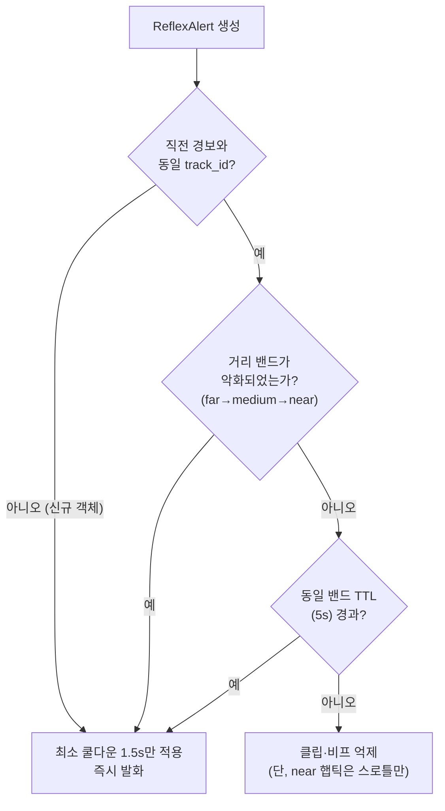
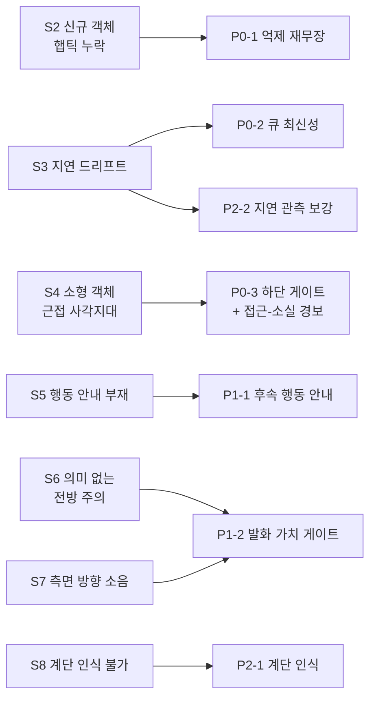

# 실사용 필드 테스트 피드백 기반 개선 구현 계획서

> **작성일**: 2026-07-17
> **버전**: v1.0
> **선행 문서**: [`docs/research/outdoor_guidance_refinement_roadmap.md`](../research/outdoor_guidance_refinement_roadmap.md) (Phase 1~3 완료 이후 후속 계획), [`docs/design/behavior_and_risk_insight.md`](../design/behavior_and_risk_insight.md), [`docs/design/architecture.md`](../design/architecture.md)
> **적용 원칙**: 이중 경로 물리 분리(반사 경로 LLM/RAG/실시간 TTS 미경유)는 본 계획의 모든 과제에서 비협상 원칙으로 유지합니다.

---

## 1. 배경 및 테스트 피드백 요약

실기기 실외 보행 테스트에서 수집된 사용자 피드백을 증상 단위로 정리하면 아래와 같습니다.

| ID | 증상 | 관련 경로 | 평가 |
| :--- | :--- | :--- | :--- |
| S1 | 미리 추적되던 객체는 전방 주의 안내와 근접 햅틱이 정상 동작 | 반사+인지 | 정상 (유지) |
| S2 | 미리 추적되지 않은(갑자기 등장한) 객체는 햅틱이 안 울리거나 매우 늦음 | 반사 | 결함 |
| S3 | 앱 실행 시간이 흐르면 모든 햅틱·안내 메시지가 점점 밀림(지연 드리프트) | 공통 | 결함 |
| S4 | 나무·기둥 등 화면을 채우는 대형 객체는 정상이나, 소화전 등 소형 객체는 근접 시 햅틱 미발동 | 반사 | 결함 |
| S5 | 햅틱이 울리고 끝. 이후 회피 행동(어느 쪽으로 비킬지) 안내가 없음 | 반사 후속 | 결함 |
| S6 | 가끔 의미 없는 "전방 주의" 안내가 발화됨 | 인지 | 결함 |
| S7 | 12시 방향이 아닌 측면 방향의 의미 없는 안내가 잦아 청각 피로 유발 | 인지 | 결함 |
| S8 | 계단 인식 불가 | 탐지 모델 | 결함 |

---

## 2. 증상별 근본 원인 분석 (코드 근거)

### 2.1 S2: 신규 객체 햅틱 누락·지연

| 원인 | 코드 근거 | 설명 |
| :--- | :--- | :--- |
| **전역 반사 억제 60초** | `server/tts/suppressor.py` `DEFAULT_TTL = 60`, `server/detection/gates/reflex_gate.py` `SUPPRESS_ALERT_ID = "high_obstacle"` | 근접 반사 경보의 억제 키가 객체·트랙 구분 없이 `suppress:{device_id}:high_obstacle` 하나로 고정되어 있습니다. 첫 경보 후 60초 동안은 **완전히 다른 새 객체가 나타나도 reflex_alert 페이로드 자체가 전송되지 않아** 햅틱·비프가 모두 침묵합니다. 보행 속도(약 1m/s) 기준 60초는 60m 구간 무방비를 의미합니다. |
| **시간적 지속성 이중 필터** | `server/detection/detection_pipeline.py:150` (`hit_count < 4` 드롭), `reflex_gate.py` `MIN_HIT_COUNT = 3` | 파이프라인 전처리에서 `hit_count < 4` 탐지를 통째로 버리므로 신규 트랙은 최소 4프레임 연속 관측이 필요합니다. 실효 반사 처리 fps가 떨어진 상태(S3)에서는 이 4프레임 확보에만 1~2초 이상 걸립니다. |
| **트랙 컨텍스트 리셋** | `server/detection/bytetrack_tracker.py` `_compute_hit_count` | 트랙이 한 프레임이라도 끊기면 hit_count가 1로 리셋되어 필터를 다시 처음부터 통과해야 합니다. |

### 2.2 S3: 지연 드리프트 (시간 경과에 따른 알림 밀림)

| 원인 | 코드 근거 | 설명 |
| :--- | :--- | :--- |
| **깊은 큐 + 만석 시에만 drop** | `server/capture/stream_splitter.py` `QUEUE_MAXSIZE = 100` | 소비 속도(추론)가 생산 속도(캡처 fps)보다 느리면 큐가 서서히 차오르며, drop-oldest는 **큐가 가득 찬 뒤에야** 발동합니다. 정상상태 지연 = 큐 깊이 / 처리 fps (예: 처리 5fps에 큐 100이면 최대 20초 지연). "시간이 지나면 밀린다"는 증상과 정확히 일치합니다. |
| **ACK가 큐 적체와 무관** | `server/api/ws_router.py:845` (`_send_detection_ack`가 디코드 직후 호출) | 2026-07-17 도입된 단말 in-flight 제한(`client/src/hooks/useWebSocket.ts` `MAX_IN_FLIGHT_FRAMES = 2`)은 WS 송신 버퍼 적체는 막지만, ACK가 디코드 직후(큐 적재 전) 반환되므로 **서버 내부 reflex_queue 적체는 제어하지 못합니다.** |
| **반사 프레임 처리 비용** | `server/detection/detection_pipeline.py:124-135` | 반사 8~10fps 프레임마다 Object Detection + Segmentation 추론 2회, 트랙별 Redis get/set, 교차검증(9점 폴리곤 검사), 콘솔 브로드캐스트가 모두 수행되어 소비 속도의 상한을 낮춥니다. |

### 2.3 S4: 소형 객체 근접 사각지대

| 원인 | 코드 근거 | 설명 |
| :--- | :--- | :--- |
| **면적 비율 단일 근접 판정** | `reflex_gate.py` `MIN_AREA_RATIO = 0.10` | 근접 판정이 "bbox 면적이 화면의 10% 이상" 하나뿐입니다. 나무·기둥은 근접 시 화면을 채워 통과하지만, 소화전·볼라드 등 소형 객체는 10%에 도달하기 전에 **카메라 시야 하단 밖으로 벗어나 탐지 자체가 소멸**합니다(가슴 높이 거치·전방 지향 카메라의 기하학적 한계). |
| **접근-소실 메모리 부재** | `bytetrack_tracker.py`, `detection_pipeline.py` | "접근 중(approaching)이던 트랙이 화면 하단에서 사라졌다"는 상태를 기억·활용하는 로직이 없습니다. 소실 순간이 사실상 최근접 시점인데 이때 아무 경보도 나가지 않습니다. |
| **발밑 임계 미사용** | `reflex_gate.py` `PROXIMITY_THRESHOLD = 0.15` (본문 미사용 주석 명기) | 화면 하단(발밑) 접근 판정 상수가 정의만 되고 게이트 본문에서 사용되지 않습니다. |

### 2.4 S5: 햅틱 이후 행동 안내 부재

| 원인 | 코드 근거 | 설명 |
| :--- | :--- | :--- |
| **후속 가이드가 쿨다운에 침묵** | `server/detection/consumer.py` `_trigger_delayed_cognitive_guide`(800ms 후속), `_min_guide_cooldown_sec = 8.0`, 전송 직전 재검사 | 반사 경보 800ms 후 인지 가이드를 예약하는 구조는 이미 있으나, 직전 8초 내 다른 안내가 있었으면 **조기 반환으로 조용히 드롭**됩니다. 오케스트레이션+TTS가 2~10초 걸린 뒤 전송 직전 재검사에서 또 한 번 드롭됩니다. 즉 정작 충돌 직전 상황의 후속 안내가 가장 자주 생략됩니다. |
| **회피 방향 산출 로직 부재** | `server/orchestration/nodes/l2_generator.py` 프롬프트 예시("2시로 우회") | LLM 프롬프트에 우회 예시는 있으나, 실제 좌/우 어느 쪽에 여유 공간이 있는지(세그멘테이션 기반) 계산해 주입하는 로직이 없어 행동 지시가 생성되지 못하거나 근거 없이 생성됩니다. |

### 2.5 S6·S7: 저가치 발화(전방 주의·측면 소음)

| 원인 | 코드 근거 | 설명 |
| :--- | :--- | :--- |
| **L3 실패 폴백의 무조건 발화** | `server/orchestration/nodes/fallback_node.py` `FALLBACK_MESSAGE = "전방 주의, 천천히 멈추세요"` | LLM 생성·검증이 실패하면 위험도와 무관하게 정지 명령급 문구가 발화됩니다. 원거리 low 위험 객체에서 L3가 실패한 경우에도 "전방 주의"가 나가므로 사용자는 "의미 없는 경고"로 인지합니다. |
| **low 위험까지 발화 대상** | `consumer.py:412` (`risk_hint in ("mid", "low")`), `fast_lane.py` `FAST_LANE_DISTANCES = {near, medium, far}` | 원거리(far)·측면(9시/3시) 정적 객체도 8초 쿨다운마다 "9시 방향 사람 있습니다"류 안내가 반복됩니다. 발화 가치(충돌 회랑 내인가, 접근 중인가)를 판정하는 게이트가 인지 경로에 없습니다. |

### 2.6 S8: 계단 인식 불가

| 원인 | 코드 근거 | 설명 |
| :--- | :--- | :--- |
| **탐지·분할 클래스에 계단 부재** | `server/detection/risk_rules.py` CLASS_TEXT 29종(stairs 없음), `server/detection/gates/surface_gate.py` 2026-07-07 정정 주석 | Object Detection 29클래스에 계단이 없고, Segmentation은 계단/맨홀/그레이팅을 `caution` 하나로 통합 학습했습니다. 따라서 계단을 계단이라고 특정하는 것이 현재 모델 구조상 불가능합니다. |
| **STAIR_DOWN 힌트 영구 미발동** | `risk_rules.py` `CLASS_TO_HINT_ID` (STAIR_DOWN 매핑 클래스 없음) | 메시지 체계에는 STAIR_DOWN이 정의되어 있으나 이를 발동시키는 클래스 매핑이 없어 죽은 코드입니다. |
| **caution 자체 미탐 가능성** | 실측 필요 | 필드에서 계단 접근 시 `surface_caution` 반사 경보도 나오지 않았다면 세그멘테이션 모델의 계단 재현율 자체가 낮을 가능성이 있어 실측 검증이 선행되어야 합니다. |

---

## 3. 개선 과제 총괄 및 우선순위

| 과제 ID | 대상 증상 | 요약 | 우선순위 | 협업 구분 |
| :--- | :--- | :--- | :--- | :--- |
| **P0-1** | S2 | 반사 억제 재무장(Re-arm) 정책: TTL 단축 + 거리 악화·신규 트랙 시 즉시 재발화 + 햅틱·클립 억제 분리 | P0 | 재무장 규칙 = 하드코딩, Redis 연동 = 바이브코딩 |
| **P0-2** | S3 | 반사 큐 최신성 보장(latest-frame-wins) + 프레임 신선도 검사 + 큐 대기 계측 | P0 | 상수·정책 = 하드코딩, 계측 배선 = 바이브코딩 |
| **P0-3** | S4 | 하단 근접 보조 게이트 + 접근-소실(Approach-Lost) 경보 | P0 | 판정 규칙 = 하드코딩, 트랙 컨텍스트 연동 = 바이브코딩 |
| **P1-1** | S5 | 반사 후속 행동 안내: 쿨다운 면제 전용 레인 + 회피 방향 산출 + 사전합성 행동 클립 | P1 | 회피 방향 규칙 = 하드코딩, 클립 빌드·전송 = 바이브코딩 |
| **P1-2** | S6, S7 | 발화 가치 게이트(Speech-Worthiness): 회랑 밖·원거리 정적 객체 무발화 + 폴백 발화 조건 강화 | P1 | 발화 조건 규칙 = 하드코딩, 노드 연결 = 바이브코딩 |
| **P2-1** | S8 | 계단 인식: caution 실측 검증 → 단기 문구 보정 → 중기 세그멘테이션 stair 클래스 분리 재학습 | P2 | 데이터 구성·학습 = 담당자 주도 |
| **P2-2** | S3 | 콘솔 지연 드리프트 관측: 큐 깊이·queue_wait_ms 게이지 | P2 | 바이브코딩 |

우선순위 기준: P0 = 안전 직결(경보 누락·지연), P1 = 사용성 직결(행동 안내·청각 피로), P2 = 모델·관측 개선.

---

## 4. P0 상세 설계

### 4.1 P0-1: 반사 억제 재무장(Re-arm) 정책

현재 구조는 "60초 동안 무조건 침묵"이며, 개선 목표는 "**같은 상황의 반복 안내는 억제하되, 상황이 바뀌면(새 객체·거리 악화) 즉시 다시 경보**"입니다.



| 변경 항목 | 현재 | 변경 | 근거 |
| :--- | :--- | :--- | :--- |
| 억제 키 | `high_obstacle` 고정 | `high_obstacle:{track_id}:{distance_band}` | 새 객체·거리 악화 시 키가 달라져 억제를 우회. 방향 버킷은 기존 결정(2026-07-16 Option A)대로 계속 키에서 제외 |
| TTL | 60초 | 동일 키 5초 (환경 변수 `REFLEX_SUPPRESS_TTL_S`, 기본 5) | 보행 속도 기준 5초면 동일 객체 반복 스팸 방지에 충분 |
| 신규 트랙 최소 쿨다운 | 없음(전역 60초에 흡수) | device 단위 1.5초 (`REFLEX_MIN_GAP_S`) | 서로 다른 객체 경보의 최소 간격만 보장해 알림 폭탄 방지 |
| 햅틱 분리 | 클립·햅틱 일괄 억제 | `distance <= 0.6m`(near) 햅틱+비프는 TTL 억제에서 제외하고 500ms 스로틀만 적용 | 충돌 임박 촉각 신호는 반복되어도 안전 이득이 손실보다 큼 |

- **수정 파일**: `server/tts/suppressor.py`(키 정책·이중 TTL), `server/detection/consumer.py`(`_send_reflex_alert` 억제 분기), `server/detection/gates/reflex_gate.py`(distance_band 필드 추가), `server/detection/schemas.py`(ReflexAlert에 `distance_band` 추가 시), `.env.example`
- **하드코딩 영역(담당자 직접)**: distance_band 경계값(near/medium/far), TTL·쿨다운 상수, 재무장 판정 함수 `should_rearm(prev, current)` 본문(약 25줄)
- **유의**: track_id를 키에 포함하면 트랙 리셋 시 억제가 풀리는 부작용이 있으나, 이는 "새 상황으로 간주하고 다시 경보"라는 정책 방향과 일치하므로 허용합니다. 최소 쿨다운 1.5초가 폭주를 막습니다.

### 4.2 P0-2: 반사 큐 최신성 보장

| 변경 항목 | 현재 | 변경 |
| :--- | :--- | :--- |
| `reflex_queue` maxsize | 100 | **2** (latest-frame-wins: 가득 차면 즉시 oldest drop이 사실상 매 프레임 동작) |
| `cognitive_queue` maxsize | 100 | **4** (인지 1~2fps 특성상 소량 버퍼면 충분) |
| 소비 시 신선도 검사 | 없음 | `_process_frame` 진입 시 `now - processed.ts > REFLEX_MAX_AGE_S`(기본 0.4초, 인지 2.0초)이면 추론 없이 드롭하고 카운터 증가 |
| 큐 대기 계측 | 없음 | `queue_wait_ms = (소비 시각 - processed.ts)`를 `latency_stages`에 추가해 기존 `latency_event` 콘솔 채널로 노출 |

- 큐를 얕게 잡으면 드롭률은 올라가지만, 반사 경로에서 중요한 것은 **프레임 처리율이 아니라 "지금" 프레임의 지연**입니다. hit_count 연속성은 드롭된 프레임만큼 증가가 느려질 뿐 리셋되지 않으므로(동일 track_id 유지) P0-1·P0-3과 상충하지 않습니다.
- **수정 파일**: `server/capture/stream_splitter.py`(QUEUE_MAXSIZE 분리 상수화), `server/detection/consumer.py`(`_consume_loop` 신선도 검사, latency_stages 확장), `docs/ops/environment_variables.md`(`REFLEX_MAX_AGE_S`, `COGNITIVE_MAX_AGE_S` 추가)
- **검증**: 20분 연속 구동 중 `queue_wait_ms` p95가 200ms 이하로 유지되는지 콘솔 지연 패널로 확인(현재 구조에서는 시간이 갈수록 증가).

### 4.3 P0-3: 소형 객체 하단 근접 게이트 + 접근-소실 경보

**(1) 하단 근접 보조 조건** — `reflex_gate` 근접 판정을 OR 결합으로 확장합니다.

```text
is_very_close = (area_ratio >= 0.10)                       # 기존: 대형 객체
             or (bottom_ratio >= 0.85 and area_ratio >= 0.03)  # 신규: 소형 객체가 발밑에 도달
```

- `bottom_ratio = (bbox.y + bbox.h) / frame_height`. 정의만 되어 있던 `PROXIMITY_THRESHOLD` 계열 발상을 실제 게이트에 편입하는 것입니다.
- 중앙 존(`CENTER_X_MIN~MAX`)·`MIN_HIT_COUNT` 조건은 기존 그대로 유지해 오탐 증가를 억제합니다.

**(2) 접근-소실(Approach-Lost) 경보** — 소형 객체가 시야 밖으로 사라지는 최근접 시점을 커버합니다.

| 단계 | 내용 |
| :--- | :--- |
| 기록 | `ByteTrackTracker`가 트랙 컨텍스트에 `last_bottom_ratio`, `last_area_ratio`, `direction` 저장(현재 `last_pos`로 사실상 보유, 필드만 정리) |
| 소실 감지 | `DetectionPipeline.run`에서 직전 프레임까지 존재하던 track_id가 현재 프레임에 없으면 Redis 컨텍스트 조회로 소실 후보 판정(컨텍스트 TTL 활용, 신규 폴링 없음) |
| 발동 조건 | 소실 직전 상태가 `direction == "approaching"` 그리고 `last_bottom_ratio >= 0.80` 그리고 중앙 존이었던 트랙만, 소실 후 1회 `alert_id = "high_obstacle_lost"` 반사 경보(haptic_pattern=continuous, 사전합성 클립 재사용) |
| 재발 방지 | 동일 track_id 소실 경보는 1회로 제한(컨텍스트에 `lost_alert_sent` 마킹) |

- **수정 파일**: `server/detection/gates/reflex_gate.py`, `server/detection/bytetrack_tracker.py`, `server/detection/detection_pipeline.py`, `server/bus/redis_client.py`(컨텍스트 필드 추가 시)
- **하드코딩 영역(담당자 직접)**: bottom_ratio·area_ratio 경계값과 Approach-Lost 발동 조건식(약 20~30줄). 발표 시 "카메라 기하학적 사각지대를 트랙 메모리로 보완했다"는 설계 의도를 `[면접 대비 주석]`으로 첨부합니다.
- **유의(비협상 원칙)**: Approach-Lost 경보도 반사 경로이므로 사전합성 클립만 사용하며 LLM/RAG를 경유하지 않습니다.

---

## 5. P1 상세 설계

### 5.1 P1-1: 반사 후속 행동 안내 (Post-Reflex Action Guide)

목표: "햅틱 → (0.8초) → **어느 쪽으로 피할지**"가 끊기지 않고 이어지는 경험.

| 변경 항목 | 내용 |
| :--- | :--- |
| 쿨다운 우선권 | `_trigger_delayed_cognitive_guide` 경유 가이드는 일반 쿨다운(8초+직전 재생시간)을 면제하고, 별도의 짧은 반사 후속 쿨다운(3초, `POST_REFLEX_GUIDE_GAP_S`)만 적용. 일반 인지 내레이션보다 항상 우선 |
| LLM 미경유 우선 | 반사 후속은 지연이 생명이므로 fast lane 템플릿을 강제 우선 적용(`used_fast_lane` 강제 분기). LLM은 fast lane 조건 미충족 시에만 폴백 |
| 회피 방향 산출 | 신규 `server/detection/avoidance.py`: bbox 중심의 좌우 치우침 + 세그멘테이션 `sidewalk_normal` 폴리곤의 좌/우 여유 폭을 비교해 `avoid_direction`(left/right/stop) 결정. 오케스트레이션 입력(`orch_input`)에 주입 |
| 행동 템플릿 | fast lane 템플릿 확장: near이고 avoid_direction 확정 시 "오른쪽으로 비켜 지나가세요" / 여유 공간 없음 시 "잠시 멈추고 대기하세요" (모두 20자 이내, L3 기준 준수) |

- **수정 파일**: `server/detection/consumer.py`, 신규 `server/detection/avoidance.py`, `server/orchestration/nodes/fast_lane.py`(행동 템플릿), `server/orchestration/graph_builder.py`(분기 조건 변경 시)
- **하드코딩 영역(담당자 직접)**: `estimate_avoid_direction(bbox, surfaces, frame_w, frame_h)` 판정 로직(약 30~40줄) - 좌/우 여유 폭 계산과 결정 규칙
- **유의**: 후속 안내는 인지 경로(실시간 TTS)이므로 이중 경로 원칙 위반이 아닙니다. 반사 경로 자체는 P0-1의 클립·햅틱까지만 담당합니다.

### 5.2 P1-2: 발화 가치 게이트 (Speech-Worthiness Gate)

인지 경로 발화 직전(`_send_cognitive_guide` 진입부)에 아래 조건을 통과한 이벤트만 오케스트레이션으로 진입시킵니다. 통과 실패는 로그만 남기고 침묵합니다.

| 규칙 | 내용 | 대상 증상 |
| :--- | :--- | :--- |
| 회랑 필터 | primary detection이 `FRONT_BAND`(12시 회랑) 밖이면: `approaching`이 아닌 한 무발화. 측면 정적 객체(벤치·가로수 등) 내레이션 제거 | S7 |
| 거리 필터 | `far` + 정적(`direction != "approaching"`) 객체는 무발화. `medium` 이내 또는 접근 중만 발화 | S7 |
| low 내레이션 기본 종료 | `risk_hint == "low"` 순수 내레이션은 환경 변수 `GUIDE_LOW_RISK_NARRATION`(기본 false)일 때만 발화. 보도 이탈 확정(`departure_confirmed`)·유의미 노면은 기존대로 발화 유지 | S6, S7 |
| 폴백 발화 조건 강화 | `fallback_node`에서 `risk_level == "low"`이고 탐지 근거가 회랑 밖이면 `guidance_text`를 빈 값으로 반환하고 consumer가 무발화 처리. "전방 주의, 천천히 멈추세요"는 mid 이상에서만 유지 | S6 |

- **수정 파일**: `server/detection/consumer.py`(진입 필터), `server/orchestration/nodes/fallback_node.py`, `server/tts/realtime_tts.py`(빈 문장 방어), `docs/ops/environment_variables.md`
- **하드코딩 영역(담당자 직접)**: 발화 가치 판정 함수 `is_speech_worthy(det, direction, distance, risk)` (약 20줄)
- **효과**: 발화 총량이 줄어 S1(정상 동작하던 12시 전방 안내)의 체감 신뢰도가 올라가고, P1-1 후속 안내가 쿨다운 경쟁 없이 자리를 확보합니다.

---

## 6. P2 상세 설계

### 6.1 P2-1: 계단 인식

3단계로 접근합니다. 모델 재학습은 데이터·시간 비용이 크므로 실측 검증을 선행합니다.

| 단계 | 내용 | 산출물 |
| :--- | :--- | :--- |
| (a) 실측 검증 | 계단 접근 영상으로 현행 세그멘테이션의 `caution` 재현율 측정(`scripts/` 오프라인 평가 스크립트 + 콘솔 Detection Feed). `surface_caution` 반사 경보가 하단 60% 조건에서 발동하는지 확인 | 재현율 리포트 (`docs/ops/model_class_validation_report.md` 갱신) |
| (b) 단기 보정 | `caution` 발동 시 안내 문구를 "전방 바닥 단차 주의"로 조정(계단/맨홀 통합 클래스임을 문구에 반영). (a)에서 재현율이 낮으면 `YOLO_CONF` 하향 등 임계 튜닝 병행 | `surface_gate` 클립·`risk_rules` 문구 수정 |
| (c) 중기 재학습 | Segmentation을 5클래스(`sidewalk_normal/caution/roadway/braille_normal/stair`)로 재학습. AI Hub 원본에서 계단 라벨 재분리 + 기존 외부 데이터 융합 파이프라인(`training/`의 merge 절차) 재사용. 완료 시 `CLASS_TO_HINT_ID`에 STAIR_DOWN 활성화, `surface_gate`에 stair 하향 경사 경보 추가 | 재학습 가중치, KPI: stair 클래스 IoU 0.5 이상·재현율 0.7 이상 |

- 클라이언트 `depthProbe`(LiDAR) 기반 하강 단차 감지는 post-MVP 하이브리드 로드맵([`docs/research/post_mvp_hybrid_roadmap.md`](../research/post_mvp_hybrid_roadmap.md))과 연계해 별도 검토합니다(본 계획 범위 외).

### 6.2 P2-2: 지연 드리프트 관측 보강

- 콘솔 "파이프라인 지연 요약" 패널에 P0-2의 `queue_wait_ms`와 reflex/cognitive 큐 깊이(qsize)를 추가 노출합니다. 기존 `latency_event` 브로드캐스트 채널을 재사용하므로 신규 연결이 필요 없습니다.
- **수정 파일**: `server/detection/consumer.py`, `console/src` 지연 패널 컴포넌트

---

## 7. 검증 계획

| 과제 | 단위 테스트 | 시나리오/필드 검증 | KPI |
| :--- | :--- | :--- | :--- |
| P0-1 | 신규 `tests/test_suppressor_rearm.py`: 동일 트랙 반복 억제, 신규 트랙 즉시 발화, 거리 악화 재발화, near 햅틱 스로틀 | 보행 중 신규 객체 돌출 시 경보 지연 측정 | 신규 객체 등장→경보 2초 이내(현재 최대 60초) |
| P0-2 | `tests/test_frame_decode.py` 확장: 큐 만석 시 latest 유지, stale 드롭 | 20분 연속 구동 드리프트 측정 | `queue_wait_ms` p95 200ms 이하, 시간에 따른 증가 없음 |
| P0-3 | `tests/test_detection.py` 확장: 하단 근접 OR 조건, Approach-Lost 1회 발동·재발 방지 | 소화전·볼라드 접근 실측(대/소형 객체 각 5회) | 소형 객체 근접 햅틱 발동률 80% 이상(현재 0%) |
| P1-1 | `tests/test_langgraph.py` 확장: avoid_direction 주입 시 행동 템플릿, 쿨다운 면제 | 반사 경보 후 후속 안내 도달률 측정 | 반사 후 3초 이내 행동 안내 도달률 90% 이상 |
| P1-2 | 발화 가치 게이트 단위 테스트: 측면 far 무발화, mid 이상 폴백 유지 | 10분 보행 중 발화 횟수·무의미 발화 비율 기록 | 측면/원거리 무의미 발화 0건, 분당 발화 3건 이하 |
| P2-1 | 오프라인 세그 평가 스크립트 | 계단 접근 실측 | (c) 완료 시 stair 재현율 0.7 이상 |

공통: 커밋 전 `ruff format . ; ruff check --fix .`, 푸시 전 `mypy server/`, 반사 경로 임포트 금지 원칙(`server/detection/gates/`에서 오케스트레이션/RAG/TTS 미임포트) 준수 여부를 코드 리뷰로 확인합니다.

---

## 8. 문서 동기화 범위

| 문서 | 갱신 내용 |
| :--- | :--- |
| [`docs/design/architecture.md`](../design/architecture.md) | 억제 재무장 정책, Approach-Lost 경보, 발화 가치 게이트 반영 |
| [`docs/design/api_specification.md`](../design/api_specification.md) | `reflex_alert`에 `distance_band`·`high_obstacle_lost` 추가 시 계약 갱신 |
| [`docs/design/reflex_audio_specification.md`](../design/reflex_audio_specification.md) | near 햅틱 스로틀 정책, 소실 경보 클립 |
| [`docs/ops/environment_variables.md`](../ops/environment_variables.md) | `REFLEX_SUPPRESS_TTL_S`, `REFLEX_MIN_GAP_S`, `REFLEX_MAX_AGE_S`, `COGNITIVE_MAX_AGE_S`, `POST_REFLEX_GUIDE_GAP_S`, `GUIDE_LOW_RISK_NARRATION` |
| [`docs/ops/test_specification.md`](../ops/test_specification.md) | 7절 KPI·테스트 추가 |
| [`docs/research/outdoor_guidance_refinement_roadmap.md`](../research/outdoor_guidance_refinement_roadmap.md) | 본 계획을 후속 Phase로 상호 참조 |
| `docs/changelogs/[이니셜].md` | 과제 완료 시마다 엔트리 추가 |

---

## 9. 실행 순서 및 마일스톤

| 순서 | 과제 | 예상 규모 | 선행 조건 |
| :--- | :--- | :--- | :--- |
| M1 | P0-2 (큐 최신성) | 소 (상수+검사 로직) | 없음. 가장 먼저 적용해야 이후 과제의 필드 검증이 유의미해짐 |
| M2 | P0-1 (억제 재무장) | 중 | M1 (지연이 해소된 상태에서 재무장 튜닝) |
| M3 | P0-3 (소형 객체·Approach-Lost) | 중 | M1 |
| M4 | P1-2 (발화 가치 게이트) | 소~중 | 없음 (병행 가능) |
| M5 | P1-1 (반사 후속 행동 안내) | 중~대 (avoidance 신규 모듈) | M2, M4 (쿨다운 체계 정리 후) |
| M6 | P2-1(a)(b) (계단 실측·단기 보정) | 소 | 없음 (병행 가능) |
| M7 | P2-1(c) (세그 재학습), P2-2 | 대 | M6 실측 결과 |

---

## 10. 리스크 및 완화

| 리스크 | 영향 | 완화 |
| :--- | :--- | :--- |
| P0-1 재무장으로 알림 빈도 재증가 | 청각·촉각 피로 회귀 (기존 Option A가 완화하려던 문제) | 신규 트랙 최소 쿨다운 1.5초 + P1-2 발화 가치 게이트를 같은 릴리스 묶음으로 배포, 필드 재측정 후 TTL 튜닝 |
| P0-2 큐 축소로 hit_count 증가 지연 | 반사 발동 프레임 확보가 느려질 가능성 | 신선도 드롭 카운터를 계측해 드롭률 30% 초과 시 `MIN_HIT_COUNT` 하향(3→2) 검토 |
| P0-3 하단 근접 OR 조건의 오탐 | 발밑 그림자·노면 무늬 오탐 시 경보 남발 | 중앙 존·hit_count 조건 유지 + 교차검증 게이트 존치, 실측 오탐률 기록 후 경계값 조정 |
| P1-1 avoid_direction 오판 | 잘못된 방향 지시가 안전 위협 | 좌/우 여유 폭 차이가 임계 미만이면 "잠시 멈추세요"로 보수적 폴백(정지 우선 원칙) |
| P2-1(c) 재학습 데이터 부족 | stair 클래스 성능 미달 | (a) 실측을 선행해 재학습 필요성·데이터 규모를 먼저 산정, 미달 시 (b) 단기 보정 상태 유지 |

---

## 11. 참고: 증상-과제 매핑 요약


