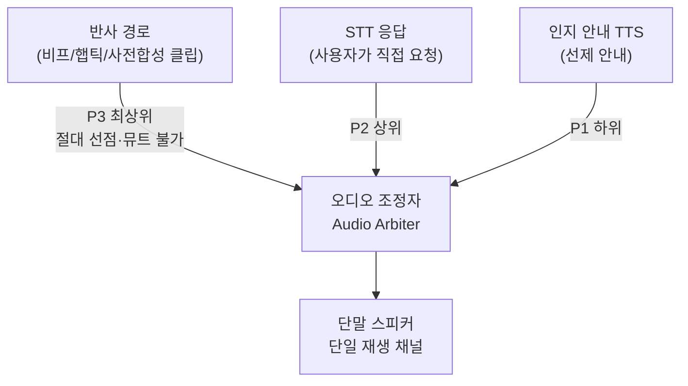
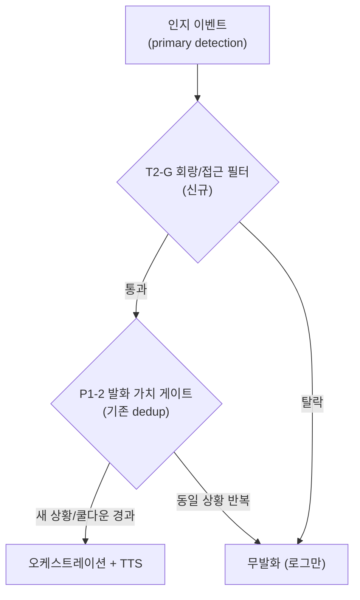
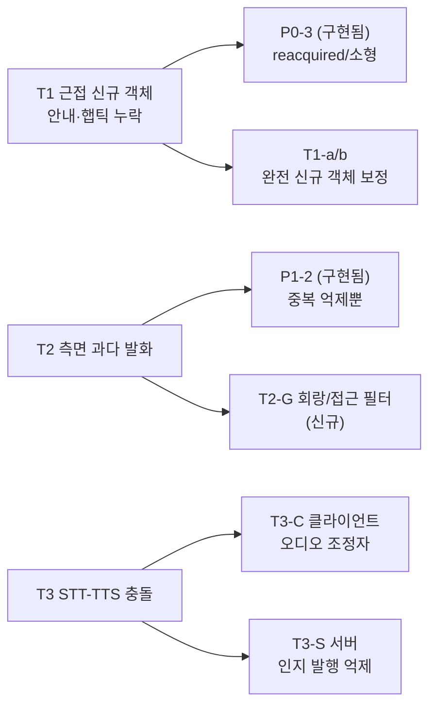

# 실사용 필드 테스트 2차 피드백 기반 개선 구현 계획서

> **작성일**: 2026-07-17
> **버전**: v1.1 (2026-07-17 현행 코드 재검증 정정: 1차 계획 S1~S8이 이미 구현·병합됨(commit `64c0ba4`~`97cc330`, M1~M7)을 반영. 구현된 P1-2가 "회랑/방향 필터"가 아닌 "동일상황 중복 억제(서명 기반)"로 구현되어 T2가 실제 미해소임을 정정. suppressor/reflex_gate 최신 상수로 코드 근거 갱신)
> **선행 문서**: [`field_test_improvement_plan.md`](./field_test_improvement_plan.md) (1차 피드백 계획, S1~S8, **구현 완료**), [`outdoor_guidance_refinement_roadmap.md`](./outdoor_guidance_refinement_roadmap.md) (Phase 1~3), [`../design/reflex_audio_specification.md`](../design/reflex_audio_specification.md), [`../design/architecture.md`](../design/architecture.md)
> **적용 원칙**: 이중 경로 물리 분리(반사 경로 = LLM/RAG/실시간 TTS 미경유, 사전합성 클립·비프·햅틱만)는 본 계획의 모든 과제에서 비협상 원칙으로 유지합니다. 특히 **T3 오디오 우선순위 정책에서도 반사 경로는 어떤 경우에도 뮤트·지연되지 않습니다.**

---

## 1. 배경 및 2차 피드백 요약

1차 필드 테스트 피드백(S1~S8, [`field_test_improvement_plan.md`](./field_test_improvement_plan.md))에 대한 개선은 이미 구현·병합되었습니다(M1~M7: 반사 억제 재무장 P0-1, 큐 최신성 P0-2, 소형 객체·Approach-Lost P0-3, 발화 가치 게이트 P1-2, 반사 후속 avoidance P1-1, 계단 실측·재학습 P2-1, 지연 관측 P2-2). 본 2차 계획은 **그 구현된 코드 위에서** 남은 gap과 신규 이슈를 다룹니다.

| ID | 증상 | 관련 경로 | 1차 구현과의 관계 |
| :--- | :--- | :--- | :--- |
| **T1** | 멀리서 탐지된 객체는 접근 시 안내(12시 방향 주의)·근접 햅틱이 잘 동작하나, **가까이서 갑자기 잡힌 객체는 안내 자체가 안 나옴** | 반사 + 인지 | P0-3(reacquired/소형)로 **부분 개선**, 그러나 완전 신규 객체는 잔존 gap |
| **T2** | 12시가 아닌 안전한 경로에서도 "9시 방향 사람 주의" 같은 불필요한 안내 발화 | 인지 | **미해소.** 구현된 P1-2는 중복 억제(dedup)일 뿐 방향/회랑 필터가 아님 |
| **T3** | **화면 탭 STT 음성 응답과 객체 탐지 TTS 안내의 우선순위가 없어 서로 충돌** | 인지 + STT | **신규 이슈** (1차 계획 미포함) |

핵심 정정: 2차 피드백 T2는 1차 P1-2로 해소됐을 것으로 기대했으나, **실제 구현된 P1-2는 "동일 상황 반복 억제"(서명 기반 dedup)**여서 측면·안전 경로 객체의 **첫 발화 자체는 막지 못합니다**(§2.2). T2는 신규 필터가 필요합니다.

---

## 2. 증상별 근본 원인 분석 (현행 코드 근거)

### 2.1 T1: 근접 신규 객체의 안내·햅틱 동시 누락

멀리서 탐지된 객체는 먼 구간에서 다수 프레임 누적되어 hit_count가 충분히 쌓인 채 중앙·근접에 진입하므로 정상 동작합니다. 근접에서 갑자기 잡힌 **완전 신규(track_id가 처음 생성된)** 객체는 아래 필터에 걸립니다.

| 원인 | 코드 근거 (현행) | 설명 |
| :--- | :--- | :--- |
| **hit_count<4 선필터가 반사·인지 공통 관문** | `server/detection/detection_pipeline.py:150` (`if det.track_id is not None and det.hit_count < 4: continue`) | 이 필터가 게이트·인지 분기보다 앞서 실행되므로, 완전 신규 트랙은 4프레임 누적 전까지 **반사(햅틱)도 인지(안내 문장)도 후보에서 제외**됩니다. 근접 고속 접근 객체는 이 4프레임을 채우기 전에 시야를 벗어납니다. |
| **P0-3 우회는 재획득 트랙 한정** | `server/detection/gates/reflex_gate.py:94` (`if not detection.reacquired and detection.hit_count < MIN_HIT_COUNT`) | P0-3의 `reacquired` 즉시 발동 우회는 "추적되다 가려진 뒤 재등장"한 트랙만 대상입니다. **한 번도 추적된 적 없는 신규 객체는 reacquired=False**라 여전히 MIN_HIT_COUNT(3)과 선필터(4)를 모두 통과해야 합니다. |
| **인지 쿨다운 8초** | `server/detection/consumer.py:110` (`_min_guide_cooldown_sec = 8.0`) | 직전 안내가 8초 내 있었으면, 새로 등장한 중요 객체(중앙·접근)의 "12시 방향 주의"도 침묵할 수 있습니다. |
| **접근 속도 미반영** | `server/detection/bytetrack_tracker.py` `_compute_motion`(`approaching` 산출은 존재), 선필터·게이트 진입 조건에 미사용 | approaching 상태를 계산하지만 hit_count 완화·우선 처리에 활용하지 않아, "빠르게 다가오는 신규 위험"과 "느린 정적 객체"를 동일 취급합니다. |

### 2.2 T2: 측면·안전 경로 과다 발화 (P1-2 미해소 확인)

| 원인 | 코드 근거 (현행) | 설명 |
| :--- | :--- | :--- |
| **구현된 P1-2 = 중복 억제(dedup)일 뿐** | `server/detection/consumer.py:157` `_has_utterance_value`, `:143` `_compute_cognitive_signature` | 실제 발화 가치 게이트는 서명(`정렬된 객체 클래스 + 정렬된 표면 클래스 + 이탈 여부`)이 **직전과 다르면 즉시 발화**합니다. 즉 "9시 방향 사람"이 처음 등장하면(새 서명) 그대로 발화하고, 객체 조합이 바뀔 때마다 재발화합니다. **방향(9시/3시)·회랑(12시) 침범·접근 여부를 보는 필터가 없습니다.** |
| **회랑/거리 필터 부재** | `server/detection/consumer.py` `_send_cognitive_guide` 진입부(발화 가치 게이트 외 방향 조건 없음), `primary_det = max(..., key=confidence)` | 인지 경로가 primary를 신뢰도 최대값으로만 고르고, 그 객체가 12시 충돌 회랑 밖 측면 정적 객체여도 발화 대상이 됩니다. |

정리: 1차 P1-2는 **동일 상황 반복 스팸**을 줄였을 뿐, **애초에 발화할 가치가 없는 측면·원거리·정적 객체를 걸러내지 못합니다.** T2는 이 필터(회랑+접근 기준)를 신규로 추가해야 합니다.

### 2.3 T3: STT 응답 - 인지 TTS 충돌 (신규)

현재도 완화 장치가 일부 존재하나(아래), **시간 추정 기반 단방향 뮤트**여서 근본적으로 경쟁 상태를 제거하지 못합니다.

| 원인 | 코드 근거 (현행) | 설명 |
| :--- | :--- | :--- |
| **명시적 우선순위 부재 (핵심)** | `client/src/services/audioEngine.ts` (`playGuideAudioBytes`, `speakFallback`, `playReflexClip`, `playBeep`가 각자 개별 선점·덕킹) | STT 응답과 인지 안내가 **동일한 `guideWarmPlayer` 채널·동일한 `playGuideAudioBytes` 경로**를 공유하며, 오디오 엔진 수준에서 둘을 구분하지 못합니다. 통합 우선순위 모델 없이 각 메서드가 제각각 `stopGuideAudio()`를 호출합니다. |
| **뮤트가 시간 추정 기반** | `client/src/hooks/useWebSocket.ts:363-367` (`setSttInteractionActive(true, estimatedMs + 1200)`), 코드 주석이 `duration_ms` 부정확성을 자인 | STT 응답 재생 구간 동안 인지 경로를 뮤트하되, 해제 시점을 **서버 `duration_ms` 또는 텍스트 길이 추정**으로 잡습니다. 추정이 짧으면 STT 답변 중 인지 안내가 끼어들어 답변을 끊고, 길면 인지 안내가 과도하게 지연됩니다. |
| **서버가 STT 상태를 모름** | `server/detection/consumer.py` `_send_cognitive_guide` vs `server/api/ws_router.py:165` `_handle_stt_audio`(별도 태스크) | 인지 가이드 발행 주체(DetectionConsumer)는 해당 device가 STT 상호작용 중인지 알지 못해, STT 처리 중에도 오케스트레이션+TTS를 계속 생성·전송합니다(연산 낭비 + 경쟁 창 상존). |
| **STT 락과 인지 경로 무연동** | `server/api/ws_router.py:156` `_stt_locks`(STT끼리만 직렬화) | STT 요청끼리는 device별 직렬화되지만 인지 경로 발화와는 상호 배제되지 않습니다. |

정리: **T3의 근본 원인은 "반사 > STT 응답 > 인지 안내" 우선순위를 강제하는 통합 조정자(arbiter)의 부재**입니다. 현재는 클라이언트 단독의 시간 추정 뮤트 하나로 버티고 있어 경쟁 상태가 남습니다.

---

## 3. 개선 과제 총괄 및 우선순위

| 과제 ID | 대상 | 요약 | 우선순위 | 협업 구분 |
| :--- | :--- | :--- | :--- | :--- |
| **T3-C** | T3 | 클라이언트 오디오 우선순위 조정자 + 결정론적 상태 해제 | **P0** | 우선순위 정책 = 하드코딩, 콜백 배선 = 바이브코딩 |
| **T3-S** | T3 | 서버 STT 활성 중 인지 발행 억제 게이트 | P1 | 억제 규칙 = 하드코딩, 레지스트리 = 바이브코딩 |
| **T2-G** | T2 | 인지 발화 회랑/접근 필터 (구현된 dedup 게이트 앞단에 추가) | **P0** | 판정 규칙 = 하드코딩, 진입부 연결 = 바이브코딩 |
| **T1-a/b** | T1 | 접근 신규 객체 선필터 완화 + 신규 고관련 객체 쿨다운 예외 | P1 | 판정 규칙 = 하드코딩 |

우선순위 근거: T3-C(충돌 즉시 체감 해소)와 T2-G(청각 피로 직결, 현재 미해소)를 P0로 둡니다.

---

## 4. T3 상세 설계: 통합 오디오 우선순위 조정자 (신규)

### 4.1 목표 우선순위 모델



| 우선순위 | 소스 | 정책 |
| :--- | :--- | :--- |
| **P3 (최상위)** | 반사 비프·햅틱·사전합성 클립 | 안전 비협상. 항상 즉시 재생, 어떤 하위도 막지 못함. 하위를 선점(기존 `playReflexClip`/`playBeep` 선점 유지) |
| **P2** | STT 응답(사용자 명시 요청) | 인지 안내를 선점·차단. 반사에만 양보 |
| **P1 (하위)** | 인지 안내 TTS(선제) | P2·P3 활성 중이면 **드롭**(지연 재생 아님 - 실시간성 상실한 안내는 무가치) |

핵심 원칙: **STT는 사용자가 방금 요청한 답이므로 선제 안내보다 높다. 단 반사(안전)보다는 낮다.**

### 4.2 클라이언트: 오디오 조정자 + 결정론적 상태기계

**(1) audioEngine 우선순위 게이트 도입**

```text
// audioEngine 내부 상태
activeGuidePriority: 0(idle) | 1(cognitive) | 2(stt)   // 반사 클립은 별도 최상위 경로 유지

requestGuidePlayback(priority, playFn):
  if priority >= activeGuidePriority:   // 같거나 높으면 선점
     stopGuideAudio(); activeGuidePriority = priority; playFn()
  else:                                  // 낮으면 드롭
     log("낮은 우선순위 안내 드롭"); return
// didJustFinish/onDone 콜백에서 activeGuidePriority = 0 으로 결정론적 해제
```

- `playGuideAudioBytes`·`speakFallback`에 `priority` 인자 추가. STT 응답은 `2`, 인지 안내는 `1`로 호출.
- 인지 안내가 STT 응답 재생 중 도착하면 **오디오 엔진 자체가 드롭**(외부 뮤트 플래그 의존 제거).
- 반사 클립(`playReflexClip`)은 기존대로 P3로 guide를 선점(안전 우선) - 변경 없음.

**(2) 시간 추정 뮤트 → 결정론적 상태 해제로 대체**

| 현재 | 변경 |
| :--- | :--- |
| `setSttInteractionActive(true, estimatedMs + 1200)` 타이머로 해제 | STT 응답 오디오의 실제 `didJustFinish`(바이너리)/`onDone`(speakFallback) 콜백에서 해제. 타이머는 **안전 상한(백스톱)**으로만 유지(응답 유실 대비) |
| 해제 시점 불확실 → 충돌/과지연 | 재생 종료 = 상태 해제가 1:1 대응 |

- `useWebSocket.ts`의 `pendingGuideIsCognitiveRef`·`sttInteractionActiveRef` 판단을 audioEngine `activeGuidePriority`로 이관해 단일 진실 소스화. WS 계층은 우선순위만 전달.

**(3) 수정 파일**: `client/src/services/audioEngine.ts`(우선순위 게이트·결정론 해제), `client/src/hooks/useWebSocket.ts`(priority 전달), `client/src/components/CameraView.tsx`(STT press 시 우선순위 연동)

### 4.3 서버: STT 상호작용 중 인지 발행 억제

클라이언트 조정자만으로도 충돌은 사라지지만, **서버가 STT 중 인지 오디오를 아예 만들지 않으면** 경쟁 창·연산 낭비까지 제거됩니다. 기존 `_stt_locks`·`_last_guide_ts` 패턴과 동일하게 게이트를 추가합니다.

| 항목 | 내용 |
| :--- | :--- |
| STT 활성 마킹 | `_handle_stt_audio`(`ws_router.py:165`) 진입 시 `stt_active[device_id] = now` 설정, 응답 전송 완료 후 예상 재생시간 + 마진까지 유지(안전 TTL 포함) |
| 인지 발행 억제 | `_send_cognitive_guide` 진입부에 "해당 device가 stt_active면 조기 반환" 추가(기존 발화 가치 게이트 조기 반환과 동일 위치) |
| 반사 예외 | `_send_reflex_alert`는 이 게이트를 **적용하지 않음**(반사 비협상). 상태 저장소만 공유하고 반사는 무조건 통과 |
| 공유 상태 | consumer와 ws_router가 공유해야 하므로 `server/api/session_manager.py` 또는 신규 경량 모듈에 `stt_activity` 레지스트리 배치(Redis TTL 활용 - 기존 컨텍스트 TTL과 정합) |

- **수정 파일**: `server/api/ws_router.py`(마킹), `server/detection/consumer.py`(억제 게이트), `server/api/session_manager.py` 또는 신규 `server/api/interaction_state.py`
- **유의**: 서버 억제는 최적화·이중 방어이며, **정확성 1차 책임은 클라이언트 조정자(4.2)**에 둡니다. 서버 상태가 유실돼도 클라이언트가 충돌을 막습니다.

### 4.4 반사 클립 vs STT 응답

반사 클립(P3)이 STT 응답(P2) 재생 중 발동하면 안전 원칙상 반사가 선점합니다(현행 유지). 사용자가 답을 놓치지 않도록:

- 긴급(beep_interval<=100)은 애초에 클립 없이 비프·햅틱만이므로(현행 `useWebSocket.ts`의 `isUrgentBeepOnly` 분기) STT 답변 오디오와 물리 채널이 겹치지 않습니다(비프=panPlayer, STT=guidePlayer 별도).
- 여유 단계 반사 클립이 STT 답변을 선점한 경우의 답변 재개는 **과설계 리스크**가 있어 MVP 범위에서 제외하고 후속 검토합니다.

---

## 5. T2 상세 설계: 인지 발화 회랑/접근 필터 (신규)

구현된 발화 가치 게이트(`_has_utterance_value`, dedup)는 **유지**하고, 그 **앞단**에 회랑/접근 필터를 추가합니다. "발화할 가치가 있는가"(방향·접근)를 먼저 판정하고, 통과한 것만 dedup 게이트로 넘깁니다.



| 규칙 | 내용 | 대상 |
| :--- | :--- | :--- |
| 회랑 필터 | primary가 `FRONT_BAND`(12시 회랑, `server/detection/direction.py`) 밖 + `approaching` 아님 → 무발화 | "9시/3시 방향 사람" 등 측면 정적 객체 |
| 거리 필터 | `far` + 정적(`direction != "approaching"`) → 무발화 | 원거리 정적 객체 반복 안내 |
| low 내레이션 종료 | `risk_hint == "low"` 순수 내레이션은 `GUIDE_LOW_RISK_NARRATION`(기본 false)일 때만 발화. 보도 이탈 확정·유의미 노면(caution/roadway/braille_normal)은 기존대로 발화 유지 | 저위험 객체 배경 잡음 |

- **수정 파일**: `server/detection/consumer.py`(`_send_cognitive_guide` 진입부에 필터 함수 호출), `docs/ops/environment_variables.md`(`GUIDE_LOW_RISK_NARRATION`)
- **하드코딩 영역(담당자 직접)**: `is_speech_worthy(primary_det, direction, distance, risk, is_departing)` 판정 함수(약 20줄). "측면 정적 객체는 흰지팡이·주변 소리로 인지 가능하므로 음성 안내 가치가 낮고, 12시 접근 객체만 안내한다"는 설계 의도를 `# [면접 대비 주석]`으로 첨부합니다.
- **주의**: 안전 관련 경로(보도 이탈, caution/roadway 노면, 접근 객체)는 절대 이 필터로 막지 않습니다. 필터는 "측면·원거리·정적 저위험"만 대상으로 보수적으로 적용합니다.

---

## 6. T1 상세 설계: 근접 신규 객체 대칭 보정

P0-3(reacquired/소형 하단)로 **재획득·소형** 객체는 개선됐으므로, 남은 **완전 신규(브랜드-뉴) 근접 객체**를 접근성 기준으로 보정합니다.

| 과제 | 내용 | 수정 파일 |
| :--- | :--- | :--- |
| **T1-a 접근 객체 선필터 완화** | `detection_pipeline.py:150` 선필터를 "정적 객체는 4, `direction=="approaching"` 객체는 2"로 분기. 빠르게 다가오는 신규 위험을 조기 통과, 정적 오탐 필터링은 유지 | `server/detection/detection_pipeline.py` |
| **T1-b 신규 고관련 객체 쿨다운 예외** | `_send_cognitive_guide` 진입 쿨다운(8초)에 예외: primary가 12시 회랑 + approaching + near/medium이면 최소 간격을 3초 수준으로 단축 | `server/detection/consumer.py` |

- **하드코딩 영역(담당자 직접)**: T1-a 분기 조건(약 10~15줄). "먼 객체는 누적으로 안전 확보, 근접 신규 객체는 접근성으로 조기 통과"라는 비대칭 설계 의도를 주석으로 첨부합니다.
- **유의**: reflex_gate의 `MIN_HIT_COUNT=3`은 오탐 방어 최후 보루이므로 유지하되, 선필터(4)만 approaching에 한해 완화합니다. T1-a는 T2-G 필터와 **같은 릴리스로 배포**해 완화로 인한 오탐 증가를 상쇄합니다.

---

## 7. 검증 계획

| 과제 | 단위 테스트 | 시나리오/필드 검증 | KPI |
| :--- | :--- | :--- | :--- |
| T3-C | 신규 `client` 테스트(audioEngine 우선순위 게이트): STT 재생 중 cognitive 드롭, 반사 클립 선점, 종료 콜백 해제 | STT 질문 직후 객체 탐지 유발 → 답변 미절단 청취 | STT 답변 재생 중 인지 안내 끼어듦 0건 |
| T3-S | `tests/`(consumer STT 억제): stt_active 중 `_send_cognitive_guide` 조기 반환, 반사 통과 | STT 처리 중 서버 로그로 인지 발행 억제 확인 | STT 처리 구간 인지 오케스트레이션 호출 0건 |
| T2-G | 신규 `tests/`(회랑/접근 필터): 측면 far 무발화, 12시 접근 발화, 노면·이탈 예외 유지 | 10분 보행 발화 로그 | 측면·원거리 무의미 발화 0건, 분당 발화 3건 이하 |
| T1 | `tests/test_detection.py` 확장: approaching 객체 선필터 2 통과, 정적 4 유지 | 근접 신규 객체(소화전·사람) 갑작스런 등장 실측 | 근접 신규 객체 안내+햅틱 발동률 80%+ (현재 낮음) |

공통: 커밋 전 `ruff format . ; ruff check --fix .`, 푸시 전 `mypy server/`, 클라이언트 `tsc --noEmit`. 반사 경로 임포트 금지(`server/detection/gates/`에서 오케스트레이션/RAG/TTS 미임포트) 및 **T3 우선순위 정책에서 반사 미뮤트** 준수를 코드 리뷰로 확인합니다.

---

## 8. 실행 순서 및 마일스톤

| 순서 | 과제 | 규모 | 선행 |
| :--- | :--- | :--- | :--- |
| N1 | T3-C (클라이언트 조정자) | 중 | 없음. 단독으로 T3 충돌 체감 해소 |
| N2 | T2-G (회랑/접근 필터) | 소~중 | 없음. 기존 dedup 게이트 앞단 추가 |
| N3 | T1-a/b (접근 신규 객체 보정) | 소~중 | N2 (과발화 상쇄 후 완화 적용) |
| N4 | T3-S (서버 억제 게이트) | 소~중 | N1 (클라이언트 정확성 확보 후 최적화) |

---

## 9. 리스크 및 완화

| 리스크 | 영향 | 완화 |
| :--- | :--- | :--- |
| T3-C가 반사까지 실수로 뮤트 | 안전 신호 손실(비협상 위반) | 반사 클립·비프·햅틱은 조정자 우선순위 게이트를 거치지 않는 별도 최상위 경로로 명시 분리. 코드 리뷰 필수 항목화 |
| 결정론 해제 콜백 미도착(재생 실패) | STT 상태 영구 잠금 | 기존 타이머를 안전 상한(백스톱)으로 유지해 콜백 유실 시 강제 해제 |
| T2-G가 위험 객체까지 침묵 | 안전 안내 누락 | 접근·노면·이탈은 필터 예외로 보존. "측면·원거리·정적 저위험"만 보수적으로 제거 |
| T1-a 완화로 오탐 증가 | 청각·촉각 피로 회귀 | T2-G와 동일 릴리스 배포, approaching 조건으로 정적 오탐은 필터 유지, MIN_HIT_COUNT 최후 보루 존치 |

---

## 10. 문서 동기화 범위

| 문서 | 갱신 내용 |
| :--- | :--- |
| [`../design/reflex_audio_specification.md`](../design/reflex_audio_specification.md) | 오디오 우선순위 모델(P3 반사 > P2 STT > P1 인지), 반사 미뮤트 명문화 |
| [`../design/architecture.md`](../design/architecture.md) | 오디오 조정자, STT 활성 레지스트리, 인지 발행 억제 게이트, 회랑/접근 필터 |
| [`../ops/environment_variables.md`](../ops/environment_variables.md) | `GUIDE_LOW_RISK_NARRATION`, STT 억제 TTL 관련 변수 |
| [`../ops/test_specification.md`](../ops/test_specification.md) | §7 KPI·테스트 추가 |
| [`field_test_improvement_plan.md`](./field_test_improvement_plan.md) | 본 2차 계획을 후속으로 상호 참조(T2는 P1-2 dedup의 한계 보완, T1은 P0-3 연장) |
| `docs/changelogs/[이니셜].md` | 과제 완료 시마다 엔트리 추가 |

---

## 11. 증상-과제 매핑 요약


