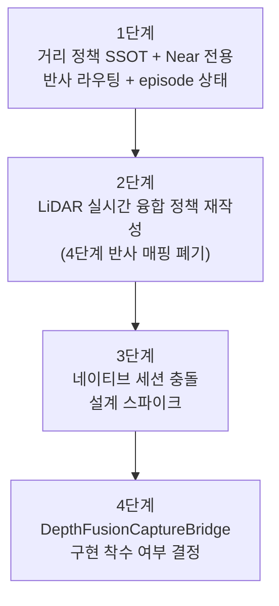

# LiDAR 실시간 융합 실행 순서 계획서

> **작성일**: 2026-07-18
> **버전**: v2.0.0 (2026-07-19: 1·2단계 구현 완료, 3단계 스파이크 완료, 4단계 보류로 확정 - §5·§6 갱신)
> **상태**: 1~4단계 전체 마감 (1·2단계 구현 완료, 3단계 스파이크 결론 확보, 4단계는 보류 결정으로 종결)
> **적용 범위**: 객체 거리 정책 정본화(SSOT), Near 전용 반사 라우팅, iOS LiDAR 실시간 bbox 융합의 착수 순서
> **선행 문서**: `HEURISTIC_DISTANCE_ALERT_ROUTING_IMPLEMENTATION_PLAN.md`(거리 구역·라우팅 정합성 감사, 정본은 아래 §5 참조), `LiDAR_distanceMeters.md`(iOS LiDAR 실시간 bbox 융합 작업 요청서, `docs/research/lidar_realtime_fusion_design_v2.md`로 대체됨)

---

## 1. 배경

두 개의 외부 문서를 정합성 검토한 결과, **서로 직접 충돌하는 지침**을 담고 있는 것으로 확인됐다.

| 문서 | 제안 내용 | 문제 |
| :--- | :--- | :--- |
| `HEURISTIC_DISTANCE_ALERT_ROUTING_IMPLEMENTATION_PLAN.md` | Near(약 0.7m 이내)만 반사(비프·햅틱), Medium/Far는 인지 경로 후보로 분리 | 현재 코드의 알림 피로 원인(면적비 4단계 전부 비프)을 정확히 진단하고 고치는 방향 |
| `LiDAR_distanceMeters.md` | `distanceMeters`(LiDAR 실측)를 `<=0.5m/1.0m/1.5m/3.0m` 4단계로 Critical/High/Mid/Low 반사에 매핑 | 위 계획서가 고치려는 "Medium/Far까지 반사 비프"를 LiDAR 기반으로 더 정밀하게 재구현하는 결과가 됨 |

또한 `LiDAR_distanceMeters.md`가 제안하는 `DepthFusionCaptureBridge.swift`(`AVCaptureVideoDataOutput`+`AVCaptureDepthDataOutput`+`AVCaptureDataOutputSynchronizer` 기반 실시간 video+depth 동기화)는, 기존 `DepthProbeBridge.swift`가 별도 `AVCaptureSession`을 쓰는 이유였던 **"vision-camera 세션과 후면 카메라를 동시에 점유할 수 없다"는 구조적 제약**을 언급하지 않고 있다. 이는 "helper 함수 단위 최소 변경"이 아니라 반사 경로 프레임 캡처 파이프라인(`ReflexFrameProcessorPlugin.swift`)까지 영향을 줄 수 있는 큰 작업이다.

두 문제를 동시에 풀려고 하면 정책 혼선과 네이티브 세션 충돌이 겹쳐 리스크가 커진다. 따라서 아래 순서로 분리 실행한다.

---

## 2. 실행 순서 총괄

| 단계 | 목표 | 선행 조건 | 산출물 | 상태 |
| :---: | :--- | :--- | :--- | :---: |
| **1** | `HEURISTIC_DISTANCE_ALERT_ROUTING_IMPLEMENTATION_PLAN.md`의 1~4단계 완료 | 없음 | 거리 정책 정본, Near 전용 반사, episode 상태기계, 클라이언트 4단계 로컬 비프 제거 | 완료 |
| **2** | LiDAR 실시간 융합 정책을 Near/Medium·Far 체계에 맞게 재작성 | 1단계 완료 | 4단계(Critical/High/Mid/Low) 반사 매핑 폐기, `distance_source=lidar` 값만 기존 정책에 결합하는 새 설계서 | 완료 |
| **3** | 네이티브 세션 충돌 여부 설계 검토(스파이크) | 1·2단계 완료 | vision-camera 세션과 depth 세션 동시 운용 가능 여부에 대한 기술 검토 문서, 팀 공유 | 완료 |
| **4** | 실제 `DepthFusionCaptureBridge.swift` 구현 착수 여부 결정 | 3단계 완료 | Go/No-go 판단, 착수 시 별도 구현 계획서 | 보류로 결정(No-go) |

---

## 3. 1단계 - 거리 정책 SSOT 및 Near 전용 반사 라우팅 (완료, 2026-07-18)

`HEURISTIC_DISTANCE_ALERT_ROUTING_IMPLEMENTATION_PLAN.md`의 §16 단계별 구현 순서 중 0~4단계에 해당한다. LiDAR 작업은 이 단계가 끝나기 전까지 착수하지 않는다.

> **완료 요약**: 순서 0(baseline)을 제외한 1~4가 구현 완료됐다(0은 실기기 현장 데이터 수집이 필요해 별도 검증 세션으로 남음). `server/detection/distance_policy.py`(SSOT), `bytetrack_tracker.py`(히스테리시스 상태), `detection_pipeline.py`(stream 불변식), `reflex_gate.py`(route 기반 축소), `tts/suppressor.py`+`consumer.py`(Near episode·reflex_clear), `CameraView.tsx`(Near 전용 로컬 폴백) 커밋 완료. 상세는 `docs/changelogs/kb.md` 2026-07-18 "거리 정책 SSOT 1단계" 엔트리 참조.

| 순서 | 작업 | 완료 기준 |
| :---: | :--- | :--- |
| 0 | 현재 로그 baseline과 LiDAR 샘플 확보 | 알림/분, TTS/분, 구역 분포, 중복률 baseline |
| 1 | 거리 정책 정본(SSOT)과 순수 함수 구현 | 서버·클라이언트가 같은 경계값·정책 버전 사용 |
| 2 | 서버 거리 평가와 stream 라우팅 적용 | Near 반사, Medium/Far 인지 후보, 안전 override 분리 |
| 3 | 반사 episode와 WebSocket clear 계약 구현 | `enter/update/exit`, source별 억제, 후속 인지 제한 |
| 4 | 클라이언트 Near 전용 폴백과 오디오 상태 구현 | `client/src/components/CameraView.tsx`의 면적비 0.20/0.08/0.03 4단계 로컬 반사 제거, Medium/Far 로컬 비프 0건 |

**이 단계가 끝나지 않은 상태에서 LiDAR 실거리 값을 반사 경로에 연결하지 않는다.** 정책이 흔들리는 상태에서 새 거리 소스(LiDAR)를 추가하면 어느 쪽 임곗값이 정본인지 다시 불명확해진다.

---

## 4. 2단계 - LiDAR 실시간 융합 정책 재작성 (완료, 2026-07-19)

1단계가 끝난 뒤에도 `LiDAR_distanceMeters.md`를 원문 그대로 구현하지 않는다. 아래 기준으로 다시 작성한다.

> **완료 요약**: `docs/research/lidar_realtime_fusion_design_v2.md`(§4.3 산출물) 작성 완료. `distance_policy.zone_from_lidar_meters()`(자문 전용, route 미관여)와 `lidar_distance_validation_samples.lidar_distance_zone` 컬럼·`scripts/analyze_lidar_validation.py` 구역 혼동 행렬을 구현했다. `mitos_improvement_roadmap.md` §2/§7도 함께 갱신.

### 4.1 폐기할 내용

| 원문 제안 | 폐기 사유 |
| :--- | :--- |
| `<=0.5m` Critical, `<=1.0m` High, `<=1.5m` Mid, `<=3.0m` Low 4단계 반사 매핑 | Near 전용 반사 원칙과 정면 충돌. 1단계에서 없앤 "Medium/Far도 비프"를 LiDAR로 재도입하게 됨 |
| Reflex Gate가 `distanceMeters` 유무로 판단 경로 자체를 분기 | 판단 정본이 area_ratio 기반 정책(1단계 산출물)에서 LiDAR 유무로 갈라져 이중 정본이 생김 |

### 4.2 유지·재설계할 내용

| 항목 | 재설계 방향 |
| :--- | :--- |
| `DetectionResult.distanceMeters` 등 4개 필드 | 이미 `client/src/inference/types.ts`에 선언되어 있으므로 타입 변경 불필요. 값을 실제로 채우는 로직만 신규 구현 |
| LiDAR 값의 역할 | 1단계 SSOT의 `route`(reflex/cognitive) 결정에는 관여하지 않고, `distance_source="lidar"`와 `estimated_distance_m`(더 정확한 값)만 기존 `area_ratio` 기반 `effective_distance_zone` 판정에 **보조 신호**로 결합 |
| bbox 내부 샘플링 정책(중앙 50%, 5x5~7x7 grid, 25 percentile, 유효 샘플 8개 미만이면 null) | 그대로 유지 - 이 부분은 계획서와 충돌하지 않는 순수 계측 로직 |
| UI 표시(`car 0.52m LiDAR (87%)`) | 유지 - 표시 형식은 라우팅 정책과 무관 |

### 4.3 산출물

- `LiDAR_distanceMeters.md`를 대체하는 신규 설계서 1건(가칭 `docs/research/lidar_realtime_fusion_design_v2.md`) - 1단계 정책 문서(`docs/design/risk_ssot_contract.md` 갱신본)를 인용해 `route` 결정에는 관여하지 않음을 명시
- `docs/research/mitos_improvement_roadmap.md` §2 거리 추정 항목을 신규 설계서 기준으로 갱신

---

## 5. 3단계 - 네이티브 세션 충돌 설계 스파이크 (완료, 2026-07-19)

`DepthFusionCaptureBridge.swift` 실제 구현 전에 별도 기술 검토를 먼저 수행했다.

| 검토 항목 | 확인할 내용 | 결과 |
| :--- | :--- | :--- |
| 세션 공존 가능성 | `AVCaptureVideoDataOutput`+`AVCaptureDepthDataOutput` 세션과 vision-camera(`useFrameProcessor`)의 세션이 동일 후면 카메라에서 동시 실행 가능한지, 아니면 vision-camera 세션 자체를 교체해야 하는지 | **불가능.** `client/node_modules/react-native-vision-camera`(v4.7.3) 소스 직접 확인 결과 `CameraSession.captureSession`(`ios/Core/CameraSession.swift:22`)과 `CameraView.cameraSession`(`ios/React/CameraView.swift:101`) 모두 접근제어자 없음(`internal`) - 모듈 밖에서 접근 불가. `ReflexFrameProcessorPlugin`이 상속하는 `FrameProcessorPlugin`(Objective-C)도 이미 캡처된 `Frame`만 콜백으로 받을 뿐 세션 구성 권한이 없음. 저위험 경로는 설계 판단이 아니라 Swift 접근제어자로 막힌 하드 제약임 |
| 영향 범위 | 세션 교체가 필요하다면 `ReflexFrameProcessorPlugin.swift` 등 반사 경로 프레임 캡처 전체가 영향받는지 | 영향받음. vision-camera의 세션 관리 전체(`CameraSession`, `CameraView`)를 대체하는 자체 구현이 필요하며, 프리뷰·줌·포커스·오리엔테이션 재구현 또는 포기가 수반됨 |
| 성능 영향 | depth 동기화 오버헤드가 반사 경로 목표 지연(<300ms, Detection 기준)을 침해하는지 | 세션 재작성 없이는 측정 불가(미실시). `DepthProbeBridge.swift` 자체가 "계측 전용이라 VGA 프리셋으로 전력/발열 최소화"를 명시하고 있어 상시 구동 시 별도 열/전력 검증 필요 |
| 대안 | 세션 공존이 불가능할 경우, "거리측정" 토글처럼 온디맨드 전환 방식을 유지할지, 아니면 실시간 융합 자체를 재검토할지 | **온디맨드 토글 유지로 확정**(§6, 사용자 확정 2026-07-19) |

상세 근거는 [`docs/research/lidar_realtime_fusion_design_v2.md`](lidar_realtime_fusion_design_v2.md) §5를 참조.

---

## 6. 4단계 - 구현 착수 여부 결정 (확정, 2026-07-19)

3단계 스파이크 결과 "세션 공존 불가"로 확인됐다.

| 스파이크 결과 | 진행 방향 |
| :--- | :--- |
| 세션 공존 가능, 성능 영향 낮음 | (해당 없음) |
| **세션 공존 불가, vision-camera 세션 교체 필요** | **채택.** 반사 경로 프레임 캡처 재설계를 포함한 대규모 작업으로 확인됨에 따라, `DepthFusionCaptureBridge.swift`는 별도 우선순위 결정 없이는 착수하지 않는다. 사용자가 온디맨드 토글 유지를 최종 결정(2026-07-19)해 4단계는 **보류**로 마감한다 |
| 성능 영향 과다 | (측정 전 세션 불가로 이미 결론) |

기존 `DepthProbeBridge.swift`(거리측정 버튼, vision-camera와 배타 실행)를 정본으로 유지하고, LiDAR 실측은 `distance_policy.zone_from_lidar_meters()`를 통해 온디맨드 검증 캡처의 자문(advisory) 신호로만 계속 활용한다(2단계 산출물, `docs/research/lidar_realtime_fusion_design_v2.md` §4).

---

## 7. 비목표

| 비목표 | 이유 |
| :--- | :--- |
| `LiDAR_distanceMeters.md` 원문의 4단계 반사 매핑 그대로 구현 | 1단계 Near 전용 반사 원칙과 충돌 |
| 1단계 완료 전 LiDAR 필드에 실측값 채우기 | 정책 정본이 확정되지 않은 상태에서 두 번째 거리 소스를 추가하면 혼선이 커짐 |
| 3단계 스파이크 없이 네이티브 브릿지부터 작성 | "helper 함수 추가" 수준으로 과소평가된 리스크를 그대로 안고 가게 됨 |

---

## 8. 참고 문서

| 문서 | 위치 |
| :--- | :--- |
| `HEURISTIC_DISTANCE_ALERT_ROUTING_IMPLEMENTATION_PLAN.md` | 이 문서 작성 시점 기준 저장소 미추적(`/Users/kwanbum/Downloads/`). 팀 정본으로 채택 시 `docs/design/` 또는 `docs/research/`로 이관 필요 |
| `LiDAR_distanceMeters.md` | 이 문서 작성 시점 기준 저장소 미추적(`/Users/kwanbum/Downloads/`). §4에서 대체될 예정이므로 원문 자체는 이관하지 않음 |
| `docs/research/mitos_improvement_roadmap.md` | §2 거리 추정 항목의 최신 상태 |
| `docs/design/risk_ssot_contract.md` | 거리·위험도 SSOT 계약 정본(1단계 산출물이 갱신 대상) |
| `docs/changelogs/kb.md` | 2026-07-18 LiDAR 검증 로깅 연결(검증 전용) 작업 이력 |
