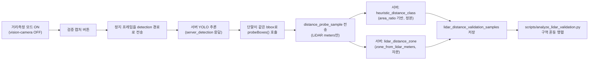

# LiDAR 실시간 융합 설계서 v2 (온디맨드 유지 결정)

> **작성일**: 2026-07-19
> **버전**: v2.0.0
> **상태**: 확정 (2단계 완료, 4단계 보류)
> **대체 대상**: `LiDAR_distanceMeters.md`(원 요청서, 저장소 미추적, `/Users/kwanbum/Downloads/`) - 본 문서가 정본이다.
> **선행 문서**: [`docs/research/lidar_fusion_sequencing_plan.md`](lidar_fusion_sequencing_plan.md) §4(2단계 실행 지시), [`docs/design/risk_ssot_contract.md`](../design/risk_ssot_contract.md) §2-C(거리 정책 SSOT 1단계)

---

## 1. 배경

원 요청서(`LiDAR_distanceMeters.md`)는 `distanceMeters`(LiDAR 실측)를 `<=0.5m/1.0m/1.5m/3.0m` 4단계로 Critical/High/Mid/Low 반사에 매핑하고, `DepthFusionCaptureBridge.swift`(상시 video+depth 동기화)로 실시간 융합을 구현할 것을 제안했다.

거리 정책 SSOT 1단계(`docs/research/lidar_fusion_sequencing_plan.md` §3)가 "일반 객체는 Near만 반사, Medium/Far는 인지"라는 불변식을 서버에 확정한 뒤, 이 문서는 그 불변식과 충돌하지 않도록 LiDAR의 역할을 재정의한다. 또한 네이티브 세션 충돌 스파이크(§5)를 실제로 수행해 실시간 융합의 기술적 실현 가능성을 검증했다.

**최종 결정**: 실시간 상시 융합(`DepthFusionCaptureBridge.swift`)은 보류하고, 기존 온디맨드 `거리측정` 토글(`DepthProbeBridge.swift`, vision-camera와 배타 실행)을 그대로 유지한다. 근거는 §5·§6 참조.

---

## 2. 폐기한 내용

| 원문 제안 | 폐기 사유 |
| :--- | :--- |
| `<=0.5m` Critical, `<=1.0m` High, `<=1.5m` Mid, `<=3.0m` Low 4단계 반사 매핑 | Near 전용 반사 원칙과 정면 충돌. 1단계에서 없앤 "Medium/Far도 비프"를 LiDAR로 재도입하게 됨 |
| Reflex Gate가 `distanceMeters` 유무로 판단 경로 자체를 분기 | 판단 정본이 area_ratio 기반 정책(`distance_policy.py`)에서 LiDAR 유무로 갈라져 이중 정본이 생김 - `reflex_gate.py`는 1단계에서 이미 `Detection.route`만 소비하도록 축소됨 |
| `DepthFusionCaptureBridge.swift`(상시 video+depth 동기화)를 즉시 구현 | §5 스파이크에서 vision-camera 세션 확장이 불가능함을 실측 확인. 세션 전체 재작성이 필요한 대규모 작업으로, "helper 함수 추가" 수준이라는 원 제안의 리스크 평가가 부정확했다 |

---

## 3. 유지·재설계한 내용

| 항목 | 상태 |
| :--- | :--- |
| `DetectionResult.distanceMeters`/`distanceSource`/`depthSampleCount`/`depthAccuracy` 등 4개 필드 | `client/src/types/detection.ts`에 이미 선언되어 있으므로 타입 변경 불필요. 온디맨드 검증 캡처(`거리측정` 모드)에서만 채워짐 |
| bbox 내부 샘플링 정책(중앙 50%, 7x7 grid, 25 percentile, 유효 샘플 8개 미만이면 null) | 그대로 유지 - `DepthProbeBridge.swift:probeBoxes()`. 순수 계측 로직이라 정책과 충돌하지 않음 |
| UI 표시(`car 0.52m LiDAR (87%)`) | 유지 - 표시 형식은 라우팅 정책과 무관 |
| 클라이언트 로컬 폴백에서 LiDAR 우선 사용 | 유지하되 범위 축소 - `CameraView.tsx`의 `applyLocalAreaReflex()`가 LiDAR 값이 있으면 area_ratio보다 우선 사용하는 구조는 유지하되, Near 경계(0.7m) 밖은 무출력으로 축소(1단계 커밋 `c3fd286` 참조) |

---

## 4. LiDAR의 역할: 실시간 라우팅 관여 없는 자문(advisory) 신호

### 4.1 서버 - 온디맨드 검증 캡처 전용

LiDAR 값은 서버의 반사/인지 실시간 라우팅(`server/detection/gates/reflex_gate.py`, `detection_pipeline.py`)에 **전혀 관여하지 않는다.** 관여하는 유일한 지점은 온디맨드 "거리측정 → 검증 캡처" 흐름이다.

`server/detection/distance_policy.py:zone_from_lidar_meters()`가 area_ratio 경계값(0.10/0.08/0.03/0.025)을 `heuristic_distance_m` 공식의 역산으로 미터 경계(약 0.696m/0.778m/1.270m/1.391m)로 변환해 LiDAR 실측을 같은 스케일의 구역으로 매핑한다. 상태(히스테리시스)가 없는 단발 캡처이므로 진입 경계만 사용한다.

`server/services/lidar_validation_service.py:persist_distance_probe_samples()`가 `heuristic_distance_class`(area_ratio 정본)와 `lidar_distance_zone`(LiDAR 자문)을 나란히 `lidar_distance_validation_samples` 테이블에 저장하고, `scripts/analyze_lidar_validation.py`가 둘의 혼동 행렬을 출력한다(원 계획서 §13.4 "구역 혼동 행렬" 요구사항 충족). 임곗값 해석과 정책 조정 여부는 담당자가 직접 판단한다 - 스크립트는 집계만 수행한다.

### 4.2 클라이언트 - 서버 연결 끊김 시 로컬 폴백에서만 사용

`CameraView.tsx`의 `applyLocalAreaReflex()`(서버 타임아웃 시에만 활성화되는 온디바이스 폴백)는 LiDAR 값이 있으면 area_ratio보다 우선 사용하되, Near 경계(`LOCAL_NEAR_LIDAR_METERS=0.7m`, `LOCAL_NEAR_CRITICAL_LIDAR_METERS=0.5m`) 밖은 무출력이다. 이 우선순위는 "거리측정" 모드가 아니라 평소 반사 프레임 처리 중 `resolveDetectionDistance()`가 온디바이스 탐지 결과에 LiDAR 필드가 채워져 있을 때만 동작하며, 현재 온디바이스 추론 경로에는 LiDAR 값이 채워지지 않으므로(§5 참조) 사실상 area_ratio 경로만 실행된다.

---

## 5. 네이티브 세션 충돌 스파이크 (완료, 2026-07-19)

### 5.1 조사 방법

`client/node_modules/react-native-vision-camera`(v4.7.3) Swift 소스를 직접 열람해 세션 소유권과 확장 가능 지점을 확인했다.

### 5.2 결론

| 확인 항목 | 결과 |
| :--- | :--- |
| `CameraSession.captureSession`(`ios/Core/CameraSession.swift:22`) | `let captureSession = AVCaptureSession()` - 접근제어자 없음(`internal`). VisionCamera 모듈 밖에서 접근 불가 |
| `CameraView.cameraSession`(`ios/React/CameraView.swift:101`) | `var cameraSession = CameraSession()` - 동일하게 `internal` |
| `ReflexFrameProcessorPlugin`이 상속하는 `FrameProcessorPlugin` | Objective-C 기반(`ios/FrameProcessors/FrameProcessorPlugin.h/.m`), 이미 캡처된 `Frame`을 콜백으로만 받음. 세션 구성 API 없음 |
| `VisionCameraProxyHolder` | 순수 JS 워클릿 호스트 브릿지. 카메라 세션과 무관 |

**"vision-camera가 이미 쓰는 세션에 depth output만 추가"하는 저위험 경로는 실현 불가능하다.** 이는 설계 판단이 아니라 Swift 접근제어자로 막힌 하드 제약이다.

### 5.3 영향 범위

세션을 실제로 공유하려면 vision-camera의 세션 관리(`CameraSession`, `CameraView` 전체)를 대체하는 자체 `AVCaptureSession` 구현이 필요하다. 이는 다음을 모두 포함하는 대규모 재작업이다.

- `ReflexFrameProcessorPlugin.swift`가 의존하는 프레임 캡처 파이프라인 전체 교체
- 카메라 프리뷰 렌더링, 줌/포커스/오리엔테이션 등 vision-camera가 현재 제공하는 기능의 재구현 또는 포기
- 반사 경로 목표 지연(p95 300ms, 이미 실측 검증됨)에 대한 회귀 위험

### 5.4 성능 영향

세션 재작성 없이는 측정 자체가 불가능하므로 미실시. `DepthProbeBridge.swift` 자체 주석이 이미 "계측 전용이므로 VGA 프리셋으로 충분(전력/발열 최소화)"라고 명시한 점을 볼 때, LiDAR 심도 캡처를 반사 fps(8~10fps)로 상시 구동하는 것은 별도의 열/전력 검증이 필요하다.

---

## 6. 4단계 결정: 보류

| 스파이크 결과 | 진행 방향 |
| :--- | :--- |
| 세션 공존 불가 (확인됨) | ~~반사 경로 재설계 포함 대규모 작업으로 재분류~~ → **온디맨드 토글 유지로 최종 결정** (사용자 확정, 2026-07-19) |

`DepthFusionCaptureBridge.swift`는 구현하지 않는다. 기존 `DepthProbeBridge.swift`(거리측정 버튼, vision-camera와 배타 실행)를 정본으로 유지하고, LiDAR는 §4의 온디맨드 검증·자문 역할로 한정한다.

---

## 7. 재검토 조건

아래 조건 중 하나가 충족되면 이 결정을 재검토한다.

| 조건 | 재검토 내용 |
| :--- | :--- |
| vision-camera가 향후 버전에서 세션 확장 공개 API를 제공 | §5 스파이크를 새 버전 기준으로 재실행 |
| 팀이 vision-camera를 포기하고 자체 카메라 파이프라인으로 전환하기로 별도 결정 | 4단계를 별도 우선순위 프로젝트로 재개 |
| `scripts/analyze_lidar_validation.py` 혼동 행렬에서 area_ratio 휴리스틱의 오분류율이 실사용에 위험한 수준으로 확인 | 온디맨드 자문 신호를 넘어선 보정 계수 적용(예: 클래스별 계수) 검토 - 세션 재작성 없이도 가능한 범위 우선 |

---

## 8. 참고 문서

| 문서 | 위치 |
| :--- | :--- |
| `docs/research/lidar_fusion_sequencing_plan.md` | 1~4단계 실행 순서 총괄, §6 최종 결정 반영 |
| `docs/design/risk_ssot_contract.md` | §2-C 거리 정책 SSOT(1단계 산출물) |
| `docs/research/mitos_improvement_roadmap.md` | §2 거리 추정 항목 최신 상태 |
| `server/detection/distance_policy.py` | `zone_from_lidar_meters()`, LiDAR 미터 경계 상수 |
| `LiDAR_distanceMeters.md` | 원 요청서(저장소 미추적). 본 문서로 대체됨 |
