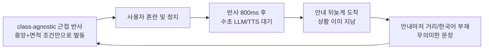
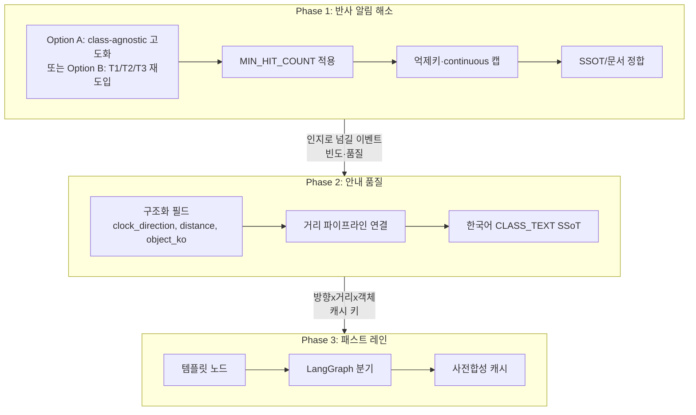
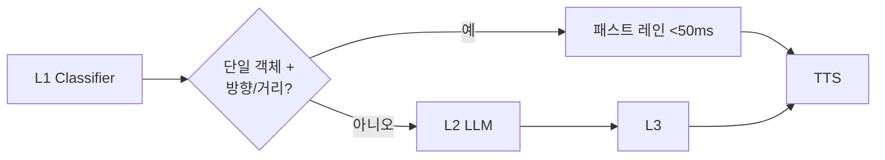

# 실외 테스트 기반 보행 안내 고도화 로드맵

> **작성일**: 2026-07-15
> **버전**: v1.1.2 (2026-07-16 Phase 3 패스트 레인 1차 구현: L1 분기·fast_lane·guide_clips 캐시)
> **작성자**: kb
> **근거**: 2026-07-15 실외 현장 테스트 + 코드 정적 분석. **v1.1은 2026-07-16 `dev`/`kb` 병합 후 코드와 교차 검증. Option A를 채택·1차 구현.**
> **코드 기준선**: Option A — `MIN_HIT_COUNT` 본문 적용, `MIN_AREA_RATIO=0.10`, `alert_id=high_obstacle`, haptic continuous 5s 캡
> **관련 문서**: [`risk_ssot_contract.md`](../design/risk_ssot_contract.md), [`mitos_improvement_roadmap.md`](mitos_improvement_roadmap.md), [`pipeline_stage_design.md`](../design/pipeline_stage_design.md), [`stage6_orchestration_design.md`](../stage-guides/stage6_orchestration_design.md)

### 개정 이력

| 버전 | 일자 | 내용 |
| --- | --- | --- |
| v1.0.0 | 2026-07-15 | 초안. 반사를 "29종 `HIGH_RISK_CLASSES` 전체 발동"으로 기술 |
| v1.1.0 | 2026-07-16 | dg2 병합 반영. Phase 1을 Option A/B로 분리 |
| **v1.1.1** | **2026-07-16** | **Option A 채택·1차 구현** (hit_count, 면적 0.10, 억제키 단순화, continuous 캡, SSOT §2-B) |
| **v1.1.2** | **2026-07-16** | **Phase 3 패스트 레인 1차 구현** (fast_lane 노드, LangGraph L1 분기, guide_clips TTS 캐시) |

---

## 1. 문제 정의

2026-07-15 실외 현장 테스트에서 세 가지 치명적 문제가 확인되었습니다. 이 세 문제는 개별 버그가 아니라 **하나의 설계 긴장(tension)에서 비롯된 연관 현상**으로, 서로를 악순환으로 연결합니다.

| 문제 | 사용자 체감 | 원인 수준 (v1.1) |
| --- | --- | --- |
| **반사 경로 과다 알림** | 시야에 물체만 있어도 햅틱·비프가 잦아 인지 부조화 | 클래스 무관 근접 게이트(완화 중: hit_count·면적·억제키 Option A 적용) |
| **LLM 레이턴시** | 안내가 뒤늦게 도착해 상황이 지난 뒤 음성 | 파이프라인 직렬(LLM→TTS) + 800ms sleep |
| **안내 메시지 품질** | 방향·거리·행동이 빠진 "주의" 문장 | `distance`/한국어 객체명 미주입 + 20자 제약 |

### 악순환 구조 (v1.1)



본 로드맵은 이 악순환을 끊기 위해 세 문제를 **하나의 통합 설계**로 접근합니다.

---

## 2. 분석 방법론

3개 영역(반사 게이트, 오케스트레이션, 안내 메시지)에 대해 코드 정적 분석을 수행하고, **문서-코드 정합성**을 교차 검증했습니다.

| 검증일 | 기준 | 결과 |
| --- | --- | --- |
| 2026-07-15 | v1.0 초안 작성 시점 코드 | 29종 클래스 반사 전제 |
| **2026-07-16** | dg2/`dev` 병합 후 `reflex_gate`·`CameraView` | **v1.0 Phase 1 전제 상당수 stale** → 본 개정 |

---

## 3. 문제 1: 반사 경로 과다 알림 (심층 분석, v1.1)

### 3.0 현재 게이트 실측 (필수 전제)

`reflex_gate.py` 본문은 **클래스명으로 분기하지 않습니다** (dg2 class-agnostic).

| 조건 | 현재 값 | 비고 |
| --- | --- | --- |
| confidence | `>= 0.35` | 클래스 신뢰도가 아닌 존재 신뢰도 |
| 가로 중앙 존 | `center_x_norm` in `[0.30, 0.70]` | 화면 중앙 40% |
| 면적 근접 | `area_ratio >= 0.08` | bbox/프레임 면적 |
| `alert_id` | `high_obstacle_{direction}` | 클래스 미포함 |
| `class_name` | 고정 `"obstacle"` | 클라이언트/억제키에 클래스 정보 없음 |
| `clip` | `reflex_clips/high_{direction}.wav` | 방향 클립 |
| `HIGH_RISK_CLASSES` dict | **파일에 잔존, 본문 미사용** | SSOT·주석·면접 주석과 코드 본문 괴리 |
| `MIN_HIT_COUNT = 3` | **정의만 있고 본문 미사용** | `head_level_gate`는 사용함 |

즉 "29종이 전부 반사에 들어간다"는 **v1.0 서술과 현재 실행 경로가 다릅니다.** 실외 과다 알림은 **클래스 폭이 아니라 지오메트릭 조건만으로 자주 통과하는 구조**에서 재발합니다(인도 상주 물체·원근 왜곡·면적 스파이크).

### 3.1 근본 원인 체인 (현 코드)

| # | 원인 | 코드 위치 | 심각도 | v1.0 대비 |
| --- | --- | --- | --- | --- |
| 1 | class-agnostic 근접 조건만으로 반사 → **클래스 기반 피로 제어 불가** | `reflex_gate.py` 본문 | 매우 높음 | **전제 교체** (29종 분기 → 지오메트리) |
| 2 | `MIN_HIT_COUNT=3` 정의만 있고 **본문 미사용** | `reflex_gate.py` | 높음 | 유지 |
| 3 | `HIGH_RISK_CLASSES`·`risk_ssot_contract`·면접 주석이 **미사용 dict와 계약** | `reflex_gate.py`, `risk_ssot_contract.md` | 높음 (문서 부채) | **신규** |
| 4 | 억제 키가 `high_obstacle_{direction}` → **방향 버킷만 바뀌어도 60초 쿨다운 우회** | `suppressor.py`, `reflex_gate.py` | 높음 | alert_id 형식 정정 |
| 5 | 반사 800ms 후 인지 LLM/TTS **연쇄 발화** | `consumer.py` (`asyncio.sleep(0.8)`) | 중간 | 유지 |
| 6 | continuous 햅틱이 `stopContinuous()` 전까지 반복 | `client/src/services/hapticEngine.ts` | 중간 | 경로 정정 |
| 7 | 단말-서버 이중 발화 | `CameraView.tsx` | **부분 완화됨** | 아래 3.4 |

### 3.2 SSOT·이력과의 긴장

`docs/design/risk_ssot_contract.md` §2는 여전히 **"29종은 서버 `HIGH_RISK_CLASSES`와 단말 `CLASS_MIN_CONFIDENCE`가 동일해야 한다"**고 하고, `tests/test_risk_ssot.py`가 이를 강제합니다. 그러나 **게이트 본문은 그 dict를 읽지 않습니다.**

| 시점 | 설계 | 실행 |
| --- | --- | --- |
| ~2026-07-14 | 29종 클래스 반사 + 지오메트릭 가드 | 클래스 분기 + bottom/center |
| **2026-07-16~** | 문서·dict는 29종 SSOT 유지 | **실행은 class-agnostic** |

고도화 Phase 1은 이 긴장을 **의도적으로 해소**해야 합니다(아래 §7 Option A vs B).

### 3.3 MIN_HIT_COUNT 미사용 결함

`reflex_gate.py`는 `MIN_HIT_COUNT = 3`을 정의하고 주석에 ByteTrack 연속 프레임을 서술하지만, **본문에서 `hit_count`를 검사하지 않습니다.** `head_level_gate.py`는 동일 상수를 정상 검사합니다.

결과적으로 1프레임 면적/중앙 스파이크도 즉시 비프/햅틱을 발동할 수 있습니다.

### 3.4 단말-서버 이중 발화 (부분 기구현)

v1.0은 "WS와 무관하게 항상 로컬 반사"로 기술했으나, **현재 `CameraView.tsx`는 서버 정상 연결 시 온디바이스 반사를 억제**합니다.

| 기구현 | 내용 |
| --- | --- |
| `isServerTimeout` | `wsStatus !== "connected"` 이거나 송신 후 응답 300ms 초과 시에만 로컬 경로 활성 |
| 4프레임 안정화 | `localReflexStreakRef >= 4` |
| 방향 3초 쿨다운 | `applyLocalAreaReflex`의 `lastLocalVoiceClipTs` (동일 방향 최소 3초) |

| 잔여 갭 | 내용 |
| --- | --- |
| architecture 포스트 D | 단말-서버 **우선순위 머지·통일 억제키**는 미완 (`architecture.md`) |
| continuous 캡 | 최대 지속 시간 자동 종료 미구현 |
| 서버측 방향 버킷 우회 | `high_obstacle_front` ↔ `front-left` 등 TTL 분리 |

즉 Phase 1의 "WS 게이트 신규"이 아니라 **억제키·continuous 캡·SSOT 정합**이 핵심입니다.

### 3.5 억제 키 우회 구조

`AlertSuppressor` 키: `suppress:{device_id}:{alert_id}`
현재 `alert_id`: `high_obstacle_{direction}` (`front` / `front-left` / `front-right`).

객체가 화면에서 미세 이동해 direction 버킷만 바뀌면 **별도 키로 60초 쿨다운이 우회**됩니다. 클래스 단위 억제는 `class_name="obstacle"` 고정이라 **의미 있는 클래스 억제가 불가**합니다.

---

## 4. 문제 2: LLM 레이턴시 (심층 분석)

### 4.1 종단 지연 체인 실측 추정

`docs/design/pipeline_stage_design.md` §4 기준과 `consumer.py`의 `latency_stages`를 종합한 추정입니다. (수치 자체는 2026-07-12 표본 기준이며, Phase 3에서 재측정)

| 단계 | 목표 | 실측 | 달성 여부 |
| --- | --- | --- | --- |
| 프레임 디코딩 | <50ms | 0.8ms | 달성 |
| **YOLO Detection 추론** | <80ms | **235~340ms** | **미달** |
| RAG 검색 | <50ms | 56~78ms | 근접 / 미달 |
| **L2 LLM ainvoke** | 미정 | **460ms~3.7s** | **편차 큼** |
| **실시간 TTS 합성** | 미정 | **0~2.0s** | **편차 큼** |

```
[최선 케이스]  ~750ms   디코딩 + YOLO + RAG + LLM(460ms) + TTS 캐시(0ms)
[최악 케이스]  ~6.1초   YOLO(340ms) + RAG + LLM 재시도(3.7s) + TTS 콜드(2.0s)
[추가 지연]    +800ms 고정 sleep + 보도이탈 히스테리시스 (DEPARTURE_CONFIRM_STREAK=3)
```

### 4.2 오케스트레이션 파이프라인 구조

| 노드 | 파일 | LLM | 지연 특성 |
| --- | --- | --- | --- |
| **L1** | `l1_classifier.py` | 없음 | `MID_RISK_CLASSES = set()` → 인지 객체 분류 사실상 공백 |
| **L2** | `l2_generator.py` | 1회(재시도 시 최대 2) | 주요 병목 460ms~3.7s |
| **L3** | `l3_validator.py` | 없음 | 길이/방향/한국어. 실패 시 L2 재진입 |
| **Fallback** | `fallback_node.py` | 없음 | 정적 문장 |

최악 시 LLM이 최대 3회 직렬 호출될 수 있습니다(L3 재진입 + OpenAI 폴백).

### 4.3 구조적 병목: LLM-TTS 비스트리밍

`_send_cognitive_guide`에서 `run_orchestrator` 완료 후 `synthesize_from_llm`을 **순차 await**. 첫 소리 = 전체 LLM + 전체 TTS 합.

### 4.4 의도적 추가 지연

| 지연 | 위치 | 의도 | 부작용 |
| --- | --- | --- | --- |
| **800ms sleep** | `consumer.py` | 반사 인지 시간 | 안내 지각 지연의 고정 가산 |
| **히스테리시스** | `DEPARTURE_CONFIRM_STREAK=3` | 세그 노이즈 방지 | 보도이탈 안내 1.5~3초 지연 |
| **TTS lock** | `tts_service.py` | 스레드 안전 | 반사+인지 동시 시 직렬화 |

### 4.5 LLM 클라이언트 타임아웃

| 클라이언트 | 타임아웃 | 비고 |
| --- | --- | --- |
| Ollama gemma4:e4b | 120s | CPU 지연 고려 |
| Gemini flash-lite | 10s | 기본 프로바이더 |
| OpenAI gpt-4o-mini | 10s | 폴백 |

`think=False`로 빈 content 재호출 루프는 완화된 상태입니다.

---

## 5. 문제 3: 안내 메시지 품질 (심층 분석)

### 5.1 안내에 필요한 정보 vs 현재 상태

| 정보 요소 | 현재 상태 | 비고 |
| --- | --- | --- |
| **방향(시계)** | 구현됨 | `estimate_clock_direction` → `orch_input["clock_direction"]` |
| **거리** | **인지 경로 누락** | `estimate_distance()` 존재, `OrchState`/`orch_input` 미연결. 반사는 `alert.distance` 전달 |
| **객체명(한국어)** | **영어 전달** | `CLASS_TEXT` 존재하나 L2 미사용 |
| **행동 지시** | 프롬프트·RAG 의존 | 장문/모호 지시 가능 |
| **20자 제한** | `MAX_LEN=20` | 거리 포함 시 L3 거절 빈발 |

### 5.2 거리 정보 누락

`server/orchestration/`에 `distance` 필드 없음. 반사 경로만 `"distance": alert.distance` 전송. 동일 탐지 정보가 인지에서 버려집니다.

### 5.3 영어 객체명

`detected_classes`에 영어 class_name 주입. `CLASS_TEXT`(`risk_rules.py`)와 `fallback_node.korean_names`에 한국어 매핑이 중복 존재하나 L2 경로 미사용.

### 5.4 20자 제한

구조화 필드 분리 없이 방향+거리+객체+행동을 한 문자열에 넣으면 L3가 거절합니다.

### 5.5 API 계약 비대칭

`reflex_alert`는 `direction`/`distance`/`class_name` 등 구조화 필드. `guide`는 `guidance_text` 단일 문자열 중심.

### 5.6 문서-코드 괴리 (v1.1 갱신)

| 문서 | 괴리 |
| --- | --- |
| `stage6_orchestration_design.md` | 구버전 프롬프트, `OrchState`에 distance 등 누락 |
| `llm-guidance-orchestrator/SKILL.md` | `MID_RISK_CLASSES` 비어 있지 않은 것처럼 기술하는 구간 잔존 가능 |
| `behavior_and_risk_insight.md` | 5종 고위험 이론 vs 실행 class-agnostic / 문서 29종 SSOT |
| **`risk_ssot_contract.md`** | **29종 dict 계약을 강제하나 게이트 본문은 미사용** |
| `architecture.md` 포스트 D | 단말 부분 억제는 있으나 통일 머지 미완 |

---

## 6. 고도화 방안: 3-Phase 통합 설계 (v1.1)



**채택 (2026-07-16)**: Phase 1은 **Option A** 로 진행. Option B는 실외 재테스트 후 A가 부족한 경우의 대안.

**Phase 2**는 Phase 1과 **병렬 착수 가능**.

---

## 7. Phase 1: 반사 알림 빈도 제어 + SSOT 정합

> **목표**: 실외 과다 알림 감소. 문서·코드·단말 계약을 한 축으로 맞춘다.
> **상태**: Option A **1차 구현 완료** (2026-07-16). 실외 재테스트로 임계 추가 튜닝 예정.

### 7.1 Option A (채택·구현됨): class-agnostic 고도화

| 항목 | 구현 전 | 구현 후 (v1.1.1) |
| --- | --- | --- |
| 발동 조건 | conf≥0.35 AND 중앙 40% AND 면적≥8% | + **`hit_count >= 3`**, 면적 **≥10%** |
| `alert_id` | `high_obstacle_{direction}` | **`high_obstacle`** (방향은 `direction`/`clip`만) |
| continuous 햅틱 | 무한 | **5초 캡** |
| `HIGH_RISK_CLASSES` | 미사용 dict | 단말 SSOT 참조용으로 명시, 본문 미사용 |
| SSOT | 29종만 | **§2-B** 서버 게이트 상수 추가 |

**장점**: 현 코드와 연속, 실외 튜닝이 빠름.
**단점**: 클래스별 정책 불가 → Phase 2·3 인지 품질에 더 의존. 잔여: bottom_y 가드 재도입은 실외 결과에 따라 검토.

### 7.2 Option B (대안): T1/T2/T3 클래스 재도입

v1.0 초안의 3계층을 **의도적으로 되돌리는** 경로입니다. **게이트 본문이 다시 클래스를 읽어야** 하며, SSOT·단말·회귀 테스트를 동시에 갱신합니다.

| Tier | 클래스 (예시) | 동작 |
| --- | --- | --- |
| **T1 즉시** | car, truck, bus, motorcycle, scooter, bicycle | 중앙/근접 + `MIN_HIT_COUNT=3` |
| **T2 근접** | bollard, pole, barricade, movable_signage, fire_hydrant | 더 엄격한 근접 + `MIN_HIT_COUNT=5` |
| **T3 인지** | 나머지 | 반사 미진입 → 인지/패스트 레인 |

`alert_id` 예: `t1_{class}` 또는 `t2_{class}` (방향 제외 권장).
`MID_RISK_CLASSES`에 T3를 명시해 L1이 인지 대상으로 받을 수 있게 합니다.

**장점**: 정적 객체 반사 0에 가까운 정책 가능, 면접/이론(5종 고위험)과 정렬 용이.
**단점**: class-agnostic 철회 + SSOT 전면 개정. dg2 의도(오탐·복잡도 감소)와 충돌 가능 → **팀 합의 필수**.

### 7.3 공통 필수 (A/B 공통)

| 작업 | 내용 |
| --- | --- |
| `MIN_HIT_COUNT` | `reflex_gate` 본문에 실제 검사 추가 |
| `AlertSuppressor` | 방향 버킷 우회 제거(방향 제외 키 또는 장치 단위 near-obstacle 키) |
| `hapticEngine` | continuous 최대 지속(예: 5초) 후 `stopContinuous()` |
| 단말 | 기존 `isServerTimeout` 유지. 포스트 D: 서버 `alert_id`와 단말 쿨다운 키 문서화·정렬 |
| 문서 | `risk_ssot_contract` / skill / `behavior_and_risk_insight`를 **선택한 Option에 맞게** 일괄 개정 |

### 7.4 Phase 1 수정 파일 목록

**Option A 기준:**

| 파일 | 변경 내용 |
| --- | --- |
| `server/detection/gates/reflex_gate.py` | `hit_count` 적용, 임계 튜닝, 억제용 `alert_id` 단순화, 미사용 dict 정리/역할 명시 |
| `server/tts/suppressor.py` | 키·TTL 정책 문서화(필요 시 장치+near 단위) |
| `client/src/services/hapticEngine.ts` | continuous 지속 캡 |
| `client/src/components/CameraView.tsx` | 서버/로컬 억제키 정렬(이미 있는 타임아웃 게이트는 유지) |
| `docs/design/risk_ssot_contract.md` | class-agnostic 실행 계약으로 §2 재작성 (dict≠게이트 분기) |
| `tests/test_risk_ssot.py` | 새 계약에 맞게 갱신 |
| `.agents/skills/yolo-obstacle-detection/SKILL.md` | class-agnostic + hit_count 설명 |
| `.claude/skills/yolo-obstacle-detection/SKILL.md` | 상동 수동 동기화 |

**Option B 추가:** `detection_pipeline.py`, `risk_rules.py`, 단말 `CLASS_MIN_CONFIDENCE`/`HIGH_HAZARDS` tier화, SSOT 3계층 표.

### 7.5 Phase 1 검증 기준

| 기준 | 측정 |
| --- | --- |
| 실외 정적 상주 구간 반사 횟수 유의미 감소 (목표: 체감 50%+ / Option B면 정적 클래스 0) | 시나리오 녹화 카운트 |
| T1 또는 near-obstacle 반사 레이턴시 <300ms 유지 | `latency_stages` |
| 서버 연결 시 단말 로컬 반사 미실행 (기존 게이트 회귀) | 실기기 로그 |
| 동일 근접 상황 60초 내 방향 버킷만으로 재발화 없음 | suppressor 로그 |
| SSOT 테스트 통과 | `tests/test_risk_ssot.py` |

---

## 8. Phase 2: 안내 메시지 품질 고도화

> **목표**: 방향·거리·한국어 객체명이 반영된 안내.
> **상태**: **1차 구현 완료** (2026-07-16). `consumer` → `OrchState` → L2/fallback → guide WS 구조화 필드 연결.

### 8.1 guide 구조화 필드

| 필드 | 타입 | 설명 |
| --- | --- | --- |
| `guidance_text` | string | 음성용 (객체+행동) |
| `clock_direction` | string | 예: `"10시"` |
| `distance` | string | `near` / `medium` / `far` |
| `object_ko` | string | 예: `"전동 킥보드"` |

Phase 3 캐시 키로 재사용합니다.

### 8.2 거리 파이프라인

```
estimate_distance(bbox, w, h, class_name)
  → orch_input["distance"]
  → OrchState.distance
  → L2 프롬프트 [탐지 거리]
```

`direction.py`의 `estimate_distance()` 재사용. 반사 경로의 미터 단위 `alert.distance`와 혼동하지 않도록 **인지는 near/medium/far 클래스**, 필요 시 별도 필드명(`distance_class`) 권장.

### 8.3 한국어 객체명 SSoT

| 작업 | 내용 |
| --- | --- |
| `consumer.py` | `CLASS_TEXT`로 변환 후 `detected_classes` / `object_ko` 주입 |
| `fallback_node.py` | `korean_names` 제거, `CLASS_TEXT` import |
| 반사 `class_name="obstacle"` | Option A 유지 시 인지는 **원본 detection.class_name**을 써야 함(게이트가 obstacle로 덮어써도 탐지 리스트는 클래스 유지) |

### 8.4 20자 제한

구조화 분리 후 `guidance_text`는 객체+행동 중심 → 20자 유지 가능. 방향/거리를 텍스트에 넣을 경우 `MAX_LEN` 25~30 상향.

### 8.5 Phase 2 수정 파일

| 파일 | 변경 |
| --- | --- |
| `docs/design/api_specification.md` | guide 구조화 필드 |
| `server/detection/consumer.py` | distance·한국어 주입 |
| `server/orchestration/state.py` | `distance` 필드 |
| `server/orchestration/nodes/l2_generator.py` | 거리 규칙 |
| `server/orchestration/nodes/fallback_node.py` | `CLASS_TEXT` 통합 |
| `client/src/hooks/useWebSocket.ts` | 구조화 필드 수신 |

---

## 9. Phase 3: 패스트 레인 (LLM 레이턴시 단축)

> **의존**: Phase 2 완료(캐시 키 = 방향×거리×객체).
> **상태**: **1차 구현 완료** (2026-07-16). L1 직후 분기, 템플릿 노드, `data/guide_clips/` 사전합성 캐시.

### 9.1 원칙

일상 단일 객체 안내는 템플릿(+사전합성 TTS). LLM은 다중/이탈/내비 융합 등 예외에만.



### 9.2 노드·분기

- 신규 `server/orchestration/nodes/fast_lane.py`
- `graph.py` L1 직후 분기: 단일 객체 + clock + distance → 패스트 레인; 다중/이탈/내비 → L2

### 9.3 사전합성 캐시

키: `{clock_direction}:{object_ko}:{distance}:{pattern}`
커버리지: 7방향 × 주요 객체(Option B면 T1+T2, Option A면 빈도 상위 N종) × 3거리.

### 9.4 효과 예측

| 경로 | 현재 | 패스트 레인 |
| --- | --- | --- |
| 일상 단일 객체 | ~750ms~6.1s | **<300ms** (캐시 히트 시) |
| 복합/예외 | 동일 | LLM 유지 |

### 9.5 수정 파일

`fast_lane.py`, `graph.py`, `consumer.py`, `realtime_tts.py`, `data/guide_clips/`, 오프라인 합성 스크립트.

---

## 10. 문서 동기화 범위

| 문서 | 내용 |
| --- | --- |
| `risk_ssot_contract.md` | Option A/B에 맞는 실행 계약 재작성 |
| `stage3_detection_design.md` | 게이트 실측(class-agnostic 또는 tier) |
| `stage6_orchestration_design.md` | distance, 패스트 레인 |
| `pipeline_stage_design.md` | 종단 지연 재측정 |
| `architecture.md` | 포스트 D 상태(부분 완료 / 잔여) |
| `api_specification.md` | guide 구조화 필드 |
| `behavior_and_risk_insight.md` | 이론 vs 실행 정합 |
| `.agents/skills/` + `.claude/skills/` | yolo / llm-guidance 수동 동기화 |
| `docs/changelogs/kb.md` | Phase별 엔트리 |

---

## 11. 리스크 및 완화

| 리스크 | 완화 |
| --- | --- |
| Option A만으로 정적 상주 알림이 덜 줄어듦 | 면적·hit_count·억제키 튜닝 후 실외 재측정. 부족 시 Option B 합의 |
| Option B가 dg2 class-agnostic 의과 충돌 | 설계 리뷰에서 A/B 명시적 선택 후 진행 |
| 억제키를 방향 제외로 바꾸면 측면 위험 재알림 지연 | near TTL을 짧게(예: 15~30s) 두거나 distance 밴드별 TTL |
| 서버 지연 시 단말 무반응 | 기존 `isServerTimeout`(300ms) 폴백 유지·회귀 테스트 |
| 패스트 레인 단조로움 | 복합은 LLM, 템플릿 패턴 복수 |
| SSOT 테스트 깨짐 | 계약·테스트·게이트를 같은 커밋에서 변경 |

---

## 12. 실행 순서 및 마일스톤

| 순서 | Phase | 산출물 | 검증 |
| --- | --- | --- | --- |
| 0 | **설계 합의** | Option A vs B 문서화 | 팀 합의 |
| 1 | **Phase 1** | hit_count·억제·SSOT·(선택) tier | 실외 반사 빈도 감소 |
| 2 | **Phase 2** (1과 병렬 가능) | distance·한국어·구조화 guide | 문장/필드 품질 |
| 3 | **Phase 3** | 패스트 레인·캐시 | 일상 안내 <300ms |

Phase 1 후 **실외 재테스트**로 Option 선택을 확정(또는 A→B 전환)한 뒤 Phase 3 캐시 커버리지를 고정합니다.

---

## 13. 참고 문서

| 문서 | 관련성 |
| --- | --- |
| [`risk_ssot_contract.md`](../design/risk_ssot_contract.md) | Phase 1 계약 갱신 대상 (현행 29종 vs 실행 class-agnostic 긴장) |
| [`mitos_improvement_roadmap.md`](mitos_improvement_roadmap.md) | 반사 억제 재설계와 스코프 겹침 |
| [`pipeline_stage_design.md`](../design/pipeline_stage_design.md) | 종단 지연 |
| [`stage6_orchestration_design.md`](../stage-guides/stage6_orchestration_design.md) | Phase 2-3 |
| [`architecture.md`](../design/architecture.md) | 포스트 D 디듀프 |
| [`behavior_and_risk_insight.md`](../design/behavior_and_risk_insight.md) | 위험도 이론 vs 실행 |

---

## 부록: v1.0 → v1.1 정정 요약

| v1.0 주장 | v1.1 정정 |
| --- | --- |
| 반사 = 29종 `HIGH_RISK_CLASSES` 분기 | 본문은 class-agnostic. dict는 미사용 잔존 |
| `alert_id = high_{class}_{direction}` | `high_obstacle_{direction}`, `class_name="obstacle"` |
| 단말 로컬 반사 항상 실행 | 서버 정상 시 억제 + 4프레임 + 방향 3초 쿨다운 |
| `client/src/audio/audioEngine.ts` | `client/src/services/audioEngine.ts` |
| Phase 1 = T1/T2/T3만 | **A(권장) / B(대안)** |
| Phase 2는 Phase 1 후만 | **병렬 가능** |
