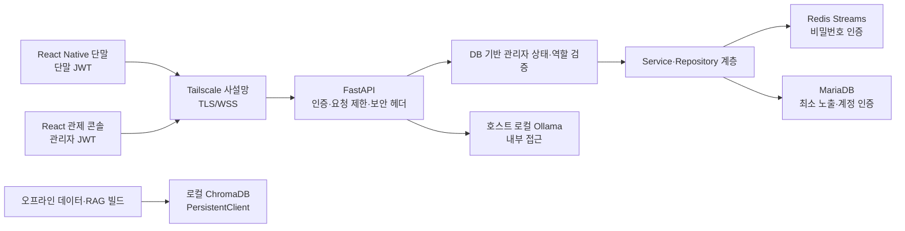

# Minchodan 보안 강화 및 팀 반영 가이드

> **작성일**: 2026-07-19
> **버전**: v1.0.0
> **상태**: 정적 구현·자동 검증 완료, 운영체제별 실장 서버·실기기 종단 검증 대기
> **기준 작업 트리**: 2026-07-19 보안 강화 작업, 커밋 전 워킹트리 기준
> **적용 범위**: FastAPI, 관리자·단말 인증, REST·SSE·WebSocket, STT 업로드, React 관제 콘솔, React Native iOS·Android, Docker, Redis, MariaDB, Python·npm 의존성, RTX 5090·macOS 실행 경로
> **비밀정보 정책**: 본 문서에는 실제 토큰, 비밀번호, API 키, 개인 IP, Tailscale 주소, 사용자 개인정보를 기록하지 않음

---

## 1. 문서 목적

이번 작업은 단일 취약 패키지만 제거한 수정이 아니라, 인증 기본값, 관리자 생성, 토큰 전달, WebSocket 세션, 파일 업로드, 공개 API, 모바일 네트워크 정책, 컨테이너 권한, 비밀값 생성, 의존성 감사와 GPU 호환성을 하나의 보안 기준선으로 정리한 전면 강화 작업이다.

이 문서는 다음 네 가지 질문에 답한다.

| 질문 | 이 문서가 제공하는 답 |
| :--- | :--- |
| 수정 전 무엇이 문제였는가 | 취약점과 잘못된 기본값을 위험 식별자로 분류하고 코드 경계를 설명한다. |
| 그대로 두면 어떤 문제가 생기는가 | 공격·오용·장애 시나리오와 영향을 연결한다. |
| 사전에 무엇을 고쳤는가 | 실제 구현 파일, 정책값, 제한값과 검증 근거를 기록한다. |
| 팀원은 무엇을 해야 하는가 | 병합 후 비밀값 생성, 관리자 초기화, JWT 발급, 앱 재빌드, 서비스 재기동과 검증 순서를 제시한다. |

---

## 2. 결론 요약

| 영역 | 수정 전 핵심 위험 | 현재 예방 조치 | 현재 판정 |
| :--- | :--- | :--- | :--- |
| **JWT 서명** | 약하거나 고정된 기본 키로 서버가 기동될 수 있음 | 모든 환경에서 32자 미만·금지 플레이스홀더를 거부하고 표준 클레임을 필수 검증 | **정적 구현 완료** |
| **관리자 생성** | 공개 등록 API를 통한 권한 계정 생성 가능성 | 1회용 부트스트랩과 최고관리자 전용 추가 등록으로 분리 | **정적 구현 완료** |
| **역할 기반 권한** | 토큰 존재만 확인하고 DB의 현재 상태·역할을 일관되게 확인하지 않음 | 활성 계정 재조회와 `operator`·`super_admin` 권한 의존성 적용 | **정적 구현 완료** |
| **단말 인증** | 공개 정적 토큰, 인증 전 세션 선점, 장기 토큰 위험 | 정적 토큰 기본 비활성화, 단말 JWT, 인증 후 세션 등록, 만료·클레임 검증 | **정적 구현 완료** |
| **토큰 전달** | URL 쿼리 토큰과 장기 브라우저 저장으로 로그·기록에 노출 | Authorization 헤더 또는 첫 WebSocket 인증 메시지, `sessionStorage` 사용 | **정적 구현 완료** |
| **요청 남용** | 로그인·부트스트랩·STT·토큰 발급 제한 부재 | 경로별 요청 제한, STT 크기·형식·동시성 제한 | **정적 구현 완료** |
| **공개 기능** | 문서·디버그·시뮬레이터·과도한 CORS·상세 헬스 정보 노출 | 운영 문서 비활성화, 명시적 기능 플래그, 권한 확인, 보안 헤더와 최소 CORS | **정적 구현 완료** |
| **ngrok** | 미사용 의존성과 전이 취약점, 오래된 외부 터널 설정 잔존 | 실행 의존성·바이너리·활성 설정을 제거하고 Tailscale 경로로 단일화 | **운영 경로 제거 완료** |
| **모바일** | 개인 주소·토큰 폴백, 평문 통신 허용, 백업·과도한 Android 권한 | 환경 변수 필수화, `wss` 기본, ATS·cleartext 차단, 백업·레거시 권한 축소 | **정적 구현 완료, 네이티브 재빌드 필요** |
| **컨테이너·데이터 계층** | 외부 바인딩, Redis 무인증, DB 약한 기본값, root 실행·과도한 쓰기 | loopback 바인딩, 필수 비밀번호, 비root, 읽기 전용 마운트, `no-new-privileges` | **설정 검증 완료** |
| **의존성·GPU** | 취약 버전과 XML 파서 위험, RTX 5090·3개 OS 기준 불일치 | 의존성 갱신, `defusedxml`, PyTorch 2.13·cu130·MPS/CPU 경로 분리 | **정적·macOS 로컬 검증 완료** |
| **잔여 위험** | ChromaDB 공개 취약점, 분산 제한·필드 암호화·개별 토큰 폐기 미구현 | 사용 경계를 제한하고 후속 과제로 명시 | **조건부 수용, 추적 필요** |

현재 결과는 “코드가 절대 안전하다”는 의미가 아니다. 현재 워킹트리의 보안 기준선과 자동 검증이 통과했다는 의미이며, 운영 배포 승인은 각 운영체제의 실장 서버와 모바일 실기기에서 종단 검증을 마친 뒤 내려야 한다.

---

## 3. 보호 대상과 신뢰 경계



| 보호 대상 | 주요 위협 | 적용 통제 |
| :--- | :--- | :--- |
| 관리자 계정과 권한 | 무단 계정 생성, 비활성 계정 재사용, 권한 상승 | 1회 부트스트랩, DB 상태 재검증, 역할 의존성, 비밀번호 정책 |
| 단말 세션 | 토큰 위조, 다른 단말 ID 사용, 인증 전 연결 선점 | 단말 전용 JWT 클레임, `device_id` 결합, 인증 후 세션 등록 |
| 음성·위치·탐지 데이터 | 과도한 업로드, 로그 유출, 무권한 조회·수정 | 인증, 역할 권한, 크기·동시성 제한, 민감 로그 제거 |
| 서버·DB·Redis | 외부 포트 노출, 무인증 접근, 컨테이너 권한 악용 | loopback 바인딩, 비밀번호 필수, 비root, 읽기 전용 마운트 |
| 모바일·콘솔 토큰 | URL·브라우저 기록·번들 유출 | 쿼리 토큰 제거, 세션 저장, 운영 정적 토큰 금지 |
| 공급망 | 취약 패키지, 변조된 XML, OS·GPU 불일치 | 감사 자동화, 버전 고정, `defusedxml`, OS별 PyTorch 분기 |

---

## 4. 수정 전 이슈와 예상 피해

### 4.1 인증·인가

| ID | 위험도 | 수정 전 이슈 | 발생 가능한 문제 | 대표 공격·장애 시나리오 |
| :--- | :---: | :--- | :--- | :--- |
| `SEC-AUTH-001` | **치명적** | JWT 서명 키가 미설정이거나 알려진 기본값이어도 개발 환경에서 허용될 여지가 있었음 | 공격자가 관리자·단말 토큰을 위조할 수 있음 | 저장소나 예시에서 기본 키를 알아낸 뒤 최고관리자 권한 토큰을 직접 생성함 |
| `SEC-AUTH-002` | **치명적** | 관리자 등록 경계가 최초 구축과 정상 운영으로 엄격히 분리되지 않음 | 외부 사용자가 권한 계정을 만들 수 있음 | 관리자 테이블 초기 상태를 노려 임의 계정을 먼저 등록함 |
| `SEC-AUTH-003` | **높음** | JWT 서명 유효성만 믿고 DB의 계정 활성 상태와 역할 변경을 즉시 반영하지 않는 경로가 있었음 | 정지된 관리자 토큰이 만료 전 계속 사용될 수 있음 | 퇴사·정지 처리된 계정이 기존 토큰으로 민감 API를 호출함 |
| `SEC-AUTH-004` | **높음** | 역할별 읽기·쓰기 권한이 일부 라우터에서 일관되게 강제되지 않음 | 일반 운영자가 최고관리자 기능을 수행할 수 있음 | 일반 관리자 토큰으로 관리자 생성, 디버그 기능 또는 민감 수정 API를 호출함 |
| `SEC-AUTH-005` | **높음** | 공개 정적 단말 토큰과 하드코딩 폴백을 사용할 수 있었음 | 앱 번들·저장소에서 토큰이 유출되어 임의 단말로 위장 가능 | 추출한 정적 토큰으로 탐지 WebSocket에 연결해 데이터 송수신을 가장함 |
| `SEC-AUTH-006` | **높음** | 인증 전 연결이 같은 `device_id`의 기존 세션을 대체할 가능성이 있었음 | 정상 단말 연결을 강제로 끊는 세션 선점·서비스 거부 | 공격자가 피해 단말 ID로 반복 연결해 정상 사용자의 세션을 축출함 |
| `SEC-AUTH-007` | **중간** | 비밀번호 길이·복잡도와 bcrypt 비용 기준이 충분히 명시적이지 않음 | 약한 비밀번호 추측과 해시 크래킹 위험 증가 | 유출된 해시를 대상으로 사전 대입 공격을 수행함 |

### 4.2 토큰 전달·브라우저 보관

| ID | 위험도 | 수정 전 이슈 | 발생 가능한 문제 | 대표 공격·장애 시나리오 |
| :--- | :---: | :--- | :--- | :--- |
| `SEC-TOKEN-001` | **높음** | SSE·WebSocket·이미지 요청에서 URL 쿼리 토큰을 사용할 수 있었음 | 프록시 로그, 브라우저 기록, 오류 리포트와 캡처 화면에 토큰이 남음 | 접근 로그의 전체 URL이 수집되어 장기 토큰이 운영자 외부로 노출됨 |
| `SEC-TOKEN-002` | **중간** | 관리자 JWT를 `localStorage`에 장기 보관 | 탭 종료 뒤에도 토큰이 남고 XSS 발생 시 탈취 범위가 커짐 | 공용 PC 사용 후 브라우저에 토큰이 남아 다음 사용자가 세션을 재사용함 |
| `SEC-TOKEN-003` | **중간** | 인증 실패 로그에 토큰 원문이나 민감한 STT 입력이 포함될 가능성 | 로그 열람자에게 인증정보·개인정보 노출 | 장애 분석용 로그가 공유되는 과정에서 토큰이나 연락처가 함께 노출됨 |

### 4.3 요청 남용·파일 업로드

| ID | 위험도 | 수정 전 이슈 | 발생 가능한 문제 | 대표 공격·장애 시나리오 |
| :--- | :---: | :--- | :--- | :--- |
| `SEC-DOS-001` | **높음** | 로그인·최초 관리자 생성·단말 토큰 발급에 요청 횟수 제한이 없음 | 무차별 대입, 계정 열거, 토큰 대량 발급, CPU 고갈 | bcrypt 검증을 초당 다수 호출해 인증 서버의 응답성을 떨어뜨림 |
| `SEC-DOS-002` | **높음** | STT 업로드 크기·확장자·동시 추론 수 제한이 충분하지 않음 | 디스크·메모리·CPU/GPU 고갈, 임시 파일 누적 | 대용량 파일과 다수 동시 요청으로 반사 경보 처리까지 지연시킴 |
| `SEC-DOS-003` | **중간** | WebSocket base64 오디오의 디코딩 전 길이와 엄격한 형식 확인 부족 | 비정상 문자열 처리 비용과 예외 반복 | 매우 큰 비정상 base64를 반복 전송해 이벤트 루프와 메모리를 압박함 |

### 4.4 API·네트워크 노출

| ID | 위험도 | 수정 전 이슈 | 발생 가능한 문제 | 대표 공격·장애 시나리오 |
| :--- | :---: | :--- | :--- | :--- |
| `SEC-EXPOSE-001` | **높음** | 디버그 TTS API와 내비게이션 시뮬레이터가 환경 구분 없이 노출될 가능성 | 비용·자원 남용, 내부 동작·데이터 유출 | 운영 서버에서 디버그 엔드포인트를 찾아 반복 호출함 |
| `SEC-EXPOSE-002` | **중간** | 운영 환경에서도 API 문서와 스키마를 노출할 가능성 | 공격 표면과 내부 계약 탐색이 쉬워짐 | 자동화 도구가 OpenAPI 문서를 수집해 모든 경로를 빠르게 열거함 |
| `SEC-EXPOSE-003` | **중간** | 과도한 CORS 범위와 상세한 헬스 응답 | 브라우저 기반 오용과 내부 인프라 정보 노출 | 헬스 응답의 내부 서비스 URL을 이용해 시스템 구조를 추정함 |
| `SEC-EXPOSE-004` | **높음** | 모바일에서 평문 `ws`·ATS 전면 허용·Android cleartext 허용을 운영에서도 사용할 수 있음 | 같은 네트워크의 공격자가 트래픽을 관찰하거나 변조 | 공용 Wi-Fi에서 단말 JWT나 음성·탐지 데이터를 가로챔 |

### 4.5 컨테이너·비밀값·데이터 계층

| ID | 위험도 | 수정 전 이슈 | 발생 가능한 문제 | 대표 공격·장애 시나리오 |
| :--- | :---: | :--- | :--- | :--- |
| `SEC-INFRA-001` | **치명적** | Redis 무인증 또는 약한 기본 DB 비밀번호를 사용할 여지 | Streams 변조, 세션·이벤트 열람, DB 전체 접근 | 노출된 포트에 접속해 Redis 이벤트를 주입하거나 DB 데이터를 읽음 |
| `SEC-INFRA-002` | **높음** | 서비스 포트가 모든 인터페이스에 바인딩될 수 있음 | Tailscale 경계를 우회한 LAN·외부 접근 | 같은 네트워크의 미승인 장비가 포트를 스캔해 직접 접속함 |
| `SEC-INFRA-003` | **높음** | 서버 컨테이너가 root로 실행되거나 소스 전체에 쓰기 가능 | 애플리케이션 취약점이 호스트·소스 변조로 확대 | 원격 코드 실행 후 마운트된 파일을 수정하고 재기동 때 지속성을 확보함 |
| `SEC-SECRET-001` | **높음** | 사람이 직접 만든 짧은 비밀값, 환경 파일 권한, 실수로 Git 추적될 가능성 | 인증정보 유출과 환경 간 재사용 | `.env`가 잘못 스테이징되거나 다른 로컬 사용자가 파일을 읽음 |
| `SEC-DATA-001` | **높음** | 연락처·STT 원문 등 개인정보가 오류 로그에 남을 가능성 | 개인정보 유출, 운영 로그의 보존 범위 확대 | 장애 로그를 팀 채널에 공유하면서 사용자 전화번호가 노출됨 |

### 4.6 의존성·ngrok·GPU 호환성

| ID | 위험도 | 수정 전 이슈 | 발생 가능한 문제 | 대표 공격·장애 시나리오 |
| :--- | :---: | :--- | :--- | :--- |
| `SEC-DEP-001` | **높음** | 사용하지 않는 `@expo/ngrok`과 전이 `uuid` 취약점이 남아 있었음 | 불필요한 공급망 공격 표면과 감사 실패 | 사용하지 않는 개발 패키지 때문에 보안 게이트가 실패하고 취약 코드가 설치됨 |
| `SEC-DEP-002` | **높음** | 일부 이미지·빌드 도구 의존성이 알려진 취약 버전에 머물 수 있었음 | 악성 파일 처리나 빌드 환경 공격 가능성 | 조작된 이미지·아카이브가 취약 라이브러리 경로를 통과함 |
| `SEC-DEP-003` | **높음** | 외부 XML 데이터를 표준 파서로 직접 처리 | XML 엔티티 확장·외부 엔티티 계열 공격 가능성 | 조작된 AI Hub XML로 로컬 파일 접근이나 자원 고갈을 유도함 |
| `SEC-GPU-001` | **높음** | PyTorch·CUDA 기준이 RTX 5090 최대 사양과 Ubuntu·Windows·macOS에 일치하지 않음 | 설치 실패, CUDA 미탐지, 운영에서 CPU 폴백으로 성능 급락 | RTX 5090 서버에 낮은 CUDA 휠을 설치해 커널 실행이 실패함 |

---

## 5. 구현한 예방 조치

### 5.1 JWT와 비밀번호

| 조치 | 구현 내용 | 구현 근거 | 예방 효과 |
| :--- | :--- | :--- | :--- |
| **Fail-closed 서명 키** | `JWT_SECRET_KEY`가 32자 미만이거나 알려진 플레이스홀더이면 모든 환경에서 서버 기동을 거부한다. 인증 모듈이 루트 `.env`를 먼저 로드한다. | `server/db/security.py` | import 순서나 개발 모드 때문에 약한 키로 조용히 기동하는 문제를 차단한다. |
| **표준 클레임 검증** | `aud`, `exp`, `iat`, `iss`, `jti`, `nbf`를 발급하고 모두 필수 검증한다. | `server/db/security.py` | 만료·대상·발급자 누락 토큰과 재사용 추적이 어려운 토큰을 거부한다. |
| **비밀번호 해시 강화** | bcrypt 비용을 12 rounds로 고정하고 잘못된 해시는 안전하게 실패한다. | `server/db/security.py` | 해시 크래킹 비용을 높이고 비정상 저장값으로 인한 인증 예외를 줄인다. |
| **비밀번호 정책** | 12자 이상 72자 이하이며 소문자·대문자·숫자·특수문자 네 범주 중 세 범주 이상을 요구한다. | `server/db/schemas.py` | 짧고 단순한 관리자 비밀번호 생성을 방지한다. |
| **계정 열거 완화** | 존재하지 않는 관리자도 더미 bcrypt 비교를 수행하고 동일한 인증 실패 메시지를 사용한다. | `server/services/admin_service.py` | 응답 시간·메시지 차이로 직원번호 존재 여부를 추정하기 어렵게 한다. |

### 5.2 관리자 부트스트랩과 역할 기반 접근 제어

| 조치 | 구현 내용 | 구현 근거 | 예방 효과 |
| :--- | :--- | :--- | :--- |
| **최초 관리자 1회 생성** | 관리자 테이블이 비었을 때만 `X-Admin-Bootstrap-Token`을 사용해 `super_admin` 활성 계정을 1회 생성한다. | `server/api/admin_router.py` | 공개 회원가입과 최초 시스템 구축을 분리한다. |
| **부트스트랩 은닉·제한** | 잘못된 토큰은 `404`, 완료 후 재호출은 `409`, 동일 IP는 10분당 3회로 제한한다. | `server/api/admin_router.py`, `server/api/rate_limit.py` | 엔드포인트 탐색과 비밀값 무차별 대입을 어렵게 한다. |
| **추가 관리자 등록 제한** | `/register`는 인증된 최고관리자만 호출한다. | `server/api/admin_router.py` | 일반 운영자나 익명 사용자의 관리자 생성과 권한 상승을 차단한다. |
| **현재 DB 상태 확인** | 요청마다 JWT의 관리자 ID를 DB에서 조회하고 활성 상태·역할을 확인한다. | `server/api/dependencies.py` | 정지·삭제·역할 변경을 기존 JWT 만료 전에도 반영한다. |
| **역할 분리** | 일반 조회는 활성 관리자, 운영 변경·STT는 `operator` 이상, 관리자 생성·디버그는 `super_admin`만 허용한다. | `server/api/*_router.py` | 최소 권한 원칙을 API 경계에서 일관되게 적용한다. |

### 5.3 단말과 WebSocket 인증

| 조치 | 구현 내용 | 구현 근거 | 예방 효과 |
| :--- | :--- | :--- | :--- |
| **단말 JWT 기본화** | 운영자는 인증 후 장치 ID별 만료 가능한 JWT를 발급한다. 토큰은 `type=device`, `device_id`, `sub` 결합을 검증한다. | `server/api/admin_router.py`, `server/api/auth.py` | 다른 장치 ID로 토큰을 재사용하는 위장을 차단한다. |
| **정적 토큰 기본 금지** | `ALLOW_STATIC_DEVICE_TOKENS=false`가 기본이며, 명시적으로 개발 모드에서만 32자 이상 토큰을 허용한다. | `server/api/auth.py`, `.env.example` | 번들·예시에서 유출된 장기 정적 토큰이 운영 인증 수단이 되는 것을 막는다. |
| **인증 후 세션 등록** | 인증이 성공한 소켓만 활성 세션을 등록하고 같은 장치의 기존 연결을 교체한다. | `server/api/session_manager.py`, `server/api/ws_router.py` | 인증 전 세션 선점과 정상 단말 축출을 차단한다. |
| **인증 제한 시간** | WebSocket 연결 후 기본 10초 안에 인증 메시지가 없으면 종료한다. | `WS_AUTH_TIMEOUT_SECONDS`, `server/api/ws_router.py` | 미인증 연결이 서버 자원을 장시간 점유하는 것을 줄인다. |
| **콘솔 실시간 피드 인증** | URL 쿼리 대신 연결 직후 `{type: auth, token: ...}` 메시지를 보내고 서버가 `auth_ok`를 응답한다. | `console/src/api/useLiveFeed.ts`, `server/api/ws_router.py` | 토큰이 URL·프록시 접근 로그에 남지 않게 한다. |
| **콘솔 Origin 제한** | 허용 Origin을 확인하고 관리자 JWT와 현재 DB 상태를 검증한다. | `server/api/ws_router.py` | 승인되지 않은 웹 출처와 정지 계정의 실시간 피드 접속을 거부한다. |

### 5.4 토큰 노출 최소화

| 조치 | 구현 내용 | 구현 근거 | 예방 효과 |
| :--- | :--- | :--- | :--- |
| **REST·SSE 헤더 인증** | Authorization 헤더를 사용하고 쿼리 토큰을 제거한다. | `console/src/api/useMonitorStream.ts`, `server/api/dependencies.py` | URL 기록과 리퍼러·접근 로그를 통한 토큰 유출을 줄인다. |
| **보호 이미지 fetch** | 인증 헤더로 이미지를 가져온 뒤 브라우저 Blob URL로 표시한다. | `console/src/api/useDetectionLogs.ts` | 이미지 URL 쿼리 토큰을 제거하면서 인증된 표시를 유지한다. |
| **세션 저장소** | 관리자 JWT를 `sessionStorage`에 저장해 탭 종료 시 제거한다. | `console/src/App.tsx`, `console/src/api/adminAuth.ts` | 공용 PC와 장기 브라우저 잔존 위험을 줄인다. |
| **민감 로그 제거** | 토큰 원문, 연락처, STT 민감 입력을 운영 로그에 남기지 않는다. | `server/api/ws_router.py`, `server/api/stt_router.py` | 장애 로그 공유 과정의 2차 유출을 줄인다. |

### 5.5 요청 제한과 STT 자원 보호

| 경로·자원 | 현재 제한 | 식별 기준 | 목적 |
| :--- | :--- | :--- | :--- |
| 관리자 부트스트랩 | 10분당 3회 | 요청 IP | 1회용 비밀값 추측 방지 |
| 관리자 로그인 | 5분당 20회 | 요청 IP | 대규모 무차별 대입 방지 |
| 관리자 로그인 | 5분당 5회 | 요청 IP + 직원번호 | 특정 계정 집중 공격 방지 |
| 단말 JWT 발급 | 1분당 30회 | 인증된 운영자 | 토큰 대량 발급·오용 방지 |
| REST `/transcribe` | 1분당 10회 | 인증된 운영자 | STT 추론 자원 보호 |
| REST `/transcribe-and-guide` | 1분당 5회 | 인증된 운영자 | STT와 LLM 연계 자원 보호 |
| STT 파일 크기 | 기본 최대 10 MiB | 요청 본문 | 메모리·디스크 고갈 방지 |
| STT 동시 실행 | 기본 최대 2건 | 서버 프로세스 | 반사 경로를 포함한 전체 서비스 지연 방지 |
| STT 파일 형식 | `aac`, `m4a`, `mp3`, `ogg`, `wav`, `webm` | 파일 확장자 | 임의 파일 입력 범위 축소 |
| WebSocket STT | 엄격한 base64와 디코딩 전 길이 제한 | 메시지 | 비정상·과대 문자열 처리 방지 |

현재 요청 제한기는 `server/api/rate_limit.py`의 단일 프로세스 메모리 슬라이딩 윈도우다. 단일 프로세스에서는 즉시 보호 효과가 있지만, 다중 워커나 다중 서버에서는 인스턴스마다 카운터가 나뉘므로 Redis 기반 분산 제한기로 교체해야 한다.

### 5.6 운영 API와 HTTP 보안

| 조치 | 구현 내용 | 구현 근거 |
| :--- | :--- | :--- |
| **운영 문서 비활성화** | 운영 환경에서 Swagger, ReDoc, OpenAPI 문서를 비활성화한다. | `server/main.py` |
| **디버그 기능 이중 잠금** | `ENABLE_DEBUG_API=true`, 비운영 환경, 최고관리자 권한이 모두 충족되어야 한다. | `server/api/debug_router.py` |
| **내비게이션 시뮬레이터 명시 활성화** | `ENABLE_NAVIGATION_SIMULATOR=false`가 기본이고 명시적으로 켠 경우만 마운트한다. | `server/main.py` |
| **CORS 최소화** | 허용 Origin을 환경 변수로 제한하고 메서드는 `GET`, `POST`, `PUT`, `OPTIONS`, 헤더는 필요한 인증·부트스트랩 헤더로 축소하며 자격증명 쿠키를 사용하지 않는다. | `server/main.py` |
| **보안 응답 헤더** | CSP, Permissions-Policy, Referrer-Policy, X-Content-Type-Options, X-Frame-Options를 적용하고 HTTPS에서는 HSTS를 추가한다. | `server/main.py` |
| **관리 응답 캐시 금지** | 관리자 API 응답에 `Cache-Control: no-store`를 적용한다. | `server/main.py` |
| **헬스 정보 최소화** | 내부 Ollama URL 등 구성 상세를 응답에서 제거한다. | `server/main.py` |

### 5.7 ngrok 제거와 Tailscale 전환

| 구분 | 수행 내용 | 현재 팀 기준 |
| :--- | :--- | :--- |
| 패키지 | `@expo/ngrok`, 플랫폼별 ngrok 바이너리와 불필요한 전이 패키지를 의존성 그래프에서 제거했다. | 앱·서버 실행에 ngrok를 설치하지 않는다. |
| 취약점 | `@expo/ngrok`을 통해 들어오던 구형 `uuid` 취약 경로를 제거하고 lockfile을 재생성했다. | npm 감사에서 알려진 취약점 0건을 유지한다. |
| 클라이언트 | 활성 네트워크 모드와 URL 생성에서 ngrok 분기를 제거하고 Tailscale·LAN 개발 경로만 유지했다. | 외부 실기기 연결은 같은 tailnet의 서버를 사용한다. |
| 환경 변수 | 활성 ngrok 토큰·도메인 설정을 로컬 환경에서 제거하고 공개 예시에서도 사용하지 않는다. | `EXPO_PUBLIC_TAILSCALE_HOST`, `EXPO_PUBLIC_SERVER_PORT`, `EXPO_PUBLIC_WS_SCHEME`을 사용한다. |
| Docker | ngrok 서비스와 포트 노출을 사용하지 않는다. | FastAPI는 loopback 바인딩 후 Tailscale·리버스 프록시 정책으로 접근한다. |
| 과거 문서 | Changelog와 과거 비교 연구의 ngrok 언급은 작업 이력 보존을 위해 남을 수 있다. | 과거 기록은 현재 설치·운영 지침이 아니다. 현재 기준은 본 문서와 환경 변수 명세다. |

Tailscale은 접근 가능한 장비 범위를 줄이지만 애플리케이션 인증이나 TLS를 대신하지 않는다. `tailscale ping` 성공은 호스트 연결만 증명하며, FastAPI `:8000` 수신과 `/health`, 인증 WebSocket 성공을 각각 확인해야 한다.

### 5.8 모바일 클라이언트

| 플랫폼·영역 | 수행 내용 | 팀원이 알아야 할 점 |
| :--- | :--- | :--- |
| 공통 설정 | 개인 IP, 공개 단말 ID·토큰, Tailscale 주소의 하드코딩 폴백을 제거했다. `wss`를 기본으로 한다. | 필수 환경 변수가 없으면 연결을 실패시켜 잘못된 서버로 조용히 접속하지 않는다. |
| iOS ATS | `NSAllowsArbitraryLoads=false`로 변경했다. | `Info.plist` 변경은 JavaScript reload가 아니라 Xcode 네이티브 재빌드·재설치가 필요하다. |
| iOS Metro | `AppDelegate.swift`와 공유 Xcode scheme의 개인 Metro 주소 폴백을 제거했다. | 팀원별 개발 주소는 추적 파일이 아니라 로컬 scheme·환경으로 관리한다. |
| Android 전송 | 운영 manifest의 cleartext 통신을 차단했다. | USB·Metro 개발용 cleartext가 필요하면 debug manifest에서만 허용한다. |
| Android 데이터 | `allowBackup=false`를 적용하고 레거시 외부 저장소·시스템 오버레이 권한을 제거했다. | manifest 변경 후 APK를 다시 빌드·설치하고 권한 요청 회귀를 확인한다. |
| 단말 인증 | 장치 ID·토큰이 없으면 WebSocket 연결을 거부하고 하드코딩 토큰으로 폴백하지 않는다. | 운영에서는 관리자 API로 발급한 만료 가능한 단말 JWT를 프로비저닝한다. |

`EXPO_PUBLIC_*` 값은 앱 번들에서 확인할 수 있다. 따라서 운영 단말에서 장기 정적 공유 비밀을 저장하는 용도로 사용하면 안 된다. 현재 구조에서는 만료 가능한 장치별 JWT를 사용하고, 장기적으로는 OS Keychain·Keystore 기반 안전한 프로비저닝과 토큰 갱신 흐름을 추가해야 한다.

### 5.9 컨테이너·Redis·MariaDB

| 조치 | 구현 내용 | 예방 효과 |
| :--- | :--- | :--- |
| **loopback 포트 바인딩** | FastAPI, Redis, MariaDB, 콘솔 호스트 포트를 `127.0.0.1`에 바인딩한다. | 승인되지 않은 LAN·외부 인터페이스의 직접 접근을 줄인다. |
| **Redis 인증** | `REDIS_PASSWORD`를 필수로 받고 `requirepass`, 인증 헬스체크, AOF를 적용한다. | 무인증 Streams 조회·주입을 막고 재기동 후 데이터 내구성을 높인다. |
| **MariaDB 비밀번호 필수화** | 일반 계정과 root 비밀번호가 없으면 Compose 설정을 실패시킨다. | 약한 내장 기본값으로 DB가 기동되는 것을 차단한다. |
| **비root 서버** | 서버 이미지를 UID 10001 사용자로 실행한다. | 애플리케이션 침해가 컨테이너 root 권한으로 확대되는 범위를 줄인다. |
| **권한 제한** | `no-new-privileges`를 적용하고 서버·스크립트·테스트 마운트를 읽기 전용으로 제한한다. | 런타임 권한 상승과 추적 소스 변조를 어렵게 한다. |
| **콘솔 이미지 최소화** | `npm ci`, 비root `node` 사용자, `.env*` Docker context 제외를 적용한다. | 재현 가능한 설치와 이미지 내 비밀값 유입 방지를 강화한다. |

loopback 바인딩은 호스트 외부에서 포트에 직접 접근하는 것을 막는다. Tailscale을 통해 다른 장비가 접근해야 하는 운영 구성은 인증서가 적용된 리버스 프록시, Tailscale Serve 또는 승인된 포워딩 정책을 별도로 구성해야 하며, 보안을 이유로 무심코 `0.0.0.0` 공개 바인딩으로 되돌리면 안 된다.

### 5.10 비밀값 자동 생성

| 조치 | `scripts/configure_security_secrets.py` 동작 |
| :--- | :--- |
| 생성 대상 | JWT 서명 키, 최초 관리자 토큰, Redis 비밀번호, Compose DB 일반·root 비밀번호, 개발 단말 ID·토큰 |
| 안전한 출력 | 실제 값은 출력하지 않고 변경된 환경 변수 이름만 출력한다. |
| 파일 권한 | 루트 `.env`, `client/.env`, 존재하는 `console/.env`를 로컬 전용으로 관리하고 Unix 계열에서 `0600`으로 제한한다. |
| 안전한 쓰기 | 임시 파일에 쓴 뒤 원자적으로 교체하며 환경 파일이 심볼릭 링크이면 수정을 거부한다. |
| 운영 모드 | 스크립트 실행 전 `APP_ENV=production`이면 정적 단말 토큰을 비활성화하고 서버 정적 토큰 목록을 비운다. |
| 개발 모드 | `APP_ENV=development`이면 로컬 통합 테스트용 정적 단말 토큰을 생성할 수 있다. 운영 배포에 복사하면 안 된다. |

### 5.11 의존성·XML·GPU 실행 환경

| 영역 | 변경 내용 | 적용 기준 |
| :--- | :--- | :--- |
| 이미지·빌드 도구 | Pillow `12.3.0`, setuptools `83.0.0`으로 갱신했다. | `requirements.txt` 고정 버전을 사용한다. |
| XML 처리 | 외부 AI Hub XML을 다루는 5개 스크립트를 `defusedxml` 파서로 변경했다. | 표준 `xml.etree`로 외부 XML을 직접 파싱하지 않는다. |
| npm | 클라이언트·콘솔 감사를 CI에 포함하고 Dependabot 주간 점검을 추가했다. | 새 취약점은 lockfile과 빌드 회귀를 함께 검증한다. |
| Python | `pip-audit`을 CI에 포함하고 직접 고정 의존성을 기준으로 검사한다. | 수정 버전이 없는 예외는 사유·사용 경계·제거 조건을 문서화한다. |
| Ubuntu x86_64 | PyTorch `2.13.0+cu130`, torchvision `0.28.0+cu130`을 설치한다. | RTX 5090 Blackwell `sm_120`, CUDA 13 계열 기준이다. |
| Windows amd64 | PyTorch `2.13.0+cu130`, torchvision `0.28.0+cu130`을 설치한다. | NVIDIA 드라이버와 CUDA 13 호환성을 먼저 확인한다. |
| macOS | PyTorch `2.13.0`, torchvision `0.28.0`을 설치하고 MPS를 우선 사용한다. | MPS 미지원·비활성 환경에서는 CPU 연산으로 폴백한다. |
| 실행 검증 | `scripts/verify_gpu.py`가 PyTorch 2.13 이상, CUDA 13 이상, 실제 행렬 연산을 확인한다. | Ubuntu·Windows는 CUDA 실패 시 종료하며 macOS만 MPS 또는 CPU 경로를 허용한다. |

---

## 6. 팀 공통 반영 절차

보안 변경은 아래 순서로 반영한다. 순서를 건너뛰면 이전 토큰, 이전 컨테이너, 이전 네이티브 앱이 섞여 인증 실패나 평문 통신 재발로 이어질 수 있다.

| 단계 | 담당 | 수행 내용 | 완료 증거 |
| :---: | :--- | :--- | :--- |
| 1 | 전 팀원 | 개인 브랜치를 최신 `dev` 기준과 동기화하고 충돌을 해결한다. 로컬 `.env`, 개인 scheme, 인증 파일은 병합 대상에서 제외한다. | 현재 브랜치가 의도한 `dev` 커밋을 포함하고 추적 파일 충돌이 없음 |
| 2 | 인프라·백엔드 | 기존 로컬 환경 파일을 Git 밖의 안전한 위치에 백업하고 `APP_ENV`를 먼저 확정한다. | 실제 값을 노출하지 않은 키 목록 대조 |
| 3 | 인프라·백엔드 | 보안 비밀값 생성 스크립트를 실행하고 `.env`가 Git에서 제외되는지 확인한다. | 스크립트 성공, `git check-ignore` 통과, Unix 계열 권한 `600` |
| 4 | 인프라 | 새 Redis·DB 비밀번호가 반영되도록 Compose 구성을 확인하고 서비스를 재생성한다. | Compose config 통과, Redis·DB health 정상 |
| 5 | 백엔드 | 서버를 새 JWT 서명 키로 재기동한다. | `/health` 정상, 약한 키로는 기동 실패 |
| 6 | 최고관리자 | 관리자 테이블이 비어 있는 신규 환경에서만 부트스트랩을 1회 수행한다. 기존 환경은 수행하지 않는다. | 최초 관리자 생성 성공, 재호출 `409` |
| 7 | 최고관리자·운영자 | 추가 관리자 계정과 역할을 최소 권한으로 부여하고 장치별 JWT를 발급한다. | 활성 상태·역할 확인, 장치별 인증 성공 |
| 8 | 콘솔 담당 | 콘솔을 다시 빌드하고 모든 브라우저 탭에서 재로그인한다. | URL에 토큰이 없고 REST·SSE·WS 인증 성공 |
| 9 | 모바일 담당 | 로컬 `client/.env`에 장치 ID, 새 장치 JWT, Tailscale 호스트와 `wss` 스킴을 반영한다. | 공개 예시에 실제 값이 없고 앱 설정 누락 시 fail-closed |
| 10 | 모바일 담당 | iOS·Android 네이티브 앱을 clean build 후 실기기에 재설치한다. | ATS·cleartext·권한 정책이 새 바이너리에 적용됨 |
| 11 | 전 팀원·QA | 정적 검사, 감사, 단위 테스트, 인증 실패·성공, 실기기 종단 경로를 검증한다. | 9절의 승인 표 충족 |
| 12 | 문서 담당 | 실장 검증 결과와 잔여 위험을 Changelog·보안 문서에 갱신한다. | 실제 결과와 문서 상태가 일치 |

### 6.1 환경 모드별 비밀값 생성

| 환경 | 실행 전 조건 | 실행 명령 | 실행 후 필수 조치 |
| :--- | :--- | :--- | :--- |
| Ubuntu·macOS 개발 | 루트 `.env`에 `APP_ENV=development` 확인 | `python3 scripts/configure_security_secrets.py` | 생성된 정적 단말 토큰은 로컬 개발에만 사용한다. |
| Ubuntu·macOS 운영 | 루트 `.env`에 `APP_ENV=production`을 먼저 설정 | `python3 scripts/configure_security_secrets.py` | `ALLOW_STATIC_DEVICE_TOKENS=false`를 확인하고 관리자 API로 장치 JWT를 발급한다. |
| Windows 개발 | 루트 `.env`에 `APP_ENV=development` 확인 | `python scripts\configure_security_secrets.py` | 생성된 정적 단말 토큰을 저장소·팀 채널에 공유하지 않는다. |
| Windows 운영 | 루트 `.env`에 `APP_ENV=production`을 먼저 설정 | `python scripts\configure_security_secrets.py` | 클라이언트의 자동 생성 임시 토큰을 실제 발급된 장치 JWT로 교체한다. |

운영 모드에서 스크립트가 `client/.env`에 만든 임의 토큰은 서버 정적 토큰 목록에 등록되지 않는다. 이는 운영에서 정적 토큰 사용을 막기 위한 동작이므로 오류가 아니다. 최초 관리자 준비 후 `/api/v1/admin/device-tokens/{device_id}`로 발급한 장치 JWT를 단말에 반영해야 한다.

### 6.2 관리자와 장치 인증 전환

| 순서 | API·행동 | 인증 조건 | 기대 결과 |
| :---: | :--- | :--- | :--- |
| 1 | 신규 DB에서 `POST /api/v1/admin/bootstrap` | `X-Admin-Bootstrap-Token`과 정책을 만족하는 계정 정보 | 최초 `super_admin` 활성 계정 생성 |
| 2 | 동일 부트스트랩 재호출 | 동일 조건 | `409 Conflict` |
| 3 | `POST /api/v1/admin/login` | 직원번호와 비밀번호 form | 관리자 JWT 발급 |
| 4 | `POST /api/v1/admin/register` | 최고관리자 Bearer JWT | 필요한 역할의 추가 관리자 생성 |
| 5 | `POST /api/v1/admin/device-tokens/{device_id}` | `operator` 이상 Bearer JWT | 장치 ID에 결합된 만료 가능한 JWT 발급 |
| 6 | 단말 `/ws/detect` 연결 | hello/auth 메시지의 장치 ID와 JWT 일치 | 인증 후 세션 등록과 welcome 응답 |
| 7 | 콘솔 live WebSocket 연결 | URL에는 토큰 없음, 첫 메시지로 관리자 토큰 전송 | 서버 `auth_ok` 이후 이벤트 수신 |

부트스트랩 토큰은 일반 로그인 토큰이 아니다. 최초 관리자 생성 후 계속 사용하지 않으며, 노출이 의심되면 즉시 회전한다. 운영 중 관리자 테이블을 임의로 비우거나 부트스트랩 경로를 계정 복구 수단으로 사용하지 않는다.

### 6.3 토큰 회전 시 예상되는 정상 현상

| 현상 | 원인 | 대응 |
| :--- | :--- | :--- |
| 모든 기존 관리자 세션이 `401`을 받음 | `JWT_SECRET_KEY`가 바뀌어 기존 서명이 무효화됨 | 콘솔 탭을 닫고 다시 로그인한다. |
| 기존 단말이 WebSocket 인증에 실패함 | 기존 장치 JWT도 같은 서명 키로 발급됨 | 운영자가 장치별 JWT를 재발급해 안전하게 프로비저닝한다. |
| Redis가 연결되지 않음 | 서버 `REDIS_URL`과 Redis `requirepass`가 다름 | 같은 생성 결과가 Compose와 서버 환경에 반영됐는지 키 이름만 대조한다. |
| MariaDB가 재기동되지 않음 | 기존 데이터 볼륨의 계정 비밀번호와 새 Compose 값이 다름 | 무작정 볼륨을 삭제하지 말고 DB 관리자 절차로 계정 비밀번호를 일치시킨다. |
| 모바일이 `ws://`에서 연결되지 않음 | 운영 cleartext·ATS 차단이 정상 작동함 | 인증서가 유효한 `wss://` 경로를 사용한다. USB loopback 개발은 debug 설정으로만 사용한다. |

---

## 7. 담당 영역별 적용 책임

| 담당 | 반드시 반영할 내용 | 하지 말아야 할 일 | 인수 기준 |
| :--- | :--- | :--- | :--- |
| 프로젝트 리드 | 잔여 위험 수용 여부, 운영 배포 승인, 역할 최소화 | 자동 테스트만 보고 종단 검증을 생략하지 않음 | 승인 체크리스트와 책임자 기록 |
| 백엔드 | JWT·RBAC·부트스트랩·요청 제한·민감 로그 정책 | 인증 의존성을 라우터에서 임의 제거하지 않음 | 보안 테스트와 권한별 API 테스트 통과 |
| 인프라 | 비밀값, Compose, Redis·DB, TLS·Tailscale 경계 | 포트 문제를 `0.0.0.0` 공개로 임시 해결하지 않음 | loopback·TLS·health·인증 확인 |
| iOS | ATS, AppDelegate, scheme, 장치 JWT, 실기기 재설치 | 개인 IP·토큰을 공유 scheme에 커밋하지 않음 | 실제 iPhone에서 WSS 인증·재연결 확인 |
| Android | 운영 cleartext·backup·권한, 장치 JWT, APK 재설치 | 개발용 cleartext 허용을 main manifest에 되돌리지 않음 | 실제 Android에서 WSS·카메라·오디오 권한 회귀 확인 |
| 콘솔 | sessionStorage, Authorization 헤더, 첫 WS auth 메시지 | 쿼리 문자열에 토큰을 다시 넣지 않음 | 로그인·SSE·이미지·live WS 정상, URL 토큰 없음 |
| AI·데이터 | 안전한 XML 파서, RAG DB 로컬 경계, GPU 검증 | 외부 XML을 표준 파서로 직접 열지 않음 | 데이터 변환 회귀와 GPU 1-step 통과 |
| QA | 실패·성공 양쪽, 로그 비밀값, rate limit, 실기기 경로 | 정상 요청만 검사하지 않음 | 9절 전체 증거 확보 |

---

## 8. 운영체제별 설치·실행 반영

### 8.1 Ubuntu x86_64 GPU 서버

| 항목 | 기준 | 검증 |
| :--- | :--- | :--- |
| GPU 최대 사양 | NVIDIA RTX 5090, Blackwell `sm_120` | `nvidia-smi`로 GPU와 드라이버 확인 |
| Python | 프로젝트 기준 Python 3.13 가상환경 | `python3 --version` |
| PyTorch | `2.13.0+cu130`, torchvision `0.28.0+cu130` | `python3 scripts/verify_gpu.py` |
| CUDA | PyTorch 빌드 CUDA major 13 이상 | 검증 스크립트의 CUDA 빌드 출력 |
| Docker | 일반 `docker/docker-compose.yml` | `docker compose -f docker/docker-compose.yml config --quiet` |
| 네트워크 | loopback 서비스와 승인된 Tailscale·TLS 노출 | `tailscale ping`, `/health`, 인증 WS를 각각 확인 |

```bash
python3 -m pip install -r requirements.txt
python3 scripts/verify_gpu.py
docker compose -f docker/docker-compose.yml config --quiet
```

### 8.2 Windows amd64 GPU 서버

| 항목 | 기준 | 검증 |
| :--- | :--- | :--- |
| GPU 최대 사양 | NVIDIA RTX 5090, Blackwell `sm_120` | PowerShell에서 `nvidia-smi` 확인 |
| Python | 프로젝트 기준 Python 3.13 가상환경 | `python --version` |
| PyTorch | `2.13.0+cu130`, torchvision `0.28.0+cu130` | `python scripts\verify_gpu.py` |
| Docker | 일반 `docker/docker-compose.yml` | `docker compose -f docker/docker-compose.yml config --quiet` |
| 줄바꿈 | 추적 텍스트는 LF | `git config core.autocrlf false`, `git config core.eol lf` |

```powershell
python -m pip install -r requirements.txt
python scripts\verify_gpu.py
docker compose -f docker/docker-compose.yml config --quiet
```

### 8.3 macOS 개발 환경

| 항목 | 기준 | 검증 |
| :--- | :--- | :--- |
| 가속기 | Apple MPS 우선, 사용할 수 없으면 CPU 폴백 | `python3 scripts/verify_gpu.py` |
| PyTorch | `2.13.0`, torchvision `0.28.0` | 버전과 실제 1-step 연산 확인 |
| Docker | `docker/docker-compose.macos.yml` | `docker compose -f docker/docker-compose.macos.yml config --quiet` |
| iOS | Info.plist·AppDelegate·scheme 변경을 포함한 네이티브 재빌드 | Xcode build, install, launch, WSS 연결 확인 |
| 현재 검증 경계 | 로컬 가상환경의 PyTorch 설치와 CPU 1-step은 통과했으나 현재 프로세스에서 MPS는 사용 불가였음 | MPS 가능한 팀 장비에서 추가 확인 |

```bash
python3 -m pip install -r requirements.txt
python3 scripts/verify_gpu.py
docker compose -f docker/docker-compose.macos.yml config --quiet
```

`requirements.txt`의 환경 marker가 운영체제와 CPU 아키텍처에 맞는 PyTorch 휠을 선택한다. 팀원은 편의를 위해 임의의 낮은 CUDA 버전이나 CPU 전용 PyTorch를 RTX 서버에 덮어쓰지 않는다.

---

## 9. 검증 기준과 현재 증거

### 9.1 현재 작업에서 완료된 검증

| 검증 | 명령·범위 | 현재 결과 | 판정 범위 |
| :--- | :--- | :--- | :--- |
| Python 비통합 테스트 | `pytest -m "not integration"` | **361 passed, 11 deselected, 4 warnings** | 서버 자동 회귀 |
| 보안 집중 테스트 | 보안·관리자 부트스트랩 테스트 | **17 passed** | JWT·권한·부트스트랩·세션 경계 |
| Ruff | 전체 Python format/check | **222개 파일 포맷 확인, 오류 0** | 스타일·정적 오류 |
| Bandit | `server/`, `scripts/` | **발견 이슈 0** | Python 보안 패턴 |
| 변경 핵심 mypy | 보안 관련 핵심 파일 7개 | **오류 0** | 변경 범위 타입 안정성 |
| 전체 mypy | `server/` | **기존 비보안 영역 6건 잔존** | 프로젝트 전체 완료 아님 |
| 콘솔 | TypeScript·production build | **통과** | 콘솔 컴파일·번들 |
| 모바일 | `npx tsc --noEmit` | **통과** | React Native TypeScript |
| npm audit | `client`, `console` | **알려진 취약점 0** | 현재 lockfile 공급망 |
| Docker Compose | 일반·macOS config | **둘 다 통과** | 구문·필수 환경 변수 연결 |
| Python 의존성 정합 | `pip check` | **통과** | 설치된 패키지 충돌 |
| Python 취약점 감사 | 직접 고정 의존성 OSV 감사 | **ChromaDB 예외 외 알려진 취약점 0** | 현재 공개 DB 기준 |
| 비밀 패턴 | Git 추적 파일과 환경 파일 ignore·권한 | **추적 비밀 패턴 없음, 환경 파일 ignore·600 확인** | 정적 노출 검사 |
| 패치 품질 | `git diff --check` | **통과** | 공백·충돌 표식 |
| macOS PyTorch | PyTorch 2.13·torchvision 0.28 | **CPU 1-step 통과, 현재 프로세스 MPS 사용 불가** | 해당 macOS 로컬 환경 |

### 9.2 병합 후 팀이 다시 실행할 검증

```bash
ruff check .
bandit -r server/ scripts/
mypy server/
pytest -m "not integration"
pip check
pip-audit -r requirements.txt
docker compose -f docker/docker-compose.yml config --quiet
docker compose -f docker/docker-compose.macos.yml config --quiet
git diff --check
```

| 추가 위치 | 명령 | 기대 결과 |
| :--- | :--- | :--- |
| `client/` | `npm audit` | 알려진 취약점 0 |
| `client/` | `npx tsc --noEmit` | TypeScript 오류 0 |
| `console/` | `npm audit` | 알려진 취약점 0 |
| `console/` | `npm run build` | 타입 검사·번들 성공 |
| 프로젝트 루트 | `python scripts/verify_gpu.py` 또는 `python3 scripts/verify_gpu.py` | 대상 OS의 실제 가속기·CPU 1-step 성공 |

### 9.3 수동 보안 회귀 시나리오

| 시나리오 | 수행 | 기대 결과 |
| :--- | :--- | :--- |
| 약한 JWT 키 | 빈 값·짧은 값·금지 플레이스홀더로 서버 시작 | 서버 기동 거부 |
| 부트스트랩 무인증 | 헤더 없이 최초 관리자 API 호출 | `404` |
| 부트스트랩 재사용 | 최초 생성 후 같은 API 재호출 | `409` |
| 비활성 관리자 | 계정을 정지한 뒤 기존 JWT로 보호 API 호출 | 인증 거부 |
| 일반 관리자 권한 상승 | `operator` 토큰으로 관리자 등록·디버그 API 호출 | `403` |
| 잘못된 단말 ID | A 장치 JWT를 B 장치 ID와 함께 전송 | WebSocket 인증 거부 |
| 인증 전 세션 선점 | 기존 정상 장치와 같은 ID로 무인증 소켓 연결 | 정상 장치 세션 유지 |
| URL 토큰 검사 | 콘솔 REST·SSE·WS·이미지 요청을 개발자 도구로 확인 | 요청 URL에 토큰 없음 |
| STT 과대 파일 | 설정 최대 크기를 넘는 파일 업로드 | 요청 거부, 임시 파일 정리 |
| 로그인 남용 | 제한 횟수 이상 반복 | `429`와 `Retry-After` |
| 운영 디버그 API | 운영 환경에서 디버그 기능 호출 | 미노출 또는 거부 |
| 평문 모바일 연결 | 운영 앱에서 `ws://` 서버 연결 시도 | ATS·cleartext 정책으로 거부 |
| 비밀 로그 | 인증·STT 실패를 만든 뒤 로그 확인 | 토큰·연락처·STT 원문 없음 |

---

## 10. 배포 승인 체크리스트

| 게이트 | 승인 조건 | 미충족 시 조치 |
| :--- | :--- | :--- |
| 코드 병합 | 보안 테스트·TypeScript·콘솔 build·감사 통과 | 병합 중지, 실패 원인 수정 |
| 비밀값 | 운영 환경에 고유 비밀값 생성, Git 미추적, 공유 채널 미게시 | 즉시 회전 후 노출 경로 삭제·감사 |
| 관리자 | 최초 부트스트랩 1회 완료, 추가 계정 최소 권한 | 계정·역할 재정리 |
| 단말 | 장치별 JWT 발급, 정적 토큰 비활성화 | 운영 연결 중지, JWT 재발급 |
| 네트워크 | Tailscale 접근과 유효한 `wss` 경로, loopback 내부 포트 | 공개 바인딩 대신 프록시·인증서 수정 |
| 컨테이너 | Redis·DB 인증, 비root, health 정상 | 컨테이너 재생성·환경 불일치 해결 |
| iOS | 네이티브 rebuild·install·launch, 실제 WSS 인증 | 운영 배포 보류 |
| Android | release manifest 적용, 실제 WSS·권한 회귀 | 운영 배포 보류 |
| GPU Ubuntu·Windows | CUDA 13·PyTorch 2.13·실제 1-step | 드라이버·휠 수정 후 재검증 |
| macOS | MPS 또는 명시적 CPU 폴백 1-step | 환경 수정 또는 성능 제한 기록 |
| 로그 | 토큰·비밀번호·연락처·STT 원문 부재 | 로그 삭제·회전, 코드 수정, 영향 조사 |
| 잔여 위험 | 책임자·임시 통제·해소 조건 기록 | 운영 승인 보류 또는 공식 위험 수용 |

---

## 11. 잔여 위험과 후속 과제

| 우선순위 | 잔여 위험 | 현재 통제 | 완료 조건 |
| :---: | :--- | :--- | :--- |
| P0 | 실제 운영 인증서·WSS 종단 경로 미검증 | `wss` 기본과 ATS·cleartext 차단 | iOS·Android 실기기에서 Tailscale 기반 WSS 인증·재연결 증거 확보 |
| P0 | Ubuntu·Windows RTX 5090 실장 검증 미완료 | 버전 marker와 `verify_gpu.py` | 두 OS에서 CUDA 13, `sm_120`, 실제 1-step 성공 |
| P1 | ChromaDB `CVE-2026-45829`·`PYSEC-2026-311`에 수정 버전 없음 | 외부 서버 모드 금지, 로컬 `PersistentClient`, 접근 경계 제한 | 수정 버전 업데이트와 RAG 회귀 통과 |
| P1 | 요청 제한이 단일 프로세스 메모리 범위 | 단일 프로세스 배포와 Tailscale 경계 | Redis 기반 원자적 분산 제한과 다중 워커 테스트 |
| P1 | 개별 단말 JWT 즉시 폐기 목록 없음 | 만료, 장치 ID 결합, 서명 키 회전 | `jti` 기반 폐기·조회·관리 API와 감사 로그 |
| P1 | 개인정보 필드 단위 암호화 미구현 | DB 인증·네트워크 제한·민감 로그 제거 | 키 관리, 필드 암호화, 마이그레이션, 복호 권한 테스트 |
| P2 | `EXPO_PUBLIC_*`의 번들 가시성 | 장기 정적 토큰 금지, 만료 JWT 사용 | Keychain·Keystore와 안전한 발급·갱신 프로비저닝 |
| P2 | 전체 mypy 기존 오류 6건 | 변경 핵심 파일은 통과 | TTS·navigation·detection 기존 오류를 별도 수정 |
| P2 | 과거 ngrok 연구·Changelog 문구가 검색됨 | 본 문서를 현재 기준으로 명시 | 활성 운영 문서와 역사 문서를 명확히 라벨링하거나 아카이브 |

---

## 12. 사고 대응과 롤백 원칙

| 상황 | 즉시 조치 | 복구 | 사후 확인 |
| :--- | :--- | :--- | :--- |
| JWT 키 노출 | 서버 접근 제한, `JWT_SECRET_KEY` 회전, 서비스 재기동 | 모든 관리자 재로그인, 모든 장치 JWT 재발급 | 접근 로그·관리자 활동·비정상 세션 조사 |
| 부트스트랩 토큰 노출 | 토큰 회전, 관리자 테이블 상태 확인 | 최초 관리자가 이미 있으면 부트스트랩은 재사용하지 않음 | 미승인 관리자 계정 존재 여부 확인 |
| Redis 비밀번호 노출 | Redis 접근 차단과 비밀번호 회전 | 서버 `REDIS_URL` 동기화 후 재기동 | Streams 변조·비정상 접속 확인 |
| DB 비밀번호 노출 | 네트워크 제한과 계정 비밀번호 회전 | 애플리케이션 비밀값 동기화 | DB 감사 로그와 데이터 변경 조사 |
| 장치 분실·JWT 노출 | 해당 장치 연결 차단, 필요 시 서명 키 회전 | 새 장치 JWT 프로비저닝 | 분실 장치 ID의 접속 이력 확인 |
| 취약 의존성 신규 발견 | 영향 경로 확인, 외부 입력 경계 제한 | 수정 버전 업데이트·lockfile 재생성 | 단위·통합·성능 회귀와 감사 재실행 |
| 배포 후 인증 장애 | 새 비밀값·서버·클라이언트 버전 불일치 확인 | 이전 약한 기본값으로 되돌리지 말고 안전한 새 토큰을 재발급 | 장애 원인과 재발 방지 문서화 |

DB 데이터 볼륨 삭제, Git 강제 초기화, 보안 기능 비활성화는 일반적인 롤백 수단이 아니다. 데이터 보존과 보안 경계를 유지하는 복구 절차를 우선한다.

---

## 13. 주요 변경 파일

| 분류 | 대표 파일 | 변경 목적 |
| :--- | :--- | :--- |
| 인증·권한 | `server/db/security.py`, `server/api/auth.py`, `server/api/dependencies.py` | JWT, 단말 인증, DB 기반 역할 검증 |
| 관리자 | `server/api/admin_router.py`, `server/services/admin_service.py`, `server/db/schemas.py` | 1회 부트스트랩, 로그인 방어, 비밀번호 정책 |
| 요청 제한 | `server/api/rate_limit.py`, `server/api/stt_router.py`, `server/api/ws_router.py` | 로그인·토큰·STT 남용과 세션 선점 방지 |
| 서버 표면 | `server/main.py`, `server/api/debug_router.py` | 문서·디버그·시뮬레이터·CORS·보안 헤더 제한 |
| 콘솔 | `console/src/api/adminAuth.ts`, `useMonitorStream.ts`, `useLiveFeed.ts`, `useDetectionLogs.ts` | 토큰 저장·헤더·WS 인증 메시지 전환 |
| 모바일 | `client/src/config/index.ts`, `client/src/hooks/useWebSocket.ts` | 하드코딩 제거, `wss`, 인증정보 fail-closed |
| iOS·Android | `client/ios/Minchodan/Info.plist`, `AppDelegate.swift`, `client/android/app/src/main/AndroidManifest.xml` | ATS·cleartext·백업·권한·개인 주소 정책 |
| 비밀값 | `scripts/configure_security_secrets.py`, `.env.example`, `client/.env.example` | 안전한 생성, 권한, 운영 정적 토큰 금지 |
| 컨테이너 | `docker/docker-compose.yml`, `docker/docker-compose.macos.yml`, `docker/Dockerfile`, `console/Dockerfile` | 포트·비밀번호·비root·마운트 제한 |
| 공급망 | `requirements.txt`, `.github/workflows/lint.yml`, `.github/dependabot.yml` | 취약 버전 갱신과 지속 감사 |
| 데이터 도구 | `scripts/convert_aihub_seg_to_yolo.py` 외 XML 처리 스크립트 | `defusedxml` 기반 안전 파싱 |
| GPU | `scripts/verify_gpu.py`, `docs/ops/ai_model_hardware_setup.md` | RTX 5090·Ubuntu·Windows·macOS 정합 |
| 보안 회귀 | `tests/test_security_hardening.py`, `tests/test_admin_bootstrap_api.py`, 기존 WS·권한 테스트 | 예방 조치의 자동 검증 |

---

## 14. 팀 금지 사항

| 금지 사항 | 이유 | 안전한 대안 |
| :--- | :--- | :--- |
| `.env`·토큰·비밀번호를 Git, 문서, 메신저에 게시 | 영구 이력과 복제본에 비밀값이 남음 | 승인된 비밀관리 시스템 또는 대면·보안 채널 사용 |
| 운영에서 `ALLOW_STATIC_DEVICE_TOKENS=true` 사용 | 번들에서 확인 가능한 장기 공유 비밀이 됨 | 장치별 만료 JWT 발급 |
| 인증 오류 해결을 위해 약한 JWT 기본값 복구 | 토큰 위조를 다시 허용 | 올바른 비밀값 생성과 토큰 재발급 |
| 연결 문제 해결을 위해 `0.0.0.0` 공개 바인딩 | Tailscale·loopback 경계를 무너뜨림 | TLS 리버스 프록시·Tailscale Serve·승인 ACL 사용 |
| 운영 모바일에서 `ws://`, ATS 전면 허용, cleartext 허용 | 트래픽 도청·변조 가능 | 인증서가 유효한 `wss://` 사용 |
| URL 쿼리에 관리자·단말 토큰 추가 | 로그·기록·캡처에 노출 | Authorization 헤더 또는 첫 WS 인증 메시지 |
| ngrok 패키지·도커 서비스를 개인 판단으로 재추가 | 미사용 공급망과 운영 경로가 다시 분기 | 팀 결정과 보안 검토 후 문서·감사를 함께 갱신 |
| 테스트 편의를 위해 보안 테스트 삭제·skip | 취약점 회귀를 놓침 | 명시적 test fixture와 개발 전용 설정 사용 |
| DB 비밀번호 변경 실패 시 데이터 볼륨 즉시 삭제 | 운영·공동 데이터 손실 | DB 계정 비밀번호 마이그레이션 절차 수행 |
| ChromaDB 공개 취약점을 무시하고 외부 서버로 공개 | 현재 임시 통제의 전제가 무너짐 | 로컬 `PersistentClient` 유지, 수정 버전 추적 |

---

## 15. 완료 정의

| 수준 | 완료 조건 | 현재 상태 |
| :--- | :--- | :--- |
| 정적 구현 완료 | 코드·설정·문서에 예방 조치가 반영되고 lint·typecheck가 통과 | **완료** |
| 자동 회귀 완료 | 보안 테스트, 비통합 테스트, npm·pip 감사, Compose config가 통과 | **완료, 명시된 잔여 예외 존재** |
| 로컬 개발 전환 완료 | 팀원별 새 비밀값, 재로그인, 새 장치 JWT, 재빌드가 완료 | **팀원별 수행 필요** |
| 실장 서버 완료 | Ubuntu·Windows RTX 5090 및 macOS 대상 경로가 실제 연산·서비스로 검증 | **부분 완료** |
| 모바일 종단 완료 | iOS·Android 실기기에서 Tailscale·WSS·JWT·재연결·음성 흐름 검증 | **미완료** |
| 운영 승인 | 모든 P0 증거와 잔여 위험 수용 기록 확보 | **아직 승인하지 않음** |

---

## 16. 관련 기준과 참고 문서

| 구분 | 문서 |
| :--- | :--- |
| 내부 보안 환경 변수 | [`../ops/environment_variables.md`](../ops/environment_variables.md) |
| 내부 배포 절차 | [`../ops/deployment_guide.md`](../ops/deployment_guide.md) |
| 내부 품질·감사 기준 | [`../ops/code_quality_guide.md`](../ops/code_quality_guide.md) |
| 내부 API 계약 | [`../design/api_specification.md`](../design/api_specification.md) |
| 내부 아키텍처 | [`../design/architecture.md`](../design/architecture.md) |
| 내부 GPU 지침 | [`../ops/ai_model_hardware_setup.md`](../ops/ai_model_hardware_setup.md) |
| PyTorch 2.13 공식 발표 | [PyTorch 2.13 Release Blog](https://pytorch.org/blog/pytorch-2-13-release-blog/) |
| PyTorch 공식 설치 조합 | [Previous PyTorch Versions](https://pytorch.org/get-started/previous-versions/) |
| CUDA 13 공식 릴리스 노트 | [CUDA Toolkit 13.0 Release Notes](https://docs.nvidia.com/cuda/archive/13.0.0/cuda-toolkit-release-notes/index.html) |
