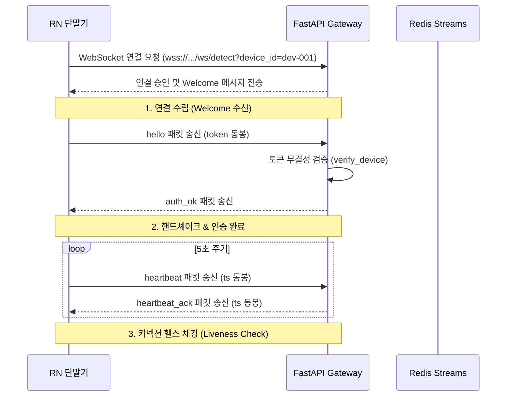

> **작성일**: 2026-07-05
> **버전**: v1.0.0
> **설계 기준**: docs/design/api_specification.md (v0.2.0)

# Minchodan 1단계: WebSocket Gateway 세부 설계서

본 문서는 시각장애인 보행 보조 시스템의 1단계 **WebSocket Gateway** 구현 상세 설계서입니다. 실시간 캡처 단말(React Native)과 GPU/CPU 추론 서버 간의 양방향 저지연 통신 구조를 정의합니다.

---

## 1. 네트워크 및 커넥션 라이프사이클

단말기와 서버 간의 커넥션 수립부터 비정상 단절 복구까지의 생명주기는 다음과 같이 통제됩니다.



### 1.1 커넥션 단계별 흐름 제어

| 단계 | 발신처 | 메시지 스키마 및 주요 속성 | 서버 측 핸들링 |
| :--- | :--- | :--- | :--- |
| **Welcome** | 서버 | `{"type": "welcome", "session_id": "string", "server_time": number}` | 커넥션 수립 즉시 생성하여 세션 ID 주입 |
| **Hello** | 단말기 | `{"type": "hello", "device_id": "string", "token": "string"}` | `verify_device` 비동기 쿼리로 토큰 인증 처리 |
| **Auth OK** | 서버 | `{"type": "auth_ok"}` | 인증 통과 시 클라이언트에 송신하고 캡처 타이머 기동 허가 |
| **Heartbeat** | 단말기 | `{"type": "heartbeat", "ts": number}` | 5초 간격 기동. 미응답 상태가 `interval + timeout` 초과 시 소켓 강제 close |
| **Heartbeat Ack** | 서버 | `{"type": "heartbeat_ack", "ts": number}` | 단말기 측 수신 시 직전 타임아웃 타이머 클리어 |

---

## 2. 세션 및 커넥션 관리 (`SessionManager`)

서버는 메모리상에서 활성 소켓 커넥션을 동적으로 추적하기 위해 싱글턴 객체인 `SessionManager`를 운용합니다.

### 2.1 주요 기능 및 예외 복구
- **커넥션 맵 매핑**: `active_connections: dict[str, WebSocket]` 구조를 활용해 디바이스 ID별 소켓 인스턴스를 관리합니다.
- **동적 가드레일**: 동일 디바이스 ID로 새로운 WebSocket 연결 요청이 유입되면, 기존에 바인딩되어 있던 옛 세션을 강제로 안전 종료(`close`)하고 신규 세션을 핫스왑합니다.
- **자원 정리**: `WebSocketDisconnect` 예외 감지 시, `finally` 블록에서 해당 디바이스 ID를 연결 맵에서 완전히 삭제하고, 해당 단말용으로 기동되어 있던 백그라운드 하트비트 루프를 즉각 소멸시켜 메모리 고갈을 예방합니다.

---

## 3. 페이로드 스키마 정의

### 3.1 단말 송신: `detection`
```json
{
  "type": "detection",
  "payload": {
    "event_id": "evt-1719216000000-001",
    "device_id": "dev-001",
    "ts": 1719216000000,
    "frame_id": 42,
    "stream": "reflex",
    "thumbnail_jpeg_b64": "/9j/4AAQSkZJRg..."
  }
}
```

### 3.2 서버 송신: `ack`
```json
{
  "type": "ack",
  "event_id": "evt-1719216000000-001",
  "frame_id": 42,
  "decode_ms": 12.5
}
```

---

## 4. 장애 가드레일 및 영속성 규칙

- **데이터 무탐지 시의 처리**: 카메라 프레임 디코딩 결과가 `None`이거나 손상된 바이너리인 경우에도, 파이프라인 정지 방지를 위해 서버는 예외를 터트리지 않고 빈 검출 리스트와 함께 정상적으로 `ack` 응답을 전송합니다.
- **재연결 제약**: 단말기는 접속 끊김 발생 시 `RECONNECT_DELAY=1000ms` 후 재연결을 시도하며, 최대 3회 초과 실패 시 즉시 `fallback` 상태로 이행하여 비상 로컬 경보 모드로 스위칭합니다.
