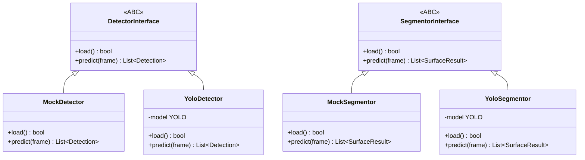
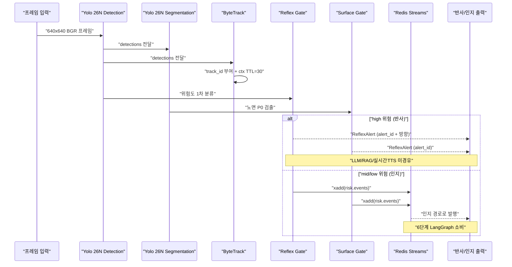

# Minchodan 3단계 탐지·분할·게이트 백엔드 설계서

> **작성일**: 2026-07-14
> **버전**: v0.3.2 (2026-07-19 RTX 5090 최대 사양과 OS별 PyTorch 2.13 가속 경로 반영)
> **설계 기준**: [`docs/minchodan_design_note.md`](minchodan_design_note.md) 3단계 (v1.1 듀얼헤드 + 이중 게이트)
> **스킬 참조**: [`.agents/skills/yolo-obstacle-detection/SKILL.md`](../.agents/skills/yolo-obstacle-detection/SKILL.md)
> **코딩 패턴 기준**: [`docs/course_codebase_guide.md`](course_codebase_guide.md)

---

## 1. 개요

본 문서는 Minchodan 7단계 파이프라인 중 **3단계 (AI 장애물 실시간 인식)** 의 백엔드 FastAPI 구현을 위한 상세 설계서입니다. 팀원이 **Yolo 26N - Object Detection / Yolo 26N - Segmentation 모델 학습 중**이라는 전제하에, 가중치 도착 전까지 **Mock Detector + 인터페이스 추상화** 패턴으로 구현하여 가중치 도착 시 교첧만으로 즉시 작동하도록 합니다.

### 1.1 3단계 정체성

2단계(프레임 수신)에서 받은 640x640 BGR 프레임을 **Yolo 26N - Object Detection**으로 추론하여 전동킥보드(`scooter`), 볼라드, 차량 등 위험 사물을 탐지하고, **Yolo 26N - Segmentation**으로 노면 상태를 분할하며, **ByteTrack**으로 Track ID를 부여합니다. **이중 게이트**(Reflex Gate + Surface Gate) 룰로 위험도를 1차 분류하여 반사 경로(즉시 경보)와 인지 경로(상세 가이드)로 분기합니다.

### 1.2 핵심 원칙 (비협상)

**이중 경로 물리 분리** — 반사 경로에는 **LLM / RAG / 실시간 TTS를 절대 경유시키지 않습니다.** 반사 음성은 사전합성 고정 클립만 사용합니다.

| 경로 | 위험도 | 흐름 | 음성 | 목표 지연 |
| --- | --- | --- | --- | --- |
| **반사** | high | Detection → Reflex Gate / Surface Gate → 사전합성 클립 | 사전합성 고정 클립 (선점) | <300ms (Detection 기준) |
| **인지** | mid/low | Detection+Seg → ByteTrack → `xadd("risk.events")` → LangGraph + RAG → 실시간 TTS | 실시간 합성 상세 가이드 | 1~2Hz |

---

## 2. 구현 범위

본 설계서의 구현 범위는 **`server/detection/` + `server/bus/`** 로 한정합니다. 1·2단계는 인터페이스만 맞추고, 가중치는 Mock 폶백으로 대체합니다.

| 디렉토리 | 구현 여부 | 비고 |
| --- | --- | --- |
| `server/detection/` | **구현** | 탐지·분할·추적·게이트 파이프라인 (3단계 핵심) |
| `server/bus/` | **구현** | Redis Streams 인터페이스 (3단계 의존) |
| `server/api/` | 인터페이스만 | 1단계 WS 산출물이 전달하는 프레임 형식만 맞춤 |
| `server/capture/` | 인터페이스만 | 2단계 `ProcessedFrame.frame` (numpy 640x640 BGR) duck typing 호환 |
| `server/orchestration/` | 미구현 | 6단계에서 Redis `risk.events` 소비 |
| `server/tts/` | 미구현 | 7단계에서 ReflexAlert 수신 |

---

## 3. 구현 파일 목록

### 3.1 신규 파일 (17개)

#### `server/detection/` — 탐지·분할·추적·게이트

| 파일 | 역할 | 핵심 내용 |
| --- | --- | --- |
| `server/detection/__init__.py` | 패키지 초기화 | 주요 모듈 export |
| `server/detection/config.py` | 3단계 설정 | `load_dotenv()` + `YOLO_CONF`(seg), `YOLO_DET_CONF`(det), `FRAME_SIZE`, 모델 경로 계산 (`__file__` 기반, guide 3.3) |
| `server/detection/schemas.py` | Pydantic 스키마 | `BBox`, `Detection`, `SurfaceResult`, `RiskEvent`, `DetectionResult`, `ReflexAlert` (api_specification.md §6 + SKILL.md 스키마 준수) |
| `server/detection/detector_interface.py` | 추상 인터페이스 | `DetectorInterface` (ABC), `SegmentorInterface` (ABC) — Mock/Yolo 핫스왑 |
| `server/detection/mock_detector.py` | Mock 구현 | `MockDetector`, `MockSegmentor` — 가중치 없을 때 가짜 탐지 결과 반환 (guide 17.2 Mock 폶백) |
| `server/detection/yolo_detector.py` | Yolo 26N Detection | `YoloDetector` — `ultralytics.YOLO` 로드 + `predict(conf=0.35)` + boxes 파싱. 로드 실패 시 Mock 폶백 |
| `server/detection/yolo_segmentor.py` | Yolo 26N Segmentation | `YoloSegmentor` — `ultralytics.YOLO` 로드 + masks 파싱. 노면 클래스 분리(C2) 준수 |
| `server/detection/bytetrack_tracker.py` | ByteTrack 래퍼 | `ByteTrackTracker` — track_id 자체는 `YoloDetector._parse_result`가 `model.track()`의 `box.id`를 `T-0001` 포맷으로 파싱해 이미 부여한다. 본 클래스는 그 track_id를 받아 Redis 컨텍스트(`ctx:{track_id}`)로 이전 위치와 대조해 speed/direction만 계산한다 |
| `server/detection/gates/__init__.py` | 게이트 패키지 | export |
| `server/detection/gates/reflex_gate.py` | Reflex Risk Gate | 룰베이스, **LLM 미경유**. 고위험 클래스 + 근접(하단 15%) → `alert_id` + 방향 |
| `server/detection/gates/surface_gate.py` | Surface Fast-Alert Gate | 룰베이스, **LLM 미경유**. P0 노면 하단 검출 → `alert_id` |
| `server/detection/detection_pipeline.py` | 파이프라인 오케스트레이션 | `DetectionPipeline` 클래스 — 프레임 입력 → Detection → Segmentation → ByteTrack → 이중 게이트 분기. **방어적 코딩**: None 가드레일, 무탐지 빈 리스트, Redis 실패 시 탐지 결과 정상 반환 |

#### `server/bus/` — Redis Streams 인터페이스

| 파일 | 역할 | 핵심 내용 |
| --- | --- | --- |
| `server/bus/__init__.py` | 패키지 초기화 | export |
| `server/bus/redis_client.py` | Redis 연결 풀 | `RedisBus` 클래스 — `redis.asyncio` 기반, `connect()`, `publish_event()` (`xadd`), `set_track_context()` (`hset`+`expire 30`), `get_track_context()` (`hgetall`). 연결 실패 시 no-op 가드레일 |
| `server/bus/producer.py` | 이벤트 발행 | `RiskEventProducer` — `xadd("risk.events", {...})` 래핑, Track 컨텍스트 TTL=30 관리 |

#### 테스트

| 파일 | 역할 | 핵심 내용 |
| --- | --- | --- |
| `tests/test_detection.py` | 3단계 검증 | TC-DET-001~010. MockDetector 기반으로 게이트 분기, 빈 리스트, Redis 발행 검증. `pytest` 사용 |
| `tests/__init__.py` | 테스트 패키지 | 패키지 인식 |

### 3.2 수정 파일 (2개)

| 파일 | 변경 내용 |
| --- | --- |
| `.env.example` | v1.1 기준 통일: `YOLO26_WEIGHTS` → `YOLO26N_OBJECT_DET=server/models/yolo26n/object_detection.pt`, `SEGFORMER_WEIGHTS` → `YOLO26N_SEG=server/models/yolo26n/segmentation.pt`. `DETECTOR_TYPE=mock` 추가. SegFormer 잔재 제거 |
| `requirements.txt` | `pytest`, `pytest-asyncio` 추가. Python 3.13 호환을 위해 `numpy>=2.1.0` 반영 |

### 3.3 디렉토리 정리

| 작업 | 대상 | 사유 |
| --- | --- | --- |
| 신규 생성 | `server/models/yolo26n/.gitkeep` | v1.1 기준 모델 경로 |
| 제거 | `server/models/yolo26/` | 구 버전 잔재 (v1.1 미반영) |
| 제거 | `server/models/segformer/` | SegFormer 잔재 (v1.1은 Yolo 26N - Segmentation 사용) |

---

## 4. 핵심 설계 결정

### 4.1 추상화 계층 (가중치 핫스왑)

팀원이 모델 학습 중이므로 가중치 파일이 없는 상태에서도 파이프라인 전체 흐름을 검증할 수 있도록 **인터페이스 추상화 + Mock 폶백** 패턴을 적용합니다.



`DetectionPipeline`은 `DetectorInterface`와 `SegmentorInterface`에 의존하므로, 가중치 도착 후 `MockDetector` → `YoloDetector`로 교첧만 하면 작동합니다. `config.py`의 팩토리 함수가 환경 변수와 파일 존재 여부로 적절한 구현체를 반환합니다.

**팩토리 패턴 (config.py)**:

```python
def get_detector() -> DetectorInterface:
    weights_path = os.getenv("YOLO26N_OBJECT_DET")
    if weights_path and os.path.exists(weights_path):
        return YoloDetector(weights_path)
    logger.warning("[Detector] 가중치 없음, MockDetector 사용")
    return MockDetector()
```

### 4.2 ByteTrack — ultralytics 내장 사용

SKILL.md는 `from bytetracker import ByteTracker`를 명시하지만, `requirements.txt`에 `bytetracker` 패키지가 누락되어 있습니다. 본 설계서는 **ultralytics 내장 `model.track()`** 을 사용하여 별도 패키지 설치 없이 ByteTrack 추적을 구현합니다.

**구현 방식**:

```python
results = model.track(source=frame, persist=True, tracker="bytetrack.yaml", conf=0.35)
# track_id는 result.boxes.id에서 추출
# persist=True 로 세션 간 Track ID 유지
```

`persist=True` 옵션으로 동일 모델 인스턴스 내에서 Track ID가 유지되며, Redis 컨텍스트(`hset` + `expire 30`)와 연동하여 접근/이탈 및 속도를 산출합니다.

> **참고 (2026-07-07 정정)**: `model.track()`은 `YoloDetector` 내부에서만 사용 가능하며, track_id 파싱(`T-0001` 포맷)은 `YoloDetector._parse_result`가 `box.id`로부터 직접 수행한다(`yolo_detector.py` 참조). `ByteTrackTracker`는 이미 부여된 track_id를 받아 Redis 컨텍스트로 speed/direction만 계산하는 래퍼다 — track_id "파싱" 자체를 담당하지 않는다. `MockDetector` 사용 시 track_id는 None으로 처리된다.

### 4.3 이중 경로 분리 원칙 (비협상)

`detection_pipeline.py`에서 위험도에 따라 엄격히 분기합니다. 반사 경로는 **LLM / RAG / 실시간 TTS를 절대 경유하지 않습니다.**



**분기 로직 (detection_pipeline.py)**:

| 위험도 | 게이트 | 행동 | 반환 |
| --- | --- | --- | --- |
| `high` | Reflex Gate | **LLM/RAG 미경유**, 사전합성 클립 즉시 재생 (7단계 반사 경로) | `ReflexAlert` 객체 |
| `high` | Surface Gate | **LLM/RAG 미경유**, 사전합성 클립 즉시 재생 (7단계 반사 경로) | `ReflexAlert` 객체 |
| `mid` | (게이트 통과) | Redis Streams `xadd("risk.events")` 발행 → 인지 경로 | `DetectionResult` (risk_hint="mid") |
| `low` | (게이트 통과) | Redis Streams `xadd("risk.events")` 발행 → 인지 경로 | `DetectionResult` (risk_hint="low") |

### 4.4 방어적 코딩 매트릭스 (guide 17.2 + AGENTS.md)

AGENTS.md의 **"프레임 버퍼/디코딩 결과가 None인 경우 반드시 가드레일 처리. 무탐지 시 에러 없이 빈 리스트 반환(파이프라인 영속성)"** 원칙을 준수합니다.

| 상황 | 처리 | 해당 가드 |
| --- | --- | --- |
| 프레임 `None` | 추론 스킵, 빈 `DetectionResult` 반환 | None 가드레일 (17.2 #1) |
| 모델 파일 없음 | `MockDetector`로 폶백, 로그 경고 | Mock 폶백 (17.2 #3) |
| Redis 연결 실패 | 컨텍스트 업데이트 스킵, 탐지 결과는 정상 반환 | 예외 후 루프 유지 (17.2 #4) |
| 무탐지 | 에러 없이 빈 리스트 반환 (파이프라인 영속성) | None 가드레일 (17.2 #1) |
| ByteTrack 초기화 실패 | track_id=None으로 탐지 결과만 반환 | 예외 후 루프 유지 (17.2 #4) |
| 디코딩 실패 (`cv2.imdecode` None) | 빈 `DetectionResult` 반환 | None 가드레일 (17.2 #1) |
| Redis `hset`/`expire` 예외 | 로그 경고 후 스킵, 탐지 결과는 정상 반환 | 예외 후 루프 유지 (17.2 #4) |

**방어적 코드 예시 (detection_pipeline.py)**:

```python
async def run(self, frame, stream, event_id, device_id) -> DetectionResult:
    if frame is None:
        logger.warning("[Pipeline] 프레임 None, 빈 결과 반환")
        return DetectionResult(event_id=event_id, detections=[], surface=[],
                               risk_hint="none", inference_ms=0.0)

    try:
        detections = self.detector.predict(frame)
    except Exception as e:
        logger.error(f"[Pipeline] Detection 실패: {e}")
        detections = []

    if not detections:
        return DetectionResult(event_id=event_id, detections=[], surface=[],
                               risk_hint="none", inference_ms=elapsed)
```

### 4.5 1·2단계 인터페이스 호환

`DetectionPipeline.run()` 입력은 numpy 배열(640x640 BGR)을 받도록 설계하여 2단계 `ProcessedFrame.frame`과 duck typing으로 호환됩니다. 2단계 구현 시 별도 어댑터 없이 직접 전달 가능합니다.

**입력 인터페이스**:

```python
async def run(
    self,
    frame: np.ndarray,        # (640, 640, 3) BGR — 2단계 ProcessedFrame.frame 호환
    stream: str,              # "reflex" 또는 "cognitive" — 2단계 ProcessedFrame.stream 호환
    event_id: str,            # 이벤트 추적 식별자 (UUID)
    device_id: str,           # 단말 식별자
) -> DetectionResult | ReflexAlert:
```

**출력 인터페이스 (api_specification.md §6 준수)**:

```python
class DetectionResult(BaseModel):
    event_id: str
    detections: List[Detection]     # [{class_name, confidence, bbox, track_id}]
    surface: List[SurfaceResult]    # [{class_name, mask|centroid}]
    risk_hint: str                  # "high" | "mid" | "low" | "none"
    inference_ms: float

class ReflexAlert(BaseModel):
    event_id: str
    alert_id: str                   # f"high_{class_name}_{direction}", 예: "high_car_front-left"
    direction: str                  # "front-left" | "front" | "front-right" (estimate_direction() 산출)
    risk_level: str = "high"
    clip: str                       # "reflex_clips/high_front.mp3" (direction 기준, class_name 무관)
    haptic: bool = True
    panning: float = 0.0
    distance: float = 1.0
    beep_interval_ms: int = 250
    haptic_pattern: str = "double"
    ts: float
    track_id: Optional[int] = None
    class_name: Optional[str] = None
    hit_count: Optional[int] = None
```

> **2026-07-07 정정**: 위 스키마는 `server/detection/schemas.py`의 실제 `ReflexAlert` 필드와 일치시킨 것이다. `direction`은 `"front"/"left"/"right"/"stop"`이 아니라 `estimate_direction()`(`server/detection/direction.py`)이 산출하는 `"front-left"/"front"/"front-right"` 3종뿐이며, `alert_id`는 고정 목록(`high_front` 등)이 아니라 클래스명을 포함한 동적 문자열이다(§6.3 참조).

---

## 5. 노면 클래스 분리 (C2)

v1.1 설계에 따라 노면 클래스를 **독립 클래스로 분리**합니다. 같은 클래스로 묶으면 파손 학습이 불가하므로 분리가 필수입니다.

| 클래스 | 설명 | 게이트 | 위험도 |
| --- | --- | --- | --- |
| `braille_normal` | 점자블록 정상 | (해당 없음) | low |
| `braille_damaged` | 점자블록 파손 | Surface Gate (P0) | high |
| `sidewalk_normal` | 복도 정상 | (해당 없음) | low |
| `sidewalk_damaged` | 복도 파손 | (해당 없음) | mid |
| `crosswalk` | 횡단복도 | Surface Gate (P0) | high |
| `roadway` | 차도 | (주의) | mid |
| `caution` | 계단/맨홀/그레이팅 | Surface Gate (P0) | high |

> **참고**: `caution` 클래스는 stairs/manhole/grating을 포함하는 통합 클래스입니다. 팀원 학습 시 별도 클래스로 분리할지 통합할지는 학습 데이터에 따라 결정하며, 본 설계서는 SKILL.md 기준으로 `caution` 통합 클래스를 따릅니다.

> **2026-07-07 실제 학습 결과 반영**: 위 7클래스는 최초 제안이었고, 실제로 파인튜닝 완료된 Segmentation 모델(`segbest.pt`)은 **4클래스만 채택**됐다 — `sidewalk_normal`, `caution`, `roadway`, `braille_normal` (`braille_damaged`/`sidewalk_damaged`/`crosswalk` 별도 세분화는 데이터 미확보로 미채택, `docs/ops/model_class_validation_report.md` 참조).
>
> **버그 및 수정 (2026-07-07)**: `server/detection/gates/surface_gate.py`의 `P0_SURFACE_CLASSES`가 최초 제안 시절의 클래스명(`crosswalk`, `manhole`, `stair`, `stairs`, `grating`, `braille_damaged`)으로 남아 있어 실제 4클래스 모델 출력과 단 하나도 겹치지 않아 **Surface Gate가 한 번도 발동한 적이 없던 실제 코드 결함**이었다(계단·맨홀 등 노면 위험에 대한 <300ms 즉시 반사 경보가 전혀 작동하지 않음). `P0_SURFACE_CLASSES = {"caution"}`으로 정정하여 수정 완료했다. 같은 조사에서 `server/detection/detection_pipeline.py::_classify_risk`(COCO 잔재 클래스명 사용)와 `server/orchestration/nodes/l1_classifier.py::MID_RISK_CLASSES`(`kickboard`/`pothole`/`manhole`/`construction_cone` 등 실제 존재하지 않는 클래스명, `scooter`가 아닌 `kickboard`로 오기)도 함께 발견되어 실제 29클래스 기준으로 정정했다. `tests/test_langgraph.py::TestRiskClassifierConsistency`에 두 분류기 간 불일치 및 존재하지 않는 클래스명 사용을 막는 회귀 테스트를 추가했다.

---

## 6. 이중 게이트 규칙

### 6.1 Reflex Risk Gate (룰베이스, LLM 미경유)

**입력**: `Detection` 객체, 프레임 높이/너비
**출력**: `ReflexAlert` 또는 `None`

| 조건 | 임계값 | 결과 |
| --- | --- | --- |
| 고위험 클래스 | `car`, `truck`, `bus`, `motorcycle`, `scooter` (5종) | 1차 통과 |
| 근접 (하단) | bbox 하단 y > 프레임 높이 × (1 - 0.15) | 2차 통과 → `alert_id` 발행 |
| 방향 추정 | `estimate_direction()`(`direction.py`)의 거리별 충돌 회랑 띠(near/medium/far별 폭이 다름) 겹침 판정 | `front-left` / `front` / `front-right` 3종만 산출 (단순 x<width/3 임계치가 아님) |

**고위험 클래스 정의** (`server/detection/gates/reflex_gate.py` 실제 코드):

```python
HIGH_RISK_CLASSES = {"car", "truck", "bus", "motorcycle", "scooter"}
PROXIMITY_THRESHOLD = 0.15  # 프레임 하단 면적 비율
```

> **2026-07-07 정정**: 29개 클래스 전부를 반사 경로로 보내면 피로도 때문에 실사용이 불가능하므로, 가장 치명적인 동적 객체 5종만 Reflex Gate 1차 필터로 선별했다(코드 내 주석 참조). 최초 설계(4종, `motorcycle`까지)에는 `scooter`가 누락되어 있었다.

### 6.2 Surface Fast-Alert Gate (룰베이스, LLM 미경유)

**입력**: `List[SurfaceResult]`, 프레임 높이
**출력**: `ReflexAlert` 또는 `None`

| 조건 | 임계값 | 결과 |
| --- | --- | --- |
| P0 노면 클래스 | `crosswalk`, `manhole`, `stair`, `grating`, `braille_damaged` | 1차 통과 |
| 하단 검출 | centroid y > 프레임 높이 × 0.6 | 2차 통과 → `alert_id` 발행 |

**P0 노면 클래스 정의**:

```python
P0_SURFACE_CLASSES = {
    "crosswalk", "manhole", "stair", "grating", "braille_damaged"
}
```

### 6.3 alert_id 실제 생성 규칙 (2026-07-07 정정)

> 최초 설계는 `high_front`/`high_left`/`high_right`/`high_stop` 같은 **고정 alert_id 목록**을 전제로 했으나, 실제 `reflex_gate.py:55`는 `alert_id = f"high_{detection.class_name}_{direction}"`로 **클래스명을 포함한 동적 문자열**을 생성한다(예: `high_car_front-left`, `high_scooter_front`). 재생 클립(`clip`)만 `f"reflex_clips/high_{direction}.mp3"`로 direction 기준으로 고정된다 — 클래스와 무관하게 방향별 클립 3종(`high_front-left.mp3`, `high_front.mp3`, `high_front-right.mp3`)만 존재하면 된다.

| 게이트 | `alert_id` 생성식 | 예시 |
| --- | --- | --- |
| Reflex Gate | `f"high_{class_name}_{direction}"` | `high_car_front`, `high_scooter_front-left` |
| Surface Gate | `f"surface_{class_name}"` | `surface_crosswalk`, `surface_manhole` (단, §6.2의 실제 4클래스 모델과 P0_SURFACE_CLASSES 불일치 문제로 현재는 발동하지 않음) |

---

## 7. 검증 기준

### 7.1 테스트 매트릭스 (test_specification.md TC-DET 매핑)

**테스트 파일**: `tests/test_detection.py`

| ID | 검증 항목 | 기준 | Mock 대응 | 상태 |
| --- | --- | --- | --- | --- |
| TC-DET-001 | Yolo 26N Detection 전동킥보드(scooter) 추론 | `conf≈0.87` | MockDetector 고정 conf 반환 | 대기 |
| TC-DET-002 | track_id 부여 | ByteTrack `update()` → track_id | Mock + ByteTrack 래퍼 | Mock 검증 완료 |
| TC-DET-003 | Detection 추론 지연 | **< 80ms** | Mock 즉시 반환, Yolo는 가중치 도착 후 측정 | 대기 |
| TC-DET-004 | Yolo 26N Segmentation 마스크 | 노면 의미분할 마스크 생성 | MockSegmentor 가짜 마스크 | 대기 |
| TC-DET-005 | Reflex Gate 분기 | 고위험+근접 → `alert_id`+방향 | 룰베이스 테스트 (Mock 결과 주입) | 완료 |
| TC-DET-006 | Surface Gate 분기 | P0 노면 하단 검출 → `alert_id` | 룰베이스 테스트 | 완료 |
| TC-DET-007 | Redis 컨텍스트 TTL | 30초 후 Track ctx 키 자동 삭제 | Redis 가드레일 테스트 | 대기 |
| TC-DET-008 | mid/low 발행 | `xadd("risk.events")` 정상 | `xadd` 호출 검증 | 완료 |
| TC-DET-009 | 무탐지 빈 리스트 | 에러 없이 빈 리스트 반환 | None 프레임 입력, Detector/Segmentor/Tracker 예외 | 완료 |
| TC-DET-010 | 노면 클래스 분리 (C2) | `braille_damaged` 독립 클래스 검출 | MockSegmentor 클래스 검증 | 대기 |

### 7.2 이중 경로 분리 검증 (test_specification.md TC-PATH 매핑)

| ID | 검증 항목 | 기준 | 상태 |
| --- | --- | --- | --- |
| TC-PATH-001 | 반사 경로 LLM 미경유 | Reflex/Surface Gate에 LLM 호출 없음 | 완료 |
| TC-PATH-002 | 반사 경로 RAG 미경유 | 반사 메시지에 RAG 검색 없음 | 완료 |
| TC-PATH-003 | 반사 경로 실시간 TTS 미사용 | 사전합성 클립만 사용 | 완료 |
| TC-PATH-004 | 인지 경로 Redis Streams 경유 | `xadd("risk.events")` → `xread` | 발행 완료 |
| TC-PATH-005 | 선점 우선순위 | 반사 WS 고우선 타입 > 인지 | 대기 |

### 7.3 테스트 실행 명령

```powershell
python -m pytest tests/test_detection.py -v
```

> **참고**: `pytest`는 `requirements.txt`에 추가 필요 (AGENTS.md 금지 사항 #3: 사전 허가 없는 라이브러리 추가 금지). 본 설계서에서 승인된 항목입니다.

---

## 8. 코딩 패턴 준수 사항

본 구현은 [`docs/course_codebase_guide.md`](course_codebase_guide.md)의 코딩 패턴을 엄격히 준수합니다.

| 패턴 | 가이드 섹션 | 적용 파일 | 내용 |
| --- | --- | --- | --- |
| 파일 헤더 인코딩 | 3.1 | 모든 Python 파일 | `# -*- coding: utf-8 -*-` + `sys.stdout.reconfigure` |
| 임포트 순서 | 3.2 | 모든 Python 파일 | stdlib → 외부 → 로컬 순서 |
| 경로 처리 | 3.3 | `config.py`, `yolo_detector.py`, `yolo_segmentor.py` | `os.path.dirname(os.path.abspath(__file__))` 기반 |
| 환경 변수 로드 | 3.4 | `config.py` | `load_dotenv()` + `os.getenv(..., default)` |
| 계층 분리 | 17.1 | 전체 | Pipeline → Gate → Bus (Router → Service → Repository 유사) |
| None 가드레일 | 17.2 #1 | `detection_pipeline.py`, `yolo_detector.py` | 프레임 None, 디코딩 None 가드 |
| Mock 폶백 | 17.2 #3 | `config.py`, `mock_detector.py` | 가중치 없을 시 Mock 구현체 사용 |
| 예외 후 루프 유지 | 17.2 #4 | `detection_pipeline.py`, `redis_client.py` | Redis 실패 시 탐지 결과 정상 반환 |
| 방어적 dict 접근 | 17.2 #5 | `schemas.py`, `gates/` | `data.get("key", default)` 패턴 |
| 공통 임포트 헤더 | 17.5 | 모든 Python 파일 | UTF-8 + `load_dotenv()` |

---

## 9. 데이터 인터페이스

### 9.1 3단계 입력 (2단계에서 전달)

| 방향 | 타입 | 포맷 |
| --- | --- | --- |
| In | `np.ndarray` | (640, 640, 3) BGR 프레임 |
| In | `str` | `stream`: "reflex" 또는 "cognitive" |
| In | `str` | `event_id`: UUID |
| In | `str` | `device_id`: 단말 식별자 |

### 9.2 3단계 출력 (api_specification.md §6 준수)

**반사 경로 (high 위험)**:

```json
{
  "event_id": "uuid",
  "alert_id": "high_scooter_front",
  "direction": "front",
  "risk_level": "high",
  "clip": "reflex_clips/high_front.mp3",
  "haptic": true,
  "panning": 0.0,
  "distance": 0.8,
  "beep_interval_ms": 100,
  "haptic_pattern": "continuous",
  "ts": 1719216000000
}
```

**인지 경로 (mid/low 위험) — `DetectionResult`**:

```json
{
  "event_id": "uuid",
  "detections": [
    {
      "class_name": "kickboard",
      "confidence": 0.87,
      "bbox": [120, 200, 280, 360],
      "track_id": "T-0003"
    }
  ],
  "surface": [
    {
      "class_name": "caution",
      "mask": "...",
      "centroid": [320, 580]
    }
  ],
  "risk_hint": "mid",
  "inference_ms": 72
}
```

> **2026-07-07 클래스명 참고**: `l1_classifier.py`의 `MID_RISK_CLASSES`는 `"kickboard"`라는 이름을 그대로 쓰고 있으나, 실제 학습 완료된 Object Detection 29클래스(`docs/ops/model_class_validation_report.md`)에는 `kickboard`가 없고 `scooter`가 그 역할을 한다 — 두 게이트/분류기 코드 간 클래스명이 어긋나 있어 `kickboard`는 현재 `l1_classifier`에서 실제로 매칭되지 않는 죽은 규칙일 가능성이 있다. `surface` 예시는 실제 4클래스 모델에 존재하는 `caution`으로 교체했다(§5 참조, `crosswalk`는 실제 모델에 없음).

### 9.3 Redis Streams 발행 (mid/low)

```python
redis_bus.xadd("risk.events", {
    "event_id": event_id,
    "track_id": detection.track_id or "unknown",
    "class_name": detection.class_name,
    "confidence": str(detection.confidence),
    "bbox": json.dumps(detection.bbox),
    "speed": str(detection.speed or 0),
    "direction": detection.direction or "unknown",
    "risk": risk_hint,
    "timestamp": str(time.time())
})
```

### 9.4 Redis Track 컨텍스트 (TTL=30)

```python
redis_bus.hset(f"ctx:{track_id}", mapping={
    "last_pos": json.dumps(track["bbox"]),
    "speed": str(speed),
    "direction": direction,
    "class_name": track["class_name"],
})
redis_bus.expire(f"ctx:{track_id}", 30)
```

---

## 10. 에러 처리 가드레일

| 상황 | 처리 | 적용 파일 |
| --- | --- | --- |
| 모델 파일 없음 | 서버 시작 실패 + 로그 경고, Mock 폶백 | `config.py`, `yolo_detector.py` |
| 프레임이 None | 추론 스킵, 빈 detections 반환 | `detection_pipeline.py` |
| Detector 추론 예외 | 빈 detections로 진행, Segmentor 결과는 유지 | `detection_pipeline.py` |
| Segmentor 추론 예외 | 빈 surface로 진행, Detector 결과는 유지 | `detection_pipeline.py` |
| Redis 연결 실패 | 컨텍스트 업데이트 스킵, 탐지 결과는 정상 반환 | `redis_client.py`, `bytetrack_tracker.py` |
| CUDA OOM | CPU 폶백 (`device='cpu'`) | `yolo_detector.py`, `yolo_segmentor.py` |
| ByteTrack 초기화 실패 | Track ID 없이 탐지 결과만 반환 | `bytetrack_tracker.py` |
| Tracker Redis 예외 | speed/direction 기본값으로 탐지 결과 반환 | `bytetrack_tracker.py` |
| 무탐지 | 에러 없이 빈 리스트 반환 (파이프라인 영속성) | `detection_pipeline.py` |

---

## 11. 브랜치 전략

본 작업은 [`docs/git_branching_strategy.md`](git_branching_strategy.md)의 3계층 브랜치 구조를 준수합니다.

| 브랜치 | 역할 | 작업 |
| --- | --- | --- |
| `main` | 운영 기준선 | 직접 push 금지 |
| `dev` | 통합 개발 | PR 머지 대상 |
| `{이니셜}` | 개별 개발 | 본 작업 진행 |

**작업 흐름**:

1. `dev`에서 개인 브랜치 분기 (예: `kb`)
2. 개인 브랜치에서 구현
3. `dev`로 PR 생성
4. 코드 리뷰 후 머지

---

## 12. 의존성 및 전제

### 12.1 팀원 가중치 도착 시 교체 포인트

| 교체 대상 | 교체 후 | 작업 |
| --- | --- | --- |
| `MockDetector` | `YoloDetector` | `server/models/yolo26n/det_best_20260705.pt`(29클래스 파인튜닝 완료) 배치 후 자동 전환 (config.py 팩토리) |
| `MockSegmentor` | `YoloSegmentor` | `server/models/yolo26n/segbest.pt`(4클래스 파인튜닝 완료) 배치 후 자동 전환 |
| `test_detection.py` Mock 테스트 | 실제 가중치 테스트 | Mock 테스트는 유지, 별도 통합 테스트 추가 |

### 12.2 선행 의존성

| 의존성 | 상태 | 비고 |
| --- | --- | --- |
| 1단계 WS (`server/api/`) | 미구현 | 인터페이스만 맞춤 (프레임 전달은 2단계 가정) |
| 2단계 프레임 디코더 (`server/capture/`) | 미구현 | `ProcessedFrame.frame` (numpy 640x640 BGR) duck typing 호환 |
| Redis 7+ | 실행 필요 | Docker 구성으로 실행 (`docker/docker-compose.yml`) |
| Python 3.13 | 필요 | requirements.txt 기준 |
| `ultralytics>=8.3` | 필요 | requirements.txt 포함 |
| GPU 가속 | 권장 | 팀 최대 RTX 5090. Ubuntu/Windows는 PyTorch 2.13 + CUDA 13.0(cu130), macOS는 PyTorch 2.13 MPS/CPU. Mock 사용 시 불필요 |

### 12.3 환경 변수 (.env.example 수정)

| 변수 | 설명 | 기본값 |
| --- | --- | --- |
| `YOLO_CONF` | Yolo 26N - Segmentation 신뢰도 임계값 | `0.35` |
| `YOLO_DET_CONF` | Yolo 26N - Object Detection 신뢰도 임계값 | `0.50` |
| `FRAME_SIZE` | 프레임 리사이즈 크기 | `640` |
| `REFLEX_FPS` | 반사 캡처 목표 fps | `10` |
| `COGNITIVE_FPS` | 인지 캡처 목표 fps | `2` |
| `YOLO26N_OBJECT_DET` | Yolo 26N - Object Detection 가중치 경로 | `server/models/yolo26n/det_best_20260705.pt` (2026-07-07부터 `.env` 기본값 — `object_detection.pt`는 순정 COCO 80클래스 체크포인트이므로 사용 금지) |
| `YOLO26N_SEG` | Yolo 26N - Segmentation 가중치 경로 | `server/models/yolo26n/segbest.pt` (2026-07-07부터 `.env` 기본값 — `segmentation.pt`는 순정 COCO 80클래스 체크포인트이므로 사용 금지) |
| `REDIS_URL` | Redis 연결 URL | `redis://localhost:6379` |

---

## 13. 변경 이력 (Changelog)

### [v0.3.1] - 2026-07-14
- **29종 객체-반사 경로 일원화**: 29종 위험 사물이 검출되었을 때 인지 경로(LLM)로 인텐트가 중복 우회하는 문제를 해결하기 위해, `l1_classifier.py`의 `MID_RISK_CLASSES`에서 객체 클래스들을 전원 배제함. 인지 경로(mid)는 오직 노면 이탈(`is_departing_confirmed`) 판정만 전담하도록 변경.
- **2026-07-17 Option A 완료**: `detection_pipeline.py`의 객체 `MID_RISK_CLASSES`를 L1과 동일하게 공집합으로 정렬. 머리 높이 격상 18종은 `HEAD_LEVEL_ESCALATION_CLASSES`로 분리해 `head_level_gate` 유지. `tests/test_langgraph.py`·`test_departure_hysteresis.py` 및 stage6 §7.1·behavior doc·llm-guidance 스킬 동기화.
- **정지 후 우회 안내 시퀀싱 구현**:
  - 반사(비프/햅틱)로 사용자가 멈추는 즉시 인지(음성 가이드)가 겹쳐서 모호한 안내가 나가지 않도록 구조를 이원화함.
  - `consumer.py`에서 `ReflexAlert` 발동 800ms 후 비동기 지연 태스크(`_trigger_delayed_cognitive_guide`)를 통해 후속 설명("OO 발견, N시 방향으로 우회하세요")을 생성하도록 설계.
  - `l2_generator.py`의 `GUIDANCE_SYSTEM_PROMPT`를 수정하여 이미 정지한 사용자에게 모호한 "정지/멈추세요" 명령을 중복 발화하지 않고 장애물 정보 및 우회 방향 설명에 집중하도록 프롬프트를 튜닝함.
  - LLM 호출 실패 또는 L3 가드레일 탈락 시에도 최후 안전망인 `fallback_node.py`가 고정 정지 메시지("천천히 멈추세요") 대신, **"N시 방향 [장애물명] 주의하세요"** 형태의 동적 우회/주의 멘트를 동적으로 조합해 생성하도록 리팩토링함.
- **직접 충돌 위험 객체 필터 추가 및 완화 보정** (`reflex_gate.py`):
  - 무차별적인 반사 경보로 인한 피로 고갈 및 큐 지연을 막기 위해 반사 조건을 재조정함.
  - **조건 1**: 사물의 바닥(bottom_y)이 화면 하단 18% 이내로 인접한 물체 (`bottom_y > frame_height * 0.82`).
  - **조건 2**: 사물의 중심(center_x)이 좌우 20% 여백을 제외한 중앙 60% 충돌 회랑 내에 있는 물체 (`0.2 * width <= center_x <= 0.8 * width`).
  - 위 두 조건(적정 위험 인접 + 정면 충돌 방향)을 모두 만족할 때만 즉각 비프음(반사)을 발생시키고, 그 외의 원경/측면 사물은 비프음 없이 800ms 뒤 부드러운 우회 가이드 음성으로만 설명하도록 차별화함 (실기기 0.95 기하 기준이 너무 가혹했던 버그 수정).
- **신규 파인튜닝 가중치 적용**: 파인튜닝 가중치 파일명을 `.env` 및 `config.py` 기본값에 `object_detection260714.pt` 및 `segmentation260714.pt`로 업데이트 반영함.

---

## 14. 참고 자료

| 문서 | 파일 | 참조 내용 |
| --- | --- | --- |
| 설계 노트 (원본) | [`docs/minchodan_design_note.md`](minchodan_design_note.md) | 3단계 11필드 표준 양식 |
| 시스템 아키텍처 | [`docs/architecture.md`](architecture.md) | 5.3절 3단계 컴포넌트 상세, 이중 경로 동작 모드 |
| API 명세서 | [`docs/api_specification.md`](api_specification.md) | §4 반사 경로 메시지, §6 탐지 결과 상세 |
| 테스트 명세서 | [`docs/test_specification.md`](test_specification.md) | 5.3절 3단계 검증 매트릭스, §6 이중 경로 분리 검증 |
| 파이프라인 단계 설계 | [`docs/pipeline_stage_design.md`](pipeline_stage_design.md) | 5.3절 3단계 핵심 절차, run mode |
| 코딩 패턴 기준 | [`docs/course_codebase_guide.md`](course_codebase_guide.md) | §3, §9, §10, §17 코딩 패턴 |
| 에이전트 스킬 | [`.agents/skills/yolo-obstacle-detection/SKILL.md`](../.agents/skills/yolo-obstacle-detection/SKILL.md) | 3단계 구현 가이드, 노면 클래스 분리(C2) |
| Git 브랜칭 전략 | [`docs/git_branching_strategy.md`](git_branching_strategy.md) | 3계층 브랜치 구조 |
