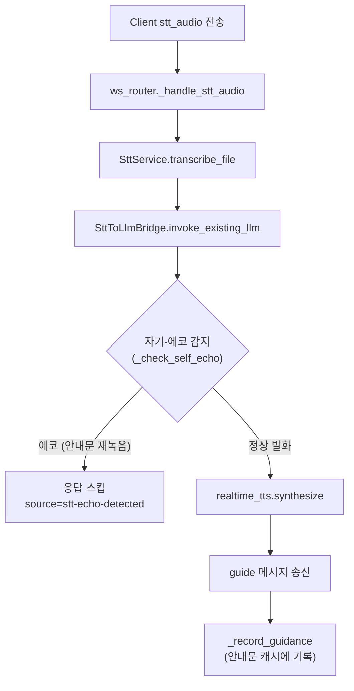

# Minchodan STT 음성명령 연동 가이드

> **작성일**: 2026-07-10
> **버전**: v0.2.4 (2026-07-11 §6 테스트 체크리스트에 AEC 실기기 검증 항목 TC-STT-010/011 추가 + 이전 v0.2.3 이력 유지: STT 녹음 구간 AEC 도입 - iOS voiceChat 세션 전환(`AudioSessionBridge`), AEC 확인 시 시작 신호음 복원 + 이전 v0.2.2 이력 유지: STT 응답 지연 개선 3건 반영 - 기본 모델 `faster-whisper-small` 전환, 서버 기동 시 모델 프리로드, TTS 합성 결과 캐시 + 이전 v0.2.1 이력 유지: 바이너리 응답 계약·민감정보 비보존·플랫폼별 녹음 검증 반영)
> **범위**: 7단계 골격 외 입력 경로(STT) 운영 가이드
> **관련 코드**: `server/api/ws_router.py`, `server/stt/stt_service.py`, `server/stt/stt_to_llm_bridge.py`

---

## 1. 목적

본 문서는 사용자 음성 명령(STT)을 기존 인지 경로에 안전하게 연결하기 위한 구현/운영 기준을 정의합니다.

| 항목          | 내용                                            |
| :------------ | :---------------------------------------------- |
| **입력 채널** | WebSocket `stt_audio` 메시지                    |
| **출력 채널** | 기존 `guide` 메시지 계약 재사용                 |
| **원칙**      | 반사 경로와 물리적으로 분리, 인지 경로에만 연결 |

---

## 2. 현재 흐름 (코드 기준)



---

## 3. 메시지 계약

### 3.1 입력 (`stt_audio`)

```json
{
  "type": "stt_audio",
  "audio_b64": "UklGR...",
  "model_name": "medium"
}
```

`model_name` 생략 시 `DEFAULT_REQUEST_MODEL`(`faster-whisper-small`)이 사용됩니다.

> **비고 (2026-07-11) - 기본 모델 small 전환 및 지연 개선**: macOS Docker CPU 폴백 환경
> 실측에서 STT 왕복이 정상 3.8초, 컨테이너 재시작 후 첫 요청 10초 이상으로 측정되어
> 다음 3건을 적용했습니다. (a) 기본 모델을 `faster-whisper-medium`에서
> `faster-whisper-small`로 전환(`stt_config.py`, hotwords 바이어싱 유지. 인식 품질 회귀
> 시 `DEFAULT_REQUEST_MODEL` 상수 1개만 롤백). (b) `server/main.py` lifespan에서 Whisper
> 모델을 백그라운드 스레드로 프리로드해 콜드스타트 8~10초 제거(실패 시 기존 지연 로딩
> 폴백, 서버 기동은 차단하지 않음). (c) `realtime_tts.py`에 (text, voice, speed) 키
> FIFO 캐시(64건)를 추가해 웨이크업/재시도 등 고정 안내문 재합성 1.4~1.9초를 2회째부터
> 제거.

### 3.2 출력 (`guide`)

```json
{
  "type": "guide",
  "event_id": "stt-device123-1720574000",
  "guidance_text": "횡단보도는 30m 앞입니다.",
  "audio_codec": "wav",
  "duration_ms": 1540,
  "transport": "binary",
  "source": "stt-bridge",
  "ts": 1720574000
}
```

`transport`가 `binary`이면 위 JSON 직후 raw WAV 바이너리 프레임이 이어집니다.
서버 TTS가 오디오를 만들지 못하면 `transport: "none"`을 보내고 단말 TTS로 폴백합니다.

---

## 4. 구현 포인트

| 계층    | 파일                              | 핵심 책임                                                |
| :------ | :-------------------------------- | :------------------------------------------------------- |
| Router  | `server/api/ws_router.py`         | `stt_audio` 수신, 요청 단위 임시 파일 생성·즉시 삭제, 백그라운드 태스크 분리 |
| Service | `server/stt/stt_service.py`       | 오디오 전사 수행                                         |
| Bridge  | `server/stt/stt_to_llm_bridge.py` | 전사 결과를 기존 가이드 흐름으로 변환                    |
| TTS     | `server/tts/realtime_tts.py`      | 안내 문장 합성 및 오디오 직렬화. 동일 (text, voice, speed) 재합성은 FIFO 캐시(64건)로 회피 |

---

## 5. 가드레일

| 구분            | 기준                                                                    |
| :-------------- | :---------------------------------------------------------------------- |
| **연결 안정성** | STT 처리 중 heartbeat 타임아웃이 발생하지 않도록 백그라운드 태스크 사용 |
| **예외 처리**   | 전사 실패 시 고정 fallback 문장 송신                                    |
| **경로 분리**   | STT는 인지 경로 전용, 반사 경로 미연동                                  |
| **민감정보**    | 업로드 음성은 요청 단위 임시 파일만 사용하고 즉시 삭제합니다. 원본 WAV와 전사문은 파일·INFO 로그·DB에 저장하지 않으며, DB에는 입력 길이 등 비식별 메타만 저장합니다. |
| **플랫폼별 캡처 검증** | iOS Linear PCM만 바이트 길이로 캡처 시간을 검증합니다. Android MPEG-4/AAC는 압축 오디오이므로 PCM 길이 공식을 적용하지 않고 서버 디코더와 VAD에 맡깁니다. |
| **자기-에코 감지** | TTS 안내문이 마이크로 재녹음된 경우 전사 결과와 최근 안내문(`_recent_guidance`, TTL 10초)을 비교해 에코로 판정, 응답 스킵(`source=stt-echo-detected`). 클라이언트는 TTS 재생 중 녹음 시 `stopGuideAudio()` 후 150ms 대기 (서버+클라이언트 이중 방어) |
| **AEC(에코 캔슬레이션)** | 2026-07-11 도입: STT 녹음 구간에서 iOS 세션을 `voiceChat` 모드로 전환(`client/ios/AudioSessionBridge.swift`, `client/src/services/audioSessionBridge.ts`)해 스피커 출력(반사 비프 등)의 마이크 유입을 하드웨어 수준에서 상쇄. `.defaultToSpeaker`로 스피커 라우팅 유지, 녹음 종료 시 이전 세션으로 복구. AEC 활성이 세션 조회로 확인된 경우에만 녹음 시작 신호음 재생(`STT_START_CUE_WITH_AEC` 플래그, 회귀 시 플래그만 롤백). Android는 no-op(후속: AcousticEchoCanceler) |
| **인텐트 우선순위** | `awaiting_intent` 대기 상태에서 `nav intent -> question intent -> wake 재호출 -> else(재질문)` 순서로 분기. wake 재호출이 인텐트 매칭보다 우선하면 "길댕아 길찾아줘"가 wake로만 처리되는 문제 방지 |

---

## 6. 테스트 체크리스트

| ID         | 항목        | 기준                               |
| :--------- | :---------- | :--------------------------------- |
| TC-STT-001 | 입력 수신   | `stt_audio` 메시지 파싱 성공       |
| TC-STT-002 | 전사 성공   | 텍스트 출력 비어있지 않음          |
| TC-STT-003 | 브리지 연동 | guidance_text 생성                 |
| TC-STT-004 | 오디오 생성 | `audio_codec=wav`, `duration_ms>0` |
| TC-STT-005 | 예외 폴백   | 실패 시 안내 문장 송신             |
| TC-STT-006 | 자기-에코 감지 | 안내문 재녹음 시 `source=stt-echo-detected` 반환, 클라이언트에 응답 미송신 |
| TC-STT-007 | 인텐트 우선순위 | `awaiting_intent`에서 "길댕아 길찾아줘" → `WAITING_FOR_DESTINATION` 전환 (wake 재호출이 아닌 nav intent로 처리) |
| TC-STT-008 | Android 압축 오디오 | MPEG-4/AAC 녹음에 PCM 바이트 길이 판정을 적용하지 않고 서버로 전송 |
| TC-STT-009 | 지연 녹음 취소 | 150ms 잔향 대기 중 손을 떼면 예약 녹음을 취소하고 STT 뮤트를 해제 |
| TC-STT-010 | AEC 세션 유지 (실기기) | 녹음 시작 후 `[STT][AEC]` 로그에서 `mode=voiceChat`, `aec=true` 유지 확인 (expo-audio가 세션을 덮으면 경고 로그 + 시작 신호음 생략) |
| TC-STT-011 | 시작 신호음 비오염 (실기기) | AEC 활성 상태에서 시작 신호음 재생 후에도 전사에 신호음이 섞이지 않고 캡처 절단 가드(`capture_truncated`)가 발동하지 않음 |

---

## 7. 후속 작업

| 우선순위 | 작업                                             |
| :------- | :----------------------------------------------- |
| 1        | STT 모델 정책(기본 모델, 지연 기준) 고정         |
| 2        | STT 전용 API/운영 로그 분리                      |
| 3        | STT 품질 측정 지표(CER/WER) 수집 파이프라인 추가 |

---

## 8. 참고 문서

- [docs/design/api_specification.md](../design/api_specification.md)
- [docs/ops/test_specification.md](../ops/test_specification.md)
- [docs/research/sensevoice_stt_feasibility.md](../research/sensevoice_stt_feasibility.md)
- [docs/changelogs/jh.md](../changelogs/jh.md)
