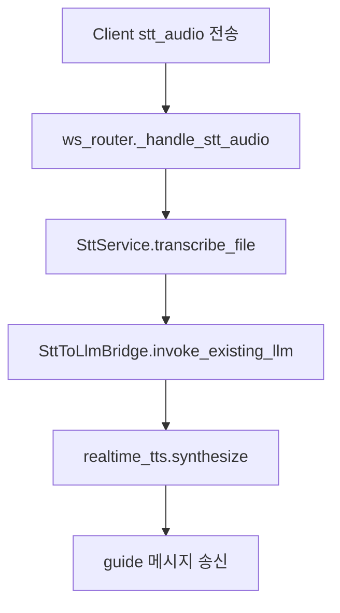

# Minchodan STT 음성명령 연동 가이드

> **작성일**: 2026-07-10
> **버전**: v0.1.0 (신규)
> **범위**: 7단계 골격 외 입력 경로(STT) 운영 가이드
> **관련 코드**: `server/api/ws_router.py`, `server/stt/stt_service.py`, `server/stt/stt_to_llm_bridge.py`

---

## 1. 목적

본 문서는 사용자 음성 명령(STT)을 기존 인지 경로에 안전하게 연결하기 위한 구현/운영 기준을 정의합니다.

| 항목          | 내용                                            |
| :------------ | :---------------------------------------------- |
| **입력 채널** | WebSocket `stt_audio` 메시지                    |
| **출력 채널** | 기존 `guide` 메시지 계약 재사용                 |
| **원칙**      | 반사 경로와 물리적으로 분리, 인지 경로에만 연결 |

---

## 2. 현재 흐름 (코드 기준)



---

## 3. 메시지 계약

### 3.1 입력 (`stt_audio`)

```json
{
  "type": "stt_audio",
  "audio_b64": "UklGR...",
  "model_name": "medium"
}
```

### 3.2 출력 (`guide`)

```json
{
  "type": "guide",
  "event_id": "stt-device123-1720574000",
  "guidance_text": "횡단보도는 30m 앞입니다.",
  "audio_mp3_b64": "UklGR...",
  "audio_codec": "wav",
  "duration_ms": 1540,
  "source": "stt-bridge",
  "ts": 1720574000
}
```

---

## 4. 구현 포인트

| 계층    | 파일                              | 핵심 책임                                                |
| :------ | :-------------------------------- | :------------------------------------------------------- |
| Router  | `server/api/ws_router.py`         | `stt_audio` 수신, 임시 파일 저장, 백그라운드 태스크 분리 |
| Service | `server/stt/stt_service.py`       | 오디오 전사 수행                                         |
| Bridge  | `server/stt/stt_to_llm_bridge.py` | 전사 결과를 기존 가이드 흐름으로 변환                    |
| TTS     | `server/tts/realtime_tts.py`      | 안내 문장 합성 및 오디오 직렬화                          |

---

## 5. 가드레일

| 구분            | 기준                                                                    |
| :-------------- | :---------------------------------------------------------------------- |
| **연결 안정성** | STT 처리 중 heartbeat 타임아웃이 발생하지 않도록 백그라운드 태스크 사용 |
| **예외 처리**   | 전사 실패 시 고정 fallback 문장 송신                                    |
| **경로 분리**   | STT는 인지 경로 전용, 반사 경로 미연동                                  |
| **민감정보**    | 업로드 음성 파일은 처리 후 즉시 삭제                                    |

---

## 6. 테스트 체크리스트

| ID         | 항목        | 기준                               |
| :--------- | :---------- | :--------------------------------- |
| TC-STT-001 | 입력 수신   | `stt_audio` 메시지 파싱 성공       |
| TC-STT-002 | 전사 성공   | 텍스트 출력 비어있지 않음          |
| TC-STT-003 | 브리지 연동 | guidance_text 생성                 |
| TC-STT-004 | 오디오 생성 | `audio_codec=wav`, `duration_ms>0` |
| TC-STT-005 | 예외 폴백   | 실패 시 안내 문장 송신             |

---

## 7. 후속 작업

| 우선순위 | 작업                                             |
| :------- | :----------------------------------------------- |
| 1        | STT 모델 정책(기본 모델, 지연 기준) 고정         |
| 2        | STT 전용 API/운영 로그 분리                      |
| 3        | STT 품질 측정 지표(CER/WER) 수집 파이프라인 추가 |

---

## 8. 참고 문서

- [docs/design/api_specification.md](../design/api_specification.md)
- [docs/ops/test_specification.md](../ops/test_specification.md)
- [docs/research/sensevoice_stt_feasibility.md](../research/sensevoice_stt_feasibility.md)
- [docs/changelogs/jh.md](../changelogs/jh.md)
