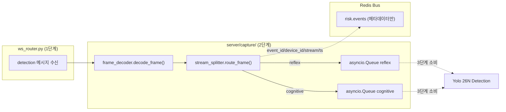
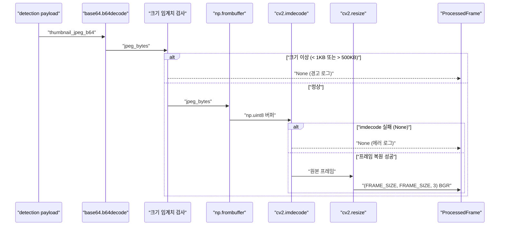

# Minchodan 2단계 카메라 프레임 캡처 백엔드 설계서

> **작성일**: 2026-06-28
> **버전**: v0.1.0
> **설계 기준**: [`docs/minchodan_design_note.md`](minchodan_design_note.md) 2단계 (v1.1 이중 스트림 반영)
> **스킬 참조**: [`.agents/skills/camera-frame-capture/SKILL.md`](../.agents/skills/camera-frame-capture/SKILL.md)
> **코딩 패턴 기준**: [`docs/course_codebase_guide.md`](course_codebase_guide.md)
> **벤치마크 문서**: [`docs/stage3_detection_design.md`](stage3_detection_design.md) (본 문서의 구조·스타일 기준)

---

## 1. 개요

본 문서는 Minchodan 7단계 파이프라인 중 **2단계 (카메라 화면 전송)** 의 백엔드 FastAPI 구현을 위한 상세 설계서입니다. 1단계 WebSocket `/ws/detect` 엔드포인트가 아직 구현되지 않은 상태에서, **2단계 백엔드 모듈만 단위 구현**하여 1단계 작업자가 인터페이스만 맞추면 즉시 연동 가능하도록 합니다.

### 1.1 2단계 정체성

단말(React Native)에서 이중 타이머로 캡처한 JPEG base64 프레임을 WebSocket으로 수신하여, **base64 디코딩 → OpenCV 복원 → 640x640 리사이즈**한 뒤 **이중 스트림(반사/인지)으로 분기**합니다. 반사 스트림(8~10fps)은 3단계 Detection 즉시 경보 용도, 인지 스트림(1~2fps)은 상세 가이드 용도로 분리하여 **이중 경로 물리 분리 원칙**의 첫 분기점을 담당합니다.

### 1.2 핵심 원칙 (비협상)

**이중 경로 물리 분리** — `stream_splitter`는 반사/인지 경로를 엄격히 분기하며, **반사 경로에는 RAG / LLM / 실시간 TTS 모듈을 절대 임포트하지 않습니다.**

| 경로 | 위험도 | 흐름 | 음성 | 목표 지연 |
| --- | --- | --- | --- | --- |
| **반사 (reflex)** | high | 캡처 → WS → 디코딩 → reflex_queue → 3단계 Detection → Reflex Gate → 사전합성 클립 | 사전합성 고정 클립 (선점) | **캡처수신 < 50ms** (2단계) / <300ms (Detection 기준) |
| **인지 (cognitive)** | mid/low | 캡처 → WS → 디코딩 → cognitive_queue → 3단계 Detection+Seg → Redis Streams → LangGraph + RAG → 실시간 TTS | 실시간 합성 상세 가이드 | 1~2Hz |

---

## 2. 구현 범위

본 설계서의 구현 범위는 **`server/capture/`** 로 한정합니다. 1단계는 인터페이스만, 3단계는 소비자로 대기합니다.

| 디렉토리 | 구현 여부 | 비고 |
| --- | --- | --- |
| `server/capture/` | **구현** | 프레임 디코딩 + 이중 스트림 분기 (2단계 핵심) |
| `server/bus/` | **이미 구현됨** | `RedisBus` 싱글턴(`redis_bus`) 재사용, 메타데이터 발행만 담당 |
| `server/api/` | 인터페이스만 | 1단계 작업자가 `ws_router.py`에서 `decode_frame()` / `get_default_splitter()` 호출 |
| `server/detection/` | **이미 구현됨** | 3단계 `DetectionPipeline`이 `reflex_queue` / `cognitive_queue` consumer 시작 |
| `server/orchestration/` | 미구현 | 6단계에서 Redis `risk.events` 소비 |
| `server/tts/` | 미구현 | 7단계에서 ReflexAlert 수신 |

---

## 3. 구현 파일 목록

### 3.1 신규 파일 (4개)

#### `server/capture/` — 프레임 디코딩 + 이중 스트림 분기

| 파일 | 역할 | 핵심 내용 |
| --- | --- | --- |
| `server/capture/__init__.py` | 패키지 초기화 | `ProcessedFrame`, `decode_frame`, `StreamSplitter`, `get_default_splitter` export |
| `server/capture/frame_decoder.py` | 프레임 디코딩 | `ProcessedFrame` dataclass + `decode_frame(payload)` 비동기 함수. base64 → `np.frombuffer` → `cv2.imdecode` → `cv2.resize(FRAME_SIZE, FRAME_SIZE)`. None 가드레일 5종 + 크기 임계치 1~500KB |
| `server/capture/stream_splitter.py` | 이중 스트림 분기 | `StreamSplitter` 클래스 + `get_default_splitter()` 싱글턴. `route_frame(processed)` 로 reflex/cognitive `asyncio.Queue` 분기. Redis에는 메타데이터만 발행 (프레임 원본 비적재, architecture.md 6.1절 준수) |
| `tests/test_frame_decode.py` | 2단계 검증 | TC-CAP-001~009. 유효/무효 프레임, 지연 < 50ms, 스트림 분기, Redis 메타데이터 검증. `pytest` 사용 |

### 3.2 수정 파일

| 파일 | 변경 내용 |
| --- | --- |
| (없음) | 1단계 작업자가 `server/api/ws_router.py`에서 2단계 인터페이스를 호출하므로 2단계 백엔드 코드는 기존 파일을 수정하지 않습니다. `server/main.py`의 WS 라우터 마운트는 1단계 작업자 소관입니다. |

### 3.3 디렉토리 정리

| 작업 | 대상 | 사유 |
| --- | --- | --- |
| 유지 | `server/capture/.gitkeep` | 패키지 자리 표시자 (구현 파일 추가 후에도 유지 권장) |
| (신규 불필요) | — | 2단계는 `server/capture/` 외 새 디렉토리 생성 없음 |

---

## 4. 핵심 설계 결정

### 4.1 이중 스트림 분리 (asyncio.Queue 기반)

**사용자 결정**: in-memory `asyncio.Queue` 방식 채택. 프레임 원본은 프로세스 내 큐로 전달하고 Redis에는 메타데이터만 발행하여 `architecture.md` 6.1절 "프레임 원본을 Redis에 직접 싣지 말 것"을 준수합니다.



> 단일 프로세스 전제 설계. 다중 프로세스 확장 시 SharedMemory 또는 별도 전달 계층 필요 (post-MVP 백로그).

### 4.2 프레임 원본 비적재 원칙 (architecture.md 6.1절)

`SKILL.md` 샘플의 `processed.frame.tobytes().hex()` 방식은 `architecture.md` 6.1절 "프레임 원본을 Redis에 직접 싣지 말 것"을 위반합니다. 본 설계서는 **프레임 원본을 `asyncio.Queue`로 in-process 전달**하고, Redis에는 추적 메타데이터(`event_id`, `device_id`, `stream`, `ts`, `size_kb`)만 발행합니다.

| 항목 | SKILL.md 샘플 | 본 설계서 |
| --- | --- | --- |
| 프레임 전달 | `frame.tobytes().hex()` → Redis | `asyncio.Queue` in-process |
| Redis 적재 | 프레임 바이트 포함 | 메타데이터만 |
| 위반 여부 | architecture.md 6.1절 위반 | 준수 |
| 지연 | Redis 직렬화 오버헤드 | < 1ms (Queue push) |

### 4.3 환경 변수화 (FRAME_SIZE)

`SKILL.md` 샘플의 `TARGET_SIZE = (640, 640)` 하드코딩을 `int(os.getenv("FRAME_SIZE", "640"))`로 환경 변수화합니다. 3단계 `DetectionPipeline.run()` 입력과 정합을 맞추며, 해상도 변경 시 코드 수정 없이 환경 변수만 교체합니다.

### 4.4 1단계 인터페이스 호환 (단위 구현 전략)

**사용자 결정**: 2단계 백엔드만 단위 구현. 1단계 작업자가 `ws_router.py`의 `detection` 메시지 핸들러에서 아래 패턴으로 호출합니다.

```python
from server.capture import decode_frame, get_default_splitter

splitter = get_default_splitter()

# detection 메시지 수신 시
processed = await decode_frame(msg["payload"])
if processed is None:
    continue  # 가드레일: 파이프라인 영속성
await splitter.route_frame(processed)
await ws.send_json({
    "type": "ack",
    "event_id": processed.event_id,
    "frame_id": msg["payload"]["frame_id"],
    "decode_ms": processed.processing_time_ms,
})
```

> 3단계 작업자는 `get_default_splitter().reflex_queue` / `cognitive_queue`를 `asyncio.create_task`로 소비하는 consumer 태스크를 시작합니다.

### 4.5 2·3단계 인터페이스 호환 (duck typing)

`ProcessedFrame.frame`은 `np.ndarray (FRAME_SIZE, FRAME_SIZE, 3) BGR`이며, 3단계 `DetectionPipeline.run()`의 `frame` 매개변수와 duck typing으로 호환됩니다. 3단계 설계서(`docs/stage3_detection_design.md` 4.5절)가 이미 이 호환성을 명시하고 있으므로, 2단계에서 별도 어댑터 없이 `ProcessedFrame`을 큐에 그대로 적재하면 3단계에서 `processed.frame` 속성으로 접근 가능합니다.

---

## 5. 이중 캡처 스트림 설계 (2단계 핵심)

v1.1 설계에 따라 단일 2fps 캡처 대신 **이중 스트림**으로 분리합니다. 백엔드는 단말에서 전송한 `payload.stream` 필드를 신뢰하여 분기합니다.

### 5.1 스트림 분기 로직

| `payload.stream` 값 | 분기 대상 | Redis 발행 | 후속 (3단계) |
| --- | --- | --- | --- |
| `"reflex"` | `reflex_queue` | 메타데이터만 | Detection → Reflex Gate → 사전합성 클립 |
| `"cognitive"` | `cognitive_queue` | 메타데이터만 | Detection + Segmentation → Redis → LangGraph |
| (그 외) | `cognitive_queue` (폴백) | 메타데이터 + 경고 로그 | 인지 경로로 안전 폴백 |

### 5.2 fps 검증 (백엔드 로깅 전용)

백엔드는 단말의 실제 fps를 검증하지 않지만, 로깅으로 모니터링 데이터를 제공합니다. 프레임 도착 간격을 측정하여 목표 fps에서 크게 벗어나면 경고 로그를 발행합니다.

| 스트림 | 목표 fps | 도착 간격 허용 범위 | 이탈 시 |
| --- | --- | --- | --- |
| reflex | 8~10 | 80~125ms | 경고 로그 (운영자 콘솔 확인) |
| cognitive | 1~2 | 400~1000ms | 경고 로그 |

> fps 강제 제어는 단말(React Native) 측 책임이며 백엔드는 모니터링만 담당합니다.

### 5.3 Queue 용량 정책 (백프레셔)

`asyncio.Queue(maxsize=100)` 권장. 3단계 소비가 지연될 때 백프레셔를 주어 메모리 고갈 방지. 큐가 가득 찬 경우 `put_nowait` 시도 후 실패 시 drop + 경고 로그를 발행하여 파이프라인 영속성을 유지합니다.

| 큐 | maxsize | drop 정책 | 근거 |
| --- | --- | --- | --- |
| `reflex_queue` | 100 | 선입선출 drop (오래된 프레임 우회) | reflex는 최신 프레임이 중요 |
| `cognitive_queue` | 100 | drop + 경고 로그 | cognitive는 상세 가이드이므로 지연 시 처리 생략 허용 |

---

## 6. 디코딩 파이프라인

### 6.1 `frame_decoder.py` 핵심 시그니처

```python
@dataclass
class ProcessedFrame:
    event_id: str
    device_id: str
    stream: str            # "reflex" | "cognitive"
    frame: np.ndarray      # (FRAME_SIZE, FRAME_SIZE, 3) BGR
    original_size: tuple[int, int]
    size_kb: float
    processing_time_ms: float
    ts: int                # epoch ms (payload에서 passthrough)

async def decode_frame(payload: dict) -> Optional[ProcessedFrame]:
    """base64 → cv2.imdecode → resize. None 가드레일 포함."""
```

### 6.2 디코딩 절차



### 6.3 가드레일 5종 (guide 17.2)

| 상황 | 처리 | 해당 가드 |
| --- | --- | --- |
| `thumbnail_jpeg_b64` None/빈 문자열 | None 반환 + 경고 로그 | None 가드레일 (17.2 #1) |
| 디코딩 크기 < 1KB 또는 > 500KB | None 반환 + 경고 로그 | 방어적 임계치 |
| `cv2.imdecode` None 반환 | None 반환 + 에러 로그 | None 가드레일 (17.2 #1) |
| `cv2.resize` 예외 | None 반환 + 에러 로그 | 예외 후 루프 유지 (17.2 #4) |
| 전체 예외 | None 반환 + 에러 로그, 파이프라인 영속성 유지 | 예외 후 루프 유지 (17.2 #4) |

---

## 7. 검증 기준

### 7.1 테스트 매트릭스 (test_specification.md TC-CAP 매핑)

**테스트 파일**: `tests/test_frame_decode.py`

| ID | 검증 항목 | 기준 | 상태 |
| --- | --- | --- | --- |
| TC-CAP-001 | 유효 프레임 디코딩 | `frame.shape == (640,640,3)`, `processing_time_ms > 0` | 대기 |
| TC-CAP-002 | 빈 base64 처리 | `decode_frame()` → `None`, 예외 없음 | 대기 |
| TC-CAP-003 | 과대 프레임 거부 | > 500KB → `None` + 경고 로그 | 대기 |
| TC-CAP-004 | 과소 프레임 거부 | < 1KB → `None` + 경고 로그 | 대기 |
| TC-CAP-005 | **캡처수신 지연** | **평균 < 50ms (100회 반복 측정)** | 대기 |
| TC-CAP-006 | reflex 스트림 분기 | `reflex_queue`에 push, `cognitive_queue`는 비어있음 | 대기 |
| TC-CAP-007 | cognitive 스트림 분기 | `cognitive_queue`에 push, `reflex_queue`는 비어있음 | 대기 |
| TC-CAP-008 | Redis 메타데이터만 발행 | 발행 페이로드에 `frame`/`frame_hex` 키 없음 | 대기 |
| TC-CAP-009 | Redis 실패 시 영속성 | Redis 연결 실패 시에도 Queue push는 정상 동작 | 대기 |

### 7.2 이중 경로 분리 검증 (test_specification.md TC-PATH 매핑)

| ID | 검증 항목 | 기준 | 상태 |
| --- | --- | --- | --- |
| TC-PATH-006 | 반사 스트림 RAG/LLM/TTS 임포트 금지 | `stream_splitter.py`에 해당 모듈 import 문 없음 | 대기 |
| TC-PATH-007 | 스트림 분기 독립성 | reflex 분기 시 cognitive Queue 영향 없음 | 대기 |

### 7.3 테스트 실행 명령

```powershell
python -m pytest tests/test_frame_decode.py -v
```

> `pytest`, `pytest-asyncio`는 3단계 설계서에서 이미 `requirements.txt` 추가 승인됨.

---

## 8. 코딩 패턴 준수 사항

본 구현은 [`docs/course_codebase_guide.md`](course_codebase_guide.md)의 코딩 패턴을 엄격히 준수합니다.

| 패턴 | 가이드 섹션 | 적용 파일 | 내용 |
| --- | --- | --- | --- |
| 파일 헤더 인코딩 | 3.1 | 모든 Python 파일 | `# -*- coding: utf-8 -*-` + `sys.stdout.reconfigure(encoding="utf-8")` |
| 임포트 순서 | 3.2 | 모든 Python 파일 | stdlib → 외부(cv2/numpy) → 로컬(`server.bus`) 순서 |
| 경로 처리 | 3.3 | (해당 없음) | 2단계는 경로 의존 적음, 환경 변수만 사용 |
| 환경 변수 로드 | 3.4 | `frame_decoder.py` | `load_dotenv()` + `os.getenv("FRAME_SIZE", "640")` |
| 계층 분리 | 17.1 | 전체 | Router(`api`) → capture(Service) → bus(Repository) |
| None 가드레일 | 17.2 #1 | `frame_decoder.py` | base64 None, imdecode None 가드 |
| Mock 폴백 | 17.2 #3 | (해당 없음) | 2단계는 Mock 불필요 (순수 디코딩) |
| 예외 후 루프 유지 | 17.2 #4 | `stream_splitter.py` | Redis 실패 시 Queue push는 유지 |
| 방어적 dict 접근 | 17.2 #5 | `frame_decoder.py` | `payload.get("key", default)` 패턴 |
| 공통 임포트 헤더 | 17.5 | 모든 Python 파일 | UTF-8 + `load_dotenv()` |
| 이중 경로 분리 강제 | AGENTS.md | `stream_splitter.py` | RAG/LLM/TTS 모듈 임포트 금지 (docstring 명시) |

---

## 9. 데이터 인터페이스

### 9.1 2단계 입력 (1단계 WS에서 전달, api_specification.md §3.1 준수)

```json
{
  "type": "detection",
  "payload": {
    "event_id": "uuid",
    "device_id": "android-xxxx",
    "ts": 1719216000000,
    "frame_id": 42,
    "stream": "reflex",
    "thumbnail_jpeg_b64": "/9j/4AAQ..."
  }
}
```

| 필드 | 타입 | 설명 |
| --- | --- | --- |
| `payload.event_id` | string (UUID) | 이벤트 추적 식별자 |
| `payload.device_id` | string | 단말 식별자 |
| `payload.ts` | int (epoch ms) | 타임스탬프 (passthrough) |
| `payload.frame_id` | int | 프레임 일련 번호 |
| `payload.stream` | string | `reflex` (8~10fps) 또는 `cognitive` (1~2fps) |
| `payload.thumbnail_jpeg_b64` | string | JPEG 압축 base64 프레임 |

### 9.2 2단계 출력 (ack, api_specification.md §3.2 준수)

```json
{
  "type": "ack",
  "event_id": "uuid",
  "frame_id": 42,
  "decode_ms": 12
}
```

| 필드 | 타입 | 설명 |
| --- | --- | --- |
| `decode_ms` | float | 서버 수신·디코딩 소요 시간 (ms) |

### 9.3 2단계 → 3단계 전달 (asyncio.Queue)

| 큐 | 항목 타입 | 소비자 |
| --- | --- | --- |
| `reflex_queue` | `ProcessedFrame` | 3단계 `DetectionPipeline.run()` (reflex 경로) |
| `cognitive_queue` | `ProcessedFrame` | 3단계 `DetectionPipeline.run()` (cognitive 경로) |

> `ProcessedFrame.frame`은 `np.ndarray (FRAME_SIZE, FRAME_SIZE, 3) BGR`이며 3단계 `DetectionPipeline.run(frame=...)`과 duck typing 호환 (stage3_detection_design.md 4.5절).

### 9.4 Redis Streams 발행 (메타데이터만)

```python
redis_bus.publish_event("risk.events", {
    "event_id": processed.event_id,
    "device_id": processed.device_id,
    "stream": processed.stream,
    "ts": str(processed.ts),
    "size_kb": str(processed.size_kb),
    "decode_ms": str(processed.processing_time_ms),
})
```

> **프레임 원본(`frame`, `frame_hex`)은 Redis에 적재하지 않습니다** (architecture.md 6.1절 준수).

---

## 10. 에러 처리 가드레일

| 상황 | 처리 | 적용 파일 |
| --- | --- | --- |
| `payload` None | None 반환 + 경고 로그 | `frame_decoder.py` |
| `thumbnail_jpeg_b64` None/빈 문자열 | None 반환 + 경고 로그 | `frame_decoder.py` |
| 디코딩 크기 임계치 이탈 (< 1KB 또는 > 500KB) | None 반환 + 경고 로그 | `frame_decoder.py` |
| `cv2.imdecode` None 반환 | None 반환 + 에러 로그 | `frame_decoder.py` |
| `cv2.resize` 예외 | None 반환 + 에러 로그 | `frame_decoder.py` |
| 알 수 없는 `stream` 값 | `cognitive_queue`로 폴백 + 경고 로그 | `stream_splitter.py` |
| Redis 연결 실패 | Queue push는 유지, 메타데이터 발행 스킵 + 경고 로그 | `stream_splitter.py` |
| `asyncio.Queue` 가득 참 | `put_nowait` 시도, 실패 시 drop + 경고 로그 | `stream_splitter.py` |

> **Queue 용량 정책**: `asyncio.Queue(maxsize=100)` 권장. 3단계 소비가 지연될 때 백프레셔를 주어 메모리 고갈 방지.

---

## 11. 브랜치 전략

본 작업은 [`docs/git_branching_strategy.md`](git_branching_strategy.md)의 3계층 브랜치 구조를 준수합니다.

| 브랜치 | 역할 | 작업 |
| --- | --- | --- |
| `main` | 운영 기준선 | 직접 push 금지 |
| `dev` | 통합 개발 | PR 머지 대상 |
| `{이니셜}` | 개별 개발 | 본 작업 진행 |

**작업 흐름**:

1. `dev`에서 개인 브랜치 분기 (예: `kb`)
2. 개인 브랜치에서 구현
3. `dev`로 PR 생성
4. 코드 리뷰 후 머지

---

## 12. 의존성 및 전제

### 12.1 선행 의존성

| 의존성 | 상태 | 비고 |
| --- | --- | --- |
| 1단계 WS (`server/api/ws_router.py`) | **미구현** | 2단계 백엔드는 단위 구현, 1단계 작업자가 인터페이스로 연동 |
| `server/bus/redis_client.py` | **구현 완료** | `RedisBus` 싱글턴 재사용, 메타데이터 발행만 |
| Redis 7+ | 실행 필요 | Docker 구성으로 실행 (`docker/docker-compose.yml`) |
| Python 3.13 | 필요 | requirements.txt 기준 |
| `opencv-python` | 필요 | requirements.txt 포함 (3단계에서 이미 추가됨) |
| `numpy>=2.1.0` | 필요 | 3단계 설계서에서 이미 반영됨 |

### 12.2 후속 의존성 (3단계)

| 의존 대상 | 상태 | 연동 포인트 |
| --- | --- | --- |
| 3단계 `DetectionPipeline` | **구현 완료** | `get_default_splitter().reflex_queue` / `cognitive_queue` 소비 |
| 3단계 `ProcessedFrame.frame` duck typing | 호환 | `np.ndarray (640,640,3) BGR` directly 전달 |

### 12.3 환경 변수 (environment_variables.md 2.5절 준수)

| 변수 | 설명 | 기본값 | 사용처 |
| --- | --- | --- | --- |
| `FRAME_SIZE` | 프레임 리사이즈 크기 (정방형) | `640` | `frame_decoder.TARGET_SIZE` |
| `REDIS_URL` | Redis 연결 URL | `redis://localhost:6379` | `redis_bus` (이미 연결됨) |
| `REFLEX_FPS` | 반사 캡처 목표 fps | `10` | 백엔드 로깅/검증용 |
| `COGNITIVE_FPS` | 인지 캡처 목표 fps | `2` | 백엔드 로깅/검증용 |

---

## 13. 참고 자료

| 문서 | 파일 | 참조 내용 |
| --- | --- | --- |
| 설계 노트 (원본) | [`docs/minchodan_design_note.md`](minchodan_design_note.md) | 2단계 11필드 표준 양식 |
| 시스템 아키텍처 | [`docs/architecture.md`](architecture.md) | 5.2절 2단계 컴퍼넌트 상세, 6.1절 프레임 원본 비적재 원칙 |
| API 명세서 | [`docs/api_specification.md`](api_specification.md) | §3 프레임 전송 (detection/ack) |
| 테스트 명세서 | [`docs/test_specification.md`](test_specification.md) | 5.2절 2단계 검증 매트릭스 |
| 파이프라인 단계 설계 | [`docs/pipeline_stage_design.md`](pipeline_stage_design.md) | 5.2절 2단계 핵심 절차, 종단 지연 목표 < 50ms |
| 환경 변수 명세서 | [`docs/environment_variables.md`](environment_variables.md) | 2.5절 탐지 설정 (FRAME_SIZE, REFLEX_FPS, COGNITIVE_FPS) |
| 코딩 패턴 기준 | [`docs/course_codebase_guide.md`](course_codebase_guide.md) | §3, §17 코딩 패턴 (헤더/임포트/가드레일) |
| 에이전트 스킬 | [`.agents/skills/camera-frame-capture/SKILL.md`](../.agents/skills/camera-frame-capture/SKILL.md) | 2단계 구현 가이드, 이중 캡처 스트림 |
| 3단계 설계서 (벤치마크) | [`docs/stage3_detection_design.md`](stage3_detection_design.md) | 본 문서의 구조·스타일 기준, 4.5절 duck typing 호환 |
| Git 브랜칭 전략 | [`docs/git_branching_strategy.md`](git_branching_strategy.md) | 3계층 브랜치 구조 |
