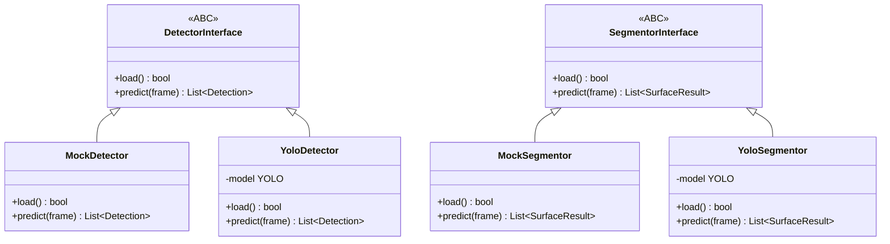
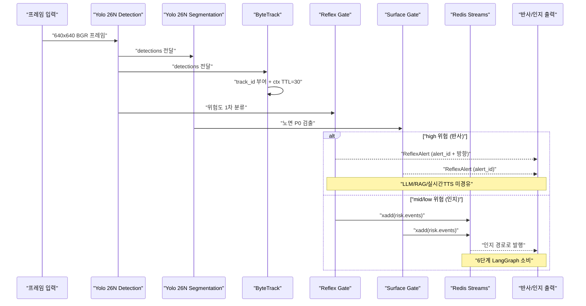

# Minchodan 3단계 탐지·분할·게이트 백엔드 설계서

> **작성일**: 2026-06-25
> **버전**: v0.2.0
> **설계 기준**: [`docs/minchodan_design_note.md`](minchodan_design_note.md) 3단계 (v1.1 듀얼헤드 + 이중 게이트)
> **스킬 참조**: [`.agents/skills/yolo-obstacle-detection/SKILL.md`](../.agents/skills/yolo-obstacle-detection/SKILL.md)
> **코딩 패턴 기준**: [`docs/course_codebase_guide.md`](course_codebase_guide.md)

---

## 1. 개요

본 문서는 Minchodan 7단계 파이프라인 중 **3단계 (AI 장애물 실시간 인식)** 의 백엔드 FastAPI 구현을 위한 상세 설계서입니다. 팀원이 **Yolo 26N - Object Detection / Yolo 26N - Segmentation 모델 학습 중**이라는 전제하에, 가중치 도착 전까지 **Mock Detector + 인터페이스 추상화** 패턴으로 구현하여 가중치 도착 시 교첧만으로 즉시 작동하도록 합니다.

### 1.1 3단계 정체성

2단계(프레임 수신)에서 받은 640x640 BGR 프레임을 **Yolo 26N - Object Detection**으로 추론하여 킥보드, 볼라드, 계단, 차량 등 위험 사물을 탐지하고, **Yolo 26N - Segmentation**으로 노면 상태를 분할하며, **ByteTrack**으로 Track ID를 부여합니다. **이중 게이트**(Reflex Gate + Surface Gate) 룰로 위험도를 1차 분류하여 반사 경로(즉시 경보)와 인지 경로(상세 가이드)로 분기합니다.

### 1.2 핵심 원칙 (비협상)

**이중 경로 물리 분리** — 반사 경로에는 **LLM / RAG / 실시간 TTS를 절대 경유시키지 않습니다.** 반사 음성은 사전합성 고정 클립만 사용합니다.

| 경로 | 위험도 | 흐름 | 음성 | 목표 지연 |
| --- | --- | --- | --- | --- |
| **반사** | high | Detection → Reflex Gate / Surface Gate → 사전합성 클립 | 사전합성 고정 클립 (선점) | <300ms (Detection 기준) |
| **인지** | mid/low | Detection+Seg → ByteTrack → `xadd("risk.events")` → LangGraph + RAG → 실시간 TTS | 실시간 합성 상세 가이드 | 1~2Hz |

---

## 2. 구현 범위

본 설계서의 구현 범위는 **`server/detection/` + `server/bus/`** 로 한정합니다. 1·2단계는 인터페이스만 맞추고, 가중치는 Mock 폶백으로 대체합니다.

| 디렉토리 | 구현 여부 | 비고 |
| --- | --- | --- |
| `server/detection/` | **구현** | 탐지·분할·추적·게이트 파이프라인 (3단계 핵심) |
| `server/bus/` | **구현** | Redis Streams 인터페이스 (3단계 의존) |
| `server/api/` | 인터페이스만 | 1단계 WS 산출물이 전달하는 프레임 형식만 맞춤 |
| `server/capture/` | 인터페이스만 | 2단계 `ProcessedFrame.frame` (numpy 640x640 BGR) duck typing 호환 |
| `server/orchestration/` | 미구현 | 6단계에서 Redis `risk.events` 소비 |
| `server/tts/` | 미구현 | 7단계에서 ReflexAlert 수신 |

---

## 3. 구현 파일 목록

### 3.1 신규 파일 (17개)

#### `server/detection/` — 탐지·분할·추적·게이트

| 파일 | 역할 | 핵심 내용 |
| --- | --- | --- |
| `server/detection/__init__.py` | 패키지 초기화 | 주요 모듈 export |
| `server/detection/config.py` | 3단계 설정 | `load_dotenv()` + `YOLO_CONF`, `FRAME_SIZE`, 모델 경로 계산 (`__file__` 기반, guide 3.3) |
| `server/detection/schemas.py` | Pydantic 스키마 | `BBox`, `Detection`, `SurfaceResult`, `RiskEvent`, `DetectionResult`, `ReflexAlert` (api_specification.md §6 + SKILL.md 스키마 준수) |
| `server/detection/detector_interface.py` | 추상 인터페이스 | `DetectorInterface` (ABC), `SegmentorInterface` (ABC) — Mock/Yolo 핫스왑 |
| `server/detection/mock_detector.py` | Mock 구현 | `MockDetector`, `MockSegmentor` — 가중치 없을 때 가짜 탐지 결과 반환 (guide 17.2 Mock 폶백) |
| `server/detection/yolo_detector.py` | Yolo 26N Detection | `YoloDetector` — `ultralytics.YOLO` 로드 + `predict(conf=0.35)` + boxes 파싱. 로드 실패 시 Mock 폶백 |
| `server/detection/yolo_segmentor.py` | Yolo 26N Segmentation | `YoloSegmentor` — `ultralytics.YOLO` 로드 + masks 파싱. 노면 클래스 분리(C2) 준수 |
| `server/detection/bytetrack_tracker.py` | ByteTrack 래퍼 | `ByteTrackTracker` — `ultralytics` 내장 `model.track(persist=True, tracker='bytetrack.yaml')` 사용. track_id 부여 + Redis 컨텍스트 연동 |
| `server/detection/gates/__init__.py` | 게이트 패키지 | export |
| `server/detection/gates/reflex_gate.py` | Reflex Risk Gate | 룰베이스, **LLM 미경유**. 고위험 클래스 + 근접(하단 15%) → `alert_id` + 방향 |
| `server/detection/gates/surface_gate.py` | Surface Fast-Alert Gate | 룰베이스, **LLM 미경유**. P0 노면 하단 검출 → `alert_id` |
| `server/detection/detection_pipeline.py` | 파이프라인 오케스트레이션 | `DetectionPipeline` 클래스 — 프레임 입력 → Detection → Segmentation → ByteTrack → 이중 게이트 분기. **방어적 코딩**: None 가드레일, 무탐지 빈 리스트, Redis 실패 시 탐지 결과 정상 반환 |

#### `server/bus/` — Redis Streams 인터페이스

| 파일 | 역할 | 핵심 내용 |
| --- | --- | --- |
| `server/bus/__init__.py` | 패키지 초기화 | export |
| `server/bus/redis_client.py` | Redis 연결 풀 | `RedisBus` 클래스 — `redis.asyncio` 기반, `connect()`, `publish_event()` (`xadd`), `set_track_context()` (`hset`+`expire 30`), `get_track_context()` (`hgetall`). 연결 실패 시 no-op 가드레일 |
| `server/bus/producer.py` | 이벤트 발행 | `RiskEventProducer` — `xadd("risk.events", {...})` 래핑, Track 컨텍스트 TTL=30 관리 |

#### 테스트

| 파일 | 역할 | 핵심 내용 |
| --- | --- | --- |
| `tests/test_detection.py` | 3단계 검증 | TC-DET-001~010. MockDetector 기반으로 게이트 분기, 빈 리스트, Redis 발행 검증. `pytest` 사용 |
| `tests/__init__.py` | 테스트 패키지 | 패키지 인식 |

### 3.2 수정 파일 (2개)

| 파일 | 변경 내용 |
| --- | --- |
| `.env.example` | v1.1 기준 통일: `YOLO26_WEIGHTS` → `YOLO26N_OBJECT_DET=server/models/yolo26n/object_detection.pt`, `SEGFORMER_WEIGHTS` → `YOLO26N_SEG=server/models/yolo26n/segmentation.pt`. `DETECTOR_TYPE=mock` 추가. SegFormer 잔재 제거 |
| `requirements.txt` | `pytest`, `pytest-asyncio` 추가. Python 3.13 호환을 위해 `numpy>=2.1.0` 반영 |

### 3.3 디렉토리 정리

| 작업 | 대상 | 사유 |
| --- | --- | --- |
| 신규 생성 | `server/models/yolo26n/.gitkeep` | v1.1 기준 모델 경로 |
| 제거 | `server/models/yolo26/` | 구 버전 잔재 (v1.1 미반영) |
| 제거 | `server/models/segformer/` | SegFormer 잔재 (v1.1은 Yolo 26N - Segmentation 사용) |

---

## 4. 핵심 설계 결정

### 4.1 추상화 계층 (가중치 핫스왑)

팀원이 모델 학습 중이므로 가중치 파일이 없는 상태에서도 파이프라인 전체 흐름을 검증할 수 있도록 **인터페이스 추상화 + Mock 폶백** 패턴을 적용합니다.



`DetectionPipeline`은 `DetectorInterface`와 `SegmentorInterface`에 의존하므로, 가중치 도착 후 `MockDetector` → `YoloDetector`로 교첧만 하면 작동합니다. `config.py`의 팩토리 함수가 환경 변수와 파일 존재 여부로 적절한 구현체를 반환합니다.

**팩토리 패턴 (config.py)**:

```python
def get_detector() -> DetectorInterface:
    weights_path = os.getenv("YOLO26N_OBJECT_DET")
    if weights_path and os.path.exists(weights_path):
        return YoloDetector(weights_path)
    logger.warning("[Detector] 가중치 없음, MockDetector 사용")
    return MockDetector()
```

### 4.2 ByteTrack — ultralytics 내장 사용

SKILL.md는 `from bytetracker import ByteTracker`를 명시하지만, `requirements.txt`에 `bytetracker` 패키지가 누락되어 있습니다. 본 설계서는 **ultralytics 내장 `model.track()`** 을 사용하여 별도 패키지 설치 없이 ByteTrack 추적을 구현합니다.

**구현 방식**:

```python
results = model.track(source=frame, persist=True, tracker="bytetrack.yaml", conf=0.35)
# track_id는 result.boxes.id에서 추출
# persist=True 로 세션 간 Track ID 유지
```

`persist=True` 옵션으로 동일 모델 인스턴스 내에서 Track ID가 유지되며, Redis 컨텍스트(`hset` + `expire 30`)와 연동하여 접근/이탈 및 속도를 산출합니다.

> **참고**: `model.track()`은 `YoloDetector` 낶에서만 사용 가능하므로, `ByteTrackTracker`는 `YoloDetector`의 추론 결과(`result.boxes.id`)를 받아 track_id를 파싱하는 래퍼로 설계합니다. `MockDetector` 사용 시 track_id는 None으로 처리됩니다.

### 4.3 이중 경로 분리 원칙 (비협상)

`detection_pipeline.py`에서 위험도에 따라 엄격히 분기합니다. 반사 경로는 **LLM / RAG / 실시간 TTS를 절대 경유하지 않습니다.**



**분기 로직 (detection_pipeline.py)**:

| 위험도 | 게이트 | 행동 | 반환 |
| --- | --- | --- | --- |
| `high` | Reflex Gate | **LLM/RAG 미경유**, 사전합성 클립 즉시 재생 (7단계 반사 경로) | `ReflexAlert` 객체 |
| `high` | Surface Gate | **LLM/RAG 미경유**, 사전합성 클립 즉시 재생 (7단계 반사 경로) | `ReflexAlert` 객체 |
| `mid` | (게이트 통과) | Redis Streams `xadd("risk.events")` 발행 → 인지 경로 | `DetectionResult` (risk_hint="mid") |
| `low` | (게이트 통과) | Redis Streams `xadd("risk.events")` 발행 → 인지 경로 | `DetectionResult` (risk_hint="low") |

### 4.4 방어적 코딩 매트릭스 (guide 17.2 + AGENTS.md)

AGENTS.md의 **"프레임 버퍼/디코딩 결과가 None인 경우 반드시 가드레일 처리. 무탐지 시 에러 없이 빈 리스트 반환(파이프라인 영속성)"** 원칙을 준수합니다.

| 상황 | 처리 | 해당 가드 |
| --- | --- | --- |
| 프레임 `None` | 추론 스킵, 빈 `DetectionResult` 반환 | None 가드레일 (17.2 #1) |
| 모델 파일 없음 | `MockDetector`로 폶백, 로그 경고 | Mock 폶백 (17.2 #3) |
| Redis 연결 실패 | 컨텍스트 업데이트 스킵, 탐지 결과는 정상 반환 | 예외 후 루프 유지 (17.2 #4) |
| 무탐지 | 에러 없이 빈 리스트 반환 (파이프라인 영속성) | None 가드레일 (17.2 #1) |
| ByteTrack 초기화 실패 | track_id=None으로 탐지 결과만 반환 | 예외 후 루프 유지 (17.2 #4) |
| 디코딩 실패 (`cv2.imdecode` None) | 빈 `DetectionResult` 반환 | None 가드레일 (17.2 #1) |
| Redis `hset`/`expire` 예외 | 로그 경고 후 스킵, 탐지 결과는 정상 반환 | 예외 후 루프 유지 (17.2 #4) |

**방어적 코드 예시 (detection_pipeline.py)**:

```python
async def run(self, frame, stream, event_id, device_id) -> DetectionResult:
    if frame is None:
        logger.warning("[Pipeline] 프레임 None, 빈 결과 반환")
        return DetectionResult(event_id=event_id, detections=[], surface=[],
                               risk_hint="none", inference_ms=0.0)

    try:
        detections = self.detector.predict(frame)
    except Exception as e:
        logger.error(f"[Pipeline] Detection 실패: {e}")
        detections = []

    if not detections:
        return DetectionResult(event_id=event_id, detections=[], surface=[],
                               risk_hint="none", inference_ms=elapsed)
```

### 4.5 1·2단계 인터페이스 호환

`DetectionPipeline.run()` 입력은 numpy 배열(640x640 BGR)을 받도록 설계하여 2단계 `ProcessedFrame.frame`과 duck typing으로 호환됩니다. 2단계 구현 시 별도 어댑터 없이 직접 전달 가능합니다.

**입력 인터페이스**:

```python
async def run(
    self,
    frame: np.ndarray,        # (640, 640, 3) BGR — 2단계 ProcessedFrame.frame 호환
    stream: str,              # "reflex" 또는 "cognitive" — 2단계 ProcessedFrame.stream 호환
    event_id: str,            # 이벤트 추적 식별자 (UUID)
    device_id: str,           # 단말 식별자
) -> DetectionResult | ReflexAlert:
```

**출력 인터페이스 (api_specification.md §6 준수)**:

```python
class DetectionResult(BaseModel):
    event_id: str
    detections: List[Detection]     # [{class_name, confidence, bbox, track_id}]
    surface: List[SurfaceResult]    # [{class_name, mask|centroid}]
    risk_hint: str                  # "high" | "mid" | "low" | "none"
    inference_ms: float

class ReflexAlert(BaseModel):
    event_id: str
    alert_id: str                   # "high_front", "surface_crosswalk", ...
    direction: str                  # "front" | "left" | "right" | "stop"
    risk_level: str = "high"
    clip: str                       # "reflex_clips/high_front.mp3"
    haptic: bool = True
    ts: float
```

---

## 5. 노면 클래스 분리 (C2)

v1.1 설계에 따라 노면 클래스를 **독립 클래스로 분리**합니다. 같은 클래스로 묶으면 파손 학습이 불가하므로 분리가 필수입니다.

| 클래스 | 설명 | 게이트 | 위험도 |
| --- | --- | --- | --- |
| `braille_normal` | 점자블록 정상 | (해당 없음) | low |
| `braille_damaged` | 점자블록 파손 | Surface Gate (P0) | high |
| `sidewalk_normal` | 복도 정상 | (해당 없음) | low |
| `sidewalk_damaged` | 복도 파손 | (해당 없음) | mid |
| `crosswalk` | 횡단복도 | Surface Gate (P0) | high |
| `roadway` | 차도 | (주의) | mid |
| `caution` | 계단/맨홀/그레이팅 | Surface Gate (P0) | high |

> **참고**: `caution` 클래스는 stairs/manhole/grating을 포함하는 통합 클래스입니다. 팀원 학습 시 별도 클래스로 분리할지 통합할지는 학습 데이터에 따라 결정하며, 본 설계서는 SKILL.md 기준으로 `caution` 통합 클래스를 따릅니다.

---

## 6. 이중 게이트 규칙

### 6.1 Reflex Risk Gate (룰베이스, LLM 미경유)

**입력**: `Detection` 객체, 프레임 높이/너비
**출력**: `ReflexAlert` 또는 `None`

| 조건 | 임계값 | 결과 |
| --- | --- | --- |
| 고위험 클래스 | `car`, `truck`, `bus`, `motorcycle` | 1차 통과 |
| 근접 (하단) | bbox 하단 y > 프레임 높이 × (1 - 0.15) | 2차 통과 → `alert_id` 발행 |
| 방향 추정 | bbox 중심 x 기준 | x < width/3 → `left`, x > width×2/3 → `right`, else → `front` |

**고위험 클래스 정의**:

```python
HIGH_RISK_CLASSES = {"car", "truck", "bus", "motorcycle"}
PROXIMITY_THRESHOLD = 0.15  # 프레임 하단 면적 비율
```

### 6.2 Surface Fast-Alert Gate (룰베이스, LLM 미경유)

**입력**: `List[SurfaceResult]`, 프레임 높이
**출력**: `ReflexAlert` 또는 `None`

| 조건 | 임계값 | 결과 |
| --- | --- | --- |
| P0 노면 클래스 | `crosswalk`, `manhole`, `stair`, `grating`, `braille_damaged` | 1차 통과 |
| 하단 검출 | centroid y > 프레임 높이 × 0.6 | 2차 통과 → `alert_id` 발행 |

**P0 노면 클래스 정의**:

```python
P0_SURFACE_CLASSES = {
    "crosswalk", "manhole", "stair", "grating", "braille_damaged"
}
```

### 6.3 alert_id 사전 정의 (api_specification.md §4.2 준수)

| `alert_id` | 방향 | 트리거 | 게이트 |
| --- | --- | --- | --- |
| `high_front` | front | 고위험 객체 근접 (전방) | Reflex Gate |
| `high_left` | left | 고위험 객체 근접 (좌측) | Reflex Gate |
| `high_right` | right | 고위험 객체 근접 (우측) | Reflex Gate |
| `high_stop` | stop | 고위험 객체 근접 (정지) | Reflex Gate |
| `surface_crosswalk` | front | 횡단복도 하단 검출 | Surface Gate |
| `surface_manhole` | front | 맨홀 하단 검출 | Surface Gate |
| `surface_stairs` | front | 계단 하단 검출 | Surface Gate |
| `surface_grating` | front | 그레이팅 하단 검출 | Surface Gate |
| `surface_braille_damaged` | front | 점자블록 파손 하단 검출 | Surface Gate |

---

## 7. 검증 기준

### 7.1 테스트 매트릭스 (test_specification.md TC-DET 매핑)

**테스트 파일**: `tests/test_detection.py`

| ID | 검증 항목 | 기준 | Mock 대응 | 상태 |
| --- | --- | --- | --- | --- |
| TC-DET-001 | Yolo 26N Detection 킥보드 추론 | `conf≈0.87` | MockDetector 고정 conf 반환 | 대기 |
| TC-DET-002 | track_id 부여 | ByteTrack `update()` → track_id | Mock + ByteTrack 래퍼 | Mock 검증 완료 |
| TC-DET-003 | Detection 추론 지연 | **< 80ms** | Mock 즉시 반환, Yolo는 가중치 도착 후 측정 | 대기 |
| TC-DET-004 | Yolo 26N Segmentation 마스크 | 노면 의미분할 마스크 생성 | MockSegmentor 가짜 마스크 | 대기 |
| TC-DET-005 | Reflex Gate 분기 | 고위험+근접 → `alert_id`+방향 | 룰베이스 테스트 (Mock 결과 주입) | 완료 |
| TC-DET-006 | Surface Gate 분기 | P0 노면 하단 검출 → `alert_id` | 룰베이스 테스트 | 완료 |
| TC-DET-007 | Redis 컨텍스트 TTL | 30초 후 Track ctx 키 자동 삭제 | Redis 가드레일 테스트 | 대기 |
| TC-DET-008 | mid/low 발행 | `xadd("risk.events")` 정상 | `xadd` 호출 검증 | 완료 |
| TC-DET-009 | 무탐지 빈 리스트 | 에러 없이 빈 리스트 반환 | None 프레임 입력, Detector/Segmentor/Tracker 예외 | 완료 |
| TC-DET-010 | 노면 클래스 분리 (C2) | `braille_damaged` 독립 클래스 검출 | MockSegmentor 클래스 검증 | 대기 |

### 7.2 이중 경로 분리 검증 (test_specification.md TC-PATH 매핑)

| ID | 검증 항목 | 기준 | 상태 |
| --- | --- | --- | --- |
| TC-PATH-001 | 반사 경로 LLM 미경유 | Reflex/Surface Gate에 LLM 호출 없음 | 완료 |
| TC-PATH-002 | 반사 경로 RAG 미경유 | 반사 메시지에 RAG 검색 없음 | 완료 |
| TC-PATH-003 | 반사 경로 실시간 TTS 미사용 | 사전합성 클립만 사용 | 완료 |
| TC-PATH-004 | 인지 경로 Redis Streams 경유 | `xadd("risk.events")` → `xread` | 발행 완료 |
| TC-PATH-005 | 선점 우선순위 | 반사 WS 고우선 타입 > 인지 | 대기 |

### 7.3 테스트 실행 명령

```powershell
python -m pytest tests/test_detection.py -v
```

> **참고**: `pytest`는 `requirements.txt`에 추가 필요 (AGENTS.md 금지 사항 #3: 사전 허가 없는 라이브러리 추가 금지). 본 설계서에서 승인된 항목입니다.

---

## 8. 코딩 패턴 준수 사항

본 구현은 [`docs/course_codebase_guide.md`](course_codebase_guide.md)의 코딩 패턴을 엄격히 준수합니다.

| 패턴 | 가이드 섹션 | 적용 파일 | 내용 |
| --- | --- | --- | --- |
| 파일 헤더 인코딩 | 3.1 | 모든 Python 파일 | `# -*- coding: utf-8 -*-` + `sys.stdout.reconfigure` |
| 임포트 순서 | 3.2 | 모든 Python 파일 | stdlib → 외부 → 로컬 순서 |
| 경로 처리 | 3.3 | `config.py`, `yolo_detector.py`, `yolo_segmentor.py` | `os.path.dirname(os.path.abspath(__file__))` 기반 |
| 환경 변수 로드 | 3.4 | `config.py` | `load_dotenv()` + `os.getenv(..., default)` |
| 계층 분리 | 17.1 | 전체 | Pipeline → Gate → Bus (Router → Service → Repository 유사) |
| None 가드레일 | 17.2 #1 | `detection_pipeline.py`, `yolo_detector.py` | 프레임 None, 디코딩 None 가드 |
| Mock 폶백 | 17.2 #3 | `config.py`, `mock_detector.py` | 가중치 없을 시 Mock 구현체 사용 |
| 예외 후 루프 유지 | 17.2 #4 | `detection_pipeline.py`, `redis_client.py` | Redis 실패 시 탐지 결과 정상 반환 |
| 방어적 dict 접근 | 17.2 #5 | `schemas.py`, `gates/` | `data.get("key", default)` 패턴 |
| 공통 임포트 헤더 | 17.5 | 모든 Python 파일 | UTF-8 + `load_dotenv()` |

---

## 9. 데이터 인터페이스

### 9.1 3단계 입력 (2단계에서 전달)

| 방향 | 타입 | 포맷 |
| --- | --- | --- |
| In | `np.ndarray` | (640, 640, 3) BGR 프레임 |
| In | `str` | `stream`: "reflex" 또는 "cognitive" |
| In | `str` | `event_id`: UUID |
| In | `str` | `device_id`: 단말 식별자 |

### 9.2 3단계 출력 (api_specification.md §6 준수)

**반사 경로 (high 위험)**:

```json
{
  "event_id": "uuid",
  "alert_id": "high_front",
  "direction": "front",
  "risk_level": "high",
  "clip": "reflex_clips/high_front.mp3",
  "haptic": true,
  "ts": 1719216000000
}
```

**인지 경로 (mid/low 위험) — `DetectionResult`**:

```json
{
  "event_id": "uuid",
  "detections": [
    {
      "class_name": "kickboard",
      "confidence": 0.87,
      "bbox": [120, 200, 280, 360],
      "track_id": 3
    }
  ],
  "surface": [
    {
      "class_name": "crosswalk",
      "mask": "...",
      "centroid": [320, 580]
    }
  ],
  "risk_hint": "mid",
  "inference_ms": 72
}
```

### 9.3 Redis Streams 발행 (mid/low)

```python
redis_bus.xadd("risk.events", {
    "event_id": event_id,
    "track_id": detection.track_id or "unknown",
    "class_name": detection.class_name,
    "confidence": str(detection.confidence),
    "bbox": json.dumps(detection.bbox),
    "speed": str(detection.speed or 0),
    "direction": detection.direction or "unknown",
    "risk": risk_hint,
    "timestamp": str(time.time())
})
```

### 9.4 Redis Track 컨텍스트 (TTL=30)

```python
redis_bus.hset(f"ctx:{track_id}", mapping={
    "last_pos": json.dumps(track["bbox"]),
    "speed": str(speed),
    "direction": direction,
    "class_name": track["class_name"],
})
redis_bus.expire(f"ctx:{track_id}", 30)
```

---

## 10. 에러 처리 가드레일

| 상황 | 처리 | 적용 파일 |
| --- | --- | --- |
| 모델 파일 없음 | 서버 시작 실패 + 로그 경고, Mock 폶백 | `config.py`, `yolo_detector.py` |
| 프레임이 None | 추론 스킵, 빈 detections 반환 | `detection_pipeline.py` |
| Detector 추론 예외 | 빈 detections로 진행, Segmentor 결과는 유지 | `detection_pipeline.py` |
| Segmentor 추론 예외 | 빈 surface로 진행, Detector 결과는 유지 | `detection_pipeline.py` |
| Redis 연결 실패 | 컨텍스트 업데이트 스킵, 탐지 결과는 정상 반환 | `redis_client.py`, `bytetrack_tracker.py` |
| CUDA OOM | CPU 폶백 (`device='cpu'`) | `yolo_detector.py`, `yolo_segmentor.py` |
| ByteTrack 초기화 실패 | Track ID 없이 탐지 결과만 반환 | `bytetrack_tracker.py` |
| Tracker Redis 예외 | speed/direction 기본값으로 탐지 결과 반환 | `bytetrack_tracker.py` |
| 무탐지 | 에러 없이 빈 리스트 반환 (파이프라인 영속성) | `detection_pipeline.py` |

---

## 11. 브랜치 전략

본 작업은 [`docs/git_branching_strategy.md`](git_branching_strategy.md)의 3계층 브랜치 구조를 준수합니다.

| 브랜치 | 역할 | 작업 |
| --- | --- | --- |
| `main` | 운영 기준선 | 직접 push 금지 |
| `dev` | 통합 개발 | PR 머지 대상 |
| `{이니셜}` | 개별 개발 | 본 작업 진행 |

**작업 흐름**:

1. `dev`에서 개인 브랜치 분기 (예: `kb`)
2. 개인 브랜치에서 구현
3. `dev`로 PR 생성
4. 코드 리뷰 후 머지

---

## 12. 의존성 및 전제

### 12.1 팀원 가중치 도착 시 교체 포인트

| 교체 대상 | 교체 후 | 작업 |
| --- | --- | --- |
| `MockDetector` | `YoloDetector` | `server/models/yolo26n/object_detection.pt` 파일 배치 후 자동 전환 (config.py 팩토리) |
| `MockSegmentor` | `YoloSegmentor` | `server/models/yolo26n/segmentation.pt` 파일 배치 후 자동 전환 |
| `test_detection.py` Mock 테스트 | 실제 가중치 테스트 | Mock 테스트는 유지, 별도 통합 테스트 추가 |

### 12.2 선행 의존성

| 의존성 | 상태 | 비고 |
| --- | --- | --- |
| 1단계 WS (`server/api/`) | 미구현 | 인터페이스만 맞춤 (프레임 전달은 2단계 가정) |
| 2단계 프레임 디코더 (`server/capture/`) | 미구현 | `ProcessedFrame.frame` (numpy 640x640 BGR) duck typing 호환 |
| Redis 7+ | 실행 필요 | Docker 구성으로 실행 (`docker/docker-compose.yml`) |
| Python 3.13 | 필요 | requirements.txt 기준 |
| `ultralytics>=8.3` | 필요 | requirements.txt 포함 |
| GPU (Blackwell sm_120) | 권장 | Mock 사용 시 불필요, Yolo 사용 시 CUDA 12.8 + cu128 필수 |

### 12.3 환경 변수 (.env.example 수정)

| 변수 | 설명 | 기본값 |
| --- | --- | --- |
| `YOLO_CONF` | Yolo 26N - Object Detection 신뢰도 임계값 | `0.35` |
| `FRAME_SIZE` | 프레임 리사이즈 크기 | `640` |
| `REFLEX_FPS` | 반사 캡처 목표 fps | `10` |
| `COGNITIVE_FPS` | 인지 캡처 목표 fps | `2` |
| `YOLO26N_OBJECT_DET` | Yolo 26N - Object Detection 가중치 경로 | `server/models/yolo26n/object_detection.pt` |
| `YOLO26N_SEG` | Yolo 26N - Segmentation 가중치 경로 | `server/models/yolo26n/segmentation.pt` |
| `REDIS_URL` | Redis 연결 URL | `redis://localhost:6379` |

---

## 13. 참고 자료

| 문서 | 파일 | 참조 내용 |
| --- | --- | --- |
| 설계 노트 (원본) | [`docs/minchodan_design_note.md`](minchodan_design_note.md) | 3단계 11필드 표준 양식 |
| 시스템 아키텍처 | [`docs/architecture.md`](architecture.md) | 5.3절 3단계 컴포넌트 상세, 이중 경로 동작 모드 |
| API 명세서 | [`docs/api_specification.md`](api_specification.md) | §4 반사 경로 메시지, §6 탐지 결과 상세 |
| 테스트 명세서 | [`docs/test_specification.md`](test_specification.md) | 5.3절 3단계 검증 매트릭스, §6 이중 경로 분리 검증 |
| 파이프라인 단계 설계 | [`docs/pipeline_stage_design.md`](pipeline_stage_design.md) | 5.3절 3단계 핵심 절차, run mode |
| 코딩 패턴 기준 | [`docs/course_codebase_guide.md`](course_codebase_guide.md) | §3, §9, §10, §17 코딩 패턴 |
| 에이전트 스킬 | [`.agents/skills/yolo-obstacle-detection/SKILL.md`](../.agents/skills/yolo-obstacle-detection/SKILL.md) | 3단계 구현 가이드, 노면 클래스 분리(C2) |
| Git 브랜칭 전략 | [`docs/git_branching_strategy.md`](git_branching_strategy.md) | 3계층 브랜치 구조 |
