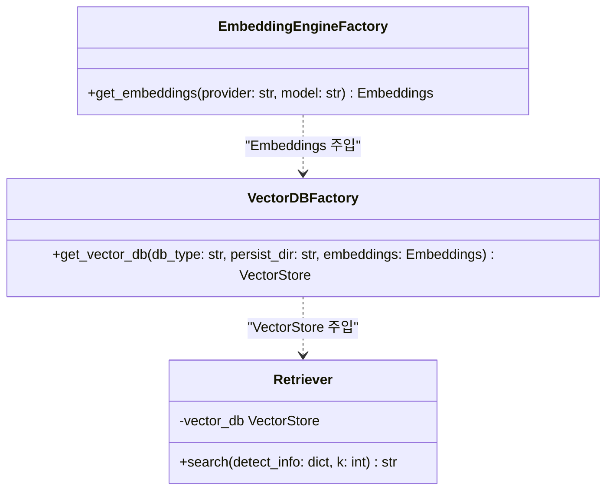
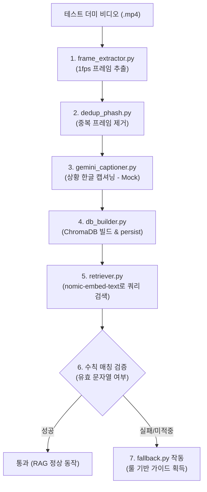

# Minchodan 4·5단계 RAG 백엔드 설계서

> **작성일**: 2026-06-26
> **버전**: v0.2.0
> **설계 기준**: [`docs/minchodan_design_note.md`](minchodan_design_note.md) 4·5단계
> **스킬 참조**: [`.agents/skills/rag-knowledge-builder/SKILL.md`](../.agents/skills/rag-knowledge-builder/SKILL.md), [`.agents/skills/rag-realtime-search/SKILL.md`](../.agents/skills/rag-realtime-search/SKILL.md)
> **코딩 패턴 기준**: [`docs/course_codebase_guide.md`](course_codebase_guide.md)

---

## 1. 개요

본 문서는 Minchodan 7단계 파이프라인 중 **4단계 (위험 대처 수칙 DB 구축)** 및 **5단계 (실시간 대처 수칙 검색)** 의 백엔드 스켈레톤 및 단위 테스트를 위한 상세 기술 설계서입니다. 본 설계의 핵심 목적은 모듈 간 데이터 계약(Data Contract)과 인터페이스가 정상 작동하는지 검증하고, GPU 가중치나 외부 서비스가 준비되지 않은 상태에서도 오프라인 파이프라인과 실시간 RAG 검색 흐름이 끝까지 동작할 수 있도록 뼈대를 구축하는 것입니다.

### 1.1 4단계 정체성
- 보행 위험 환경(킥보드, 볼라드, 계단 등)의 영상/이미지 데이터로부터 프레임을 추출하고, 중복을 제거한 뒤, VLM(Llava)을 이용하여 한글 상황 묘사 캡션을 생성합니다.
- 생성된 캡션과 인간 검수를 거친 안전 대처 수칙을 로컬 임베딩 모델(nomic-embed-text)을 통해 벡터화하여 로컬 Vector DB(ChromaDB)에 구축(인덱싱)하는 오프라인 배치 프로세스입니다.

### 1.2 5단계 정체성
- 3단계에서 실시간으로 탐지된 사물 정보를 바탕으로 쿼리(예: `"kickboard 보행 중 회피 방법"`)를 생성합니다.
- 생성된 쿼리를 로컬 임베딩 모델로 벡터화하여, 4단계에서 구축한 로컬 Vector DB에서 50ms 이내에 유사한 행동 수칙을 검색하여 6단계(LangGraph) 컨텍스트로 제공하는 실시간 온프레미스 검색 프로세스입니다.

---

## 2. 설계 원칙

본 RAG 모듈 설계 시 반드시 준수해야 하는 비협상 설계 원칙은 다음과 같습니다.

### 2.1 임베딩 분리 원칙 (★ 핵심 아키텍처)
- **4단계 VLM 캡셔닝**: `gemini-2.5-flash-lite` 모델을 기본으로 설정합니다. (단, 캡션 품질 향상이 필요할 경우 상위 모델인 `gemini-2.5-flash`로 핫스왑할 수 있도록 코드 내 주석으로 가이드를 제공합니다.)
- **5단계 실시간 검색 및 4단계 인덱싱**: **클라우드 API 사용을 금지하고, 로컬 임베딩 모델인 nomic-embed-text를 사용합니다.**
  - **이유 1**: 50ms 실시간 RAG 검색 제약 요건을 충족하기 위함입니다.
  - **이유 2**: 4단계 인덱싱 벡터 공간과 5단계 검색 쿼리 벡터 공간을 일치시키기 위함입니다.
- **임베딩 엔진 추상화**: 호출부는 `EmbeddingEngineFactory`로 랩핑하여 향후 다른 로컬 모델로 교체할 수 있도록 분리합니다. 단, 임베딩 모델 변경 시 기존에 인덱싱된 Vector DB 데이터와 호환되지 않으므로 4단계를 재실행하여 전체 재인덱싱이 필요함을 명시합니다.

### 2.2 이중 경로 물리 분리 준수
- 5단계 RAG 검색은 **인지 경로(mid/low 위험)**의 상세 가이드 생성을 위한 필수 컨텍스트 수집에만 사용됩니다.
- **반사 경로(high 위험)**는 어떠한 경우에도 LLM/RAG/실시간 TTS 과정을 경유하지 않으며, 사전합성된 고정 경보 클립만을 단말에서 즉시 재생합니다.

---

## 3. 구현 범위 및 파일 구조

### 3.1 구현 파일 목록

본 작업의 구현 범위는 **`server/rag/` + `tests/`** 폴더에 작성될 파일로 제한합니다.

```
server/rag/
├── shared/
│   └── labels.py                  # 3단계-4/5단계 간 공유 라벨 SSOT
├── build/                          # 4단계 (오프라인 빌드)
│   ├── frame_extractor.py          # 비디오 파일에서 프레임 추출
│   ├── dedup_phash.py              # pHash 알고리즘 기반 중복 프레임 제거
│   ├── gemini_captioner.py         # VLM(Gemini) API를 사용한 상황 캡셔닝
│   └── db_builder.py               # 프레임 전처리, 캡션 추출, ChromaDB 적재 오케스트레이션
├── vector_db_factory.py            # 5단계 — DB 엔진 추상화 (Chroma <-> Qdrant)
├── embedding_engine_factory.py     # 5단계 — 임베딩 엔진 추상화 (Ollama nomic-embed-text)
├── retriever.py                    # 5단계 — 실시간 수칙 검색 엔진
└── fallback.py                     # 5단계 — RAG 검색 미적중 시 룰 기반 안전망

tests/
├── test_frame_extractor.py         # 프레임 추출 동작 검증
├── test_dedup_phash.py             # 중복 제거 동작 검증
├── test_gemini_captioner.py        # Gemini API mock 테스트
├── test_db_builder.py              # ChromaDB 적재 흐름 검증
├── test_vector_db_factory.py       # DB 팩토리 생성/연결 검증
├── test_embedding_engine_factory.py# 임베딩 팩토리 연동 검증
├── test_retriever.py               # 실시간 수칙 검색 단위 테스트
├── test_fallback.py                # 룰 기반 안전망 단위 테스트
└── test_e2e_pipeline.py            # 4 -> 5단계 E2E 더미 파이프라인 통합 테스트
```

---

## 4. 데이터 인터페이스 및 스키마

### 4.1 라벨 SSOT (Single Source of Truth)
- 파일 경로: `server/rag/shared/labels.py`
- 3단계 YOLO 탐지 클래스명 문자열을 Enum 또는 상수로 일원화하여 정의합니다.
- **SSOT 라벨 목록**:
  - `KICKBOARD` = "kickboard"
  - `BOLLARD` = "bollard"
  - `BRAILLE_DAMAGED` = "braille_damaged"
  - `STAIRS` = "stairs"
  - `CROSSWALK` = "crosswalk"
  - `MANHOLE` = "manhole"
  - `GRATING` = "grating"
- 4단계 메타데이터 생성 모듈, 5단계 Retriever 검색 모듈, `fallback.py`의 `FALLBACK_RULES` 딕셔너리 등 전반적인 코드베이스는 반드시 이 SSOT 라벨을 참조하여 하드코딩으로 인한 라벨 불일치를 방지합니다.

### 4.2 메타데이터 스키마
Vector DB 적재 및 Retriever 검색에 쓰이는 메타데이터 딕셔너리는 다음의 4개 필수 필드를 가집니다.

| 필드명 | 데이터 타입 | 설명 | 제약 사항 |
| --- | --- | --- | --- |
| **`scene_type`** | `str` | 장애물 상황 분류 | `labels.py` 정의 상수 중 하나여야 함 |
| **`risk_level`** | `str` | 위험도 강도 | `"high"` \| `"mid"` \| `"low"` 중 하나여야 함 |
| **`objects`** | `List[str]` | 화면 내 검출된 모든 사물 목록 | 각 요소는 `labels.py` 정의 상수여야 함 |
| **`guidance_template`** | `str` | 인간 검수 대처 수칙 템플릿 | 6단계 LangGraph에 제공될 가이드의 기본 구조 |

---

## 5. 핵심 클래스 설계 (추상화 및 구조)

`VectorDBFactory`와 `EmbeddingEngineFactory`를 철저히 분리하여 설계함으로써 DB 엔진 변경과 임베딩 모델 변경이 서로의 책임을 침범하지 않도록 구성합니다.



### 5.1 EmbeddingEngineFactory
- **역할**: Ollama, OpenAI 등 적절한 임베딩 인스턴스를 동적으로 생성 및 반환합니다.
- **특징**: `nomic-embed-text` 모델을 통한 로컬 처리를 기본값으로 갖습니다.

### 5.2 VectorDBFactory
- **역할**: Chroma 또는 Qdrant 인스턴스를 동적으로 생성 및 반환합니다.
- **특징**: 생성자 또는 메서드 매개변수로 외부에서 생성된 `Embeddings` 인스턴스를 명시적으로 주입받아 처리합니다. (내부에서 직접 임베딩 인스턴스를 선언하지 않음)

---

## 6. 스켈레톤 함수 및 예외 처리 설계

### 6.1 프레임 추출기 (`frame_extractor.py`)
```python
# -*- coding: utf-8 -*-
import sys
import os
from dotenv import load_dotenv

load_dotenv()
sys.stdout.reconfigure(encoding="utf-8")

def extract_frames(video_path: str, output_dir: str, fps: int = 1) -> list:
    """
    비디오 파일에서 지정된 fps 간격으로 프레임을 추출하여 디스크에 저장합니다.
    
    Args:
        video_path: 입력 비디오 파일 경로
        output_dir: 프레임 저장 디렉토리 경로
        fps: 초당 프레임 수
        
    Returns:
        추출된 프레임 이미지 파일 경로 리스트
        
    Raises:
        FileNotFoundError: 비디오 파일이 없을 경우 발생
        ValueError: 비디오 디코딩 실패 시 발생 (비협상 가드)
    """
    # TODO(human-decision): 영상 비트레이트 및 해상도 최적화 전략 수립 필요
    # [DUMMY DATA] 설명: 테스트용 OpenCV 합성 비디오 경로 / 주의: 실제 위험 상황 비디오 100건 이상 확보 시 교체 필요
    pass
```

### 6.2 pHash 중복 제거 (`dedup_phash.py`)
```python
# -*- coding: utf-8 -*-
import sys
from dotenv import load_dotenv

load_dotenv()
sys.stdout.reconfigure(encoding="utf-8")

def filter_duplicates(image_paths: list, threshold: int = 5) -> list:
    """
    pHash (Perceptual Hash) 값을 비교하여 중복되거나 매우 유사한 프레임을 필터링합니다.
    
    Args:
        image_paths: 프레임 파일 경로 리스트
        threshold: 해밍 거리 임계값 (이 값 이하로 가까우면 중복으로 판단)
        
    Returns:
        중복이 제거된 고유 프레임 이미지 파일 경로 리스트
    """
    pass
```

### 6.3 Gemini 캡셔너 (`gemini_captioner.py`)
```python
# -*- coding: utf-8 -*-
import sys
import os
from dotenv import load_dotenv

load_dotenv()
sys.stdout.reconfigure(encoding="utf-8")

def generate_caption(image_path: str) -> str:
    """
    Gemini 2.5 Flash Lite VLM을 사용하여 보행 환경 이미지의 한글 상황 묘사 캡션을 생성합니다.
    
    Args:
        image_path: 캡셔닝할 이미지 파일 경로
        
    Returns:
        한글 상황 묘사 캡션 문자열
        
    Raises:
        ValueError: GOOGLE_API_KEY 미설정 시 명확한 에러 메시지와 함께 발생 (비협상 가드)
        RuntimeError: API 호출 실패 및 네트워크 오류 발생 시 발생
    """
    # TODO(human-decision): gemini-2.5-flash-lite 성능 검증 후 필요시 gemini-2.5-flash로 업그레이드 검토
    # [DUMMY DATA] 설명: 실제 Gemini Vision API 응답 / 주의: 한글 상황 묘사 1~2문장의 가짜 캡션 문자열 반환
    pass
```

### 6.4 VectorDBFactory (`vector_db_factory.py`)
```python
# -*- coding: utf-8 -*-
import sys
from dotenv import load_dotenv
from langchain_core.embeddings import Embeddings

load_dotenv()
sys.stdout.reconfigure(encoding="utf-8")

class VectorDBFactory:
    """
    Chroma, Qdrant 등 다중 Vector DB 인스턴스를 생성하는 팩토리 클래스입니다.
    """
    @staticmethod
    def get_vector_db(db_type: str, persist_directory: str, embeddings: Embeddings):
        """
        요구되는 DB 타입에 적합한 VectorStore 객체를 생성하여 반환합니다.
        
        Args:
            db_type: "chroma" | "qdrant"
            persist_directory: 데이터 영구 저장 경로
            embeddings: 주입받을 외부 임베딩 엔진 객체 (직접 생성 금지)
            
        Returns:
            VectorStore 구현 인스턴스
            
        Raises:
            FileNotFoundError: 저장 경로가 존재하지 않거나 쓰기 권한이 없을 경우 발생 (비협상 가드)
            ValueError: 지원하지 않는 db_type 지정 시 발생
        """
        pass
```

### 6.5 Retriever (`retriever.py`)
```python
# -*- coding: utf-8 -*-
import sys
from dotenv import load_dotenv
from langchain_core.vectorstores import VectorStore

load_dotenv()
sys.stdout.reconfigure(encoding="utf-8")

# TODO(latency): 로컬 임베딩 적용 후에도 실제 50ms 실측은 아직 진행되지 않았음.
# 이번 스켈레톤 단계에서는 성능 튜닝/캐싱을 시도하지 않음.

class Retriever:
    def __init__(self, vector_db: VectorStore):
        self.vector_db = vector_db
        
    def search_guidance(self, detect_info: dict, k: int = 5) -> str:
        """
        실시간 탐지 정보를 바탕으로 Vector DB에서 안전 대처 수칙을 검색합니다.
        검색 실패 혹은 타임아웃 발생 시, 시스템 중단을 막기 위해 빈 문자열을 반환하고 fallback으로 연결되도록 합니다.
        
        Args:
            detect_info: 3단계 YOLO 결과 딕셔너리 (class_name 필수 포함)
            k: 검색할 유사 문서 개수
            
        Returns:
            유사도가 매칭된 대처 수칙 내용 결합 텍스트 (실패 시 "")
        """
        # [DUMMY DATA] 설명: Retriever 테스트용 detect_info 입력 / 주의: class_name은 shared/labels.py 기준을 준수해야 함
        pass
```

### 6.6 Fallback (`fallback.py`)
```python
# -*- coding: utf-8 -*-
import sys
from dotenv import load_dotenv
from rag.shared.labels import KICKBOARD, BOLLARD, BRAILLE_DAMAGED, STAIRS, CROSSWALK, MANHOLE, GRATING

load_dotenv()
sys.stdout.reconfigure(encoding="utf-8")

# [DUMMY DATA] 설명: MVP 검증용 룰 기반 수칙 딕셔너리 / 주의: 키 이름은 shared/labels.py에서 import한 상수를 사용해야 함
FALLBACK_RULES = {
    KICKBOARD: "킥보드가 근처에 있습니다. 충돌 위험이 있으니 잠시 속도를 줄이고 좌우를 살피며 우회하세요.",
    BOLLARD: "전방에 보행 방해물인 볼라드가 존재합니다. 보폭을 줄이고 옆으로 비껴 지나가세요.",
    BRAILLE_DAMAGED: "점자블록이 유실 또는 파손된 구간입니다. 발끝의 감각과 지팡이 신호에 집중하여 천천히 전진하세요."
}

def get_fallback_guidance(class_name: str) -> str:
    """
    RAG 검색 실패 혹은 매칭 스코어가 현저히 낮을 경우 동작하는 룰 기반 대체 가이드를 반환합니다.
    
    Args:
        class_name: 탐지된 사물 클래스 명칭 (labels.py 기준)
        
    Returns:
        상황별 지정된 즉시 경보 가이드 문자열
    """
    pass
```

---

## 7. 검증 및 테스트 시나리오

### 7.1 단위 테스트 작성 방안
- **pytest**를 기본 테스트 프레임워크로 지정하여 구현합니다.
- Gemini API, 외부 네트워크 연동 지점 등 비용과 할당량이 발생하는 외부 호출은 `unittest.mock.patch`를 이용해 철저히 모킹합니다.
- **ChromaDB 검증**: 임시 파일 디렉토리(`tmp_path` fixture)에 DB를 적재하여 실제 인덱싱과 검색 흐름을 완전히 독립된 격리 환경에서 테스트합니다.
- **Ollama 연동**: 로컬에 Ollama 데몬 및 모델이 없을 시 테스트가 깨지지 않고 graceful하게 skip되도록 예외 처리를 포함합니다.

### 7.2 E2E 파이프라인 시나리오 (`test_e2e_pipeline.py`)
더미 비디오로부터 RAG 검색 완료까지의 연속적인 4→5단계 전체 데이터 흐름을 하나로 연계하여 검증합니다.


