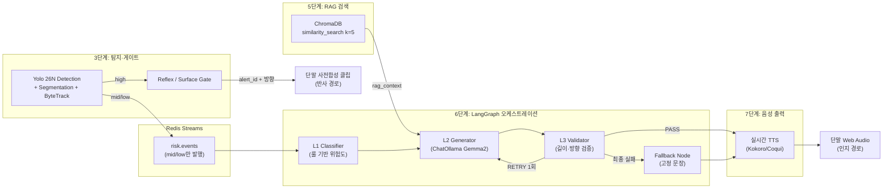
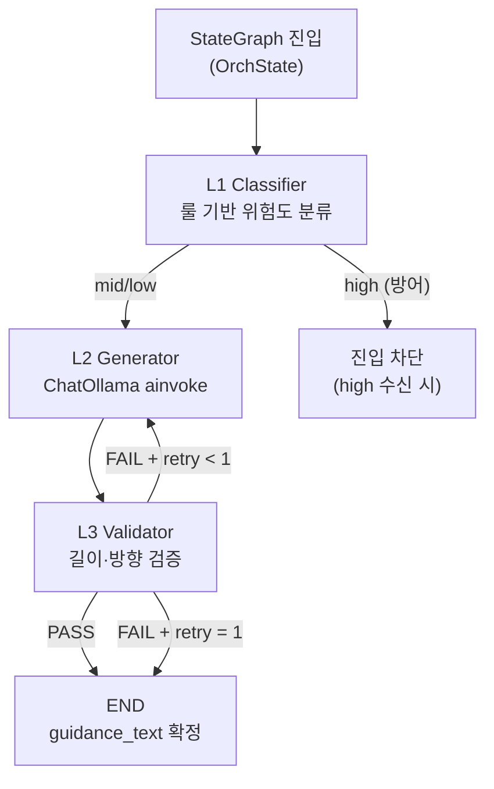

# 6단계 설계서 - 종합 회피 가이드 생성 (LangGraph 계층 LLM)

> **작성일**: 2026-06-26
> **버전**: v0.1.0
> **설계 기준**: [`docs/minchodan_design_note.md`](minchodan_design_note.md) 6단계, [`docs/architecture.md`](architecture.md) 5.6절
> **코딩 패턴 기준**: [`docs/course_codebase_guide.md`](course_codebase_guide.md) 섹션 11, 12, 14, 17.2
> **스킬 참조**: [`.agents/skills/llm-guidance-orchestrator/SKILL.md`](../.agents/skills/llm-guidance-orchestrator/SKILL.md)

---

## 1. 개요 및 핵심 가치

**6단계**는 3단계(Yolo 26N - Object Detection)에서 탐지된 장애물 정보와 5단계(RAG)에서 검색된 행동 수칙을 종합하여, 로컬 **Gemma2 모델**로 시각장애인이 즉시 이해할 수 있는 **20자 이내 한국어 1문장 회피 안내**를 생성하는 단계입니다.

| 핵심 가치 | 설명 |
| --------- | ---- |
| **네트워크 RTT 제거** | Ollama 로컬 추론으로 네트워크 왕복 지연 제거 |
| **토큰 API 비용 제로** | 상용 API 미사용 (fallback 시에만 gpt-4o-mini 호출) |
| **가드레일 검증** | 생성문의 길이·방향 키워드·안전성 자동 검증 |
| **이중 경로 준수** | high 위험도는 3단계 게이트에서 반사 경로로 이미 처리, L1은 mid/low만 진입 |

> **비협상 원칙**: 반사 경로(high)에는 LLM/RAG/실시간 TTS를 절대 경유시키지 않습니다. 6단계는 **인지 경로(mid/low) 전용** 모듈입니다.

---

## 2. 시스템 내 위치



---

## 3. 기술 스택

| 구성 요소 | 기술 | 버전/모델 | 비고 |
| --------- | ---- | --------- | ---- |
| LLM (기본) | Ollama Gemma2 | `gemma2:9b` | 로컬 추론, temperature=0.3 |
| LLM (Fallback) | OpenAI GPT-4o-mini | `gpt-4o-mini` | 핫스왑, max_tokens=50 |
| 오케스트레이션 | LangGraph | `>= 0.2.x` | StateGraph + 조건부 엣지 |
| LLM 래퍼 | LangChain | `>= 0.3` | ChatOllama / ChatOpenAI |
| 추상화 | LLMClientFactory | `BaseChatModel` | Ollama ↔ OpenAI 핫스왑 |
| 환경 변수 | python-dotenv | - | `LLM_PROVIDER`, `OPENAI_API_KEY` |

---

## 4. 디렉토리 구조

```
server/orchestration/
├── __init__.py
├── state.py                   # OrchState TypedDict
├── graph.py                   # StateGraph 조립, 노드 등록, 엣지 정의
├── llm_client_factory.py      # BaseChatModel Ollama ↔ gpt-4o-mini 핫스왑
└── nodes/
    ├── __init__.py
    ├── l1_classifier.py       # L1: 룰 기반 위험도 분류 (mid/low만 진입)
    ├── l2_generator.py        # L2: ChatOllama(Gemma2) ainvoke
    ├── l3_validator.py        # L3: 길이·방향 검증, RETRY(최대 1회)
    └── fallback_node.py       # 최종 실패 → 고정 문장
```

| 파일 | 역할 | 코딩 패턴 규거 |
| ---- | ---- | -------------- |
| `state.py` | `OrchState` TypedDict 정의 | guide 3.1(UTF-8 헤더), 3.2(임포트 순서) |
| `graph.py` | StateGraph 조립, 엔트리포인트, 조건부 엣지 | guide 14(LangGraph) |
| `llm_client_factory.py` | `LLMClientFactory` 클래스, 환경 변수 로드 | guide 3.3(경로), 3.4(.env), 17.2(방어적) |
| `nodes/l1_classifier.py` | 룰 기반 위험도 분류 함수 | guide 17.2(None 가드레일) |
| `nodes/l2_generator.py` | Gemma2 ainvoke, 프롬프트 조립 | guide 11(LLM), 12(LCEL) |
| `nodes/l3_validator.py` | 가드레일 검증, RETRY 카운터 | guide 17.2(예외 후 루프 유지) |
| `nodes/fallback_node.py` | 고정 문장 반환 | guide 17.2(Mock 폴백) |

---

## 5. OrchState 데이터 모델

`OrchState`는 LangGraph의 상태 컨테이너로, 3단계 입력 + 5단계 RAG 컨텍스트 + 내부 처리 상태를 포함합니다.

| 필드 | 타입 | 출처 | 설명 |
| ---- | ---- | ---- | ---- |
| `event` | `dict` | 3단계 Redis Streams | RiskEvent 원본 payload |
| `detected_classes` | `List[str]` | 3단계 파싱 | 탐지된 클래스명 목록 |
| `risk_level` | `Literal["high","mid","low"]` | L1 출력 | 위험도 분류 결과 |
| `rag_context` | `str` | 5단계 RAG | 검색된 행동 수칙 결합 텍스트 |
| `positions` | `List[str]` | 3단계 파싱 | 객체 위치 방향(선택) |
| `guidance_text` | `str` | L2 출력 | 생성된 가이드 문장 |
| `direction` | `Literal["좌","우","직진","정지",""]` | L2 추출 | 방향 키워드 |
| `verified` | `bool` | L3 출력 | 검증 통과 여부 |
| `retry_count` | `int` | L3 출력 | 재시도 횟수 (최대 1) |
| `validation_errors` | `List[str]` | L3 출력 | 검증 오류 메시지 |
| `used_fallback_llm` | `bool` | L2 출력 | gpt-4o-mini 사용 여부 |
| `used_static_fallback` | `bool` | Fallback 출력 | 고정 문장 사용 여부 |
| `total_latency_ms` | `float` | graph 출력 | 총 지연 시간 |

> **코딩 패턴**: TypedDict는 `total=False`로 선언하여 모든 필드를 선택적으로 취급합니다 (guide 14 패턴). 이는 LangGraph 노드가 부분 상태만 반환해도 병합 오류가 발생하지 않도록 보장합니다.

---

## 6. 연동 계약 (인터페이스)

### 6.1 입력 - 3단계 Redis Streams (구현 기반)

3단계 `RiskEventProducer.publish_detection()`(`server/bus/producer.py`)가 발행하는 Redis Streams payload를 6단계 consumer가 수신하여 `OrchState`로 변환합니다.

| Redis Streams 필드 | 타입 | OrchState 매핑 | 비고 |
| ------------------ | ---- | -------------- | ---- |
| `event_id` | `str` | `event["event_id"]` | 이벤트 추적 ID |
| `track_id` | `str` | `event["track_id"]` | ByteTrack ID |
| `class_name` | `str` | `detected_classes[0]` | 탐지 클래스명 |
| `confidence` | `str` | `event["confidence"]` | 신뢰도 (float 변환) |
| `bbox` | `str(JSON)` | `event["bbox"]` | 바운딩박스 (JSON 파싱) |
| `speed` | `str` | `event["speed"]` | 객체 속도 |
| `direction` | `str` | `positions[0]` | 객체 이동 방향 |
| `risk` | `str` | `risk_level` 후보 | "mid" 또는 "low" |
| `timestamp` | `str` | `event["timestamp"]` | 발행 시각 |

> **참고**: 3단계 `detection_pipeline.py`의 `_publish_cognitive()`는 `risk_hint in ("mid","low")`일 때만 발행하므로, 6단계는 high를 수신하지 않습니다. 단, 방어적 코딩을 위해 L1에서 high가 수신된 경우 진입을 차단하는 가드를 유지합니다.

### 6.2 입력 - 5단계 RAG (인터페이스 가정)

> **주의**: 5단계 RAG 검색 모듈은 현재 **미구현** 상태입니다. 본 섹션은 5단계 구현 시 준수해야 할 입력 계약을 사전 정의합니다.

| 방향 | 페이로드 | 타입 |
| ---- | -------- | ---- |
| In | 탐지 클래스명 (String) | `class_name` |
| Out | 결합 컨텍스트 (String) | `rag_context` |

**5단계 인터페이스 가정**:

```python
# server/rag/retriever.py (5단계 구현 시 준수 계약)
def retrieve_rag_context(class_name: str, k: int = 5) -> str:
    """탐지 클래스로 행동 수칙을 검색해 결합 텍스트 반환.

    Args:
        class_name: 3단계 탐지 클래스 (예: "kickboard", "bollard")
        k: Top-K 검색 개수 (기본 5)

    Returns:
        결합된 행동 수칙 컨텍스트 (String).
        미적중 시 룰 기반 fallback 문자열 반환 (중단 금지).
    """
```

6단계 L2 노드는 `state.get("rag_context", "관련 수칙 없음")`로 방어적 접근합니다. 5단계가 미구현된 상태에서는 기본값 `"관련 수칙 없음"`이 사용됩니다.

### 6.3 출력 - 7단계 TTS

| 방향 | 페이로드 | 타입 | 비고 |
| ---- | -------- | ---- | ---- |
| Out | `guidance_text` | `str` | 20자 이내 한국어 1문장, 방향 포함 |

7단계 실시간 TTS는 `guidance_text`를 수신하여 Kokoro/Coqui로 음성 합성 후 base64 MP3로 WebSocket 전송합니다.

---

## 7. 3계층 아키텍처 상세



### 7.1 L1 노드 - 룰 기반 위험도 분류

| 항목 | 내용 |
| ---- | ---- |
| **목적** | 탐지 클래스 기반 위험도 분류, high 차단 |
| **입력** | `detected_classes: List[str]` |
| **출력** | `risk_level: str`, `retry_count: int = 0` |
| **핵심 규칙** | mid 클래스 집합 정의, high 수신 시 차단(방어) |

**MID_RISK_CLASSES 집합** (3단계 `detection_pipeline.py`의 `_classify_risk`와 정합):

| 클래스 | 위험도 | 비고 |
| ------ | ------ | ---- |
| `kickboard` | mid | 3단계 `_classify_risk` mid 분류 |
| `bollard` | mid | 3단계 `_classify_risk` mid 분류 |
| `bicycle` | mid | L1 확장 |
| `pothole` | mid | L1 확장 |
| `manhole` | mid | L1 확장 |
| `construction_cone` | mid | L1 확장 |
| (기타) | low | 기본값 |

> **코딩 패턴**: L1은 LLM을 호출하지 않는 **순수 룰베이스** 노드입니다. `state.get("detected_classes", [])`로 None 가드레일을 적용합니다 (guide 17.2).

### 7.2 L2 노드 - Gemma2 가이드 생성

| 항목 | 내용 |
| ---- | ---- |
| **목적** | RAG + 탐지 결합 프롬프트로 20자 내 한국어 1문장 생성 |
| **입력** | `detected_classes`, `risk_level`, `rag_context` |
| **출력** | `guidance_text: str`, `direction: str`, `used_fallback_llm: bool` |
| **핵심 함수** | `LLMClientFactory.get_client()`, `llm.ainvoke(messages)` |
| **방향 추출** | `extract_direction(text)` - 키워드 매칭 |

**방향 키워드 매핑**:

| 방향 | 키워드 |
| ---- | ------ |
| `좌` | 좌측, 좌, 왼쪽 |
| `우` | 우측, 우, 오른쪽 |
| `직진` | 직진, 앞으로 |
| `정지` | 정지, 멈추, 서세요 |

> **코딩 패턴**: `ainvoke` 호출은 `async` 함수로 작성합니다 (guide 11.4 비동기 LLM 호출 패턴). `LLMClientFactory`는 싱글톤 패턴으로 인스턴스를 재사용하여 초기화 오버헤드를 제거합니다.

### 7.3 L3 노드 - 가드레일 검증

| 항목 | 내용 |
| ---- | ---- |
| **목적** | 생성문 길이·방향·한국어 포함 검증, RETRY 제어 |
| **입력** | `guidance_text: str`, `retry_count: int` |
| **출력** | `verified: bool`, `validation_errors: List[str]`, `retry_count` |
| **상수** | `MAX_LEN = 20`, `MAX_RETRY = 1` |

**검증 규칙**:

| # | 규칙 | 위반 시 오류 메시지 |
| - | ---- | ------------------- |
| 1 | 빈 문장 여부 | `"빈 문장"` |
| 2 | 길이 <= 20자 (공백 포함) | `"길이 초과: {n}자 > 20자"` |
| 3 | 방향 키워드 포함 | `"방향 키워드 미포함"` |
| 4 | 한국어 문자 포함 | `"한국어 미포함"` |

**RETRY 로직**:

| 조건 | 동작 |
| ---- | ---- |
| 검증 통과 | `verified=True`, END로 라우팅 |
| 검증 실패 + `retry < MAX_RETRY` | `retry_count += 1`, L2로 재진입 |
| 검증 실패 + `retry = MAX_RETRY` | 고정 문장 `"전방 주의, 천천히 멈추세요"` 반환, `used_static_fallback=True` |

> **코딩 패턴**: L3 검증은 LLM을 호출하지 않는 **순수 함수**입니다. `retry_count` 상태를 통해 무한 루프를 방지합니다 (guide 17.2 예외 후 루프 유지 패턴).

### 7.4 Fallback 노드 - 최종 실패 고정 문장

| 항목 | 내용 |
| ---- | ---- |
| **목적** | 모든 시도 실패 시 안전한 고정 문장 반환 |
| **출력** | `guidance_text="전방 주의, 천천히 멈추세요"`, `direction="정지"`, `used_static_fallback=True`, `verified=True` |
| **고정 문장** | `"전방 주의, 천천히 멈추세요"` (16자, 정지 키워드 포함) |

> **비협상 원칙**: Fallback 노드는 프레임워크 정지를 방지하는 최후의 안전망입니다. 어떤 예외 상황에서도 6단계 파이프라인은 문자열을 반환해야 합니다 (guide 17.2 Mock 폴백 패턴).

---

## 8. LangGraph StateGraph 조립

### 8.1 노드 등록 및 엣지 정의

| 노드 ID | 함수 | 비고 |
| ------- | ---- | ---- |
| `l1_classify` | `l1_classifier_node` | 엔트리포인트 |
| `l2_generate` | `l2_generator_node` | LLM ainvoke |
| `l3_validate` | `l3_validator_node` | 검증 + RETRY 제어 |

| 엣지 | from → to | 조건 |
| ---- | --------- | ---- |
| 엔트리 | `START` → `l1_classify` | 고정 |
| 순차 | `l1_classify` → `l2_generate` | 고정 |
| 순차 | `l2_generate` → `l3_validate` | 고정 |
| 조건부 | `l3_validate` → `l2_generate` | `verified=False` (RETRY) |
| 조건부 | `l3_validate` → `END` | `verified=True` |

### 8.2 조건부 라우팅 함수

```python
def route_after_l3(state: dict) -> str:
    """L3 검증 결과에 따라 L2 재시도 또는 END로 라우팅."""
    if state.get("verified"):
        return "end"
    return "l2_generate"
```

### 8.3 컴파일된 그래프 캐싱

```python
_compiled = None

def get_orchestrator():
    """컴파일된 StateGraph 싱글톤 반환 (초기화 오버헤드 제거)."""
    global _compiled
    if _compiled is None:
        _compiled = build_graph()
    return _compiled
```

> **코딩 패턴**: `get_orchestrator()`는 모듈 수준 싱글톤 패턴입니다. 3단계 `DetectionPipeline`의 의존성 주입 패턴과 대비되나, LangGraph 컴파일 객체는 상태를 가지지 않으므로 싱글톤이 안전합니다.

---

## 9. LLMClientFactory 핫스왑

### 9.1 라우팅 조건

| 조건 | 전환 대상 | 트리거 |
| ---- | --------- | ------ |
| 기본 | `ChatOllama(gemma2:9b)` | `LLM_PROVIDER=ollama` (기본값) |
| 강제 전환 | `ChatOpenAI(gpt-4o-mini)` | `LLM_PROVIDER=openai` 환경 변수 |
| L3 실패율 > 10% | `ChatOpenAI(gpt-4o-mini)` | 자동 전환 (모니터링 기반) |
| 최종 실패 | 고정 문장 | Fallback Node |

### 9.2 클래스 구조

| 메서드 | 반환 타입 | 비고 |
| ------ | --------- | ---- |
| `get_ollama()` | `ChatOllama` | 싱글톤, `temperature=0.3`, `num_predict=50` |
| `get_openai()` | `ChatOpenAI` | 싱글톤, `temperature=0.3`, `max_tokens=50` |
| `get_client(provider)` | `BaseChatModel` | provider에 따른 분기 |

> **방어적 코딩**: `get_openai()`는 `OPENAI_API_KEY` 환경 변수 부재 시 `ValueError`를 발생시킵니다 (guide 17.2 API 키 검증 패턴). 단, 6단계 파이프라인은 이 예외를 상위에서 포착하여 Fallback Node로 우회합니다.

### 9.3 환경 변수

| 변수 | 설명 | 기본값 |
| ---- | ---- | ------ |
| `LLM_PROVIDER` | LLM 공급자 (`ollama` 또는 `openai`) | `ollama` |
| `OLLAMA_BASE_URL` | Ollama 서버 주소 | `http://localhost:11434` |
| `GEMMA_MODEL` | L2 가이드 생성 모델 | `gemma2:9b` |
| `OPENAI_API_KEY` | OpenAI 전환 시 필요 | (미설정) |

---

## 10. 프롬프트 설계

### 10.1 시스템 프롬프트

```
당신은 시각장애인 보행 보조 AI입니다.
탐지된 장애물 정보와 안전 수칙을 바탕으로 즉각적인 회피 안내를 생성합니다.

[규칙]
1. 반드시 한국어 1문장으로 작성
2. 20자 이내 (공백 포함)
3. 방향 키워드(좌/우/직진/정지) 중 하나를 반드시 포함
4. 존댓말(~하세요, ~세요) 사용
5. 간결하고 즉시 이해 가능한 표현 사용

[좋은 예시]
- "좌측으로 피하세요" (9자)
- "우측 보도로 이동하세요" (11자)
- "전방 주의, 정지하세요" (11자)
```

### 10.2 사용자 프롬프트 템플릿

```
[탐지 장애물]: {detected_classes}
[위험도]: {risk_level}
[안전 수칙]:
{rag_context}

위 정보를 바탕으로 20자 이내 한국어 1문장 회피 안내를 작성하세요.
```

> **temperature 전략**: `temperature=0.3`으로 일관성과 안전성을 우선합니다 (guide 11.2 temperature 전략 - 요약/설명문 0.7보다 낮춰 안전 가이드의 일관성 확보). MVP 스코프는 설계 노트 6단계 MVP 스코프(`temperature 0.2~0.3`)를 준수합니다.

---

## 11. 의존성·예외·방어 코딩

### 11.1 선행·후행 의존성

| 방향 | 단계 | 인터페이스 |
| ---- | ---- | ---------- |
| 선행 | 3단계 | Redis Streams `risk.events` (mid/low) |
| 선행 | 5단계 | `rag_context: str` (미구현 시 기본값) |
| 후행 | 7단계 | `guidance_text: str` → 실시간 TTS |

### 11.2 필수 가드레일 (guide 17.2 준수)

| # | 예외 상황 | 가드레일 | 코드 패턴 |
| - | --------- | -------- | --------- |
| 1 | Ollama 서버 미기동 | `ainvoke` 타임아웃 + Fallback | `try/except` → 고정 문장 |
| 2 | OpenAI API Rate Limit | 예외 포착 → Fallback | `try/except` → 고정 문장 |
| 3 | `OPENAI_API_KEY` 부재 | `ValueError` 포착 | `if not api_key: raise` |
| 4 | `rag_context` None | 기본값 사용 | `state.get("rag_context", "관련 수칙 없음")` |
| 5 | `detected_classes` 빈 리스트 | `state.get("detected_classes", [])` | None 가드레일 |
| 6 | L3 무한 RETRY | `MAX_RETRY = 1` 제한 | `retry_count` 상태 추적 |
| 7 | `guidance_text` 빈 문자열 | L3 검증 규칙 #1 | `if not text: errors.append("빈 문장")` |

### 11.3 파이프라인 영속성 원칙

> **비협상**: 6단계 파이프라인은 **어떤 예외 상황에서도 문자열을 반환**해야 합니다. 프레임워크 정지 금지. 모든 예외는 Fallback Node로 우회됩니다.

이 원칙은 3단계 `detection_pipeline.py`의 방어적 코딩 패턴(Detector/Segmentor 예외 시 나머지 결과 유지)과 일관됩니다.

---

## 12. 검증 기준 (KPI) 및 테스트 체크리스트

### 12.1 완료 기준 (설계 노트 6단계)

> **(장애물=True, label=bollard, RAG=무릎충돌) 주입 시 20자 내·방향 포함 안내 정상 적재, 조건부 분기 정상.**

### 12.2 테스트 체크리스트

| # | 항목 | 기대 결과 | 합격 기준 |
| - | ---- | --------- | --------- |
| 1 | bollard 주입 가이드 | 20자 내 안내 정상 적재 | `len(guidance_text) <= 20` |
| 2 | 방향 키워드 포함 | 좌/우/직진/정지 중 하나 | 키워드 존재 |
| 3 | L1 위험도 분류 | high 제외, mid/low만 진입 | high 진입 안 함 |
| 4 | L2 Gemma2 ainvoke | 한국어 1문장 생성 | 한국어 문자 포함 |
| 5 | L3 검증 + RETRY | 위반 시 RETRY (최대 1회) | `retry_count <= 1` |
| 6 | Fallback 고정 문장 | 최종 실패 시 `"전방 주의, 천천히 멈추세요"` | 문장 일치 |
| 7 | 조건부 분기 | StateGraph 엣지 정상 | END 도달 |
| 8 | API 장애 디폴트 | Rate Limit 시 디폴트 수칙 반환 | 중단 없음 |
| 9 | 핫스왑 전환 | `LLM_PROVIDER=openai` 시 gpt-4o-mini 사용 | `used_fallback_llm=True` |
| 10 | rag_context 미구현 대응 | 기본값 사용 시에도 가이드 생성 | 빈 문자열 아님 |

### 12.3 검증 명령 (계획)

```bash
python -m pytest tests/test_langgraph.py -v
# 6단계: bollard 주입 → 20자/방향 포함 검증
```

---

## 13. 구현 순서 (권장)

| 순서 | 작업 | 산출물 | 의존성 |
| ---- | ---- | ------ | ------ |
| 1 | `server/orchestration/` 디렉토리 및 `__init__.py` 생성 | 빈 패키지 | 없음 |
| 2 | `state.py` - `OrchState` TypedDict 정의 | 상태 모델 | 없음 |
| 3 | `llm_client_factory.py` - `LLMClientFactory` 구현 | 핫스왑 클라이언트 | `.env` |
| 4 | `nodes/l1_classifier.py` - L1 룰 분류 | L1 노드 | `state.py` |
| 5 | `nodes/l2_generator.py` - L2 Gemma2 ainvoke | L2 노드 | `llm_client_factory.py` |
| 6 | `nodes/l3_validator.py` - L3 가드레일 | L3 노드 | 없음 |
| 7 | `nodes/fallback_node.py` - Fallback 고정 문장 | Fallback 노드 | 없음 |
| 8 | `graph.py` - StateGraph 조립 | 컴파일된 그래프 | 모든 노드 |
| 9 | `tests/test_langgraph.py` - 테스트 작성 | 검증 슈트 | `graph.py` |

> **권장**: 1~7번은 독립적으로 구현 가능합니다. 8번은 모든 노드 완성 후 조립합니다. 5단계 RAG가 미구현 상태에서도 6단계는 `rag_context` 기본값으로 동작 가능합니다.

---

## 14. 참고 자료

| 자료 | 경로 | 참조 내용 |
| ---- | ---- | --------- |
| 설계 노트 (원본) | [`docs/minchodan_design_note.md`](minchodan_design_note.md) | 6단계 11필드 표준 양식 |
| 시스템 아키텍처 | [`docs/architecture.md`](architecture.md) | 5.6절 6단계 요약, 9절 추상화 지점 |
| 코딩 패턴 기준 | [`docs/course_codebase_guide.md`](course_codebase_guide.md) | 섹션 11(LLM), 12(LCEL), 14(LangGraph), 17.2(방어적) |
| 스킬 가이드 | [`.agents/skills/llm-guidance-orchestrator/SKILL.md`](../.agents/skills/llm-guidance-orchestrator/SKILL.md) | 상세 구현 코드 스켈레톤 |
| 3단계 구현체 | `server/detection/detection_pipeline.py` | `_classify_risk`, `_publish_cognitive` |
| 3단계 스키마 | `server/detection/schemas.py` | `DetectionResult`, `RiskEvent` |
| Redis Producer | `server/bus/producer.py` | `publish_detection` payload 필드 |
| 테스트 명세 | [`docs/test_specification.md`](test_specification.md) | 6단계 완료 기준 |
