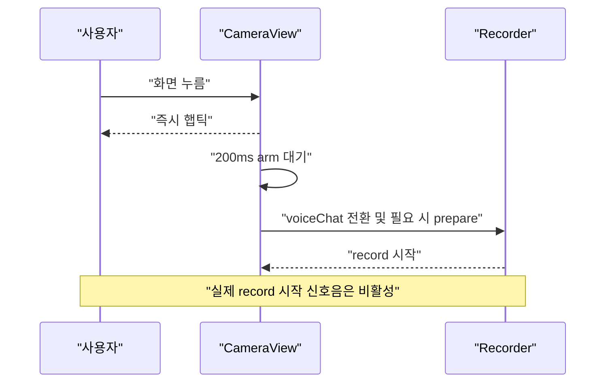
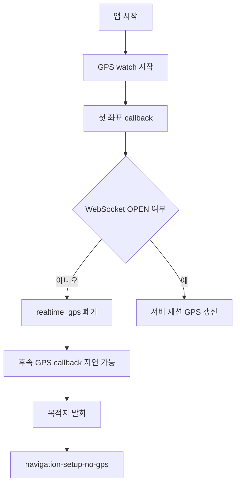
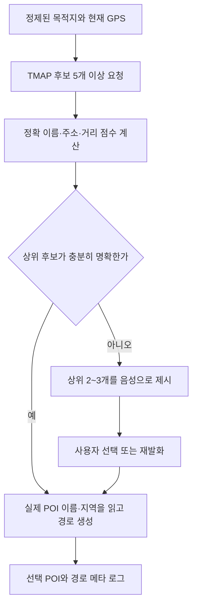

# STT 목적지 인식 및 경로 안내 회귀 분석 보고서

> **작성일**: 2026-07-20
> **버전**: v1.0.0
> **현재 분석 기준**: `jy`, HEAD `068a5e71fb3fb3e5008157726efe3b1192d902df`
> **비교 기준**: `.vscode/docs/Map_test_Project`, Git `32e39942fb4ec572799ab64a63b97ed3e5e13188`와 핵심 파일 blob 동일
> **주 분석 경로**: React Native 앱의 `/ws/detect` STT 통합 경로. 브라우저 `/navigation/ws` 시뮬레이터는 별도 비교
> **작성 목적**: STT 목적지 입력부터 TMAP POI 선택, 경로 수립, 단말 안내까지의 회귀 지점을 식별하고 최근 변경과 기존 잠복 결함을 분리합니다.

---

## 1. 최종 결론

현재 문제는 한 줄의 단일 회귀가 아니라 **STT 입력 품질, 목적지 의도 판별, 문자열 정제, POI 후보 선택, 성공 결과 확인 부재**라는 서로 다른 오류 지점에서 발생할 수 있습니다. 일부는 앞 단계에서 조기 반환하므로 모든 결함을 항상 순서대로 통과하는 것은 아닙니다.

가장 중요한 판단은 다음과 같습니다.

| 구분 | 판정 | 핵심 근거 | 사용자에게 보이는 증상 |
| :--- | :--- | :--- | :--- |
| **확정 결함 1** | 목적지 문자열을 TMAP 호출 전에 훼손 | `server/stt/stt_to_llm_bridge.py:598-604`가 문자열 전체에서 `으로`, `로`, `설정`을 삭제 | `구로역`이 `구역`, `종로구청`이 `종구청`, `가로수길`이 `가수길`로 검색됨 |
| **확정 결함 2** | 일부 정상 목적지를 호출어로 오인해 검색 자체를 차단 | `server/stt/stt_to_llm_bridge.py:90-109,537-560`의 2글자 퍼지 wake 판별 | `길동역`, `길음역`, `길상사`를 말하면 목적지 검색 대신 다시 목적지를 말하라는 안내가 나옴 |
| **확정 결함 3** | 동명 POI를 현재 위치와 무관하게 첫 결과로 확정 | `server/navigation/server.py:103-140`이 `count=1`, 중심 좌표 없음, `pois[0]` 고정 | 전사와 검색어가 정확해도 먼 지역의 동명 지점 또는 다른 지점으로 안내 |
| **최근 회귀 후보 1** | 손상·절단 녹음 검증 제거와 오디오 세션 준비 순서 변경 | `0ea627f8`, `c56b3ffd` | 목적지의 첫 부분 또는 뒷부분이 빠진 전사문이 서버까지 전달될 수 있음 |
| **최근 회귀 후보 2** | 실제 녹음 시작 전 200ms 지연과 시작 완료 신호 부재 | `82eceb07`, `CameraView.tsx:521-524,580-593` | 누른 직후 말하면 첫 음절이 잘려 고유명사가 달라질 수 있음 |
| **조건부 확정 회귀** | TMAP 키 누락 시 실패 대신 고정 가상 좌표를 성공 처리 | `164bf1a7`, `server/navigation/server.py:115-117,219-243` | 어떤 목적지를 말해도 동일한 위치 부근으로 경로가 생성될 수 있음 |
| **가용성 회귀 후보** | 최초 GPS가 WebSocket 연결 전에 유실될 수 있는데 가짜 출발점 폴백은 제거 | `e35f4151`과 `f500c58b`의 결합 | 목적지를 잘못 고르는 대신 “현재 위치를 아직 받지 못했습니다”로 경로 시작이 거부됨 |

정적 코드만으로 확정할 수 있는 **직접적인 목적지 정확도 원인**은 다음 세 가지입니다.

| 우선순위 | 직접 원인 | 확신도 | 최근 변경 여부 |
| :---: | :--- | :---: | :---: |
| **P0** | 장소명 내부까지 삭제하는 전역 문자열 치환 | 매우 높음 | 비교 기준에도 존재한 잠복 결함 |
| **P0** | `길댕` 퍼지 wake가 정상 장소명을 가로채는 분기 우선순위 | 매우 높음 | 비교 기준에도 존재한 잠복 결함 |
| **P0** | 현재 위치·주소·후보 확인 없이 TMAP 첫 결과 한 건을 확정 | 매우 높음 | 비교 기준에도 존재한 구조적 결함 |
| **P1** | 최근 녹음 지연, 절단 검증 제거, AEC와 recorder prepare 순서 변화 | 중간 이상 | 비교 기준 이후 변경 |
| **P1** | 키 누락 시 고정 목적지와 가상 경로를 성공 처리 | 조건 충족 시 매우 높음 | 비교 기준 이후 변경 |
| **P1** | GPS 최초 좌표 전송 유실과 no-GPS 조기 반환의 결합 | 중간 | 비교 기준 이후 변경 |

따라서 **전사문이 실제 발화와 다를 경우**에는 최근 STT 캡처 경로 변경을 가장 먼저 검증해야 합니다. 반면 **전사문은 정확한데 다른 장소로 경로가 생성되는 증상**이라면 최근 변경보다 오래전부터 존재한 **전역 문자열 치환과 `count=1` POI 선택 정책**이 주원인입니다.

---

## 2. 분석 범위와 방법

### 2.1 파일 범위

| 범위 | 확인 수량 | 분석 방식 |
| :--- | ---: | :--- |
| `.vscode/docs/Map_test_Project` 전체 | 물리 파일 544개 | 전체 인벤토리 후 소스, 설정, 문서, 테스트, Git 비교 대상으로 분류 |
| 비교 폴더의 1차 관련성 스캔 | 540개 | 일반적인 `build` 산출물 제외 패턴으로 STT, GPS, 목적지, TMAP, POI, WebSocket, 경로, 지도 관련 키워드와 호출 그래프 대조 |
| 비교 폴더의 `server/rag/build/*.py` | 4개 | 디렉터리 이름은 `build`지만 실제 RAG 빌더 소스이므로 별도 재확인. 목적지·STT·GPS·TMAP 호출 없음 |
| 현재 저장소 Git 추적 파일 | 705개 | `git ls-files`, 전체 키워드 검색, import·호출 관계, 설정 로드 경로, 테스트와 문서 교차 검증 |
| 현재 작업 폴더의 전체 물리 파일 | 보고서 생성 전 271,248개 | `.git` 제외. `node_modules`, Pods, 빌드 산출물, 모델·이미지·오디오·DB 파일을 포함해 인벤토리 확인 |

`node_modules`, CocoaPods, 실제 빌드 산출물, 캐시, 모델 가중치, 이미지·오디오·DB 바이너리는 파일 존재와 관련 경로를 확인했지만 목적지 선택 의미를 담은 애플리케이션 소스처럼 줄 단위 해석하지 않았습니다. 이름에 `build`가 들어가지만 자체 소스인 비교 폴더의 `server/rag/build/` 4개 파일은 별도로 다시 확인했습니다. 목적지 정확도에 영향을 주는 자체 소스, 설정, 테스트, 문서와 Git 이력은 비교 폴더와 현재 루트 양쪽에서 교차 확인했습니다.

### 2.2 분석 절차

| 단계 | 수행 내용 | 판단 목적 |
| :---: | :--- | :--- |
| 1 | 프로젝트 규칙, 설계 노트, API·환경 변수·STT·내비게이션 문서 확인 | 의도된 실행 계약 확인 |
| 2 | 비교 폴더 핵심 파일과 Git 객체의 blob 해시 비교 | 비교 폴더가 어느 시점의 코드인지 확정 |
| 3 | 현재 모바일 `stt_audio` 경로를 함수 단위로 추적 | 실제 운영 경로와 독립 시뮬레이터 경로 분리 |
| 4 | `32e39942..HEAD` 이력과 주요 커밋 diff·blame 확인 | 기준 이후 실제 수정 지점 식별 |
| 5 | 목적지 파서, wake 판별, 질문 판별을 함수 수준으로 재현 | 입력별 결정론적 실패 확인 |
| 6 | `.env` 값을 출력하지 않고 TMAP 키의 존재·빈 값·플레이스홀더 여부만 확인 | 고정 가상 목적지 분기의 현재 활성 가능성 판별 |
| 7 | 관련 단위 테스트 실행과 mock 구조 확인 | 테스트가 실제 목적지 정확도를 보장하는지 판별 |

### 2.3 이번 보고서에서 하지 않은 검증

| 미수행 항목 | 이유 | 문서 내 취급 |
| :--- | :--- | :--- |
| 실제 TMAP API 요청 | 외부 API 상태, 키 권한, 과금·쿼터가 개입하는 쓰기 없는 외부 실행 | 정적 요청 파라미터와 오류 처리만 판정 |
| iOS 실기기 녹음·재생 | 연결된 기기와 현장 발화가 필요한 런타임 검증 | 최근 오디오 변경은 회귀 후보로 표시 |
| Docker 실행 환경의 실제 환경 변수 | 현재 루트 `.env` 형식은 확인했지만 실행 중 컨테이너 환경은 별도 런타임 사실 | 고정 좌표 문제를 조건부 회귀로 표시 |
| 목적지 기능 코드 수정 | 사용자 요청이 원인 분석 문서 생성이므로 구현은 범위 밖 | 개선안과 수용 기준만 제시 |

---

## 3. 비교 기준 시점 확정

`.vscode/docs/Map_test_Project`는 단순히 비슷한 복사본이 아니라 핵심 실행 파일이 Git 커밋 `32e39942`와 blob 단위로 일치합니다.

| 항목 | 값 |
| :--- | :--- |
| 기준 커밋 | `32e39942fb4ec572799ab64a63b97ed3e5e13188` |
| 기준 시각 | 2026-07-13 04:44:20 KST |
| 기준 제목 | `feat(th): 연락처 영속화, 탐지/질문 라우팅, 긴급핑퐁, Edge TTS` |
| 현재 HEAD | `068a5e71fb3fb3e5008157726efe3b1192d902df` |
| 조상 관계 | `32e39942`는 현재 HEAD의 조상 |
| 타당한 회귀 구간 | `32e39942..068a5e71` |

### 3.1 핵심 파일 blob 대조

| 파일 | 비교 폴더 blob | `32e39942` blob | 판정 |
| :--- | :--- | :--- | :---: |
| `server/stt/stt_to_llm_bridge.py` | `9e2a91ca...` | `9e2a91ca...` | 동일 |
| `server/navigation/server.py` | `9bb31c8a...` | `9bb31c8a...` | 동일 |
| `server/navigation/manager.py` | `1efa1e07...` | `1efa1e07...` | 동일 |
| `server/api/ws_router.py` | `f5d7d867...` | `f5d7d867...` | 동일 |
| `server/stt/stt_config.py` | `00d88460...` | `00d88460...` | 동일 |
| `server/stt/stt_service.py` | `3175b394...` | `3175b394...` | 동일 |
| `client/src/components/CameraView.tsx` | `58028bc5...` | `58028bc5...` | 동일 |
| `client/src/hooks/useSttRecorder.ts` | `288e9ff5...` | `288e9ff5...` | 동일 |
| `client/src/hooks/useLocation.ts` | `e09f2806...` | `e09f2806...` | 동일 |
| `client/src/hooks/useWebSocket.ts` | `f4b1ddd0...` | `f4b1ddd0...` | 동일 |

이 결과 때문에 다음 두 범주를 반드시 분리해야 합니다.

| 범주 | 의미 |
| :--- | :--- |
| **기준 이후 회귀** | `32e39942` 이후 실제로 변경된 STT 캡처, GPS, TMAP 오류 폴백, 파일 삭제 |
| **기준에도 존재한 잠복 결함** | 단순 목적지인 `서울역으로 설정`에서는 통과하지만 다른 장소명·자연어·동명 POI에서 실패하는 기존 파서와 검색 정책 |

---

## 4. 실제 모바일 실행 경로


### 4.1 단계별 코드 연결

| 단계 | 현재 코드 | 현재 동작 | 정확도 위험 |
| :--- | :--- | :--- | :--- |
| 입력 제스처 | `client/src/components/CameraView.tsx:512-610` | press-in 즉시 햅틱, 200ms 후 recorder 시작 | 사용자가 햅틱 직후 말하면 선두 음절 미녹음 가능 |
| 오디오 생성 | `client/src/hooks/useSttRecorder.ts:24-56,95-220` | 16kHz mono PCM, AEC 전환, 최소 길이 검사 | warm-prepare 순서와 절단 비율 검증 부재 |
| 전송 | `CameraView.tsx:533-545` | `model_name` 없이 `stt_audio` 전송 | 서버 기본 모델이 강제 적용됨 |
| 수신·전사 | `server/api/ws_router.py:394-466` | 오디오 길이 확인 후 `SttService.transcribe_file()` | 11,200바이트 미만은 조용히 폐기 |
| 대화 분기 | `server/stt/stt_to_llm_bridge.py:510-593` | shutdown, fuzzy wake, wakeup, question, destination 순서 | fuzzy wake와 질문 판별이 목적지보다 먼저 실행 |
| 검색어 생성 | `stt_to_llm_bridge.py:595-604` | 문자열 전체에서 조사·명령어 제거 | 고유명사 내부 문자열까지 삭제 |
| POI 선택 | `server/navigation/server.py:103-140` | 첫 POI 한 건 반환 | 현재 위치·주소·후보 확인 없음 |
| 경로 생성 | `stt_to_llm_bridge.py:625-678` | TMAP 경로 중 Point만 세션 waypoint로 저장 | 빈 Point 목록도 성공 처리 가능 |
| 지도 전달 | `server/api/ws_router.py:609-626` | 좌표 배열과 TMAP 키만 전달 | 선택 POI 이름·주소·선택 이유 없음 |
| 앱 지도 | `client/src/components/NavMapPanel.tsx:80-96` | 전달된 희소 Point를 선으로 연결 | 실제 도로 LineString이 아니라 직선처럼 보일 수 있음 |

### 4.2 브라우저 시뮬레이터와 모바일 앱 구분

| 경로 | 입력 | WebSocket | 목적지 선택 | 운영 모바일 경로 여부 |
| :--- | :--- | :--- | :--- | :---: |
| `server/navigation/index.html` | 브라우저 SpeechRecognition | `/navigation/ws` | 브라우저용 별도 파서와 UI. 현재 `ENABLE_NAVIGATION_SIMULATOR=false`로 기본 비활성 | 아니오 |
| 삭제된 `server/navigation/pedestrian_navigation.py` | 터미널 `input()` | 사용 안 함 | 최대 5개 이름·주소를 보여 주고 번호 선택 | 아니오 |
| React Native 앱 | `useSttRecorder` 오디오 | `/ws/detect` | `SttToLlmBridge`와 `helper_search_poi()` | 예 |

브라우저 시뮬레이터나 standalone CLI가 목적지를 정확히 찾았다는 사실은 현재 모바일 STT 통합 경로의 정상 동작을 증명하지 않습니다.

---

## 5. 비교 폴더에 있었던 다중 후보 수동 선택 prototype

비교 폴더의 `server/navigation/pedestrian_navigation.py:43-103`에는 현재 통합 경로보다 더 많은 후보·주소 정보를 제공하는 수동 선택 로직이 있습니다.

| 기능 | 비교 폴더 standalone | 현재 모바일 통합 경로 |
| :--- | :--- | :--- |
| TMAP 검색 개수 | `count=5` | `count=1` |
| 후보 이름 표시 | 지원 | 미지원 |
| 상·중·하위 주소 표시 | 지원 | 미지원 |
| 사용자 재확인 | 1부터 N까지 번호 선택 | 없음 |
| 현재 위치 중심 검색 | 없음 | 없음 |
| 실행 방식 | 터미널 `input()` | STT 자동 확정 |

2026-07-18 커밋 `558c392c`는 이 파일을 “프로덕션에 사용되지 않는 `input()` 기반 인터랙티브 CLI 프로토타입”으로 삭제했습니다. 삭제로 인해 저장소 안에서 후보 선택 예제가 사라진 것은 사실이지만, 비교 기준의 React Native STT 브리지도 이미 `server.navigation.server.helper_search_poi()`를 호출했습니다. 따라서 판정은 다음과 같습니다.

| 사용자가 과거에 사용한 경로 | 삭제의 영향 |
| :--- | :--- |
| `pedestrian_navigation.py`를 직접 실행한 Map 테스트 | 후보 5개와 주소 선택 기능 삭제가 직접적인 기능 상실 |
| React Native 앱에서 STT로 목적지 입력 | 해당 CLI는 원래 연결되지 않았으므로 파일 삭제만으로 최근 모바일 회귀를 설명할 수 없음 |

---

## 6. 확정 결함 상세

### 6.1 장소명 내부까지 삭제하는 목적지 파서

현재 목적지 파서는 `server/stt/stt_to_llm_bridge.py:598-604`에서 다음 순서로 동작합니다.

```python
destination = (
    normalized_text.replace("목적지는", "")
    .replace("으로", "")
    .replace("로", "")
    .replace("설정", "")
    .strip()
)
```

문제는 `로`를 문장 끝 조사로만 제거하지 않고 **문자열 전체에서 삭제**한다는 점입니다. 현재 함수와 동일한 식으로 재현한 결과는 다음과 같습니다.

| STT 전사문 | 실제 TMAP 검색어 | 판정 |
| :--- | :--- | :--- |
| `서울역으로 설정` | `서울역` | 우연히 정상 |
| `구로역으로 설정` | `구역` | 장소명 훼손 |
| `종로구청으로 설정` | `종구청` | 장소명 훼손 |
| `가로수길로 설정` | `가수길` | 장소명 훼손 |
| `압구정로데오역으로 설정` | `압구정데오역` | 장소명 훼손 |
| `서울역으로 가줘` | `서울역 가줘` | 명령 어미 잔존 |
| `서울역까지 안내해줘` | `서울역까지 안내해줘` | 목적지와 명령문 미분리 |

이 결함은 `4f7fbf0c`의 자동 네비게이션 통합 때 의미상 도입됐고 이후 현재 형태로 유지됐습니다. 비교 폴더에도 동일하므로 최근 회귀는 아니지만, 테스트 장소가 `서울역`에서 `구로역`, `종로`, `가로수길` 계열로 바뀌었다면 “과거에는 되고 지금은 안 되는 것처럼” 즉시 드러납니다.

### 6.2 정상 목적지를 `길댕` 호출어로 오인

`server/stt/stt_to_llm_bridge.py:90-109`는 발화의 모든 2글자 구간을 `길댕`과 비교하고 편집거리 1 이하면 wake로 봅니다. 이 판정은 목적지 대기 분기보다 먼저 처리됩니다.

| 목적지 전사문 | `_is_gildaeng_wake()` | 실제 처리 |
| :--- | :---: | :--- |
| `길동역` | `True` | POI 검색 없이 “목적지를 말씀해 주세요” |
| `길음역` | `True` | POI 검색 없이 재질문 |
| `길상사` | `True` | POI 검색 없이 재질문 |
| `서울역` | `False` | 목적지 분기로 진행 |
| `길찾아줘` | `False` | 예외 키워드로 wake 오인을 방지 |

현재 `server/stt/stt_to_llm_bridge.py:552-560`은 `WAITING_FOR_DESTINATION` 상태에서 이 오인이 발생하면 상태를 유지한 채 재질문합니다. 사용자는 목적지를 정확히 말해도 계속 같은 요청을 받게 됩니다.

### 6.3 경로 의도가 포함된 질문형 발화를 자유 질문으로 전환

목적지 대기 상태에서도 `_looks_like_question()`이 목적지 검색보다 먼저 실행됩니다. `어디`, `어떻게` 같은 단어가 있으면 `WAITING_FOR_DESTINATION`을 `IDLE`로 바꾸고 자유 질문 경로로 보냅니다.

| 발화 | 질문 판정 | 결과 |
| :--- | :---: | :--- |
| `서울역` | `False` | 목적지로 검색 |
| `서울역이 어디야` | `True` | 위치 질의일 수도 있는 경계 사례. 현재는 자유 질문으로 전환하고 목적지 대기 종료 |
| `서울역까지 어떻게 가` | `True` | 자유 질문으로 전환, 목적지 대기 종료 |

`서울역이 어디야`는 단순 위치 질문으로 해석할 수도 있으므로 정책상 모호합니다. 그러나 `서울역까지 어떻게 가`는 명시적인 경로 의도를 포함하는데도 자유 질문으로 빠집니다. 즉 현재 암묵적 입력 계약은 “자연스러운 경로 요청 문장”이 아니라 “장소명 또는 매우 제한된 설정 문구”입니다. 사용자는 이 계약을 알 수 없으므로 정상적인 목적지 요청도 다른 기능으로 빠질 수 있습니다.

### 6.4 현재 위치와 무관한 첫 번째 POI 강제 선택

`server/navigation/server.py:103-140`의 `helper_search_poi()`는 다음 정책입니다.

| 검색 정책 | 현재 값 | 영향 |
| :--- | :--- | :--- |
| 요청 후보 수 | `count=1` | 두 번째 이후 후보를 비교할 기회가 없음 |
| 현재 위치 전달 | `centerLat`, `centerLon` 없음 | 가까운 동명 지점을 우선할 근거가 없음 |
| 주소 활용 | 반환하지 않음 | 같은 이름의 지역 구분 불가 |
| 최종 선택 | `pois[0]` | TMAP relevance 첫 결과를 무조건 확정 |
| 사용자 확인 | 없음 | 잘못 선택해도 수정할 대화 단계가 없음 |

같은 파일의 `helper_search_nearest_poi()`는 이미 `count=5`, `centerLat`, `centerLon`, Haversine 거리 계산을 구현합니다. 코드 주석도 기존 `helper_search_poi(count=1)`이 가장 가까운 결과를 보장하지 못한다고 명시합니다. 그러나 이 함수는 “가까운 지하철역이 어디야” 같은 자유 질문에만 사용되고 실제 목적지 설정은 계속 `helper_search_poi(destination)`를 호출합니다.

### 6.5 잘못 선택한 POI를 성공 음성이 숨김

성공 응답은 TMAP이 실제로 선택한 `end_poi["name"]`이 아니라 파서가 만든 `destination`을 읽습니다.

| 데이터 | 현재 사용자·클라이언트 노출 여부 |
| :--- | :---: |
| 사용자가 말한 정제 문자열 | 성공 음성으로 노출 |
| TMAP이 선택한 실제 POI 이름 | 미노출 |
| 선택 POI 주소 | 미노출 |
| 후보 개수와 순위 | 미노출 |
| 선택 목적지 좌표 | `nav_route`의 마지막 좌표로 간접 존재할 수 있으나 의미 메타 없음 |
| 선택 전략 | 미노출 |

따라서 TMAP이 다른 동명 지점을 골라도 사용자는 자신이 말한 목적지 이름을 다시 듣습니다. 이 구조는 오선택을 탐지하기 어렵게 만듭니다.

### 6.6 빈 waypoint도 성공 처리

`helper_fetch_route()`가 JSON을 반환했지만 유효한 `Point` Feature가 하나도 없는 경우에도 현재 코드는 `update_route([])` 후 `NAVIGATING`으로 전환하고 성공 음성을 반환합니다. 이후 `NavigationFilter`는 빈 waypoint에서 안내를 생성하지 않습니다.

| 단계 | 현재 판정 |
| :--- | :--- |
| `route_data` 존재 | 성공 경로 진입 |
| 유효 Point 개수 0 | 실패로 간주하지 않음 |
| 세션 상태 | `NAVIGATING` |
| 후속 안내 | 빈 경로라 생성되지 않을 수 있음 |

### 6.7 실제 도로 LineString을 앱에 전달하지 않음

통합 브리지는 TMAP 응답 중 `Point`만 추출해 `nav_waypoints`로 보내고, 앱은 그 희소 점을 직선으로 연결합니다. 별도 브라우저 시뮬레이터는 `LineString`을 `route_coordinates`로 분리해 실제 경로선으로 사용합니다.

| 항목 | 모바일 통합 경로 | 브라우저 시뮬레이터 |
| :--- | :--- | :--- |
| Point | waypoint로 사용 | waypoint로 사용 |
| LineString | 버림 | 실제 경로 좌표로 사용 |
| 지도 표시 | 희소 Point 간 직선 | 도로 경로선에 가까운 polyline |

이 문제는 목적지 POI 자체가 틀린 것과 별개지만, 사용자는 지도선이 도로를 벗어나면 목적지가 잘못 잡혔다고 판단할 수 있습니다.

### 6.8 `facilityType` 문자열·정수 계약 불일치

`server/stt/stt_to_llm_bridge.py:646-648`은 TMAP의 `facilityType`을 별도 형 변환 없이 waypoint에 저장합니다. 가상 경로도 `"11"`처럼 문자열을 사용합니다. 반면 `server/navigation/navigation_filter.py:53-86,220-225`는 정수 `2`, `3`, `4`, `11`, `12`, `14`, `15`, `16`과 비교합니다.

| 단계 | 타입·비교 | 영향 |
| :--- | :--- | :--- |
| TMAP 응답 저장 | 원본 `facilityType` 그대로 | 문자열 숫자가 들어올 수 있음 |
| actionable 판정 | 정수 목록과 `in` 비교 | 문자열이면 주요 시설물 판정 누락 가능 |
| 시설명 변환 | 정수 key 딕셔너리 | 문자열이면 시설명 빈 문자열 |
| 위험 판정 | 정수 `2`, `3`, `4`, `12`와 비교 | 문자열이면 위험 시설 판정 누락 가능 |

description에 회전·횡단 같은 별도 키워드가 있으면 일부 안내가 살아남을 수 있으므로 모든 안내가 반드시 사라진다고 단정할 수는 없습니다. 그러나 시설 타입 기반 안내와 위험 표시는 타입 정규화가 없으면 일관되지 않습니다.

### 6.9 중복 `detection_control` 전송과 목적지 대기 상태 해제

현재 `client/src/components/CameraView.tsx:698-703,721-726`에는 탐지 상태를 보내는 effect가 두 개 있습니다. 첫 번째는 `detectionEnabled`, 두 번째는 `detectionEnabled && !depthMode`를 보냅니다. 서버 `server/navigation/manager.py:135-154`는 `enabled=false`를 받으면 `WAITING_FOR_DESTINATION`을 `IDLE`로 바꿉니다.

| 상황 | 가능한 처리 |
| :--- | :--- |
| 앱 기본값 `detectionEnabled=false`로 WS 연결·재연결 | OFF 전송이 목적지 대기를 해제 |
| `detectionEnabled=true`인 상태에서 depth mode 진입 | 첫 effect의 ON과 두 번째 effect의 OFF가 서로 다른 값을 보낼 수 있음 |
| wake 발화와 재연결·토글이 겹침 | 다음 발화가 목적지 분기가 아니라 일반 STT 경로로 갈 수 있음 |

두 번째 effect는 비교 기준 이후 커밋 `ba5714db`에서 추가됐습니다. 이 문제는 목적지 이름을 다른 POI로 바꾸는 결함은 아니지만, 두 턴짜리 목적지 대화의 상태를 풀어 “목적지를 못 잡는” 증상을 만들 수 있는 보조 회귀입니다.

---

## 7. 비교 기준 이후 변경 이력

### 7.1 회귀 타임라인

| 시각 | 커밋 | 변경 내용 | 목적지 기능 영향 | 판정 |
| :--- | :--- | :--- | :--- | :--- |
| 2026-07-13 16:41 | `ba5714db` | depth mode용 두 번째 `detection_control` effect 추가 | ON/OFF 중복 전송과 목적지 대기 해제 가능 | 보조 상태 회귀 후보 |
| 2026-07-13 18:35 | `0ea627f8` | 누른 시간 대비 실제 iOS 녹음 길이가 50% 미만이면 차단하던 `capture_truncated` 비율 검사 제거 | 긴 홀드 중 일부만 담긴 손상 파일도 서버로 전달될 수 있음 | 최근 회귀 후보 |
| 2026-07-14 00:10 | `e35f4151` | GPS watch를 탐지 활성 이후가 아니라 앱 부팅 직후로 이동, High/2초/1m로 변경 | 첫 좌표가 WebSocket 연결 전에 발생하면 `send()`가 버릴 수 있음 | 가용성 회귀 후보 |
| 2026-07-16 01:32 | `164bf1a7` | TMAP 키 누락 시 `None` 대신 고정 가상 목적지와 가상 경로 반환 | 조건 충족 시 틀린 목적지를 성공 처리 | 조건부 확정 회귀 |
| 2026-07-16 15:08 | `f500c58b` | GPS 미수신 시 서울역 출발점 폴백 제거, `navigation-setup-no-gps` 반환 | 정확도는 개선했지만 최초 GPS 유실 시 경로 설정 불가 | 개선과 가용성 회귀가 공존 |
| 2026-07-17 17:44 | `c56b3ffd` | 44.1kHz PCM을 16kHz로 변경, warm-prepare 도입, record 후 AEC 재검증 제거 | 16kHz 자체는 Whisper에 적합하나 prepare와 voiceChat 순서가 기준 구현의 안전 전제와 달라짐 | 최근 회귀 후보 |
| 2026-07-18 09:11 | `558c392c` | 후보 5개·주소·번호 선택을 가진 standalone CLI 삭제 | CLI 직접 사용자는 기능 상실, RN 통합 경로에는 직접 영향 없음 | 경로별 영향 상이 |
| 2026-07-19 10:28 | `7296f9bb` | TMAP 동기 호출을 `asyncio.to_thread()`로 격리 | 지연·이벤트 루프 개선, 검색 의미는 동일 | 원인 아님 |
| 2026-07-19 12:03~12:21 | `ca7248ca`, `82eceb07` | 400ms/0.35초 미만 폐기, press-in 후 200ms arm 지연 | 짧은 오탐을 줄이지만 실제 녹음 시작 전에 발화할 위험 증가 | 최근 회귀 후보 |

### 7.2 기준 이전의 중요 변경

| 시각 | 커밋 | 변경 | 현재 문제와의 관계 |
| :--- | :--- | :--- | :--- |
| 2026-07-08 14:22 | `9336d10f` | `count=5` 사용자 선택 CLI와 `count=1` 서버 helper가 함께 추가 | 다중 후보 수동 선택 prototype과 자동 통합용 단순 helper가 처음부터 병존 |
| 2026-07-08 15:11 | `4f7fbf0c` | STT 목적지 자동 경로 수립과 전역 replace 파서 도입 | 파서 훼손과 자동 첫 결과 선택의 의미상 시작점 |
| 2026-07-10 21:57 | `90586120` | 실제 device 세션, 질문·내비 흐름 수정 중 현재 파서 형태 유지 | 현재 줄 blame의 주요 시점이지만 결함의 의미는 이전부터 존재 |
| 2026-07-11 21:23 | `4ff207b7` | 기본 Whisper `medium`에서 `small`로 변경 | 비교 폴더에도 이미 반영되어 Map 기준 대비 회귀는 아님 |
| 2026-07-13 04:44 | `32e39942` | 현재 비교 폴더의 핵심 실행 파일과 동일한 기준점 | 이후 변경을 판정하는 기준 |

---

## 8. 최근 STT 캡처 변경의 영향

### 8.1 손상 녹음 보호 기능 제거

비교 기준의 `useSttRecorder.ts`는 다음 조건을 검사했습니다.

| 검사 항목 | 기준 값 |
| :--- | :--- |
| 사용자 홀드 시간 | 800ms 이상 |
| 실제 캡처 길이 | 홀드 시간의 50% 미만 |
| 처리 | 서버 전송 차단, 재입력 안내 |

`0ea627f8`은 이 검사를 제거하면서 서버 Whisper의 `vad_filter=True`가 짧은 오디오를 걸러준다고 설명했습니다. 그러나 두 검사는 같은 역할이 아닙니다.

| 검사 | 탐지 대상 |
| :--- | :--- |
| VAD | 무음 또는 발화가 없는 구간 |
| 기존 hold 대비 capture 비율 | 3초 눌렀지만 파일에는 0.7초만 담긴 오디오 세션 절단 |
| 현재 0.35초 절대 하한 | 0.35초보다 짧은 파일만 차단 |

예를 들어 3초를 눌렀는데 0.7초만 저장된 파일은 현재 0.35초 하한을 통과합니다. 남은 0.7초에 일부 음성이 있으면 VAD도 통과할 수 있어 불완전한 목적지 고유명사가 전사될 수 있습니다.

### 8.2 AEC 전환과 recorder prepare 순서 변화

| 경로 | 순서 |
| :--- | :--- |
| 비교 기준 | `setVoiceProcessing(true)` → `prepareToRecordAsync()` → `record()` |
| 현재 warm 경로 | 앱 진입 또는 직전 녹음 종료 후 `prepareToRecordAsync()` → 다음 누름에서 `setVoiceProcessing(true)` → prepare 생략 → `record()` |

비교 기준 코드 주석은 “세션 전환은 prepare 전에 수행해야 캡처 절단을 피한다”고 명시했습니다. 현재 warm-prepare는 정상 오디오 세션에서 먼저 준비한 recorder를 voiceChat 전환 후 그대로 재사용할 수 있어 기준 구현이 안전 전제로 둔 순서와 달라졌습니다. `record()` 직후 AEC가 실제 유지되는지 확인하던 `getSessionInfo()` 계측도 제거됐습니다.

이 항목은 정적으로 위험 구조가 확인됐지만 실제 절단 발생 여부는 저장된 실기기 WAV 파형으로 확정해야 합니다.

### 8.3 200ms arm 지연과 시작 신호 부재

현재 press-in 흐름은 다음과 같습니다.



사용자에게는 press-in 햅틱이 즉시 오지만 녹음은 최소 200ms 뒤에 시작하고, warm-prepare가 안 된 경우 AEC 전환과 prepare 시간도 추가됩니다. 실제 녹음 시작 신호음은 `STT_START_CUE_WITH_AEC=false`입니다. 따라서 햅틱을 녹음 시작 신호로 이해하고 바로 말하면 첫 음절이 파일에 없을 수 있습니다.

이 문제는 전역 파서와 결합하면 더 심해집니다. 예를 들어 `구로역`의 첫 음절이 약해져 `로역`으로 전사되면, 파서가 다시 `로`를 전역 삭제해 검색어가 `역`만 남을 수 있습니다.

### 8.4 기본 Whisper 모델 판정

| 항목 | 비교 폴더 | 현재 | 판정 |
| :--- | :--- | :--- | :--- |
| 기본 모델 | `faster-whisper-small` | `faster-whisper-small` | 동일 |
| 언어 | `ko` | `ko` | 동일 |
| beam size | 3 | 3 | 동일 |
| VAD | 활성 | 활성 | 동일 |
| hotwords | 명령어·시설 카테고리 중심 | 동일 계열 | 임의 장소 고유명사 보호 부족 |

`medium`에서 `small`로의 변경은 2026-07-11 `4ff207b7`이며 비교 기준보다 이릅니다. 따라서 `.vscode/docs/Map_test_Project`와 현재를 비교한 최근 회귀 원인으로는 제외해야 합니다. 다만 사용자가 기억하는 정상 시점이 2026-07-11 이전이라면 고유명사 인식 품질 저하 가능성을 별도 A/B 테스트해야 합니다. 프로젝트 문서도 small 인식 품질을 실기기 검증 대기 상태로 기록합니다.

---

## 9. GPS와 TMAP 오류 처리 회귀

### 9.1 최초 GPS 전송 유실 가능성

현재 `CameraView.tsx:662-694`는 WebSocket 연결 상태와 관계없이 앱 부팅 직후 GPS watch를 시작합니다. 반면 `useWebSocket.ts:546-550`의 `send()`는 소켓이 이미 `OPEN`인 경우에만 보내고 큐나 재전송을 하지 않습니다.



`f500c58b`의 서울역 가짜 출발점 제거는 정확도 측면에서는 올바른 개선입니다. 그러나 연결 후 현재 좌표를 한 번 재전송하는 보장이 없어서 `e35f4151`의 조기 watch와 결합하면 사용자에게 경로 설정 실패로 나타날 수 있습니다.

이 문제는 “다른 목적지를 선택”하는 결함이 아니라 “목적지 경로 설정을 시작하지 못함”의 원인입니다.

### 9.2 TMAP 키 누락 시 고정 가상 목적지

비교 폴더의 `server/navigation/server.py:112-114`는 키가 없으면 `None`을 반환했습니다. 현재 코드는 다음 고정 좌표를 반환합니다.

| 필드 | 현재 값 |
| :--- | :--- |
| 이름 | `<검색어> (가상)` |
| 경도 `x` | `126.8722` |
| 위도 `y` | `37.4590` |
| 후속 처리 | 2개의 Point를 가진 가상 경로 생성 후 성공 가능 |

이 동작은 `docs/ops/environment_variables.md:211`과 `.env.example:161-165`의 “키 미설정 시 기능 비활성화” 설명과 모순됩니다.

현재 루트 `.env`는 값을 노출하지 않고 확인한 결과 다음 상태였습니다.

| 검사 | 결과 |
| :--- | :--- |
| `TMAP_APP_KEY` 존재 | 예 |
| 빈 문자열 | 아니오 |
| 코드 플레이스홀더와 동일 | 아니오 |
| 길이 | 40자 |
| 실제 API 권한·만료·쿼터 | 이번 정적 감사에서 미검증 |

따라서 현재 루트 `.env`가 실제 실행 환경에 로드된다면 고정 가상 목적지 분기는 비활성입니다. 다른 컨테이너나 서버에서 키가 누락되고, 서버 세션 GPS가 존재하며, 목적지 설정 분기까지 진입한 경우에는 고정 가상 목적지와 경로가 성공 처리됩니다.

---

## 10. 테스트가 통과해도 결함을 못 잡는 이유

### 10.1 실행 결과

다음 관련 테스트를 실행했습니다.

```text
.venv/bin/python -m pytest -q -p no:cacheprovider \
  tests/test_stt_to_llm_bridge_template.py \
  tests/test_ws_router_stt.py \
  tests/test_stt_config_policy.py \
  tests/test_stt_service_template.py \
  tests/test_stt_wait_notice.py
```

| 결과 | 값 |
| :--- | :--- |
| 통과 | 34 |
| 실패 | 0 |
| 경고 | 1, LangChain community deprecation |

### 10.2 테스트 공백

| 공백 | 현재 테스트 구조 | 놓치는 결함 |
| :--- | :--- | :--- |
| 목적지 검색어 검증 없음 | `_fake_search_poi(keyword)`가 `keyword`를 버리고 항상 서울역 반환 | `구로역`→`구역` 훼손 |
| 단일 정상 문장 | 성공 케이스가 `서울역으로 설정` 한 건 | 다양한 조사, 명령 어미, 장소명 내부 `로` |
| 브리지 전체 mock | WS 테스트의 `서울역으로 가줘`는 `invoke_existing_llm()` 자체를 mock | 실제 파서와 POI 호출 |
| wake 충돌 케이스 없음 | `길동역`, `길음역`, `길상사` 미검사 | 목적지가 wake로 오인되는 분기 |
| 동명 POI 응답 없음 | 항상 단일 fake 결과 | 현재 위치 기반 ranking과 사용자 확인 부재 |
| 키 누락 성공 금지 검사 없음 | 가상 목적지 경로를 실패로 요구하지 않음 | 고정 좌표 오안내 |
| 실기기 오디오 corpus 없음 | 텍스트 결과만 fixture로 주입 | 첫 음절 절단, AEC·prepare 순서, 고유명사 인식률 |
| GPS 연결 경합 없음 | 서버 no-GPS 조기 반환만 검사 | 연결 전 첫 GPS 유실 |
| 경로 형상 검사 없음 | Point 한 건만 fixture에 사용 | LineString 폐기와 빈 waypoint 성공 |

현재 테스트가 모두 통과한다는 사실은 **STT 호출 코드가 예외 없이 실행된다**는 것은 보여 주지만, **사용자가 말한 목적지를 정확히 선택한다**는 것은 보장하지 않습니다.

---

## 11. 관측성 공백

현재 `ws_router.py:657-688`은 STT 전사문과 오디오 저장 메타를 DB에 기록합니다. 그러나 실제 목적지 오선택을 분석하는 데 필요한 중간 결과는 저장하지 않습니다.

| 관측 필드 | 현재 저장 | 필요한 이유 |
| :--- | :---: | :--- |
| 원본 STT 전사문 | 예 | STT 단계 오류 판별 |
| STT 오디오 경로·크기·길이 | 예 | 녹음 절단·무음 판별 |
| 파서가 만든 목적지 문자열 | 아니오 | 전역 replace 훼손 판별 |
| TMAP 후보 개수 | 아니오 | 검색 모호성 판별 |
| 후보별 이름·주소·거리 | 아니오 | 잘못된 후보 ranking 판별 |
| 최종 선택 POI 이름·주소 | 아니오 | 사용자의 의도와 실제 선택 비교 |
| 최종 목적지 좌표 | 의미 메타로는 아니오 | 고정 좌표·지역 오선택 판별 |
| 선택 전략 | 아니오 | 첫 결과, 최근접, 정확명 일치, 사용자 확인 구분 |
| TMAP HTTP 상태·오류 코드 | 성공 로그에는 없음 | 키·쿼터·응답 오류 판별 |

`server/services/pipeline_debug_builder.py:241-283`도 `stt_transcript`, `bridge_source`, `response_text`는 기록하지만 목적지 정제 결과와 POI 선택 결과는 포함하지 않습니다. 이 때문에 현재 로그만으로는 “Whisper가 틀렸는지”, “파서가 망가뜨렸는지”, “TMAP 첫 후보가 틀렸는지”를 한 이벤트 안에서 즉시 구분하기 어렵습니다.

---

## 12. 원인에서 제외하거나 별도로 봐야 할 항목

| 항목 | 판정 | 근거 |
| :--- | :--- | :--- |
| 위도·경도 뒤바뀜 | 원인 아님 | 클라이언트 `lat/lon`, 서버 `update_gps(lat, lon)`, TMAP `x=lon/y=lat`, GeoJSON `[lon,lat]` 복원이 일치 |
| 서울역 GPS 폴백 제거 | 목적지 정확도 개선 | 가짜 출발점을 제거했으며, 남은 문제는 연결 후 GPS 재전송 보장 부재 |
| `asyncio.to_thread()` 적용 | 원인 아님 | 이벤트 루프 블로킹만 줄이고 검색어·후보 선택 의미는 바꾸지 않음 |
| `pedestrian_navigation.py` 삭제 | 모바일 직접 원인 아님 | React Native STT 경로에서 호출되지 않았음. CLI 직접 사용 시에만 기능 상실 |
| `server/navigation/index.html` 동작 | 모바일 정상성 증거 아님 | 브라우저 SpeechRecognition과 `/navigation/ws`를 쓰는 별도 시뮬레이터 |
| Whisper `small` | Map 기준 대비 원인 아님 | 비교 폴더와 현재 설정이 동일. 2026-07-11 이전과 비교할 때만 후보 |
| 현재 루트 TMAP 키 누락 | 현재 파일 기준 반증 | 비어 있지 않고 플레이스홀더가 아님. 실제 실행 컨테이너와 API 유효성은 별도 확인 필요 |
| 현재 미커밋 iOS 변경 | 직접 의미 원인 아님 | 개발팀·bundle identifier, Info.plist 키 순서, Hermes lock checksum 중심이며 목적지 파서·POI 검색 코드는 바꾸지 않음 |

---

## 13. 증상별 원인 판별표

| 실제 증상 | 가장 먼저 볼 데이터 | 1순위 원인 | 다음 원인 |
| :--- | :--- | :--- | :--- |
| 전사문 자체가 말한 목적지와 다름 | 저장된 STT 오디오와 `stt_transcript` | 200ms arm, 절단 검사 제거, warm-prepare·AEC 순서 | small 모델 고유명사 품질 |
| 전사문은 정확한데 검색어가 다름 | 목적지 정제 문자열 | 전역 `replace("로", "")` | 명령 어미 미제거 |
| `길동역` 등을 말하면 계속 재질문 | bridge source | fuzzy wake 오인 | 없음, 결정론적 재현 |
| `서울역까지 어떻게 가`가 길찾기를 시작하지 않음 | bridge source와 세션 상태 | 질문 휴리스틱이 자유 질문으로 전환 | 상태 토글 경합 |
| 전사문·검색어는 정확하지만 먼 동명 지점 선택 | TMAP 후보와 선택 POI | `count=1`, 현재 위치·주소·확인 부재 | TMAP relevance 특성 |
| 모든 목적지가 비슷한 고정 위치 | 실행 환경의 TMAP 키 상태 | 키 누락 가상 좌표 폴백 | 잘못된 환경 파일 로드 |
| “현재 위치를 아직 받지 못했습니다” | 첫 `realtime_gps` 수신 시각과 WS open 시각 | 연결 전 GPS 유실 후 재전송 없음 | 권한·GPS 신호 문제 |
| 목적지는 맞지만 지도선이 도로를 벗어남 | TMAP Feature 타입과 `nav_route` | LineString 폐기, Point 간 직선 연결 | waypoint 밀도 부족 |
| 성공 안내 후 실제 턴 안내가 없음 | waypoint 개수 | 빈 waypoint도 성공 처리 | `facilityType` 문자열·정수 계약 불일치 |

---

## 14. 수정 권고안

이 절은 구현 계획이며 현재 코드에는 반영하지 않았습니다.

### 14.1 우선순위별 수정

| 우선순위 | 수정 대상 | 권고 내용 | 완료 기준 |
| :---: | :--- | :--- | :--- |
| **P0** | 목적지 파서 | 문자열 전체 치환을 제거하고 문장 앞의 호출 문구와 문장 끝의 조사·명령 어미만 위치 기반으로 제거 | 장소명 내부 `로` 보존, 다양한 종결 표현 통과 |
| **P0** | wake 분기 | `WAITING_FOR_DESTINATION`에서는 정상 목적지 처리를 fuzzy wake보다 우선하거나 wake를 독립된 전체 발화 패턴으로 제한 | `길동역`, `길음역`, `길상사`가 POI 검색으로 전달 |
| **P0** | 질문 분기 | 목적지 대기 중 장소명과 `어디`, `어떻게 가`가 함께 있는 발화는 목적지 의도로 우선 분류 | 자연어 목적지 질문으로 경로 설정 가능 |
| **P0** | POI resolver | 후보를 5개 이상 받고 현재 GPS, 정확 이름 일치, 지역·주소, 거리로 점수화 | 동명 장소에서 근거 있는 후보 선택 |
| **P0** | 사용자 확인 | 후보가 모호하면 실제 POI 이름과 지역을 음성으로 확인한 뒤 확정 | 잘못된 자동 확정 방지 |
| **P0** | 오류 폴백 | 키 누락·API 실패는 fail-closed로 처리하고 가상 경로는 명시적 테스트 모드에서만 허용 | 운영 모드에서 고정 좌표 성공 0건 |
| **P1** | 녹음 UX | 실제 `record()` 시작 이후 햅틱 또는 음성 신호를 제공하고, 200ms arm 전 발화를 유도하지 않도록 계약 통일 | 첫 음절 손실 없는 실기기 corpus 통과 |
| **P1** | 오디오 세션 | voiceChat 전환 후 recorder prepare 순서를 복원하고 record 후 AEC 상태 계측 재도입 | hold 대비 캡처 길이와 AEC 상태 로그 정상 |
| **P1** | 절단 검사 | 절대 최소 길이와 hold 대비 captured 비율 검사를 함께 사용 | 3초 hold·0.7초 파일 차단 |
| **P1** | GPS 전송 | WS `OPEN` 직후 마지막 GPS를 즉시 재전송하거나 좌표 메시지를 큐잉 | 정지 상태에서도 서버 첫 GPS 보장 |
| **P1** | 경로 계약 | TMAP LineString을 별도 route coordinates로 전달하고 Point는 안내 waypoint로 분리 | 앱 지도선이 실제 도로 경로를 따름 |
| **P1** | 성공 조건 | 유효 waypoint가 없거나 목적지 좌표가 없으면 `NAVIGATING` 전환 금지 | 빈 경로 성공 0건 |
| **P2** | 관측성 | 정제 목적지, 후보 목록, 선택 POI·주소·좌표, 전략, TMAP 상태를 이벤트 단위로 기록 | 한 로그에서 오류 단계 식별 가능 |
| **P2** | 문서 정합 | 키 누락 정책과 STT 원음·전사 저장 현황을 실제 코드와 동기화 | 환경 변수·개인정보 문서와 코드 일치 |

### 14.2 목적지 파서의 요구 계약

| 입력 | 기대 정제 결과 |
| :--- | :--- |
| `서울역으로 설정` | `서울역` |
| `구로역으로 설정` | `구로역` |
| `종로3가역으로 안내해줘` | `종로3가역` |
| `가로수길로 가줘` | `가로수길` |
| `압구정로데오역까지 안내해줘` | `압구정로데오역` |
| `목적지는 서울역` | `서울역` |
| `서울역까지 어떻게 가` | `서울역` |

핵심 원칙은 **접두 명령과 종결 어미만 제거하고 고유명사 내부 문자는 절대 전역 삭제하지 않는 것**입니다.

### 14.3 POI 선택 권고 흐름



가장 가까운 후보만 고르는 것도 항상 정답은 아닙니다. 예를 들어 사용자가 멀리 있는 특정 병원이나 학교를 원할 수 있으므로 **정확 이름 일치, 지역 표현, 거리, 사용자 확인**을 함께 사용해야 합니다.

---

## 15. 필수 회귀 테스트와 수용 기준

| 테스트 영역 | 필수 케이스 | 통과 기준 |
| :--- | :--- | :--- |
| 문자열 보존 | `구로역`, `종로3가역`, `도로교통공단`, `가로수길`, `서울로7017`, `압구정로데오역` | 고유명사 내부 글자 100% 보존 |
| 종결 표현 | `으로 설정`, `로 가줘`, `까지 안내해줘`, `어떻게 가` | 목적지만 안정적으로 추출 |
| wake 충돌 | `길동역`, `길음역`, `길상사` | wake가 아니라 목적지 분기로 진입 |
| 질문 충돌 | `서울역까지 어떻게 가` | 목적지 대기 중에는 경로 의도로 처리 |
| 정책 경계 | `서울역이 어디야` | 위치 질문과 경로 요청 중 제품 정책을 명시하고 그 정책대로 일관 처리 |
| 검색어 전달 | fake helper가 실제 인자를 assert | 정제 결과와 TMAP `searchKeyword`가 동일 |
| 동명 POI | 서로 다른 지역의 같은 이름 3건 | 현재 위치·주소·명시 지역에 맞는 후보 또는 사용자 확인 |
| 키 누락 | 빈 키와 플레이스홀더 | 성공 경로 생성 금지, 명시적 실패 안내 |
| GPS 연결 경합 | 첫 좌표가 WS 연결 전에 발생 | 연결 직후 마지막 좌표 1회 이상 서버 수신 |
| 오디오 절단 | 3초 hold에 0.7초 캡처 | 서버 전송 금지와 재입력 안내 |
| 녹음 선두 | 즉시 발화하는 목적지 corpus | 첫 음절 누락 0건 |
| 모델 A/B | small과 medium으로 동일 한국어 고유명사 corpus | 정확도·지연 수치로 기본 모델 결정 |
| 경로 응답 | Point 0건, LineString만 존재, 혼합 Feature | 빈 경로 성공 금지, LineString 지도 전달 |
| 사용자 확인 | TMAP 첫 결과와 의도 지점 불일치 | 실제 선택 POI 이름·지역을 음성으로 확인 |
| 관측성 | 성공·실패 각 1건 | transcript→정제어→후보→선택→경로를 단일 event_id로 추적 |

---

## 16. 권장 현장 확인 순서

| 순서 | 확인 값 | 판정 |
| :---: | :--- | :--- |
| 1 | DB의 `stt_transcript`와 저장 오디오 | 둘이 다르면 STT 엔진, 같고 실제 발화와 다르면 캡처·모델 문제 |
| 2 | 새로 기록할 `normalized_destination` | 전사문은 맞고 이 값이 다르면 파서 문제 |
| 3 | TMAP 요청 `searchKeyword`와 후보 목록 | 검색어는 맞지만 후보가 다르면 POI resolver 문제 |
| 4 | `selected_poi_name`, 주소, 좌표 | 의도와 다르면 후보 선택·확인 문제 |
| 5 | TMAP Feature와 앱 `nav_route` | 선택 POI는 맞지만 지도만 다르면 LineString 전달 문제 |
| 6 | WS open 시각과 첫 `realtime_gps` 수신 시각 | no-GPS라면 최초 좌표 재전송 경합 확인 |

이 순서로 보면 STT, 파서, TMAP, 지도 문제를 한꺼번에 추측하지 않고 최초로 값이 달라지는 단계를 원인으로 확정할 수 있습니다.

---

## 17. 최종 판단

아래 최종 판단은 React Native 앱의 `/ws/detect` 통합 경로를 기준으로 합니다. 브라우저 `/navigation/ws` 시뮬레이터에는 RN의 fuzzy wake, 전역 replace, 200ms arm이 그대로 적용되지 않습니다. 현재 소스에서 목적지를 정확히 잡지 못하는 경로는 다음처럼 분기됩니다.

```text
경로 A: 최근 녹음 시작·세션 변경 → 전사문 자체가 잘못될 가능성
경로 B: 전사문 정상 → fuzzy wake 또는 질문 판별 조기 반환 → POI 검색 미진입
경로 C: 전사문 정상·목적지 분기 진입 → 전역 replace → 장소명 훼손
경로 D: 검색어 정상 → 현재 위치와 무관한 TMAP 첫 결과 자동 확정
공통 은폐 요인: 실제 선택 POI 대신 사용자 검색어를 되읽어 오선택 확인이 어려움
```

비교 폴더와 현재 코드를 Git 객체까지 대조한 결과, **전역 파서와 `count=1` 검색은 비교 폴더에도 이미 존재했습니다**. 즉 모든 목적지가 예전에 정확했던 구현이 최근 한 번에 망가진 것이 아니라, 단순한 `서울역으로 설정` 같은 입력에서만 잘 드러나지 않던 결함이 다른 목적지와 자연어 입력에서 노출된 구조입니다.

반면 비교 기준 이후 실제로 바뀌어 회귀 가능성이 있는 부분은 **iOS 절단 녹음 보호 제거, warm-prepare와 AEC 순서 변화, 200ms arm 지연, 최초 GPS 전송 경합, 키 누락 시 고정 가상 목적지 성공 처리**입니다. 이 가운데 현재 실기기 증상의 최종 원인은 저장된 STT 오디오·전사문과 실제 선택 POI를 같은 `event_id`로 대조해야 확정할 수 있습니다.

가장 먼저 고쳐야 할 순서는 **목적지 파서와 wake 분기**, **다중 POI 후보·현 위치·사용자 확인**, **가상 성공 폴백 제거**, **오디오 캡처 순서와 절단 검증 복원**, **선택 POI 관측성 추가**입니다.

---

## 부록 A. 주요 근거 파일

| 영역 | 현재 파일 | 비교 파일 |
| :--- | :--- | :--- |
| STT 캡처 | `client/src/hooks/useSttRecorder.ts` | `.vscode/docs/Map_test_Project/client/src/hooks/useSttRecorder.ts` |
| STT 제스처·GPS | `client/src/components/CameraView.tsx` | `.vscode/docs/Map_test_Project/client/src/components/CameraView.tsx` |
| WebSocket 전송 | `client/src/hooks/useWebSocket.ts` | `.vscode/docs/Map_test_Project/client/src/hooks/useWebSocket.ts` |
| 위치 추적 | `client/src/hooks/useLocation.ts` | `.vscode/docs/Map_test_Project/client/src/hooks/useLocation.ts` |
| STT 수신·로그 | `server/api/ws_router.py` | `.vscode/docs/Map_test_Project/server/api/ws_router.py` |
| 전사 설정 | `server/stt/stt_config.py` | `.vscode/docs/Map_test_Project/server/stt/stt_config.py` |
| 목적지 분기·파서 | `server/stt/stt_to_llm_bridge.py` | `.vscode/docs/Map_test_Project/server/stt/stt_to_llm_bridge.py` |
| POI·경로 API | `server/navigation/server.py` | `.vscode/docs/Map_test_Project/server/navigation/server.py` |
| 세션·GPS | `server/navigation/manager.py` | `.vscode/docs/Map_test_Project/server/navigation/manager.py` |
| 후보 선택 prototype | 현재 삭제 | `.vscode/docs/Map_test_Project/server/navigation/pedestrian_navigation.py` |
| 앱 지도 | `client/src/components/NavMapPanel.tsx` | `.vscode/docs/Map_test_Project/client/src/components/NavMapPanel.tsx` |
| 파이프라인 로그 | `server/services/pipeline_debug_builder.py` | 비교 폴더 대응 파일 |
| 환경 계약 | `.env.example`, `docs/ops/environment_variables.md` | 비교 폴더 대응 파일 |
| 테스트 | `tests/test_stt_to_llm_bridge_template.py`, `tests/test_ws_router_stt.py` | 비교 폴더 대응 테스트 |

## 부록 B. 작업트리 보호 기록

분석 시작 전부터 존재한 다음 변경은 사용자 작업으로 보고 수정하지 않았습니다.

| 상태 | 파일·경로 | 목적지 원인 관련 판정 |
| :--- | :--- | :--- |
| 수정 | `client/ios/Minchodan.xcodeproj/project.pbxproj` | 개발팀·bundle identifier 변경, 목적지 로직과 직접 관련 없음 |
| 수정 | `client/ios/Minchodan/Info.plist` | 키 순서 재배치 중심, 마이크·위치 설명 키 유지 |
| 수정 | `client/ios/Podfile.lock` | Hermes checksum 변경, 목적지 파서·POI 정책과 직접 관련 없음 |
| 미추적 | `client/ios/Minchodan.xcworkspace/xcshareddata/` | Xcode workspace 설정, 목적지 의미 로직과 직접 관련 없음 |

본 분석에서는 위 변경을 되돌리거나 덮어쓰지 않았으며, 목적지 기능 코드·환경 변수·Git 이력도 수정하지 않았습니다.
