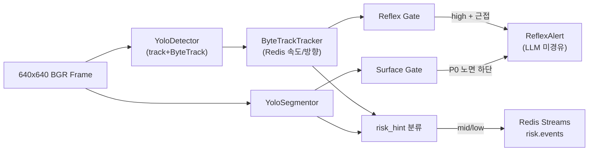

# server/detection YOLO 코드 리뷰 및 분석

> **작성일**: 2026-06-29
> **버전**: v1.0.0
> **분석 대상**: `server/detection/` (3단계 장애물 탐지 파이프라인)
> **설계 기준**: `docs/stage3_detection_design.md`, `.agents/skills/yolo-obstacle-detection/SKILL.md`

---

## 1. 개요

`server/detection/`은 Minchodan 3단계 **이중 경로 물리 분리**의 핵심 모듈이다. 640x640 BGR 프레임을 입력받아 **Yolo 26N Object Detection**, **Yolo 26N Segmentation**, **ByteTrack**, **이중 게이트(Reflex + Surface)** 를 거쳐 반사 경로(`ReflexAlert`) 또는 인지 경로(`DetectionResult` + Redis Streams)로 분기한다.



---

## 2. 모듈 구성

| 파일 | 역할 | 핵심 클래스/함수 | 상태 |
| --- | --- | --- | --- |
| `config.py` | 환경변수·가중치 경로·팩토리 | `get_detector()`, `get_segmentor()` | 양호 |
| `detector_interface.py` | Mock/Yolo 핫스왑 ABC | `DetectorInterface`, `SegmentorInterface` | 양호 |
| `yolo_detector.py` | Object Detection + 내장 추적 | `YoloDetector` | 양호 (개선 여지) |
| `yolo_segmentor.py` | Segmentation | `YoloSegmentor` | 양호 |
| `bytetrack_tracker.py` | Redis 기반 속도/방향 | `ByteTrackTracker` | 양호 (명칭 주의) |
| `mock_detector.py` | 가중치 없을 때 폴백 | `MockDetector`, `MockSegmentor` | 양호 |
| `schemas.py` | Pydantic 계약 | `Detection`, `SurfaceResult`, `ReflexAlert` | 양호 |
| `gates/reflex_gate.py` | 고위험 객체 즉시 경보 | `reflex_gate()` | 양호 |
| `gates/surface_gate.py` | P0 노면 즉시 경보 | `surface_gate()` | 양호 |
| `detection_pipeline.py` | 전체 오케스트레이션 | `DetectionPipeline.run()` | 양호 |
| `__init__.py` | 공개 API export | `__all__` | 양호 |

---

## 3. YOLO 핵심 코드 분석

### 3.1 YoloDetector (`yolo_detector.py`)

| 항목 | 내용 |
| --- | --- |
| **모델 로딩** | `ultralytics.YOLO(weights_path)` — `load()` 성공/실패 bool 반환 |
| **추론 API** | `model.track()` 사용 (`predict()` 아님) |
| **추적 설정** | `persist=True`, `tracker="bytetrack.yaml"` — Ultralytics 내장 ByteTrack |
| **출력 파싱** | `xyxy` → `BBox(x, y, w, h)` 변환, `track_id` = `T-{id:04d}` |
| **방어 코딩** | 모델 미로드 시 `[]`, CUDA OOM 시 CPU 폴백, 무탐지 시 빈 리스트 |

**설계 의도와의 정합성**

- SKILL 문서는 `predict()` + 별도 `ByteTracker` 패키지를 예시로 보여주나, 실제 구현은 **Ultralytics 내장 `track()`** 으로 통합했다. 이는 YOLO 생태계에서 일반적이며 `bytetrack_tracker.py`는 **track_id 부여가 아닌 Redis 기반 속도/방향 계산**에 집중한다.
- `speed`, `direction`, `risk` 필드는 Detector에서 `None`으로 두고, 파이프라인의 `ByteTrackTracker`가 후처리한다.

**개선 제안 (우선순위)**

| 우선순위 | 항목 | 설명 |
| --- | --- | --- |
| P1 | **싱글턴/캐시** | `get_detector()` 호출마다 새 `YoloDetector` 인스턴스 생성 가능. 서버 lifespan에서 1회 로드 후 주입 권장 |
| P2 | **track vs predict 분리** | 인지 경로만 필요한 저FPS 스트림에서는 `predict()`로 추론 비용 절감 가능 |
| P3 | **reflex_gate 방향 연동** | `ByteTrackTracker`가 계산한 `direction`(approaching/departing)을 reflex_gate에 반영하면 정확도 향상 |

### 3.2 YoloSegmentor (`yolo_segmentor.py`)

| 항목 | 내용 |
| --- | --- |
| **추론 API** | `model.predict()` — 분할 전용, 추적 없음 |
| **마스크 처리** | `mask=None` 고정 — centroid만 반환 (대역폭·지연 절감) |
| **centroid** | 마스크 폴리곤 좌표 평균 (`_compute_centroid`) |
| **방어 코딩** | masks 없음 → `[]`, centroid 실패 → `[0.0, 0.0]` |

**개선 제안**

| 우선순위 | 항목 | 설명 |
| --- | --- | --- |
| P2 | **mask 직렬화** | 운영 콘솔 시각화가 필요하면 base64 PNG 옵션 플래그 추가 |
| P3 | **boxes 없는 mask** | `result.boxes`가 None일 때 `cls_id = idx` 폴백 — 클래스 매핑 오류 가능, 로그 추가 권장 |

### 3.3 config.py 팩토리

| 항목 | 내용 |
| --- | --- |
| **경로** | `__file__` 기반 `project_root` + `resolve_path()` — guide 3.3 준수 |
| **환경변수** | `YOLO_CONF`, `YOLO26N_OBJECT_DET`, `YOLO26N_SEG` |
| **디바이스** | `torch.cuda.is_available()` → `cuda` / `cpu` |
| **폴백** | 가중치 없음 또는 로드 실패 → `MockDetector` / `MockSegmentor` |

현재 `server/models/yolo26n/`에는 `.gitkeep`만 존재하므로 **실환경 GPU 없이도 Mock으로 파이프라인 전체가 동작**한다.

---

## 4. 파이프라인 흐름 (`detection_pipeline.py`)

### 4.1 실행 순서

| 단계 | 동작 | 반사/인지 |
| --- | --- | --- |
| 1 | `frame is None` 가드 → `risk_hint="none"` | 인지 |
| 2 | `detector.predict(frame)` | - |
| 3 | `segmentor.predict(frame)` (Detector와 **순차** 실행) | - |
| 4 | `tracker.update()` — Redis 컨텍스트 갱신 | - |
| 5 | `reflex_gate` 순회 — 첫 매칭 시 즉시 `ReflexAlert` 반환 | **반사** |
| 6 | `surface_gate` 순회 — 첫 매칭 시 즉시 `ReflexAlert` 반환 | **반사** |
| 7 | `_classify_risk()` → mid/low 시 Redis 발행 | **인지** |

### 4.2 위험도 분류 규칙 (`_classify_risk`)

| 조건 | `risk_hint` |
| --- | --- |
| 탐지·분할 모두 없음 | `none` |
| `kickboard`, `bollard` 탐지 | `mid` |
| `sidewalk_damaged`, `roadway` 분할 | `mid` |
| 그 외 | `low` |

### 4.3 이중 경로 준수 (Dual Path Discipline)

| 경로 | LLM/RAG/TTS | 구현 상태 |
| --- | --- | --- |
| 반사 (ReflexAlert) | **미경유** — `clip` 경로만 지정 | 준수 |
| 인지 (DetectionResult) | Redis → 5단계 RAG → 6단계 LangGraph | 준수 |

---

## 5. 게이트 분석

### 5.1 Reflex Gate

| 상수 | 값 |
| --- | --- |
| `HIGH_RISK_CLASSES` | `car`, `truck`, `bus`, `motorcycle` |
| `PROXIMITY_THRESHOLD` | 0.15 (프레임 하단 15% 이내) |
| `alert_id` 형식 | `high_{left\|front\|right}` |

방향은 bbox 중심 x좌표 3등분(left/front/right)으로 추정한다. **접근 속도(`approaching`)는 reflex_gate에서 미사용** — 설계서 예시와 차이.

### 5.2 Surface Gate

| 상수 | 값 |
| --- | --- |
| `P0_SURFACE_CLASSES` | `crosswalk`, `manhole`, `stair`, `grating`, `braille_damaged` |
| 하단 임계 | centroid_y > frame_height * 0.6 |
| `alert_id` 형식 | `surface_{class_name}` |

SKILL의 `caution` 통합 클래스 대신 **개별 P0 클래스**로 분리 — C2 노면 클래스 분리 원칙과 일치.

---

## 6. 코딩 패턴 준수 점검

| 가이드 항목 | 준수 | 비고 |
| --- | --- | --- |
| 3.1 UTF-8 헤더 + stdout reconfigure | O | 모든 `.py` 파일 |
| 3.2 임포트 순서 (stdlib → external → local) | O | `yolo_detector.py` 등 |
| 3.3 `__file__` 기반 경로 | O | `config.py` |
| 3.4 `load_dotenv` + `os.getenv` | O | `config.py` |
| 17.2 None 가드레일 | O | pipeline, detector, segmentor |
| 17.2 Mock 폴백 | O | config + mock_detector |
| 17.2 예외 후 루프 유지 | O | tracker per-detection try/except |
| 계층 분리 (Interface → Impl → Pipeline) | O | ABC + 팩토리 패턴 |

---

## 7. 테스트 현황

| 테스트 파일 | 범위 | YOLO 실추론 |
| --- | --- | --- |
| `tests/test_detection.py` | 스키마, Mock, 게이트, 파이프라인, YoloDetector 로드 실패 | **미포함** (Mock 기반) |

| TC 영역 | 검증 내용 | 합격 기준 |
| --- | --- | --- |
| Schemas | BBox, Detection 직렬화 | model_dump 정합 |
| Gates | reflex high_risk+하단, surface P0 | alert_id/direction |
| Pipeline | None 프레임, reflex/surface 분기, mid Redis 발행 | 타입·risk_hint |
| Robustness | detector/segmentor/tracker 예외 | 파이프라인 영속성 |
| YoloDetector | 존재하지 않는 가중치 | `load() == False` |

**미커버 영역**: 실제 `.pt` 가중치 추론, 80ms 지연 SLA, CUDA OOM 폴백 E2E, segmentation 클래스 C2 정합.

---

## 8. 종합 평가

| 평가 항목 | 점수 | 코멘트 |
| --- | --- | --- |
| **아키텍처 정합** | A | 이중 게이트·반사/인지 분리·Mock 폴백이 설계서와 일치 |
| **방어적 코딩** | A | None/빈 리스트/OOM/Redis 실패 모두 처리 |
| **코딩 패턴** | A | course_codebase_guide 핵심 항목 준수 |
| **성능 최적화** | B | 순차 추론, 모델 싱글턴 미적용, mask 미전송 |
| **테스트 커버리지** | B+ | Mock 기반 충실, GPU 실추론 테스트 없음 |
| **운영 준비도** | B | 가중치 파일 미배포 시 Mock만 동작 |

### 권장 후속 작업

| 순서 | 작업 | 담당 영역 |
| --- | --- | --- |
| 1 | `object_detection.pt`, `segmentation.pt` 배포 | `server/models/yolo26n/` |
| 2 | FastAPI lifespan에서 detector/segmentor 1회 로드 | `server/api/` |
| 3 | `@pytest.mark.gpu` 실추론 스모크 테스트 추가 | `tests/` |
| 4 | reflex_gate에 `approaching` 방향 조건 추가 | `gates/reflex_gate.py` |
| 5 | 반사/인지 스트림 FPS 차이 반영 (track vs predict) | `yolo_detector.py` |

---

## 9. 실행 방법

```bash
# 프로젝트 루트에서 (venv 활성화 후)
python -m pytest tests/test_detection.py -v

# 개별 모듈 스모크 (Mock 폴백)
python -c "
from server.detection.config import get_detector, get_segmentor
import numpy as np
frame = np.zeros((640, 640, 3), dtype=np.uint8)
det = get_detector()
seg = get_segmentor()
print('detector:', type(det).__name__, 'dets:', len(det.predict(frame)))
print('segmentor:', type(seg).__name__, 'surfs:', len(seg.predict(frame)))
"
```

---

## 10. 참고 문서

| 문서 | 경로 |
| --- | --- |
| 3단계 설계서 | `docs/stage3_detection_design.md` |
| 에이전트 스킬 | `.agents/skills/yolo-obstacle-detection/SKILL.md` |
| 테스트 명세 | `docs/test_specification.md` |
| API 계약 | `docs/api_specification.md` |
